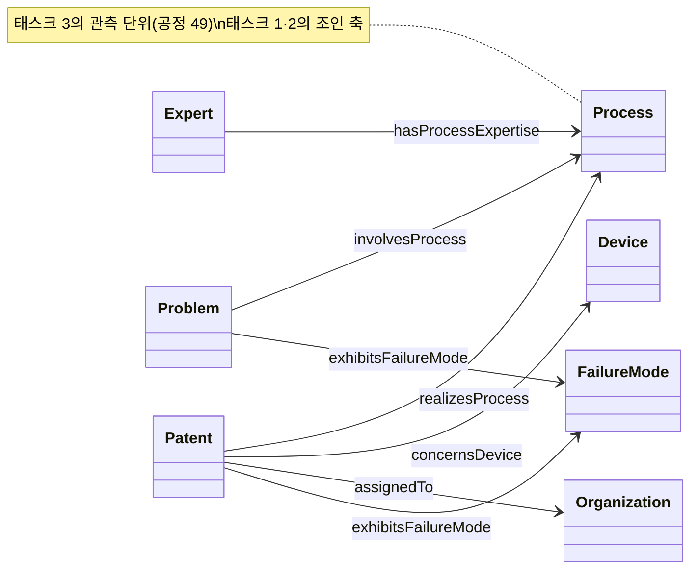
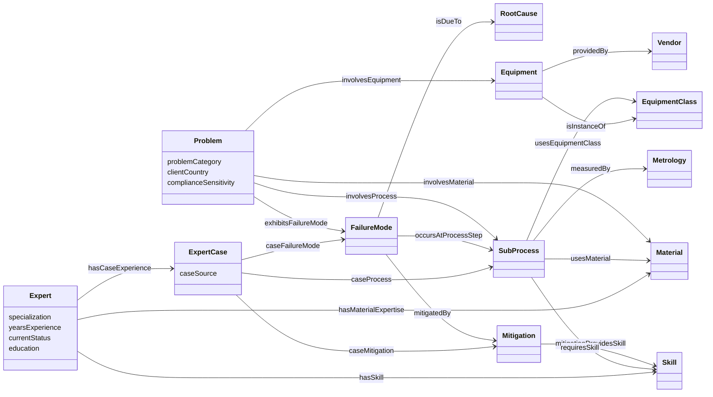
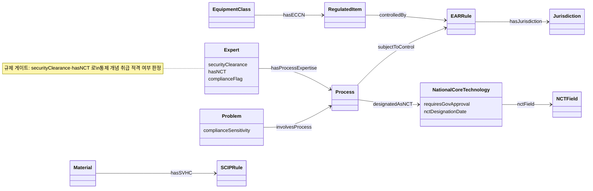
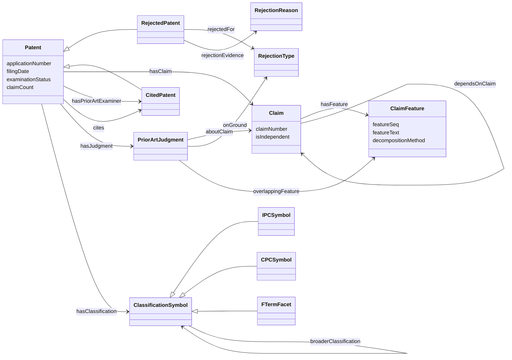
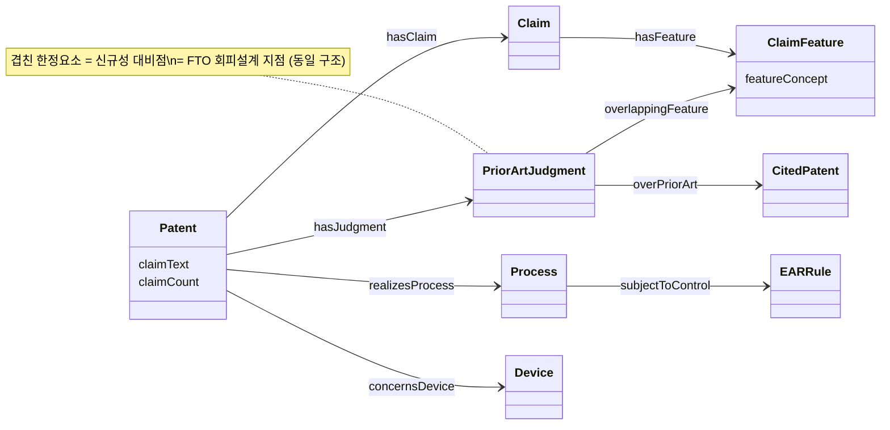
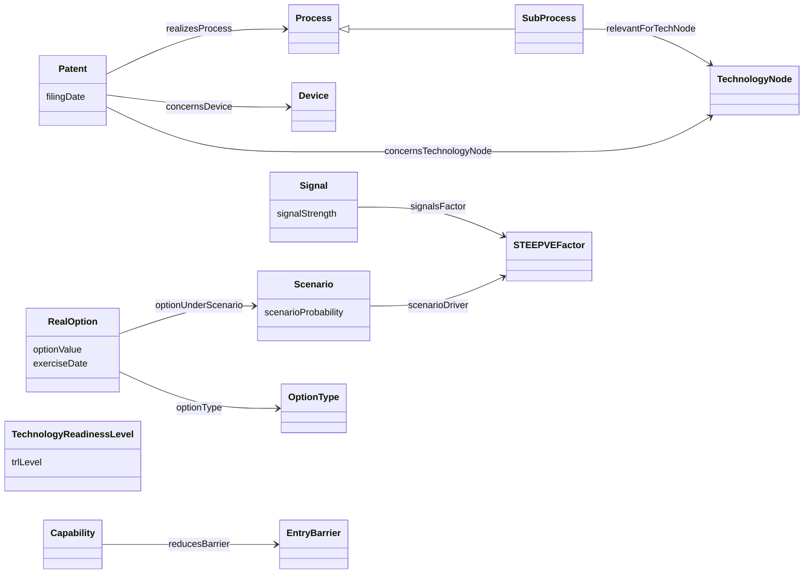

# SPEC-005 · T-Box 온톨로지 설계서 (태스크 지향)

| | |
|---|---|
| 지지하는 것 | RQ1·RQ2·RQ3 전체의 어휘 근거 / 논문 §3(명시적 지식 표현) · §4(CQ 도출) |
| 구현(정본) | `data/external/sdkb/*.ttl` (벤더 스냅샷 · SDKB 커밋 `d578bf3`) |
| 조립 순서 | [`src/sdkb_paper/ontology/baseline.py`](../../src/sdkb_paper/ontology/baseline.py) `BASELINE_PARTS` |
| 검증 | `queries/cq/*.rq` (28개) · `queries/shapes/` (SHACL) · `make gate` |

> **이 문서는 T-Box(스키마)를 *설명*하는 참조 문서이지 스키마를 *정의*하지 않는다.**
> 클래스·속성의 정본은 실물 TTL 이다. 이 문서의 모든 어휘는 위 TTL 에서 그대로 뽑았고,
> **여기서 새 어휘를 만들지 않는다**(CLAUDE.md §1.5). TTL 과 이 문서가 어긋나면 **TTL 이 옳다** —
> 발견 즉시 상류 SDKB 에서 고치고 이 문서를 갱신한다.
>
> **서명 수치(트리플·인스턴스 수)는 이 문서에 싣지 않는다.** 정본은
> [CANONICAL-INDEX.md](../CANONICAL-INDEX.md) §1 이다. T-Box 는 G₀·G₁·G₂ 가 **한 벌을 공유**하므로,
> 버전 차이는 스키마가 아니라 A-Box(특허 인스턴스)에서만 난다.

---

## 0. 표기 규약

| prefix | IRI | 뜻 |
|---|---|---|
| `ont:` | `https://w3id.org/sdkb/ont/` | SDKB 온톨로지 어휘(TBox) |
| `data:` | `https://w3id.org/sdkb/data/` | 인스턴스(ABox) — 회사 하나 = `data:organization/` IRI 하나 |
| `gov:` | `https://w3id.org/sdkb/gov/` | 거버넌스·수출통제 어휘 (코어 7클래스는 `build_owl.py` 가 `sdkb-core.ttl` 에 생성) |
| `skos:` `owl:` `xsd:` | 표준 | — |

- **라벨 규약은 `skos:prefLabel`** (회사당·언어당 하나). `rdfs:label` 은 TBox 정의용.
- Mermaid `classDiagram`: 실선 화살표 = ObjectProperty(관계), 클래스 박스 안 속성 = DatatypeProperty.
  `<|--` = `rdfs:subClassOf`. union domain/range 는 표에 `A ∪ B` 로 적는다.

---

## 1. 모듈 지도 — 8개 스키마 파일 ↔ 태스크

T-Box 는 8개 TTL 로 나뉜다. 세 태스크가 어느 파일을 쓰는지의 지도다. 이 문서의 태스크 정의는
**규제를 별도 태스크로 떼지 않는다** — 수출통제는 §2 매칭의 *제약*으로, FTO 는 §3 선행기술조사의
*목적*으로 각 태스크 안에 통합돼 있다.

| 파일 | 축 | 태스크 1 매칭(수출통제 인지) | 태스크 2 선행기술(FTO) | 태스크 3 예측 |
|---|---|:--:|:--:|:--:|
| `sdkb-core.ttl` | 공정·소자·재료·장비·문제·전문가 | ● | ○(공정링크) | ● |
| `sdkb-patent.ttl` | 특허·청구항·거절·선행기술 | ○(특허↔문제) | ● | ●(시계열) |
| `sdkb-governance*.ttl` | 규제·수출통제·NCT | ●(매칭 제약) | ●(포트폴리오 노출) | ○ |
| `sdkb-foresight.ttl` | STEEPVE·시나리오·리얼옵션 | | | ● |
| `sdkb-commercialization.ttl` | TRL·라이선싱 | | ○(라이선싱) | ● |
| `sdkb-rbv.ttl` | 자원기반관점(VRIO·역량·진입장벽) | ○ | | ● |

● 핵심 · ○ 보조. 공정(`ont:Process`/`ont:SubProcess`)·소자(`ont:Device`)·조직(`ont:Organization`)은
**세 태스크의 공용 중심축**이라 §5 에 따로 뺀다.

---

## 2. 태스크 1 · 소부장 기술문제 전문가 매칭 (수출통제 규제 인지)

### 2.1 무엇을 답하는가
소부장(소재·부품·장비) 중소기업이 제기한 **기술문제**(`ont:Problem`)를, 그 문제가 걸린
**공정·장비·재료·실패양상**을 경유해 그것을 다뤄본 **전문가**(`ont:Expert`)에게 잇는다.
연결 사슬은 **문제 → (공정/장비/재료/실패) → 사례경험/스킬 → 전문가**다.

**단, 매칭은 규제 인지적이다.** 문제가 걸린 개념이 수출통제·국가핵심기술(NCT)에 해당하면,
매칭은 그 제약 아래에서만 성립한다 — 통제 개념(`gov:subjectToControl`)에 걸린 문제는
적격 전문가(보안등급·NCT 취급자격을 갖춘)에게만, 승인 요건(`requiresGovApproval`)을 병기해
연결한다. 즉 §2.4 의 매칭 사슬 위에 §2.6 의 **규제 게이트**가 얹힌다.

### 2.2 클래스 다이어그램

### 2.3 클래스

| 클래스 | 상위 | 설명 |
|---|---|---|
| `ont:Problem` | — | 소부장 SME 가 제기한 기술문제(소부장 실문제) |
| `ont:Expert` | — | 큐레이션된 역량 프로필을 가진 도메인 전문가(인력 축) |
| `ont:ExpertCase` | — | 전문가의 사례경험 실체화 — 공정+실패양상+근본원인+대응을 묶음 |
| `ont:FailureMode` | — | 제조에서 관측된 결함·실패양상 |
| `ont:RootCause` | — | 실패양상의 근본원인 |
| `ont:Mitigation` | — | 실패양상에 대한 시정·예방 조치 |
| `ont:Skill` | — | 공정·대응에 요구되는 인간 역량 |
| `ont:Material` | — | 제조에 쓰이는 원료·화학물질·물질 |
| `ont:Equipment` | — | 특정 장비 인스턴스(모델/벤더) |
| `ont:EquipmentClass` | — | 장비 범주 |
| `ont:EquipmentModel` | — | 상용 장비 모델(벤더 제품 라인) |
| `ont:Metrology` | — | 계측·검사 방법 |
| `ont:SubProcess` | `ont:Process` | 공정 내 세부 단계(습식식각·플라즈마식각 …) |
| `ont:Vendor` | — | 장비·재료 공급사/제조사 |

### 2.4 속성 (관계 · ObjectProperty)

| 속성 | 도메인 | 치역 | 의미 |
|---|---|---|---|
| `ont:involvesProcess` | `Problem` | `Process` | 문제가 걸린 공정 |
| `ont:involvesEquipment` | `Problem` | `Equipment ∪ EquipmentClass ∪ Metrology` | 문제가 지목한 장비 |
| `ont:involvesMaterial` | `Patent ∪ Problem` | `Material` | 문제/특허가 다루는 재료 |
| `ont:exhibitsFailureMode` | `Patent ∪ Problem` | `FailureMode` | 문제/특허가 드러내는 실패양상 |
| `ont:isDueTo` | `FailureMode` | `RootCause` | 실패→근본원인 인과 |
| `ont:mitigatedBy` | `FailureMode ∪ RootCause` | `Mitigation` | 실패/원인의 대응 조치 |
| `ont:occursAtProcessStep` | `FailureMode` | `SubProcess` | 실패가 관측된 공정 단계 |
| `ont:mitigationProvidesSkill` | `Mitigation` | `Skill` | 대응이 요구·부여하는 역량 |
| `ont:requiresSkill` | `SubProcess ∪ Mitigation` | `Skill` | 단계/대응에 필요한 역량 |
| `ont:usesMaterial` | `SubProcess` | `Material` | 단계가 쓰는 재료 |
| `ont:usesEquipmentClass` | `SubProcess` | `EquipmentClass` | 단계가 쓰는 장비 범주 |
| `ont:measuredBy` | `SubProcess` | `Metrology` | 단계의 계측 방법 |
| `ont:hasMeasuredProperty` | `SubProcess` | `MaterialProperty` | 계측 대상 물성 |
| `ont:incompatibleWith` | `SubProcess ∪ EquipmentClass ∪ Material` | `Material` | 재료 비호환 |
| `ont:hasSkill` | `Expert` | `Skill ∪ Mitigation` | 전문가 보유 역량 |
| `ont:hasMaterialExpertise` | `Expert` | `Material` | 전문가 재료 전문성 |
| `ont:hasProcessExpertise` | `Expert` | `Process ∪ TechnologyNode` | 전문가 공정 전문성 |
| `ont:hasEquipmentExperience` | `Expert` | (장비 경험 blank) | 전문가 장비 실무경험 |
| `ont:hasCaseExperience` | `Expert` | `ExpertCase` | 전문가 사례경험 |
| `ont:caseProcess` | `ExpertCase` | `Process ∪ SubProcess` | 사례가 다룬 공정 |
| `ont:caseFailureMode` | `ExpertCase` | `FailureMode` | 사례의 실패양상 |
| `ont:caseRootCause` | `ExpertCase` | `RootCause` | 사례의 근본원인 |
| `ont:caseMitigation` | `ExpertCase` | `Mitigation` | 사례의 대응 |
| `ont:isInstanceOf` | `Equipment` | `EquipmentClass` | 장비→범주 |
| `ont:providedBy` | `Equipment` | `Vendor` | 장비→공급사 |
| `ont:madeBy` | `Material` | `Vendor` | 재료→벤더 |

주요 DatatypeProperty(전문가 매칭 근거): `ont:specialization` · `ont:yearsExperience` ·
`ont:currentStatus` · `ont:consultingAvailability` · `ont:education` · `ont:hasCertification` ·
`ont:problemCategory` · `ont:complianceSensitivity`. 전문가 프로필 datatype 은
비식별 프로토콜(§1.5)에 따라 synthetic/altered 다 — 값 자체가 실인물 주장을 하지 않는다.

### 2.5 관련 CQ

| CQ | 질문 | 핵심 어휘 |
|---|---|---|
| CQ11 | 공정 스킬을 가진 전문가 | `requiresSkill` · `hasSkill` |
| CQ12 | 문제→공정→장비→전문가 | `involvesProcess` · `usesEquipmentClass` · `hasProcessExpertise` |
| CQ15 | 실패 인과 사슬 | `exhibitsFailureMode` · `isDueTo` · `mitigatedBy` |
| CQ16 | 재료 비호환 | `incompatibleWith` |
| CQ17 | 재료 문제 전문가 | `involvesMaterial` · `hasMaterialExpertise` |
| CQ18 | 스킬별 특허 | `concernsSkill` · `requiresSkill` |
| CQ20 | 장비별 전문가 | `hasEquipmentExperience` · `isInstanceOf` |
| CQ28 | 특허→실패양상→전문가 | `exhibitsFailureMode` · `caseFailureMode` |
| CQ13·14·19 | 밸류체인 벤더 포트폴리오·역할분포·공정제어 | `providedBy` · `madeBy` · `measuredBy` |
| CQ23 | 개념이 받는 수출통제·통제수준·관할 | `subjectToControl` · `controlLevel` · `hasJurisdiction` |
| CQ24 | 국가핵심기술(NCT) 지정 개념 | `designatedAsNCT` · `requiresGovApproval` |
| CQ25 | CRITICAL 수준 통제 개념 | `subjectToControl` · `controlLevel="CRITICAL"` |

### 2.6 수출통제 규제 인지 매칭

매칭 사슬 위에 얹히는 **규제 게이트**다. 두 갈래로 붙는다 — (a) **문제/개념 쪽**: 문제가 걸린
기술개념이 통제 대상인가, (b) **전문가 쪽**: 전문가가 그 통제 개념을 다룰 자격이 있는가.

| 어휘 | 종류 | 도메인 → 치역 | 매칭에서의 역할 |
|---|---|---|---|
| `gov:subjectToControl` | ObjProp | 개념(공정·소자·장비·재료·계측·테크노드) → 통제(`EARRule`/`KRIndustrialTechRule`/`NationalCoreTechnology`) | 문제가 걸린 개념이 통제 대상인지 |
| `gov:controlLevel` | DataProp | 통제 → `xsd:string` | CRITICAL/HIGH/MEDIUM/LOW — 매칭 민감도 |
| `gov:hasJurisdiction` | ObjProp | 통제 → 관할(US/KR/WASSENAAR …) | 다중관할 노출 |
| `gov:designatedAsNCT` | ObjProp | 개념 → `NationalCoreTechnology` | 산업기술보호법 제11조 대상 |
| `gov:requiresGovApproval` | DataProp | `NationalCoreTechnology` → `xsd:boolean` | 해외 이전 시 산업부 승인 필요 |
| `ont:hasECCN` | ObjProp | `EquipmentClass` → `gov:RegulatedItem` | 장비 ECCN 분류 |
| `ont:controlledBy` | ObjProp | `gov:RegulatedItem` → `gov:EARRule` | 품목→규정 |
| `ont:hasSVHC` | ObjProp | `Material` → `gov:SCIPRule` | 재료 SVHC 신고 |
| `ont:securityClearance` | DataProp | `Expert` → `xsd:string` | 전문가 보안등급(none…top_secret) |
| `ont:hasNCT` | DataProp | `Expert` → `xsd:boolean` | 전문가 프로필이 NCT 영역 접촉 |
| `ont:complianceFlag` | DataProp | `Expert` → `xsd:boolean` | 컴플라이언스 심사 대상 여부 |
| `ont:complianceSensitivity` | DataProp | `Problem` → `xsd:string` | 문제 공개 민감도(public/restricted/confidential) |

거버넌스 클래스: `gov:EARRule`·`gov:RegulatedItem`·`gov:SCIPRule`·`gov:StandardReference`·
`gov:NISTFunction`·`gov:NISTOutcome`·`gov:EquipmentState`(코어 7종, `sdkb-core.ttl` 에 생성) +
`gov:KRIndustrialTechRule`·`gov:NationalCoreTechnology`·`gov:NCTField`(`sdkb-governance-kr.ttl`).

> **`subjectToControl` 의 도메인은 열려 있다(설계).** 어느 축의 개념이든 통제에 걸 수 있어야 하므로
> 고정 도메인을 주지 않는다 — 고정하면 주체를 강제 타입해 정합성을 깬다(이 저장소가 이미 치른 버그).

### 2.7 재응용 노트
- **원칙**: 특허가 드러내는 문제는 모두 공식 문제로 취급한다 — 버리지 말고 기존 클래스에 재배치하거나
  정의를 추가한다(어휘 발명 0). `ont:exhibitsFailureMode` 가 특허·문제 양쪽 도메인을 갖는 것이 그 축이다.
- 매칭 랭킹(스코어링)은 **분석층**의 몫이다. T-Box 는 매칭에 필요한 *연결*만 제공하고, 가중치·순위는
  질의/코드가 계산한다(§5.2 "응답의 옳음은 보장하지 않는다").
- **규제 게이트도 T-Box 는 연결만 준다** — "이 전문가를 이 통제 문제에 붙여도 되는가"의 최종 판정은
  기관 컴플라이언스 정책이 내린다. 온톨로지는 통제 여부·수준·자격 속성을 *가시화*할 뿐이다.

---

## 3. 태스크 2 · 선행기술조사 (FTO 포함)

### 3.1 무엇을 답하는가
심사대상 특허(거절/등록/계류)를 **청구항→한정요소→개념**으로 분해하고, 심사관이 인용한
**선행기술**(`ont:CitedPatent`)과 **개념 오버랩**으로 잇는다. 정답 라벨은 심사관 인용
(`ont:hasPriorArtExaminer`), 후보 검색축은 분류코드(IPC/CPC/F-term)와 개념(feature)이다.

**이 태스크는 FTO(Freedom To Operate)를 목적으로 설계됐다.** 선행기술조사는 신규성·진보성 대비의
기술이면서, 동시에 **회피설계의 기초**다 — 같은 청구항·한정요소 분해가 (a) 어느 선행기술과 겹치는가
(신규성)와 (b) 어느 타사 청구항을 침해할 위험이 있는가(FTO)를 **한 구조로** 지지한다. 그래서 §3.6 은
청구항 자기완결성(FTO 준비도)과 포트폴리오의 수출통제 노출을 별도 소절로 둔다.

### 3.2 클래스 다이어그램

### 3.3 클래스

| 클래스 | 상위 | 설명 |
|---|---|---|
| `ont:Patent` | `prov:Entity` | 심사대상 출원 또는 등록특허. 하위가 심사결과를 인코딩 |
| `ont:RejectedPatent` | `ont:Patent` | 거절결정 받은 출원 |
| `ont:GrantedPatent` | `ont:Patent` | 등록/설정된 특허 |
| `ont:PendingPatent` | `ont:Patent` | 심사중 출원 |
| `ont:CitedPatent` | `ont:Patent` | 심사관이 선행기술로 인용한 특허(선행기술조사 정답지) |
| `ont:Claim` | — | 특허의 청구항 1건. 독립항이 신규성/진보성 대비 단위 |
| `ont:ClaimFeature` | — | 청구항의 한정요소 하나. 규칙+LLM 분해 산출, 개념에 정규화 |
| `ont:PriorArtJudgment` | — | 심사관 선행기술 판단 1건(어느 청구항이·어느 선행기술에·어느 근거로) |
| `ont:RejectionType` | `skos:Concept` | 거절 범주 통제어휘(§29① 신규성 / §29② 진보성) |
| `ont:RejectionReason` | — | 인용 근거·근거문을 담는 거절이유 |
| `ont:ClassificationSymbol` | — | 분류코드 추상 상위(IPC/CPC/F-term) |
| `ont:IPCSymbol` / `ont:CPCSymbol` / `ont:FTermFacet` | `ont:ClassificationSymbol` | 각 분류체계 코드 |
| `ont:NoveltyScore` | — | 특허에 부착되는 신규성 평가 |
| `ont:TopicCluster` | — | 초록/청구항 NLP 로 도출한 토픽 군집 |

### 3.4 속성 (관계 · ObjectProperty)

| 속성 | 도메인 | 치역 | 의미 |
|---|---|---|---|
| `ont:hasClaim` | `Patent` | `Claim` | 특허→청구항 |
| `ont:hasFeature` | `Claim` | `ClaimFeature` | 청구항→한정요소 |
| `ont:dependsOnClaim` | `Claim` | `Claim` | 종속항→부모 청구항 |
| `ont:dependsOnFeature` | `ClaimFeature` | `ClaimFeature` | '상기 X' 역참조 |
| `ont:featureConcept` | `ClaimFeature` | `Process ∪ SubProcess ∪ Device ∪ Material ∪ Skill ∪ FailureMode ∪ EquipmentClass` | 한정요소→SDKB 개념(언어중립 대비축) |
| `ont:hasPriorArtExaminer` | `Patent` | (특허/NPL) | 심사관 인용 선행기술 — **정답 신호** |
| `ont:hasPriorArtApplicant` | `Patent` | (특허/NPL) | 출원인 자진 개시 선행기술 |
| `ont:hasPriorArt` | `Patent` | (특허/NPL) | 일반 선행기술 링크 |
| `ont:cites` | `Patent` | `Patent` | 특허 간 인용 |
| `ont:hasJudgment` | `Patent` | `PriorArtJudgment` | 특허→선행기술 판단 |
| `ont:aboutClaim` | `PriorArtJudgment` | `Claim` | 거절 대상 청구항 |
| `ont:overPriorArt` | `PriorArtJudgment` | (특허/NPL) | 대비된 인용 선행기술 |
| `ont:onGround` | `PriorArtJudgment` | `RejectionType` | 판단 근거(§29①/②) |
| `ont:overlappingFeature` | `PriorArtJudgment` | `ClaimFeature` | 겹친다고 도출된 한정요소 |
| `ont:rejectedFor` | `RejectedPatent` | `RejectionType` | 거절 사유 범주 |
| `ont:rejectionEvidence` | `RejectedPatent` | `RejectionReason` | 인용문/근거 |
| `ont:hasClassification` | `Patent` | `ClassificationSymbol` | 특허→분류코드 |
| `ont:hasIPC`/`hasCPC`/`hasFTerm` | `Patent` | 각 코드 | 체계별 단축 |
| `ont:broaderClassification` | `ClassificationSymbol` | `ClassificationSymbol` | 분류 상위 |

주요 DatatypeProperty: `ont:applicationNumber`(키) · `ont:filingDate`(`xsd:date`) ·
`ont:examinationStatus` · `ont:claimCount` · `ont:claimText` · `ont:featureText` ·
`ont:decompositionMethod`(rule|llm — 정직성 표기) · `ont:rejectionPassage`.

> **선행기술 인용은 매달린 IRI 다.** `ont:CitedPatent` 는 정답 라벨이지 개념 노드가 아니다 —
> 그래프-내 개념 도달성은 feature/분류 경유로만 성립한다. in-corpus 전문(full-text) 검색 성능은
> 별도 코퍼스의 몫이고 이 T-Box 는 **정답지와 개념 축**만 제공한다(논문 §8.3).

### 3.5 관련 CQ

| CQ | 질문 | 핵심 어휘 |
|---|---|---|
| CQ09 | 거절 특허의 인용 선행기술 | `rejectedFor` · `hasPriorArtExaminer` |
| CQ10 | 개념 공유 선행기술 후보 | `featureConcept` · `hasClassification` (RQ2 직접 증거) |
| CQ22 | 특허 장비·테크노드 | `concernsEquipment` · `concernsTechnologyNode` |

### 3.6 FTO — 회피설계와 포트폴리오 노출

선행기술조사의 청구항 분해를 **침해 위험 분석**으로 돌려 쓴다. 핵심 관측은
**`ont:PriorArtJudgment` + `ont:overlappingFeature`** — 심사관이 "겹친다"고 도출한 한정요소가,
FTO 관점에서는 *회피해야 할 지점*이다. 이 오버랩 구조가 신규성(선행기술 대비)과 침해위험(FTO)을
같은 어휘로 지지한다.

| CQ | 질문 | 핵심 어휘 | FTO 역할 |
|---|---|---|---|
| CQ27 | FTO 청구항 준비도(출원인별 청구항 자기완결 특허 수) | `claimText` · `claimCount` · `assignedTo` | 회피설계 기초 청구항이 그래프에 있는가 |
| CQ26 | 통제 대상 공정·소자를 구현하는 특허(포트폴리오 노출) | `realizesProcess`/`concernsDevice` + `subjectToControl` · `controlLevel` | 라이선싱·기술이전 시 수출통제 노출 |

**FTO 자기완결성.** CQ27 은 청구항 전문이 그래프에 실체화(`claimText`·`hasClaim`·`hasFeature`)돼
있어야 태스크 시점에 **재수집 없이** FTO 분석이 가능함을 검사한다 — 청구항 축이 있는 코퍼스(G₁·G₂)만
이 CQ 를 통과하므로, 배터리가 코퍼스를 판별하는 증거이기도 하다(CLAUDE.md §5 L3).

### 3.7 재응용 노트
- **n-항 관계 실체화 패턴**: `ont:PriorArtJudgment` 는 (청구항 · 선행기술 · 근거)를 노드로 묶는다.
  무효심판·FTO 침해분석 등 타 도메인에 그대로 재사용 가능한 패턴이다.
- 검색·랭킹(retrieval)은 T-Box 밖이다. 개념 오버랩을 후보로 *제안*할 뿐, 정답 판정은
  `hasPriorArtExaminer` 대조로 분석층이 한다.
- **FTO 판정도 T-Box 밖이다.** 침해 여부의 법적 판단은 온톨로지가 하지 않는다 — 겹칠 *가능성 있는*
  한정요소·청구항을 가시화할 뿐이고, 청구항 단위 침해 판단은 변리사·분석층이 한다.

---

## 4. 태스크 3 · 기술예측

> **라벨 주의 (v0.9).** 이 절과 §4.4/§4.5의 "H1"·"H2"는 **구 커버리지/시계열 패러다임 라벨**이며
> v0.9에서 **S1(구 커버리지)·S2(구 시계열)** 로 읽는다 — C1의 2차 재사용 증거이지 v0.9 확증 가설
> H1–H5가 아니다. 기준: [../RECONCILIATION-v09.md](../RECONCILIATION-v09.md) §1 라벨 사전.

### 4.1 무엇을 답하는가
공정·소자 **개념 단위 시계열**(특허 출원일 기준)로 부상 신호를 읽고, 명칭·코드가 생기기 전
**조합 개념**(∧/∨)으로 신흥기술을 조기 포착한다(S2 구 시계열 H2). 나아가 STEEPVE 시나리오·리얼옵션·TRL·
자원기반관점으로 **투자 의사결정** 어휘를 확장한다.

### 4.2 클래스 다이어그램

### 4.3 클래스

**핵심(개념 시계열):** `ont:Process` · `ont:SubProcess` · `ont:Device` · `ont:TechnologyNode` +
`ont:Patent`(`filingDate` 로 시계열). 개념 축 = **Process ∪ Device**(S2 구 시계열 H2 사례가 공정만이 아니라
디바이스 아키텍처이므로 둘 다 포함).

**Foresight 모듈(`sdkb-foresight.ttl`):**

| 클래스 | 설명 |
|---|---|
| `ont:Scenario` | 미래 상태 서사(투자 스트레스테스트) |
| `ont:STEEPVEFactor` | 동인 범주(Social/Tech/Econ/Env/Political/Values/Ethical) |
| `ont:Signal` | 약신호 — 요인이 실현되는 조기 지표 |
| `ont:RealOption` | 기술투자 옵션(연기·확장·전환·포기·축소·단계) |
| `ont:OptionType` | 리얼옵션 유형(통제어휘) |

**상용화(`sdkb-commercialization.ttl`):** `ont:TechnologyReadinessLevel`(TRL 1–9) ·
`ont:License`/`ont:Assignment`(`ont:IPTransaction` 하위) · `ont:Spinoff` · `ont:FundingProgram`.

**자원기반관점(`sdkb-rbv.ttl`):** `ont:Firm`(`ont:Organization` 하위) · `ont:Resource`
(Tangible/Intangible/Human) · `ont:Capability` · `ont:EntryBarrier` · `ont:MarketSegment` ·
`ont:ResourceCombination`(fsQCA truth-table row).

### 4.4 속성 (관계)

| 속성 | 도메인 | 치역 | 의미 |
|---|---|---|---|
| `ont:realizesProcess` | `Patent` | `Process` | 특허↔공정(S1 구 커버리지의 링크) |
| `ont:concernsDevice` | `Patent` | `Device` | 특허↔소자 아키텍처 |
| `ont:concernsTechnologyNode` | `Patent` | `TechnologyNode` | 특허↔기술세대(7nm …) |
| `ont:relevantForTechNode` | `SubProcess` | `TechnologyNode` | 단계↔세대 |
| `ont:hasSubprocess` | `Process` | `SubProcess` | 공정 계층 |
| `ont:scenarioDriver` | `Scenario` | `STEEPVEFactor` | 시나리오 동인 |
| `ont:signalsFactor` | `Signal` | `STEEPVEFactor` | 약신호→요인 |
| `ont:hasRealOption` | (TechNode/Process/Capability) | `RealOption` | 개념에 리얼옵션 부착 |
| `ont:optionUnderScenario` | `RealOption` | `Scenario` | 옵션의 전제 시나리오 |
| `ont:hasTRL` | (Process/TechNode/Patent/Capability) | `TechnologyReadinessLevel` | TRL 부여 |
| `ont:enablesCapability` | `Resource` | `Capability` | 자원→역량 |
| `ont:reducesBarrier` | `Capability` | `EntryBarrier` | 역량→진입장벽 완화 |

주요 DatatypeProperty: `ont:filingDate`(시계열 축) · `ont:scenarioProbability` ·
`ont:signalStrength` · `ont:optionValue`(리얼옵션 가치, KRW) · `ont:trlLevel` · `ont:vrioValue`.

### 4.5 관련 CQ

| CQ | 질문 | 핵심 어휘 |
|---|---|---|
| CQ01 | 공정 단계별 특허 수 | `realizesProcess` (S1 구 커버리지) |
| CQ02 | 특정 시점 이후 출원 | `filingDate` |
| CQ03 | 특허 없는 공정 단계 | `realizesProcess` (S1 커버리지 공백) |
| CQ04 | 개념(공정∪소자)별 연도 시계열 | `filingDate` · `concernsDevice` (S2 최소단위) |
| CQ05 | IPC 단위 연도 시계열 | `hasIPC` (S2 대조군/진단 D1) |
| CQ06 | 최근 5년 출원 전무 개념 | `filingDate` (S1 커버리지 공백) |
| CQ07 | 소자↔공정 교차 | `concernsDevice` · `realizesProcess` |
| CQ08 | 출원인별 공정 포트폴리오 | `assignedTo` · `realizesProcess` |

### 4.6 재응용 노트
- **신규성 축**: 개념을 코드·명칭 이전에 정의하는 능력이 S2(구 시계열 H2)의 존재증명이다. 시계열·리드타임의
  대조군은 **시점 유효한 명칭 키워드**이고, 조합 정의(∧/∨)는 **분석층 텍스트매칭**이라 트리플이
  아니다 — T-Box 는 개념(Process∪Device)과 `filingDate` 만 제공한다.
- foresight/commercialization/RBV 모듈은 대부분 **TBox 는 있으나 G₀ 인스턴스가 희소**하다 —
  기술기획·투자 의사결정 재응용의 확장점이다(스키마는 준비됨, ABox 는 후속).

---

## 5. 공용 중심축 — 세 태스크가 공유하는 어휘

| 클래스 | 태스크 1 | 태스크 2 | 태스크 3 | 역할 |
|---|:--:|:--:|:--:|---|
| `ont:Process` / `ont:SubProcess` | ● | ● | ● | 조인 축 · H1 관측 단위(공정 49) |
| `ont:Device` | | ● | ● | 개념 축(H2) · 특허 대상 |
| `ont:Organization` | ● | ● | ● | **회사 하나 = `data:organization/` IRI 하나**. 역할은 `rdf:type` |
| `ont:Patent` | ○ | ● | ● | 세 태스크의 증거 단위 |
| `ont:TechnologyNode` | ○ | ● | ● | 기술세대 |

> **회사 정체성 규약**(§6.2·회사 병합): 공급사·출원인은 IRI 접두사가 아니라 `rdf:type` 으로
> 구분한다. IRI/prefLabel 을 역할로 쪼개면 CQ 가 같은 회사를 다시 분리한다.

---

## 6. 보장하는 것 / 보장하지 않는 것

**보장하는 것**
- 이 문서의 모든 클래스·속성은 `data/external/sdkb/*.ttl` 에 **실재**한다(어휘 발명 0).
- 세 태스크의 CQ 가 요구하는 그래프 패턴은 위 어휘로 **표현 가능**하다 — CQ↔어휘 매핑이 §2.5·§3.5·§4.5.
- T-Box 는 G₀·G₁·G₂ 가 **한 벌을 공유**한다 — 버전 차이는 A-Box 에서만 난다.

**보장하지 않는 것**
- **인스턴스 수·커버리지·통계.** 이 문서는 스키마만 설명한다. 수치 정본은 CANONICAL-INDEX §1.
- **응답의 옳음·매칭 랭킹.** T-Box 는 연결만 제공하고, 스코어링·검색·순위는 분석층의 몫이다.
- **어휘의 완전성.** 세 태스크가 SDKB 어휘를 남김없이 덮는다는 보장은 없다 — 미사용 어휘는
  어휘 검증 커버리지(§5.2)가 진단으로 측정한다.
- **규제·FTO 의 법적 판단.** 수출통제(§2.6)·FTO(§3.6)는 매칭·선행기술조사 태스크 *안에* 통합돼
  통제 여부·겹침 가능성을 **가시화**하지만, 적격/침해의 최종 판정은 기관 컴플라이언스·변리사의 몫이다.
  `gov:` 어휘·CQ23–27 의 도출 근거는 [SPEC-004](SPEC-004-cq-derivation-protocol.md)·PLAN-015 를 따른다.

---

## 부록 · 참조

- 어휘 용어집: [GLOSSARY-ONTOLOGY.md](../GLOSSARY-ONTOLOGY.md)
- CQ 계약: 현행 28개는 [SPEC-004](SPEC-004-cq-derivation-protocol.md) · 초기 K=8 설계 근거는 [archive/SPEC-003](../archive/SPEC-003-competency-questions.md)(아카이브)
- G₀ baseline: [SPEC-002](SPEC-002-baseline-g0.md) · 게이트: [SPEC-001](SPEC-001-validation-gate.md)
- 서명 수치 정본: [CANONICAL-INDEX.md](../CANONICAL-INDEX.md) §1
