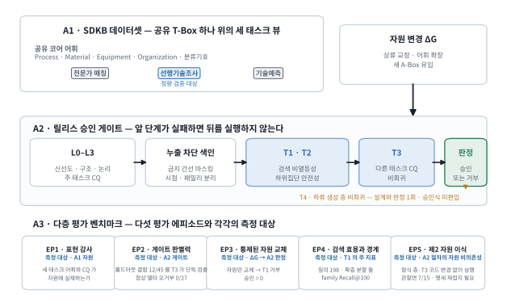
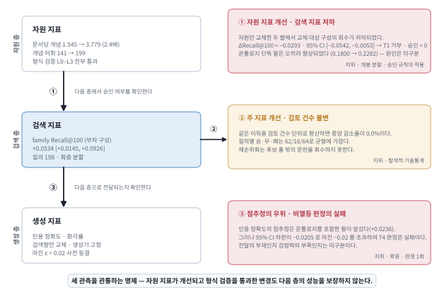
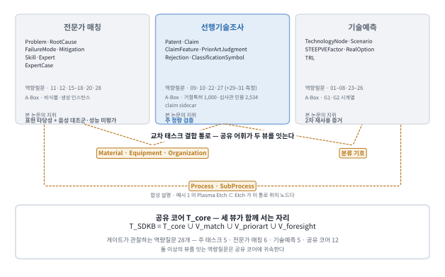
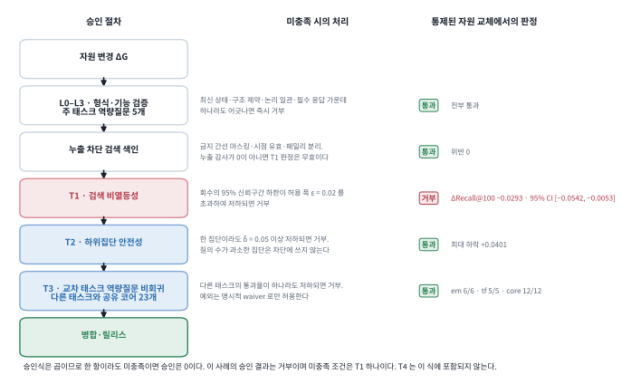
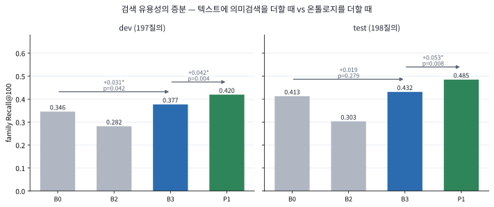
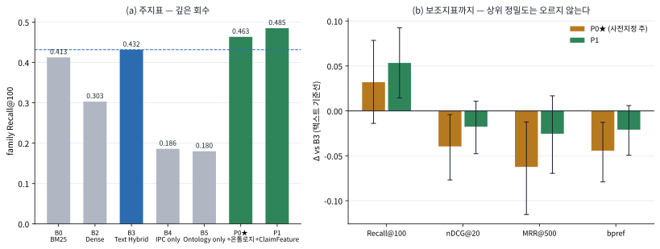
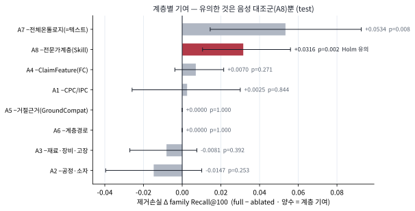
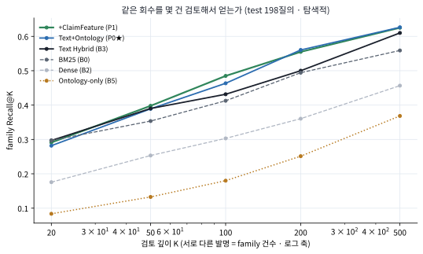

# 다중 태스크 공학 온톨로지 진화를 위한 태스크 기반 승인 게이트: 반도체 도메인 지식 베이스 SDKB의 설계과학 연구

**A Task-Aware Release Gate for Evolving Multi-Task Engineering Ontologies: A Design Science Study of the Semiconductor Domain Knowledge Base (SDKB)**

## 국문 초록

공학 도메인 온톨로지는 배포 이후에도 지속적으로 변경된다. 구조·논리 검사를 통과한 변경이 실제 태스크의 성능까지 보존하는지는 별개의 문제이다. 그러나 기존 온톨로지 평가 연구는 대부분 자원 자체의 품질을 사후에 측정하는 데 머물러 있다. 여러 태스크가 하나의 어휘 체계를 공유할 때 이 문제는 더욱 심화된다. 한 태스크의 성능만으로 승인된 변경이 다른 태스크의 질의 경로를 훼손할 수 있기 때문이다.

본 연구는 설계과학연구(design science research, DSR) 접근으로 산출물 셋을 설계한다. 첫째는 반도체 도메인 온톨로지 데이터셋 **SDKB**(Semiconductor Domain Knowledge Base)이다. SDKB는 전문가 매칭·선행기술조사·기술예측 세 태스크를 하나의 공유 스키마(T-Box) 위에 태스크별 뷰로 표현한다. 둘째는 형식 검증 네 층(L0–L3) 위에 태스크 조건 셋을 결합한 **변경 승인 게이트**이다. 세 조건은 검색 성능의 비열등성(T1), 하위 집단의 국소 회귀 방지(T2), 다른 태스크의 역량질문 통과율 비회귀(T3)이다. 셋째는 앞의 둘을 측정하는 **다층 평가 벤치마크**이다. 이 벤치마크는 누출을 차단한 검색 평가에서 그 하위의 생성 층 판독까지를 연결한다.

평가는 네 개의 에피소드로 수행하였다. 첫째는 SHACL과 역량질문 31개에 의한 표현 감사이다. 둘째는 거절 특허 1,000건과 심사관 인용을 부분 정답으로 사용한 누출 통제 검색 비교로, 겹치지 않는 확증 분할 2개(각 198질의)에서 수행하였다. 셋째는 아직 판정한 적 없는 결함 45건에 대한 홀드아웃 결함주입이다. 넷째는 문서집합·코드·설정을 전부 동결하고 온톨로지만 교체한 통제된 자원 교체이다.

자원 교체에서는 문서당 개념 수를 2.4배로 증가시키고 형식 검증 네 층을 모두 통과한 실제 변경이 검색 회수를 저하시켰으며(family Recall@100 −0.0293, 95% CI [−0.0542, −0.0053]), 조건 T1은 그 변경을 거부하였다. 이는 형식 검증이 놓치는 회귀를 태스크 조건이 검출한 실증 사례에 해당한다. 홀드아웃 결함주입에서는 교차 태스크 결함 45건 중 12건을 T3만이 검출하였고, 잘못된 경보는 27건 중 0건으로 나타났다. 검색 유용성은 그 경계와 함께 관측되었다. 온톨로지·한정요소 재순위화는 깊은 회수를 두 분할 모두에서 개선하였으나(+0.0534 · +0.0343), 사전 지정한 주 구성은 유의에 이르지 못하였고 상위 정렬(nDCG@20)은 개선되지 않았다.

본 연구는 이 평가로부터 층별 검증, 한 층 아래 승인, 교차 태스크 보존, 통제된 교체라는 이전 가능한 설계원리를 도출한다. 한계 또한 명확하다. 대상은 단일 도메인이며, 승인 거부의 실질 사례는 1회이고, 그 원인이 자원에 있는지 점수 계산식에 있는지는 구분하지 못하였다. 질의 또한 이미 온톨로지에 등재된 특허로 한정된다. 자유 텍스트 질의를 처리하는 텍스트–개념 매핑 단계는 후속 과제로 남는다.

**주제어:** 반도체 도메인 온톨로지 데이터셋, 온톨로지 진화, 태스크 인식 승인 게이트, 교차 태스크 비회귀, 대리지표의 어긋남, 선행기술 검색, 설계과학연구

## Abstract

Engineering ontologies keep changing after release, and whether a change passing structural and logical checks preserves task performance is a separate question that most ontology evaluation, stopping at resource-level quality, leaves open. The problem grows when tasks share a vocabulary: a change approved on one task's score can break another's query paths. Following design science research, we present three artifacts: SDKB (Semiconductor Domain Knowledge Base), an ontology dataset carrying expert matching, prior-art search and technology foresight as task views on one shared schema (T-Box); a task-aware release gate adding three conditions to four layers of formal validation (L0–L3) — retrieval non-inferiority (T1), subgroup safety (T2), and non-regression of other tasks' competency questions (T3); and a multi-layer evaluation benchmark running in four episodes: a representation audit (SHACL, 31 competency questions, 28 gate-observed); a leakage-controlled retrieval comparison over two non-overlapping confirmatory splits (198 queries each), anchored on examiner citations for 1,000 rejected patents; holdout fault injection on 45 unjudged faults; and a controlled resource swap with documents, code and settings frozen. In the swap, a change raising concepts per document 2.4-fold and passing all four formal layers *reduced* retrieval (family Recall@100 −0.0293, 95% CI [−0.0542, −0.0053]); T1 rejected it. T3 alone detected 12 of 45 cross-task faults, with 0 of 27 false alarms. Retrieval utility has an explicit boundary: deep recall improved in both splits (+0.0534, +0.0343), while the pre-specified primary configuration reached no significance and nDCG@20 did not. We derive four core and two scope design principles, and state the limits: one domain, one refusal of undistinguished cause, and queries confined to patents already in the graph.

**Keywords:** semiconductor domain ontology dataset; ontology evolution; task-aware release gate; cross-task non-regression; proxy-metric mismatch; prior-art retrieval; design science research

## 약어표 (Nomenclature)

약어는 본문에서 최초로 사용할 때 전체 명칭과 함께 표기하고, 이후에는 약어만 사용한다. 게이트·
가설·지표의 명칭(L0–L3 · T1–T4 · Recall@100 · nDCG@20)은 번역하거나 의역하지 않는다. 이들을
다른 표현으로 바꾸면 지시 대상이 달라지기 때문이다.

| 기호 | 뜻 (정의 위치) |
|---|---|
| BM25 | Okapi Best Matching 25 — 어휘 기반 순위 함수 |
| CQ | competency question, 역량질문 — 온톨로지가 답할 수 있어야 하는 질문 목록 (§4.1) |
| CQ-PA / CQ-EM / CQ-TF / CQ-CORE | 태스크별 CQ 스위트 — 선행기술조사 / 전문가 매칭 / 기술예측 / 공유 코어 (§4.1) |
| DOCDB / IPC / CPC | 특허 패밀리 식별 기준 / 국제특허분류 / 협력적 특허분류 |
| DSR | design science research, 설계과학연구 (§3) |
| RQ / DP | 연구질문 / 설계원리 (§1 · §7.7) |
| EP1–EP4 | 평가 에피소드 — 표현 감사 · 게이트 판별력 · 자원 교체 · 검색 효용 (§3.2) |
| G0 / G1 / G2 | SDKB 그래프 계보 — 기준 그래프 / 후보 모집단 두 종 (§4.2) |
| L0–L3 | 형식 검증 4층 — 신선도·무결성, SHACL 구조, 논리 일관성, CQ 기능 (§4.4) |
| nDCG | normalized discounted cumulative gain — 상위 정렬 품질 (§5.5) |
| qrel | relevance judgment, 적합성 판단 — 정보검색 관행 표기 (§2.1) |
| RAG | retrieval-augmented generation — 본 연구의 **계측 대상**이지 제안 방법이 아니다 (§8.5) |
| SDKB / SHACL | Semiconductor Domain Knowledge Base / Shapes Constraint Language |
| T-Box / A-Box | 스키마 어휘 / 인스턴스 단언 (§4.1) |
| T1–T4 | 태스크 조건 — 검색 비열등성 · 하위집단 안전성 · 교차 태스크 CQ 비회귀 · 하류 생성 층 비회귀 (§4.5) |
| B0–B5 / P0–P2 | 비교 시스템 — 기준선 / 제안 시스템 (§5.3) |
| A1–A8 | 절제(ablation) 조건 · A8은 음성 대조군 (§5.6) |
| \(\epsilon\), \(\delta\) | 비열등 허용한계 0.02, 하위집단 하락 한계 0.05 (§4.5) |

---

# 1. 서론

대형 언어 모델(large language model, LLM)과 검색 증강 생성(retrieval-augmented generation, RAG)이
공학 실무에 도입되면서 명시적 지식 표현의 역할은 오히려 확대되었다(Lewis et al., 2020; Pan et al.,
2024). 모델이 사실과 다른 내용을 생성할 때 이를 제약하는 것은 더 큰 모델이 아니라 검증 가능한
지식 구조이기 때문이다. 공학 정보학에서도 설계 자산과 공정을 지식그래프로 통합하는 연구가
지속되어 왔다(Bharadwaj & Starly, 2022). 특히 반도체와 같이 공정·소자·재료·장비·조직이 조밀하게
결합된 도메인에서는 이러한 요구가 강하다. 동일한 물리 현상이 맥락에 따라 다른 명칭으로
지칭되므로, 문자열 일치에 의존하는 검색으로는 도달하지 못하는 연결이 남기 때문이다.

반도체 지식은 하나의 태스크에만 사용되지 않는다. 설비 불량은 고장 모드에서 근본 원인과 대응책을
거쳐, 그 문제를 해결할 수 있는 인력과 역량에 연결되어야 한다. 특허 분석은 특허에서 청구항과
한정요소를 거쳐 선행기술 판단으로 이어져야 한다. 기술기획은 기술 노드를 시나리오·외부요인·투자
선택지와 연결해야 한다. 이 세 태스크는 서로 다른 데이터 저장소가 아니다. 오히려
`Process`·`Device`·`Material`·`Equipment`·`Organization` 을 공유하는 동일 지식의 서로 다른 사용
관점에 해당한다. **SDKB**(Semiconductor Domain Knowledge Base)는 이 세 요구를 차례로 수용하며 성장한
반도체 도메인 온톨로지 데이터셋이다.

여기서 **태스크 확장형(task-extensible)** 이란 하나의 온톨로지가 모든 태스크에서 동일한 성능을
낸다는 의미가 아니다. 공유 스키마(T-Box)와 식별자를 유지한 채, 태스크마다 필요한
클래스·관계·제약·역량질문(competency question, CQ)과 인스턴스(A-Box)를 추가할 수 있다는 의미이다.
더욱이 그 추가가 기존 구조를 훼손하지 않는다는 조건을 포함한다. 따라서 온톨로지가 표현할 수 있는
범위와 성능이 검증된 정도는 구분하여 기술해야 한다.

세 태스크 가운데 선행기술 검색은 연구개발의 전단에 위치하면서 성능을 정량적으로 측정하기에도
적합하다. 출원 전 신규성·진보성 판단, 연구 주제의 중복 회피, 조사 보고서 작성이 모두 이 태스크에
의존한다. 정량 채점이 가능한 이유는 심사관이 실제로 인용한 문헌이라는 외부 기준이 존재하기
때문이다. 다만 이 태스크는 단순한 유사 문서 탐색이 아니다. 관련 선행기술은 동일한 발명을 다른
용어, 다른 분류, 다른 추상화 수준으로 기술할 수 있다. 따라서 어휘의 경계를 넘는 의미 기반 연결이
요구되며, 온톨로지를 이 태스크에 결합하는 근거도 여기에 있다. 그러나 특허 검색 연구와 온톨로지
품질 검증은 서로를 거의 참조하지 않은 채 발전해 왔다(§2). 온톨로지 측 검사를 통과하였다는 사실이
검색 성능을 보장하지는 않는다.

이러한 불일치는 두 가지 형태로 나타난다. 첫째, 모든 검사를 통과한 변경에서 성능이 저하된다.
온톨로지 변경 검사는 통상 신선도·구조·논리·기능의 네 층으로 구성된다(L0–L3). 이 네 층을 모두
통과하고도 봉인된 평가셋에서 검색 성능이 저하될 수 있으며, 중요한 하위 집단의 성능만 허용치
아래로 내려갈 수도 있다. 본 논문은 이 현상을 **태스크 의미 회귀(task-semantic regression)** 라
정의한다. 둘째, 단일 태스크만 관찰하는 검사로는 충분하지 않다. 하나의 어휘 체계가 세 태스크를
함께 지탱하는 경우, 한 태스크에 유리한 변경이 다른 태스크의 질의 경로를 훼손할 수 있다. 예컨대
검색 회수를 높이기 위해 유사한 두 개념을 통합하면, 전문가 매칭에서 `Skill` 을 변별하는 능력이
저하된다. 본 논문은 이 현상을 **교차 태스크 회귀(cross-task regression)** 라 정의한다.

두 현상은 하나의 원인에서 비롯된다. 온톨로지를 수정하는 주체는 대개 자원 측 지표를 관찰한다.
즉 어휘가 얼마나 증가하였는지, 문서 한 건에 개념이 몇 개 결합되는지, 누락된 링크를 얼마나
보완하였는지를 측정한다. 여기서 **자원(resource)** 은 응용에 투입되기 이전 상태의 데이터셋 전체를
가리킨다(T-Box·A-Box·문서–개념 링크). 그러나 평가에는 세 개의 층이 존재한다. 어휘·링크·개념 밀도를
관찰하는 자원 층, Recall@100 과 nDCG 를 관찰하는 검색 층, 그리고 회수된 문헌을 근거로 답변을
생성하는 생성 층이다. 한 층의 지표가 다음 층의 성능을 대표하는지는 실제로 측정하기 전에는 알 수
없다.

따라서 본 연구가 제기하는 질문은 하나이다. 세 태스크를 표현하는 온톨로지 데이터셋이 성장할 때,
주 태스크의 성능을 유지하면서 나머지 태스크의 기능도 훼손하지 않는가. 그리고 이를 릴리스 이전에
어떻게 확인할 수 있는가.

본 연구는 이 질문을 설계과학연구(design science research, DSR)로 다룬다. 본 연구가 묻는 것은
가설의 채택 여부가 아니다. 산출물을 어떻게 설계하고 평가하였으며, 거기에서 어떤 이전 가능한
설계지식이 도출되었는가이다.

- **RQ1** — 세 태스크를 하나의 공유 T-Box로 표현하면서 태스크별 확장이 가능한 온톨로지 데이터셋은
  어떻게 설계할 수 있는가? (§4 · EP1)
- **RQ2** — 형식적으로 유효한 변경이 하류 태스크 성능과 다른 태스크의 기능을 훼손하지 않도록
  릴리스 전에 평가하는 게이트는 어떻게 설계할 수 있는가? (§4 · EP2 · EP3)
- **RQ3** — 산출물 평가에서 어떤 효용과 실패 경계, 그리고 층간 지표 불일치가 관측되며, 거기에서
  어떤 이전 가능한 설계원리가 도출되는가? (EP3 · EP4 · §7)

본 연구의 기여는 세 가지이다. 첫째는 **산출물**이다. 본 연구는 온톨로지 데이터셋 SDKB를 제시한다. SDKB는 세 반도체
지식 태스크를 공통 식별자와 공유 T-Box로 연결하고, 태스크별 뷰·역량질문·검증 자산을 함께
제공한다. 둘째는 **방법**이다. 본 연구는 형식적 유효성에 더하여 주 태스크의 비열등성,
하위집단 안전성, 교차 태스크 기능 보존을 릴리스 승인 조건으로 결합한 변경 승인 게이트(T-gate)를
설계한다. 그리고 홀드아웃 결함주입과 실제 자원 교체를 통해 그 판별력을 평가한다. 셋째는
**설계지식**이다. 본 연구는 자원 지표가 개선되고 형식 검증을 모두 통과한 변경이 오히려 검색
성능을 저하시킬 수 있음을 통제된 교체로 제시한다. 이러한 관측에서 층별 검증과 한 층 아래 승인
이라는, 다른 공학 온톨로지로 이전 가능한 설계원리를 도출한다.

뒤의 두 기여는 설계 자체보다 그 설계의 필요성을 보이는 실측에 무게가 있다. 따라서 검색 유용성은
그 경계를 함께 밝힌 형태로만 보고한다. 사전 지정한 주 구성이 유의에 이르지 못한 사실, 상위 정렬
품질이 개선되지 않은 사실, 그리고 두 번째 확증 분할에서의 재현 여부까지 동일한 정밀도로 보고한다.
전달 판독(부록)은 별도의 기여로 제시하지 않는다.

이후의 구성은 다음과 같다. 2장은 연구 공백을, 3장은 설계과학연구의 절차를, 4장은 산출물을
다룬다. 이어 5장은 평가 설계를, 6장은 네 에피소드의 결과를 제시한다. 7장은 해석과 설계원리를,
8장은 한계와 결론을 다룬다.

**그림 1.** 연구 개요도. 위 띠는 산출물 A1로서 하나의 공유 T-Box 위에 세 태스크 뷰가 놓인 자원을,
가운데 띠는 산출물 A2로서 자원 변경을 릴리스 이전에 심사하는 승인 게이트를, 아래 띠는 산출물 A3으로서
네 평가 에피소드와 각각의 측정 대상을 나타낸다. 가운데 띠는 왼쪽에서 오른쪽으로 읽으며, 앞 단계가
실패하면 뒤 단계를 실행하지 않는다. 점선으로 표시한 T4는 승인식에 포함되지 않는다(§4.5.1).
자원은 §4.1, 게이트는 §4.4–4.5, 에피소드는 §3.2에 기술한다.

축약된 절의 전문·부록·보조 표는 전부 supplementary
[S5](../supplementary/S5-submission-full-v2.md)에 원문 그대로 수록되어 있다.

---

# 2. 이론적 배경과 연구 공백

본 장은 네 갈래의 선행연구를 차례로 검토하여 하나의 공백에 이른다. 먼저 주 태스크인 선행기술
검색이 무엇을 측정하며 그 정답이 왜 불완전한지 검토한다(§2.1). 다음으로 온톨로지 품질 검증이
대체로 릴리스 이후의 사후 비교에 머물러 온 경위를 검토한다(§2.2). 이어 자원 측 지표가 태스크
성능을 대신 측정할 수 있는가를 측정 이론에 비추어 검토한다(§2.3). 끝으로 이 논의 위에서 본
연구의 위치를 밝힌다(§2.4). 네 갈래를 종합하면 하나의 공백이 남는다. 여러 태스크를 함께 지탱하는
온톨로지의 변경을 릴리스 이전에 승인할 규칙이 확인되지 않는다는 점이다.

## 2.1 선행기술 검색의 평가 단위와 정답의 성질

선행기술 검색(prior art search)은 유사해 보이는 문서를 폭넓게 탐색하는 태스크가 아니다. 특정
청구항의 신규성·진보성 판단에 관여할 수 있는 소수의 문헌을 누락 없이 회수하는 태스크이다. 따라서
1차 지표는 상위 소수 건의 정확도가 아니라 충분한 깊이까지의 회수율(Recall@K)이 된다(Lupu &
Hanbury, 2013; Shalaby & Zadrozny, 2019). 벤치마크의 계보는 심사관 인용(examiner citation)을
정답으로 사용하는 방향으로 정착되었다(Piroi & Hanbury, 2019; Risch et al., 2020). 방법론은 세
갈래로 발전하였다. 어휘 기반 순위 함수, 특허에 특화된 의미 표현(Bekamiri et al., 2024; Ghosh
et al., 2024), 그리고 인용망 활용이다(Mahdabi & Crestani, 2014). 성능이 높은 시스템일수록 단일
표현에 의존하지 않는다(Krestel et al., 2021; Shomee et al., 2025).

여기서 심사관 인용은 완전한 정답이 아니라 **관측된 양성(observed positive)** 이다. 인용된 문헌은
제도적 검토에서 관측된 적합 신호이다. 반면 인용되지 않은 문헌은 부적합이 아니라
미관측(unobserved) 상태에 있다. 심사관 인용과 출원인 인용(applicant citation)은 의미가 다르며
(Alcácer & Gittelman, 2006), 심사관의 검색 자체도 시간·분류·관할의 제약을 받는다(USPTO, 2023).
그러므로 Recall@K가 측정하는 것은 알려진 양성의 회수 비율이며, 법적 관련성의 전량이 아니다.
이하에서 본 논문은 이 정답을 **심사관 검증 약한 정답(examiner-validated weak ground truth)**
또는 **양성 전용 qrel(positive-only qrel)** 이라 지칭한다. 판정이 불완전한 평가에는 미판정에 덜
민감한 지표가 권고된다(Buckley & Voorhees, 2004; Büttcher et al., 2007). 그러나 그러한 지표는
판정된 비적합 집합(judged non-relevant set)을 전제하며, 본 연구의 자원에는 그 집합이 존재하지
않는다. 따라서 본 연구는 그러한 지표를 사용하지 않는다(§5.5).

언어 축은 위의 갈래들과 중복되지 않는다. 선행기술은 공개 언어와 무관하게 유효하므로, 온전한
검색은 언어 경계를 넘어야 한다(교차언어 검색, cross-lingual retrieval). 현재까지 사용된 통로는
둘이다. 기계 번역(Magdy & Jones, 2014; Lee & Choi, 2023)과 다국어 밀집 표현(Zhang et al., 2023)
이다. 반면 명시적 온톨로지의 **언어중립 개념 식별자(language-neutral concept IRI)** 를 제3의
통로로 설정하고 정답 언어별로 분해하여 측정한 평가는 확인되지 않는다. 다만 이 축은 사전등록한
확증 가설이 아니므로 탐색적 진단으로만 보고한다(§6.4.4).

## 2.2 온톨로지 품질과 진화 검증 — 사후 기술에서 사전 승인으로

온톨로지 품질 논의는 명료성·일관성·확장성과 같은 설계 원칙에서 출발하였다(Gruber, 1993).
역량질문(CQ)은 요구사항과 검증 항목을 연결하는 장치로 정착하였으며(Grüninger & Fox, 1995),
테스트 주도 온톨로지 개발은 그 요구사항을 자동 검사가 가능한 형태로 형식화하였다(Keet &
Ławrynowicz, 2016). 구조 측면에서는 RDF(Resource Description Framework) 품질 점검이 발전하였고
(Kontokostas et al., 2014), SHACL(Shapes Constraint Language)이 이를 표준 shape로 표현한다
(W3C, 2017).

링크드 데이터 품질의 기준점인 Zaveri et al.(2016)은 품질을 18개 차원과 69개 지표로 구분하였다.
그러나 그 틀은 상태를 기술하는 평가 틀에 가깝다(사후 기술 평가, descriptive evaluation). 진화
측면에서는 온톨로지 진화가 스키마 진화와 동일하지 않다는 점이 일찍 지적되었으며(Noy & Klein,
2004), 이후 변경의 탐지·표현·전파·일관성 보존으로 절차가 정리되었다(Flouris et al., 2008;
Zablith et al., 2015). 그러나 그 절차가 검증하는 것은 변경이 온톨로지 자체를 훼손하지 않는가이며,
변경이 그 온톨로지를 사용하는 태스크를 훼손하지 않는가는 아니다. 하류 측면에서는
KGrEaT(Heist et al., 2023)가 지식그래프 보강이 하류 성능 향상을 전제로 정당화되면서도 정작 그
성능은 거의 측정되지 않는다고 지적하였다. 이 역시 완성 이후의 사후 비교이며, 변경을 릴리스
이전에 수용할지 결정하는 조건으로 사용되지는 않았다.

공학 정보학에서 이 공백은 특히 중대하다. 공학 지식은 한 번 구축하고 종료되는 자산이 아니라
제품·공정·설비가 변경될 때마다 함께 변경되는 자산이기 때문이다. 따라서 이 분야의 온톨로지는 여러
시스템이 의미를 공유하는 통로로 설계되며(Chungoora et al., 2013), 설계 자산을 지식그래프로
통합하는 작업 또한 그 변화를 지속적으로 흡수해야 한다(Bharadwaj & Starly, 2022). 공유 범위가
넓을수록 변경의 파급 범위도 넓어진다.

최근 이 분야의 연구는 변화의 흡수를 세 방향에서 다루었다. 표현의 표준화는 컴퓨터 비전으로 추출한
도면 요소를 온톨로지로 규정하고 실제 평면도 사례연구로 그 효과를 제시하였다(Schönfelder & König,
2025). 아키텍처의 모듈화는 생애주기마다 달라지는 요구를 모듈 구성으로 흡수하는 의미 기반 디지털
트윈을 제시하였다(Kosse et al., 2025). 응용 성능의 실증은 대규모 언어모델 기반 에이전트가 생성한
안전 위험성 평가를 지식그래프에 적재하였다(Speiser et al., 2026). 적재의 정확성은 전문가 평가와
SHACL 검사로 확인되었다. 또한 안전과 공정계획이 지식그래프를 공유할 때 한 도메인의 결정이 다른
도메인에 미치는 영향이 질의로 드러났다(Johansen et al., 2025).

세 방향은 자원이 무엇을 표현하며 응용에서 어떻게 동작하는가를 보인다. 반면 그 자원이 변경될 때
어떤 변경을 수용하고 어떤 변경을 거부할 것인가의 규칙은 제시되지 않는다. 모듈 구조는 변경을
받아들일 통로를 넓히지만 개별 변경의 수용 여부를 판정하지 않으며, 도메인 사이의 영향에 대한
관측도 승인 조건으로 사용되지 않는다. 이 분야의 검증 논의 역시 구조와 규칙의 준수 여부를 보고하는
데 머문다(Solihin et al., 2015; Pauwels et al., 2024). 시연은 사용 가능성을 보일 뿐, 변경의 수용
가능성에는 답하지 않는다.

## 2.3 대리지표의 타당성 조건 — 측정 이론의 자리

앞 절의 검사들은 모두 자원 자체를 대상으로 한다. 그러나 자원 측 지표를 향상시키는 것은 목적이
아니라 수단이다. 목적은 실제 사용 태스크, 곧 하류 태스크(downstream task)의 성능을 향상시키는
것이다. 그러므로 자원 측 지표는 태스크 성능의 **대리지표(proxy metric)** 이며, 여기에는 언제나
동일한 질문이 따른다. 그 지표가 태스크 성능을 실제로 대신 측정할 수 있는가.

이 질문은 온톨로지 평가에 국한되지 않으며 측정 이론의 오래된 주제이다. 어떤 측정치가 관리의
목표가 되는 순간 좋은 측정치이기를 그친다는 관찰은 정책과 대학 평가에서 먼저 정식화되었다
(굿하트의 법칙, Goodhart's law; Strathern, 1997). 그 불일치가 발생하는 기제 또한 회귀·극단값·
인과 구조 등으로 구분되어 정리되었다(Manheim & Garrabrant, 2018; Thomas & Uminsky, 2020). 인접
분야의 실측도 동일한 방향을 지시한다. 자원 자체만 관찰하는 평가(내재적 평가, intrinsic
evaluation)는 하류 성능을 충분히 예측하지 못하였다(Chiu et al., 2016; Faruqui et al., 2016).
한 층 아래에서는 검색 지표가 생성 품질을 예측하는지가 파이프라인의 복잡도에 따라 달라졌다
(Samuel et al., 2026). 본 논문은 한 층의 지표가 다음 층의 성능을 대표하지 못하는 이 현상을
**층간 지표 불일치(cross-layer metric misalignment)** 라 정의한다.

공학 정보학의 최근 사례도 같은 경계를 스스로 밝혔다. 앞서의 에이전트 시스템은 적재된 지식이 하류
추론을 실제로 개선하는지는 평가하지 않았음을 명시하고 이를 후속 과제로 남겼다(Speiser et al.,
2026).

**그림 2.** 층간 지표 불일치. 왼쪽은 자원 층·검색 층·생성 층의 지표 구조이고, 오른쪽은 각 층 사이에서
실제로 관측된 결과이다. 왼쪽 화살표의 번호가 오른쪽 관측의 번호와 대응하며, ②만은 다음 층이 아니라
같은 층의 다른 단위인 검토 건수를 가리킨다. 각 관측의 오른쪽 아래에 확증 지위를 함께 표기하였으므로
셋을 같은 무게로 읽지 않는다. 관측 ①은 §6.3, ②는 §6.4.5, ③은 §8.5에 제시하며 해석은 §7.5에 있다.

이 질문을 정면으로 다룬 전통은 온톨로지 평가 안에 이미 존재한다. 온톨로지를 응용에 결합하고 그
출력으로 평가하는 **과제 기반 평가(task-based evaluation)** 가 그것이다(Porzel & Malaka, 2004;
Brank et al., 2005). 다만 이 전통에서 태스크 성능은 여러 온톨로지를 비교하여 선택하는
기준(selection criterion)으로 사용되었다. 본 연구가 이동시키는 것은 그 사용 위치이다. 본 연구는
동일한 태스크 성능을 하나의 온톨로지가 성장할 때 그 변경의 수용 여부를 결정하는 승인식의 항으로
사용한다(릴리스 전 승인, pre-release acceptance).

따라서 두 겹의 공백이 남는다. 첫째, 보고된 불일치는 대체로 상관 수준의 관측이다. 문서집합·설정·
가중치·평가셋을 고정한 채 자원만 교체한 조건, 곧 **통제된 자원 교체(controlled resource
substitution)** 에서 확인한 사례는 드물다. 둘째, 대리지표에 대한 이러한 의심을 승인 규칙으로
구현한 설계는 확인되지 않는다.

## 2.4 태스크 확장형 도메인 온톨로지 데이터셋과 연구 위치

도메인 온톨로지 데이터셋은 용어 목록이나 단일 응용모델과 구별된다. 여러 원천을 안정적 식별자와
명시적 의미관계로 통합하는 공유 T-Box를 갖추어야 하기 때문이다. 또한 T-Box가 표현할 수 있는
범위와 A-Box가 실제로 채워진 정도를 구분하여 보고해야 한다(Wilkinson et al., 2016; Hogan et al.,
2021). 따라서 본 논문은 §1이 구분한 두 수준에 명칭을 부여한다. **표현 범위(representational
scope)** 는 T-Box·SHACL·CQ가 세 태스크의 질의를 표현하고 실행할 수 있는가를 가리킨다. **태스크
검증 깊이(task-level validation depth)** 는 실제 정답과 후보 모집단(candidate pool)에서 특정
태스크의 성능이 유지되거나 향상되는가를 가리킨다.

특허 검색에서 그래프는 어휘 검색의 사각지대를 보완할 수 있다(Mahdabi & Crestani, 2014; Siddharth
et al., 2022; Daniell et al., 2025). 다만 이들 연구에서 그래프는 대체로 성능을 위한 입력 표현이며,
그래프 자체가 지속적으로 변경될 때 어떤 변경을 허용할지는 다루어지지 않는다. 본 연구의 기여 또한
지식그래프의 사용이 검색 성능을 향상시킨다는 명제의 재확인에 있지 않다. 본 연구의 방향은 검색
성능으로 지식그래프의 진화를 통제하되, 그 통제가 다른 태스크를 훼손하지 않도록 감시하는 데 있다.

**표 1. 관련연구 대비 연구 위치 — "최초"가 아니라 결합과 실험설계의 차별성에 기여를 둔다.**

| 연구 흐름 | 대표 문헌 | 남는 공백 | 본 연구의 확장 |
|---|---|---|---|
| 특허 선행기술 검색과 그래프 활용 | Lupu & Hanbury (2013); Krestel et al. (2021); Mahdabi & Crestani (2014); Siddharth et al. (2022) | 그래프가 성능을 위한 입력 표현에 머물러, 그래프 자체의 변경 통제는 다루지 않는다 | 질의 인용 간선 마스킹과 시점·패밀리 분리 위에서, 검색 성능을 자원 변경의 승인 조건으로 사용하고 그 결합의 **성능 상한**까지 보고 |
| 온톨로지 품질·진화 검증 | Kontokostas et al. (2014); Keet & Ławrynowicz (2016); W3C (2017); Zablith et al. (2015) | 변경이 온톨로지를 훼손하는가만 보고, 태스크를 훼손하는가는 보지 않는다 | 형식 검증 위에 3조건 태스크 게이트와 비열등 병합 규칙 |
| 과제 기반 평가와 다운스트림 평가 | Porzel & Malaka (2004); Brank et al. (2005); Heist et al. (2023) | 온톨로지를 비교·선택하는 **기준** 또는 완성 이후의 사후 비교로 사용되었다 | 같은 태스크 성능을 릴리스 **전** 승인식의 항으로 사용 |
| 자원 지표를 유용성의 대리로 쓰는 관행 | Strathern (1997); Chiu et al. (2016); Thomas & Uminsky (2020) | 어긋남이 상관 분석 수준에서 보고될 뿐 **통제된 사례와 그에 대한 결정**은 드물다 | 자원만 교체한 두 조건에서의 통제된 확인과 **승인 판정**(§6.3) |
| 공학 정보학의 의미 표현·검증과 응용 | Schönfelder & König (2025); Kosse et al. (2025); Speiser et al. (2026); Solihin et al. (2015); Pauwels et al. (2024) | 표현의 표준화·구조 준수·응용 성능은 제시되나 **변경의 승인 규칙**은 다루지 않는다 | 사용 가능성이 아니라 **변경 수용 가능성**을 판정하고 실제 심사 기록을 제시(§6.3) |
| 공유 그래프의 교차 도메인 활용 | Johansen et al. (2025) | 도메인 사이의 영향을 **관찰**하는 데 머문다 | 같은 영향을 승인 조건인 **교차 태스크 비회귀**로 집행 |

이상의 검토에서 도출되는 연구 공백은 여러 태스크를 함께 지탱하는 도메인 온톨로지의 변경
승인 설계에 있다. 단일 태스크만 관찰하는 게이트가 유발하는 과적합을 **교차 태스크 비회귀(cross-task
non-regression)** 조건으로 통제한 릴리스 전 승인 설계는 확인되지 않는다. 또한
그러한 설계가 실제 변경을 심사한 기록도 확인되지 않는다. 이 공백이 §1의 세 연구질문을 규정한다.
즉 태스크별 확장을 허용하는 자원의 설계(RQ1), 그리고 형식 검증 위에 성능과 교차 태스크 비회귀를
결합한 승인 게이트의 설계(RQ2)이다. 나머지 하나는 평가에서 관측되는 효용·경계·층간 불일치와
그로부터 도출되는 설계지식(RQ3)이다.

---

# 3. 연구방법 — 설계과학연구(DSR)

본 연구는 설계과학연구에 해당한다(Hevner et al., 2004; Gregor & Hevner, 2013). 이 방법론은 공학
정보학의 최근 산출물 연구에서도 사용되었다(Speiser et al., 2026). 따라서 본 장이
규정하는 것은 가설의 목록이 아니다. 본 장은 무엇을 구축하였고, 무엇을 언제 어떤 기준으로
평가하였으며, 거기에서 도출된 지식을 어떤 문턱에서 설계원리라 지칭하는가를 규정한다. 평가 점검
셋은 이 틀 안에서 결과를 확인하기 전에 동결한 조건이며, 그 목록과 판정은 §5.7의 표에 제시한다.

## 3.1 산출물과 설계·평가 절차

산출물은 셋이며 서로를 전제한다. **A1 · SDKB 온톨로지 데이터셋**은 하나의 공유 T-Box 위에 세
태스크 뷰를 구성한 반도체 도메인 자원이다(§4.1–4.7). **A2 · 릴리스 승인 게이트**는 형식 검증
L0–L3 위에 태스크 조건 T1·T2·T3를 결합한 병합 전 승인식이며, T4는 승인식 외부의 설계이다
(§4.4–4.5). **A3 · 다층 평가 벤치마크**는 누출을 차단한 심사관 정박 검색 평가에서 그 하위의 생성
층 판독까지를 연결하는 계측 장치이다(§5).

설계와 평가는 교대로 순환한다. 자원 수정은 게이트의 심사를 받고, 게이트가 놓치는 부분은
벤치마크가 드러내며, 그 결손은 다시 자원 수정으로 환류된다. 이 순환에서 평가는 한 번의 최종
검정이 아니라 목적이 다른 복수의 에피소드로 구분된다(Venable et al., 2016).

## 3.2 평가 에피소드 EP1–EP4

각 에피소드는 세 가지 측면에서 구분된다. 무엇을 묻는가, 무엇으로 판정하는가, 그리고 그 결과가
확증인가 탐색인가이다. 결과 장 또한 이 순서를 그대로 따른다.

**표 2. 평가 에피소드 — EP 는 새 라벨이며 사전등록 라벨(RQ·H·T)과 겹치지 않는다.**

{{COPY:섞어 읽지 않도록 라벨을 붙여 결과 장을 그대로 이 순서로 싣는다.|table}}

## 3.3 설계지식의 승격 기준 — 원리와 관측의 구분

관측을 설계원리로 지칭하는 순간 주장의 범위는 이 산출물의 경계를 넘어선다. 그 문턱을 결과를
확인하기 전에 규정해 두지 않으면, 원리는 결과의 사후 요약으로 전락한다. 본 연구가 설정한 문턱은
다섯이다. ① 근거가 실행된 코드의 출력일 것. ② 경쟁 설명이 배제되었거나, 배제되지 않았음이 명시될
것. ③ 산출물 밖으로 이전 가능한 형태로 진술될 것. 진술에 "SDKB에서는"이라는 한정이 필요하다면
그것은 원리가 아니라 관측이다. ④ 반증 가능할 것. 어떤 관측이 이 원리를 반증하는지 함께 기술한다.
⑤ 사후 역산이 아닐 것. 원리의 설계 시점과 확인 시점을 각각 기록한다.

다섯을 모두 충족하면 "확립"으로 기술하고, 하나라도 미달하면 "제안"으로 강등한다. 도출된 여섯 개
가운데 다섯이 확립이고 하나가 제안이다. 여기서 제안은 실패가 아니라 근거 수준에 상응하는
등급이다.

---

# 4. 산출물 — SDKB 데이터셋과 T-gate

## 4.1 공유 T-Box와 세 태스크 뷰

SDKB의 T-Box는 선행기술 검색만을 위해 구축한 단일목적 스키마가 아니다. 실제 TTL에는 반도체
공정·소자·재료·장비·고장·역량·특허·기업·기술전략 어휘가 함께 존재하며, 세 태스크가 이를 서로 다른
경로로 사용한다: \(T_{\mathrm{SDKB}} = T_{\mathrm{core}} \cup V_{\mathrm{match}} \cup V_{\mathrm{priorart}}
\cup V_{\mathrm{foresight}}\). 각 뷰는 배타적 모듈이 아니라 공유 개념을 중첩 사용한다.

**그림 3.** 공유 T-Box와 세 태스크 뷰. 위의 세 칸은 각 뷰의 주요 클래스와 대표 역량질문, A-Box 근거,
그리고 본 논문에서의 지위를 나타낸다. 가운데의 세 통로는 둘 이상의 뷰가 함께 사용하는 어휘이며,
각 통로에서 뻗은 점선이 그 어휘가 잇는 두 뷰를 지시한다. 아래 칸은 공유 코어와 게이트가 관찰하는
역량질문의 스위트별 개수이다. 세 뷰가 배타적 모듈이 아니라는 사실이 §1의 교차 태스크 회귀가
실재하는 이유이며, 그 검사는 §4.4의 T3가 담당한다.

나머지 CQ13·14·19·21은 공급망·규제와 같이 둘 이상의 뷰를 연결하는 성격을 가지므로 **공유
코어(CQ-CORE)** 로 귀속한다. 세 뷰 가운데 선행기술조사만 제도적 기준점에 해당하는 약한 qrel을
보유하므로 정량 검증이 가능하다. 이러한 비대칭은 결함이 아니라 주장 범위를 통제하기 위한
설계이다. 세 태스크를 포괄하는 것은 T-Box와 CQ의 관측 사실이며, 본 연구는 세 태스크의 성능이
모두 검증되었다고 주장하지 않는다. `NoveltyScore`는 정답에서 파생된 지표이므로 검색 피처에서
배제한다.

공유 어휘는 교차 태스크 의존이 형성되는 통로에 해당한다. `Process`/`SubProcess`는 전문가 매칭과
기술예측이 공유한다. `Material`·`Equipment`·`Organization`은 전문가 매칭과 선행기술조사가
공유하며, 분류 기호는 선행기술조사와 기술예측을 연결한다. 즉 세 태스크는 독립적 서브그래프가
아니라 공유 코어 위의 세 관점이며, 이 결합이 §1의 교차 태스크 회귀를 실재하게 만든다. 다만
T-Box에 클래스와 관계가 존재한다고 해서 모든 뷰의 인스턴스가 동일한 완전도로 채워진 것은 아니다.
따라서 계수는 고정된 릴리스 커밋에서 자동으로 산출한다.

## 4.2 그래프 계보와 선행기술 관계

<!-- style-ok: 자원 계수 열거 -->
SDKB는 단일 파일이 아니라 목적과 코퍼스가 상이한 버전 계보이다. **G0**(105,588 트리플)는 기준
온톨로지이자 **벤치마크 앵커**이다. G0는 거절 특허 1,000건·CitedPatent 3,034개·심사관 인용
2,534건과 청구항·거절판단 T-Box를 포함한다. **G1**(924,814)과 **G2**(490,529)는 **후보
모집단(방해문서 풀)** 이다. 두 그래프는 각각 종합 반도체 기업 특허 24,179건과 KSIA 188개사 특허
12,339건을 추가한 것이다. 별도의 claim-feature 사이드카(11,605,931 트리플)에는 Claim
586,567개·ClaimFeature 1,289,512개·PriorArtJudgment 635개가 존재한다. 이 수치는 본 논문의 모든 측정이 수행된 자원 세대의
값이다(상류 스냅샷 `d578bf3`).
<!-- sig-history -->

<!-- style-ok: 서명 수치 열거 -->
> **관측 사실.** G1·G2는 온톨로지의 세대가 아니다. 세 그래프의 T-Box는 동일하다. `owl:Class` 103 ·
> `owl:ObjectProperty` 97 · `owl:DatatypeProperty` 81이 세 그래프에서 모두 같으며, 술어 델타는
> 추가 0 · 제거 0이다. G1·G2가 추가하는 것은 특허 A-Box 문서뿐이며, 심사관 인용 정답 2,211건은
> 전부 G0 내부에 존재하고 G1·G2에만 존재하는 정답은 0건이다. 이들을 제외하면 후보 코퍼스가
> 40,552건에서 4,034건으로 축소되어 대규모 후보 집합이라는 조건이 성립하지 않는다. 이 사실이
> §8.1이 기술하는 승인 안전성 미검정의 실질적 이유이다. 자격 있는 변경이 우연히 부재하였던 것이
> 아니라, T-Box가 한 번도 변경된 적이 없어 존재할 수 없었다.

<!-- style-ok: 술어 열거 문장 -->
거절 특허 축은 `hasPriorArtExaminer`(심사관 인용 · **누출 통제 시 검색 그래프에서 제거되는 관계**) ·
`rejectedFor`(거절근거) · `hasClaim`/`dependsOnClaim` · `hasFeature`/`featureConcept` ·
`hasJudgment`/`aboutClaim`/`overPriorArt`/`onGround` · `hasPriorArtApplicant`(출원인 인용 · 심사관
인용과 분리 보존)로 구성된다. 이 모델은 특허 간 인용 관계의 표현에 머무르지 않는다. 어느 청구항의
어떤 한정요소가 어떤 거절근거 아래 어느 선행기술과 관련되는가까지 표현한다. 다만 표현 가능성과
실제 충전 정도는 구분되어야 한다. 따라서 본 논문은 분석마다 사용 가능한 관계의 수와 결측 비율을
함께 보고한다. 모든 트리플에는 출처 서명이 부여되어 있으며, 정합 검사가 CI에 배선되어 있다. <!-- sig-history -->

## 4.3 약한 정답의 관찰 수준별 도달성과 등급

정답 자원이 그래프에 도달하는 정도는 **관찰 수준(observation level)**, 즉 어떤 관계까지를
연결로 인정하는가에 따라 크게 달라진다.

**표 3. 관찰 수준별 도달성 — 단일 수치가 아니라 수준별로 구분하여 보고한다.**

{{COPY:정답 자원이 그래프에 **얼마나 닿아 있는지**는 보는 해상도에 따라 크게 달라진다.|table}}

심사관 인용은 총 2,534건이며 그중 30건이 비특허문헌이다. 2,321은 `hasPriorArtExaminer`가
지시하는 고유 특허의 수이다. 2,534 · 2,321 · 2,211 · 584는 서로 다른 분모이므로 하나의 정답 수로
혼용하지 않는다. 이 차이 자체가 측정의 문제이다. 노드나 분류코드 수준의 높은 값만 보고하면 의미
검색 준비도를 과대평가하게 된다. 반대로 ClaimFeature 68.8%를 전체의 속성으로 기술하면 특정
부분집합의 성질을 전체로 과잉 일반화하게 된다.

적합성 등급은 관측된 증거의 세밀도에 따라 구분한다. 등급 2는 판단이 특정 청구항과 선행문헌을
연결하고 거절근거가 식별된 경우이며, 등급 1은 특허 수준의 인용 관계만 확인된 경우이다. 인용
관계가 없는 경우에는 음성으로 확정하지 않고 미관측으로 처리한다. 다만 등급 2가 법적으로 더 깊은
관련성을 의미하지는 않는다. 비특허문헌 30건은 주 평가의 분모에서 제외하고 별도로 보고한다. 후보와
qrel은 DOCDB family_id 단위로 통합하여 계수하며, 주 결론은 패밀리 단위에 둔다.

<!-- style-ok: 구성요소 열거 -->
릴리스는 정답의 유입을 차단하기 위해 다섯으로 구분한다. 공개 가능한 코어, 개발·검증용 qrel, 평가
시점까지 봉인된 테스트 판단(해시 고정 · 접근 로그), qrel과 독립적으로 생성한 파생 특징, 출처가
그것이다. 용어 또한 구분하여 사용한다. 데이터셋 릴리스는 커밋 SHA와 sha256으로 **고정(pin)** 하고,
평가 프로토콜과 임계는 개봉 이전에 **동결(freeze)** 한다. 고정은 데이터셋이 이후 버전에서 개선되는
것을 제약하지 않는다(§8.6).

## 4.4 검증 게이트의 전체 절차

<!-- style-ok: 절차 흐름 표기 -->
본 절부터 두 번째 산출물(A2)을 기술한다. 평가·승인 절차는 앞 단계가 실패하면 이후 단계를
실행하지 않는다(fail-fast). 절차는 그래프 델타 → **L0–L3 형식·기능 검증** → 누출 차단 검색 인덱스
→ **T1 검색 비열등성 + T2 하위집단 안전성** → **T3 교차 태스크 CQ 비회귀** → 병합·릴리스의 순서로
구성된다. L0–L3 중 하나라도 실패하면 T-gate는 실행하지 않는다. T3를 마지막에 배치한 이유는 계산
비용이 아니라 해석 순서에 있다. T1·T2는 게이트 태스크의 성능이 유지되거나 향상되었는가를 묻고,
이어 T3는 그 대가로 다른 태스크가 희생되지 않았는가를 묻는다. 테스트 qrel은 최종 비교 시점까지
모델·가중치·규칙 선택에 사용하지 않는다.

역량질문은 모두 31개이며 용도가 셋으로 갈린다. 게이트의 분모와 감사의 분모를 먼저 구분한다. 아래 표의 계수는 질의 파일과 CQ 실행 산출물에서 읽은 값이다.

**표 4. 역량질문 31개의 구분과 용도 — 게이트의 분모는 28개, 표현 감사의 분모는 31개이다.**

| 구분 | 개수 | 용도 | G0 통과 |
|---|---|---|---|
| L3 주 태스크 스위트 (pa) | 5 | 선행기술조사 태스크의 기능 검증 | 4/5 |
| T3 스위트 (em 6 · tf 5 · core 12) | 23 | 다른 태스크와 공유 코어의 비회귀 | 23/23 |
| **게이트 관찰 소계** | **28** | 승인식의 판정 분모 | **27/28** |
| 사이드카 청구항 질의 (CQ29–31) | 3 | 청구항 수준 측정 전용 · 승인식 미편입 | 3/3 |
| **표현 감사 전량** | **31** | EP1 표현 감사의 분모 | **30/31** |

사이드카 질의 셋을 제외한 이유는 그것이 시험 대상 그래프에 무반응인 상수항이어서,
판정 분모에 넣으면 실패가 희석되기 때문이다.

L3와 T3의 관찰 대상은 서로 중복되지 않는다. L3는 주 태스크 스위트(pa 5개)를 관찰하고, T3는 다른
태스크와 공유 코어(em·tf·core 23개)를 관찰하며, 두 집합의 합집합이 게이트 관찰 CQ 28개 전량이다. 이 분리가 규정하는 것은 강도가 아니라 귀속이다. 이전 정의에서는 `L3 ⊇ T3` 가 성립하여 T3 단독
검출을 주장하는 형태의 가설을 원리적으로 검정할 수 없었으며, 이 분리가 그 문제를
해소한다(경위는 [S2](../supplementary/S2-fault-injection-v09.md)). T3의 조건은 통계 검정이 아니라
결정론적 통과율 비교이다. CQ는 표본이 아니라 명세이므로 통과율이 저하되면 즉시 실패로 처리하며,
예외는 명시적 waiver 토큰으로만 허용하고 발생 횟수를 보고한다.

## 4.5 T-gate 승인 규칙

그래프 델타 \(\Delta G\)의 승인 여부는 다음과 같다.

\[
Accept(\Delta G)=
\mathbb{1}[L0{=}L1{=}L2{=}L3{=}pass]
\cdot
\underbrace{\mathbb{1}[LB_{95\%}(\Delta R_{100})>-\epsilon]}_{T1}
\cdot
\underbrace{\mathbb{1}[\max_s Drop_s<\delta]}_{T2}
\cdot
\underbrace{\mathbb{1}[\forall f\in\{EM,TF,CORE\}:\; PassRate_f(O')\ge PassRate_f(O)]}_{T3}
\]

이 식이 곱의 형태를 취한다는 점이 요체이다. 한 항이라도 0이면 승인은 0이 된다.

승인식의 대상은 그래프 델타 \(\Delta G\)이다. 다만 T1·T2는 두 순위 결과의 비교이므로 검색 시스템 구성의 변경에도 같은 형식으로 적용할 수 있다. 본 논문은 두 적용을 구분한다. 자원 변경에 대한 승인 판정은 §6.3의 1회뿐이며, §6.4.2의 판정은 시스템 구성 변경에 승인식을 적용한 예행이다.

**그림 4.** T-gate 절차와 실제 판정. 왼쪽 열은 승인 절차의 순서이며 위에서 아래로 읽는다. 가운데 열은
각 항이 미충족일 때의 처리이고, 오른쪽 열은 통제된 자원 교체(§6.3)에서 각 항이 실제로 낸 판정이다.
형식 검증을 전부 통과한 변경이 성능 조건 하나에서 거부되었다는 사실을 오른쪽 열에서 확인할 수 있다.
승인식은 곱이므로 한 항이라도 미충족이면 승인은 0이 된다.

\(\Delta R_{100}\)은 기준 버전 대비 Recall@100 차이, \(LB_{95\%}\)는 질의 단위 paired bootstrap
신뢰구간의 하한이다. \(s\)는 미리 정해 둔 거절근거·공정·언어 하위집단, \(f\)는 다른 태스크와 공유
코어의 CQ 묶음이다. T1이 검정하는 것은 성능의 향상 여부가 아니라 저하 여부이다. 이는 임상시험의
비열등성 검정(non-inferiority testing) 논리를 적용한 것이며, 허용 폭 \(\epsilon\)은 검정력과
무관하게 사전에 결정하여 등록한다. 값은 \(\epsilon = 0.02\), \(\delta = 0.05\)이며 평가셋을
개봉하기 이전에 고정하였다. 질의 수가 과소한 집단은 차단 규칙에 사용하지 않는다. 거부는 해당
변경이 무가치하다는 판정이 아니라, 원인을 규명하고 조건을 보완하여 재제출하라는 요구이다.

T2의 판정 방식에는 알려진 보수성이 존재하므로, 결과를 확인하기 이전에 이를 명시한다. T2는
하위집단별 하락의 최댓값을 \(\delta\)와 비교하는 결정론적 규칙이며, 집단별 신뢰구간의 하한을
사용하지 않는다. 따라서 표본이 작은 집단에서는 우연한 하락이 게이트 판정을 좌우할 수 있다. 반대로
집단 수가 적으면 하락을 관측할 지점 자체가 부족하다. 실제로 확증 분할 198질의에서 `n≥20`을 충족하는
집단은 언어축 2개, 거절근거축 2개, 공정군축 1개에 그친다(§6.4.2). 이 규칙은 결과를 확인하기 이전에
동결되었으므로 본 연구에서는 변경하지 않는다. 개선 방향은 후속 사전등록의 항목으로 이월한다(집단별
구간 추정 또는 최소 집단 크기의 사전 상향).

### 4.5.1 T4 — 하류 생성 층의 비회귀 조건 (판정 1회 · 승인식 미편입)

승인식의 논리는 하나이다. 자원 층의 검사만으로는 릴리스를 승인할 수 없으며, 승인 조건은 한 층
아래의 태스크에서 확인되어야 한다는 것이다. 이 논리를 한 번 더 적용하면 다음 질문이 남는다. 검색
층의 지표가 그 아래 생성 층의 가치를 대표한다는 보장이 존재하는가. 본 논문은 그러한 보장을
확보하지 못하였다. 따라서 본 연구는 네 번째 조건을 명시한다. 이하에서 **검색팔(retrieval
arm)** 은 비교 조건마다 문헌을 공급하는 검색 시스템을 가리킨다.

> **T4(하류 생성 층 비회귀).** 검색팔만 교체하고 생성기를 고정한 조건에서, 근거로 제시한 문헌의
> 인용 정확도가 저하되지 않고 환각률이 상승하지 않을 것. 여기서 고정 대상은 모델·프롬프트·온도·
> 시드·컨텍스트 K이다.

T4는 위 승인식에 포함되어 있지 않다. 편입의 발효 조건은 둘이었다. ① 전달 실험을 1회 완주할 것,
② 비열등 마진을 결과를 확인하기 이전에 동결할 것이다. 두 조건은 충족되었다. 주 지표(인용 정확도
전체)와 마진 \(\epsilon_{T4} = 0.02\)(T1에서 승계), 환각률 임계 \(\eta = 0.01\)은 개봉 이전
커밋에 고정되어 있으며, 실행과 판정의 실측은 §8.5에 있다. 실제 판정은 1회 수행되었고 그 결과는
실패였다. 그럼에도 본 연구는 T4를 승인식에 편입하지 않는다. 단 한
번의 판정, 그것도 한 번의 실패로 릴리스 규칙을 개정하면 반대 방향의 과잉 주장이 되기 때문이다.
따라서 T4는 설계와 판정 1회의 기록으로만 보고한다(§8.5 · 전문은
[S5](../supplementary/S5-submission-full-v2.md) 부록 A).

---

# 5. 평가 설계

본 장은 세 번째 산출물(A3), 곧 앞의 두 산출물을 측정하는 계측 장치를 기술한다. 상세 명세와 미실행
설계의 전문은 supplementary
[S1](../supplementary/S1-appendices-v09.md)·[S3](../supplementary/S3-unexecuted-design-v09.md)에
수록되어 있다.

본 장에서는 동일한 온톨로지가 절마다 다른 지위를 갖는다. 검색 평가와 온톨로지 평가가 함께
제시되지만, 두 평가가 혼재하는 것이 아니라 에피소드마다 무엇을 고정하고 무엇을 변경하는지가
다르다(§3.2).

- **EP2**(§5.4) — 온톨로지가 **시험 대상**이다. 의도적으로 손상시킨 그래프를 투입하여 게이트의
  검출 여부를 관찰한다.
- **EP3**(§6.3) — 온톨로지가 **유일한 변인**이다. 문서집합·설정·가중치를 전부 고정하고 자원만
  교체한다.
- **EP4**(§5.1–5.3 · §5.5) — 온톨로지는 **순위 함수의 입력 특징**이다. 변경되는 것은 시스템
  구성이다.
- **§5.6의 A8** — 온톨로지의 한 계층이 **가설의 대상**이다(음성 대조군).

## 5.1 평가 질의와 시간·패밀리 분할

본 벤치마크가 성립하는 전제를 먼저 밝힌다. 질의는 전량 이미 온톨로지에 등재된 특허이다. 자유
텍스트 질의를 개념에 연결하는 단계가 파이프라인에 존재하지 않기 때문이며, 따라서 본 장이 측정하는
것은 그 조건 아래의 성능이다(§8.2).

주 분석의 질의 단위는 거절 특허 1건이며, 질의 본문은 독립항 전문이다(중앙값 527자). 질의 표현
4종을 준비하였으나 비교는 실행하지 않았으며, 주 분석은 청구항 전용 1종만 사용한다.

무작위 분할은 동일 패밀리와 미래 정보를 혼입시킬 수 있다. 따라서 본 연구는 질의 특허를 출원일로
정렬하여 오래된 60%를 학습, 다음 20%를 개발, 최신 20%를 테스트로 배분하였다. 또한 동일 DOCDB 패밀리의 문헌은 하나의 분할에만 배치하였다.
<!-- style-ok: 분할 계수 열거 -->
분할의 세부는 다음과 같다(학습 600 / 개발 200 / 테스트 200 · 경계 2016-11-21과 2021-07-21 ·
고유 패밀리 959개가 겹치지 않음 · 알려진 양성이 하나 이상인 질의는 개발 197 · 테스트 198). 경계와
시드는 테스트 qrel을 개봉하기 이전에 코드에 고정하였으며, 테스트 qrel은 별도 파일로
봉인하였다(479 엣지 / 198 질의). 테스트 성능을 확인한 뒤 경계를 변경하지 않는다.

## 5.2 후보 모집단과 누출 차단

<!-- style-ok: 수식 정의 문장 -->
각 질의의 후보 모집단은 \(D_q=\{d \mid t_{\mathrm{pub}}(d)<t_{\mathrm{cutoff}}(q),\; family(d)\neq
family(q)\}\)이며 \(t_{\mathrm{cutoff}}\)는 질의 특허의 출원일이다. 후보는 qrel 문헌으로
한정하지 않는다. 시점 조건을 충족하는 문헌 전량이 후보에 포함되며, qrel은 채점표로만 사용한다.
동일 분류나 공정에 속하면서 인용되지 않은 유효 특허도 어려운 음성 후보(hard negative)로 포함한다.
시점을 복원할 수 없는 파생 특징은 주 분석에서 제외한다.

**(a) Oracle-free 주 분석 모드**에서는 질의 특허의 인용
간선(`hasPriorArtExaminer`·`hasPriorArt`·`overPriorArt`)을 색인과 특징에서 제거한다. 또한
qrel에서 파생된 개념 링크·한정요소 정렬과 정답 파생 지표를 배제한다. 제거 이후 온톨로지 팔에 잔존하는
신호는 개념 링크·분류 기호·경로의 셋뿐이며, 이들은 모두 정답축과 무관하다. **(b) Citation-assisted
보조**와 **(c) GT-assisted 상한**은 주 결론과 분리하여 저장하며 성능 주장에 사용하지 않는다. 본
논문의 모든 판정은 (a)에서만 도출된다.

## 5.3 비교 시스템과 제안 순위 함수

<!-- style-ok: 시스템 정의 열거 -->
기준선은 여섯이다. **B0** BM25-Claim(청구항 어휘) · **B1** BM25-Fielded(제목·초록·청구항) · **B2**
Dense(문서 임베딩) · **B3** Text Hybrid(BM25와 Dense를 순위 융합, reciprocal rank fusion · **가장 강한
텍스트 기준선**) · **B4** CPC/IPC(분류 신호 단독) · **B5** Ontology-only(개념 경로 단독)이다. 제안
시스템은 셋이다. **P0** Text+Ontology(B3 + 개념 겹침·경로 · **사전 지정 주 구성**) · **P1**
+ClaimFeature(P0 + 한정요소 포괄) · **P2** +Ground-aware이다.

B1과 P2는 설계하였으나 실행하지 않았으며, 이것이 두 구성이 결과표에 부재하는 이유이다. 두
구성은 구현되지 않았으므로(`src/`에 해당 모듈이 없다) 순위와 지표가 산출된 적이 없다. 결과가
불리하여 제외한 것이 아니라, 측정한 적이 없어 보고할 값이 존재하지 않는다. 판정에 사용된 비교는
표 7의 일곱 구성(B0·B2·B3·B4·B5와 P0★·P1)뿐이다.

밀집 기준선 B2는 Titan Embed v2이다. 특허 특화 인코더(PatentSBERTa·PaECTER)는 영어 전용이며 입력
길이가 짧아 한국어 장문 질의와 문서(2,255자)를 절단 없이 수용할 수 없으므로 사용하지 않았다.
모델은 개발셋을 개봉하기 이전에 고정하였다.

<!-- style-ok: 점수식 정의 문장 -->
후보 특허의 점수는 어휘·의미·개념 겹침·경로·한정요소 포괄·거절근거 호환의 가중합
\(S(q,d)=w_b\widetilde{BM25}+w_e\widetilde{\cos}+w_c ConceptOverlap+w_h PathSim+w_f FeatureCoverage
+w_r GroundCompatibility\) 이며 각 항은 질의별로 [0,1]로 정규화한다. `ConceptOverlap`은 공정·소자·
재료·장비·고장 개념의 가중 Jaccard이며, `PathSim`은 온톨로지 경로 기반 의미 유사도이다. 가중치는
개발셋에서만 사전 격자로 선택하며, 테스트 qrel을 사용한 최적화는 금지한다. 여섯 항 가운데 계층
경로의 가중 \(w_h\)는 그 격자에서 0으로 수렴하였다. 따라서 계층만 변경하는 델타는 이 점수식에
원리적으로 관측되지 않는다(§7.2). 또한 제안 시스템은 텍스트 기준선의 상위 1,000건을 재정렬할 뿐
후보 집합을 확대하지 않는다. 이 설계 선택이 §7.2가 진단하는 재순위화 상한의 원인이다.

본 연구는 신규성과 진보성을 분리하여 다룬다. 신규성 판단은 원칙적으로 단일 문헌이 청구항의 모든
필수 한정요소를 개시하는지에 좌우되며, 진보성은 복수 문헌의 결합을 포함할 수 있다. 이를 위한
한정요소 포괄률 기반 보조지표 네 종은 설계하였으나 산출하지 않았다([S3](../supplementary/S3-unexecuted-design-v09.md)).
거절근거 축은 §6.4.3의 하위집단 분석으로만 다룬다.

## 5.4 결함 주입

게이트의 실제 검출 능력을 확인하려면 의도적으로 손상시킨 그래프를 투입해야 한다(결함 주입, fault
injection). 본 연구는 결함 12종을 설계하였다. 그중 열 종은 단일 태스크 내부에서 종결된다. 유형은
신선도·구조·논리·CQ 기능·의미 정렬·계층 평탄화·판단 문맥 치환·메타데이터 삭제·시간 누출·qrel
누출이다. 나머지 두 종은 교차 결함으로, 유사 개념의 동의어 오병합과 `Process`/`SubProcess`의 공유
계층 역전이다. 두 결함은 검색에 무해하거나 유리할 수 있으면서 다른 태스크의 CQ를 훼손한다. 각 유형은 강도 1%·5%·10%로 3회 반복한다(108 인스턴스). 본 연구는 검출
비율만 보고하지 않는다. 정상 변경을 오거부한 비율도 함께 보고한다.

홀드아웃 확증은 다음과 같이 수행하였다. 위 108 인스턴스는 판정 규칙이 세 차례 개정되는 동안 세 번
판정되었으므로 마지막 판정은 확증에 해당하지 않는다. 따라서 본 연구는 규칙을 고정한 채 아직 판정한 적 없는 72 인스턴스를 별도로 사전등록하여
주입하였다. 그 구성은 복제 축 18 · 신규 교차 결함군 3종 27 · 정상 델타 27이다. 신규 3종은 주 태스크 CQ가 참조하는 술어와 교집합이 공집합인 술어만 변경한다. 즉 교차성을
결과 해석이 아니라 구성으로 확보하였다. 그 성질과 판정식(T3 단독 검출 ≥1 ∧ 단측 McNemar *p*<.05 ∧
위양성률 ≤5%)은 실행 이전에 고정되었다
([S2](../supplementary/S2-fault-injection-v09.md)).

## 5.5 평가 지표와 통계 분석

주 지표는 **family-level Recall@100** 이다. 이는 상위 100건 이내에 알려진 관련 문헌이 얼마나
포함되었는가를 측정하는 값이며, 동일 발명의 타국 출원은 한 건으로 계수한다. 실무에서 조사자는 상위
소수 건만 확인하지 않고 일정 깊이까지 검토한다. 따라서 상위 정렬의 정교함보다 해당 깊이 안에서의
누락 여부가 우선한다. 

<!-- style-ok: 지표 목록 열거 -->
보조 지표는 Recall@50·Recall@500 · Success@K · MRR@K(mean reciprocal rank) ·
nDCG@20 · Effort@Recall과 Candidate Reduction · 지연시간이다.

본 연구는 정밀도와 bpref를 사용하지 않는다. 두 지표는 인용되지 않은 문헌을 비관련으로 단정할
것을 요구하지만, 본 연구의 정답은 부분 정답이므로 그 단정이 성립하지 않는다(§2.1 ·
[S5](../supplementary/S5-submission-full-v2.md)). nDCG@20은 이진 이득으로
계산한다. 구축된 qrel이 전량 등급 1이어서 등급형 자원이 존재하지 않기 때문이며, 등급을 사후에
생성하지 않는다. 이 관례는 모든 시스템에 동일하게 적용되므로 시스템 간 비교는 유효하다. 등급형
평가는 §5.6의 전문가 판정이 확보된 이후의 후속 과제이다.

한 층 아래의 판독 지표는 다음과 같다. 검색 층의 이득이 생성 층으로 전달되는지를 확인하기 위해 네
지표를 별도로 둔다.
인용 정확도(citation accuracy)는 답변이 근거로 제시한 문헌 식별자 가운데 봉인 정답에 포함된
비율이며, 환각률(hallucination rate)은 컨텍스트에 존재하지 않는 식별자를 제시한 비율이다. 나머지
둘은 근거 문장 일치와 근거 불충분 선언 비율이다. 채점에는 사람과 별도 모델이 개입하지 않으며
식별자와 문자열 대조만을 사용한다. 인용 정확도의 분모는 질의 수가 아니라 인용된 식별자 전량이다.
인용 건수가 적을수록 정확도가 상승하므로 질의당 평균 인용 건수를 함께 보고한다. 이 네 지표는 검색
층의 지표가 아니므로 §6.4의 표에 포함하지 않는다.

통계 분석은 다음과 같이 수행한다. 시스템 비교는 동일 질의에 대해 짝지어 10,000회
재표집(paired bootstrap)하여 95% 신뢰구간을 산출한다. 짝짓지 않으면 질의 난이도의 차이가 성능
차이로 오인될 수 있기 때문이다. Recall@K 차이에는 paired randomization test를 보조로 사용한다.
검출률의 층간 비교에는 McNemar 검정을 사용하며, 절제와 같이 다중 비교가 발생하는 분석에는 Holm
보정을 적용한다. 하위집단 결과에는 질의 수와 정답 수를 함께 보고하며, 표본이 부족하면 결론을 유보한다.

어휘 중첩 집단의 정의는 결과 확인 이전에 고정하였다. 본 연구는 질의 독립항과 해당 질의의 알려진 양성 문헌 사이의 문자
3-gram Jaccard 평균을 질의 점수로 정의한다. 그리고 개발셋 197질의 분포의 Q1 = 0.0079를
low-overlap 경계로 동결하였다(중앙값 0.0211 · Q3 0.0347). 임계는 파일로 고정되어
재실행 시 재계산되지 않으며, 확증 분할에는 동일한 값을 적용하여 low 27 / high 171로 구분되었다.
이 점수는 순위 함수에 투입되지 않는 **분석용 층화 라벨**이다.

## 5.6 절제(ablation)와 미수행 전문가 판정

본 연구는 부차 구성 P1에서 계층을 하나씩 제거하여 각 계층의 기여를 측정한다. 기준 구성이 P1인 이유는 P2가 실행되지 않았기 때문이다(§5.3).

<!-- style-ok: 절제 조건 정의 열거 -->
제거 대상은 **A1** CPC/IPC ·
**A2** 공정·소자 · **A3** 재료·장비·고장 · **A4** ClaimFeature · **A5** 거절근거·판단 · **A6** 계층
경로 · **A7** 모든 온톨로지 특징 · **A8** 전문가 매칭 전용
계층(`Skill`·`ExpertCase`·`Mitigation`)이다. 계층 제거에 따른 성능 하락이 클수록 그 계층의 기여가
크며, A4·A5의 손실이 A1보다 커야 한다는 것이 계층 기여 점검의 예측이다. 반면 A8은 성격이 다르다.
검색과 이론적으로 무관하도록 선정한 계층이므로 제거하여도 성능이 변화하지 않아야 한다(계층 특이성
점검). 본 연구는 A8 제거에서 성능이 뚜렷하게 저하될 경우의 처리 방침을 결과 확인 이전에 명시하였다.
그 방침은 대조군이라는 틀을 폐기하고 태스크 간 의존성의 관측으로 전환하여 보고하는 것이다(§7.3).

전문가 판정은 설계하였으나 수행하지 않았으며, 본 논문의 어떤 수치도 이 판정에 의존하지 않는다.
양성 전용 qrel의 불완전성을 보완하려면 시스템이 상위에 배치하였으나 인용 목록에 없는 후보를 표본
판정해야 한다. 프로토콜은 가림·2인 독립 판정·Cohen's \(\kappa\) 보고로 구성되며 \(\kappa<0.4\)
이면 본문에서 제외한다(전문은 [S3](../supplementary/S3-unexecuted-design-v09.md)). 미수행에 따른
귀결 둘은 그대로 남는다. nDCG는 이진 이득으로 계산하였고, 상위 미인용 후보의 실제 관련성은
미관측이다. 이 프로토콜은 §7.10의 실패 유형 분류에 재사용되었다(관련성 판정은 여전히 미수행이다).

## 5.7 사전등록과 재현성 통제

본 연구는 결과를 확인하기 이전에 평가 점검 셋을 동결하였다. 무엇을 점검하였고, 무엇을
예측하였으며, 어떤 판정이 도출되었는지를 아래 표에 제시한다. 두 확증 분할은 겹치지 않으며 각각
별도로 등록되었으므로 판정 칸은 분할별로 구분하여 기술한다. 등록 문서와 이 표의 점검 명칭 사이의
대응은 [S6](../supplementary/S6-preregistration-crosswalk.md)에 제시되어 있다.

**표 5. 사전등록된 평가 점검과 그 판정 — 근거와 전문은 6장·supplementary [S5](../supplementary/S5-submission-full-v2.md).**

{{COPY:**표 1.4a. 사전등록된 평가 점검과 그 판정|table}}

세 점검 외에 설계 근거로 함께 등록한 항목이 셋 더 있다. **게이트 판별력**(§4.5·§6.2), **승인
안전성**(§8.1), 그리고 **계층 기여**(§6.4.3 절제 표의 A4·A5 행)이다. 이 셋은 확증에서 강등되었으나
판정은 그대로 보고한다. 운용 효율·거절 유형별 신호·의미 도달성·교차언어 회수는 처음부터 확증에
포함하지 않았으며 탐색적 분석으로만 보고한다.

데이터·온톨로지·shape·CQ·인덱스·모델 버전을 해시로 고정하고, 시드와 lockfile, 분할 식별자 목록을
공개한다. qrel 마스킹 후 남은 금지 간선 수가 0인지 네 층에서 자동 검사하며, 개발 분할 실측은 7개 시스템
run 전량에서 **위반 0**이다. 테스트 개봉 전 연구질문·주 지표·임계·제외 기준을 타임스탬프 문서로
동결한다.

본 연구는 이 통제가 완전하지 않은 두 지점을 실측 그대로 밝힌다. 첫째, 동결 스냅샷만으로는 개념
링크를 재현할 수 없다. 링크의 상당량이 경유하는 별칭 사전이 스냅샷에서 누락되어 있기 때문이다.
둘째, 하이브리드 결합 산출물의 바이트 수준 재현성이 확보되지 않았다. 기록 순서가 프로세스마다
달라 파일 해시가 달라진다. 두 결손 모두 판정을 훼손하지 않는다. 본 논문의 수치는 그래프에 실재하는
링크로 산출되었고 순위 자체는 동일하며, 해당 산출물은 내용 동등성으로 검증한다.

---

# 6. 평가 결과 (EP1–EP4)

결과는 §3.2가 정의한 네 에피소드의 순서로 제시한다. 자원에 무엇이 존재하는가(EP1), 게이트가
결함을 검출하는가(EP2), 게이트가 실제로 무엇을 거부하였는가(EP3), 검색 효용의 범위는
어디까지인가(EP4)의 순서이다. 이 순서는 증거의 강도나 수행 시점이 아니라 판정의 전제가 되는
항목을 앞에 배치한 결과이다. 에피소드마다 지위 또한 상이하다. EP1은 관측 사실이고, EP4는 확증 점검 둘을 담당하며, EP3은 별도 사전등록 아래의 판정이다. EP2는 규칙을 동결한 채 홀드아웃으로 확증한 실행이지만, 그 점검은 §5.7의 확증 목록에서 설계 근거로 강등되어 있다.

## 6.1 EP1 · 표현 감사 — 세 태스크 어휘의 자원 내 실재

<!-- style-ok: 클래스 목록 열거 -->
저장소의 TTL에는 전문가 매칭의 `Problem`·`RootCause`·`FailureMode`·`Mitigation`·`Skill`·`Expert`·
`ExpertCase`, 선행기술조사의 `Claim`·`ClaimFeature`·`PriorArtJudgment`·`Rejection`·
`ClassificationSymbol`과 인용·판단 관계, 기술예측의 `TechnologyNode`·`Scenario`·`STEEPVEFactor`·
`RealOption`·TRL과 `filingDate` 시간축이 모두 존재한다. 따라서 세 태스크의 범위는 장래의 설계안이
아니라 현재 T-Box에서 관측되는 데이터셋 속성이다. 기능 검증에서 게이트가 관찰하는 CQ 28개 가운데 G0는 27개를, G1·G2는 28개를 통과한다. 사이드카 청구항 질의 셋은 세 그래프에서 모두 통과하므로, 감사 전량 31개 기준 G0는 30개이다(§4.4 표 4). 그러나 이 결과는 질의 경로와 비공집합 응답의 존재를 의미할 뿐, 세 태스크의 정확도가
검증되었음을 의미하지는 않는다.

표현 범위와 검색 준비도는 동일하지 않다. 인용된 선행기술 중 그래프에 노드로 존재하는 비율은
95.3%이다. 그러나 도메인 의미 관계로 연결되는 비율은 54.6–70.5%이며, 분류코드까지 포함해야
95.3%에 도달한다(§4.3). 또한 이 수준별 도달성은 언어에 따라 다르게 나타난다. 후보 문서의 개념링크 보유율은
한국어 99.2%, 영어 69.6%, 일본어 0%이며, 분류 보유율만 세 언어 모두 100%이다. 즉 언어중립 개념
IRI는 T-Box 수준의 속성이며, A-Box 수준에서는 비한국어 문서에 개념이 상대적으로 적게 결합되어
있다. 이러한 비대칭이 §6.4.4를 해석하는 전제가 된다.

CQ가 후보를 추가로 회수한다는 사실은 후보 생성 능력을 의미할 뿐 순위 품질의 증거는 아니다. 후보가
8건에서 90건으로 증가하였다는 보고에서, 그중 몇 건이 알려진 인용이며 어느 순위에 위치하는지는
측정되지 않았다. 한정요소 자원으로는 Claim 586,567개·ClaimFeature 1,289,512개가 존재하고 판단 연결
표본의 도달성은 402/584(68.8%)이다. 이는 청구항 수준 평가의 실행 가능성을 보이지만, 질의 1,000건
전체가 동일한 완전도를 갖는다는 의미는 아니다.

교차 태스크 CQ 통과율은 저하되지 않았으며 누적 waiver는 0회이다. 다만 실제 그래프 세대가 둘뿐이므로
추이라 부를 수 있는 이력은 아직 확보되지 않았으며, 표를 채우기 위해 세대를 생성하지는 않는다. 또한
G0·G1·G2 사이의 통과율 변동은 온톨로지의 개선이 아니라 A-Box 충전의 결과이다(세 T-Box가
동일하다). 그러므로 본 절의 수치는 세대 안전성의 증거가 아니다(§8.1).

## 6.2 EP2 · 게이트 판별력 — 홀드아웃 확증

게이트의 판별력은 §5.7의 확증 점검 셋에 포함되지 않으며 그 지위는 설계 근거이다. 다만 아래의 홀드아웃 재판정은 규칙을 동결한 채 수행한 확증 실행이다. 최초에 사전등록한 형태는 다른 태스크를
변경한 결함이 T3에서만 검출된다는 것이었으며, 이는 개발용 108개 사례에서 기각되었다(T3 단독 검출
0/18 · McNemar b=19, c=0으로 방향이 가설과 반대 · 위양성 0/18). 원인은 게이트 설계가 아니라 두
검사의 관찰 범위가 중첩되어 있었다는 데 있다. `L3 ⊇ T3` 가 구조적으로 성립하여 T3 단독 검출이
정의상 불가능하였다(135 인스턴스 전량에서 0건). 처방은 두 범위를 분리하는 것이었다(§4.4).
합집합이 여전히 CQ 28개 전량이므로 검출 능력은 유지되며 검출 주체만 변경된다(`L3_all ⟺ L3_pa ∨ T3`
위반 0/144).

층 분리 이후의 판별력은 아직 판정한 적 없는 결함으로 확증하였다. 규칙을 전혀 변경하지 않은 상태에서
교차 결함 45개와 정상 델타 27개를 주입한 결과, 사전 지정한 세 조건이 모두 충족되었다(T3 단독 검출
12/45 · 단측 McNemar *p* = .0001 · 위양성 0/27). 신규 3종은 조작 술어가 주 태스크 CQ의 참조 술어
20개와 교집합 공집합이라는 검증 가능한 성질로 교차성을 보증한다. 또한 회귀한 CQ는 결함군마다 다른
태스크를 지목한다(F13→CQ11 · F11→CQ18 · F14→CQ28 · F15→CQ13). 즉 T3는 훼손의 발생 여부가 아니라
어느 태스크의 어느 명세가 훼손되었는지를 식별한다.

본 연구는 확인하지 못한 사항도 함께 보고한다. ① 이 결론은 분포 검사 임계를 τ=0.05로 사전에
고정한 데 의존한다. τ=0.10에서는 T3 단독 검출이 4/45로 감소하여 성립하지 않는다. ② 공유 계층
역전은 이번에도 0/9이며 게이트의 완전성은 확증되지 않았다. ③ T3의 검출 대상이 교차 결함에
한정되는지, 곧 특이성은 아직 검정되지 않았다. ④ 형식층 L2에는 검출 표면이 사실상 존재하지
않는다. T-Box에 서로소·카디널리티 제약이 없어 타입 모순의 주입이 모순으로 성립하지 않기 때문이다.

## 6.3 EP3 · 통제된 자원 교체 — 게이트의 실제 거부 사례

> **주의.** 본 절은 §6.4와 다른 실험이다. 자원 스냅샷이 상이하며(교정 후) 별도의 사전등록 아래 수행되었고,
> 본 논문의 어떤 확증 판정도 변경하지 않는다. 이를 보고하는 이유는 §4.5의 승인식이 실제로 델타를
> 거부한 유일한 기록이기 때문이다. 승인 안전성에 대한 판정은 §8.1에 제시한다.

상류 교정으로 본 연구 최초의 T-Box 술어 델타가 발생하였다(트리플 105,588 → 105,713 ·
`owl:ObjectProperty` 97 → 98 · `skos:broader` 11 → 18 · 클래스 103 불변). 이어 하류에 텍스트–개념
적용기를 구현하여 개념 링크를 재생성하자 자원이 실제로 증가하였다. 문서당 개념은 1.545 →
3.779(2.4배)로, 개념 어휘는 141 → 199로 증가하였고, 신규 링크는 128,875건이 생성되었다. 즉
문서집합을 고정한 채 온톨로지만 교체한 두 팔이 최초로 성립하였으며, 코드·검색 설정·가중치·분할·
봉인 qrel은 전부 동결되었다. <!-- sig-history -->

자원 측 지표는 전부 향상되었다. 개선을 요구하였던 자원 기준을 모두 충족하였고 형식 검증 L0–L3도
전부 통과하였다. 본 연구는 그 상태에서 동일한 파이프라인에 새 자원을 투입하여 재측정하였다.

**표 6. 자원만 교체하였을 때의 검색 성능 (test 198질의 · family Recall@100).**

{{COPY:**자원 측 지표는 전부 좋아졌다.**|table}}

판정은 T1 실패에 따른 승인 거부(Accept = 0)이다. ΔR@100의 신뢰구간 하한이 비열등 마진 −ε = −0.02를
초과하여 하락하였다. T2(하위집단 최대 하락 +0.0401 < δ = 0.05)와 T3(em·tf·core 통과율 1.000 유지)는
통과하였으며, 미충족 조건은 T1 하나이다. 이는 형식 검증을 전부 통과한 변경을 성능 조건 하나가
차단한 사례이며, §1이 정의한 태스크 의미 회귀의 실제 관측에 해당한다.

본 연구는 이 결과를 세 가지로 구분하여 기술한다. ① 자원 자체는 개선되었으나 융합 단계에서 손실이
발생하였다. 온톨로지 단독 팔은 27% 개선되었다. 즉 이 결과는 온톨로지 보강이 무익하다는 증거가 아니다. 자원 지표가
개선되고 형식 검증을 통과한 변경이 성능을 저하시킬 수 있다는 증거이며, 이것이 T-gate가 존재하는
근거이다. ② 원인은 미구분 상태이다. 문서당 개념이 2.4배로 증가하면 비가중
Jaccard의 분모가 커지고, 고빈도 일반 개념(`식각` 6,974문서 · `챔버` 6,462)이 변별력이 없는 동점
블록을 형성한다. 이는 특이도 가중이 부재한 상태에서 예측 가능한 귀결이다. 그러나 본 실험은 이것이
자원의 결함인지 점수식의 결함인지 구분하지 못한다. 구분하려면 문서빈도 가중을 도입하여 재측정해야
하며, 그것은 재측정이 아니라 새로운 방법에 해당한다. ③ 본 실행은 우월성의 재확증이 아니다. 이미
개봉된 분할이므로 허용되는 범위는 사전등록된 승인 규칙의 적용과 탐색적 재측정까지이다.

## 6.4 EP4 · 검색 효용과 그 경계

본 에피소드는 봉인 분할에 대하여 사전등록된 확증 평가를 두 차례 수행하였다. 두 분할은 겹치지
않으며 각각의 사전등록 아래에서 개별적으로 판정한다. 봉인에 대한 모든 접근은 열람 원장에
기록하였다(원장과 중단된 시도의 경위는 §6.4.6).

### 6.4.1 검색 성능 — 두 확증 분할

> **주의.** 두 패널은 통합하거나 평균하지 않는다. 패널 A는 첫 확증 분할(질의 198 · qrel 479), 패널 B는
> 겹치지 않는 두 번째 확증 분할(질의 198 · qrel 503)이다. 판정은 각각의 사전등록 아래에서 개별적으로
> 성립한다.

표의 모든 수치는 분석 CLI의 출력이다. 조건은 전 시스템과 두 패널에서 동일하다. 후보 마스크(시점 유효 · 자기 및 동일 패밀리 배제)를 적용한 뒤
상위 1,000건에서 절단한다. 이어 family 수준으로 집계하며, 알려진 양성이 하나 이상인 질의만
매크로 평균한다. 패널 B의 판정식·마진·가중치·검색 설정은 패널 A의
것을 승계하였으며 개봉 이전 커밋(`67568c8`)에 고정되어 있다.

**표 7. 두 확증 분할의 검색 성능 (2-panel) — 기준선은 각 패널의 Text Hybrid(B3)이고, Δ·CI·*p*·승/패/동은 질의 단위 paired bootstrap 10,000회다.**

{{COPY:**표 6.4.1a. 두 확증 분할의 검색 성능 (2-panel)|table}}

패널 A의 기준선 네 행에서 Δ nDCG@20이 비어 있는 것은 그 값을 보고하지 않았기 때문이다. 첫
분할의 보조 지표는 사전등록된 두 제안 구성만 산출하였으며, 빈칸을 사후에 채우지 않는다.

두 패널이 공통으로 지시하는 사항은 셋이다. ① 이득은 깊은 회수에 국한되며 상위 정렬에서는 관측되지
않는다. R@100은 두 분할 모두 P1에서 개선되었고(두 분할 모두 신뢰구간 하한 > 0), nDCG@20은 두 분할
모두 음의 방향이다. ② 사전 지정한 주 구성과 부차 구성은 구분하여 해석해야 한다. 주 구성 P0★는 두
분할 모두 유의에 이르지 못하였고(*p* = .181 → .147), 유의한 개선은 부차 구성 P1에서만
관측되었다(+0.0534 · +0.0343). 따라서 본 논문이 사용하는 서술은 사전 지정 주 구성은 유의에 이르지
못하였고 부차 구성의 개선이 반복 관측되었다는 것이다. 본 논문은 주·부차의 구분 없이 +0.0534만
단독으로 인용하지 않는다. ③ 효과 크기는 패널 B에서 약 3분의 2 수준으로 축소되었다. 이는 §6.4.6이 개봉
이전에 기술한 표본 성질, 곧 B층 질의의 온톨로지 신호가 희박하다는 사실과 방향이 일치한다.

독립 검색팔의 성능은 낮다. B4(분류 단독)와 B5(개념 단독)는 B3 대비 R@100이 약 0.25 낮다. 즉
온톨로지의 가치는 독립 검색이 아니라 텍스트 순위와의 융합에 있다. 제안 방법이 추가하는 비용은
질의당 p95 약 30 ms이다. 깊이별 보조 지표와 3단 증분·지연의 전체 표는
[S5](../supplementary/S5-submission-full-v2.md)에 제시되어 있으며, 거기에서 두 제안 구성의 MRR과
상위 정렬 지표는 B3보다 낮게 나타난다.

**그림 5.** 검색 유용성의 증분. 확증 분할에서 의미검색을 추가한 이득은 유의하지 않았으며(+0.0189,
*p* = .279), 그 위에 온톨로지를 추가한 이득은 유의하였다(+0.0534, *p* = .008). 다만 전자는
사전등록된 확증 비교가 아니라 **동결 산출물의 기술통계 증분**이다.

**그림 6.** 시스템 × 지표. (a) 주 지표 family Recall@100, (b) 보조 지표의 B3 대비 차이와 95%
신뢰구간. 온톨로지 재순위화는 검토 깊이 100 이내로 더 많은 알려진 양성을 회수하지만, 최상위 20위의
정렬 품질은 개선하지 않는다.

### 6.4.2 확증 점검의 판정

본 에피소드의 확증 점검은 검색 유용성과 계층 특이성 둘이며, 두 분할의 판정은 §5.7의 표 5에 분할별로 제시되어
있다. 본 절은 그 판정에 이르는 근거를 검토한다.

검색 유용성 점검의 사전등록은 두 조건을 요구하였다. P0 또는 P1이 B3보다 R@100과 nDCG@20을 모두
개선할 것, 그리고 그 개선폭이 어휘 중첩이 낮은 집단에서 더 클 것이다. 첫 분할에서 R@100은 P1에서 유의하게
개선되었으나(+0.0534, *p* = .008) nDCG 조항이 충족되지 않았다(P1 −0.0176 *p* = .227 · P0★ −0.0395
*p* = .029로 유의한 악화). 또한 주 구성 P0★는 유의에 이르지 못하였으며(*p* = .181), 저중첩 조건은
반증되었다(low Δ −0.0586, n=27 대 high Δ +0.0711, n=171). 첫 사전등록 아래의 판정 기록은 "부분
지지 — 주 지표에 한정"이다. 이는 해당 사전등록이 해당 분할에 내린 판정이며 이 점검 전체의 판정은
아니다. 두 번째 분할에서는 동일한 구조가 재현되었으나(R@100 +0.0343 *p* = .004 · nDCG 두 구성 모두
음의 방향 · P0★ *p* = .147), 사전등록이 두 지표의 동시 개선을 요구하므로 판정은 미지지이다. 본
연구는 두 판정 중 어느 것도 취소하지 않는다. 두 판정을 합성하여 기술할 수 있는 문장은 하나이다.

<!-- style-ok: 판정 문구 사전의 원문 -->
사전등록된 복합 기준의 동시 충족은 두 분할에서 확인되지 않았고, 깊은 회수의 개선은 두 분할에서 반복 관측됐다.

계층 특이성 점검의 사전등록은 게이트 태스크와 무관하게 설계한 전문가 매칭 전용 계층(A8)의 제거가
검색 성능을 유의하게 변화시키지 않을 것을 요구하였다. 첫 분할에서 제거 손실은 +0.0316(95% CI
[+0.0105, +0.0560], *p* = .002)으로, 절제 8개 가운데 Holm 보정 후 유일하게 유의하였으며 판정은
기각, 곧 교차 태스크 의존성의 관측이다. 두 번째 분할에서 동일 절제의 값은 정확히 0.0000이었고
판정은 재현되지 않음이다. 이 표는 영향이 없는 경우와 제거할 대상이 없는 경우를 구분하지
못한다(§7.3).

게이트 실행 사례에 관하여 둘을 함께 보고한다. 첫째, 여기에서 게이트가 심사한 것은 그래프 델타가 아니라 검색 시스템 구성의 변경이다(§4.5).
사전 지정 주 구성 P0★를 B3 대비로 동일한 승인식에 투입하였으며 결과는 승인이다. 이 판정은 승인 안전성의 증거가 아니다(§8.1.1). 다만 그 여유는 크지 않다. T1 하한은 −0.0139로 마진 −0.02를 근소하게 상회하였다. T2에서는
외국어 정답 포함 집단에 실제 하락 +0.0118이 관측되었으나 δ 미만이므로 통과하였다. 비열등성은 우월성과 다른 개념이므로 P0★의 우월성 미달과 이 통과는 모순되지 않는다. 본
연구는 유리한 판정만 선택적으로 싣지 않기 위하여 두 판정을 결과 확인 이전에 함께 보고하도록
동결하였다. 둘째, T2의 신뢰집단은 충분하지 않다(§4.5). 공정군의 안전성은 사실상 단일 집단의 관측이므로,
본 연구는 이를 근거로 공정군 전반의 안전성을 주장하지 않는다.

확증과 별개로 운용 효율·거절 유형별 신호·의미 도달성·교차언어 회수·한 층 아래 전달은 탐색적으로만
보고하며 결론의 주장에 포함하지 않는다(전체 표는 [S5](../supplementary/S5-submission-full-v2.md)).

### 6.4.3 하위집단과 절제

**표 8. 첫 확증 분할의 하위집단과 절제** (test 198질의 · family R@100 · 질의 단위 paired bootstrap
10,000회 · 절제 행의 `차이`는 **제거 손실**(full − ablated · 양수 = 계층 기여) · Holm m=8 ·
⚠ 표시 집단은 n<20으로 확정 결론을 내지 않는다).

{{COPY:### 6.4.3 하위집단과 절제|table}}

절제 표의 해석에는 두 가지 주의가 필요하다. 첫째, A2·A3의 제거 손실이 음수이다. 개별 개념 축이
독립적으로 기여한다는 해석은 자료가 지지하지 않으며, 이득은 축의 합이 아니라 개념 겹침이라는 단일
결합 신호에서 발생한다. 둘째, A7(전체 온톨로지 제거)의 +0.0534는 표 7의 P1 대 B3 차이와 동일한
수치이지만 비교 가족이 다르다. 표 7에서는 사전등록된 주 비교이므로 보정 없이 제시하고, 본 절에서는
8개 절제의 일원이므로 Holm 보정 후 n.s.로 보고한다. 두 처리 모두 결과를 확인한 뒤 선택한 것이
아니다.

거절근거 축에는 자원의 한계가 존재한다. 상류 원본 1,000건 중 진보성이 400건, 신규성이 14건이며
신규성 단독 거절은 0건이다(14건 전부 진보성과 병존). 나머지 600건에는 구조화 라벨이 없다. 따라서
사전 예상이었던 신규성 대 진보성의 대비는 본 자원에서 검정할 수 없으며, 표의 병존 행은 n=3의
기술통계이다. 교차언어 두 행 또한 단독으로 해석해서는 안 된다. 정답에 외국어가 포함된 집단의
Δ +0.0140(*p* = .518)은 해당 집단의 정답 다수가 어떤 시스템의 후보 집합에도 진입하지 못하여
산출된 값이기 때문이다(§6.4.4).

**그림 7.** 계층별 기여와 Holm 보정. 양수는 해당 계층을 제거하였을 때 성능이 저하됨, 곧 그 계층의
기여를 의미한다. 하위집단별 P1 − B3 그림과 B층 절제·하위집단 표는
[S5](../supplementary/S5-submission-full-v2.md)에 제시되어 있다.

### 6.4.4 교차언어 진단 (탐색적)

정답 문서 단위로 회수를 분해하면 §6.4.3의 교차언어 행이 설명된다. 한국어 질의의 어휘 검색은 영어
정답을 한 건도 회수하지 못한다(확증 분할 0/128 · 개발 분할 0/206 · 두 분할 합계 334건 중 0건). 이는
성능 저하가 아니라 설계의 귀결이다. 문서는 언어별 분석기로 색인되지만 질의는 한국어 형태소
토큰이므로 교집합이 원리적으로 공집합이기 때문이다. 온톨로지 단독 팔의 비교우위는 정확히 이
지점에서 관측된다. B5는 한국어에서 가장 성능이 낮은 팔에 속하지만(0.203) 영어 정답에서는 모든 시스템
가운데 가장 높다(0.109 = 14/128 · B3 0.047의 2.3배 · 개발 분할에서도 동일한 순서). 그러나 이 우위는
최종 시스템으로 전달되지 않는다. P0★·P1의 영어 회수는 B3와 사실상 동일한데, B5가 회수한 외국어
문서가 애초에 재정렬 대상 풀에 진입하지 않기 때문이다. 여기에 자원 결손이 중첩된다(영어 개념링크
69.6% · 일본어 0% · 일본어 정답 본문 중앙 길이 117자). 확증 분할 정답의 29%(139/479)가 비한국어이나
최종 시스템은 그중 5%만 회수한다.

후보 풀의 편향도 함께 보고한다. 영어 문서의 72.5%, 일본어 문서의 70.9%가 정답이어서 외국어
하위풀에는 방해 문서가 희소하다. 본 진단의 관측은 회수가 0에 근접한다는 방향이므로 이 편향의 영향을
받지 않는다. 다만 개선 실험에서는 이를 사전에 보고하고 감도분석으로 통제해야 한다(전체 표는
[S5](../supplementary/S5-submission-full-v2.md)).

### 6.4.5 운용 효율 (탐색적) — 주 지표 이득과 검토 건수 감소의 불일치

본 절은 주 지표의 이득을 검토 건수 단위로 환산한다. 중앙값 기준으로는 검토 건수가 감소한다. 첫 관련
문헌까지의 검토 건수는 B3 21.0건에서 P1 19.0건으로, 정답 절반까지는 65.0건에서 59.5건으로 감소한다.
그러나 질의별로 짝지어 비교하면 이익이 소멸한다. Candidate Reduction의 중앙값은 0.0%이며, 승·무·패는 62/16/64로
사실상 균형을 이룬다(양측이 모두 도달한 142질의). 질의당 추가 회수 문헌 수의 중앙값도 0건이다. 즉 §6.4.1의 이득은 일부 질의에서만 발생한 평균의 이동이며, 이득이 고중첩 집단에 집중되어
있다는 §6.4.3의 결과와 방향이 일치한다.

구조적 제약을 미리 밝힌다. 검토 깊이에 상한을 두지 않으면 세 시스템의 목표 회수 미도달 질의 비율이
완전히 동일하다(정답 절반 26.8% · 완전 회수 55.1%). 제안 시스템은 B3의 후보 풀을 재정렬할 뿐
확대하지 않기 때문이다. 그러므로 이 지점에서 기대할 수 있는 이익은 동일한 문헌을 더 낮은 검토 깊이에서 회수하는 것에
한정된다. 본 절의 값은 탐색적 기술통계이며,
검토 건수에 대한 진술일 뿐 조사 시간이나 비용의 절감률로 번역되지 않는다. 건당 검토 시간을 측정하지
않았기 때문이다.

**그림 8.** 검토 깊이별 회수 곡선. 목표 회수에 도달하지 못한 질의는 제외하지 않고 상한+1건으로
보수적으로 대입하였으며, 완전 회수의 중앙값은 미도달이 과반이므로 보고하지 않고 도달률만 제시한다.

### 6.4.6 두 번째 확증 분할(B층)의 표본 성질

본 연구가 확증 평가를 한 차례 더 수행한 이유는 다음과 같다. 결과 확인 이전에 고정한 효과의 확실성
다섯 조건 가운데 첫째가 두 독립 확증 분할에서 부호와 유의성이 재현되는가이다. 따라서 본 연구는 A층과 겹치지 않는 질의 200건을 별도로 분리하여
정답을 봉인하였다. 평균에 포함된 198건은 A층과 동일한 규칙(회수 가능한 정답이 하나 이상)을 적용한
결과이다.

표본의 성질은 결과 확인 이전에 기술한다. B층 질의는 A층보다 온톨로지 신호가 희박하다. 문서당 개념이
2.909 대 1.105이며, 소자 분류(`H01L`)의 비중이 14.8% 대 0.0%이다. 즉 200질의 가운데 83건에서는
온톨로지 항이 구조적으로 0이므로 제안 시스템이 텍스트 기준선과 동일한 순위를 산출한다. 이 사실은
개봉 이전 사전등록 문서에 기술되어 있으며, 본 연구는 이를 근거로 임계나 지표를 변경하지 않았다.

B층 절제에서 A8은 정확히 0.0000이며, ClaimFeature는 제거하여도 성능이 미세하게 향상되었다(A4
−0.0025). 온톨로지 전체는 기여하지만(A7 +0.0343 · Holm 유의) 어느 축이 그 기여를 산출하는지는
구분하지 못하였다. 하위집단에서도 이득은 통상의 기대와 반대로 어휘가 이미 겹치는 질의(+0.0461 ·
*p* = .008)와 정답이 전량 한국어인 질의(+0.1019 · *p* = .005)에서 관측되었다. 공정군과 거절근거
축은 B층에 라벨의 원천이 없으므로 분해하지 않았다. 부재한 라벨을 추정하여 채우면 계산은 수행되지만
결과는 사실과 달라지기 때문이다. 절제·하위집단 전체 표와 표본 성질의 전량은
[S5](../supplementary/S5-submission-full-v2.md)에 제시되어 있다.

효과의 확실성 다섯 조건의 충족 현황은 다음과 같다. ① 두 독립 분할에서의 재현은 부분 충족이다(P1의
R@100은 두 분할 모두 개선 · P0★는 두 분할 모두 비유의로 재현). ② 사전 지정 주 구성에서의 유의는
미달이며, 그 미달 또한 재현되었다. ③ 효과 크기 신뢰구간 하한 > 0 은 충족이다(P1). ④ 민감도
격자에서의 부호 유지는 미실행이다. ⑤ 누출 감사 결과는 0이지만 열람 원장은 5행이다. 첫 두 시도는
코드 결함과 집계 표기 오류로 중단되어 판정과 출력이 모두 0건이었고, 세 번째 시도의 세 단계가 각각
봉인을 개봉하였다. 결과를 확인한 뒤 조건을 변경한 사례는 없다는 점에서 단일 개봉의 취지는
유지되었으나, 원장은 5행이며 그것이 기록이다. 세 명령이 각각 봉인을 개봉하는 구조 자체가 결함이므로
수정 대상으로 등재하였다.

---

# 7. 논의와 설계지식

## 7.1 표현 범위와 검증 깊이의 구분

SDKB가 세 태스크의 클래스와 관계를 T-Box에 포함한다는 진술은 **표현 범위**에 관한 주장이다. 반면
선행기술 검색에서 Recall@K를 검정하는 것은 그중 한 태스크의 **태스크 검증 깊이**를 측정하는
주장이다(§2.4). 이 구분은 일부 CQ의 통과만으로 모든 태스크의 효용을 주장하는 과잉 일반화를 차단한다.
CQ와 검색 평가는 서로를 대체하지 않는다. 동시에 CQ는 진화 감시에서 새로운 역할을 획득한다. 정량
평가가 불가능한 태스크의 기능 보존을 검사하는 회귀 스위트가 그것이다(T3). 끝으로 지식그래프 준비도는
관찰 수준별로 구분하여 보고해야 한다(§6.1).

## 7.2 이득의 본체와 재순위화 상한

주 지표의 개선은 실재하지만 그 형태는 사전 예상과 다르다. 이득의 본체는 계층 심화가 아니라 개념 겹침 하나이다. 그 신호는
텍스트가 이미 후보로 회수한 문서를 검토 깊이 안으로 상승시킬 뿐, 최상위 순서를 정교화하지는
못한다. 계층 경로는 선택 가중이 0으로 수렴하여 사실상 작동하지 않는다. T-Box가
평면적이기 때문이다. 실체화된 청구항 한정요소의 정밀도 또한 문헌 단위 회수라는 목표에 흡수되었다.

사전에 설정한 조건부 예상도 반증되었다. 이득은 어휘 중첩이 낮은 질의가 아니라 높은 질의에
집중되었다. 그 원인은 설계에 있다. 제안 순위 함수는 텍스트 기준선의 상위 1,000 안에서만 재정렬하므로(§5.3), 텍스트가
애초에 후보로 올리지 못한 문서는 어떤 온톨로지 특징으로도 복구할 수 없다. 어휘가 겹치지 않는 질의가
바로 그 후보 집합이 빈약한 질의다(저중첩 집단의 기준선 R@100 = 0.1975 대 고중첩 0.4685). 따라서 관측된
패턴은 온톨로지가 의미적으로 무력하다는 뜻이 아니라 **재순위화 상한(reranking ceiling)**을 드러낸 것이다.
여기서 재순위화 상한이란 후보 집합을 확대하지 못하여 발생하는 성능의 상한을 뜻한다.

여기에서 두 가지 수정된 주장이 도출된다. **(가)** 재순위화로 결합된 온톨로지의 검색 가치는 어휘
불일치 문제의 해소에 있지 않다. 그 가치는 텍스트가 이미 회수한 후보 가운데 동일한 기술 개념을
공유하는 문서를 검토 깊이 안으로 상승시키는 데 있다. 단어 불일치 자체를 겨냥하려면 재순위화가 아니라 온톨로지 기반
질의 확장이나 후보 생성이 필요하다. **(나)** 지식 계층의 정밀도는 자동으로 검색 이득이 되지 않는다.
청구항 수준 의미가 순위에 기여하려면 평가 목표와 동일한 단위의 매칭 함수가 필요하다. 이 재순위화 상한은
교차언어 축에서 가장 크게 관측되며(§6.4.4), 본 연구는 반증 조건도 함께 제시한다. 온톨로지 팔을 후보 생성기로
승격하였을 때 교차언어 회수가 개선되지 않으면, 이 진단은 회수 가능한 소수 문서에 국한된 것이다.

## 7.3 태스크 결합 — 음성 대조군의 기각과 교차 태스크 의존성

> **주의.** 본 절의 관측에는 세 가지 경계가 따른다. 판정(계층 특이성 점검 기각)은 확정적이지만
> 인과는 미구분이다. 또한 이 결과는 하나의 확증 분할에서 도출되었으며, 이 릴리스의 모듈 배치에
> 조건부이다.

검색과 이론적으로 무관하도록 설계하여 음성 대조군으로 설정한 계층은 전문가 매칭 전용 계층이다.
이 계층을 제거하자 검색 성능이 유의하게 저하되었다(제거 손실 +0.0316 · *p* = .002 · 절제 8개
가운데 Holm 보정 후 유일한 유의 결과). 사전에 명시한 두 갈래는 특이성의 확립과 결합의 관측이었으며, 실제로 관측된
것은 후자이다. 즉 전문가 매칭 뷰를 대상으로 한 델타가 선행기술 검색의 질의 경로에 영향을 줄 수
있다. 더욱이 그 훼손은 형식 검증에서도 게이트 태스크의 성능 검사에서도 관측되지 않는다.

다만 본 연구는 이 관측을 확대 해석하지 않는다. 관측된 것은 태스크 간에 영향이 존재한다는 사실이며,
그 경로가 무엇인지는 본 실험이 답하지 않는다. 개봉 이후의 자원 감사에서 보다 단순한 기제 둘이
실측되었다. (가) 모듈 경계가 태스크 경계와 일치하지 않는다. 코어 모듈이 전문가 매칭 어휘 전량을
포함하고 다른 모듈이 이를 `owl:imports` 하므로, 음성 대조군으로 설계한 계층이 실제로는 공유 코어의
일부였다. (나) 전문가용 별칭 사전이 특허 산문에 그대로 적용되었다. `챔버`가
`skill:chamber_conditioning`으로 링크되는 형태의 범주 오류이며, Skill 축 링크의 80.3%를 표면형 다섯
개가 생성한다. 이 경우 A8이 제거한 대상은 특허 본문의 고빈도 명사에 잘못 부여된 라벨의 집합일 수
있다. 두 기제를 구분한 실험이 없으므로 본 연구는 이를 미구분으로 남기며, 두 후보의 검증 가능한
예측은 §7.9에 제시한다.

또한 두 번째 확증 분할에서 이 관측은 재현되지 않았다. 동일 절제의 값이 정확히 0.0000이었다(§6.4.6).
본 연구는 두 값을 평균하거나 어느 한쪽을 취소하지 않는다. 정확한 진술은 두 표본에서 결과가
갈렸다는 것이며, 갈린 이유 자체가 미구분이다. 첫 분할의 유의한 악화가 우연이었을 수도 있고, 두
번째 분할의 질의에 해당 축의 개념이 사실상 부재하여 제거할 대상이 없었을 수도 있다.

이러한 갈림이 교차 태스크 조건의 근거를 무효화하지는 않는다. 그러나 근거의 무게는 이동한다. 근거는
둘이었고 그중 하나가 여기에서 갈렸다. 나머지 하나는 그대로 유지된다. 형식 검증과 검색 성능 검사가
모두 놓친 결함을 T3만 단독으로 검출한 사례가 홀드아웃 45건 중 12건(단측 *p* = .0001)이라는
관측이다(§6.2). 따라서 설계원리 DP3의 근거도 동일한 순서로 기술한다. 결함주입이 앞에 서고, 음성
대조군은 갈림을 명시한 채 뒤에 선다. 본 연구는 이 관측을 "동적 태스크 결합의 발견"으로 승격하지
않으며, 현재 등급은 **설계 진단**이다.

## 7.4 공학적 시사점과 범위 분리

게이트는 온톨로지 유지관리와 검색 서비스 운영을 연결한다. 개념 별칭 추가, 분류 매핑 변경, 계층 수정, 한정요소 추출기
교체에 전체 수작업 검토는 필요하지 않다. 그 대신 L0–L3와 동결 검색 회귀 세트, 세 CQ 스위트를
CI에서 실행한다. 하위집단별 하락을 따로 확인하고(T2) 타 태스크 CQ 통과율을 버전별로
추적하면(T3), 평균값 아래 숨는 실패와 태스크 간 침식을 함께 줄일 수 있다. 항별 점수는 검토 **우선순위를
지원하는 정보**이며 법적 판단을 대체하지 않는다.

세 태스크가 동일한 검증 수준에 있는 것은 아니다. 전문가 매칭 어휘는 동일 T-Box에 실재하지만
인력·문제 A-Box가 비식별·생성 성격이므로 본 연구는 실인물 매칭 정확도를 검정하지 않는다. 이 뷰는
두 용도로만 사용된다. T3 회귀 감시의 CQ-EM 스위트 입력과 절제의 음성 대조군이다. 기술예측 뷰는
**동일 T-Box의 재사용 증거**로만 배치한다.

## 7.5 층간 지표 불일치 — 본 연구의 중심 관측

온톨로지의 품질을 향상시키면 검색 성능이 향상된다는 명제는 자명해 보인다. 그러나 본 연구에서는
그와 반대되는 현상이 서로 다른 세 층위에서 세 차례 관측되었다.

**① 자원 층 → 검색 층.** 문서당 개념이 2.4배로 증가하고 자원 품질 지표가 모두 향상된 변경을
동일 파이프라인에 교체 투입하였다. 그 결과 교체 대상 구성(P1)의 회수가 저하되었다(−0.0293 ·
95% CI [−0.0542, −0.0053]). 형식 검증 L0–L3를 전부 통과한 그 변경을 성능 조건 T1이 거부하였다(§6.3).

**② 검색 층 → 운용 단위.** 주 지표에서 유의하게 개선된 이득을 검토 건수 단위로 환산하면 그
이익이 소멸한다. 질의별로 짝지은 검토 건수 감소율의 중앙값은 0.0%이고 승·무·패는 62/16/64로
균형에 가깝다(§6.4.5 · 탐색적).

**③ 개별 사례.** 개발 분할의 한 질의에서 상류 교정 이후 정답 문헌과 질의가 공유하는 개념은
5개에서 9개로 증가하였다. 그러나 동일 정답의 순위는 4위에서 67위로 하락하였다. 이는 단일 사례이므로 일화이며
통계적 주장이 아니다.

이 셋을 관통하는 명제는 하나이다. 자원 지표가 개선되고 형식 검증을 통과한 변경도 다음 층의 성능을
보장하지 않는다는 것이다. 이는 자원의 실패도 방법의 실패도 아니며, 두 층이 서로 다른 대상을 측정하고
있다는 사실의 귀결이다. 여기에서 본 논문의 방법론적 주장이 도출된다. 자원 층의 검증만으로는 릴리스를
승인할 수 없으며, 승인 조건은 한 층 아래의 태스크에서 확인되어야 한다.

그 아래 층에 대해서도 두 차례 측정하였으며, 판정은 실패하였다. 생성 측 조건을 전부 고정하고 검색
팔만 교체한 판독에서 온톨로지를 포함한 팔은 두 층 모두 인용 정확도의 점추정에서 앞섰다. 그러나 두
번째 판독은 사전에 마진을 동결하고 실제로 판정하였으며, 그 판정은 실패하였다. 신뢰구간 하한이
마진을 0.0005 초과하였기 때문이다. 즉 점추정에서는 불일치가 없었으나 판정에서는 비열등조차 보이지
못하였으며, 그 원인이 전달의 부재인지 검정력의 부족인지는 미구분이다(§8.5). 본 절의 주장은 다음
층의 성능이 항상 저하된다는 것이 아니라, 다음 층의 결과는 예측할 수 없으므로 측정해야 한다는
것이다. 더욱이 본 절의 세 관측 가운데 확증의 지위를 갖는 것은 없다. ①은 개봉된 분할 위에서
사전등록된 승인 규칙을 적용한 결과이고, ②는 탐색적 기술통계이며, ③은 일화이다.

## 7.6 결론 규칙 — 허용되는 진술과 금지되는 진술

부정적 결과는 실패가 아니라 다음 개선 방향을 특정하는 산출이다. 본 연구의 부정적 결과는 셋이다.
조건부 예상의 반증(이득이 고중첩 집단에 집중), 계층 기여의 부재, 상위 정밀도의 미개선이다. 이 셋은
서로 무관한 실패가 아니라 §7.2가 기술한 하나의 구조를 가리키며, 그 구조가 다음 우선순위를 지정한다.
**(a)** 재순위화 상한을 해소하는 온톨로지 기반 후보 생성·질의 확장, **(b)** 상위 정밀도를 겨냥한
별도의 순위 목표, **(c)** 교차언어 회수이다. (a)와 (c)는 동일한 제약의 두 측면이다.

본 연구는 개봉 이전에 동결한 결론 규칙을 그대로
적용한다(표 전문은 [S5](../supplementary/S5-submission-full-v2.md)). 요지는 넷이다. 제안 시스템의
우세는 알려진 양성의 깊은 회수를 개선한 것이며, 법적 관련성 전량을 더 잘 회수한다는 의미가 아니다.
검토 건수의 감소는 동일한 회수를 더 적은 검토 건수로 달성한 것이며, 조사 시간·비용의 절감률이
아니다. 자원 지표 개선 이후의 성능 하락은 층간 불일치와 성능 조건의 필요성을 의미하며, 온톨로지
보강이 무익하다는 의미가 아니고 그 원인은 미구분이다. 검색 지표의 개선은 생성 답변의 품질 향상을
의미하지 않는다. 해당 층의 판정은 별도로 존재하며, 그 판정은 실패하였다.

## 7.7 코어 설계원리 DP1–DP4 — 승인 게이트의 본체

앞 절까지의 논의는 이 산출물에서 무엇이 관측되었는가에 관한 것이었다. 본 절이 묻는 것은 그중
무엇을 다른 공학 온톨로지로 이전할 수 있는가이며, 승격 문턱 다섯은 §3.3에 결과 확인 이전에
제시하였다. 원리는 여섯이며 그 자리는 둘로 구분된다. 본 절의 **코어 원리** 넷은 승인 게이트의 본체를
구성하고, 다음 절의 **범위 원리** 둘은 그 결과를 적용할 수 있는 경계를 규정한다. 이 구분은 등급이
아니라 자리의 구분이다.

**표 9. 코어 설계원리 DP1–DP4.**

{{COPY:등급은 아래 표에 그대로 적혀 있고 이 분류로 바뀌지|table}}

표의 설계 시점 열은 사후 역산을 방지하는 장치이다. DP2·DP3은 게이트를 설계하는 시점에 이미 해당
형태로 기술되어 있었고, 나머지 둘은 관측이 선행하였다. 관측이 선행한 원리를 처음부터 그렇게
설계하였다고 기술하면 그것이 설계과학 연구에서의 사후 조정에 해당한다. 본 연구는 반증 조건도 함께
기술한다. 어떤 관측이 그 원리를 반증하는지 기술할 수 없는 원리는 보고하지 않는다. DP1은 자원 지표와 태스크 지표가 여러 자원 세대에 걸쳐 단조
동행하면 반증된다. DP2는 형식 검증을 통과한 델타가 하류 성능을 훼손한 사례가 한 번도 관측되지
않으면 반증된다. DP3은 주 태스크와 무관하게 설계한 계층의 제거가 주 태스크 성능을 변화시키지
않으면 반증된다. DP4는 문서집합이 함께 변경된 비교에서도 자원 효과가 동일한 크기로 분리되면
반증된다.

## 7.8 범위 원리 DP5–DP6 — 적용 경계를 정하는 원리

**표 10. 범위 설계원리 DP5–DP6 — 등급은 §3.3의 문턱이 정한 그대로다.**

{{COPY:**등급은 §3.3의 문턱이 정한 그대로다**|table}}

DP6이 제안 등급에 머무는 이유는 다음과 같다. 문턱 ②(경쟁 설명의 배제)가 미달이기 때문이다. 판정
자체는 DP6을 지지하는 방향이지만, 실패의 원인이 전달의 부재인지 검정력의 부족인지는 구분하지
못하였다. 신뢰구간 하한이 마진을 0.0005 초과한 근소한 실패이므로 두 설명이 모두 유효하다. 두 설명을
구분하는 방법은 표본을 확대하는 것이며, 이는 새로운 사전등록이 필요한 별개의 실험이다. 따라서 본
연구는 이 사실을 명시하고 DP6을 제안 등급에 유지한다. 반증 조건은 다음과 같다. DP5는 재순위화만으로
미도달 질의 비율이 감소하면 반증되고, DP6은 검색 지표의 개선이 검토 건수나 생성 품질로 일관되게
전달되면 반증된다.

## 7.9 경쟁 설명 — 구분을 위한 실험의 명세

§6.3의 관측, 곧 자원을 2.4배 개선하였음에도 검색 성능이 저하된 현상에는 다섯 개의 경쟁 설명이
존재하며 본 실험은 이들을 구분하지 못하였다. 본 연구가 이를 한 줄의 한계로 처리하지 않는 이유는 §3.3의 문턱 ②가 명시를 요구하기 때문이다. <!-- style-ok: 경쟁 설명 열거 -->
다섯은 **자원 결손**(어휘 확장 후 재측정 · 미수행) · **점수식**(문서빈도 가중을 넣고
재측정 · 재측정이 아니라 새 방법) · **후보 풀**(온톨로지 기반 후보생성 팔 신설 · 설계 밖) · **언어**
(질의 측만 번역해 재측정 · 미구현) · **모듈 경계**(계층을 실질화한 뒤 재측정 · 미수행)이다. 가르지 못한
것 둘도 같은 형식으로 더한다. **A8의 두 분할 불일치**는 질의별·축별 개념 보유율을 분해하여
비교하면 구분된다. **T4 판정 실패의 원인**은 질의 수를 확대하여 동일한 계측기로 재판정하면
구분된다(전체 표는
[S5](../supplementary/S5-submission-full-v2.md)).

이 명세 자체가 하나의 산출물이다. 원인을 규명하지 못하였다는 것은 한계이지만, 무엇을 측정하면 두
설명이 구분되는지를 지정할 수 있다는 것은 성과이다. 일곱 항목 가운데 어느 것도 본 논문의 결론을
변경하지 않는다. 모두 참이라 하더라도 자원 지표만으로는 승인할 수 없다는 명제(DP1·DP2)는 그대로
유지되기 때문이다. 경쟁 설명이 겨냥하는 것은 승인 규칙의 필요성이 아니라 개선의 방향이다.

## 7.10 실패 유형의 질적 분류 — 계측기의 실패와 부록 이관

본 연구는 온톨로지 팔이 순위를 악화시킨 질의를 코딩하여 실패 유형을 구성하는 작업을 수행하였다.
이 작업은 §5.6의 전문가 판정이 아니다. 이미 정답으로 확정된 문헌의 순위가 하락한 이유를 분류할
뿐이며, 차용한 것은 코딩 프로토콜(가림·독립 코딩·κ 보고·κ<0.4이면 부록)뿐이다. 유형 목록 F1–F7과
코딩 시트·표본·프롬프트와 판정 규칙은 전부 결과 확인 이전에 동결하였다.

그러나 계측기가 실패하였다. 두 모델의 자기일치율은 1.000이지만 두 모델 사이의 일치도는 κ = 0.146과
0.142에 그친다. 이 조합은 잡음이 아니라 체계적 편향이다. 라벨이 사례의 성질이 아니라 모델의 경향을
반영한다는 의미이기 때문이다. 사람 코딩 40쌍에서는 분류 밀집(F5) 19건과 정답 자원 결손(F3) 12건이
가장 많았고 판단 불가는 0건이었다. 그러나 사람과 모델 합의 사이의 κ는 0.172와 0.000으로 문턱에
미달하였다. 낮은 κ가 의미하는 것은 사람 코딩의 신뢰성 부족이 아니라 모델이 사람의 판단을 재현하지
못하였다는 사실이다. 다만 규율이 요구하는 것은 단독 코딩에 부여할 신뢰도 근거이므로, 본 연구는
사전에 정한 대로 결과 표를 부록으로 이관한다.

본 연구는 설계 결함 하나도 함께 밝힌다. 유형의 축이 혼재되어 있다(F3은 순위가 하락한 문헌의
*상태*이고, F1·F4·F5는 역전의 *메커니즘*이다). 처방은 후속 사전등록에서의 상태 축 × 메커니즘 축
2차원 코딩이다. 이 산출물은 설계원리를 승격시키지 않는다. 이 작업이 채운 것은 RQ3의 정성 축이며 DP
등급은 변경되지 않는다. 상류로 전달되는 신호는 명확하다. 다음 개선은 순위 함수의 분류 항 변별력과
정답 측 개념 결손을 대상으로 해야 한다
(전문과 표는 [S5](../supplementary/S5-submission-full-v2.md)).

---

# 8. 한계와 결론

## 8.1 승인 안전성 — 미검정, 그리고 불안전 변경 거부의 1회 관측

### 8.1.1 본 논문의 자원에서 측정이 불가능하였던 이유 (판정 기록)

게이트가 통과시킨 변경의 안전성은 본 논문에서 검정하지 못하였으며, 그 이유는 우연이 아니라 구조에
있다. 이를 측정하려면 파이프라인을 전혀 변경하지 않은 채 기존 온톨로지와 새 온톨로지만 교체한
비교가 필요하다. 그러나 본 연구가 보유한 그래프 계보에는 그러한 변경이 한 번도 존재하지 않았다.
G0·G1·G2의 T-Box가 완전히 동일하며, 세 그래프가 추가하는 것은 전부 특허 A-Box이기 때문이다(§4.2).
§6.4의 게이트 실행은 서로 다른 두 검색 시스템을 비교한 것이므로 승인 안전성의 증거가 아니다.
처방은 변경의 종류를 구분하는 것이다. T-Box 델타(공리·클래스·술어)와 개념층
델타(어휘·계층·라벨·링크)는 이 비교의 자격을 갖추며, A-Box 코퍼스 델타(문서 추가)는 그렇지 않다.

### 8.1.2 자격 있는 델타의 최초 발생과 게이트의 거부

위 §8.1.1은 본 논문의 자원에 대한 판정으로 그대로 유지된다. 아래는 그 처방에 따라 수행한 별도의
실험이다. 상류 교정과 하류 적용기의 구현으로 비교 자격을 갖춘 두 팔이 최초로 성립하였고, 그
실측과 판정은 §6.3에 있다. 판정은 T1 실패에 따른 승인 거부이다. 따라서 최종 진술은 다음과 같다.
불안전한 변경을 거부하는 능력은 1회 관측되었으나, 게이트가 승인한 실제 온톨로지 변경의 사후
안전성은 아직 검정되지 않았다. 이 실험이 심사한 델타는 승인되지 않았으므로, 승인 이후의
안전성을 묻는 비교가 성립하지 않았기 때문이다. 다만 그 거부가 자원의 결함에 기인하는지 하류 점수식의 결함에
기인하는지는 구분하지 못하였다.

## 8.2 구성 타당도

심사관 인용이 법적으로 관련된 문헌의 전량은 아니다(§2.1). 양성 전용 해석과 거절근거의 분리는 이
제약을 완화할 뿐 제거하지 못한다. 세밀한 판단 연결은 부분집합에만 존재하므로 본 연구는 그 결과를
전체로 일반화하지 않는다. 또한 태스크 확장형이라는 표현은 표현 가능성과 안전한 성장을 의미하며,
세 태스크의 성능이 모두 검증되었다는 의미가 아니다.

첫 번째 핵심 제약은 재순위화 방식에서 발생한다. 제안 순위 함수는 텍스트 기준선의 상위 1,000건을
재정렬할 뿐 후보 집합을 확대하지 않는다. 따라서 측정된 값은 온톨로지가 선행기술 검색을 개선하는 정도의
상한이 아니라 재순위화라는 결합 방식에서의 개선분이다. §7.2의 저중첩 예상이 반증된 직접적 원인도
여기에 있다.

두 번째 제약은 더 근본적이다. 텍스트에서 개념을 추출하는 단계가 파이프라인에 존재하지 않는다.
코퍼스 조립기는 그래프에 이미 존재하는 개념 링크를 읽어올 뿐이며, 문서 본문에서 개념을 추출하는
단계가 없다. 여기에서 세 가지 귀결이 발생한다. ① 링크가 없는 문서는 온톨로지 팔에서 영구히
0점이다. 일본어 문서의 개념링크 보유율 0%는 링킹기의 실패가 아니라 링킹 단계의 부재에 따른
결과이다. ② 자유 텍스트 질의를 수용할 수 없다. §5.1이 밝힌 전제가 여기에서 비롯된다. 실무
질의(기술문제 서술·연구 과제 초록·타 기관 청구항)에는 개념을 결합할 경로가 없다. 이는 성능의
한계가 아니라 적용 범위의 한계이므로 초록과 결론에도 함께 기술하였다. ③ 개념 어휘를 확장하여도
신규 문서에는 적용되지 않는다. 질의 길이는 원인이 아니다. 이미 장문 대 장문의 매칭이기 때문이다. 이 제약을 해소한 상태의 측정은 §6.3에 있으며, 그 결과는
온톨로지 단독 팔의 회수 증가와 교체 대상 구성의 회수 저하이다(원인 미구분).

세 번째 제약은 단일 언어 검색 파이프라인이다. 질의는 전량 한국어이고 후보 코퍼스는
다국어이다(한국어 39,246 · 영어 1,189 · 일본어 117). 알려진 양성의 41%는 비한국어이며(전체 qrel
2,321건 기준 · 확증 분할 479건으로 한정하면 29.0%), 두 수는 분모가 다르므로 혼용하지 않는다.
따라서 본 논문이 보고하는 Recall은 사실상 한국어 하위풀에 대한 회수에 가깝고, 일반화 시에는
개선이 관측된 범위가 한국어 정답임을 함께 진술해야 한다(§6.4.4).

## 8.3 내부·외적·통계적 타당도

누출 통제의 수단은 자동 누출 검사와 시점 유효 특징만 사용하는 주 분석이다(§5.2). 주 데이터가
한국 반도체 특허와 특정 거절 표본에 집중되어 있으므로 다른 관할·언어·기술 분야로의 일반화는 검증되지 않았다. 하위집단의 크기가
작을 수 있으므로 신뢰구간·효과크기·Holm 보정·최소 집단 크기를 적용하며, 표본 부족은 효과 없음이
아니라 판단 유보로 보고한다. 외적 타당도의 핵심 제약은 질의 모집단에 있다. 보고된 이득은 질의가
이미 온톨로지에 표현되어 있을 때의 조건부 이득으로 해석해야 한다(§8.2).

## 8.4 게이트 유발 표류와 CQ 스위트의 검사 세밀도

검색 비열등 조건이 여러 세대 누적되면 온톨로지가 점진적으로 검색 편향으로 표류할 수 있다. 교차 태스크
비회귀가 1차 제동 장치이나 CQ는 명세 기반 검사이므로 CQ가 포착하지 못하는 미세 표류는 남는다. CQ
스위트의 검사 세밀도도 미확정이다. 결함 주입에서 관측된 T3의 검출력 한계는 CQ가 존재 여부만 검사하고
분포를 검사하지 않는 데에서 비롯되었으며, 판정을 분포 검사로 세분화한 뒤에 회복되었다. 또 주 태스크 CQ가 5개뿐이라 한
질의의 응답 여부가 곧 0.2의 진폭이 된다. 청구항 수준 분해는 수행하였으나 게이트가 아니라 측정으로
편입하였다(근거는 §4.4). 이 결정은 결과 확인 이전에 동결하였으며 회귀 테스트로 강제한다.

## 8.5 전달 판독의 한계 — RAG 방법 제안의 부재

본 연구는 검색 층의 이득이 생성 층으로 전달되는지를 두 차례
판독하였다(전문은 [S5](../supplementary/S5-submission-full-v2.md) 부록 A). 각 층에서 1,188회
호출하였고, 채점은 식별자·문자열 대조로 결정적이며 계측기 서명은 두 층이 동일하다. 두 팔이 실제로
서로 다른 문서를 투입하는지도 사전에 확인하였다(상위 10건의 평균 Jaccard 0.2334).

첫째, 확증 판정은 실패하였으며 그 실패의 원인은 구분하지 못하였다. 두 번째 분할에서 사전 동결한
마진으로 판정한 결과는 비열등 불충족이다. 그러나 점추정에서는 제안 팔이 앞서며(Δ 인용 정확도 +0.0236),
신뢰구간 하한이 마진을 0.0005 초과하였을 뿐이다(하한 −0.0205 대 −0.02). 환각률 조건은
통과하였다. 그러므로 정확한 진술은 전달이 이루어지지 않는다는 것이 아니라 전달을 확증하지 못하였다는
것이며, 전달의 부재인지 검정력의 부족인지는 미구분이다. 본 연구는 마진을 수정하지 않았다. 0.0005를
이유로 사전 동결한 임계를 이동시키는 것이 본 논문이 금지하는 사후 조정이기 때문이다. 둘째, 이
판독은 방법 비교가 아니다. 생성 측 조건을 문자 단위로 고정하였고 변경한 것은 어느 검색 팔의
문서를 투입하는가 하나뿐이다. 따라서 이 설계로는 검색 증강 생성(RAG) 방법 간의 우열을 원리적으로
진술할 수 없다. 그래프 기반 RAG 등의 방법과 비교하지 않은 것은 누락이 아니라 설계상의 선택이다. 셋째, 이
판독은 단일 모델에 결부되어 있다. 모델이 변경되면 재측정이 아니라 새로운 실험이 되며, 회차 간
표준편차가 0에 근접한다는 사실은 결정성의 증거일 뿐 일반화의 증거가 아니다. 넷째, 근거 지역화는
결정적 하한이다. 문자열 대조는 변형된 근거를 놓치고 문자만 일치하는 인용을 통과시키므로, 사람 표본
검증 이전에는 미측정 값으로 해석해야 한다. 보조 지표 둘(환각률·근거 문장 일치)은 두
표본에서 방향이 상반되게 나타났다.

## 8.6 데이터 및 코드 가용성

SDKB 데이터셋은 [https://github.com/arkwith7/sdkb-dataset](https://github.com/arkwith7/sdkb-dataset)
에서 **CDLA-Permissive-2.0** 으로 공개되며, `CITATION.cff` 와 버전·CHANGELOG를 함께 관리한다.
공개 대상은 파일로 수록되는 것과 재구축되는 것으로 구분된다.

<!-- style-ok: 공개 자산 열거 -->
공유 T-Box·SHACL shapes·CQ 스위트와 실행 결과·자동 계수 보고서·요구사항 매트릭스·규제 인스턴스·
전문가 매칭 A-Box·provenance 는 파일로 수록된다. 반면 원문을 포함하는 특허 A-Box·인용 선행기술·
확증분할 질의·청구항 한정요소는 재인출로 대체한다. 재인출로 특허 A-Box 를 재생성하면 트리플
33,934 대 33,931(0.009 %)로 일치한다. 청구항 한정요소 층은 분해 입력이 원문이므로 재현되지 않는다.
본 논문이 사용한 것은 상류 스냅샷 `d578bf3` 에 대응하는 고정 릴리스이며, 파일별 sha256은 스냅샷의
`PROVENANCE.json` 에 있다. 데이터셋은 이후에도 버전을 갱신하며 개선되므로, 재현 시에는 최신
릴리스가 아니라 논문이 명시한 스냅샷 서명을 대조해야 한다.

평가를 재구성하는 데 필요한 자산 가운데 재배포가 가능한 전량을 supplementary로 공개한다.

<!-- style-ok: 공개 항목 열거 -->
질의·qrel
식별자와 분할 경계 · **동결 임계 전량**(\(\epsilon\)=0.02 · \(\delta\)=0.05 · \(\tau\)=0.05 ·
low-overlap 0.0079 · \(\epsilon_{T4}\)=0.02 · \(\eta\)=0.01) · 게이트 규칙과 누출 검사 규칙 · 결함 주입
명세 · 결과 표의 원본 산출물과 그림 생성 코드 · **전달 판독의 계측기 전량**(모델 ID·컨텍스트 개수·온도·
반복·프롬프트 원문과 sha256·고장 기준) · 실패 유형 분류의 코딩 규약 · **잘라낸 절의 전문**
([S1](../supplementary/S1-appendices-v09.md) · [S2](../supplementary/S2-fault-injection-v09.md) ·
[S3](../supplementary/S3-unexecuted-design-v09.md) · [S5](../supplementary/S5-submission-full-v2.md)).
판독값이 아니라 **계측기를 먼저 공개**하는 이유는 확증 시점에 프롬프트를 고르는 일을 막기 위해서다.

공개하지 않는 항목과 그 사유는 다음과 같다. KIPRIS 원문은 학술이용 조건상 재배포할 수 없고, 회사
기밀 계층은 비식별 변조본만 존재하며, 평가 하네스 저장소는 공개할 경우 봉인 규율이 무효화된다. 이
세 항목의 부재가 재현을 차단하지는 않는다. 식별자와 재구축 절차로 동일한 코퍼스를 재구성할 수 있고,
저장소 버전과 논문 수치의 일치는 CI에서 검사하기 때문이다. 알려진 결손 둘도 함께 기술한다(§5.7).

## 8.7 결론

**데이터셋.** 본 연구는 SDKB를 전문가 매칭·선행기술조사·기술예측 세 태스크 뷰를 지탱하는 **태스크
확장형 반도체 도메인 온톨로지 데이터셋**으로 제시한다. 세 태스크의 표현 범위는 T-Box·SHACL·CQ로 제시한다. 주 정량
검증의 대상은 약한 정답이 존재하는 선행기술 검색으로 한정하며, 나머지 두 태스크는 교차 태스크 CQ
비회귀로 감시한다. 자원 감사가 보이는 것은 표현 가능한 범위와 검색에 사용할 수 있는
준비도가 일치하지 않는다는 사실이다. 노드 도달성 95.3%에 비하여 도메인 의미 관계의 도달성은
54.6–70.5%이다. 또한 CQ에 따른 후보 수의 증가는 후보 생성 능력을 의미할 뿐 적합성 순위의 증거가
아니다.

**방법과 결과.** 본 연구는 형식 검증 네 층 위에 태스크 조건 셋을 결합한 승인 게이트를 설계하고 네
에피소드로 평가하였다. 게이트의 판별력은 아직 판정한 적 없는 결함 45건에서 확증되었다(T3 단독 검출
12/45 · 단측 *p* = .0001 · 잘못된 경보 0/27). 다만 판정 임계를 상향하면 이 결과가 성립하지 않는다는
사실과 특이성이 미검정이라는 사실도 같은 자리에 기술하였다. 검색 유용성은 그 경계와 함께
관측되었다.
<!-- style-ok: 판정 문구 사전의 원문 -->
사전등록된 복합 기준의 동시 충족은 두 분할에서 확인되지 않았고, 깊은 회수의 개선은 두 분할에서 반복 관측됐다.

사전 지정한 주 구성은 두 분할 모두 유의에 이르지 못하였고 상위 정렬은 개선되지 않았으며, 이득은
예상과 반대로 어휘가 이미 겹치는 질의에 집중되었다. 검색과 무관하도록 설계한 음성 대조군의 제거가
첫 분할에서 검색 성능을 유의하게 저하시킨 관측은 **설계 진단**으로 남는다. 두 번째 분할에서 해당
값이 0.0000으로 갈렸으므로, 교차 태스크 조건의 근거는 음성 대조군이 아니라 결함주입 실험이
담당한다. 승인된 변경의 안전성은 본 논문에서 미검정이며, 관측된 것은 불안전한 변경을 거부하는
능력 1회이다.

**설계지식과 한계.** 본 연구가 가장 일반화 가능한 결과로 제시하는 것은 **층간 지표 불일치**이다.
자원 지표를 2.4배 개선하고 형식 검증 네 층을 전부 통과한 델타에서 교체 대상 구성의 회수가 저하되어
성능 조건이 승인을 거부하였다. 반대로 주 지표에서 유의하였던 이득은 검토 건수라는 실무 단위로
환산하면 중앙값 0.0%로 소멸하였다. 두 관측의 방향은 상반되지만 함의는 동일하다. 어느 층의 지표도 그
아래 층의 성능을 보장하지 않으므로, 온톨로지 변경의 승인 조건은 한 층 아래의 실제 태스크에서
확인되어야 한다는 것이다. 본 연구는 여기에서 층별 검증·한 층 아래 승인·교차 태스크 감시·통제된 자원
교체라는 코어 원리 넷과, 후보생성 분리·전달 검증이라는 범위 원리 둘을 도출한다. 한계 또한 축소하여
기술하지 않는다. 대상은 단일 도메인이고, 승인 거부의 실질 사례는 1회이며 그 원인이 자원에 있는지
점수식에 있는지는 미구분이다. 한 층 더 아래의 전달은 두 차례 측정하고 한 차례 판정하였으나 전달을
확증하지 못하였다(원인 미구분). 또한 질의는 이미 온톨로지에 등재된 특허로 한정된다. 자유 텍스트
질의를 개념에 연결하는 매핑 단계가 파이프라인에 부재하기 때문이며, 그 단계의 구축이 이 데이터셋의
다음 과제이다. 본 연구는 최초성을 주장하지 않는다. 본 연구가 기여로 제시하는 것은 둘이다. 검증 게이트·누출 통제·교차
태스크 비회귀·음성 대조군 절제를 결합한 설계, 그리고 그 설계가 가설에 불리한 결과까지 판정
가능하게 만들었다는 점이다.

---

# AI 사용 고지

본 원고의 구조 재설계와 문장 초안 작성에 생성형 AI를 보조적으로 사용하였다. 연구질문·가설·데이터 범위·
수치·인용·실험 코드와 결과의 정확성은 저자가 원자료와 실행 로그를 통해 검증한다. 생성형 AI는 데이터
분석을 실행하거나 법적 선행기술 판단을 대신하지 않았다.

---

# 참고문헌

{{BIB}}
