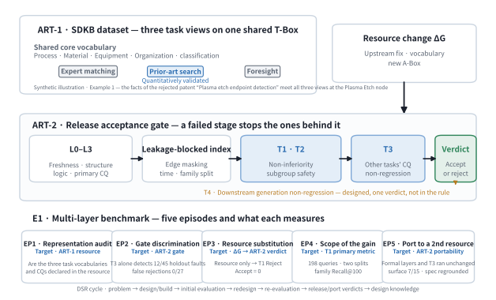
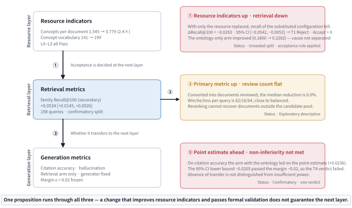
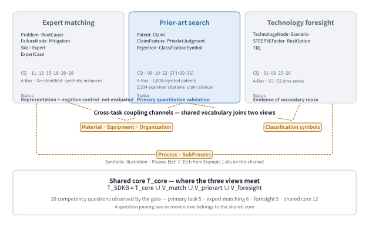
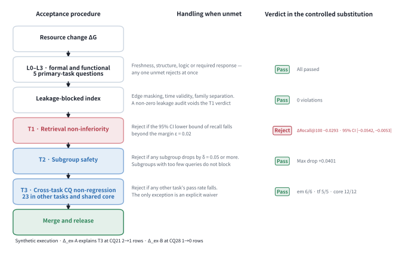
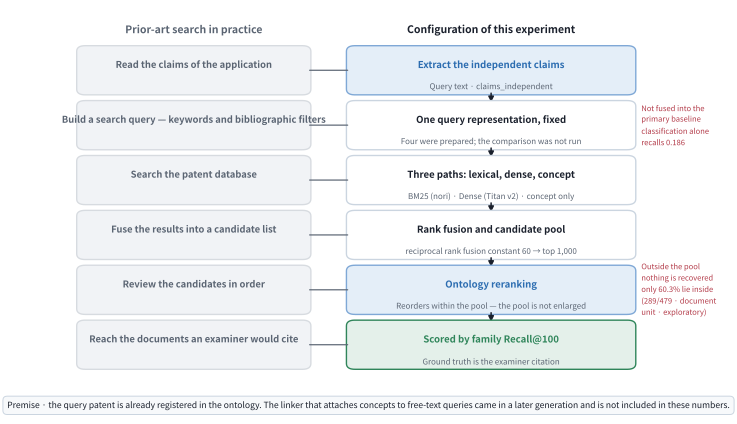
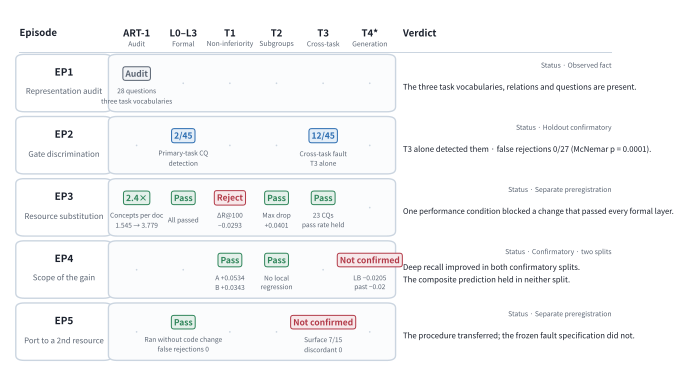
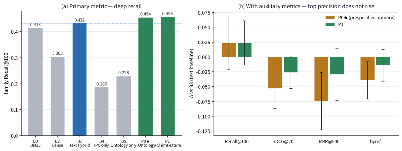

# A Task-Aware Release Gate for Shared Engineering Ontologies with Multiple Task Views: A Design Science Study in Semiconductor Prior-Art Retrieval

## Abstract

Engineering ontologies keep changing after release, and whether a change passing structural and logical checks preserves task performance is a question resource-level evaluation leaves open. The risk grows where tasks share one vocabulary. Following design science research, we present two artifacts and a benchmark. SDKB (Semiconductor Domain Knowledge Base) carries three tasks as views on one shared schema (T-Box). A task-aware release gate adds three conditions to four formal validation layers (L0–L3): retrieval non-inferiority (T1), a subgroup guardrail (T2), and cross-task competency-question non-regression (T3). Five episodes follow. The first three are a representation audit, holdout fault injection (45 unjudged faults) and a controlled resource swap. The last two are a leakage-controlled comparison over two non-overlapping 198-query splits anchored on examiner citations, and a port to a second engineering ontology (building metadata). In the swap, a change raising concepts per document 2.4-fold and passing every formal layer reduced retrieval (family Recall@100 −0.0293, 95% CI [−0.0542, −0.0053]); T1 rejected this one qualifying change. T3 alone detected 12 of 45 cross-task faults, with no false alarm in 27. The pre-registered composite prediction held in neither split: deep recall improved in both (+0.0534, +0.0343), the primary configuration and nDCG@20 did not improve. The ported layers ran unchanged and rejected none of 30 normal deltas, yet the frozen fault specification detected nothing in 12 judgeable instances. In this single port, procedures transferred while fault specifications did not. We state three lessons and two follow-up hypotheses for later testing. Limits: task performance measured in one domain, one refusal of undistinguished cause, no expert relevance judgments.

**Keywords:** semiconductor domain ontology dataset; ontology evolution; task-aware release gate; cross-task non-regression; proxy-metric mismatch; prior-art retrieval; design science research

## Nomenclature

Abbreviations are given in full at first use and abbreviated thereafter. The names of gates and
metrics (L0–L3, T1–T4, Recall@100, nDCG@20) are used verbatim throughout: replacing them with
paraphrases would change what they refer to. The table also lists the five label systems the text
uses.

| Symbol | Meaning (where defined) |
|---|---|
| A-Box | assertional box — the instance layer of an ontology (§3.1) |
| A1–A8 | ablation conditions; A8 is the negative control (§4.4) |
| B0–B5 / P0–P2 | comparison systems — baselines / proposed systems (§4.3) |
| BM25 | Okapi Best Matching 25 — a lexical ranking function |
| CQ | competency question — a question the ontology must be able to answer (§3.1) |
| CQ-PA / CQ-EM / CQ-TF / CQ-CORE | per-task CQ suites — prior-art search / expert matching / foresight / shared core (§3.1) |
| DSR | design science research (§1) |
| EP1–EP5 | evaluation episodes — representation audit, gate discriminating power, resource swap, scope of the retrieval gain, port verdict (§3) |
| G0 / G1 / G2 | the SDKB graph lineage — reference graph / two candidate populations (§3.2) |
| IPC / CPC | International / Cooperative Patent Classification |
| KIPRIS | Korea Intellectual Property Rights Information Service |
| L0–L3 | the four formal validation layers: freshness, structure, logic, function (§3.4) |
| Lessons ①–③ | the lessons of this study, stated as hypotheses for later testing (§6.3) |
| nDCG@20 | normalized discounted cumulative gain at rank 20 |
| Recall@100 | recall at retrieval depth 100, computed at patent-family level |
| RQ | research question — the label of a design question (§1) |
| RRF | reciprocal rank fusion |
| SHACL | Shapes Constraint Language |
| SPARQL | SPARQL Protocol and RDF Query Language |
| T-Box | terminological box — the schema layer of an ontology (§3.1) |
| T1–T4 | the task conditions — retrieval non-inferiority, subgroup non-regression guardrail, cross-task CQ non-regression, downstream generation-layer non-regression (§3.5) |
| \(\epsilon\), \(\delta\) | the non-inferiority margin 0.02 and the subgroup drop limit 0.05 (§3.5) |

---

# 1. Introduction

Engineering organizations accumulate domain knowledge in ontologies and knowledge graphs and
operate retrieval and analysis services on top of them (Bharadwaj & Starly, 2022; Lewis et al.,
2020; Pan et al., 2024). The accumulation is largest in domains such as semiconductors, where
process, device, material, equipment and organization are densely coupled. One physical phenomenon
is named differently depending on context, so retrieval by string matching leaves connections
unreached. Such a knowledge base is not a finished asset, however. It keeps changing, and the
procedure that decides whether a change may be released is far less developed than the accumulation
itself.

Semiconductor knowledge serves more than one task. An equipment defect must be traced from a
failure mode through root causes to the people and skills that address it. Patent analysis must run
from claims through their limitations to a prior-art judgment. Technology planning must connect
technology nodes to scenarios and investment options. These are not three repositories but three
uses of the same knowledge, sharing a vocabulary of processes, devices, materials, equipment and
organizations. **SDKB** (Semiconductor Domain Knowledge Base) is a semiconductor domain ontology
dataset that grew by admitting these three requirements in turn.

**Task-extensible** here names a property. Per-task assets can be added without damaging the
existing structure, while the shared schema (T-Box) and the identifiers are preserved. Per-task
assets are the classes, relations, constraints, competency questions (CQs) and instances (the
A-Box) that a task requires. The property does not imply that one ontology performs equally well on
every task. What an ontology can represent and how far its performance has been verified must
therefore be described separately.

Among the three tasks, prior-art retrieval sits at the front end of research and development and
also admits quantitative measurement. Pre-filing novelty and inventive-step judgments and the
writing of search reports depend on it, and the documents an examiner actually cited supply an
external scoring standard. That external standard is why we measure this task rather than the other
two.

The problem we address is therefore one of knowledge-base operation rather than of ontology theory.
A semiconductor knowledge base keeps acquiring vocabulary, mappings and instances after release, and
each change reaches the retrieval service that uses the same vocabulary at once. The practical
question is whether that change may be released. Patent retrieval research and ontology quality
validation have nevertheless developed with little reference to each other (§2), and passing the
ontology-side checks does not guarantee retrieval performance.

This mismatch between ontology checks and task performance takes two forms. First, a change can
pass the four conventional layers of ontology change validation — freshness, structure, logic and
function (L0–L3) — and still degrade retrieval on a sealed evaluation set. We call this
**task-semantic regression**. Second, where one vocabulary supports three tasks, a change that
favours one task can damage the query paths of another. Merging two similar concepts to raise
recall, for instance, degrades the ability to discriminate `Skill` in expert matching. We call this
**cross-task regression**.

That formal validation detects neither also has a cause on the resource side. The T-Box of this
study carries essentially no logical axiom about prior-art judgment. Constraints such as
disjointness and cardinality are not declared, so the logical consistency layer has little to check
(§5.2). This is not peculiar to our resource. The second engineering ontology we ported to also
declares the domain and range of its predicates in a constraint language rather than in logical
axioms (§5.5). Axiom scarcity is thus not rare among engineering ontologies operated in industry,
and that is where approving changes by formal validation alone becomes fragile.

The two regressions escape detection for one reason. Whoever edits an ontology usually observes
resource-side indicators: growth of the vocabulary, or **concepts per document**, the mean number of
ontology concepts linked to one document. By **resource** we mean the dataset in the state before it
enters an application, comprising the T-Box, the A-Box and the document-to-concept links.
Evaluation, however, has three layers: resource, retrieval and generation (§2.3). We call it
**cross-layer metric misalignment** when an indicator at one layer does not represent performance at
the next. Whether it represents cannot be known before measurement, so resource-layer checks alone
observe neither regression.

The question this study raises is therefore a single one. When an ontology dataset representing
three tasks grows, does it preserve the performance of the primary task without damaging the
function of the others? And how can that be established before release? We treat the question as
design science research (DSR; Hevner et al., 2004; Gregor & Hevner, 2013). In that frame our
interest is not whether a hypothesis is accepted, but how the artifacts were designed and evaluated
and what transferable design knowledge follows. The research questions are the following three,
each shown with the **evaluation episodes (EPs)** that answer it (composition in §3.0).

- **RQ1** — How can one design an ontology dataset that represents three tasks on a single shared
  T-Box while remaining extensible per task? (§3 · EP1)
- **RQ2** — How can one design a gate that evaluates, before release, whether a formally valid
  change damages downstream task performance or the function of the other tasks? (§3 · EP2 · EP3)
- **RQ3** — What gains, failure boundaries and cross-layer metric misalignments are observed in
  evaluating the artifacts, and what transferable lessons follow? (EP3 · EP4 · EP5 · §6)

The contribution is threefold. The first is the **artifact**. SDKB connects three semiconductor
knowledge tasks through common identifiers and a shared T-Box, and supplies per-task views,
competency questions and validation assets. The release gate (T-gate) adds three conditions of
approval to formal validity: non-inferiority of the primary task, a subgroup non-regression
guardrail, and preservation of cross-task function. We release both artifacts and the evaluation
assets in a verifiable form.

The second is **one controlled rejection**. We froze the document set, the code, the settings and
the weights, and substituted the resource bundle alone. Under that condition an actual change that
improved every resource indicator and passed all four formal layers was rejected by one task
condition. We report that verdict together with the procedure that produced it. Qualifying resource changes number one,
so this is not a claim that such rejections are frequent. It is an existence proof, under controlled
conditions, that one can occur.

The third is **three lessons**, evidenced by the case above, the fault injection, and the
measurement of the boundary of the retrieval gain. Fault injection here is a **hold-out** evaluation:
the decision rule is frozen first and the faults are judged for the first time afterwards. We state
the lessons at the size of that evidence, as hypotheses for later studies to test. For the same
reason we report the retrieval gain only with its boundary stated, and we do not present the
generation-layer transfer evaluation as a separate contribution.

The remainder is organized as follows. Section 2 reviews prior work and the research gap and
Section 3 the artifacts and the design and evaluation procedure. Section 4 sets out the evaluation
design, Section 5 the results of the five episodes, and Section 6 the discussion, the lessons and
the limitations. Section 7 concludes.

**Figure 1.** Study overview. The top band is artifact A1, a resource placing three task views on one shared T-Box; the middle band is artifact A2, the release gate that reviews a resource change before it ships; the bottom band is evaluation environment E1, the five episodes and what each measures. The middle band reads left to right, and a failed stage stops the ones behind it. T4, shown dashed, is not part of the approval rule (§3.5.1).

The full text of abridged sections, the appendices and the auxiliary tables are reproduced verbatim
in the supplementary material [S5](../../supplementary/S5-submission-full-v2.md), referred to as S5
below.

---

# 2. Background and research gap

This section reviews four strands in turn. The first two are the unit of evaluation and the nature
of ground truth in prior-art retrieval (§2.1), and how ontology quality validation came to rest on
post-hoc comparison (§2.2). The last two are the proxy validity of resource-side indicators (§2.3)
and the position of this study (§2.4). Taken together they leave one gap. For an ontology that supports several tasks at once,
there is no procedure that decides, before release, whether a change may be accepted.

## 2.1 The unit of evaluation and the nature of ground truth in prior-art retrieval

Prior-art search retrieves, without omission, the small set of documents that may bear on the
novelty or inventive step of a given claim. It is not a task of browsing broadly similar documents.
The primary metric is therefore recall to a sufficient depth (Recall@K) rather than precision over
the first few hits (Lupu & Hanbury, 2013; Shalaby & Zadrozny, 2019). Benchmarks in this line settled
on examiner citations as ground truth (Piroi & Hanbury, 2019; Risch et al., 2020). Methods developed
along three strands: lexical ranking functions, patent-specific semantic representations (Bekamiri
et al., 2024; Ghosh et al., 2024), and citation-network signals (Mahdabi & Crestani, 2014). The
stronger systems do not rely on a single representation (Krestel et al., 2021; Shomee et al., 2025).

An examiner citation is an **observed positive**, not complete ground truth. A cited document is a
relevance signal observed in institutional review. A document that is not cited is unobserved rather
than non-relevant. Examiner citations and applicant citations differ in meaning (Alcácer &
Gittelman, 2006), and the examiner search itself is bounded by time, classification, and
jurisdiction (USPTO, 2023). Recall@K therefore measures the recovery of known positives, not the
recovery of every legally relevant document. We call this ground truth **examiner-validated weak
ground truth**. The score sheet that records which documents are relevant for each query is the list
of **relevance judgments (qrel)**, and ours holds relevant documents only, that is, it is
**positive-only**.

This ground truth can be audited against examination records and was used in actual rejection
decisions, so we treat it as a defined evaluation target rather than a deficiency. What we measure
is therefore recovery of that defined set, not relevance in general, and we confine our claims to
that set (§6.4). Evaluations with incomplete judgments are usually advised to use metrics that are
less sensitive to unjudged documents (Buckley & Voorhees, 2004; Büttcher et al., 2007). Such metrics
presuppose a judged non-relevant set, and our resource contains no such set. We therefore do not use
them (§4.5).

The language axis is separate from the strands above. Prior art is valid regardless of the language
of publication, so complete retrieval must cross language boundaries (cross-lingual retrieval). Two
channels have been used so far: machine translation (Magdy & Jones, 2014; Lee & Choi, 2023) and
multilingual dense representations (Zhang et al., 2023). We found no evaluation that sets the
**language-neutral concept IRI** of an explicit ontology as a third channel and decomposes recall by
the language of the ground-truth document. This axis was not a preregistered confirmatory
prediction, so we report it as an exploratory diagnosis only (§5.4.3).

## 2.2 Ontology quality and evolution validation — from post-hoc description to pre-release acceptance

Work on ontology quality began from design principles such as clarity, consistency, and
extensibility (Gruber, 1993). Competency questions (CQs) became the device that links requirements
to validation items (Grüninger & Fox, 1995), and test-driven ontology development formalized those
requirements into automatic checks (Keet & Ławrynowicz, 2016). In knowledge-graph construction, CQs
have been translated into SPARQL queries and wrapped in SHACL constraints to serve as automated
tests (Mynarz et al., 2023). Those tests guide construction; they do not decide whether a change to
a finished resource may be accepted. On the structural side, quality checking for RDF (Resource
Description Framework) matured (Kontokostas et al., 2014), and SHACL (Shapes Constraint Language)
expresses it in standard shapes (W3C, 2017).

Zaveri et al. (2016), the reference point for linked-data quality, organize quality into 18
dimensions and 69 indicators. That framework describes a state; it is a descriptive evaluation.
On the evolution side, ontology evolution was early recognized as distinct from schema evolution
(Noy & Klein, 2004), and the procedure was later organized into detection, representation,
propagation, and consistency preservation (Flouris et al., 2008; Zablith et al., 2015). What such
procedures validate is whether a change damages the ontology itself, not whether it damages the
tasks that use the ontology. More recent syntactic and semantic quality indicators take the change
itself as their object and compare knowledge graphs automatically before and after (Bakker & de
Boer, 2026). What those indicators produce is a description of the change, not a release decision.
On the downstream side, KGrEaT (Heist et al., 2023) observed that knowledge-graph enrichment is
justified by an assumed downstream gain that is rarely measured. Benchmarks for integration
pipelines have also been proposed, comparing coverage, correctness, and consistency of the loaded
result (Hofer & Rahm, 2026). These too are post-hoc comparisons, and they are not used as a
condition for accepting a change before release.

In engineering informatics the gap matters more, because engineering knowledge is an asset that
changes whenever products, processes, and equipment change. Ontologies in this field are therefore
designed as channels through which several systems share meaning (Chungoora et al., 2013), and
integrating design assets into knowledge graphs must absorb that change continuously (Bharadwaj &
Starly, 2022). The wider the shared scope, the wider the propagation of a change.

Recent work in the field addresses that absorption in three directions. Standardized representation
formalizes drawing elements extracted by computer vision as an ontology (Schönfelder & König, 2025).
Modular architecture absorbs lifecycle-varying requirements in a semantics-based digital twin (Kosse
et al., 2025). Application performance is demonstrated by loading safety risk assessments generated
by a language-model agent into a knowledge graph (Speiser et al., 2026). Their correctness was
confirmed by expert review and SHACL checking. Queries also revealed how a decision in one domain
affects another when safety and process planning share a graph (Johansen et al., 2025).

These three directions show what a resource represents and how it behaves in an application. By
contrast, they do not state which changes to that resource may be accepted and which must be
rejected. A modular structure widens the channel through which change is absorbed but does not
adjudicate an individual change, and observations of cross-domain influence are not used as an
acceptance condition. Validation work in the field likewise reports conformance to structures and
rules (Solihin et al., 2015; Pauwels et al., 2024).

Measuring quality and deciding whether to accept a change are not the same activity. Measurement
produces a value and leaves its interpretation to a person, whereas acceptance combines the value
with a threshold and a decision procedure to settle the release. An acceptance rule therefore
requires three things that a measurement framework does not. These are a threshold frozen before
results are seen, a controlled condition under which it is applied, and an enforcement path that
stops the release on a rejection. The work above measures the quality of the
changed graph or of the construction pipeline without these three, and that difference is the gap
this study addresses. We compose the measurement from preregistered downstream non-inferiority and
cross-task CQ non-regression, and we enforce it as a release-blocking condition.

A second gap follows the acceptance rule. That a rule holds in one resource and that the rule
transfers to another are different claims. An acceptance rule requires not only an execution
procedure but also the constraints and queries that define what counts as a violation. Those depend
on the representational conventions of the target resource. For example, the same rule yields
different results in a resource that declares domains and ranges in schema vocabulary and in one
that declares them in a constraint language. We found no record of applying an acceptance rule
designed on one resource to another and measuring what transfers with it and what must be
redefined. We address this gap in the fifth evaluation episode (§4.6 · §5.5).

## 2.3 Conditions under which a resource-side indicator represents task performance

The checks in the previous section all take the resource itself as their object. Improving a
resource-side indicator is a means to higher task performance, not an end. Measurement theory calls
a value that stands indirectly for another outcome a **proxy metric**; we call it a resource-side
indicator to keep the context explicit. The question of this section is whether such an indicator
can adequately represent task performance.

The problem is not specific to ontology evaluation. When a measure becomes a management target it
may cease to represent what it stood for (Goodhart's law; Strathern, 1997; Manheim & Garrabrant,
2018; Thomas & Uminsky, 2020). Intrinsic evaluation of a resource has not predicted downstream
performance adequately (Chiu et al., 2016; Faruqui et al., 2016), and the relation between retrieval
metrics and generation quality has varied with the pipeline (Samuel et al., 2026; Speiser et al.,
2026). We define the phenomenon in which an indicator at one layer fails to represent performance at
the next as **cross-layer metric misalignment**. The three cases we observed and their
interpretation are collected in §6.1.

**Figure 2.** Cross-layer metric misalignment. The left side shows the indicator structure of the resource, retrieval, and generation layers; the right side shows what was actually observed between them. The number on each arrow at the left corresponds to the numbered observation at the right, and (ii) alone points not to the next layer but to a different unit within the same layer, the number of documents reviewed. Observation (i) is presented in §5.1, (ii) in §5.4.3, and (iii) in §3.5.1 and §6.4; the interpretation is in §6.1.

Ontology evaluation already contains a tradition that faces this question directly. **Task-based
evaluation** couples an ontology to an application and evaluates it by that output (Porzel & Malaka,
2004; Brank et al., 2005). In that tradition, however, task performance served as a selection
criterion for comparing ontologies. We move the point of use: the same task performance becomes a
term in the acceptance rule that decides whether a change may be admitted (pre-release acceptance).

Two layers of the gap therefore remain. First, the reported misalignments are largely correlational.
Cases confirmed under a **controlled resource substitution**, in which documents, settings, weights,
and evaluation sets are fixed and only the resource bundle is replaced, are rare (defined in §3.0).
Second, we found no design that implements this doubt about proxy validity as an acceptance rule.

## 2.4 Task-extensible domain ontology datasets and the position of this study

A domain ontology dataset must provide a shared T-Box that integrates several sources through stable
identifiers and explicit semantic relations. In this it differs from a term list or a single
application model. It must also report the representational scope of the T-Box separately from how
far the A-Box is populated (Wilkinson et al., 2016; Hogan et al., 2021). We therefore name the two
levels distinguished in §1. **Representational scope** denotes whether the T-Box, SHACL shapes, and
CQs can express and execute the queries of the three tasks. **Task-level validation depth** denotes
whether the performance of a given task is maintained or improved against real ground truth and a
candidate pool.

In patent retrieval a graph can compensate for the blind spots of lexical search (Mahdabi &
Crestani, 2014; Siddharth et al., 2022; Daniell et al., 2025). In those studies, however, the graph
is an input representation for performance, and which changes to the graph itself may be admitted is
not addressed. Our direction is to control the evolution of the knowledge graph by retrieval
performance while monitoring that the control does not degrade the other tasks.

**Table 1. Position relative to prior work — the contribution is the combination and the experimental design, not primacy.**

|Research strand|Representative work|Remaining gap|What this study adds|
|---|---|---|---|
|Patent prior-art retrieval and the use of graphs| Lupu & Hanbury (2013); Krestel et al. (2021); Mahdabi & Crestani (2014); Siddharth et al. (2022) |The graph serves as an input representation for performance; controlling change in the graph itself is not addressed|On top of query-citation masking and time/family separation, retrieval performance becomes an approval condition for resource change, and the **upper bound on performance** of that coupling is reported|
|Ontology quality and evolution validation| Kontokostas et al. (2014); Keet & Ławrynowicz (2016); W3C (2017); Zablith et al. (2015) |Asks only whether a change damages the ontology, not whether it damages a task|A 3-condition task gate and a non-inferiority merge rule on top of formal validation|
|Task-based and downstream evaluation| Porzel & Malaka (2004); Brank et al. (2005); Heist et al. (2023) |Used as a **criterion** for comparing and selecting ontologies, or as a post-hoc comparison once construction is finished|The same task performance becomes a term in the approval rule applied **before** release|
|The practice of treating resource indicators as proxies for utility| Strathern (1997); Chiu et al. (2016); Thomas & Uminsky (2020) |The mismatch is reported at the level of correlation; **a controlled case and a decision taken on it** are rare|Controlled confirmation in two conditions differing only in the resource bundle, and an **approval verdict** (§5.1)|
|Semantic representation, validation and application in engineering informatics| Schönfelder & König (2025); Kosse et al. (2025); Speiser et al. (2026); Solihin et al. (2015); Pauwels et al. (2024) |Standardized representation, structural conformance and application performance are shown; **a rule for approving change** is not addressed|Judges **whether a change may be accepted** rather than whether the resource is usable, and reports an actual review (§5.1)|
|Cross-domain use of a shared graph| Johansen et al. (2025) |Stops at **observing** influence between domains|Enforces the same influence as an approval condition — **cross-task non-regression**|

The gap that follows from this review lies in the acceptance design for changes to a domain ontology
that supports several tasks at once. We found no pre-release acceptance design that controls the
overfitting of a gate observing a single task by a **cross-task non-regression** condition. Nor did
we find a record of such a design adjudicating a real change. Nor did we find a measurement of what
transfers when such a design is ported to a resource with different representational conventions
(§2.2).

---

# 3. Artifacts — the SDKB dataset and the T-gate

This section describes what we built and the criteria by which we evaluated it. There are two
artifacts and one evaluation environment that measures them. **A1 · the SDKB ontology dataset** is a
semiconductor domain resource that arranges three task views on one shared T-Box (§3.1–3.3).
**A2 · the release acceptance gate** combines the formal layers L0–L3 with the task conditions
T1, T2 and T3 into a pre-merge acceptance rule. T4 is a design outside that rule (§3.4–3.6).
**E1 · the multi-layer evaluation benchmark** takes examiner citations as its reference, blocks
leakage, and connects retrieval evaluation to generation-layer evaluation (§4).

The three correspond to the three research questions of §1. The design of A1 answers the
representational structure asked by RQ1, and EP1 audits it. The design of A2 answers the acceptance
condition asked by RQ2. EP2 examines its discriminative power, and EP3 the verdict on a change that
arose in a real revision of the resource (§3.0). RQ3 asks which lessons follow from the results of
EP3 and EP4, and the answer is in §6.3.

In design science research, design and evaluation alternate in a cycle. A resource revision is
adjudicated by the gate, what the gate misses is exposed by the evaluation environment, and that
deficit feeds back into the next revision. Evaluation in such a cycle separates into episodes with
different purposes (Venable et al., 2016). Our cycle also did not end after one pass. Table 2 maps
it onto the stages of design science research with the section carrying each stage. At its center
are the rejection of the gate's discriminative power in the first evaluation and the redesign that
followed. This history of iterative design is the basis of the lessons. The promotion criteria
for design knowledge were frozen before results were seen and are stated in §6.3.

**Table 2. Stages of design science research and how they were carried out in this study.**

|Stage|How it was carried out here|Section|
|---|---|---|
|Problem identification|Task performance regressed after a change that passed formal validation| §1 · §2.2 |
|Objective definition|Verify the acceptance condition on the task one layer below| §3.5 |
|Design and development|Artifacts A1 (SDKB) and A2 (the T-gate)| §3.1–3.6 |
|Evaluation round 1|Discriminative power of the gate was **rejected** in the initial fault injection| §5.2 · [S2](../../supplementary/S2-fault-injection-v09.md) |
|Design revision|Separation of the observation scopes of L3 and T3| §3.4 · §5.2 |
|Re-evaluation|Measured again with 45 previously unadjudicated holdout faults| §5.2 |
|Controlled evaluation on a real revision|The gate rejected a real revision of the resource (Accept = 0)| §5.1 |
|Port verdict|Ported the formal layers and the cross-task layer to engineering ontology 2 and adjudicated with the same procedure| §4.6 · §5.5 |
|Design knowledge|Three lessons and two follow-up hypotheses| §6.3 · §6.4 |

The five evaluation episodes are distinguished on three axes: what each asks, what adjudicates it,
and whether the result is confirmatory or exploratory (Table 3). All were conducted under controlled
conditions, and none is a field evaluation in an operating environment. The fifth applies the same
procedure to a different resource (§4.6). The order of sections in the results chapter (§5) differs
from this one, for the reason stated at the opening of that chapter.

**Table 3. Evaluation episodes — EP is a new label and does not collide with the preregistration labels.**

| |Episode|Question|How it is adjudicated|Status|Results|
|---|---|---|---|---|---|
| **EP1** |**Representation audit**|Do the vocabulary, relations, and CQs of the three tasks **exist** in the resource?|Counts and CQ pass/fail (deterministic)|Observed fact| §5.1 |
| **EP2** |**Discriminative power of the gate**|Does the gate **detect** deliberately injected faults without **rejecting** sound changes?|Previously unadjudicated holdout faults and three prespecified conditions|Holdout artifact evaluation of the gate (not part of the confirmatory checks · §4.5)| §5.2 |
| **EP3** |**Controlled resource substitution**|With documents and settings fixed and **only the resource replaced**, what is the verdict?|Application of the preregistered acceptance rule (T1, T2, T3)|Verdict under a separate preregistration| §5.3 |
| **EP4** |**The scope of the retrieval gain and its boundary**|Does ontology enrichment **improve** a strong text baseline, and **how far**?|Preregistered confirmatory evaluation on sealed splits — all accesses were recorded in the access ledger (two non-overlapping confirmatory splits)|Confirmatory plus exploratory diagnosis| §5.4 |
| **EP5** |**Port verdict**|Do the formal layers and the cross-task layer **behave the same on a different resource**?|21 holdout faults and 10 verdicts on the real release lineage under a separate preregistration (the acceptance rule is not completed · T1 and T2 not ported)|Verdict under a separate preregistration| §5.5 |

### 3.0 Units of evaluation and kinds of change

Our evaluation is organized in units of an **evaluation episode (EP)**. One episode pairs one
question with one prespecified decision rule. The five episodes (EP1–EP5) answer different
questions, so the result of one episode does not change the verdict of another.

The gate adjudicates two kinds of change. An **injected fault** is a change we created in order to
measure the detection power of the gate. A **real delta** is a change between versions that arose in
the actual revision history of the resource. We distinguish the two to show that the gate detects
more than manufactured errors.

The faults used to measure detection power are **holdout** faults. A holdout fault was adjudicated
for the first time after the decision rule and thresholds had been frozen, and it was never used to
tune that rule. We also refer to such faults as previously unadjudicated faults.

The effect of a real delta is measured by **controlled resource substitution**. Documents, retrieval
code, settings, splits and the sealed ground truth are all frozen, and only the ontology bundle is
replaced. The difference between two runs can therefore arise only from the resource.

## 3.1 The shared T-Box and three task views

The SDKB T-Box is not a single-purpose schema for prior-art retrieval. The TTL files carry
vocabulary for semiconductor processes, devices, materials, equipment, failures, skills, patents,
organizations and technology strategy. The three tasks traverse it along different paths:
\(T_{\mathrm{SDKB}} = T_{\mathrm{core}} \cup V_{\mathrm{match}} \cup V_{\mathrm{priorart}}
\cup V_{\mathrm{foresight}}\). The views are not exclusive modules; they overlap on shared
concepts.

This decomposition means three things for the design of the dataset. First, the three views are
modules on a shared core \(T_{\mathrm{core}}\) rather than separate ontologies, and the process,
device, material, equipment, and organization vocabularies form the contact surface. Second, the
boundary of a view is defined by the query path rather than by an exclusive partition of classes.
Expert matching uses the same `Equipment` instance as evidence of competence, and prior-art search
uses it as evidence of a technical element. Third, a shared identifier both enables links between
tasks and serves as the propagation path of a regression.

**Figure 3.** The shared T-Box and three task views. The three boxes at the top give the main classes of each view, a representative competency question, the A-Box evidence, and the status of that view in this paper. The three channels in the middle are vocabulary used by two or more views, and the dashed lines from each channel show the two views it joins. The box at the bottom gives the shared core and the number of competency questions per suite that the gate observes. That the three views are not exclusive modules is why the cross-task regression of §1 can occur.

Shared vocabulary is the channel along which cross-task dependency forms (Fig. 3). That a class or
relation exists in the T-Box does not mean that every view is populated to the same degree. The
counts are therefore produced automatically from a fixed release commit.

This structure was chosen against an alternative. One could hold the three tasks as separate
ontologies and join them by alignment mappings. That arrangement lets each schema evolve
independently per task. The mapping must then be maintained as an asset of its own, and the effect
of a change in one ontology on another task is hidden behind that mapping. Our purpose is to observe
that effect before release, so we chose a shared core. The price is coupling. Shared vocabulary
becomes the propagation path of a regression, which is why the cross-task condition T3 is needed in
the acceptance rule (§3.5).

The second decision was to define the boundary of a view by query path rather than by an exclusive
partition of classes. On a semiconductor site the same equipment, process and material vocabulary is
used by equipment engineering, patent practice and technology planning alike, and it does not split
along organizational lines. Replicating classes per view would give the same object different
identifiers and would remove the links between tasks altogether. The dataset instead shares
identifiers and separates views by query, and which view lost function is identified by the per-view
CQ suite.

Competency questions follow the same structure. We separate a CQ suite per task. Questions that
link two or more views, such as supply chain or regulation (CQ13, CQ14, CQ19, CQ21), are assigned to
the **shared core (CQ-CORE)** suite (§3.4, Table 4). Of the three views only prior-art search holds
weak qrel, so only that view admits quantitative validation. That asymmetry is a design choice that
controls the scope of the claims rather than a defect. What covers the three tasks is the observed
fact of the T-Box and the CQs, and we do not claim that the performance of all three was validated.
`NoveltyScore` is derived from the ground truth and is therefore excluded from the retrieval
features.

Adding a task is therefore not completed by adding classes. The dataset requires four assets
whenever a new view is admitted, and we call this the **extension contract**. The four are new
classes and relations, the SHACL shapes constraining their cardinality, a CQ suite representing that
view's queries, and a mapping to the shared core vocabulary. Separating a CQ suite per view is what
makes it possible to identify, after a change, which view was damaged.

The contract is needed because of the shared core itself. A change aimed at one view reaches the
query paths of another through the shared vocabulary. Merging two concepts to raise recall, for
example, increases the candidate set of the prior-art view while reducing discrimination in the
expert-matching view. Structural checks and logical consistency checks observe only the interior of
the changed view and therefore do not see this propagation. That is the direct reason for placing
the cross-task condition T3 in the acceptance rule (§3.5).

## 3.2 Graph lineage and prior-art relations

SDKB is not a single file but a lineage of versions with different purposes and corpora.
**G0** (105,588 triples) is the reference ontology and the **benchmark anchor**. It contains 1,000
rejected patents, 3,034 CitedPatent nodes, 2,534 examiner citations, and the claim and
rejection-judgment T-Box. **G1** (924,814) and **G2** (490,529) are the **candidate population**,
the distractor pool. They add 24,179 patents of integrated device manufacturers and 12,339 patents
of 188 member companies of the **Korea Semiconductor Industry Association (KSIA)**, respectively. A
separate claim-feature sidecar (11,605,931 triples) holds 586,567 Claim, 1,289,512 ClaimFeature, and
635 PriorArtJudgment instances. These counts are those of the resource generation on which every
measurement in this paper was performed (upstream snapshot `d578bf3`).

> **Observed fact.** G1 and G2 are not ontology generations. The T-Box is identical across the three
> graphs: `owl:Class` 103, `owl:ObjectProperty` 97, and `owl:DatatypeProperty` 81 hold in all three,
> and the predicate delta is 0 added and 0 removed. What G1 and G2 add is patent A-Box documents
> only. All 2,211 examiner-citation positives lie inside G0, and 0 positives exist only in G1 or G2.
> Excluding them shrinks the candidate corpus from 40,552 to 4,034 documents. At that point the
> condition of a large candidate pool no longer holds. Because the T-Box never changed, no change
> eligible for testing acceptance safety could exist in this lineage (§6.4). These counts are also
> those of the measurement generation stated above (upstream snapshot `d578bf3`).

The rejected-patent axis consists of six predicate groups. The first is `hasPriorArtExaminer`
(examiner citation), **the relation removed from the retrieval graph under leakage control**. The
others are `rejectedFor` (rejection ground), `hasClaim`/`dependsOnClaim`,
`hasFeature`/`featureConcept`, `hasJudgment`/`aboutClaim`/`overPriorArt`/`onGround`, and
`hasPriorArtApplicant` (applicant citation, kept separate from examiner citation). The model does not stop at citation links between
patents; it expresses which feature of which claim relates to which prior art under which rejection
ground. Representational capability and how far the instance data is actually populated must be
distinguished, however. We therefore report, for each analysis, the number of usable relations and
the proportion missing. Every triple carries a provenance signature, and a **continuous integration
(CI)** pipeline checks consistency on each release.

## 3.3 Reachability of the weak ground truth by observation level, and grades

How far the ground-truth resource reaches into the graph depends on the **observation level**, that
is, on which relations count as a link. Reachability at node level is 95.3%, reachability through
domain semantic relations alone is 54.6–70.5%, and including classification codes returns it to
95.3%. Reachability at ClaimFeature level is 402/584 (68.8%) in the sample that carries a judgment
link. The definitions per level and the full derivation are in S5, and the commands that reproduce
them are in [S1](../../supplementary/S1-appendices-v09.md).

Examiner citations number 2,534 in total, of which 30 are non-patent literature. The figure 2,321 is
the number of distinct patents denoted by `hasPriorArtExaminer`. The numbers 2,534, 2,321, 2,211,
and 584 are different denominators and are not conflated into a single count of positives. Reporting
only the high values at node or classification level would overstate readiness for semantic
retrieval. Describing ClaimFeature 68.8% as a property of the whole would overgeneralize from a
subset.

Relevance grades are distinguished by the granularity of the observed evidence. Grade 2 is a
judgment that links a specific claim to a prior-art document with an identified rejection ground.
Grade 1 is a case in which only a patent-level citation is confirmed; where no citation exists we do
not fix a negative but treat the pair as unobserved. Grade 2 does not imply deeper legal relevance.
The 30 non-patent documents are excluded from the denominator of the main evaluation and reported
separately. Candidates and qrel are counted at DOCDB family_id level, and the main conclusions rest
on the family unit.

The release is partitioned into five parts to block ground truth from leaking in. The five are a
publicly releasable core, development and validation qrel, test judgments sealed until evaluation
(hash pinned, access logged), derived features generated independently of qrel, and provenance. The
dataset release is **pinned** by commit SHA and sha256, and the evaluation protocol and thresholds
are **frozen** before unsealing; pinning does not constrain later improvement of the dataset (§6.5).

## 3.4 The validation gate as a whole

This section begins the description of the second artifact (A2). The evaluation and acceptance
procedure is fail-fast: a failed stage stops the stages behind it. The order is graph delta →
**formal and functional validation L0–L3** → leakage-blocked retrieval index → **T1 retrieval
non-inferiority and T2 subgroup non-regression** → **T3 cross-task CQ non-regression** →
merge and release. T3 comes last for reasons of interpretation rather than computational cost.
T1 and T2 ask about the performance of the gate task, and T3 then asks whether another task was
sacrificed for it.

There are 31 competency questions, and they serve three purposes. The counts in the table below are
read from the query files and the CQ execution artifacts. The three sidecar queries are constant
terms that do not respond to the graph under test, so they are excluded from the decision
denominator.

**Table 4. The 31 competency questions by purpose — the gate denominator is 28 and the representation-audit denominator is 31.**

|Group|Count|Purpose|G0 pass|
|---|---|---|---|
|L3 primary-task suite (pa)| 5 |Functional validation of the prior-art search task| 4/5 |
|T3 suites (em 6, tf 5, core 12)| 23 |Non-regression of the other tasks and the shared core| 23/23 |
|**Gate-observed subtotal**| **28** |Denominator of the acceptance rule| **27/28** |
|Sidecar claim queries (CQ29–31)| 3 |Claim-level measurement only; not part of the acceptance rule| 3/3 |
|**Representation audit, all**| **31** |Denominator of the EP1 representation audit| **30/31** |

L3 and T3 observe disjoint sets. L3 observes the primary-task suite (5 pa questions), and T3 the
other tasks and the shared core (23 em, tf and core questions). The union of the two sets is the
whole of the 28 gate-observed CQs. The separation fixes attribution rather than detection strength.
Under the earlier definition `L3 ⊇ T3` held, so a hypothesis claiming detection by T3 alone could
not be tested. The separation removes that obstacle (the history is in
[S2](../../supplementary/S2-fault-injection-v09.md)). The T3 condition is a deterministic pass-rate
comparison rather than a statistical test. A CQ is a specification, not a sample, so any drop in the
pass rate is an immediate failure. The only exception is an explicit waiver token, and its count is
reported.

## 3.5 The T-gate acceptance rule

A graph delta \(\Delta G\) is accepted as follows.

\[
Accept(\Delta G)=
\mathbb{1}[L0{=}L1{=}L2{=}L3{=}pass]
\cdot
\underbrace{\mathbb{1}[LB_{95\%}(\Delta R_{100})>-\epsilon]}_{T1}
\cdot
\underbrace{\mathbb{1}[\max_s Drop_s<\delta]}_{T2}
\cdot
\underbrace{\mathbb{1}[\forall f\in\{EM,TF,CORE\}:\; PassRate_f(O')\ge PassRate_f(O)]}_{T3}
\]

Because the rule is a product, a single zero term makes the acceptance zero.

The object of the rule is the graph delta \(\Delta G\), but T1 and T2 compare two rankings and
therefore apply in the same form to a change of system configuration. The acceptance verdict on a
resource change is the single case in §5.1, and the verdict in §5.4.1 is a dry run that applies the
rule to a change of system configuration.

**Figure 4.** The T-gate procedure and the actual verdicts. The left column is the order of the acceptance procedure and reads downward. The middle column is the handling when a term is not met, and the right column is the verdict each term actually produced in the controlled resource substitution (§5.1). The right column shows that a change passing every formal layer was rejected on one performance condition.

\(\Delta R_{100}\) is the difference in Recall@100 against the reference version.
\(LB_{95\%}\) is the lower bound of the **confidence interval (CI)** obtained by a
**query-level paired bootstrap** over the same queries. \(s\) ranges over the prespecified
rejection-ground, process and language subgroups, and \(f\) over the CQ suites of the other tasks
and the shared core. What T1 tests is degradation rather than improvement; this applies the logic of
non-inferiority testing, and the margin \(\epsilon\) is registered in advance, independently of
power. A rejection is not a verdict that the change is worthless; it is a demand to identify the
cause, repair the condition, and resubmit.

\(PassRate_f\) is the proportion of competency questions in suite \(f\) that pass the v2
decision, which is the conjunction of an existence check and a polarity-specific distribution check
declared in advance.

\[
pass_{v2}(i)=[\,rows_i \ge expect\text{-}min_i\,]\wedge\neg\,regress_i,\quad
regress_i:\; rows_i<(1-\tau)\,base_i\;(\text{up}),\;\; rows_i>(1+\tau)\,base_i\;(\text{down})
\]

\(base_i\) is the row count of the reference generation, and the polarity is declared per
competency question. T3 therefore detects regression in the size of the response as well as in its
existence.

The three thresholds are \(\epsilon = 0.02\) (non-inferiority margin), \(\delta = 0.05\)
(subgroup drop limit), and \(\tau = 0.05\) (threshold of the distribution check), all fixed before
the evaluation set was unsealed. They are normative choices taken from testing convention and are
not calibrated against reindexing variation or a practitioner-tolerated drop. That deficit and the
method of calibration appear in Table 12 (iv).

T2 carries a conservatism that we stated before results were seen. T2 compares the maximum subgroup
drop against \(\delta\) by a deterministic rule and does not use the lower bound of a per-subgroup
interval. A chance drop in a small subgroup can therefore drive the verdict. When there are few
subgroups, there are few places where a drop can be observed at all. In the confirmatory split of
198 queries, the subgroups satisfying `n≥20` are two on the language axis, two on the
rejection-ground axis, and one on the process-family axis. The rule is frozen and is not changed;
per-subgroup interval estimation is deferred to a later preregistration.

### 3.5.1 T4 — non-regression at the downstream generation layer (one verdict, not part of the rule)

Applying the logic of the acceptance rule one layer further down leaves the question of whether an
indicator at the retrieval layer represents value at the generation layer below it. We could not
confirm that representativeness, so we state a fourth condition separately. In what follows, a
**retrieval configuration** denotes the retrieval system that supplies documents in each comparison
condition.

> **T4 (downstream generation non-regression).** With only the retrieval configuration replaced and
> the generator fixed, the citation accuracy of the documents offered as evidence must not decrease.
> The hallucination rate must not increase. What is fixed here is the model, the prompt, the
> temperature, the seed and the context size K.

T4 is not part of the acceptance rule above. The margin and the hallucination threshold were frozen
in a commit made before unsealing, and the verdict was issued once and failed (§6.4). The
preconditions for a formal evaluation are met, but adopting the condition into the rule requires
repeated validation. Revising a release rule on the strength of a single failure would be an
overclaim in the opposite direction. The full statement of thresholds and evaluation conditions is
in S5, Appendix A.

## 3.6 Release operation in a continuous integration pipeline

The two preceding sections describe the rule of acceptance; this one describes the procedure that
executes it. The gate sits where ontology maintenance meets the operation of the retrieval service.
A full manual review for every added concept alias or altered classification mapping is not
required. We run the formal layers and the task conditions in a **continuous integration (CI)**
pipeline instead.

The unit of operation is a candidate release delta, which enters the pipeline before it is merged.
The pipeline pins the snapshot, runs formal validation L0–L3, and rebuilds the leakage-blocked
index. T1 and T2 then run against a frozen retrieval regression set and T3 against the cross-task
suites. A failed stage stops the stages behind it (§3.4). Only a delta passing every stage is
merged, and we provide no bypass path.

Each run leaves its verdict as an artifact. The per-file hash of the snapshot, the corpus signature
and the per-term verdicts are recorded together, so a verdict can be reproduced. We track the
per-subgroup drop (T2) and the CQ pass rates of the other tasks (T3) across releases. That makes
visible both the local failures hiding under an average and the erosion between tasks. An exception to T3
is admitted only by an explicit waiver token, and the cumulative count is reported.

We measured the cost of a run in the port verdict (§5.5). On a graph of 55,887 triples with 15
competency questions, mean runtime per layer was 124 s for L1, 12.5 s for L2 and 1.6 s for L3 with
T3. Peak resident memory was 595 MB. The formal and cross-task layers together therefore take
about 138 s. This states feasibility at that scale rather than scalability, and it excludes T1 and
T2, which rebuild the retrieval index.

We also bound what the procedure covers in operation. A per-term score supports review
prioritization and does not replace a legal judgment. Nor are the three tasks validated to the same
depth. The expert-matching and foresight views are objects of T3 regression monitoring, and the
retrieval performance of those two is not claimed in this study.

---

# 4. Evaluation design

This section describes the evaluation environment (E1), the system that validates the two artifacts
above. The detailed specification and the full text of the unexecuted design are in the
supplementary material [S1](../../supplementary/S1-appendices-v09.md) and
[S3](../../supplementary/S3-unexecuted-design-v09.md).

Each episode fixes and varies different things (§3), so the same ontology holds a different status
from section to section. In EP2 (§4.4) the ontology is the object under test. In EP3 (§5.1) it is
the sole variable with documents, settings, and weights held fixed. In EP4 (§4.1–4.3 · §4.5) it is
an input feature of the ranking function. In A8 of §4.4, one layer of the ontology serves as a
**negative control**, a condition whose removal should leave retrieval performance unchanged (§4.4).

This experiment mirrors the procedure of prior-art search in practice. A searcher reads the claims
of the target application, formulates a query, obtains candidates, and reviews them in order.
Figure 5 gives the correspondence between that procedure and the configuration of this experiment,
and marks the two places where the correspondence fails. The first is that the configuration
corresponding to bibliographic conditions in practice is not fused into the primary baseline. The
second is that reranking in this experiment does not enlarge the candidate pool. The effect of these
two constraints is treated in §4.3 and §6.2, respectively.

**Figure 5.** Correspondence between practice and the experimental configuration. The left column lists the stages of practice and the right column the configuration of this experiment at each stage. The two notes in the right margin mark where the correspondence fails, and the band at the bottom states the premise under which the numbers of this section hold.

## 4.1 Evaluation queries and the time and family split

The premise on which this benchmark rests appears in the bottom band of Fig. 5. The numbers in this
section were produced under the condition that the query patent is already registered in the
ontology. The effect of that constraint and the way to remove it are in §6.4. The unit of the
main analysis is one rejected patent, and the query text is the full text of the independent claims
(median 527 characters). Four query representations were prepared, but the comparison was not run,
and the main analysis uses the claim-only representation.

A random split can mix in the same family and future information. We therefore sorted the query
patents by filing date and assigned the oldest 60% to training, the next 20% to development, and the
most recent 20% to test. Documents of the same DOCDB family were placed in a single split.
The split is as follows: 600 training, 200 development, and 200 test; boundaries 2016-11-21 and
2021-07-21; 959 distinct families with no overlap; queries with at least one known positive number
197 in development and 198 in test. The boundaries and the seed were fixed in code before the test
qrel was unsealed, and the test qrel was sealed in a separate file (479 edges over 198 queries). We
do not change the boundaries after seeing test performance.

## 4.2 Candidate population and leakage control

The candidate population of each query is \(D_q=\{d \mid t_{\mathrm{pub}}(d)<t_{\mathrm{cutoff}}(q),\;
family(d)\neq family(q)\}\), where \(t_{\mathrm{cutoff}}\) is the filing date of the query
patent. Candidates are not restricted to qrel documents: every document satisfying the time
condition enters the candidate set, and the qrel serves only as the score sheet. Valid patents in
the same classification or process that were not cited are included as hard negatives. Derived
features whose time point cannot be reconstructed are excluded from the main analysis.

In the **(a) oracle-free main analysis mode**, the citation edges of the query patent
(`hasPriorArtExaminer`, `hasPriorArt`, `overPriorArt`) are removed from the index and the features.
Concept links, feature alignments derived from the qrel, and any ground-truth-derived indicator are
also excluded. After removal, the signals remaining in the ontology-only configuration are three —
concept links, classification symbols, and paths — and none of them touches the ground-truth axis.
The **(b) citation-assisted** and **(c) GT-assisted** modes are stored apart from the main
conclusions and are not used for performance claims. Every verdict in this paper is derived from (a)
alone.

## 4.3 Comparison systems and the proposed ranking function

Four configurations carry the verdicts in this paper. They are **B3** Text Hybrid (**the strongest
text baseline**), **B5** Ontology-only (concept path alone), **P0** Text+Ontology (**the
prespecified primary configuration**) and **P1** +ClaimFeature (**the secondary configuration**).
The claim that B3 is the strongest text baseline decomposes into three configurations: lexical alone
(B0), dense alone (B2) and classification alone (B4). Their values, practice-stage correspondence,
input text, code entry point, output ranking files and scoring paths are in S5. B1 (BM25-Fielded)
and P2 (+Ground-aware) were designed but not implemented, so no value exists to report; they were
not excluded because their results were unfavorable.

The comparison configurations must respond differently to a resource change, and that difference is
what makes the control valid. Table 5 gives the control role of each configuration and the
observation that role requires.

**Table 5. Control roles of the comparison configurations — the response each must show when only the resource is substituted.**

|Configuration|Control role|Required observation|
|---|---|---|
|BM25 (B0), Dense (B2), CPC/IPC (B4)|Control-integrity reference|The rankings must be identical across the two conditions in which only the resource was substituted; if they differ, the control does not hold|
|Text Hybrid (B3)|Negative control|It must not respond to a change in the ontology resource|
|Ontology-only (B5)|Exposure reference|It is the configuration that responds most directly to a resource change|
|Text+Ontology (P0), +ClaimFeature (P1)|Downstream sensor|The verdict of condition T1 is produced on these two configurations|

The role distinction was confirmed by observation. When only the resource bundle was substituted,
the values of B0, B2, B3, and B4 were unchanged and only the Ontology-only configuration moved, by
27% (Table 7). The check is made on identity of rankings rather than on file hashes, because the
hybrid ranking file is not byte-reproducible even for identical inputs
([S5](../../supplementary/S5-submission-full-v2.md)).

The dense baseline B2 is Titan Embed v2 alone. The reasons for not using a patent-specific encoder
are in S5, together with the history of adding a multilingual long-document encoder under a separate
preregistration after the confirmatory verdicts. The results are in the exploratory rows of Table 8.

The score of a candidate patent is the weighted sum of lexical, semantic, concept-overlap, path,
feature-coverage, and rejection-ground compatibility terms,
\(S(q,d)=w_b\widetilde{BM25}+w_e\widetilde{\cos}+w_c ConceptOverlap+w_h PathSim+w_f FeatureCoverage
+w_r GroundCompatibility\), and each term is normalized to [0,1] per query. The term definitions and
the full weight grid are in S5. The weights were selected on the development set by a preregistered
grid, and optimization against the test qrel is prohibited. Of the six terms, the hierarchy path
weight \(w_h\) converged to 0 on that grid, so a delta that changes only the hierarchy is in
principle unobservable to this score (§6.2). The proposed systems also rerank the top 1,000 of the
text baseline rather than enlarging the candidate set. That design choice is the cause of the
reranking ceiling diagnosed in §6.2 (the counts are in S5).

Four auxiliary indicators based on feature coverage, designed to separate novelty from inventive
step, were specified but not computed ([S3](../../supplementary/S3-unexecuted-design-v09.md)). The
rejection-ground axis is treated only in the subgroup analysis of §5.4.2.

## 4.4 Fault injection and ablation conditions

Confirming the actual detection power of the gate requires feeding it graphs that have been damaged
on purpose (fault injection). We designed 12 fault types. Ten are confined to a single task, with
types covering freshness, structure, logic, CQ function, semantic alignment, hierarchy flattening,
judgment-context substitution, metadata deletion, temporal leakage, and qrel leakage. The remaining
two are cross-task faults: erroneous merging of similar concepts as synonyms, and inversion of the
shared hierarchy of `Process` and `SubProcess`. Both can be harmless or even favorable to retrieval
while damaging the CQs of another task. Each type is repeated three times at strengths of 1%, 5%,
and 10% (108 instances), and we also report the rate at which sound changes were wrongly rejected.

Those 108 instances were adjudicated three times while the decision rule was revised three times, so
the final adjudication is not confirmatory. We therefore preregistered and injected 72 further
instances that had never been adjudicated, with the rule held fixed (holdout confirmation). They
comprise 18 repeated-axis instances, 27 instances of three new cross-fault families, and 27 sound
deltas. The three new families change only predicates whose intersection with those referenced by
the primary-task CQs is empty. Cross-task character is therefore secured by construction rather than
by interpretation of the result. This property and the decision rule (detection by T3 alone ≥1,
one-sided **McNemar test** *p*<.05, false-positive rate ≤5%) were fixed before execution
([S2](../../supplementary/S2-fault-injection-v09.md)).

Ablation removes one layer at a time from the secondary configuration P1 and measures the
contribution of each layer; the reference configuration is P1 because P2 was not executed (§4.3).
Eight ablation conditions were preregistered, and the text defines two. **A7** removes all ontology
features, and **A8** removes the expert-matching-only layers (`Skill`, `ExpertCase`, `Mitigation`);
the definitions and results of the remaining six (A1–A6) are in S5 in full.

The status of the two conditions differs. The larger the drop caused by removing a layer, the larger
the contribution of that layer. The prediction of the layer-contribution check was that the loss
from removing the feature and rejection-ground layers exceeds the loss from removing the
classification signal. A8, by contrast, was selected to be theoretically unrelated to retrieval, so
removing it should leave performance unchanged (the layer-specificity check). What to do if
performance dropped markedly under A8 was also stated before results were seen: abandon the control
framing and report the finding as an observation of cross-task dependency (§6.3).

Expert relevance judgment was designed but not performed, and no number in this paper depends on it.
The full protocol is in [S3](../../supplementary/S3-unexecuted-design-v09.md), and the scope of
claims constrained by its absence, together with the specification for removing it, is in §6.4.

## 4.5 Metrics, statistics, and preregistration

The primary metric is **family-level Recall@100**. It measures how many known related documents
appear within the top 100, counting foreign counterparts of the same invention once. A searcher
reviews to a fixed depth, so the absence of omissions within that depth matters more than the
precision of the ordering above it.

Auxiliary metrics answer three questions. Recall to greater depth is answered by Recall@50 and
Recall@500, and we call recall observed beyond the top 100 **deep recall**. Ordering at the top is
answered by **normalized discounted cumulative gain (nDCG)@20**, **mean reciprocal rank (MRR)@K**,
and **Success@K**. Review cost is answered by **Effort@Recall**, **Candidate Reduction**, and
latency. The four metrics of the generation stage are not retrieval-layer metrics and therefore do
not appear in the tables of §5.4.

We do not use precision or **binary preference (bpref)**. Both require treating uncited documents as
non-relevant, and our ground truth is partial, so that assumption does not hold (§2.1). nDCG@20 is
computed with binary gain because the qrel is entirely grade 1, and grades are not generated after
the fact. Because the ground truth is partial, we check in two ways whether paired comparisons
depend on unjudged documents. The two are a composition comparison of the unjudged documents in the
top 100, and the minimum number of judgment reversals. Neither creates a new verdict. The
definitions and full results of both checks are in
[S5](../../supplementary/S5-submission-full-v2.md).

Statistical analysis proceeds as follows. System comparisons are paired over the same queries and
resampled 10,000 times (paired bootstrap) to produce 95% confidence intervals. Without pairing, a
difference in query difficulty can be mistaken for a difference in performance. Point estimates and
win/loss/tie counts are computed directly from the per-query differences of the original sample, and
two-sided *p* values come from the resampling distribution. The resampling seed was fixed in code
before unsealing (§4.1). Layer comparisons of detection rates use the McNemar test, and multiple
comparisons use the **Holm correction**. Subgroup results are reported with the number of queries
and the number of positives, and we suspend conclusions when the sample is insufficient. The
boundary of the lexical-overlap subgroups was also frozen before results were seen. On the
development set of 197 queries we fixed the first quartile of the character 3-gram Jaccard
distribution, Q1 = 0.0079, as the low-overlap boundary. The same value was applied to the
confirmatory split, which divided into low 27 and high 171. This score is an **analysis-only
stratification label** and is not fed into the ranking function.

We froze three evaluation checks before results were seen. The two confirmatory splits do not
overlap and were registered separately, so the table below separates predictions and verdicts by
split. Data, ontology, shapes, CQs, index, and model versions were pinned by hash, and the seed, the
lockfile, and the split identifier lists are public. The correspondence between check names and
registration documents is in
[S6](../../supplementary/S6-preregistration-crosswalk.md), and the full history of preregistration,
sealing, and unsealing is in S5.

**Table 6. The preregistered evaluation checks and their verdicts — the evidence and the full text are in Section 5 and in supplementary S5.**

|Evaluation check|Status|Prediction frozen before results were seen|Verdict recorded per preregistration · first confirmatory split (A)|Verdict recorded per preregistration · second confirmatory split (B)|Evidence|
|---|---|---|---|---|---|
|**Check 1 · retrieval utility**|Confirmatory|Ontology-enriched retrieval exceeds the strongest text baseline on **both Recall@100 and nDCG@20**, and the improvement is larger in the subgroup with **low** lexical overlap between query and positives|**supported for the primary metric only** (R@100 improved significantly on P1; the nDCG clause was not met; the prespecified primary configuration did not reach significance; the low-overlap clause was contradicted)|**not supported** (R@100 improved but the nDCG clause was not met; the primary configuration did not reach significance)|§5.4.1 (panels A and B)|
|**Check 2 · layer specificity**|Confirmatory|Removing the expert-matching-only layers (`Skill`, `ExpertCase`, `Mitigation`), which are unrelated to the gate task, **does not change retrieval performance significantly**|**rejected — an observed cross-task dependency** (removal degraded retrieval significantly)|**not reproduced; no verdict can be issued** (the same ablation gave 0.0000, which does not separate no effect from nothing to remove)| §5.4.2 · §5.4.1 · §6.3 |
|**Check 3 · transfer**|Confirmatory evaluation (gate condition T4)|With only the retrieval configuration replaced and the generator fixed, **citation accuracy does not decrease and the hallucination rate does not increase** (margin frozen)|*(exploratory evaluation — the purpose was to freeze the procedure; no verdict)*|**1 verdict issued, failed — we could not confirm transfer** (the point estimate favored the proposed configuration, but the lower bound fell below the margin; the cause is not separated)|[S5](../../supplementary/S5-submission-full-v2.md), Appendix A|

Three further items were registered as design evidence beyond the three checks: **discriminative
power of the gate** (§3.5 · §5.2), **acceptance safety** (§6.4), and **layer contribution**
(§5.4.2). These are treated as design evidence rather than confirmatory checks, and their verdicts
are reported as they stand. Operational efficiency, signal by rejection type, semantic reachability,
and cross-lingual recall were never part of the confirmatory set and are reported as exploratory
analysis only.

Leakage checking confirms automatically, at four layers, that the number of forbidden edges
remaining after qrel masking is 0; the development split measured 0 violations across all seven
system runs. The two points at which reproducibility control is incomplete are stated in §6.5.

## 4.6 Protocol for porting to a second engineering ontology

Every evaluation so far was performed on one resource, and whether the gate procedure is independent
of the resource is confirmed only by applying it unchanged to another. This section states the
object and scope of that port, the decision rule, and the promotion rule frozen before results were
seen. It is the fifth episode under a separate preregistration (EP5) and changes no verdict or
number of the first four.

The target is Brick, a building metadata ontology, selected on five criteria. These are a public
T-Box, a public instance model, a tagged release lineage, explicit deprecation and migration rules,
and SHACL constraints shipped with the distribution. The instance models were split into a
development set, used to write competency questions, and a holdout set used only for adjudication.

The two resources differ in purpose and in evolution regime, and that difference is the design
rationale of this episode. Ours holds the evaluation assets of a downstream retrieval task, yet no
predicate delta occurred in its T-Box across three generations and only one resource change was
eligible (§3.2 · §5.1). The second is the reverse. Every adjacent release carries a real T-Box
change with official deprecation and migration rules, but it has no ground truth and no candidate
pool, so the retrieval conditions cannot apply. The two therefore evaluate different halves of the
gate, and the half ported here is the overlapping one. The four formal layers, condition T3 and the
fault-injection procedure move by replacing a profile file, with no code change. T1 and T2, which
require ground truth and a candidate pool, are excluded. The acceptance rule is therefore not
completed on this resource, and only the conjunction of the formal and cross-task layers is recorded
in a separate field.

The task views are fault detection and diagnosis, and spatial zone occupancy, with one shared
vocabulary view added. There are 15 competency questions, five per suite. The cross-task faults are
inversion of a containment relation, rewiring of a location link, and erroneous equivalence
declaration of a shared relation, for 21 instances. The negative control is 30 synthetic sound
changes. The per-file hashes of the resource and the competency questions, the fault specification,
the random seed and the threshold grid were all frozen before execution.

The promotion rule for design knowledge was also fixed before results were seen. Because this port
does not include T1 and T2, it does not widen the evidence for any lesson about the acceptance
layer. The only lesson whose evidence it can widen is cross-task monitoring (§6.3, Lesson ②)
(full protocol in
[S8](../../supplementary/S8-second-domain-port.md)).

---

# 5. Evaluation results (EP1–EP5)

This section reports five findings. First, a real resource change that passed all four formal layers
was rejected by the performance condition T1 (§5.1). Second, condition T3 alone detected a
cross-task fault that both formal validation and the primary-task performance check missed (§5.2).
Third, the gain from ontology reranking lies in deep recall and was observed in both non-overlapping
confirmatory splits (§5.4.1). Fourth, the boundary of that gain was quantified in the same
experiment. Ordering at the top did not improve, and the benefit vanishes when converted into the
number of documents reviewed (§5.4.1 · §5.4.3). Fifth, the formal layers and the cross-task layer
ran on a second engineering ontology without code changes. The frozen fault specification, however,
had to be redefined for the modeling conventions of that resource (§5.5).

The order of presentation follows the weight of the findings rather than the episode numbers. The
record of the acceptance rule rejecting a real delta comes first, and the representation audit that
confirms the presence of the vocabulary in the resource comes third. The first paragraph of each
section states both the conclusion and the confirmatory status of that section. The status of each
episode is in Table 3, and the verdicts of the preregistered checks are in Table 6 of §4.5. Figure 6
maps the five episodes onto the terms of the acceptance rule of §3.5 and gives the verdict for each.
Every section of this chapter elaborates one row of that map.

**Figure 6.** Evaluation episodes mapped onto the terms of the acceptance rule. Rows are episodes and columns are terms of the rule; only the leftmost column is the resource rather than the gate. The symbol in each cell is the verdict and the line beneath it the evidence. A blank cell means that the episode did not examine that term. T4 is marked with an asterisk because it is not part of the acceptance rule.

## 5.1 EP3 · Controlled resource substitution — an actual rejection by the gate

The performance condition T1 rejected a change that passed all four formal layers and improved every
resource-side indicator. This is the record of the acceptance rule of §3.5 rejecting a real delta,
and it shows that formal validation cannot stand in for the task conditions.

This section reports a verdict under a separate preregistration, and its resource snapshot is a
post-correction generation. The confirmatory verdicts of §5.4 are therefore not changed by this
section, and the verdict on acceptance safety is in §6.4.

The change under review is the first T-Box predicate delta in this study, and it arose from an
upstream correction. The delta moves the upstream snapshot `d578bf3` → `2839afb`, triples 105,588 →
105,713, `owl:ObjectProperty` 97 → 98 and `skos:broader` 11 → 18, with classes unchanged at 103.
There are two arms. Arm O ran the pre-correction resource bundle and arm O′ the post-correction
bundle through the same pipeline. A resource bundle here consists of the ontology, the surface-form
dictionary, and the concept mapping. The text-to-concept linker was frozen before the two arms were
produced, and both run records point to the same code commit. In arm O the concept dictionary was
absent from that snapshot, so the linker was inactive. Reassembly with the linker running but the
dictionary removed reproduced the corpus hash byte for byte (pre-check P-1), so the two arms differ
only in the resource bundle. In arm O′ the dictionary applied and concepts per document rose from
1.545 to 3.779 (2.4×). The concept vocabulary grew from 141 to 199, and 128,875 new links were
created. Two conditions differing only in the resource bundle were thus established for the first
time, with documents, code, retrieval settings, weights, splits, and the sealed qrel all frozen.

Every resource-side indicator improved. All resource criteria that had called for improvement were
met, and formal validation L0–L3 passed in full. In that state we fed the new resource into the same
pipeline and measured again.

**Table 7. Retrieval performance when only the resource bundle is substituted (test, 198 queries, family Recall@100).**

|System (test, 198 queries, family R@100)|O (before correction)|O′ (after correction)| Δ |
|---|---:|---:|---:|
|B0, B2, B3 text; B4 classification|unchanged|unchanged|0 (the text side was not changed)|
|**B5 ontology-only**| 0.1800 | **0.2282** | **+0.0482 (+27%)** |
| P0★ | 0.4635 | 0.4543 | −0.0092 |
|**P1 (the substituted configuration)**| 0.4849 | 0.4556 | **−0.0293** · 95% CI [−0.0542, −0.0053] |

The verdict is a rejection under T1 (Accept = 0). The lower bound of the 95% confidence interval on
ΔR@100, −0.0542, falls below the non-inferiority margin −ε = −0.02, so T1 was not met. T2 (maximum
subgroup drop +0.0401 < δ = 0.05) and T3 (em, tf, and core pass rates held at 1.000) were met, and
T1 is the only unmet condition. This is a case in which a single performance condition blocked a
change that passed every formal layer, and it is the observed instance of the task-semantic
regression defined in §1.

What this comparison identifies is not the effect of the T-Box alone. It is the change in mean
per-query recall when the resource bundle is substituted in a frozen pipeline. Because documents,
code, parameters, weights, splits, and the sealed qrel were fixed, the observed difference is not
explained by a difference in the pipeline or in the evaluation sample. Which component inside the
bundle produced the drop, however, is not separated by this comparison alone.

We first examine whether the verdict can be read as a false rejection. That a defect in the scoring
function produced the drop is not excluded. What the acceptance rule rejected, however, is not the
resource in itself but the deployment of that resource into that pipeline. The unit of release
approval is the deployment, so the object of the rejection and the object of the verdict coincide.
The ontology-only configuration in fact improved by 27% under the same substitution. This result is
therefore not evidence that ontology enrichment is useless. It is evidence that a change that
improves resource-side indicators and passes formal validation can still degrade performance.

We state the two remaining points together. First, the cause of the drop is not separated. When
concepts per document rise 2.4-fold, the denominator of the unweighted Jaccard grows, and
high-frequency general concepts (`식각` etching in 6,974 documents, `챔버` chamber in 6,462) form tie
blocks without discriminative power. Whether this is a defect of the resource or of the scoring
function is not separated by this experiment. Separating them requires document-frequency weighting,
which is a new method rather than a re-measurement. Second, this run is an application of the
acceptance rule rather than a re-confirmation of superiority (§4.5).

What this case indicates for operation is confined to one statement. In this single instance, had
the task conditions been absent, a resource bundle degraded by 0.0293 in family Recall@100 would
have been released. Under a procedure approving changes by formal validation alone, this change
would have been accepted. The scope of the statement is one qualifying change, and it indicates
neither the frequency of blocked incidents nor a general preventive effect.

## 5.2 EP2 · Discriminative power of the gate — a holdout artifact evaluation

Condition T3 alone detected a cross-task fault that both formal validation and the primary-task
performance check missed. This section reports a holdout evaluation carried out with the rule
frozen, and it is not one of the three confirmatory checks of §4.5.

With the rule unchanged, we injected 45 cross-task faults and 27 sound deltas, and all three
prespecified conditions were met (detection by T3 alone 12/45; one-sided McNemar *p* = .0001; false
positives 0/27). In the three new families, the manipulated predicates have an empty intersection
with the 20 predicates referenced by the primary-task CQs, which secures cross-task character by
construction. The CQ that regressed also points to a different task in each fault family (F13→CQ11,
F11→CQ18, F14→CQ28, F15→CQ13). T3 therefore identifies not only that damage occurred but which
specification of which task was damaged.

This discriminative power was secured after one rejection. The form first preregistered stated that
a fault changing another task is detected by T3 alone, and it was rejected on the 108 development
cases (detection by T3 alone 0/18; McNemar b=19, c=0, the direction opposite to the hypothesis;
false positives 0/18). The cause lay not in the gate design but in the overlap of the observation
scopes of the two checks, under which `L3 ⊇ T3` held. In that condition detection by T3 alone was
impossible by definition (0 cases across all 135 instances). The remedy was to separate the two
scopes (§3.4). Because the union remains the full set of 28 CQs, detection power is preserved and
only the detecting component changes (`L3_all ⟺ L3_pa ∨ T3`, 0/144 violations).

We report the boundary of this discriminative power as well. Detection is sensitive to the threshold
of the distribution check: the 12/45 at the prespecified τ=0.05 falls to 4/45 at τ=0.10 and rises to
17/45 at τ=0.00 (Table 11). Even at the prespecified threshold, 33 of the 45 faults were not
detected by T3 alone. Shared-hierarchy inversion (F12) was again 0/9, so detection power for that
type remains unconfirmed. False-positive control, by contrast, produced 0 of 27 sound deltas, and
the 95% one-sided upper bound on the false-positive rate that this sample admits is 10.5%. The
formal layer L2 also has, in effect, no logical constraint capable of detecting such faults. The
T-Box carries no disjointness or cardinality constraints, so an injected type contradiction does not
constitute a contradiction.

## 5.3 EP1 · Representation audit — presence of the three task vocabularies in the resource

The vocabularies of the three tasks are dataset properties observable in the current T-Box rather
than a future design. This is an observed fact, and the objects are graphs G0, G1 and G2 with the 31
audit CQs.

The TTL files contain the anchor classes of all three views. Expert matching has `Problem`,
`FailureMode`, `Skill` and `Expert`. Prior-art search has `Claim`, `ClaimFeature` and
`PriorArtJudgment` with the citation and judgment relations. Technology foresight has
`TechnologyNode`, `Scenario`, `RealOption` and the `filingDate` time axis. The full list per view is
in [S5](../../supplementary/S5-submission-full-v2.md). In functional validation, G0 passes 27 of the
28 CQs the gate observes, and G1 and G2 pass 28. The three sidecar claim queries pass on all three
graphs, so on the full audit denominator of 31 G0 passes 30 (§3.4, Table 4).

Representational scope and retrieval readiness are not the same. How far the cited prior art reaches
into the graph depends heavily on which relations count as a link, and the values per observation
level are in §3.3. This reachability also varies by language. The proportion of candidate documents
holding a concept link is 99.2% for Korean, 69.6% for English, and 0% for Japanese, while
classification coverage is 100% in all three languages. The language-neutral concept IRI is thus a
property of the T-Box level, and at the A-Box level non-Korean documents carry fewer concepts. This
asymmetry is the premise for reading §5.4.3.

The counts of the feature resource and the reachability of the judgment-linked sample are in §3.2
and §3.3, and the two values indicate that claim-level evaluation is feasible. The cross-task CQ
pass rate did not fall, and the cumulative waiver count is 0.

The claims supported by this section are confined to three. A CQ pass indicates the existence of a
query path and a non-empty response; it does not validate the accuracy of the three tasks. The
earlier-generation report that expanding process links raised the candidates of one CQ from 8 to 90
(S5) is a value about candidate generation, not about ranking quality. The T-Box of G0, G1 and G2 is
identical, and pass-rate variation follows from how far the A-Box is populated. The numbers in this
section are therefore not evidence of generation safety (§6.4).

## 5.4 EP4 · The scope of the retrieval gain and its boundary

This episode ran preregistered confirmatory evaluations on sealed splits twice. The two splits do
not overlap and were adjudicated separately, each under its own preregistration. All accesses to the
seal of the second split were recorded in the access ledger, and the unsealing history of the first
split is stated in its preregistration document.

### 5.4.1 Retrieval performance and the verdicts of the confirmatory checks

The improvement in deep recall was observed in both non-overlapping confirmatory splits. The
preregistered composite prediction, by contrast, held in neither split.

Panel A is the first confirmatory split (198 queries, 479 qrel edges) and panel B the second,
non-overlapping split (198 queries, 503 qrel edges). The two panels are neither pooled nor averaged.
The decision rule, margin, weights, and retrieval settings of panel B were inherited from panel A
and fixed in a commit made before unsealing (`67568c8`). The second split examines the first of the
five certainty conditions, observation in both non-overlapping splits (end of this section).

**Table 8. Retrieval performance in the two confirmatory splits (2 panels) — the baseline is the Text Hybrid (B3) of each panel; Δ and the win/loss/tie counts summarize the original sample paired per query, and the 95% confidence intervals and two-sided *p* values come from a query-level paired bootstrap with 10,000 resamples.**

| |System| R@100 | Δ vs B3 | 95% CI | *p* |Win/loss/tie| Δ nDCG@20 | *p* |
|---|---|---:|---:|---|---:|---|---:|---:|
| **A** | **Text Hybrid (B3 = B0⊕B2 RRF)** | **0.4315** | — | — | — | — | — | — |
| **A** |Text+Ontology (P0★, prespecified primary)| 0.4635 | +0.0319 | [−0.0139, +0.0785] | **.181** | 41/22/135 | **−0.0395** | **.029** |
| **A** | **+ClaimFeature (P1)** | **0.4849** | **+0.0534** | **[+0.0145, +0.0926]** | **.008** | 37/11/150 | −0.0176 | .227 |
| **A** |Multilingual fusion baseline (B★, exploratory)| 0.4505 | +0.0190 | [−0.0116, +0.0495] | .222 | 24/15/159 | +0.0043 | .714 |
| **A** |Bibliographic-condition baseline (B10, exploratory)| 0.3988 | −0.0327 | [−0.0693, +0.0039] | .076 | 14/25/159 | **−0.0328** | **.012** |
| **B** | **Text Hybrid (B3 = B0⊕B2 RRF)** | **0.4102** | — | — | — | — | — | — |
| **B** |Text+Ontology (P0★, prespecified primary)| 0.4344 | +0.0242 | [−0.0084, +0.0574] | **.147** | 25/18/155 | −0.0218 | .210 |
| **B** | **+ClaimFeature (P1)** | **0.4445** | **+0.0343** | **[+0.0094, +0.0615]** | **.004** | 19/9/170 | −0.0136 | .390 |
| **B** |Multilingual fusion baseline (B★, exploratory)| 0.3809 | −0.0293 | [−0.0647, +0.0064] | .101 | 16/24/158 | +0.0049 | .641 |
| **B** |Bibliographic-condition baseline (B10, exploratory)| 0.4155 | +0.0053 | [−0.0453, +0.0553] | .844 | 34/38/126 | +0.0009 | .942 |

The table carries the three configurations on which the verdicts rest, and two exploratory baselines
added under a separate preregistration. The values of the exploratory baselines do not enter the
confirmatory verdicts. The rows for the four single-signal configurations and the latency figures
are in S5. The R@100 of classification alone and of concepts alone is about 0.25 below B3, so this
result shows the effect of combining the ontology with a text ranking.

Across the two panels the effect size shrank to about two thirds in panel B.

**Figure 7.** System by metric. (a) the primary metric family Recall@100; (b) the difference of each auxiliary metric against B3 with 95% confidence intervals. Ontology reranking retrieves more known positives within a review depth of 100 but does not improve the ordering quality of the top 20.

**Verdicts of the two confirmatory checks.** The verdicts of both splits are given per split in
Table 6. The preregistration of the retrieval-utility check required two conditions: improvement in
both R@100 and nDCG@20, and a larger improvement in the subgroup with low lexical overlap. In the
first split R@100 improved significantly on the secondary configuration under the paired bootstrap,
but the nDCG clause was not met. The primary configuration did not reach significance and the low-overlap clause was
contradicted (Table 8, Table 9). Under the first preregistration the verdict recorded for that split
was "supported for the primary metric only". In the second split the same structure appeared, but
the preregistration required simultaneous improvement on both metrics, so the verdict is not
supported. We do not retract either verdict.

The preregistration of the layer-specificity check required that removing the expert-matching-only
layers (A8), designed to be unrelated to the gate task, would leave retrieval performance unchanged.
In the first split that removal was the only one of the eight ablations to remain significant after
the Holm correction (Table 9). The verdict is therefore rejected, that is, an observed cross-task
dependency. In the second split the same ablation gave exactly 0.0000 and the verdict is not
reproduced. That value does not separate the case of no effect from the case of nothing to remove
(§6.3).

**Check on incompleteness of the ground truth.** In the two checks of §4.5, the unjudged documents
in the top 100 were similar across the two configurations. The difference also held after widening
the ground truth by merging examiner citations of foreign counterparts (+0.0534 → +0.0593,
*p* = .008 → .003). The vulnerability is not removed, however. The minimum adversarial addition that
brings the lower bound to 0 is 4 documents in panel A and 3 in panel B. The residual vulnerability
can be removed only by sampled judgment; the full text of both checks is in S5 and the specification
for removing it in §6.4.

**Sample character of the second split.** The queries of panel B carry a sparse ontology signal.
Concepts per document are 2.909 against 1.105, and in 83 of the 200 queries the ontology term is
structurally 0. The shrinkage of the effect runs in the same direction as this property. The
property is described in the preregistration document written before unsealing, and no threshold or
metric was changed on that basis (full text in S5).

**Certainty conditions for the effect.** We fixed five conditions before unsealing under which an
effect may be described as certain. One is met: (iii) the lower bound of the effect-size interval
> 0, on P1. Condition (i), observation in both non-overlapping splits, is partly met. Condition
(ii), significance on the prespecified primary configuration, is not met, and (iv), sign stability
across the sensitivity grid, was not run. For (v), the leakage audit returned 0 and all accesses to
the seal of the second split were recorded in the access ledger. No condition was changed after
results were seen. The full unsealing history and the reasons for the two aborted attempts are in
S5.

### 5.4.2 Subgroups and ablation

Contrary to the prediction, the gain concentrated in queries whose vocabulary already overlapped,
and only the removal of the negative control remained significant after the Holm correction.

**Table 9. Subgroups and ablation in the first confirmatory split** (test, 198 queries, family R@100, query-level paired bootstrap with 10,000 resamples; `Difference` in the ablation row is the **removal loss** (full − ablated; positive = layer contribution); Holm m=8; all 17 rows are in S5).

|Subgroup / removed layer|Queries|qrel| Text Hybrid R@100 |Proposed R@100|Difference| 95% CI |
|---|---:|---:|---:|---:|---:|---|
| **low lexical overlap** | 27 | 59 | 0.1975 | 0.1389 | **−0.0586** | [−0.2099,+0.0741] (p=0.448) |
| **high lexical overlap** | 171 | 420 | 0.4685 | 0.5396 | **+0.0711** | [+0.0330,+0.1104] (p=0.000) |
|All positives Korean| 98 | 207 | 0.6023 | 0.6959 | +0.0936 | [+0.0295,+0.1579] (p=0.004) |
|Positives include a foreign language| 100 | 272 | 0.2642 | 0.2782 | +0.0140 | [−0.0313,+0.0578] (p=0.518) |
|**-Expert layer (A8, negative control)**| 198 | 479 | — | 0.4534 | **+0.0316** |**[+0.0105,+0.0560]** (p=0.002, significant after Holm)|

The remaining twelve rows were moved to S5, and two of them are summarized here. The layer-contribution
check was rejected. The prediction that removing the feature and rejection-ground layers costs more
than removing the classification signal did not hold. The configuration with all ontology features
removed (A7) produces the same ranking as the text-only baseline. The contribution of the ontology
as a whole is therefore stated by the comparison between configurations in Table 8 rather than by a
separate ablation row.

We also state the scope of the claims that Table 9 supports. The proposed configurations do not
enlarge the candidate pool (§4.3), so the ablation results must be read as layer contributions
within that pool. That most ablations do not reach significance admits two explanations, absence of layer
contribution and pressure from the reranking ceiling effect, and the two are not separated. The
rejection-ground axis also carries a resource limit. Of the 1,000 upstream records, 400 cite
inventive step and 14 cite novelty, and rejections on novelty alone number 0. The contrast between
novelty and inventive step that we had anticipated therefore cannot be tested on this resource. The
two cross-lingual rows cannot be interpreted on their own either (§5.4.3).

In the ablation of the second confirmatory split, A8 is exactly 0.0000, and removing ClaimFeature
improved performance slightly. The ontology as a whole contributes, but which axis produces that
contribution is not separated. In the subgroups as well, the gain appeared in queries whose
vocabulary already overlapped (+0.0461, *p* = .008) and in queries whose positives are entirely
Korean (+0.1019, *p* = .005). The process-family and rejection-ground axes were not decomposed
because this split has no source for those labels.

### 5.4.3 Exploratory diagnosis of cross-lingual recall and operational efficiency

Korean lexical retrieval recovered no English positive at all (0/128 in the confirmatory split), and
the gain on the primary metric vanishes when converted into the number of documents reviewed. Both
observations arise from the same cause, that the proposed systems do not enlarge the candidate pool
(the reranking ceiling defined in §6.2). Every value in this section is exploratory descriptive statistics
and does not enter a confirmatory verdict.

The decomposition of recall by ground-truth language, the full table of the four review-count
metrics, and the recall-by-depth curves were moved in full to
[S5](../../supplementary/S5-submission-full-v2.md).

The same diagnosis shows three relative advantages of the ontology configuration. First, the English
positive recall of the Ontology-only configuration is 0.109 (14/128), the highest of all
configurations (Text Hybrid 0.047; lexical alone 0.000). This is an observation of the
language-neutral concept identifier working as a path across the vocabulary barrier. Second, because
the proportion of Japanese candidate documents holding a concept link is 0.0%, the Japanese recall of
0 follows from a resource deficit rather than from a failure of ranking. Third, the candidate pool
of the text baseline holds 289/479 (60.3%) of the positives, and adding the 45 positives that the
concept-only configuration recovered outside that pool raises the reranking ceiling to 334/479 (69.7%).

Three facts must be read alongside these advantages. First, the positive rate of the English
candidate subpool is 72.5% against 3.3% for Korean. Distractors are scarce in the foreign-language
subpool, so any cross-lingual gain is structurally overstated. Second, in the second confirmatory
split the classification-only configuration (0.3012) is ahead of the Ontology-only configuration
(0.1470). Third, concept density in this generation is 1.545 per document. What the values of this
section support is therefore a single statement: the concept path reaches documents different from
those the text path reaches. Superiority of the concept path is not supported by them.

## 5.5 EP5 · Port verdict on a second engineering ontology

In this single port the procedure transferred and the fault specification did not. The evidence of
this section is one port, and generalization beyond that scope is left to the follow-up hypotheses
of §6.4. The four formal layers and condition T3
ran on the second resource by replacing a profile alone, and they rejected none of the 30 synthetic
sound changes. The observed false-positive rate is 0/30 with a 95% one-sided upper bound of 9.5%, so
precision validation at the 5% level is described as not met, as the preregistration prescribed.

Nine of the 21 cross-task faults did not reach a verdict, because the holdout model contained 0
injection sites for the containment-inversion fault. In the 12 faults that could be adjudicated,
detection by T3 alone is 0 and the discordant pairs are also 0, so the power limit described in
advance by the preregistration applies directly (one-sided McNemar *p* = 1.0000). Two grounds keep
this 0 from being read as a detection failure. First, we call the range over which a competency
question actually returns rows on the target instances its **observable surface**. The observable
surface of the holdout model was 7 of the 15 competency questions, and a question returning 0 rows
cannot show a regression under any fault. In the development model all 15 returned rows, so this
deficit is the population range of the holdout instances rather than a defect of the questions. The
preregistration instructed us to report such a case as a holdout shortfall. Second, in all 21
instances the four formal layers and the cross-task condition were alike non-detecting. This sample
is therefore not one in which condition T3 can be compared against the other layers. The cause is
the direction of the predicate. The development model expresses containment with `brick:hasPart`,
which gave 90 injection sites and detected faults, whereas the holdout model expresses the same
relation with `brick:isPartOf`. A fault specification must therefore be redefined for the modeling
conventions of the target resource. We do not convert this observation into a statement that the
gate missed cross-task faults.

On the real release lineage we adjudicated five adjacent release pairs under two migration
conditions (Table 10). Partial acceptance holds in two verdicts, and the pair that passed is
v1.4.1 → v1.4.2, which the preregistration had named in advance as a negative control. The remaining
eight verdicts were all unmet at the delta-structure check, and the cross-task condition passed in
all ten verdicts. What was unmet is a declaration convention of the resource: it declares domains
and ranges of predicates in SHACL rather than in `rdfs`, so the frozen delta rule fires repeatedly.
The two migration conditions did not produce different results, because only 1 of the 246
deprecations had a machine-applicable alias and the migration rewrite was therefore 0.

Operational cost is recorded as exploratory. On a graph of 55,887 triples with 15 competency
questions, mean execution time per layer was 124 s for L1, 12.5 s for L2 and 1.6 s for L3+T3. Peak
resident memory was 595 MB. These values state feasibility rather than scalability. The verdicts for
every fault instance and the frozen lists are in [S8](../../supplementary/S8-second-domain-port.md).

**Table 10. Release-lineage verdicts on engineering ontology 2 — confined to the formal layers and the cross-task layer.** d0–d5 are releases v1.3.0, v1.4.0, v1.4.1, v1.4.2, v1.4.3, and v1.4.4; migration condition R places the original instances unchanged and N places them after applying the official migration rules. Because the acceptance rule is not completed, `accept` is not recorded in any row and only partial acceptance remains.

|Adjacent pair|Migration|Δ added|Δ removed| L1 | L2 | L3 | T3 | Accept_partial |
|---|---|---|---|---|---|---|---|---|
| d0→d1 | R | 5433 | 3472 |**fail**|pass|**fail**|pass| 0 |
| d0→d1 | N | 5433 | 3472 |**fail**|pass|**fail**|pass| 0 |
| d1→d2 | R | 1630 | 2546 |**fail**|pass|pass|pass| 0 |
| d1→d2 | N | 1630 | 2546 |**fail**|pass|pass|pass| 0 |
| d2→d3 | R | 1430 | 11 |pass|pass|pass|pass| 1 |
| d2→d3 | N | 1430 | 11 |pass|pass|pass|pass| 1 |
| d3→d4 | R | 209 | 83 |**fail**|pass|pass|pass| 0 |
| d3→d4 | N | 209 | 83 |**fail**|pass|pass|pass| 0 |
| d4→d5 | R | 431 | 826 |**fail**|pass|pass|pass| 0 |
| d4→d5 | N | 431 | 826 |**fail**|pass|pass|pass| 0 |

---

# 6. Discussion and lessons

## 6.1 Cross-layer metric misalignment — the central observation

That improving the quality of an ontology improves retrieval performance seems self-evident, yet we
observed the opposite between three layers (Fig. 2). The three observations differ in confirmatory
status and are not read with equal weight.

**(i) Resource layer → retrieval layer (application of the preregistered acceptance rule).** We
substituted into the same pipeline a change whose prespecified resource coverage indicators had all
improved. Concepts per document rose 2.4× in that change. Recall of the substituted configuration
(P1) fell as a result (−0.0293, 95% CI [−0.0542, −0.0053]). The performance condition T1 rejected
that change although it passed formal validation L0–L3 in full (§5.1; the development-split case is
in S5).

**(ii) Retrieval layer → operational unit (exploratory descriptive statistics).** The gain that
reached significance on the primary metric vanishes when converted into the number of documents
reviewed (median reduction 0.0%; win/tie/loss 62/16/64; §5.4.3).

**(iii) Retrieval layer → generation layer (one verdict).** We measured twice with only the
retrieval configuration replaced and the generator fixed. The configuration including the ontology
led on the point estimate of citation accuracy in both evaluations. The verdict issued under the
frozen margin nevertheless failed (§3.5.1 · §6.4), and whether the cause is absence of transfer or
insufficient power is not separated.

One proposition runs through all three. A change that improves resource-side indicators and passes
formal validation does not guarantee performance at the next layer, because the two layers measure
different objects. The acceptance condition must therefore be verified on the task one layer below.
The claim of this section is not that performance at the next layer always falls; it is that the
result at the next layer must be measured. By the same distinction, a CQ acquires the role of a
regression suite that checks functional preservation of a task that cannot be evaluated
quantitatively (§2.4 · T3).

## 6.2 Sources of the retrieval gain and the limits of reranking

The improvement on the primary metric was observed, but its shape differed from the prediction. What
contributed was the concepts shared by query and document rather than the depth of the hierarchy.
That signal raised documents already found by text retrieval into the review range but did not
improve the ordering quality of the top documents. The hierarchy of the T-Box is shallow, so the
selected weight of the hierarchy path converged to 0.

The conditional prediction was also contradicted. The gain concentrated in queries with high lexical
overlap rather than low, and the cause lies in the design. The proposed ranking function reorders
only within the top 1,000 of the text baseline (§4.3), so a document the text side failed to
nominate cannot be recovered by any ontology feature. Queries whose vocabulary does not overlap are
exactly the queries whose candidate set is impoverished (baseline R@100 of 0.1975 in the low-overlap
subgroup against 0.4685 in the high-overlap subgroup). The observed pattern therefore does not mean
that the ontology is semantically powerless; it exposes the **reranking ceiling**, the performance
limit that arises from not enlarging the candidate set.

Two revised claims follow. The value of an ontology combined by reranking does not lie in resolving
lexical mismatch. It lies in raising, into the review depth, documents that share the same technical
concepts among the candidates the text side has already retrieved. Furthermore, precision of a
knowledge hierarchy does not automatically become a retrieval gain. For claim-level meaning to
contribute to ranking, a matching function at the same unit as the evaluation target is required.
This reranking ceiling was observed most strongly on the cross-lingual axis (§5.4.3).

## 6.3 Lessons — three hypotheses for later studies to test

This section treats which of the observations above can be transferred to another resource. The
evidence is one qualifying resource delta and one port case, so we state them as hypotheses for
later studies to test rather than as established principles. Each lesson is stated with its evidence
and with the observation that would weaken its necessity. The full promotion criteria and grading
scheme, and the correspondence with the original labels, are in
[S5](../../supplementary/S5-submission-full-v2.md) and
[S6](../../supplementary/S6-preregistration-crosswalk.md).

**Lesson ① · Acceptance one layer below.** A resource change is accepted on the non-regression
result of the next layer of use rather than on resource indicators. The evidence is the verdict of
§5.1: a change that improved every resource indicator and passed formal validation L0–L3 in full was
rejected by one performance condition (Accept = 0). This form was already stated when the gate was
designed, and it was supported by an actual rejection. Without that arrangement the change of §5.1
would have been accepted on the strength of uniformly improved resource indicators and complete
formal validation. The lesson weakens if formal validation alone predicts downstream non-regression
and the task conditions never change an acceptance decision. The breadth of the evidence is one
qualifying resource delta.

**Lesson ② · Cross-task monitoring.** On a shared T-Box, a change is not accepted on the performance
of the primary task alone. The evidence is the holdout fault injection. Faults missed by both formal
validation and the retrieval performance check but detected by T3 alone number 12 of 45 (one-sided
*p* = .0001 · §5.2), and false positives among 27 sound deltas were 0. The lesson weakens if the
detection rate of the primary-task check equals that of T3 and detection by T3 alone is 0.

The supporting evidence for this lesson was observed in the ablation, and its status differs from
the evidence above. A layer designed for one task was observed to bear on the performance of
another. The verdict is definite while the cause is not separated, and the observation is
conditional on one confirmatory split and on the module arrangement of this release.

The negative control is the expert-matching-only layers, designed to be theoretically unrelated to
retrieval. Removing them degraded retrieval performance significantly (removal loss +0.0316,
*p* = .002, the only ablation of the eight to remain significant after the Holm correction). The
damage was not visible in formal validation L0–L3. The two branches stated in advance were
establishing specificity and observing coupling, and what we observed is the latter. What is
observed is the existence of an influence, and this experiment does not answer its path. A resource
audit after unsealing measured two simpler mechanisms. No experiment separates the two, so we do not
fix the cause; the evidence is in S5 and the testable prediction in §6.3. In the second confirmatory
split the same ablation gave exactly 0.0000, so this observation was not reproduced (§5.4.2), and
the cause of the divergence between the two samples is not separated either.

The divergence does not invalidate the grounds for the cross-task condition, but it changes their
priority. The principal ground for this lesson is therefore the fault-injection result, and the
negative-control result is confined to supporting evidence that includes the divergence between the
two samples. The current grade of that observation is a **design diagnosis**. The verdict on the
second engineering ontology did not widen the evidence either, because detection by T3 alone was 0
in the 12 adjudicable faults (§5.5). That 0, however, is not the result of the weakening condition
above being met. In that sample the four formal layers and the cross-task condition were alike
non-detecting, so the object of a detection-rate comparison did not exist. The denominator of the 0
is 12 rather than 21, and the remaining 9 did not reach a verdict because the fault was not
injected.

**Lesson ③ · Separation of candidate generation.** Reranking cannot recover documents outside the
candidate pool, so it is evaluated separately from candidate generation. The evidence is that, with
no cap on review depth, the proportion of queries not reached is identical across the three systems
(half of the positives 26.8%, full recovery 55.1% · §5.4.3). The lesson weakens if reranking alone
reduces that proportion.

**Stability region of the verdicts.** All four gate verdicts are decided by comparison against a
threshold, and those thresholds are normative choices taken from testing convention (§3.5). We
therefore report in Table 11 how far each verdict sits from its switching point. The T1 rejection
has ample margin: the non-inferiority allowance would have to widen by a factor of 2.7 for the
verdict to flip. The T4 failure, by contrast, sits at the edge. The verdict would have differed had
the allowance been wider by 0.0005, which is one reason why absence of transfer and insufficient
power are not separated. T3 detection is sensitive to the threshold of the distribution check and
loses support at the upper end of the frozen grid.

**Table 11. Decision stability — the point at which each verdict switches under the frozen thresholds.**

|Condition|Frozen threshold|Observed|Verdict|Switching point|
|---|---|---|---|---|
|T1 · retrieval non-inferiority| ε = 0.02 | ΔR@100 = −0.0293 · LB₉₅ = −0.0542 |not met|becomes met only if ε > 0.0542|
|T2 · subgroup safety| δ = 0.05 |maximum drop = +0.0401|met|becomes not met if δ ≤ 0.0401|
|T3 · cross-task detection (EP2 distribution check)| τ = 0.00 |detection by T3 alone 17/45 · *p* < .0001|met|evaluation within the frozen grid|
|T3 · cross-task detection (EP2 distribution check)|τ = 0.05 (prespecified)|detection by T3 alone 12/45 · *p* < .0001|met|evaluation within the frozen grid|
|T3 · cross-task detection (EP2 distribution check)| τ = 0.10 |detection by T3 alone 4/45 · *p* = .3438|not met|evaluation within the frozen grid|
|T4 · downstream generation layer| ε_T4 = 0.02 | LB₉₅ = −0.0205 |not met|becomes met only if ε_T4 > 0.0205|

The thresholds are exactly those frozen in §3.5, and what the table reports is the distance between
each verdict and its switching point.

## 6.4 Limitations, competing explanations, and a specification of the deficits

**Acceptance safety.** The safety of accepted changes was not tested. Only a T-Box delta or a
concept-layer delta is eligible for the comparison. The T-Box of G0, G1 and G2 is identical, so no
eligible change existed in the lineage (§3.2). The verdict in §5.1, where eligibility first held,
was a rejection. The capacity to reject was thus observed once and post-acceptance safety was not.

**Construct validity.** Because the ground truth is the set defined by examiner citations, the
measured value is recovery of that set (§2.1). No expert relevance judgment was performed, so the
actual relevance of highly ranked uncited candidates is unobserved, which constrains statements
about absolute performance. Paired differences apply the same ground truth and are less affected,
but the mitigation is partial (Table 12 (viii)).

**Reranking and the absence of a mapping stage.** The first constraint arises from the reranking
design (§6.2). The measured value is the improvement obtainable under reranking as the combination
method, not an upper bound on how far an ontology can improve retrieval. In the first confirmatory
split only 60.3% of the ground-truth edges lay inside the candidate pool (§4.3). The second
constraint is more fundamental. No stage extracts concepts from text; the corpus assembler only
reads concept links already in the graph. Three consequences follow. (i) A document without links
scores 0 on the ontology terms permanently, and the 0% concept-link coverage of Japanese documents
is the result. (ii) Free-text queries cannot be accepted, so a practitioner query has no path by
which concepts attach. (iii) Extending the concept vocabulary does not apply to new documents. This
is a limit of applicability rather than of performance. The status of the two constraints differs by
resource generation, and the correspondence per generation is in
[S7](../../supplementary/S7-release-crosswalk.md). Every retrieval number here was produced in the
generation that reads concept links only from the graph.

**Language and validity in general.** The queries are entirely Korean and the candidate corpus is multilingual (Korean 39,246, English 1,189, Japanese 117). The recall reported here is therefore close to recall over the Korean subpool. Generalization to other jurisdictions, languages or fields was not
tested (Table 12 (vi)).

**Gate-induced drift.** If the retrieval non-inferiority condition accumulates over generations, the
ontology may drift toward a retrieval bias. Cross-task non-regression is the first brake, but a CQ
is a specification-based check, so fine-grained drift remains.

**Limits of the generation-layer transfer evaluation.** We evaluated twice whether a retrieval gain
carries into the generation stage (full text in S5, Appendix A). In the second split the verdict
under the frozen margin was that non-inferiority was not met. Yet the point estimate favoured the
proposed configuration (Δ citation accuracy +0.0236), the lower bound fell below the margin by only
0.0005 (−0.0205 against −0.02), and the hallucination-rate condition passed. The accurate statement
is therefore that we could not confirm transfer, and absence of transfer is not distinguished from
insufficient power. The evaluation fixed the generation side and replaced only the retrieval
configuration, so not comparing against graph-based retrieval-augmented generation is a design
choice rather than an omission.

**Qualitative typology of failures.** We coded the queries whose ranking the ontology configuration
degraded, but the coding reliability fell short of the criterion fixed in advance, κ = 0.4 (observed
0.000–0.172). The result table was therefore moved to S5 as prescribed, and we present no claim
based on that typology.

**Competing explanations.** The observation of §5.1, that retrieval performance fell although the
resource improved 2.4×, admits five competing explanations, and this experiment does not separate
them.
The five are **resource deficit**, **the scoring function** (absence of document-frequency weighting), **the candidate pool**, **language** (absence of query-side translation) and **module boundaries**. The two we could not separate are **the divergence of A8 across the two splits** and **the cause of the transfer failure**. The specification of the experiment that would separate each
of the seven is in S5. Even if all seven were true, the proposition that resource indicators alone
cannot authorize acceptance still holds. What the competing explanations bear on is the direction of
improvement, not the necessity of the acceptance rule.

**Specification of the deficits.** The table below lists the nine deficits that constrain validation
strength and generalization, with the specification for removing each.

**Table 12. Nine deficits in validation strength and generalizability — every remedy is the object of a new preregistration.**

| |Deficit|Current state (where reported)|Measurement that removes it|
|---|---|---|---|
| ① |Only 1 rejection of a real resource change|Acceptance refused on an unmet T1 in 1 controlled resource substitution (§5.1)|Submit 3–5 eligible deltas in sequence and report the distribution of verdicts|
| ② |Post-acceptance safety of an approved change not tested|The adjudicated delta was not accepted, so the comparison did not arise (§6.5)|Release an accepted delta and re-measure on the sealed split of the next generation|
| ③ |Threshold sensitivity of cross-task detection|At τ=0.05 detection by T3 alone is 12/45, at τ=0.10 it is 4/45, and at τ=0.00 it is 17/45 (§5.2)|Preregister and report jointly the detection-rate and false-positive curves across the τ grid|
| ④ |No practical basis for the three thresholds|ε=0.02, δ=0.05, and τ=0.05 are frozen normative choices and were not calibrated (§3.5)|Measure recall variation across repeated reindexing and survey practitioner tolerance|
| ⑤ |No resource on which the acceptance gate can be evaluated in full|**partly removed** — the formal layers and the cross-task layer were adjudicated on engineering ontology 2 with the same procedure (§4.6 · §5.5). Evaluating the whole gate requires a resource that holds both a release delta lineage and a downstream task benchmark, whereas our resource holds only the latter and resource 2 only the former|Obtain a resource holding both conditions, or build a task benchmark on resource 2 and then apply T1 and T2|
| ⑥ |Mismatch between query language and ground-truth language|The queries are entirely Korean and 41% of known positives are non-Korean (§6.5)|Add a query-side translation configuration and re-measure recall decomposed by language|
| ⑦ |No strong multilingual baseline|**partly removed** — a multilingual fusion baseline was added under a separate preregistration and baseline strength did not change significantly (§4.3 · §5.4.3 · Table 8). The two encoders share a backbone family, however, so **family diversity was not achieved**|Re-evaluate including an encoder from a different family|
| ⑧ |Expert relevance judgment not performed|The protocol was frozen but the judgment was not performed (§4.4). The vulnerability was quantified by the minimum number of judgment reversals and **partly reduced** by merging exogenous labels (§5.4.1)|2-rater blinded independent judgment on a **targeted sample** of highly ranked uncited candidates, with κ reported|
| ⑨ |Transfer of the fault specification between resources|In domain 2 the holdout model had 0 injection sites for the containment-inversion fault, so 21 faults yielded 9 without a verdict (§5.5)|Measure the predicate direction of the target resource, redefine the fault specification for that convention, and adjudicate again under a new preregistration|

These deficits constrain the scope of the claims rather than the verdicts themselves. The priorities
are two-rater blinded judgment on a targeted sample of highly ranked uncited candidates, and
external validation on an eligible delta; both are separate experiments requiring a new
preregistration.

**Two follow-up hypotheses.** Two of the deficits above can be stated as hypotheses for later
studies to test. The first is verification of transfer: an improvement in retrieval metrics is not
generalized automatically to review efficiency or to the quality of generated answers. Our verdict
runs in that direction, but whether the failure arose from absence of transfer or from insufficient
power is not separated (the width of the failure is in Table 11). The hypothesis weakens if
improvements in retrieval metrics transfer consistently to review counts or generation quality. The
second is **port-layer separation**. When an acceptance gate is moved to another resource, the
mechanism made of the layer structure, the decision rule and the execution transfers. The
specification made of delta constraints, fault definitions and competency questions must instead be
regrounded on the representational conventions and the instance observable surface of the target
resource. The evidence is three places observed on the second resource. The frozen delta constraint requires domains and ranges to be declared in schema vocabulary, whereas the target resource declares them in a constraint language. As a result, 8 of the 10 release-lineage verdicts were unmet on that rule. The frozen fault definition expresses containment with a predicate in one direction whereas
the holdout model uses the opposite direction, so 9 of 21 faults were not injected. Of the 15
competency questions, 7 returned rows on the holdout (§5.5). The port case numbers 1, so the breadth
of the evidence is confined accordingly. The hypothesis weakens if detection power holds after a
specification is carried unchanged to a resource with different conventions and instance
composition. This distinction also changes how the earlier results are read: reading the 0
detections on the second resource as a failure of the gate would blur mechanism and specification.

**Conclusion rules.** We apply the conclusion rules frozen before unsealing, and their full text is
in S5. The advantage of the proposed systems is an improvement in deep recall of known positives. A reduction in the number of documents reviewed is not a percentage saving of search time or cost. A performance drop after resource indicators improve means cross-layer misalignment and the
necessity of a performance condition; it does not mean that ontology enrichment is useless. An
improvement in retrieval metrics does not mean an improvement in the quality of generated answers.

## 6.5 Data and code availability

The SDKB dataset and the evaluation harness are released at
[https://github.com/arkwith7/sdkb-dataset](https://github.com/arkwith7/sdkb-dataset). The version
reported in this paper is release `v1.1.1-paper`, whose version DOI is `10.5281/zenodo.22046508`.
The concept DOI denoting the dataset in general is `10.5281/zenodo.22030395`. The data layer is
distributed under CDLA-Permissive-2.0, the code layer under Apache-2.0, and the documentation under
CC-BY-4.0. What is released divides into what ships as files and what is rebuilt.

- **Evaluation assets** — query and qrel identifiers and the split boundaries; all frozen thresholds
  (\(\epsilon\)=0.02, \(\delta\)=0.05, \(\tau\)=0.05, low-overlap 0.0079,
  \(\epsilon_{T4}\)=0.02, \(\eta\)=0.01); the gate rules and the leakage-check rules; the fault
  specification; the source artifacts of the result tables and the figure-generation code; the
  transfer-evaluation procedure (model ID, context size, temperature, repetitions, prompt text and
  its sha256); and the second-domain port assets.
- **Evaluation harness** — the implementations of the seven retrieval configurations, the gate
  conditions, scoring and statistics, and the figure-generation code are in `benchmark/`.
- **Withheld assets and the reason** — KIPRIS full text may not be redistributed under its academic-use
  terms, and the company-confidential layer exists only as a de-identified perturbed copy. Layers
  containing full text are replaced by re-retrieval, and rebuilding the patent A-Box by re-retrieval
  reproduces the triples to within 0.009%.

The full list of assets that ship as files, the re-retrieval procedure, and the full text of the
abridged sections are in [S1](../../supplementary/S1-appendices-v09.md) ·
[S2](../../supplementary/S2-fault-injection-v09.md) ·
[S3](../../supplementary/S3-unexecuted-design-v09.md) ·
[S5](../../supplementary/S5-submission-full-v2.md) ·
[S7](../../supplementary/S7-release-crosswalk.md) ·
[S8](../../supplementary/S8-second-domain-port.md).

The per-file sha256 of every released asset is registered in `provenance/PROVENANCE.json` of the
release. The dataset continues to improve, so reproduction must be checked against that release and
its hashes rather than against the latest state.

Reproducibility divides into three grades by asset. The three are assets reproducing identically
from public files alone, assets reproducing approximately after re-retrieval of the full text by
identifier, and assets that can only be audited. In the public repository the CQ pass rate along the
second path is 27/31. The third grade contains the claim-feature layer and the four CQs that depend
on it. Because the decomposition input is full text, they are not regenerated even with an issued
key. The two deficits stated in the text are also of the third grade; they do not change the frozen
verdicts but they limit a fully independent re-execution (§4.5). The numbers reported in the paper
are those of the frozen generation, while the release reflects later upstream corrections. The grade
per asset and the comparison between the two generations are therefore in
[S7](../../supplementary/S7-release-crosswalk.md).

---

# 7. Conclusion

**Dataset.** We present SDKB as a task-extensible ontology dataset that connects three views through
a shared T-Box. The representational scope of the three views was confirmed with the T-Box, SHACL
and CQs, and quantitative performance evaluation was confined to prior-art retrieval, where weak
ground truth exists. The other two views are monitored for functional degradation by cross-task CQs.

**Evaluation results.** Condition T3 alone detected 12 of 45 cross-task faults that formal
validation and the primary-task check both missed. A real change that improved resource indicators
2.4-fold and passed all formal validation was rejected by T1. The verdict on retrieval utility reads
as follows. The preregistered composite prediction held in neither split, and deep recall improved
in both.

**Scope of the results.** The retrieval benefit is confined to deep recall, and no improvement was
confirmed on the prespecified primary configuration or in top-of-ranking ordering. The
negative-control result differed across the two samples and is retained as a design diagnosis alone.
The post-acceptance safety of an approved change also remains untested; what was observed is one
rejection of an unsafe change.

**Lessons.** Improving resource indicators and passing formal validation did not guarantee
performance at the next stage of use. An ontology change must therefore be accepted on the actual
task, separately from checks internal to the resource. From this observation we state three lessons
as hypotheses for later studies to test: acceptance one layer below, cross-task monitoring, and
separation of candidate generation. We add two follow-up hypotheses, verification of transfer and
port-layer separation, the latter holding that when a gate moves to another resource the mechanism
transfers while the specification requires regrounding. The evidence is one qualifying resource
delta and one port case, so we do not present them as established principles.

**Contributions and limitations.** The contributions are SDKB with its validation assets, the change
acceptance gate, a controlled rejection of one qualifying change, and the three lessons above. Task performance was measured on a single domain and the rejection of a real change numbers 1. Neither the cause of the drop nor the transfer to the generation stage was settled. The range adjudicated on
the second resource is the formal layers and the cross-task layer, and the port case numbers 1.
Connecting free-text queries to concepts, and external validation that removes the deficits of §6.4,
remain for future work.

---

# Declaration of generative AI use

We used generative AI as an aid in restructuring this manuscript and in drafting sentences. The
accuracy of the research questions, hypotheses, data scope, numbers, citations, experimental code
and results is verified by the authors against the raw data and the execution logs. Generative AI
neither ran the data analysis nor substituted for a legal prior-art judgment.
