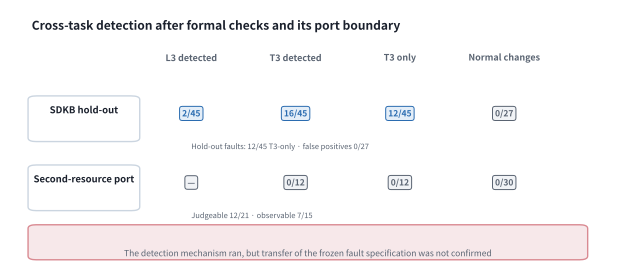

# A Task-Aware Release Gate for Evolving Shared Engineering Ontologies: Evidence from Semiconductor Prior-Art Retrieval

## Abstract

Formal ontology validation does not establish whether a change preserves downstream performance when tasks share a vocabulary. We present the Semiconductor Domain Knowledge Base (SDKB), with three task views on a shared T-Box, and a task-aware release gate. The gate combines four formal layers with retrieval non-inferiority, subgroup, and cross-task conditions. We evaluated it through controlled resource substitution, holdout fault injection, two disjoint 198-query retrieval splits, and a port to a building-metadata ontology. The substituted bundle comprised the ontology, surface-form dictionary, and document-to-concept mappings. Mean concepts linked per patent document rose from 1.545 to 3.779 (2.4-fold). This measures mapping density, not growth in T-Box classes or documents. Although the change passed all formal layers, it reduced family Recall@100 by 0.0293 (95% CI [−0.0542, −0.0053]) and did not meet the preregistered T1 criterion; the gate rejected it. For this change, resource indicators did not represent next-layer performance. The preregistered composite prediction held in neither retrieval split. Family-level Recall@100 improved in both (+0.0534 and +0.0343), but neither the prespecified configuration nor nDCG@20 improved. The cross-task condition alone detected 12 of 45 faults missed by the focal-task and retrieval checks, with 0 false positives among 27 sound deltas. This separation supports attribution between layers, not overall detection strength. On the second ontology, the procedure accepted 30 sound deltas, but the frozen specification detected none of 12 adjudicable faults. The procedure transferred, whereas the specification required regrounding. Evidence is confined to one domain, one rejection with unseparated causal components, and no expert relevance judgments.

**Keywords:** semiconductor domain ontology dataset; ontology evolution; task-aware release gate; cross-task non-regression; proxy-metric mismatch; prior-art retrieval; design science research

## Nomenclature

Abbreviations are given in full at first use and abbreviated thereafter. The names of gates and
metrics (L0–L3, T1–T4, Recall@100, nDCG@20) are used verbatim throughout: replacing them with
paraphrases would change what they refer to. The table also lists the five label systems the text
uses.

| Symbol | Meaning (where defined) |
|---|---|
| A-Box | assertions about individual entities and their relations (§1 and §3.1) |
| A1–A8 | ablation conditions; A8 is the negative control (§4.4) |
| ART-1 / ART-2 | research artifacts — the SDKB ontology dataset / release acceptance gate (§3) |
| E1 | the evaluation environment — the multi-layer benchmark (§4) |
| B0–B5 / P0–P2 | comparison systems — baselines / proposed systems (§4.3) |
| BM25 | Okapi Best Matching 25 — a lexical ranking function |
| CQ | competency question — a question the ontology must be able to answer (§3.1) |
| CQ-PA / CQ-EM / CQ-TF / CQ-CORE | per-task CQ suites — prior-art search / expert matching / foresight / shared core (§3.1) |
| DSR | design science research (§1) |
| EP1–EP5 | evaluation episodes — representation audit, gate discriminating power, resource swap, scope of the retrieval gain, port verdict (§3) |
| G0 / G1 / G2 | the SDKB graph lineage — reference graph / two candidate populations (§3.2) |
| IPC / CPC | International / Cooperative Patent Classification |
| KIPRIS | Korea Intellectual Property Rights Information Service |
| L0–L3 | the four formal validation layers: freshness, structure, logic, function (§3.4) |
| Lessons ①–③ | the lessons of this study, stated as hypotheses for later testing (§6.3) |
| nDCG@20 | normalized discounted cumulative gain at rank 20 |
| Recall@100 | recall at retrieval depth 100, computed at patent-family level |
| RQ | research question — the label of a design question (§1) |
| RRF | reciprocal rank fusion |
| SHACL | Shapes Constraint Language |
| SPARQL | SPARQL Protocol and RDF Query Language |
| T-Box | declarations of classes, properties, and axioms (§1 and §3.1) |
| T1–T4 | the task conditions — retrieval non-inferiority, subgroup non-regression guardrail, cross-task CQ non-regression, downstream generation-layer non-regression (§3.5) |
| \(\epsilon\), \(\delta\) | the non-inferiority margin 0.02 and the subgroup drop limit 0.05 (§3.5) |

---

# 1. Introduction

Engineering organizations accumulate domain knowledge in ontologies and knowledge graphs and
operate retrieval and analysis services on top of them (Bharadwaj & Starly, 2022; Lewis et al.,
2020; Pan et al., 2024). The accumulation is largest in domains such as semiconductors, where
process, device, material, equipment, and organization are densely coupled. One physical phenomenon
is named differently depending on context, so retrieval by string matching leaves connections
unreached. Such a knowledge base is not a finished asset, however. It keeps changing, and the
procedure that decides whether a change may be released is far less developed than the accumulation
itself.

The absence of such a procedure shows in a single incident. After a resource change, the concepts
linked to each document increased. The structural, logical, and functional checks all passed. In the
sealed retrieval evaluation, however, recall fell below the tolerated margin. This paper concerns
the acceptance procedure that blocks such a change before deployment, and Figure 1 is the map of
that incident. The numbers of the incident are reported in §5.2.

Semiconductor knowledge serves more than one task. An equipment defect must be traced from a
failure mode through root causes to the people and skills that address it. Patent analysis must run
from claims through their limitations to a prior-art judgment. Technology planning must connect
technology nodes to scenarios and investment options. These are not three repositories but three
uses of the same knowledge, sharing a vocabulary of processes, devices, materials, equipment, and
organizations. **SDKB** (Semiconductor Domain Knowledge Base) is a semiconductor domain ontology
dataset that grew by taking on these three requirements in turn.

The T-Box declares classes, properties, and axioms. The A-Box asserts the types of individual
entities and the relations among them. **Task-extensible** means that task-specific assets can be
added while the shared T-Box and existing identifiers remain a common foundation. These assets are
the classes, relations, constraints, competency questions (CQs), and A-Box instances a task needs.
The property does not mean that the T-Box remains unchanged: new classes, relations, and constraints
may extend it. Nor does it imply equal performance across tasks. Representational scope and verified
task performance must therefore be reported separately.

Among the three tasks, prior-art retrieval sits at the front end of research and development and
is also open to quantitative measurement. Pre-filing novelty and inventive-step judgments and the
writing of search reports depend on it, and the documents an examiner actually cited supply an
external scoring standard. That external standard is why we measure this task rather than the other
two.

The problem we address is therefore one of knowledge-base operation rather than of ontology theory.
A semiconductor knowledge base keeps acquiring vocabulary, mappings, and instances after release, and
each change reaches the retrieval service that uses the same vocabulary immediately. The practical
question is whether that change may be released. Patent retrieval research and ontology quality
validation have nevertheless developed with little reference to each other (§2), and passing the
ontology-side checks does not guarantee retrieval performance.

This mismatch between ontology checks and task performance takes two forms. First, a change can
pass the four conventional layers of ontology change validation — freshness, structure, logic, and
function (L0–L3) — and still degrade retrieval on a sealed downstream evaluation set. We call this
task-level functional degradation **task-semantic regression**. Second, where one vocabulary
supports three tasks, a change introduced for one task can impair another task's query paths or
functions. Merging two similar concepts to raise
recall, for instance, degrades the ability to discriminate `Skill` in expert matching. We call this
**cross-task regression**.

There is also a resource-side cause for the failure of formal validation to detect either. The T-Box of this
study carries essentially no logical axiom about prior-art judgment. Constraints such as
disjointness and cardinality are not declared, so the logical consistency layer has little to check
(§5.4). This is not peculiar to our resource. The second engineering ontology we ported to also
declares the domain and range of its predicates in a constraint language rather than in logical
axioms (§5.5). A scarcity of axioms is therefore common among engineering ontologies operated in
industry, and that is what makes approval by formal validation alone fragile.

The two regressions escape detection for one reason. Whoever edits an ontology usually observes
resource-side indicators: growth of the vocabulary, or **concepts per document**, the mean number of
ontology concepts linked to one existing document. This metric measures neither the number of T-Box
classes nor the number of documents in the corpus. By **resource** we mean the dataset before it
enters an application. In the controlled substitution, the resource bundle comprises the ontology,
the surface-form dictionary, and the document-to-concept mappings.
Evaluation, however, has three layers: resource, retrieval, and generation (§2.3). We call it
**cross-layer metric misalignment** when an indicator at one layer does not represent performance at
the next. The term describes an observed relation between layers; it does not identify the cause of
degradation. Whether the indicator is representative cannot be known before measurement, so resource-layer checks alone
observe neither regression.

This study therefore asks a single question. When an ontology dataset representing
three tasks grows, does it preserve the performance of the focal task without damaging the
function of the others? And how can that be established before release? We treat the question as
design science research (DSR; Hevner et al., 2004; Gregor & Hevner, 2013). In that frame our
interest is not whether a hypothesis is accepted, but how the artifacts were designed and evaluated
and what transferable design knowledge follows. The research questions are the following three,
each shown with the **evaluation episodes (EPs)** that answer it (composition in §3.0).

- **RQ1** — How can one design an ontology dataset that represents three tasks on a single shared
  T-Box while remaining extensible per task? (§3 · EP1)
- **RQ2** — How can one design a gate that evaluates, before release, whether a formally valid
  change damages downstream task performance or the function of the other tasks? (§3 · EP2 · EP3)
- **RQ3** — What gains, failure boundaries, and cross-layer metric misalignments are observed in
  evaluating the artifacts, and what transferable lessons follow? (EP3 · EP4 · EP5 · §6)

The contribution is threefold. The first is the **artifact**. SDKB connects three semiconductor
knowledge tasks through common identifiers and a shared T-Box, and supplies per-task views,
competency questions and validation assets. The release gate (T-gate) adds three conditions of
approval to formal validity: non-inferiority of the focal task, a subgroup non-regression
guardrail, and preservation of cross-task function. We release both artifacts and the evaluation
assets in a verifiable form.

The second is **one controlled rejection**. We froze the document set, the code, the settings and
the weights, and substituted the resource bundle alone. Under that condition an actual change that
improved every resource indicator and passed all four formal layers was rejected by one task
condition. We report that verdict with the procedure that produced it. Only one resource change met
the eligibility criteria, so the case demonstrates that such a regression can occur rather than that
it is frequent.

The third is **three lessons**, evidenced by the case above, the fault injection, and the
measurement of the boundary of the retrieval gain. Fault injection here is a **holdout** evaluation:
the decision rule is frozen first and the faults are judged for the first time afterwards. We state
the lessons at the size of that evidence, as hypotheses for later studies to test. For the same
reason we report the retrieval gain only with its boundary, and do not present the generation-layer
transfer evaluation as a separate contribution.

Three bodies of evidence stand behind these contributions, and each is a component of the
acceptance argument rather than a study of its own. The description of the dataset states what the
shared T-Box makes available to the gate. The retrieval evaluation establishes that the metric read
by the performance condition is a working instrument and measures the boundary of its gain. The port
to a second engineering ontology delimits how far the gate carries. None of the
three is offered as a claim of dataset quality, of retrieval superiority, or of general
portability.

The remainder is organized as follows. Section 2 reviews prior work and the research gap and
Section 3 the artifacts and the design and evaluation procedure. Section 4 sets out the evaluation
design, Section 5 the results of the five episodes, and Section 6 the discussion, the lessons and
the limitations. Section 7 concludes.


**Figure 1.** Study overview. The top band is artifact ART-1, a resource placing three task views on one shared T-Box; the middle band is artifact ART-2, the release gate that reviews a resource change before it ships; the bottom band is evaluation environment E1, the five episodes and what each measures. The middle band reads left to right, and a failed stage stops the ones behind it. T4, shown dashed, is not part of the approval rule (§3.5.1).

The structure of the supplementary material, and the question each file answers, is set out in
[S0](../../supplementary/en/S0-index.md). The full text of abridged sections, the appendices, and the
auxiliary tables are reproduced verbatim in the supplementary material
[S5](../../supplementary/en/S5-submission-full-v2.md), referred to as S5 below. Material transferred
in later restructurings is in [S9](../../supplementary/en/S9-retrieval-evaluation-detail.md).

---

# 2. Background and research gap

This section reviews four strands in turn. The first two are the unit of evaluation and the nature
of ground truth in prior-art retrieval (§2.1), and how ontology quality validation came to rest on
post-hoc comparison (§2.2). The last two are the proxy validity of resource-side indicators (§2.3)
and the position of this study (§2.4). Taken together they leave one gap. For an ontology that supports several tasks at once,
there is no procedure that decides, before release, whether a change may be accepted.

## 2.1 The unit of evaluation and the nature of ground truth in prior-art retrieval

Prior-art search retrieves, without omission, the small set of documents that may bear on the
novelty or inventive step of a given claim, rather than browsing broadly similar documents. The
primary outcome is recall to a sufficient depth (Recall@K), not precision over the first few hits
(Lupu & Hanbury, 2013; Shalaby & Zadrozny, 2019). Benchmarks in this line settled on examiner
citations as ground truth (Piroi & Hanbury, 2019; Risch et al., 2020). Methods developed along three
strands: lexical ranking functions, patent-specific semantic representations (Bekamiri et al., 2024;
Ghosh et al., 2024), and citation-network signals (Mahdabi & Crestani, 2014). The stronger systems
do not rely on a single representation (Krestel et al., 2021; Shomee et al., 2025).

One examiner citation is an individual **observed positive**, not complete ground truth. A cited document is a
relevance signal observed in institutional review, and one that is not cited is unobserved rather
than non-relevant. Examiner citations and applicant citations differ in meaning (Alcácer &
Gittelman, 2006), and the examiner search itself is bounded by time, classification, and
jurisdiction (USPTO, 2023). Recall@K therefore measures the recovery of known positives, not the
recovery of every legally relevant document. We call the incomplete set formed from these observed
positives **examiner-validated weak ground truth**. Here, validated means that the citation can be
audited against an examination record; it does not mean that every legally relevant document was
identified. The score sheet that records which documents are relevant for each query is the list
of **relevance judgments (qrel)**, and ours records relevant documents only; it is therefore
**positive-only**.

This ground truth can be audited against examination records and was used in actual rejection
decisions. We therefore treat it as a defined evaluation target rather than a deficiency, and we
confine our claims to that set (§6.4). For evaluations with incomplete judgments, the usual advice is to use
metrics that are less sensitive to unjudged documents (Buckley & Voorhees, 2004; Büttcher et al.,
2007). Such metrics presuppose a judged non-relevant set, which our resource does not contain
(§4.5).

The language axis is separate from the strands above. Prior art is valid regardless of the language
of publication, so complete retrieval must cross language boundaries (cross-lingual retrieval). Two
channels have been used so far: machine translation (Magdy & Jones, 2014; Lee & Choi, 2023) and
multilingual dense representations (Zhang et al., 2023). To the extent that we have surveyed, no evaluation sets
the **language-neutral concept IRI** of an explicit ontology as a third channel. This axis was not a
preregistered confirmatory prediction, so we report it as an exploratory diagnosis only (§5.3.3).

## 2.2 Ontology quality and evolution validation — from post-hoc description to pre-release acceptance

Work on ontology quality began from design principles such as clarity, consistency, and
extensibility (Gruber, 1993). Competency questions (CQs) became the device that links requirements
to validation items (Grüninger & Fox, 1995), and test-driven ontology development formalized those
requirements into automatic checks (Keet & Ławrynowicz, 2016). In knowledge-graph construction, CQs
have been translated into SPARQL queries and wrapped in SHACL constraints to serve as automated
tests (Mynarz et al., 2023). Those tests guide construction; they do not decide whether a change to
a finished resource may be accepted. Release procedures are by now automated by established tooling.
ROBOT offers conversion, reasoning, and quality reporting as commands and runs them under continuous
integration (Jackson et al., 2019). The Ontology Development Kit (ODK) automates quality control,
dependency integration, and release generation as standardized workflows (Matentzoglu et al., 2022). What both execute, however, is a formal check internal to the resource, and whether that
check passes sits on a different layer from downstream task performance. On the structural side, quality checking for RDF (Resource
Description Framework) matured (Kontokostas et al., 2014), and SHACL (Shapes Constraint Language)
expresses it in standard shapes (W3C, 2017).

Zaveri et al. (2016), the reference point for linked-data quality, organize quality into 18
dimensions and 69 indicators; that framework describes a state, and its evaluation is descriptive.
On the evolution side, ontology evolution was early recognized as distinct from schema evolution
(Noy & Klein, 2004), and the procedure was later organized into detection, representation,
propagation, and consistency preservation (Flouris et al., 2008; Zablith et al., 2015). What such
procedures validate is whether a change damages the ontology itself, not whether it damages the
tasks that use the ontology. More recent syntactic and semantic quality indicators take the change
itself as their object (Bakker & de Boer, 2026), but what they produce is a description of the
change, not a release decision. On the downstream side, KGrEaT (Heist et al., 2023) observed that
knowledge-graph enrichment is justified by an assumed downstream gain that is rarely measured, and
benchmarks for integration pipelines have also been proposed (Hofer & Rahm, 2026). These too are
post-hoc comparisons, and they are not used as a condition for accepting a change before release.

In engineering informatics the gap matters more, because engineering knowledge is an asset that
must be revised whenever products, processes, and equipment change. Ontologies in this field are therefore
designed as channels through which several systems share meaning (Chungoora et al., 2013;
Bharadwaj & Starly, 2022). Recent work has addressed the absorption of change through standardized
representation (Schönfelder & König, 2025), modular architecture (Kosse et al., 2025), and
demonstrations of application performance (Speiser et al., 2026). Queries have also revealed how a
decision in one domain affects another when two domains share a graph (Johansen et al., 2025). These directions show what a resource represents and how it behaves in an application. By
contrast, they do not state which changes to that resource may be accepted and which must be
rejected. Validation work in the field likewise reports conformance to structures and rules
(Solihin et al., 2015; Pauwels et al., 2024).

Measuring quality and deciding whether to accept a change are not the same activity. Measurement
produces a value and leaves its interpretation to a person, whereas acceptance combines the value
with a threshold and a decision procedure to settle the release. An acceptance rule therefore
requires three things that a measurement framework does not. These are a threshold frozen before
results are seen, a controlled condition under which it is applied, and an enforcement path that
stops the release on a rejection. The work above lacks these three, and that difference is the gap
this study addresses. We compose the measurement from preregistered downstream non-inferiority and
cross-task CQ non-regression, and we enforce it as a release-blocking condition.

A second gap follows the acceptance rule. That a rule holds in one resource and that the rule
transfers to another are different claims. An acceptance rule requires not only an execution
procedure but also the constraints and queries that define what counts as a violation. Those depend
on the representational conventions of the target resource. The same rule, for example, yields different results in a resource that declares domains and ranges
in schema vocabulary and in one that declares them in a constraint language. To the extent that we have surveyed, no record measures what transfers when such a rule is applied
to another resource, and what must be redefined there. We address this gap in the fifth evaluation episode (§4.6 · §5.5).

## 2.3 Conditions under which a resource-side indicator represents task performance

The checks in the previous section all take the resource itself as their object, yet improving a
resource-side indicator is a means to higher task performance, not an end. Measurement theory calls
a value that stands indirectly for another outcome a **proxy metric**; we call it a resource-side
indicator to keep the context explicit. The question of this section is whether such an indicator
can adequately represent task performance.

The problem is not specific to ontology evaluation. When a measure becomes a management target it
may cease to represent what it stood for (Goodhart's law; Strathern, 1997; Manheim & Garrabrant,
2018; Thomas & Uminsky, 2020). Intrinsic evaluation of a resource has not predicted downstream
performance adequately (Chiu et al., 2016; Faruqui et al., 2016), and the relation between retrieval
metrics and generation quality has varied with the pipeline (Samuel et al., 2026; Speiser et al.,
2026). We define the phenomenon in which an indicator at one layer fails to represent performance at
the next as **cross-layer metric misalignment**. The three cases we observed and their
interpretation are collected in §6.1.


**Figure 2.** Cross-layer metric misalignment. The left side shows the indicator structure of the resource, retrieval, and generation layers; the right side shows what was actually observed between them. The number on each arrow at the left corresponds to the numbered observation at the right, and (ii) alone points not to the next layer but to a different unit within the same layer, the number of documents reviewed. Observation (i) is presented in §5.2, (ii) in §5.3.3, and (iii) in §3.5.1 and §6.4; the interpretation is in §6.1. In the controlled substitution, concepts per document rose 2.4× while the retrieval verdict moved in the opposite direction.

Ontology evaluation already contains a tradition that faces this question directly. **Task-based
evaluation** couples an ontology to an application and evaluates it by that output (Porzel & Malaka,
2004; Brank et al., 2005). In that tradition, however, task performance served as a selection
criterion for comparing ontologies. We move the point of use: the same task performance becomes a
term in the acceptance rule that decides whether a change may be admitted (pre-release acceptance).

Two layers of the gap therefore remain. First, the reported misalignments are largely correlational.
Cases confirmed under a **controlled resource substitution**, in which documents, settings, weights,
and evaluation sets are fixed and only the resource bundle is replaced, are rare (defined in §3.0).
Second, to the extent that we have surveyed, no design implements this doubt about proxy validity
**as an acceptance rule**. The place where this study claims novelty is therefore not release
automation and not formal quality checking; the tools of §2.2 already provide both. The place we claim,
narrowly, is an acceptance contract that combines downstream retrieval non-inferiority, a subgroup
guardrail, and cross-task competency-question non-regression. To it we add a controlled verdict in
which that contract was applied to an actual change.

## 2.4 Task-extensible domain ontology datasets and the position of this study

A domain ontology dataset must provide a shared T-Box that integrates several sources through stable
identifiers and explicit semantic relations. That distinguishes it from a term list or a single
application model. It must also report the representational scope of the T-Box separately from how
far the A-Box is populated (Wilkinson et al., 2016; Hogan et al., 2021). We therefore name the two
levels distinguished in §1. **Representational scope** denotes whether the T-Box, SHACL shapes, and
CQs can express and execute the queries of the three tasks. **Task-level validation depth** denotes
whether the performance of a given task is maintained or improved against real ground truth and a
candidate pool.

In patent retrieval a graph can compensate for the blind spots of lexical search (Mahdabi &
Crestani, 2014; Siddharth et al., 2022; Daniell et al., 2025). In those studies the graph is an
input representation for performance, and which changes to the graph may be admitted is not
addressed. Our direction is to control the evolution of the knowledge graph by retrieval performance
while monitoring that the control does not degrade the other tasks.

Our position relative to the six strands above, with representative work, the gap that remains, and
what this study adds, is tabulated in [S5](../../supplementary/en/S5-submission-full-v2.md). The
contribution lies in the combination and the experimental design, not in the primacy of any element.

The gap that follows from this review lies in the acceptance design for changes to a domain ontology
that supports several tasks at once. To the extent that we have surveyed, no pre-release acceptance design controls the
overfitting of a gate observing a single task by a **cross-task non-regression** condition. In the same scope we find no
record of such a design adjudicating a real change. Nor do we find a measurement of what transfers
when such a design is ported to a resource with different representational conventions (§2.2).

---

# 3. Reading the dataset and acceptance gate through a rejected-patent example

> **Example 1 · example graph · synthetic explanation.** The next three chapters use one rejected
> patent as an explanatory lens. A synthetic patent application for “plasma-etch endpoint
> detection” is rejected for lack of inventive step over one examiner-cited US reference. The nine
> RDF triples below encode the facts used by the example.
>
```turtle
pat:1020130000004  a  ont:Patent, ont:RejectedPatent ;
    skos:prefLabel          "플라즈마 식각 종점 검출 방법"@ko ;
    ont:filingDate          "2013-05-10"^^xsd:date ;
    ont:realizesProcess     <…/subprocess/plasma_etch> ;
    ont:rejectedFor         ont:Rejection_Inventiveness ;
    ont:hasPriorArtExaminer <…/patent/us_US7000001> .
<…/subprocess/plasma_etch>  ont:requiresSkill <…/skill/endpoint_detection> .
<…/expert/EXP_M01>          ont:hasSkill      <…/skill/endpoint_detection> .
```

> The upper seven triples are read by the prior-art view and the lower two by the expert-matching
> view. Both paths meet at `plasma_etch`. Sections 3–5 follow this shared node from representation,
> through evaluation, to a release verdict. The example is synthetic; every empirical value in §5
> comes from the frozen evaluation artifacts.

This section describes what we built and the criteria by which we evaluated it. There are two
artifacts and one evaluation environment that measures them. **ART-1 · the SDKB ontology dataset** is a
semiconductor domain resource that arranges three task views on one shared T-Box (§3.1–3.3).
**ART-2 · the release acceptance gate** combines the formal layers L0–L3 with the task conditions
T1, T2, and T3 into a pre-merge acceptance rule. T4 is a design outside that rule (§3.4–3.6).
**E1 · the multi-layer evaluation benchmark** takes examiner citations as its reference, blocks
leakage, and connects retrieval evaluation to generation-layer evaluation (§4).

The three correspond to the three research questions of §1. The design of ART-1 addresses the
representational structure that RQ1 asks about, and EP1 audits it. The design of ART-2 addresses the
acceptance condition that RQ2 asks about. EP2 examines its discriminative power, and EP3 the verdict
on a change that arose in a real revision of the resource (§3.0). RQ3 asks which lessons follow from
the results of EP3 and EP4, and the answer is in §6.3.

In design science research, design and evaluation alternate in a cycle, and evaluation separates
into episodes with different purposes (Venable et al., 2016). The lower band of Figure 1 summarizes
the cycle from problem identification through redesign, port evaluation, and design knowledge.

The five evaluation episodes are distinguished on three axes: what each asks, what adjudicates it,
and what the status of that verdict is (Table 1). All were conducted under controlled conditions,
and none is a field evaluation in an operating environment. The order of sections in the results
chapter (§5) differs from this one, for the reason stated at the opening of that chapter.

**Table 1. Evaluation episodes — EP is a new label and does not collide with the preregistration labels.**

| |Episode|Question|How it is adjudicated|Status|Results|
|---|---|---|---|---|---|
| **EP1** |**Representation audit**|Do the vocabulary, relations, and CQs of the three tasks **exist** in the resource?|Counts and CQ pass/fail (deterministic)|Observed fact| §5.1 |
| **EP2** |**Discriminative power of the gate**|Does the gate **detect** deliberately injected faults without **rejecting** sound changes?|Previously unadjudicated holdout faults and three prespecified conditions|Holdout artifact evaluation of the gate (not part of the confirmatory checks · §4.5)| §5.4 |
| **EP3** |**Controlled resource substitution**|With documents and settings fixed and **only the resource replaced**, what is the verdict?|Application of the preregistered acceptance rule (T1, T2, T3)|Verdict under a separate preregistration| §5.2 |
| **EP4** |**The scope of the retrieval gain and its boundary**|Does ontology enrichment **improve** a strong text baseline, and **how far**?|Preregistered confirmatory evaluation on sealed splits — all accesses were recorded in the access ledger (two non-overlapping confirmatory splits)|Confirmatory plus exploratory diagnosis| §5.3 |
| **EP5** |**Port verdict**|Do the formal layers and the cross-task layer **behave the same on a different resource**?|21 holdout faults and 10 verdicts on the real release lineage under a separate preregistration (the acceptance rule is not completed · T1 and T2 not ported)|Verdict under a separate preregistration| §5.5 |

### 3.0 Units of evaluation and kinds of change

Our evaluation is organized in units of an **evaluation episode (EP)**. One episode pairs one
question with one prespecified decision rule. The five episodes (EP1–EP5) answer different
questions, so the result of one episode does not change the verdict of another.

The gate adjudicates two kinds of change. An **injected fault** is a change we created in order to
measure the detection power of the gate. A **real delta** is a change between versions that arose in
the actual revision history of the resource. We distinguish the two to show that the gate detects
more than manufactured errors. The faults used to measure detection power are **holdout**
faults. Each was adjudicated for the first time after the decision rule and thresholds had been
frozen, and none was used to tune that rule.

The effect of a real delta is measured by **controlled resource substitution**. Documents, retrieval
code, settings, splits, and the sealed ground truth are all frozen. We replace only the resource
bundle, which comprises the ontology, surface-form dictionary, and document-to-concept mappings.
The difference between two runs can therefore arise only from the bundle.

Real deltas divide further into three kinds. A **T-Box delta** changes the declaration of classes,
predicates, or axioms. A **concept-layer delta** changes vocabulary, hierarchy, labels, or
document-concept links. An **A-Box corpus delta** adds documents. The first two kinds are
adjudicated by the acceptance rule and the third is not. Once the document set differs, two runs are
no longer a comparison over the same candidate population, and an observed performance difference
cannot be attributed to the resource. We call the first two kinds **eligible deltas**.

The kind is decided mechanically rather than by interpretation. The classifier reads only the
per-file hashes of the snapshot and the T-Box counts. When several kinds are mixed in one delta it
returns the A-Box kind, so ineligibility is not absorbed into another kind.

An eligible delta does not by itself make two runs comparable. Before adjudication we run a
seven-item **eligibility screening**. The first four items check that the comparison holds at all:
the same system, the same split, the same ground truth, and the same code commit. The last three
check that a delta exists and qualifies: a differing snapshot signature, a differing pipeline
signature, and the kind of delta. A failure on any item yields not a rejection but an unadjudicated
outcome. The reasons are of three kinds. The snapshot signatures may be identical, so that the difference is
zero by construction. The snapshot may have changed without the pipeline ever reading it. Or the
comparison may not hold. We separate rejection from non-adjudication because the two call for different follow-up.

## 3.1 Three task paths through a shared process node

The SDKB T-Box is not a single-purpose schema for prior-art retrieval. The TTL files carry
vocabulary for semiconductor processes, devices, materials, equipment, failures, skills, patents,
organizations, and technology strategy. The three tasks traverse it along different paths:
\(T_{\mathrm{SDKB}} = T_{\mathrm{core}} \cup V_{\mathrm{match}} \cup V_{\mathrm{priorart}}
\cup V_{\mathrm{foresight}}\). The views are not exclusive modules; they overlap on shared
concepts.

This decomposition means three things for the design of the dataset. First, the three views are
modules on a shared core \(T_{\mathrm{core}}\) rather than separate ontologies, and the process,
device, material, equipment, and organization vocabularies form the contact surface. Second, the
boundary of a view is defined by the query path rather than by an exclusive partition of classes.
Expert matching uses the same `Equipment` instance as evidence of competence, and prior-art search
uses it as evidence of a technical element. Third, a shared identifier both enables links between
tasks and serves as the propagation path of a regression.


**Figure 3.** The shared T-Box and three task views. The three boxes at the top give the main classes of each view, a representative competency question, the A-Box evidence, and the status of that view in this paper. The three channels in the middle are vocabulary used by two or more views, and the dashed lines from each channel show the two views it joins. The box at the bottom gives the shared core and the number of competency questions per suite that the gate observes. That the three views are not exclusive modules is why the cross-task regression of §1 can occur.

Shared vocabulary is the channel along which cross-task dependency forms (Fig. 3). That a class or
relation exists in the T-Box does not mean that every view is populated to the same degree. The
counts are therefore produced automatically from a fixed release commit.

The questions this resource must answer come from the semiconductor shop floor. The competency-question suites name seven axes: process step,
device, material, equipment class, technology node, value-chain role, and export-control
designation. The queries of the three views are built over these axes. Which failure arises at which process step, and which skill its root-cause
mitigation requires, is a question of the shared core. Which rejected patent was refused on which
ground and over which prior art is a question of the prior-art view.

Process vocabulary illustrates how the channel actually forms. Queries in the prior-art suite link
patents to process steps through `realizesProcess`. Queries in the expert-matching suite link people
to the same process steps through `hasProcessExpertise`. Queries in the foresight suite count recent
filings and their annual distribution over that same relation. The three suites thus traverse one
process axis through different predicates. The equipment axis has the same structure, and the
equipment class is used by the expert-matching suite and the shared-core suite alike. A change that
merges or splits process or equipment vocabulary therefore alters the response size of all three
views at once. This simultaneity is what the cross-task condition watches.

This structure was chosen against an alternative. Holding the three tasks as separate ontologies
joined by alignment mappings would hide the effect of a change in one ontology on another task
behind those mappings. Our purpose is to observe that effect before release, so we chose a shared
core, and the price is coupling. Shared vocabulary becomes the propagation path of a regression,
which is why the cross-task condition T3 is needed in the acceptance rule (§3.5). The two
alternatives, and the grounds for the second decision that defines view boundaries by query path,
are in [S10](../../supplementary/en/S10-artifact-design-rationale.md).

Competency questions follow the same structure. We separate a CQ suite per task. Questions
linking two or more views, such as supply chain or regulation (CQ13, CQ14, CQ19, CQ21), go to the
**shared core (CQ-CORE)** suite (§3.4, Table 3). Of the three views only prior-art search has weak
qrel available, so only that view admits quantitative validation. That asymmetry controls the scope
of the claims rather than being a defect. What covers the three tasks is the observed fact of the
T-Box and the CQs, and we do not claim that the performance of all three was validated.
`NoveltyScore` is derived from the ground truth and is excluded from the retrieval features.

Adding a task is therefore not completed by adding classes. The dataset requires four assets
whenever a new view is admitted, and we call this the **extension contract**. The four are new
classes and relations, the SHACL shapes constraining their cardinality, a CQ suite representing that
view's queries, and a mapping to the shared core vocabulary. The contract is needed because of the
shared core itself. A change aimed at one view reaches the query paths of another through the shared
vocabulary. Structural checks and logical consistency checks observe only the interior of the
changed view and therefore do not see that propagation. The ground for requiring each of the four
assets, and a concrete propagation, are in
[S10](../../supplementary/en/S10-artifact-design-rationale.md).

## 3.2 From example facts to measured graph lineage

SDKB is not a single file but a lineage of versions with different purposes and corpora.
**G0** (105,588 triples) is the reference ontology and the **benchmark anchor**. It contains 1,000
rejected patents, 3,034 CitedPatent nodes, 2,534 examiner citations, and the claim and
rejection-judgment T-Box. **G1** (924,814) and **G2** (490,529) are the **candidate population**,
the distractor pool. They add 24,179 patents of integrated device manufacturers and 12,339 patents
of 188 member companies of the **Korea Semiconductor Industry Association (KSIA)**, respectively. A
separate claim-feature sidecar (11,605,931 triples) holds 586,567 Claim, 1,289,512 ClaimFeature, and
635 PriorArtJudgment instances. These counts are those of the resource generation on which every
measurement in this paper was performed (upstream snapshot `d578bf3`).

> **Observed fact.** G1 and G2 are not ontology generations. The T-Box is identical across the three
> graphs: `owl:Class` 103, `owl:ObjectProperty` 97, and `owl:DatatypeProperty` 81 hold in all three,
> and the predicate delta is 0 added and 0 removed. What G1 and G2 add is patent A-Box documents
> only. All 2,211 examiner-citation positives lie inside G0, and 0 positives exist only in G1 or G2.
> Excluding them shrinks the candidate corpus from 40,552 to 4,034 documents. At that point the
> condition of a large candidate pool no longer holds. Because the T-Box never changed, no change
> eligible for testing acceptance safety could exist in this lineage (§6.4). These counts are also
> those of the measurement generation stated above (upstream snapshot `d578bf3`).

The rejected-patent axis expresses examiner citation and rejection ground, claims and their
features, the rejection judgment, and applicant citation as separate relations. The examiner
citation relation is removed from the retrieval graph under leakage control. The model does not stop
at citation links between patents; it expresses which feature of which claim relates to which prior
art under which rejection ground. Representational capability and how far the instance data is
actually populated must be distinguished, however, so we report for each analysis the number of
usable relations and the proportion missing. The full list of predicates is in
[S1](../../supplementary/en/S1-appendices-v09.md). Every triple carries a provenance signature, and a
**continuous integration (CI)** pipeline checks consistency on each release.

## 3.3 Observation levels and fitness grades for citation relations

How far the ground-truth resource reaches into the graph depends on the **observation level**, that
is, on which relations count as a link. Reachability at node level is 95.3%, reachability through
domain semantic relations alone is 54.6–70.5%, and including classification codes returns it to
95.3%. Reachability at ClaimFeature level is 402/584 (68.8%) in the sample that carries a judgment
link. The definitions per level and the full derivation are in S5, and the commands that reproduce
them are in [S1](../../supplementary/en/S1-appendices-v09.md).

Examiner citations number 2,534 in total, of which 30 are non-patent literature. The numbers 2,534,
2,321, 2,211, and 584 are different denominators and are not conflated into a single count of
positives. Reporting only the high values at node or classification level would overstate readiness
for semantic retrieval. Describing the ClaimFeature figure of 68.8% as a property of the whole would
overgeneralize from a subset. The definitions of the four denominators, the decision rules for
the two relevance grades, and the five-way release separation that blocks ground-truth inflow are in
[S1](../../supplementary/en/S1-appendices-v09.md). Candidates and qrel are counted at DOCDB
family_id level, and the main conclusions rest on the family unit.

The dataset release is **pinned** by commit SHA and sha256, and the evaluation protocol and
thresholds are **frozen** before unsealing (§6.5).

## 3.4 Task-level acceptance after formal validation

> **Example 2 · two synthetic deltas · synthetic execution.** If the example process node is
> mistakenly merged with its parent, CQ21 changes from 2 rows to 1 and the cross-task condition
> rejects the delta. If only a label is normalized, CQ28 remains at 1 row and the delta passes this
> condition. These generated values explain the decision path; they are not empirical verdicts.

This section begins the description of the second artifact (ART-2). The evaluation and acceptance
procedure is fail-fast: a failed stage stops the stages behind it. The order is graph delta →
**formal and functional validation L0–L3** → leakage-blocked retrieval index → **T1 retrieval
non-inferiority and T2 subgroup non-regression** → **T3 cross-task CQ non-regression** →
merge and release. T3 comes last for reasons of interpretation rather than computational cost.
T1 and T2 ask about the performance of the gate task, and T3 then asks whether another task was
sacrificed for it.

The four formal layers differ in what they inspect and in the tool that inspects it. The freshness
and integrity layer (L0) checks that no artifact is older than the snapshot and that the per-file
hashes match the provenance record. The structural layer (L1) checks shape violations with the
constraint language SHACL. The logical layer (L2) checks the consistency of the merged graph with a
description-logic reasoner. The functional layer (L3) executes the focal-task competency questions
and checks for broken query paths.

The structural layer has two tiers. A relaxed shape applies to the graph as a whole, and a strict
shape, which requires at least one concept mapping, applies to the delta being merged. The two tiers
exist because the question the gate asks is whether the data may be newly admitted into the graph.
Retroactively penalizing existing data is a different question. A single shape asking both at once
would let violations in existing assets mask the verdict on a new delta.

The logical layer applies to a projection built for reasoning rather than to the original graph. Date
datatypes and metamodeling declarations that the reasoner does not support raise exceptions at load
time, and the original graph is left unchanged. This projection narrows the scope of the check
rather than relaxing it. Violations of the promoted date datatypes are checked by the structural
layer on the original, so detection power is preserved. The reason why passing this layer carries
little information lies on the resource side, and the evidence is in §5.2 and §5.4.

There are 31 competency questions, and they serve three purposes. The counts in the table below are
read from the query files and the CQ execution artifacts. The three sidecar queries are constant
terms that do not respond to the graph under test, so they are excluded from the decision
denominator.
Suite labels are declared in the query files themselves, and a file without a label is not assigned
to a default suite but raises an execution error. A denominator that changes without notice would
make the cross-task verdict vacuous.

L3 and T3 observe disjoint sets. L3 observes the focal-task suite (5 pa questions), and T3 the
other tasks and the shared core (23 em, tf, and core questions). The union of the two sets is the
whole of the 28 gate-observed CQs. The separation pins down attribution rather than detection strength.
Under the earlier definition `L3 ⊇ T3` held, so a hypothesis claiming detection by T3 alone could
not be tested. The separation removes that obstacle (the history is in
[S2](../../supplementary/en/S2-fault-injection-v09.md)). The T3 condition is a deterministic pass-rate
comparison rather than a statistical test. A CQ is a specification, not a sample, so any drop in the
pass rate is an immediate failure. The only exception is an explicit waiver token, and its count is
reported.

## 3.5 An acceptance rule coupling formal layers and task conditions

A graph delta \(\Delta G\) is accepted as follows.

\[
Accept(\Delta G)=
\mathbb{1}[L0{=}L1{=}L2{=}L3{=}pass]
\cdot
\underbrace{\mathbb{1}[LB_{95\%}(\Delta R_{100})>-\epsilon]}_{T1}
\cdot
\underbrace{\mathbb{1}[\max_s Drop_s<\delta]}_{T2}
\cdot
\underbrace{\mathbb{1}[\forall f\in\{EM,TF,CORE\}:\; PassRate_f(O')\ge PassRate_f(O)]}_{T3}
\]

Because the rule is a product, a single zero term makes the verdict zero.

The object of the rule is the graph delta \(\Delta G\), but T1 and T2 compare two rankings and
therefore apply in the same form to a change of system configuration. The acceptance verdict on a
resource change is the single case in §5.2, and the verdict in §5.3.1 is a dry run that applies the
rule to a change of system configuration.


**Figure 4.** The T-gate procedure and the actual verdicts. The left column is the order of the acceptance procedure and reads downward. The middle column is the handling when a term is not met, and the right column is the verdict each term actually produced in the controlled resource substitution (§5.2). The right column shows that a change passing every formal layer was rejected on one performance condition.

\(\Delta R_{100}\) is the difference in Recall@100 against the reference version.
\(LB_{95\%}\) is the lower bound of the **confidence interval (CI)** obtained by a
**query-level paired bootstrap** over the same queries. \(s\) ranges over the prespecified
rejection-ground, process, and language subgroups, and \(f\) over the CQ suites of the other tasks
and the shared core. What T1 tests is degradation rather than improvement; this applies the logic of
non-inferiority testing, and the margin \(\epsilon\) is registered in advance, independently of
power. A rejection is not a verdict that the change is worthless; it is a demand to identify the
cause, repair the condition, and resubmit.

\(PassRate_f\) is the proportion of competency questions in suite \(f\) that pass the v2
decision, which is the conjunction of an existence check and a polarity-specific distribution check
declared in advance.

\[
pass_{v2}(i)=[\,rows_i \ge expect\text{-}min_i\,]\wedge\neg\,regress_i,\quad
regress_i:\; rows_i<(1-\tau)\,base_i\;(\text{up}),\;\; rows_i>(1+\tau)\,base_i\;(\text{down})
\]

\(base_i\) is the row count of the reference generation, and the polarity is declared per
competency question. T3 therefore detects regression in the size of the response as well as in its
existence.

The three thresholds are \(\epsilon = 0.02\) (non-inferiority margin), \(\delta = 0.05\)
(subgroup drop limit), and \(\tau = 0.05\) (threshold of the distribution check), all fixed before
the evaluation set was unsealed. They are normative choices taken from testing convention and are
not calibrated against reindexing variation or a practitioner-tolerated drop. That deficit and the
method of calibration appear under deficit ④ in S3.

T2 carries a conservatism that we stated before results were seen. T2 compares the maximum subgroup
drop against \(\delta\) by a deterministic rule and does not use the lower bound of a per-subgroup
interval. A chance drop in a small subgroup can therefore drive the verdict. When there are few
subgroups, there are few places where a drop can be observed at all. In the confirmatory split of
198 queries, the subgroups satisfying `n≥20` are two on the language axis, two on the
rejection-ground axis, and one on the process-family axis. The rule is frozen and is not changed;
per-subgroup interval estimation is deferred to a later preregistration.

### 3.5.1 T4 — non-regression at the downstream generation layer (one verdict, not part of the rule)

Applying the logic of the acceptance rule one layer further down leaves the question of whether an
indicator at the retrieval layer represents value at the generation layer below it. We could not
confirm that representativeness, so we state a fourth condition separately. In what follows, a
**retrieval configuration** denotes the retrieval system that supplies documents in each comparison
condition.

> **T4 (downstream generation non-regression).** With only the retrieval configuration replaced and
> the generator fixed, the citation accuracy of the documents offered as evidence must not decrease.
> The hallucination rate must not increase. What is fixed here is the model, the prompt, the
> temperature, the seed, and the context size K.

T4 is not part of the acceptance rule above. The margin and the hallucination threshold were frozen
in a commit made before unsealing, and the verdict was issued once and failed (§6.4). Adopting the
condition into the rule requires repeated validation, since revising a release rule on one failure
would be an overclaim in the opposite direction. The thresholds and evaluation conditions in full
are in S5, Appendix A.

## 3.6 Reproducible release operation and audit records

The two preceding sections describe the rule of acceptance; this one describes the procedure that
executes it. The gate sits where ontology maintenance meets the operation of the retrieval service.
Rather than a full manual review for every added concept alias or altered classification mapping, we
run the formal layers and the task conditions in a **continuous integration (CI)** pipeline.

The unit of operation is a candidate release delta, which enters the pipeline before it is merged.
The pipeline pins the snapshot, runs formal validation L0–L3, and rebuilds the leakage-blocked
index. T1 and T2 then run against a frozen retrieval regression set and T3 against the cross-task
suites. A failed stage stops the stages behind it (§3.4). Only a delta passing every stage is
merged, and we provide no bypass path.

Each run leaves its verdict as an artifact. The per-file hash of the snapshot, the corpus signature,
and the per-term verdicts are recorded together, so a verdict can be reproduced. An exception to T3
is admitted only by an explicit waiver token, and the cumulative count is reported.

We measured the cost of a run in the port verdict (§5.5). The formal and cross-task layers together
take about 138 s and peak resident memory was 595 MB. This states feasibility at that scale rather
than scalability; the per-layer values are in §5.5.

We also bound what the procedure covers in operation. A per-term score supports review
prioritization and does not replace a legal judgment. The expert-matching and foresight views are
objects of T3 regression monitoring, and the retrieval performance of those two is not claimed in
this study.

So far we have looked at the representation of one patent and a change on top of it. The next
chapter asks how the same structure is measured in an evaluation over 198 queries; the unit of
analysis moves from the patent instance to the evaluation query.

---

# 4. From the example patent to evaluation queries and release verdicts

This section describes the evaluation environment (E1), the system that validates the two artifacts
above. The detailed specification and the full text of the unexecuted design are in the
supplementary material [S1](../../supplementary/en/S1-appendices-v09.md) and
[S3](../../supplementary/en/S3-unexecuted-design-v09.md).

Across episodes, the ontology is respectively the object under test, the sole replaced resource,
an input feature, or a negative control. The relevant fixed and varied factors are stated with each
episode.

This experiment mirrors the procedure of prior-art search in practice. Figure 5 gives the
correspondence between that procedure and the configuration of this experiment, and marks the two
places where it fails. The configuration corresponding to bibliographic conditions in practice is
not fused into the primary baseline, and reranking here does not enlarge the candidate pool. The
effect of the two constraints is treated in §4.3 and §6.2 respectively.


**Figure 5.** Practice steps mapped onto the experimental configuration. The left column is the step in practice and the right column is the configuration of this experiment that corresponds to it. The two annotations in the right margin mark the places where the correspondence does not hold, and the band below states the premise under which the numbers of this section hold.

## 4.1 Turning the example patent into a time- and family-split query

The numbers in this section were produced under the condition that the query patent is already
registered in the ontology. The effect of that constraint and the way to remove it are in §6.4. The
unit of the main analysis is one rejected patent, and the query text is the full text of the
independent claims (median 527 characters). The comparison of query representations that was
prepared but not executed is in [S3](../../supplementary/en/S3-unexecuted-design-v09.md).

A random split can mix members of the same family and leak future information. We therefore sorted
the query patents by filing date and assigned the oldest 60% to training, the next 20% to
development, and the most recent 20% to test. Documents of the same DOCDB family went to a single
split.
The split is 600 training, 200 development, and 200 test, with boundaries 2016-11-21 and 2021-07-21;
queries with at least one known positive number 197 in development and 198 in test. The boundaries
and the seed were fixed in code before the test qrel was unsealed, and the test qrel was sealed in a
separate file (479 edges over 198 queries).

## 4.2 Removing answer edges and freezing the candidate population

> **Example 3 · answer-free query · synthetic explanation.** When Example 1 becomes an evaluation
> query, the examiner-citation edge is removed before indexing. The query retains its claim text and
> process relation, while the cited patent remains only in the sealed score sheet. Thus the ranking
> path cannot read the answer edge it is evaluated against.

The candidate population of each query is \(D_q=\{d \mid t_{\mathrm{pub}}(d)<t_{\mathrm{cutoff}}(q),\;
family(d)\neq family(q)\}\), where \(t_{\mathrm{cutoff}}\) is the filing date of the query
patent. Candidates are not restricted to qrel documents: every document satisfying the time
condition enters the candidate set, and the qrel serves only as the score sheet.

In the **oracle-free main analysis mode**, the citation edges of the query patent are removed from
the index and the features. So are concept links, feature alignments derived from the qrel, and any
ground-truth-derived indicator. The signals then remaining in the ontology-only configuration are
concept links, classification symbols, and paths, none of which touches the ground-truth axis. Every
verdict in this paper is derived from this mode alone.

## 4.3 Comparison configurations that isolate input signals

**Table 2. Questions asked by each comparison configuration and its input signals.**

|Configuration|Question asked|Input signals|
|---|---|---|
|Text Hybrid (B3)|What is the strongest text baseline reachable without the ontology?|claim vocabulary and dense representation|
|Ontology-only (B5)|Which concept path responds directly to a resource change?|concept overlap and paths|
| Text+Ontology(P0) |What is the effect of adding ontology signals to the text baseline?|B3 + B5 signals|
| +ClaimFeature(P1) |What is the effect of the secondary configuration adding claim-feature signals?|P0 + claim-feature coverage|

Four configurations carry the verdicts in this paper. They are **B3** Text Hybrid (**the strongest
text baseline**), **B5** Ontology-only (concept path alone), **P0** Text+Ontology (**the
prespecified configuration**), and **P1** +ClaimFeature (**the secondary configuration**).
The claim that B3 is the strongest text baseline decomposes into three configurations: lexical alone
(B0), dense alone (B2), and classification alone (B4). Their values, practice-stage correspondence,
input text, code entry point, output ranking files, and scoring paths are in S5. The history of the
two configurations that were designed but never built is in
[S3](../../supplementary/en/S3-unexecuted-design-v09.md); they were not excluded because their
results were unfavorable.

The comparison configurations must respond differently to a resource change, and that difference is
what makes the control valid. B0, B2, and B4 are integrity controls and B3 is a negative control that
should not respond to an ontology change. B5 is the exposure control that responds most directly,
and P0 and P1 are the downstream sensors that produce the verdict of condition T1. Observation
confirmed the distinction. When only the resource bundle was substituted, the values of B0, B2, B3,
and B4 were unchanged and only the Ontology-only configuration moved, by 27% (Table 5). The role of
each configuration and the observation it requires are in
[S5](../../supplementary/en/S5-submission-full-v2.md). That file also gives the reasons for using
Titan Embed v2 alone as the dense baseline B2, and the history of adding a multilingual
long-document encoder under a separate preregistration.

The score of a candidate patent is the weighted sum of lexical, semantic, concept-overlap, path,
feature-coverage, and rejection-ground compatibility terms, each normalized to [0,1] per query. The
expression and the full weight grid are in S5, and the term definitions and the final weights are in
the specification extracted from the code
([S10](../../supplementary/en/S10-artifact-design-rationale.md)). The weights were selected on
the development set by a preregistered grid, and optimization against the test qrel is
prohibited. Of the six terms, the hierarchy path
weight \(w_h\) converged to 0 on that grid, so a delta that changes only the hierarchy is in
principle unobservable to this score (§6.2). The proposed systems also rerank the top 1,000 of the
text baseline rather than enlarging the candidate set. That design choice is the cause of the
reranking ceiling diagnosed in §6.2 (the counts are in S5).

Four auxiliary indicators based on feature coverage, designed to separate novelty from inventive
step, were specified but not computed ([S3](../../supplementary/en/S3-unexecuted-design-v09.md)). The
rejection-ground axis is treated only in the subgroup analysis of §5.3.2.

## 4.4 Mapping synthetic deltas to holdout faults

Confirming the actual detection power of the gate requires feeding it graphs that have been
deliberately damaged (fault injection). We designed 12 fault types, two of which are cross-task
faults: erroneous merging of similar concepts as synonyms, and inversion of the shared hierarchy of
`Process` and `SubProcess`. Both can be harmless or even favorable to retrieval while damaging the
CQs of another task. Each type is repeated three times at strengths of 1%, 5%, and 10% (108
instances); the type definitions are in
[S2](../../supplementary/en/S2-fault-injection-v09.md).

Those 108 instances were adjudicated three times while the decision rule was revised three times, so
the final adjudication is not confirmatory. We therefore preregistered and injected 72 further
instances that had never been adjudicated, with the rule held fixed (holdout confirmation). They
comprise 18 repeated-axis instances, 27 instances of three new cross-fault families, and 27 sound
deltas. The three new families change only predicates whose intersection with those referenced by
the focal-task CQs is empty. Cross-task character is secured by construction, not inferred from
the result. This property and the decision rule (detection by T3 alone ≥1,
one-sided **McNemar test** *p*<.05, false-positive rate ≤5%) were fixed before execution
([S2](../../supplementary/en/S2-fault-injection-v09.md)).

Ablation removes one layer at a time from the secondary configuration P1 and measures the
contribution of each layer; the reference configuration is P1 because P2 was not executed (§4.3).
Eight ablation conditions were preregistered, and the text defines two. **A7** removes all ontology
features, and **A8** removes the expert-matching-only layers (`Skill`, `ExpertCase`, `Mitigation`);
the definitions and results of the remaining six (A1–A6) are in S5 in full.

The status of the two conditions differs. The larger the drop caused by removing a layer, the larger
the contribution of that layer. The prediction of the layer-contribution check was that the loss
from removing the feature and rejection-ground layers exceeds the loss from removing the
classification signal. A8, by contrast, was selected to be theoretically unrelated to retrieval, so
removing it should leave performance unchanged (the layer-specificity check). What to do if
performance dropped markedly under A8 was also stated before results were seen: abandon the control
framing and report the finding as an observation of cross-task dependency (§6.3).

Expert relevance judgment was designed but not performed, and no number in this paper depends on it.
The full protocol is in [S3](../../supplementary/en/S3-unexecuted-design-v09.md), and the scope of
claims constrained by its absence, together with the specification for removing it, is in §6.4.

## 4.5 Metrics and statistics that connect questions to verdicts

**Table 3. Mapping from evaluation questions to metrics and decision rules.**

|Evaluation question|Metric and decision rule|Example used in the manuscript|
|---|---|---|
|Does the resource change harm recall at review depth 100?|family Recall@100 · T1 non-inferiority|comparison of ΔR@100 with −ε|
|Is there a large drop in any subgroup?|subgroup Recall@100 · T2|comparison of the maximum drop with δ|
|Do query paths of another task regress?|CQ v2 pass rate · T3|comparison of response-row counts before and after, with τ|
|Does top-rank ordering improve as well?|top-20 ordering metric|difference from Text Hybrid|

The primary outcome is **family-level Recall@100**. It measures how many known related documents
appear within the top 100, counting foreign counterparts of the same invention once. A searcher
reviews to a fixed depth, so the absence of omissions within that depth matters more than the
precision of the ordering above it.

Two auxiliary metrics are cited alongside it in the text. We call recall observed within a review depth of
100 **deep recall**, and the primary outcome family-level Recall@100 is the value over that depth. We
measure ordering at the top by **normalized discounted cumulative gain
(nDCG)@20**. The full set of auxiliary metrics for recall depth, review cost, and latency, together
with their values, is in [S5](../../supplementary/en/S5-submission-full-v2.md). The metrics of the
generation stage are not retrieval-layer metrics and therefore do not appear in the tables of
§5.3.

We do not use precision or **binary preference (bpref)**. Both require treating uncited documents as
non-relevant, and our ground truth is partial (§2.1). nDCG@20 is computed with binary gain because
the qrel is entirely grade 1, and grades are not generated after the fact. Because the ground truth is partial, we check in two ways whether paired comparisons
depend on unjudged documents. Neither check creates a new verdict, and the definitions and full
results are in S5.

System comparisons are paired over the same queries and resampled 10,000 times (paired bootstrap) to
produce 95% confidence intervals, and the resampling seed was fixed in code before unsealing. Layer
comparisons of detection rates use the McNemar test, and multiple comparisons use the **Holm
correction**. The boundary of the lexical-overlap subgroups was also frozen before results were
seen. On the development set of 197 queries we fixed the first quartile of the character 3-gram
Jaccard distribution, Q1 = 0.0079, as the low-overlap boundary. The confirmatory split divided into
low 27 and high 171. This score is an **analysis-only stratification label** and is not fed
into the ranking function. The subgroup reporting rules and the statistical procedure in full are in
S5.

We froze three evaluation checks and their predictions before results were seen. Data, ontology,
shapes, CQs, index, and model versions were pinned by hash, and the seed, the lockfile, and the
split identifier lists are public.

The **retrieval utility check** predicted that ontology-enriched retrieval improves both Recall@100
and nDCG@20 over the strongest text baseline. It further predicted that the improvement is larger in
the subgroup with low lexical overlap. The **layer specificity check** predicted that removing the
expert-matching layers unrelated to the gate task leaves retrieval performance unchanged within the
confidence interval. The
**transfer check** predicted that citation accuracy does not fall and the hallucination rate does not
rise when only the retrieval configuration is replaced with the generator held fixed. That third
check exists to freeze the evaluation procedure of gate condition T4, so we do not fold it into the
acceptance rule.

The two confirmatory splits do not overlap and were registered separately, so we report the verdicts
by split. We report them where their evidence is, namely in each episode section of Section 5.
The correspondence between check names and registration documents, and the full history of
preregistration, sealing, and unsealing, are in
[S6](../../supplementary/en/S6-preregistration-crosswalk.md) and S5.

Three further items were registered as design evidence rather than confirmatory checks, and their
verdicts are reported as they stand: **discriminative power of the gate** (§3.5 · §5.4),
**acceptance safety** (§6.4), and **layer contribution** (§5.3.2). Operational efficiency, signal by
rejection type, semantic reachability, and cross-lingual recall were never part of the confirmatory
set and are reported as exploratory analysis only.

Leakage checking confirms automatically, at four layers, that the forbidden edges remaining after
qrel masking number 0; the development split measured 0 violations across all seven system runs. The
two points at which reproducibility control is incomplete are in §6.5.

**Table 4. Mapping from claims to verdict language and evidence locations.**

|Claim|Verdict wording|Evidence location|
|---|---|---|
|A real change that passed formal validation was rejected by the retrieval condition|Accept = 0 · T1 not met|Table 5 · S7 · S9|
|T3 detects cross-task regressions admitted by focal-task monitoring|all three conditions met| §5.4 · S2 |
|retrieval utility check|first split supported in part · second split not supported|Table 6 · S9|
|layer specificity check|first split rejected · not reproduced in the second split| S9 |
|transfer check|non-inferiority not met · 1 verdict|S5 Appendix A|
|Port verdict|procedure transferred · fault-specification transfer not confirmed · precision validation not met| §5.5 · S8 |

## 4.6 Scope of the port to a second engineering ontology

Every evaluation so far was performed on one resource, and whether the gate procedure is independent
of the resource is confirmed only by applying it unchanged to another. This is the fifth episode
under a separate preregistration (EP5) and changes no verdict or number of the first four.

The target is Brick, a building metadata ontology, selected on five criteria. These are a public
T-Box, a public instance model, a tagged release lineage, explicit deprecation and migration rules,
and SHACL constraints shipped with the distribution. The instance models were split into a development set,
used to write competency questions, and a holdout set used only for adjudication.

The two resources differ in evolution regime and therefore evaluate different halves of the gate.
Ours holds the evaluation assets of a downstream retrieval task, yet only one resource change was
eligible (§3.2 · §5.2). The second carries a real T-Box change with official deprecation and
migration rules in every adjacent release. It has no ground truth and no candidate pool, so the
retrieval conditions cannot apply. The half ported here is therefore the overlapping one. The four
formal layers, condition T3 and the fault-injection procedure move by replacing a profile file with
no code change; T1 and T2 are excluded. The acceptance rule is therefore not completed on this
resource, and only the conjunction of the formal and cross-task layers is recorded in a separate
field.

The task views are fault detection and diagnosis, and spatial zone occupancy, with one shared
vocabulary view added. There are 15 competency questions, five per suite; three cross-task faults
give 21 instances, and the negative control is 30 synthetic sound changes. The per-file hashes of the
resource and the competency questions, the fault specification, the random seed, the threshold grid,
and the promotion rule were frozen before execution.

Because this port excludes T1 and T2, the only lesson whose evidence it can widen is cross-task
monitoring (§6.3, Lesson ②); the full protocol is in
[S8](../../supplementary/en/S8-second-domain-port.md).

---

# 5. Evaluation results in the order of the acceptance argument

This section reports four findings, and the four form a single argument. **Finding 1.** A real
change that improved every resource indicator and passed all four formal layers was rejected by the
performance condition T1 (§5.2). **Finding 2.** That rejection is necessary because of cross-layer
metric misalignment. Concepts per document improved 2.4-fold while the focal retrieval metric fell
(§5.2 · §5.3). **Finding 3.** The discriminative power of the gate held in a holdout evaluation run
under a frozen decision rule (§5.4). **Finding 4.** When the procedure was ported to a second
engineering ontology, the mechanism transferred, whereas the fault specification had to be
redefined for the modeling conventions of that resource (§5.5).

Finding 2 states the problem and Finding 1 presents the device that answers it. Finding 3 shows
that the device works, and Finding 4 shows how far it carries. The order of presentation follows
this argument, and §5.1 first confirms that the artifact does carry the three tasks.

Retrieval-layer numbers serve two purposes here. They show that the sensor used by condition T1
works, and they are the measured basis of Finding 2. Retrieval utility was a preregistered check,
but its answer is not among the contributions of this study (§1). We report the verdict in full and
draw no claim of superiority in retrieval performance for its own sake. The verdicts of the three
preregistered checks are reported by split in the section that carries their evidence, and the
frozen predictions are in §4.5.

The first paragraph of each section states both the conclusion and the confirmatory status of that
section, and the status of each episode is in Table 2. Figure 6 maps the five episodes onto the
terms of the acceptance rule of §3.5 and gives the verdict for each. The example deltas are
synthetic executions that explain the detection mechanism; they are not evidence for the cause of
the real rejection. The verdicts of this chapter are drawn from preregistered aggregates only.


**Figure 6.** Evaluation episodes mapped onto the terms of the acceptance rule. Rows are episodes and columns are terms of the rule; only the leftmost column is the resource rather than the gate. The symbol in each cell is the verdict and the line beneath it the evidence, and a blank cell means that the episode did not examine that term. Read across for what one episode examined; read down for how the same term was judged in different experiments. In the EP3 row a change passing every formal layer was rejected at T1; in the EP4 row a configuration passing T1 did not show non-inferiority at T4. T4 is marked with an asterisk because it is not part of the acceptance rule; its status is a design and one verdict.

## 5.1 Declared scope of the three task vocabularies (EP1)

The vocabularies of the three tasks are dataset properties observable in the current T-Box rather
than a future design. This is an observed fact, and the objects are graphs G0, G1, and G2 with the 31
audit CQs.

The TTL files contain the anchor classes of all three views, and the full list of classes and
relations per view is in [S5](../../supplementary/en/S5-submission-full-v2.md). In functional
validation, G0 passes 27 of the 28 CQs the gate observes, and G1 and G2 pass 28. The three sidecar
claim queries pass on all three graphs, so on the full audit denominator of 31 G0 passes 30 (§3.4,
Table 3). The cross-task CQ pass rate did not fall, and the cumulative waiver count is 0.

Representational scope and retrieval readiness are not the same. How far the cited prior art reaches
into the graph depends heavily on which relations count as a link (§3.3). Reachability also varies
by language: the proportion of candidate documents holding a concept link is 99.2% for Korean, 69.6%
for English, and 0% for Japanese, while classification coverage is 100% in all three languages. The
language-neutral concept IRI is thus a property of the T-Box level, and at the A-Box level
non-Korean documents carry fewer concepts. This asymmetry is the premise for reading §5.3.3.

What this section supports is **representational support at the declared layer**. The T-Box names
the axes of the three tasks in classes, properties, and annotations, and a query path holds over
those axes. It does not mean that axioms generate inferences that the tasks reach. Under that
qualification the claims narrow to two. A CQ pass indicates a query path and a non-empty response;
it does not validate the accuracy of the three tasks. And the T-Box of G0, G1, and G2 is identical,
so pass-rate variation follows from how far the A-Box is populated. The numbers here therefore do
not establish generation safety (§6.4).

## 5.2 Increased document-concept linking and an actual rejection by the retrieval condition (EP3)

The performance condition T1 rejected one real change that passed all four formal layers and
increased every prespecified resource-side quantity indicator. The synthetic example patent only
illustrates the resource-side scene in which concept links multiply; it does not represent the
queries of this verdict or the cause of the drop. The two left panels of Figure 7 show the rise of
the resource indicator and the fall of the retrieval metric as preregistered aggregates. The scope
of this statement is one qualified real change; it says nothing about how often such incidents are
blocked. The full freeze scope and eligibility screening are in
[S6](../../supplementary/en/S6-preregistration-crosswalk.md)·[S7](../../supplementary/en/S7-release-crosswalk.md).

Per-query results are aggregated at the release level; the gate judges whether a resource bundle
may be deployed, not an individual patent. This is a recorded rejection of a real delta under the
acceptance rule in §3.5. It shows that formal validation cannot stand in for the task conditions.

This section reports a verdict under a separate preregistration, and its resource snapshot is a
post-correction generation. It therefore does not change the confirmatory verdicts of §5.3, and the
verdict on acceptance safety is in §6.4.

The change under review is the first T-Box predicate delta in this study, and it arose from an
upstream correction. There are two arms. Arm O ran the pre-correction resource bundle and arm O′
the post-correction bundle through the same pipeline. A resource bundle consists of the ontology,
the surface-form dictionary, and the concept mapping. Documents, code, retrieval settings, weights,
splits, and the sealed qrel all remained frozen, and the performance conditions ran only after the
seven eligibility items and the leakage audit had passed. The mean number of ontology concepts
linked to each existing patent document rose from 1.545 to 3.779 (2.4×). This metric measures
document-to-concept linking density, not the T-Box class count. Under those conditions every
prespecified resource-side quantity indicator increased, and formal validation L0–L3 passed in
full. The snapshot, triple, vocabulary, and link counts, the freeze list, the screening items, and
the reproduction checks are in
[S9-T3](../../supplementary/en/S9-retrieval-evaluation-detail.md#s9-t3--delta-counts-and-eligibility-screening-of-the-controlled-resource-substitution).

**Table 5. Retrieval performance when only the resource bundle is substituted (test, 198 queries, family Recall@100).**

|System (test, 198 queries, family R@100)|O (before correction)|O′ (after correction)| Δ |
|---|---:|---:|---:|
|B0, B2, B3 text; B4 classification|unchanged|unchanged|0 (the text side was not changed)|
|**B5 ontology-only**| 0.1800 | **0.2282** | **+0.0482 (+27%)** |
| P0★ | 0.4635 | 0.4543 | −0.0092 |
|**P1 (the substituted configuration)**| 0.4849 | 0.4556 | **−0.0293** · 95% CI [−0.0542, −0.0053] |

The change passed each layer of the approval procedure in turn. Freshness and integrity passed
because the snapshot hashes agreed, and the structural check passed because the delta violates no
constraint shape. Logical consistency also passed, but that pass carries little information: this
T-Box declares almost no disjointness or cardinality constraints, so there is little to check
(§5.4). Functional validation showed no drop in competency-question pass rates. None of the four
layers observable on the ontology side produced a signal about this change.

That absence of a signal follows from what each layer targets; it is not a defect of the checkers. The
structural check looks for violations of constraint shapes, the logical check for contradictions,
and the functional check for whether the competency questions still return answers. This change only added
vocabulary and links, and violated none of the three. Two of the task conditions passed for the same
reason. The largest subgroup drop was 0.0401, below the limit of 0.05. By axis, we observed 0.0401
for grounds of rejection, 0.0333 for the language of the ground truth, and 0.0304 for the process
family. Under the cross-task condition the three suites held their pass rates at 1.000, with zero
waivers. Neither local regression nor cross-task regression was observed, and the drop appeared only
in the per-query mean of the primary metric.

The verdict is a rejection under T1 (Accept = 0). The lower bound of the 95% confidence interval on
ΔR@100, −0.0542, falls below the non-inferiority margin −ε = −0.02, so T1 was not met. T2 (maximum
subgroup drop +0.0401 < δ = 0.05) and T3 (em, tf, and core pass rates held at 1.000) were met, and
T1 is the only unmet condition. This is a case in which a single performance condition blocked a
change that passed every formal layer, and it is the observed instance of the task-semantic
regression defined in §1.

What this comparison identifies is not the effect of the T-Box alone. It is the change in mean
per-query recall when the resource bundle is substituted in a frozen pipeline. Which component
inside the bundle produced the drop is not separated by this comparison alone. That a defect in the
scoring function produced it is not excluded either (the competing explanations are in §6.4). The
acceptance rule, however, rejected the deployment of the resource in that pipeline, not the resource
in isolation. The unit of release approval is the deployment, so the object of the rejection and the
object of the verdict coincide. The ontology-only configuration in fact improved by 27% under the
same substitution. This result is therefore not evidence that ontology enrichment is useless. It
shows that a change that improves resource-side indicators and passes formal validation can still
degrade performance.

The cause of the drop is not separated. A 2.4-fold increase in concepts per document enlarges the
denominator of the unweighted Jaccard, and high-frequency general concepts also form tie blocks
without discriminative power. Whether this is a defect of the resource or of the scoring function is
not separated by this experiment. This run also applies the acceptance rule rather than reconfirming
superiority (§4.5). In this single instance, had the task conditions been absent, a resource bundle
degraded by 0.0293 in family Recall@100 would have been released. The scope of that statement is one
qualifying change, and it indicates neither the frequency of blocked incidents nor a general
preventive effect.

We read the blocked magnitude as two numbers. The point estimate 0.0293 is the mean per-query drop
observed in this sample, and the confidence bound 0.0542 is the conservative limit the rule uses.
The rule uses the bound in order to exclude cases in which sampling variation understates a drop.
The ground for rejection is therefore not the size of the observed drop. It is that this sample does
not show the drop to lie within the margin. Interchanging the two numbers changes the strength of
the verdict. The interval excludes zero, and its upper bound is also negative at −0.0053. The
interval nevertheless crosses the non-inferiority margin of −0.02. What this sample established is
not that the degradation exceeded the margin, but that it could not be shown to lie within it.

This case exhibits cross-layer metric misalignment directly. Every quantity indicator observable at
the resource layer moved in one direction. The linked concept vocabulary grew, concepts linked per
document rose 2.4-fold, and links were created in bulk. These values capture expanded concept
mapping over existing documents, not growth in T-Box classes. Those are the indicators visible to
whoever edits the ontology, so from
the resource layer alone this change is an evident improvement. The retrieval metric one layer down
moved the other way. For this change, the resource-layer indicators did not represent the
performance of the next layer. This is why we place the acceptance condition at the layer of use
rather than at the resource layer, and that ground is one observation rather than an argument.

Operationally this verdict is one release decision in a continuous integration pipeline (§3.6). A
resource revision published upstream was blocked by the approval procedure before it reached the
downstream retrieval service. The ground for blocking was one number produced on a sealed evaluation
set, not an opinion about resource quality. No human intervened before the verdict, and the verdict
artifacts remain as an execution record.

The verdict also changed how we write acceptance criteria for resource requests. The improvement
item that prompted this change met its resource-side criteria, because concepts per document and
concept vocabulary grew to the level requested. The indicator at the layer of use nonetheless moved
the other way, so resource-side criteria alone cannot establish whether a request was useful.
Resource requests submitted upstream now carry at least one downstream task metric among their
acceptance criteria. Resource-side criteria confirm that a correction was carried out, and the
downstream metric confirms whether that correction was useful. The two do not substitute for each
other. This procedural change follows from the observation in this section, and its transferable
statement is in §6.3.

## 5.3 Retrieval gains confined to deep recall (EP4)

The conclusion of this episode is the range within which the gain was observed. Ontology reranking
showed no improvement in the three places we had expected: queries with a lexical mismatch, ordering
at the top, and review efficiency. The one place where an improvement appeared is deep recall, and
that gain vanishes once converted into an operational unit. This episode ran preregistered
confirmatory evaluations on sealed splits twice, and all accesses to the seal of the second split
were recorded in the access ledger.

### 5.3.1 Retrieval performance and the verdicts of the confirmatory checks

The improvement in deep recall was observed in both non-overlapping confirmatory splits. The
preregistered composite prediction, by contrast, held in neither split.

Panel A is the first confirmatory split (198 queries, 479 qrel edges) and panel B the second,
non-overlapping split (198 queries, 503 qrel edges). The two panels are neither pooled nor averaged.
The decision rule, margin, weights, and retrieval settings of panel B were inherited from panel A
and fixed in a commit made before unsealing (`67568c8`).

**Table 6. Retrieval performance in the two confirmatory splits (2 panels) — the baseline is the Text Hybrid (B3) of each panel; Δ and the win/loss/tie counts summarize the original sample paired per query, and the 95% confidence intervals and two-sided *p* values come from a query-level paired bootstrap with 10,000 resamples.**

| |System| R@100 | Δ vs B3 | 95% CI | *p* |Win/loss/tie| Δ nDCG@20 | *p* |
|---|---|---:|---:|---|---:|---|---:|---:|
| **A** | **Text Hybrid (B3 = B0⊕B2 RRF)** | **0.4315** | — | — | — | — | — | — |
| **A** |Text+Ontology (P0★, prespecified configuration)| 0.4635 | +0.0319 | [−0.0139, +0.0785] | **.181** | 41/22/135 | **−0.0395** | **.029** |
| **A** | **+ClaimFeature (P1)** | **0.4849** | **+0.0534** | **[+0.0145, +0.0926]** | **.008** | 37/11/150 | −0.0176 | .227 |
| **B** | **Text Hybrid (B3 = B0⊕B2 RRF)** | **0.4102** | — | — | — | — | — | — |
| **B** |Text+Ontology (P0★, prespecified configuration)| 0.4344 | +0.0242 | [−0.0084, +0.0574] | **.147** | 25/18/155 | −0.0218 | .210 |
| **B** | **+ClaimFeature (P1)** | **0.4445** | **+0.0343** | **[+0.0094, +0.0615]** | **.004** | 19/9/170 | −0.0136 | .390 |

The table carries the three configurations on which the verdicts rest and two exploratory baselines.
The values of the exploratory baselines do not enter the confirmatory verdicts. The effect size in
panel B is about two thirds of that in panel A, and the full set of results is in S5.


**Figure 7.** System by metric. (a) the primary outcome, family Recall@100; (b) the difference of each auxiliary metric against B3 with 95% confidence intervals. Ontology reranking retrieves more known positives within a review depth of 100 but does not improve the ordering quality of the top 20.

**Verdicts of the two confirmatory checks.** We give them below by split. The frozen predictions are in §4.5, and the correspondence between each check name and its registration document is in [S6](../../supplementary/en/S6-preregistration-crosswalk.md). The preregistration of the retrieval-utility check required two conditions: improvement in
both R@100 and nDCG@20, and a larger improvement in the subgroup with low lexical overlap. In the
first split R@100 improved significantly on the secondary configuration under the paired bootstrap,
but the nDCG clause was not met. The prespecified configuration did not reach significance, and the low-overlap clause was
contradicted (Table 6; S9). Under the first preregistration the verdict recorded for that split
was "supported for the primary outcome only". In the second split the same structure appeared, but
the preregistration required simultaneous improvement on both metrics, so the verdict is not
supported. We do not retract either verdict.

The preregistration of the layer-specificity check required that removing the expert-matching-only
layers (A8), designed to be unrelated to the gate task, would leave retrieval performance unchanged.
In the first split that removal was the only one of the eight ablations to remain significant after
the Holm correction (S9). The preregistered hypothesis was therefore rejected, indicating an
observed cross-task dependency. In the second split the same ablation gave exactly 0.0000 and was not
reproduced. That value does not separate the case of no effect from the case of nothing to remove
(§6.3).

**Premises for reading the two verdicts.** The ground truth is partial, so we ran the two checks of
§4.5, and the difference held after merging examiner citations of foreign counterparts. The queries
of panel B carry a sparse ontology signal. The shrinkage of the effect runs in the same direction as
that property, which the preregistration document describes before unsealing. Of
the five conditions under which an effect may be described as certain, one is met, so we do not use
that expression. The three premises in full and the quantification of the residual vulnerability are
in [S9](../../supplementary/en/S9-retrieval-evaluation-detail.md).

### 5.3.2 Subgroups and ablation

Contrary to the prediction, the gain concentrated in queries whose vocabulary already overlapped,
and only the removal of the negative control remained significant after the Holm correction.

The layer-contribution check was rejected: which layer produces the contribution was not separated
by the ablations. The remaining twelve rows and the verdicts on them are in S9.

That most ablations do not reach significance admits two explanations, absence of layer contribution
and pressure from the reranking ceiling, and the two are not separated. In the second confirmatory
split A8 is again exactly 0.0000, and the gain appeared in queries whose vocabulary already
overlapped and in queries whose positives are entirely Korean. The ontology as a whole contributes,
but which axis produces that contribution is not separated. The scope of the claims the ablations
support, and the resource limit on the rejection-ground axis, are in
[S9](../../supplementary/en/S9-retrieval-evaluation-detail.md).

### 5.3.3 Exploratory diagnosis of cross-lingual recall and operational efficiency

Korean lexical retrieval recovered no English positive at all (0/128 in the confirmatory split), and
the gain on the primary outcome vanishes when converted into the number of documents reviewed. Both
observations arise from the same cause, that the proposed systems do not enlarge the candidate pool
(the reranking ceiling defined in §6.2). Every value in this section is exploratory descriptive statistics
and does not enter a confirmatory verdict.

The decomposition of recall by ground-truth language, the full table of the four review-count
metrics, and the recall-by-depth curves were moved in full to
[S5](../../supplementary/en/S5-submission-full-v2.md).

The same diagnosis shows that the concept path reaches documents different from those the text path
reaches. Superiority of the concept path is not supported by these values. The decomposition of
recall, the quantification of the upper bound on reachability, and the factors that overstate the
foreign-language subpool are in
[S9](../../supplementary/en/S9-retrieval-evaluation-detail.md).

## 5.4 Scope of faults detected by the cross-task condition alone (EP2)

Condition T3 alone detected a cross-task fault that both formal validation and the focal-task
performance check missed. This section reports a holdout evaluation carried out with the rule
frozen, and it is not one of the three confirmatory checks of §4.5.

With the rule unchanged, we injected 45 cross-task faults and 27 sound deltas, and all three
prespecified conditions were met (detection by T3 alone 12/45; one-sided McNemar *p* = .0001; false
positives 0/27). The CQ that regressed points to a different task in each fault family (F13→CQ11,
F11→CQ18, F14→CQ28, F15→CQ13). T3 therefore identifies both the occurrence and the task suite
affected.

The holdout was composed along two axes so that the result would not rest on the faults the rule had
already seen. The first axis is re-injection. The two cross-task fault families of the earlier round
were injected afresh at new repeats. The seed is derived from the fault, the strength and the
repeat, so a regression test enforces that the new fault graphs do not overlap the earlier ones.
The second axis is generalization. Three cross-task fault families were designed anew. They cover
hub concentration of expert-competence edges, relocation of expert-case links to failure modes, and
inversion of the supply relation in the value chain.

The cross-task character of these faults is secured by construction rather than by the result. In
the earlier round a fault was called cross-task because we expected it to leave retrieval untouched.
The new families replace that expectation with a property that can be checked. The manipulated
predicates have an empty intersection with the predicates referenced by the competency questions of
the focal-task suite. A test extracts that list from the query files rather than transcribing it
from a document. All three families preserve the edge count, changing objects within one type
signature or inverting direction only. We also declared before execution that the formal layers
could not detect them. The snapshot contains no disjointness axiom, and two of the manipulated
predicates carry no structural constraint at all. Establishing that afterwards would have been an
excuse rather than a finding.

Five expectations about the outcome were written before execution, with a commitment not to revise
them if they failed, and all five held. Among them is that the proportion of faults detected by T3
alone would stay at the level of the earlier round, which it did (27.8% against 26.7%). That an
expectation held is not evidence in itself, but it is ground for stating that the decision rule was
not tuned to particular faults.

This discriminative power was secured after one rejection. The form first preregistered was rejected
on the 108 development cases (detection by T3 alone 0/18). The cause lay not in the gate design but
in the overlap of the observation scopes of the two checks, under which `L3 ⊇ T3` held. The
remedy was to separate the two scopes (§3.4). Because the union remains the full set of 28 CQs,
detection power is preserved and only the detecting component changes (full history in
[S2](../../supplementary/en/S2-fault-injection-v09.md)).

We report the boundary of this discriminative power as well. Detection is sensitive to the threshold
of the distribution check: the 12/45 at the prespecified τ=0.05 falls to 4/45 at τ=0.10 and rises to
17/45 at τ=0.00 (Table 7). Even at the prespecified threshold, 33 of the 45 faults were not
detected by T3 alone. The 95% one-sided upper bound on the false-positive rate is 10.5%. The
formal layer L2 also has, in effect, no logical constraint capable of detecting such faults. The
T-Box carries no disjointness or cardinality constraints, so an injected type contradiction does not
constitute a contradiction.

Two further things this episode does not establish. The first is the completeness of the gate. One
fault family, inversion of a shared hierarchy, was detected by no layer in either round. The cause
is a competency question that reads the relation without fixing its direction. The second is
the specificity of T3. The faults that are not cross-task were prespecified as outside the
denominator and were not reinjected. What the episode establishes is therefore bounded. In a gate
whose layers observe disjoint scopes, T3 detects cross-task regressions that focal-task monitoring
admits. The fault-by-fault verdicts, the frozen expectations, and
four further unfavorable measurements are in
[S2](../../supplementary/en/S2-fault-injection-v09.md).

## 5.5 Boundary between procedure transfer and fault-specification transfer (EP5)

The port of the execution procedure was confirmed, and under this fault specification the transfer
of detection effect was not demonstrated. The evidence is one port, and generalization
beyond that scope is left to the follow-up hypotheses of §6.4. The four formal layers and condition
T3 ran on the second resource by replacing a profile alone, rejecting none of the 30 synthetic sound
changes. The observed false-positive rate is 0/30 with a 95% one-sided upper bound of 9.5%, so
precision validation at the 5% level is described as not met, as the preregistration prescribed.

In the 12 faults that could be adjudicated, detection by T3 alone is 0 (one-sided McNemar
*p* = 1.0000). That result stands, and under this specification the transfer of the detection
effect was not demonstrated. The denominator is 12 and not 21. The nine containment-inversion faults
had 0 injection sites in the holdout model and so never entered the graph. Counting an instance that
was never injected as a detection failure would record the gate as having missed what it never had
the chance to miss. This account of the denominator does not account for the result on the 12. Two
separate grounds keep that 0 from being carried over into a failure of the gate itself. First, we call the range over which a competency question actually returns rows on the
target instances its **observable surface**. The observable surface of the holdout model was 7 of
the 15 competency questions, and in the development model all 15 returned rows. This deficit
therefore lies in the population range of the holdout instances rather than in the questions. Second, in all 21
instances the four formal layers and the cross-task condition were alike non-detecting, so this
sample does not permit comparison of T3 against the other layers. The cause is the direction of the
predicate. The development model expresses containment with `brick:hasPart`, which gave 90 injection
sites, whereas the holdout model uses `brick:isPartOf`. A fault specification must therefore be
redefined for the modeling conventions of the target resource. We do not convert that into a
statement that the gate missed cross-task faults.

On the real release lineage we adjudicated five adjacent release pairs under two migration
conditions (Table 7). Partial acceptance holds in two verdicts, and the pair that passed is
v1.4.1 → v1.4.2, which the preregistration had named in advance as a negative control. The remaining
eight verdicts were all unmet at the delta-structure check, and the cross-task condition passed in
all ten verdicts. What was unmet is a declaration convention of the resource: it declares domains
and ranges of predicates in SHACL instead of `rdfs`, so the frozen delta rule fires repeatedly.

Operational cost is recorded as exploratory. On a graph of 55,887 triples with 15 competency
questions, mean execution time per layer was 124 s for L1, 12.5 s for L2 and 1.6 s for L3+T3. That
states feasibility rather than scalability. The verdicts for every fault instance and the frozen
lists are in S8.



**Figure 8.** The cross-task condition detected faults missed by the formal layers in the SDKB holdout, whereas transfer of the frozen fault specification's effect was not confirmed on resource 2. The upper row summarizes 45 SDKB faults and 27 sound changes; the lower row summarizes adjudicable faults and sound changes on resource 2. The rates are not compared directly because their denominators differ; details are in §5.4–§5.5 and S2 and S8.

---

# 6. Discussion and lessons

## 6.1 Cross-layer metric misalignment — the central observation

Improved ontology indicators did not consistently correspond to better outcomes at the retrieval
and generation layers (Fig. 2).

(i) From the resource layer to the retrieval layer, a change whose resource indicators had all
improved lowered the recall of the substituted configuration. It had passed formal validation L0–L3
in full, and the performance condition T1 rejected it (−0.0293, 95% CI [−0.0542, −0.0053]; §5.2). (ii) From the retrieval layer to
the operational unit, the gain on the primary outcome vanishes when converted into the number of
documents reviewed (median reduction 0.0%; win/tie/loss 62/16/64; §5.3.3; exploratory descriptive
statistics). (iii) From the retrieval layer to the generation layer, the configuration including the
ontology led on the point estimate of citation accuracy. The verdict issued under the frozen margin
nevertheless failed (§3.5.1 · §6.4; one verdict), and whether the cause is absence of transfer or
insufficient power is not separated.

The three observations support one bounded proposition: resource-side improvement and formal
validity do not establish performance at the next layer, so release approval must measure that layer
directly. The claim is not that the next layer always degrades, but that its result must be
measured.

## 6.2 Sources of the retrieval gain and the limits of reranking

The improvement on the primary outcome was observed, but its shape differed from the prediction.
What contributed was the concepts shared by query and document rather than the depth of the
hierarchy. That signal raised documents already found by text retrieval into the review range but
did not improve the ordering quality of the top documents. The hierarchy of the T-Box is also
shallow enough that the selected weight of the hierarchy path converged to 0.

The conditional prediction was also contradicted. The gain concentrated in queries with high lexical
overlap rather than low, and the cause lies in the design. The proposed ranking function reorders
only within the top 1,000 of the text baseline (§4.3), so a document the text side failed to
nominate cannot be recovered by any ontology feature. Queries whose vocabulary does not overlap are
exactly the queries whose candidate set is impoverished (baseline R@100 of 0.1975 in the low-overlap
subgroup against 0.4685 in the high-overlap subgroup). The observed pattern therefore does not mean
that the ontology is semantically powerless. It exposes the **reranking ceiling**. This limit arises
when the fixed-candidate reranking architecture cannot enlarge the candidate set.
This is a limit of our candidate-generation and reranking design, not a theoretical limit of the
ontology itself.

The value of an ontology combined by reranking lies not in resolving lexical mismatch. It lies in
raising, into the review depth, documents that share the same technical concepts among the
candidates the text side has already retrieved. This reranking ceiling was observed most strongly on the
cross-lingual axis, and its quantification and supporting argument are in
[S9](../../supplementary/en/S9-retrieval-evaluation-detail.md) (§5.3.3).

## 6.3 Transferable design knowledge — three lessons and two follow-up hypotheses

This section treats which of the observations above can be transferred to another resource. The
evidence is one qualifying resource delta and one port case, so we state them as hypotheses for
later studies to test rather than as established principles. Each carries its evidence and the
observation that would weaken its necessity. The promotion criteria, the grading scheme, and the
correspondence with the original labels are in
[S6](../../supplementary/en/S6-preregistration-crosswalk.md).

**Lesson ① · Acceptance one layer below.** A resource change is accepted on the non-regression
result of the next layer of use rather than on resource indicators. The evidence is the verdict of
§5.2: a change that improved every resource indicator and passed formal validation L0–L3 in full was
rejected by one performance condition (Accept = 0). This form was already stated when the gate was designed and was
supported by an actual rejection; without that arrangement the change would have been accepted. The
lesson weakens if formal validation alone predicts downstream non-regression and the task conditions
never change an acceptance decision. The breadth of the evidence is one
qualifying resource delta.

**Lesson ② · Cross-task monitoring.** On a shared T-Box, a change is not accepted on the performance
of the focal task alone. The evidence is the holdout fault injection, and it comprises two distinct
contrasts. First, faults missed by both the focal-task competency-question check (L3-pa) and the
retrieval performance check but detected by T3 alone number 12 of 45. Second, in the paired
comparison of L3 against T3 the one-sided McNemar *p* is .0001 (§5.4). False positives among 27
sound deltas were 0. The two figures are different contrasts and are not juxtaposed as though they
were one. Because the union of the two layers is unchanged by the revision, what the separation of
layers pins down is attribution rather than detection strength (§3.4). The lesson weakens if the
detection rate of the focal-task check equals that of T3 and detection by T3 alone is 0.

The supporting evidence for this lesson was observed in the ablation, and its status differs from
the evidence above. Removing the expert-matching-only layers, designed to be theoretically unrelated
to retrieval, degraded retrieval performance (removal loss +0.0316, *p* = .002). This was the only
significant ablation of the eight under the Holm correction, and the damage was invisible to formal
validation L0–L3. The two branches stated in advance were to establish specificity or to observe
coupling, and we observed the latter. What is observed is the existence of an influence, and this
experiment does not answer its path (the competing mechanisms are in S5). In the second confirmatory
split the same ablation gave exactly 0.0000, so the observation was not reproduced (§5.3.2), and the
cause of the divergence is not separated either.

The principal ground for this lesson is therefore the fault-injection result, and the
negative-control result is confined to supporting evidence at the grade of a **design diagnosis**.
The verdict on the second engineering ontology did not widen the evidence either, because detection
by T3 alone was 0 in the 12 adjudicable faults (§5.5). That 0 is not the result of the weakening
condition above being met. In that sample the four formal layers and the cross-task condition were
alike non-detecting, so the object of a detection-rate comparison did not exist.

**Lesson ③ · Separation of candidate generation.** Reranking cannot recover documents outside the
candidate pool, so it is evaluated separately from candidate generation. The evidence is that, with
no cap on review depth, the proportion of queries not reached is identical across the three systems
(half of the positives 26.8%, full recovery 55.1% · §5.3.3). The lesson weakens if reranking alone
reduces that proportion.

**Two follow-up hypotheses.** Two of the deficits above can be stated as hypotheses for later
studies to test. The first is verification of transfer: an improvement in retrieval metrics is not
generalized automatically to review efficiency or to the quality of generated answers. Our verdict
runs in that direction, but whether the failure arose from absence of transfer or from insufficient
power is not separated (the width of the failure is in Table 7). The hypothesis weakens if
improvements in retrieval metrics transfer consistently to review counts or generation quality. The
second follow-up hypothesis is **port-layer separation**. When an acceptance gate is moved to another resource, the
mechanism — the layer structure, the decision rule, and the execution — transfers. The
specification — the delta constraints, the fault definitions, and the competency questions — must
instead be regrounded on the representational conventions and the instance observable surface of the target
resource. The evidence is three places observed on one port. They are 8 of the 10 release-lineage verdicts
unmet on the frozen delta rule, 9 of 21 faults not injected, and 7 of the 15 competency questions
returning rows on the holdout (§5.5). The hypothesis weakens if detection power holds after a specification is
carried unchanged to a resource with different conventions. The distinction also changes how the
earlier results are read, since reading the 0 detections on the second resource as a failure of the
gate would conflate mechanism with specification.

**Stability region of the verdicts.** All four gate verdicts are decided by comparison against a
threshold, and those thresholds are normative choices taken from testing convention (§3.5). Table 7
reports how far each verdict sits from its switching point. The T1 rejection has ample margin and
the T4 failure sits at the edge. T3 detection is sensitive to the threshold of the distribution
check and loses support at the upper end of the frozen grid.

**Table 7. Decision stability — the point at which each verdict switches under the frozen thresholds.**

|Condition|Frozen threshold|Observed|Verdict|Switching point|
|---|---|---|---|---|
|T1 · retrieval non-inferiority| ε = 0.02 | ΔR@100 = −0.0293 · LB₉₅ = −0.0542 |not met|becomes met only if ε > 0.0542|
|T2 · subgroup safety| δ = 0.05 |maximum drop = +0.0401|met|becomes not met if δ ≤ 0.0401|
|T3 · cross-task detection (EP2 distribution check)| τ = 0.00 |detection by T3 alone 17/45 · *p* < .0001|met|evaluation within the frozen grid|
|T3 · cross-task detection (EP2 distribution check)|τ = 0.05 (prespecified)|detection by T3 alone 12/45 · *p* < .0001|met|evaluation within the frozen grid|
|T3 · cross-task detection (EP2 distribution check)| τ = 0.10 |detection by T3 alone 4/45 · *p* = .3438|not met|evaluation within the frozen grid|
|T4 · downstream generation layer| ε_T4 = 0.02 | LB₉₅ = −0.0205 |not met|becomes met only if ε_T4 > 0.0205|

## 6.4 Limitations, competing explanations, and a specification of the deficits

This section states the deficits that constrain validation strength and generalization; the stable
deficit table is in S3, and retrieval-specific deficits are in S9.

**Reranking and the absence of a mapping stage.** The measured value is the improvement obtainable
under reranking, not an upper bound on how far an ontology can improve retrieval. In the first confirmatory split only 60.3% of the ground-truth edges lay inside the
candidate pool (§4.3 · §6.2). The second constraint is more fundamental. No stage extracts concepts
from text; the corpus assembler only reads concept links already in the graph. A document without
links therefore scores 0 on the ontology terms permanently, as the 0% concept-link coverage of
Japanese documents shows. Free-text queries cannot be accepted, so a practitioner query has no path
by which concepts attach, and extending the concept vocabulary does not apply to new documents. This
is a limit of applicability rather than of performance. The status of the two constraints differs by
resource generation ([S7](../../supplementary/en/S7-release-crosswalk.md)), and every retrieval
number here was produced in the generation that reads concept links only from the graph.

**Gate-induced drift.** If the retrieval non-inferiority condition accumulates over generations, the
ontology may drift toward a retrieval bias. Cross-task non-regression is the first brake, but a CQ
is specification-based, so fine-grained drift remains.

**Limits of the generation-layer transfer evaluation.** We evaluated twice whether a retrieval gain
carries into the generation stage (full text in S5, Appendix A). In the second split the verdict
under the frozen margin was that non-inferiority was not met. Yet the point estimate favored the
proposed configuration (Δ citation accuracy +0.0236), the lower bound fell below the margin by only
0.0005 (−0.0205 against −0.02), and the hallucination-rate condition passed. The accurate statement
is that we could not confirm transfer, and absence of transfer is not distinguished from
insufficient power. The evaluation fixed the generation side and replaced only the retrieval
configuration, so not comparing against graph-based retrieval-augmented generation is a design
choice rather than an omission.

**Qualitative typology of failures.** We coded the queries whose ranking the ontology configuration
degraded, but the coding reliability fell short of the criterion fixed in advance, κ = 0.4 (observed
0.000–0.172). The result table moved to S5 as prescribed, and we present no claim based on it.

**Competing explanations.** The observation of §5.2, that retrieval performance fell although the
resource improved 2.4×, admits five competing explanations, and this experiment does not separate
them.
The five are **resource deficit**, **the scoring function** (absence of document-frequency weighting), **the candidate pool**, **language** (absence of query-side translation), and **module boundaries**. The two we could not separate are **the divergence of A8 across the two splits** and **the cause of the transfer failure**. The specification of the experiment that would separate each
of the seven is in S5. Even if all seven were true, the proposition that resource indicators alone
cannot authorize acceptance still holds. The competing explanations bear on the direction of
improvement, not on the necessity of the acceptance rule.

**Specification of the deficits.** There are nine deficits in all, carried in two places. The six
concerning the acceptance gate (①–⑤, ⑨) are in the table below, and the three confined to the
retrieval-layer evaluation (⑥–⑧) are in S9. Those three are the language mismatch between queries and
ground truth, the family diversity of the multilingual baseline, and the absence of expert
relevance judgment. The numbers are fixed identifiers linking the two places and
are not reassigned. The deficit that most constrains the scope of the claims is the untested
acceptance safety ②.

These deficits constrain the scope of the claims rather than the verdicts themselves. The priorities
are two-rater blinded judgment on a targeted sample of highly ranked uncited candidates, and
external validation on an eligible delta; both are separate experiments requiring a new
preregistration.

**Conclusion rules.** We apply the conclusion rules frozen before unsealing, and their full text is
in S5. The advantage of the proposed systems is an improvement in deep recall of known positives. A reduction in the number of documents reviewed is not a percentage saving of search time or cost. A performance drop after resource indicators improve means cross-layer misalignment and the
necessity of a performance condition; it does not mean that ontology enrichment is useless. An
improvement in retrieval metrics does not mean an improvement in the quality of generated answers.

## 6.5 Data and code availability

The SDKB dataset and the evaluation harness are released at
[https://github.com/arkwith7/sdkb-dataset](https://github.com/arkwith7/sdkb-dataset). The version
reported in this paper is release `v1.1.1-paper`, whose version DOI is `10.5281/zenodo.22046508`.
The concept DOI denoting the dataset in general is `10.5281/zenodo.22030395`. The data layer is
distributed under CDLA-Permissive-2.0, the code layer under Apache-2.0, and the documentation under
CC-BY-4.0.

What is released divides into evaluation assets and the evaluation harness. The assets comprise
query and qrel identifiers and the split boundaries, all frozen thresholds (\(\epsilon\)=0.02,
\(\delta\)=0.05, \(\tau\)=0.05, low-overlap 0.0079, \(\epsilon_{T4}\)=0.02,
\(\eta\)=0.01), and the gate and leakage-check rules. They also comprise the fault specification,
the source artifacts of the result tables, the transfer-evaluation procedure with the sha256 of its
prompt text, and the second-domain port assets. The harness comprises the implementations of the seven retrieval
configurations, the gate conditions, scoring and statistics, and the figure-generation code. The
per-file sha256 of every released asset is registered in `provenance/PROVENANCE.json`. Because the
dataset continues to improve, reproduction must be checked against that release and its hashes
rather than against the latest state.

KIPRIS full text may not be redistributed under its academic-use terms, and the
company-confidential layer exists only as a de-identified perturbed copy. Layers containing full
text are therefore replaced by re-retrieval, and reproducibility divides into three grades. The
three are assets reproducing identically from public files alone, assets reproducing approximately
after re-retrieval of the full text by identifier, and assets that can only be audited. The CQ pass
rate along the second path is 27/31 in the public repository, and rebuilding the patent A-Box by
re-retrieval reproduces the triples to within 0.009%. The third grade contains the claim-feature
layer, the four CQs that depend on it, and the two deficits stated in the text. That grade does not
change the frozen verdicts, but it limits a fully independent re-execution (§4.5).

The list of assets that ship as files, the re-retrieval procedure, the grade per asset, and the
abridged sections in full are in
[S1](../../supplementary/en/S1-appendices-v09.md) ·
[S2](../../supplementary/en/S2-fault-injection-v09.md) ·
[S3](../../supplementary/en/S3-unexecuted-design-v09.md) ·
[S5](../../supplementary/en/S5-submission-full-v2.md) ·
[S7](../../supplementary/en/S7-release-crosswalk.md) ·
[S8](../../supplementary/en/S8-second-domain-port.md).

---

# 7. Conclusion

**Dataset.** We present SDKB as a task-extensible ontology dataset connecting three views through a
shared T-Box. The representational scope of the three views was confirmed with the T-Box, SHACL, and
CQs, and quantitative evaluation was confined to prior-art retrieval, where weak ground truth
exists. Cross-task CQs monitor the other two views for functional degradation.

**Evaluation results.** Condition T3 alone detected 12 of 45 cross-task faults missed by both the
focal-task competency-question check and the retrieval check. That separation pins down attribution
between layers, not the detection strength of the gate as a whole. A real change that improved
resource indicators 2.4-fold and passed all formal validation was rejected by T1. On retrieval
utility, the preregistered composite prediction held in neither split, while family-level Recall@100
improved in both.

**Scope of the results.** The benefit is confined to family-level Recall@100, with no improvement on
the prespecified configuration or in top-of-ranking ordering. The negative-control result differed
across the two samples and is retained as a design diagnosis alone. The post-acceptance safety of an
approved change remains untested; what was observed is one rejection of a change that failed to meet
the prespecified non-inferiority criterion.

**Lessons.** Improving resource indicators and passing formal validation did not guarantee
performance at the next stage of use. An ontology change must therefore be accepted on the actual
task, separately from checks internal to the resource. From this observation we state three lessons as
hypotheses for later studies to test: acceptance one layer below, cross-task monitoring, and
separation of candidate generation. Two follow-up hypotheses accompany them, verification of
transfer and port-layer separation. The evidence is one qualifying resource delta and one port case,
so we do not present any of them as established principles.

**Contributions and limitations.** The contributions are SDKB with its validation assets and the
change acceptance gate, a controlled rejection of one qualifying change, and the three lessons
above. Task performance was measured in one domain and only one real change was rejected, and
neither the cause of the drop nor transfer to the generation stage was established. On the second
resource we adjudicated only the formal and cross-task layers, and the evidence is one port.
Connecting free-text queries to concepts, and external validation that removes the deficits of §6.4,
remain for future work.

---

# Declaration of Generative AI and AI-assisted technologies in the writing process

During preparation of this manuscript, the authors used generative AI to assist with restructuring
and with drafting sentences. The authors reviewed and edited all generated text and verified the
research questions, hypotheses, data scope, numerical results, citations, and experimental claims
against the source data and execution logs. The authors take full responsibility for the content.
Generative
AI did not perform the data analysis and did not make legal prior-art judgments.

---

# References

Alcácer, J., & Gittelman, M. (2006). Patent citations as a measure of knowledge flows: The influence of examiner citations. *The Review of Economics and Statistics, 88*(4), 774–779. https://doi.org/10.1162/rest.88.4.774

Bakker, R. M., & de Boer, M. H. T. (2026). Dynamic knowledge graph evaluation: Semantic and syntactic metrics for evaluating changes. *Data & Knowledge Engineering, 164*, 102611. https://doi.org/10.1016/j.datak.2026.102611

Bekamiri, H., Hain, D. S., & Jurowetzki, R. (2024). PatentSBERTa: A deep NLP based hybrid model for patent distance and classification using augmented SBERT. *Technological Forecasting and Social Change, 206*, 123536. https://doi.org/10.1016/j.techfore.2024.123536

Bharadwaj, A. G., & Starly, B. (2022). Knowledge graph construction for product designs from large CAD model repositories. *Advanced Engineering Informatics, 53*, 101680. https://doi.org/10.1016/j.aei.2022.101680

Brank, J., Grobelnik, M., & Mladenić, D. (2005). A survey of ontology evaluation techniques. In *Proceedings of the Conference on Data Mining and Data Warehouses (SiKDD 2005)* (pp. 166–170). Ljubljana, Slovenia. https://aile3.ijs.si/dunja/SiKDD2005/Papers/BrankEvaluationSiKDD2005.pdf

Buckley, C., & Voorhees, E. M. (2004). Retrieval evaluation with incomplete information. In *Proceedings of the 27th Annual International ACM SIGIR Conference on Research and Development in Information Retrieval* (pp. 25–32). https://doi.org/10.1145/1008992.1009000

Büttcher, S., Clarke, C. L. A., Yeung, P. C. K., & Soboroff, I. (2007). Reliable information retrieval evaluation with incomplete and biased judgements. In *Proceedings of the 30th Annual International ACM SIGIR Conference* (pp. 63–70). https://doi.org/10.1145/1277741.1277755

Chiu, B., Korhonen, A., & Pyysalo, S. (2016). Intrinsic evaluation of word vectors fails to predict extrinsic performance. In *Proceedings of the 1st Workshop on Evaluating Vector-Space Representations for NLP (RepEval)* (pp. 1–6). https://aclanthology.org/W16-2501/

Chungoora, N., Young, R. I. M., Gunendran, G., Palmer, C., Usman, Z., Anjum, N. A., Cutting-Decelle, A.-F., Harding, J. A., & Case, K. (2013). A model-driven ontology approach for manufacturing system interoperability and knowledge sharing. *Computers in Industry, 64*(4), 392–401. https://doi.org/10.1016/j.compind.2013.01.003

Daniell, K., Buzhinsky, I., & Björkqvist, S. (2025). Efficient patent searching using graph transformers. In *Proceedings of the PatentSemTech Workshop at SIGIR 2025*. https://doi.org/10.48550/arXiv.2508.10496

Faruqui, M., Tsvetkov, Y., Rastogi, P., & Dyer, C. (2016). Problems with evaluation of word embeddings using word similarity tasks. In *Proceedings of the 1st Workshop on Evaluating Vector-Space Representations for NLP (RepEval)* (pp. 30–35). https://aclanthology.org/W16-2506/

Flouris, G., Manakanatas, D., Kondylakis, H., Plexousakis, D., & Antoniou, G. (2008). Ontology change: Classification and survey. *The Knowledge Engineering Review, 23*(2), 117–152. https://doi.org/10.1017/S0269888908001367

Ghosh, M., Rose, M. E., Erhardt, S., Buunk, E., & Harhoff, D. (2024). PaECTER: Patent-level representation learning using citation-informed transformers. *arXiv*. https://doi.org/10.48550/arXiv.2402.19411

Gregor, S., & Hevner, A. R. (2013). Positioning and presenting design science research for maximum impact. *MIS Quarterly, 37*(2), 337–355. https://doi.org/10.25300/MISQ/2013/37.2.01

Gruber, T. R. (1993). A translation approach to portable ontology specifications. *Knowledge Acquisition, 5*(2), 199–220. https://doi.org/10.1006/knac.1993.1008

Grüninger, M., & Fox, M. S. (1995). Methodology for the design and evaluation of ontologies. In *Proceedings of the IJCAI-95 Workshop on Basic Ontological Issues in Knowledge Sharing*.

Heist, N., Hertling, S., & Paulheim, H. (2023). KGrEaT: A framework to evaluate knowledge graphs via downstream tasks. In *Proceedings of the 32nd ACM International Conference on Information and Knowledge Management* (pp. 3938–3942). https://doi.org/10.1145/3583780.3615241

Hevner, A. R., March, S. T., Park, J., & Ram, S. (2004). Design science in information systems research. *MIS Quarterly, 28*(1), 75–105. https://doi.org/10.2307/25148625

Hofer, M., & Rahm, E. (2026). Evaluation of pipelines for data integration into knowledge graphs. *arXiv*. https://doi.org/10.48550/arXiv.2605.22304

Hogan, A., Blomqvist, E., Cochez, M., d'Amato, C., Melo, G. de, Gutierrez, C., Kirrane, S., Gayo, J. E. L., Navigli, R., Neumaier, S., Ngomo, A.-C. N., Polleres, A., Rashid, S. M., Rula, A., Schmelzeisen, L., Sequeda, J., Staab, S., & Zimmermann, A. (2021). Knowledge graphs. *ACM Computing Surveys, 54*(4), Article 71. https://doi.org/10.1145/3447772

Johansen, K. W., Schultz, C., & Teizer, J. (2025). Knowledge graph exploitation to enhance the usability of risk assessment in construction safety planning. *Advanced Engineering Informatics, 65*, 103305. https://doi.org/10.1016/j.aei.2025.103305

Jackson, R. C., Balhoff, J. P., Douglass, E., Harris, N. L., Mungall, C. J., & Overton, J. A. (2019). ROBOT: A tool for automating ontology workflows. *BMC Bioinformatics, 20*, Article 407. https://doi.org/10.1186/s12859-019-3002-3

Keet, C. M., & Ławrynowicz, A. (2016). Test-driven development of ontologies. In *The Semantic Web: Latest Advances and New Domains (ESWC 2016)* (LNCS Vol. 9678, pp. 642–657). Springer. https://doi.org/10.1007/978-3-319-34129-3_39

Kontokostas, D., Westphal, P., Auer, S., Hellmann, S., Lehmann, J., Cornelissen, R., & Zaveri, A. (2014). Test-driven evaluation of linked data quality. In *Proceedings of the 23rd International Conference on World Wide Web* (pp. 747–758). https://doi.org/10.1145/2566486.2568002

Kosse, S., Hagedorn, P., & König, M. (2025). Semantic digital twins in construction: Developing a modular system reference architecture based on information containers. *Advanced Engineering Informatics, 67*, 103483. https://doi.org/10.1016/j.aei.2025.103483

Krestel, R., Chikkamath, R., Hewel, C., & Risch, J. (2021). A survey on deep learning for patent analysis. *World Patent Information, 65*, 102035. https://doi.org/10.1016/j.wpi.2021.102035

Lee, J., & Choi, H. (2023). A quality assessment of Korean–English patent machine translation: Automatic and human evaluations of K2E-PAT, Patent Translate and WIPO Translate translations. *FORUM: International Journal of Interpretation and Translation, 21*(2), 236–257. https://doi.org/10.1075/forum.00030.lee

Lewis, P., Perez, E., Piktus, A., Petroni, F., Karpukhin, V., et al. (2020). Retrieval-augmented generation for knowledge-intensive NLP tasks. In *Advances in Neural Information Processing Systems 33* (pp. 9459–9474).

Lupu, M., & Hanbury, A. (2013). Patent retrieval. *Foundations and Trends in Information Retrieval, 7*(1), 1–97. https://doi.org/10.1561/1500000027

Magdy, W., & Jones, G. J. F. (2014). Studying machine translation technologies for large-data CLIR tasks: A patent prior-art search case study. *Information Retrieval, 17*(5–6), 492–519. https://doi.org/10.1007/s10791-013-9231-6

Mahdabi, P., & Crestani, F. (2014). Query-driven mining of citation networks for patent citation retrieval and recommendation. In *Proceedings of the 23rd ACM International Conference on Information and Knowledge Management* (pp. 1659–1668). https://doi.org/10.1145/2661829.2661899

Manheim, D., & Garrabrant, S. (2018). Categorizing variants of Goodhart's law. *arXiv*. https://doi.org/10.48550/arXiv.1803.04585

Matentzoglu, N., Goutte-Gattat, D., Tan, S. Z. K., Balhoff, J. P., Carbon, S., Caron, A. R., Duncan, W. D., Flack, J. E., Haendel, M., Harris, N. L., Hogan, W. R., Hoyt, C. T., Jackson, R. C., Kim, H., Kir, H., Larralde, M., McMurry, J. A., Overton, J. A., Peters, B., Pilgrim, C., Stefancsik, R., Robb, S. M. C., Toro, S., Vasilevsky, N. A., Walls, R., Mungall, C. J., & Osumi-Sutherland, D. (2022). Ontology Development Kit: A toolkit for building, maintaining and standardizing biomedical ontologies. *Database, 2022*, Article baac087. https://doi.org/10.1093/database/baac087

Mynarz, J., Haniková, K., & Svátek, V. (2023). Test-driven knowledge graph construction. In *Proceedings of the 4th International Workshop on Knowledge Graph Construction (KGCW 2023) co-located with ESWC 2023* (CEUR Workshop Proceedings, Vol. 3471). https://ceur-ws.org/Vol-3471/paper4.pdf

Noy, N. F., & Klein, M. (2004). Ontology evolution: Not the same as schema evolution. *Knowledge and Information Systems, 6*(4), 428–440. https://doi.org/10.1007/s10115-003-0137-2

Pan, S., Luo, L., Wang, Y., Chen, C., Wang, J., & Wu, X. (2024). Unifying large language models and knowledge graphs: A roadmap. *IEEE Transactions on Knowledge and Data Engineering, 36*(7), 3580–3599. https://doi.org/10.1109/TKDE.2024.3352100

Pauwels, P., Van Den Bersselaar, E., & Verhelst, L. (2024). Validation of technical requirements for a BIM model using semantic web technologies. *Advanced Engineering Informatics, 60*, 102426. https://doi.org/10.1016/j.aei.2024.102426

Piroi, F., & Hanbury, A. (2019). Multilingual patent text retrieval evaluation: CLEF–IP. In *Information Retrieval Evaluation in a Changing World* (The Information Retrieval Series, pp. 365–387). Springer. https://doi.org/10.1007/978-3-030-22948-1_15

Porzel, R., & Malaka, R. (2004). A task-based approach for ontology evaluation. In *Proceedings of the ECAI-2004 Workshop on Ontology Learning and Population*. Valencia, Spain.

Risch, J., Alder, N., Hewel, C., & Krestel, R. (2020). PatentMatch: A dataset for matching patent claims and prior art. *arXiv*. https://doi.org/10.48550/arXiv.2012.13919

Samuel, S., Martin, A., Yang, E., Yates, A., Lawrie, D., Soboroff, I., Dietz, L., & Van Durme, B. (2026). Beyond relevance: On the relationship between retrieval and RAG information coverage. *arXiv*. https://doi.org/10.48550/arXiv.2603.08819

Schönfelder, P., & König, M. (2025). Ontology-based reasoning in automatic floor plan analysis. *Advanced Engineering Informatics, 68*, 103761. https://doi.org/10.1016/j.aei.2025.103761

Shalaby, W., & Zadrozny, W. (2019). Patent retrieval: A literature review. *Knowledge and Information Systems, 61*, 631–660. https://doi.org/10.1007/s10115-018-1322-7

Shomee, H. H., Wang, Z., Ravi, S. N., & Medya, S. (2025). A survey on patent analysis: From NLP to multimodal AI. In *Proceedings of the 63rd Annual Meeting of the Association for Computational Linguistics (Volume 1: Long Papers)* (pp. 8545–8561). https://doi.org/10.18653/v1/2025.acl-long.419

Siddharth, L., Li, Y., & Luo, J. (2022). Retrieving technologically distant patents using a knowledge graph approach. *Journal of Engineering Design, 33*(8–9), 670–683. https://doi.org/10.1080/09544828.2022.2144714

Solihin, W., Eastman, C., & Lee, Y.-C. (2015). Toward robust and quantifiable automated IFC quality validation. *Advanced Engineering Informatics, 29*(3), 739–756. https://doi.org/10.1016/j.aei.2015.07.006

Speiser, K., Maciocci, G., Boukamp, F., & Teizer, J. (2026). Agentic system for construction safety risk assessments using large language models and knowledge graphs. *Advanced Engineering Informatics, 74*, 104681. https://doi.org/10.1016/j.aei.2026.104681

Strathern, M. (1997). 'Improving ratings': Audit in the British University system. *European Review, 5*(3), 305–321. https://doi.org/10.1002/(SICI)1234-981X(199707)5:3<305::AID-EURO184>3.0.CO;2-4

Thomas, R., & Uminsky, D. (2020). The problem with metrics is a fundamental problem for AI. *arXiv*. https://doi.org/10.48550/arXiv.2002.08512

United States Patent and Trademark Office. (2023). *Manual of Patent Examining Procedure § 904: How to search*. https://www.uspto.gov/web/offices/pac/mpep/s904.html

Venable, J., Pries-Heje, J., & Baskerville, R. (2016). FEDS: A framework for evaluation in design science research. *European Journal of Information Systems, 25*(1), 77–89. https://doi.org/10.1057/ejis.2014.36

W3C. (2017). *Shapes Constraint Language (SHACL)*. W3C Recommendation. https://www.w3.org/TR/shacl/

Wilkinson, M. D., Dumontier, M., Aalbersberg, I. J., et al. (2016). The FAIR Guiding Principles for scientific data management and stewardship. *Scientific Data, 3*, 160018. https://doi.org/10.1038/sdata.2016.18

Zablith, F., Antoniou, G., d'Aquin, M., Flouris, G., Kondylakis, H., Motta, E., Plexousakis, D., & Sabou, M. (2015). Ontology evolution: A process-centric survey. *The Knowledge Engineering Review, 30*(1), 45–75. https://doi.org/10.1017/S0269888913000349

Zaveri, A., Rula, A., Maurino, A., Pietrobon, R., Lehmann, J., & Auer, S. (2016). Quality assessment for linked data: A survey. *Semantic Web, 7*(1), 63–93. https://doi.org/10.3233/SW-150175

Zhang, X., Thakur, N., Ogundepo, O., Kamalloo, E., Alfonso-Hermelo, D., Li, X., Liu, Q., Rezagholizadeh, M., & Lin, J. (2023). MIRACL: A multilingual retrieval dataset covering 18 diverse languages. *Transactions of the Association for Computational Linguistics, 11*, 1114–1131. https://doi.org/10.1162/tacl_a_00595
