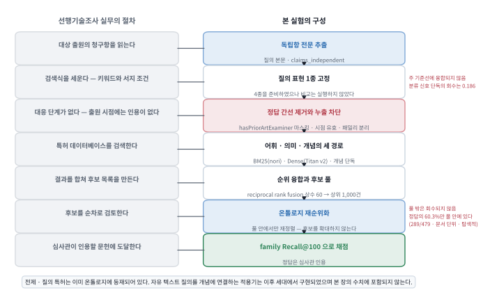
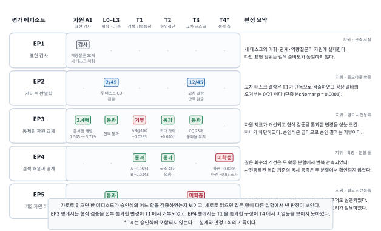
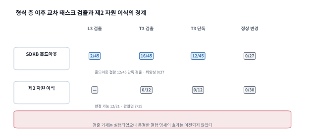

# 다중 태스크 뷰를 공유하는 공학 온톨로지의 진화를 위한 태스크 인식 승인 게이트: 반도체 선행기술 검색에 대한 설계과학 연구

# A Task-Aware Release Gate for Evolving Shared Engineering Ontologies: Evidence from Semiconductor Prior-Art Retrieval

## 국문 초록

공학 도메인 온톨로지는 배포 이후에도 지속적으로 변경된다. 그러나 구조·논리 검사를 통과한 변경이 실제 태스크의 성능까지 보존하는지는 별개의 문제이다. 기존의 온톨로지 평가 연구는 대부분 자원 자체의 품질을 사후에 측정하는 데 머물러 왔다. 여러 태스크가 하나의 어휘 체계를 공유하는 경우 이 문제는 더욱 심화된다. 한 태스크의 성능만으로 승인된 변경이 다른 태스크의 질의 경로를 훼손할 수 있기 때문이다.

본 연구는 설계과학연구(design science research, DSR)의 틀에서 산출물 둘과 평가환경 하나를 설계한다. 첫째 산출물은 반도체 도메인 온톨로지 데이터셋 **SDKB**(Semiconductor Domain Knowledge Base)로, 전문가 매칭·선행기술조사·기술예측의 세 태스크를 하나의 공유 스키마(T-Box) 위에 태스크별 뷰로 표현한다. 둘째 산출물은 형식 검증 네 층(L0–L3) 위에 태스크 조건 셋을 결합한 **변경 승인 게이트**이다. 세 조건은 검색 성능의 비열등성(T1), 하위집단의 국소 회귀 방지(T2), 다른 태스크의 역량질문 통과율 비회귀(T3)이다. 평가환경은 이 둘을 측정하는 **다층 벤치마크**로, 누출을 차단한 검색 평가와 그 결과가 생성 단계까지 이어지는지를 확인하는 평가를 연결한다.

평가는 다섯 에피소드로 수행하였다. 첫째는 SHACL과 역량질문 31개에 의한 표현 감사이고, 둘째는 아직 판정한 적 없는 결함 45건에 대한 홀드아웃 결함주입이다. 셋째는 문서집합·코드·설정을 전부 동결하고 자원 번들만 교체한 통제된 자원 교체이다. 넷째는 거절 특허 1,000건과 심사관 인용을 부분 정답으로 사용한 누출 통제 검색 비교이며, 겹치지 않는 확증 분할 2개(각 198질의)에서 수행하였다. 다섯째는 형식 층과 교차 태스크 층을 제2 공학 온톨로지(건물 메타데이터)에 이식하여 동일 절차로 판정한 이식 평가이다.

주요 결과는 넷이며 넷은 하나의 논증을 이룬다. 첫째, 온톨로지·표면형 사전·문서–개념
매핑으로 구성된 자원 번들을 교체하였다. 기존 특허 문서 한 건에 연결된 온톨로지 개념의 평균은
1.545개에서 3.779개로 증가하였다(2.4배). 이 수치는 T-Box 클래스 수가 아니라 문서–개념 연결
밀도의 변화이다. 해당 변경은 형식 검증 네 층을 모두 통과하였지만, family-level Recall@100은
0.0293 감소하였다(95% CI [−0.0542, −0.0053]). 조건 T1은 이 변경을 사전 지정 비열등 기준을
충족하지 못한 것으로 판정하였다. 따라서 게이트는 승인을 거부하였다. 이는 형식 검증이 놓치는
회귀를 태스크 조건이 검출한 실증 사례이다. 둘째, 이 거부가 필요한 이유는 자원 층의 지표가 다음 층의 성능을
대표하지 못한 데 있으며, 같은 불일치는 검색 층 안에서도 관측되었다. 온톨로지·한정요소
재순위화는 family-level Recall@100을 두 분할 모두에서 개선하였다(+0.0534 · +0.0343). 다만
사전 지정한 주 구성은 유의에 이르지 못하였고 상위 정렬(nDCG@20)은 개선되지 않았다. 셋째,
판정 규칙을 동결한 채 홀드아웃 결함주입을 수행하였다. 주 태스크 검사와 검색 검사가 모두 놓친
교차 결함 45건 가운데 12건을 조건 T3이 단독으로 검출하였다. 정상 변경 27건에 대한 오경보는
0건이었다. 이 12건은 층 사이의 귀속을 특정하며 게이트 전체의 검출력을 늘리지 않는다. 넷째,
이식한 두 층은 코드 변경 없이 실행되어 정상 변경 30건을 하나도 거부하지 않았다. 다만 동결한
결함 명세는 판정 가능한 12건에서 교차 결함을 검출하지 못하였다. 곧 이 한 건의 이식에서 절차는
이전되었고 결함 명세는 이전되지 않았다.

본 연구는 이 평가로부터 한 층 아래 승인, 교차 태스크 감시, 후보생성 분리라는 교훈 셋을 후속 연구가 검정할 가설의 형태로 제시한다. 한계도 명확하다. 태스크 성능을 측정한 대상은 단일 도메인이고, 승인 거부의 실제 사례는 1회이며, 그 원인이 자원에 있는지 점수 계산식에 있는지는 구분하지 못하였다. 전문가 관련성 판정은 수행하지 않았으며, 그 취약도는 계량하고 외생 라벨로 부분 축소하였다. 다국어 융합 기준선을 별도 점검으로 추가하였으나 기준선 강도는 유의하게 변하지 않았다. 질의는 이미 온톨로지에 등재된 특허로 한정되므로, 자유 텍스트 질의를 처리하는 텍스트–개념 매핑 단계와 결손 아홉의 해소 명세는 후속 과제로 제시한다.

**주제어:** 반도체 도메인 온톨로지 데이터셋, 온톨로지 진화, 태스크 인식 승인 게이트, 교차 태스크 비회귀, 자원–태스크 성능 불일치, 선행기술 검색, 설계과학연구

## Abstract

Formal ontology validation does not establish whether a change preserves downstream performance when tasks share a vocabulary. We present the Semiconductor Domain Knowledge Base (SDKB), with three task views on a shared T-Box, and a task-aware release gate. The gate combines four formal layers with retrieval non-inferiority, subgroup, and cross-task conditions. We evaluated it through controlled resource substitution, holdout fault injection, two disjoint 198-query retrieval splits, and a port to a building-metadata ontology. The substituted bundle comprised the ontology, surface-form dictionary, and document-to-concept mappings. Mean concepts linked per patent document rose from 1.545 to 3.779 (2.4-fold). This measures mapping density, not growth in T-Box classes or documents. Although the change passed all formal layers, it reduced family Recall@100 by 0.0293 (95% CI [−0.0542, −0.0053]) and did not meet the preregistered T1 criterion; the gate rejected it. For this change, resource indicators did not represent next-layer performance. The preregistered composite prediction held in neither retrieval split. Family-level Recall@100 improved in both (+0.0534 and +0.0343), but neither the prespecified configuration nor nDCG@20 improved. The cross-task condition alone detected 12 of 45 faults missed by the focal-task and retrieval checks, with 0 false positives among 27 sound deltas. This separation supports attribution between layers, not overall detection strength. On the second ontology, the procedure accepted 30 sound deltas, but the frozen specification detected none of 12 adjudicable faults. The procedure transferred, whereas the specification required regrounding. Evidence is confined to one domain, one rejection with unseparated causal components, and no expert relevance judgments.

**Keywords:** semiconductor domain ontology dataset; ontology evolution; task-aware release gate; cross-task non-regression; proxy-metric mismatch; prior-art retrieval; design science research

## 약어표 (Nomenclature)

약어는 본문에서 최초로 사용할 때 전체 명칭과 함께 표기하고, 이후에는 약어만 사용한다. 게이트·
지표의 명칭(L0–L3 · T1–T4 · Recall@100 · nDCG@20)은 다른 표현으로 바꾸면 지시 대상이
달라지므로 번역하지 않는다. 아래 표는 본문이 사용하는 라벨 체계 다섯을 함께 밝힌다.

| 기호 | 뜻 (정의 위치) |
|---|---|
| BM25 | Okapi Best Matching 25 — 어휘 기반 순위 함수 |
| CQ | competency question, 역량질문 — 온톨로지가 답할 수 있어야 하는 질문 목록 (§3.1) |
| CQ-PA / CQ-EM / CQ-TF / CQ-CORE | 태스크별 CQ 스위트 — 선행기술조사 / 전문가 매칭 / 기술예측 / 공유 코어 (§3.1) |
| RQ | 연구질문 — 설계 질문의 라벨 (§1) |
| 교훈 ①–③ | 본 연구의 교훈 — 후속 연구가 검정할 가설로 진술한 설계 교훈 (§6.3) |
| EP1–EP5 | 평가 에피소드 — 표현 감사 · 게이트 판별력 · 자원 교체 · 검색 이득의 범위 · 이식 판정 (§3) |
| G0 / G1 / G2 | SDKB 그래프 계보 — 기준 그래프 / 후보 모집단 두 종 (§3.2) |
| L0–L3 | 형식 검증 4층 — 신선도·무결성, SHACL 구조, 논리 일관성, CQ 기능 (§3.4) |
| nDCG | normalized discounted cumulative gain — 상위 정렬 품질 (§4.5) |
| SDKB / SHACL | Semiconductor Domain Knowledge Base / Shapes Constraint Language |
| T-Box / A-Box | 클래스·속성·공리의 선언 / 개별 개체와 관계에 관한 단언 (§1·§3.1) |
| T1–T4 | 태스크 조건 — 검색 비열등성 · 하위집단 비회귀 방호 · 교차 태스크 CQ 비회귀 · 하류 생성 층 비회귀 (§3.5) |
| B0–B5 / P0–P2 | 비교 시스템 — 기준선 / 제안 시스템 (§4.3) |
| A1–A8 | 절제(ablation) 조건 · A8은 음성 대조군 (§4.4) |
| ART-1 / ART-2 | 연구 산출물 — SDKB 온톨로지 데이터셋 / 릴리스 승인 게이트 (§3) |
| E1 | 평가환경 — 다층 평가 벤치마크 (§4) |
| \(\epsilon\), \(\delta\) | 비열등 허용한계 0.02, 하위집단 하락 한계 0.05 (§3.5) |

---

# 1. 서론

공학 조직은 도메인 지식을 온톨로지와 지식그래프로 축적하고 그 위에 검색·분석 서비스를
운영한다(Bharadwaj & Starly, 2022; Lewis et al., 2020; Pan et al., 2024). 반도체와 같이
공정·소자·재료·장비·조직이 조밀하게 결합된 도메인에서는 이 축적이 특히 크다. 동일한 물리 현상이
맥락에 따라 다른 명칭으로 지칭되므로, 문자열 일치에 의존하는 검색으로는 도달하지 못하는 연결이
남기 때문이다. 그러나 이러한 지식기반은 완성된 자산이 아니라 계속 변경되는 자산이며, 변경을
릴리스할지 판단하는 절차는 그 축적만큼 정비되어 있지 않다.

절차의 부재는 하나의 사건으로 드러난다. 자원 변경 뒤 문서마다 연결된 개념은 증가하였다.
구조·논리·기능 검사도 모두 통과하였다. 그러나 봉인된 검색 평가에서 회수 성능은 허용 마진
아래로 저하되었다. 본 논문은 이러한 변경을 배포 이전에 차단하는 승인 절차를 다루며, 그림 1이
이 사건의 지도이다. 이 사건의 수치는 §5.2가 보고한다.

반도체 지식은 하나의 태스크에만 사용되지 않는다. 설비 불량은 고장 모드에서 근본 원인을 거쳐
인력과 역량에 연결되어야 한다. 특허 분석은 청구항과 한정요소를 거쳐 선행기술 판단으로
이어져야 하며, 기술기획은 기술 노드를 시나리오·투자 선택지와 연결해야 한다. 이 셋은 서로 다른
저장소가 아니라 공정·소자·재료·장비·조직 어휘를 공유하는 동일 지식의 서로 다른 사용
관점이다. **SDKB**(Semiconductor Domain Knowledge Base)는 이 세 요구를 차례로 수용하며 성장한
반도체 도메인 온톨로지 데이터셋이다.

T-Box는 클래스·속성·공리의 선언을, A-Box는 개별 개체의 유형과 개체 사이 관계에 관한 단언을
가리킨다. 여기서 **태스크 확장형(task-extensible)** 이란 공유 T-Box와 기존 식별자를 공통 기반으로
유지하면서 태스크별 자산을 추가할 수 있다는 성질이다. 태스크별 자산은 그 태스크에 필요한
클래스·관계·제약·역량질문(competency question, CQ)과 A-Box 인스턴스이다. 따라서 태스크 확장형은
T-Box가 변경되지 않는다는 뜻이 아니다. 새 클래스·관계·제약을 추가하더라도 공유 식별자와 기존
구조가 유지된다는 뜻이다. 또한 하나의 온톨로지가 모든 태스크에서 동일한 성능을 낸다는 의미도
아니다. 따라서 온톨로지가 표현할 수 있는 범위와 성능이 검증된 정도는 구분하여 기술해야 한다.

세 태스크 가운데 선행기술 검색은 연구개발의 전단에 위치하면서 정량 측정에도 적합하다. 출원 전
신규성·진보성 판단과 조사 보고서 작성이 이 태스크에 의존하며, 심사관이 실제로 인용한 문헌이라는
외부 기준이 채점을 가능하게 한다. 본 연구가 이 태스크를 측정 대상으로 삼은 이유는 이 외부 기준
때문이다.

그러므로 본 연구가 다루는 문제는 온톨로지 이론의 문제가 아니라 지식기반 운영의 문제이다. 반도체
지식기반은 배포 이후에도 어휘·매핑·인스턴스가 계속 추가되며, 그 변경은 같은 어휘를 쓰는 검색
서비스에 즉시 도달한다. 실무의 질문은 그 변경을 릴리스해도 되는가이다. 그러나 특허 검색 연구와
온톨로지 품질 검증은 서로를 거의 참조하지 않은 채 발전해 왔으며(§2), 온톨로지 측 검사의 통과가
검색 성능을 보장하지는 않는다.

온톨로지 검사와 태스크 성능의 이러한 불일치는 두 형태로 나타난다. 첫째, 온톨로지 변경이
신선도·구조·논리·기능의 네 검증 층(L0–L3)을 모두 통과하고도 봉인된 하류 평가셋에서 검색 성능이
저하될 수 있다. 본 논문은 이러한 태스크 수준의 기능 저하를
**태스크 의미 회귀(task-semantic regression)** 라 정의한다. 둘째, 하나의 어휘 체계가 세 태스크를 함께 지탱하는 경우 특정 태스크를
위해 도입한 변경이 다른 태스크의 질의 경로나 기능을 훼손할 수 있다. 예컨대 회수를 높이기 위해 유사한 두 개념을 통합하면 전문가 매칭에서
`Skill` 을 변별하는 능력이 저하된다. 본 논문은 이 현상을 **교차 태스크 회귀(cross-task regression)** 라
정의한다.

형식 검증이 이 둘을 검출하지 못하는 데에는 자원 측의 이유도 있다. 본 연구의 T-Box에는 선행기술
판단에 관한 논리 공리가 사실상 없다. 서로소나 카디널리티 같은 제약이 선언되어 있지 않으므로,
논리 일관성 검사 층이 검사할 대상 자체가 적다(§5.4). 이는 이 자원에 국한된 사정이 아니다. 본
연구가 이식 대상으로 삼은 제2 공학 온톨로지도 술어의 정의역과 치역을 논리 공리가 아니라 제약
언어로 선언한다(§5.5). 곧 산업에서 운용되는 공학 온톨로지에서 공리의 희소성은 드문 조건이
아니며, 형식 검증만으로 승인하는 절차가 취약해지는 이유가 여기에 있다.

두 현상이 검출되지 않는 이유는 같다. 온톨로지를 수정하는 주체는 대개 자원 측 지표, 곧 어휘의
증가나 **문서당 개념 수(concepts per document)**, 곧 기존 문서 하나에 연결된 온톨로지 개념의
평균 개수를 관찰한다. 이 지표는 T-Box의 클래스 수나 코퍼스의 문서 수를 측정하지 않는다. 여기서
**자원(resource)** 은 응용에 투입되기 이전 상태의 데이터셋 전체를 가리킨다. 본 연구의 통제된
교체에서 자원 번들은 온톨로지·표면형 사전·문서–개념 매핑으로 구성된다. 그러나 평가에는
자원 층·검색 층·생성 층의 세 층이
존재한다(§2.3). 한 층의 지표가 다음 층의 성능을 대표하지 못하는 현상을 본 논문은
**층간 지표 불일치(cross-layer metric misalignment)** 라 부른다. 이 용어는 층 사이의 관측 관계를
기술하며 성능 저하의 원인을 특정하지 않는다. 대표 여부는 측정하기 전에는 알 수 없으므로,
자원 층의 검사만으로는 두 회귀 모두 관측되지 않는다.

따라서 본 연구가 제기하는 질문은 하나이다. 세 태스크를 표현하는 온톨로지 데이터셋이 성장할 때,
주 태스크의 성능을 유지하면서 나머지 태스크의 기능도 훼손하지 않는가. 그리고 이를 릴리스 이전에
어떻게 확인할 수 있는가. 본 연구는 이 질문을 설계과학연구(design science research, DSR)로
다룬다(Hevner et al., 2004; Gregor & Hevner, 2013). 이 틀에서 연구의 관심은 가설의 채택 여부가
아니라, 산출물을 어떻게 설계하고 평가하였으며 거기에서 어떤 이전 가능한 설계지식이 도출되었는가에
있다. 연구질문은 다음 셋이며, 각 질문에 답하는 **평가 에피소드(evaluation episode, EP)** 를
괄호에 함께 표시한다(구성은 §3.0).

- **RQ1** — 세 태스크를 하나의 공유 T-Box로 표현하면서 태스크별 확장이 가능한 온톨로지 데이터셋은
  어떻게 설계할 수 있는가? (§3 · EP1)
- **RQ2** — 형식적으로 유효한 변경이 하류 태스크 성능과 다른 태스크의 기능을 훼손하지 않도록
  릴리스 전에 평가하는 게이트는 어떻게 설계할 수 있는가? (§3 · EP2 · EP3)
- **RQ3** — 산출물 평가에서 어떤 이득과 실패 경계, 그리고 층간 지표 불일치가 관측되며, 거기에서
  어떤 이전 가능한 교훈이 도출되는가? (EP3 · EP4 · EP5 · §6)

본 연구의 기여는 세 가지이다. 첫째는 **산출물**이다. 데이터셋 SDKB는 세 반도체 지식 태스크를
공통 식별자와 공유 T-Box로 연결하고 태스크별 뷰·역량질문·검증 자산을 제공한다. 변경 승인
게이트(T-gate)는 형식적 유효성에 더하여 주 태스크의 비열등성과 하위집단 비회귀 방호, 교차 태스크
기능 보존을 승인 조건으로 결합한다. 두 산출물과 평가 자산은 검증 가능한 형태로 공개한다.

둘째는 **통제된 거부 사례 1건**이다. 문서집합·코드·설정·가중치를 전부 동결하고 자원 번들만
교체하였다. 그 조건에서 자원 지표를 전부 향상시키고 형식 검증 네 층을 전부 통과한 실제 변경이
태스크 조건 하나에서 거부되었다. 본 연구는 그 판정의 기록과 그것을 산출한 절차를 함께 제시한다.
자격을 갖춘 자원 변경이 1건이므로, 이 기여는 그러한 거부가 빈번하다는 주장이 아니라 그것이
일어날 수 있음을 통제된 조건에서 보인 존재 증명이다.

셋째는 **교훈 셋**이다. 근거는 위 사례와 결함주입, 그리고 검색 이득의 경계 측정이다. 여기서
결함주입은 판정식을 동결한 뒤 처음 판정하는 **홀드아웃(hold-out)** 평가이다. 교훈은 근거의
크기에 맞추어 후속 연구가 검정할 가설의 형태로 진술한다. 같은 이유로 검색 이득은 그 경계를
함께 밝힌 형태로만 보고하며, 생성 단계 전달 평가는 별도의 기여로 제시하지 않는다.

이 기여 셋을 뒷받침하는 증거는 세 갈래이며 각각은 독립한 연구가 아니라 승인 논증의 부품이다.
데이터셋 서술은 공유 T-Box가 게이트에 무엇을 제공하는지를 진술한다. 검색 평가는 성능 조건이 읽는
지표가 작동하는 측정 도구임과 그 이득의 경계를 확인하고, 제2 공학 온톨로지로의 이식은 게이트가
어디까지 이전되는지를 한정한다. 셋 가운데 어느 것도 데이터셋 품질의 주장이나 검색 성능의 우열, 또는 일반적
이식 가능성의 주장으로 제시되지 않는다.

독자는 3–5장에서 하나의 **관통 예시(running example)** 를 반복하여 만난다. 관통 예시는 같은
합성 사례를 자원 구조, 평가 설계, 판정의 순서로 다시 읽는 설명 장치이다. 이 사례의 RDF를
**예시 그래프(example graph)** 라 하며, 실물 T-Box 어휘와 최소 합성 A-Box로 구성한다. 또한
본 논문의 **스킴 경로(skim path)** 는 장·절 제목과 그림 캡션 첫 문장, 예시 첫 문장만 이어 읽는
시각적 논증 골격을 뜻한다. 합성 예시는 기제를 설명하고 실제 판정은 사전등록 집계가 담당한다.

이후의 구성은 다음과 같다. 2장은 선행연구와 연구 공백을, 3장은 산출물과 설계·평가 절차를 다룬다.
4장은 평가 설계를, 5장은 다섯 에피소드가 산출한 발견 넷을, 6장은 논의와 설계지식, 한계를 다루며
7장이 결론이다.


**그림 1.** 거절특허 한 건의 사실은 세 태스크가 공유하는 노드에 모이고, 실제 자원 변경은
형식 검증이 아니라 태스크 조건에서 거부되었다. 위 띠는 산출물 ART-1로서 하나의 공유 T-Box 위에 세 태스크 뷰가 놓인 자원을,
가운데 띠는 산출물 ART-2로서 자원 변경을 릴리스 이전에 심사하는 승인 게이트를, 아래 띠는 평가환경
E1로서 다섯 평가 에피소드와 각각의 측정 대상을 나타낸다. 가운데 띠는 왼쪽에서 오른쪽으로 읽으며,
앞 단계가 실패하면 뒤 단계를 실행하지 않는다. 점선으로 표시한 T4는 승인식에 포함되지
않는다. 맨 아래 줄은 문제 식별부터 설계지식 도출까지의 DSR 순환을 요약한다(§3.5.1).

보충자료의 구성과 각 파일이 답하는 질문은 [S0](../supplementary/S0-index.md)에 정리되어 있다.
축약된 절의 전문·부록·보조 표는 supplementary
[S5](../supplementary/S5-submission-full-v2.md)에 원문 그대로 수록되어 있으며, 이하 본문에서는
S5로 표기한다. S5는 본 원고의 이전 판에서 잘라낸 자료를 보존한 기록이므로, 본문이 인용하는
것은 그 안의 표·부록·수치이고 서술의 구성은 본 원고를 따른다. 이후의 재구성으로 새로 이관된
자료는 [S9](../supplementary/S9-retrieval-evaluation-detail.md)에 있다.

---

# 2. 배경과 연구 공백

본 장은 네 갈래의 선행연구를 검토한다. 선행기술 검색의 평가 단위와 정답의 성질(§2.1), 온톨로지
품질 검증이 사후 비교에 머물러 온 경위(§2.2), 자원 측 지표의 대리 타당성(§2.3), 그리고 본 연구의
위치(§2.4)이다. 네 갈래를 종합하면 하나의 공백이 남는다. 우리가 확인한 범위에서는 여러 태스크를 함께 지탱하는
온톨로지의 변경을 릴리스 이전에 승인할 규칙이 없다는 점이다.

## 2.1 선행기술 검색의 평가 단위와 정답의 성질

선행기술 검색(prior art search)은 특정 청구항의 신규성·진보성 판단에 관여할 수 있는 소수의
문헌을 누락 없이 회수하는 태스크이다. 따라서 1차 지표는 상위 소수 건의 정확도가 아니라 충분한
깊이까지의 회수율(Recall@K)이 된다(Lupu & Hanbury, 2013; Shalaby & Zadrozny, 2019). 벤치마크의
계보는 심사관 인용(examiner citation)을 정답으로 사용하는 방향으로 정착되었다(Piroi & Hanbury,
2019; Risch et al., 2020). 방법론은 어휘 기반 순위 함수와 특허에 특화된 의미 표현(Bekamiri
et al., 2024; Ghosh et al., 2024), 그리고 인용망 활용(Mahdabi & Crestani, 2014)의 세 갈래로
발전하였다. 성능이 높은 시스템일수록 단일 표현에 의존하지 않는다(Krestel et al., 2021; Shomee
et al., 2025).

여기서 심사관 인용 한 건은 완전한 정답이 아니라 개별 **관측된 양성(observed positive)** 이다.
인용되지 않은 문헌은 부적합이 아니라 미관측(unobserved) 상태에 있으며, 심사관 인용과 출원인 인용(applicant
citation)은 의미가 다르고(Alcácer & Gittelman, 2006) 심사관의 검색 자체도 시간·분류·관할의
제약을 받는다(USPTO, 2023). 그러므로 Recall@K가 측정하는 것은 알려진 양성의 회수 비율이며, 모든
법적 관련 문헌의 회수율이 아니다. 본 논문은 관측된 양성을 질의별로 모은 불완전한 정답 집합을
**심사관 검증 약한 정답(examiner-validated weak ground truth)** 이라 지칭한다. 여기서 검증은
인용 사실을 심사 기록으로 확인할 수 있다는 뜻이며, 모든 관련 문헌의 법적 적합성을 확인하였다는
뜻이 아니다. 질의마다 어느
문헌이 적합인지를 적어 둔 채점표를 **적합성 판정 목록(relevance judgments, qrel)** 이라 하며, 본
연구의 판정 목록은 적합만을 담으므로 **양성 전용(positive-only)** 이다.

이 정답은 심사 기록으로 감사할 수 있고 실제 거절 결정에 사용된 집합이므로 결손이 아니라 규정된
평가 대상으로 취급하며, 주장의 범위도 그 집합으로 한정한다(§6.4). 판정이 불완전한 평가에는 미판정에
덜 민감한 지표가 권고되나(Buckley & Voorhees, 2004; Büttcher et al., 2007), 그러한 지표는 판정된
비적합 집합(judged non-relevant set)을 전제하며 본 연구의 자원에는 그 집합이 없다(§4.5).

언어 축은 위의 갈래들과 별개이다. 선행기술은 공개 언어와 무관하게 유효하므로 온전한 검색은 언어
경계를 넘어야 하며(교차언어 검색, cross-lingual retrieval), 현재까지의 통로는 기계 번역(Magdy &
Jones, 2014; Lee & Choi, 2023)과 다국어 밀집 표현(Zhang et al., 2023)의 둘이다. 반면 우리가 확인한 범위에서는
명시적 온톨로지의 **언어중립 개념 식별자(language-neutral concept IRI)** 를 제3의 통로로 설정한
평가가 없다. 이 축은 확증 가설이 아니므로 탐색적 진단으로만 보고한다(§5.3.3).

## 2.2 온톨로지 품질과 진화 검증 — 사후 기술에서 사전 승인으로

온톨로지 품질 논의는 설계 원칙에서 출발하였고(Gruber, 1993), 역량질문(CQ)은 요구사항과 검증
항목을 연결하는 장치로 정착하였다(Grüninger & Fox, 1995). 테스트 주도 온톨로지 개발은 그
요구사항을 자동 검사가 가능한 형태로 형식화하였다(Keet & Ławrynowicz, 2016). 지식그래프
구축에서는 역량질문을 SPARQL 질의로 옮기고 SHACL 제약으로 감싸 자동 시험으로 사용하는 방법이
제시되었다(Mynarz et al., 2023). 다만 그 시험은 구축 과정을 유도하는 장치이며 완성된 자원의 변경을
수용할지 판정하는 장치는 아니다. 릴리스 절차의 자동화는 이미 도구로 정착하였다. ROBOT은 변환·추론·
품질 보고를 명령으로 제공하고 이를 지속적 통합에서 실행한다(Jackson et al., 2019). 온톨로지 개발
키트(Ontology Development Kit, ODK)는 품질 검사·의존성 통합·릴리스 산출을 표준 워크플로로
자동화한다(Matentzoglu et al., 2022). 다만 두 도구가 실행하는 검사는 자원 내부의 형식 검사이며,
그 통과 여부와 하류 태스크의 성능은 별개의 층에 있다. 구조 측면에서는 RDF(Resource Description Framework) 품질 점검이
발전하였고(Kontokostas et al., 2014), SHACL(Shapes Constraint Language)이 이를 표준 shape로
표현한다(W3C, 2017). 링크드 데이터 품질의 기준점인 Zaveri et al.(2016)은 품질을 18개 차원과 69개
지표로 구분하였으나, 그 틀은 상태를 기술하는 평가 틀에 가깝다(사후 기술 평가, descriptive
evaluation).

진화 측면에서는 온톨로지 진화가 스키마 진화와 동일하지 않다는 점이 일찍 지적되었고(Noy & Klein,
2004), 이후 변경의 탐지·표현·전파·일관성 보존으로 절차가 정리되었다(Flouris et al., 2008;
Zablith et al., 2015). 그러나 그 절차가 검증하는 것은 변경이 온톨로지 자체를 훼손하지 않는가이며,
그 온톨로지를 사용하는 태스크를 훼손하지 않는가는 아니다. 변경 자체를 대상으로 하는 구문·의미
품질 지표도 제안되었으나(Bakker & de Boer, 2026) 그것이 산출하는 것은 변경의 기술이다. 하류
측면에서는 KGrEaT(Heist et al., 2023)가 지식그래프 보강이 하류 성능 향상을 전제로 정당화되면서도
정작 그 성능은 거의 측정되지 않는다고 지적하였다. 통합 파이프라인을 대상으로 한 벤치마크도
제안되었으나(Hofer & Rahm, 2026) 이 역시 완성 이후의 사후 비교이다.

공학 정보학에서 이 공백은 특히 중대하다. 공학 지식은 제품·공정·설비가 변경될 때마다 함께 변경되는
자산이며, 그러므로 이 분야의 온톨로지는 여러 시스템이 의미를 공유하는 통로로 설계되기
때문이다(Chungoora et al., 2013; Bharadwaj & Starly, 2022). 최근 연구는 변화의 흡수를 표현의
표준화와 아키텍처의 모듈화, 응용 성능의 실증에서 다루었다(Schönfelder & König, 2025; Kosse
et al., 2025; Speiser et al., 2026). 지식그래프를 공유하는 도메인 사이의 영향도 질의로
드러났다(Johansen et al., 2025). 그러나 그 자원이 변경될 때 어떤 변경을 수용하고 거부할
것인가의 규칙은 제시되지 않는다. 이 분야의 검증 논의 역시 구조와 규칙의 준수 여부를 보고하는 데 머문다(Solihin
et al., 2015; Pauwels et al., 2024).

품질을 측정하는 것과 변경을 승인하거나 거부하는 것은 같은 작업이 아니다. 측정은 값을 산출하고 그
해석을 사람에게 남기는 반면, 승인은 값에 임계와 판정 절차를 결합하여 릴리스 여부를 결정한다.
따라서 승인 규칙은 측정 틀이 요구하지 않는 셋을 추가로 요구한다. 결과를 확인하기 이전에 동결한
임계, 그 임계가 적용되는 비교의 통제 조건, 그리고 판정이 거부일 때 릴리스를 중단시키는 집행
경로이다. 앞의 문헌은 이 셋을 갖추지 않았으며, 이 차이가 본 연구의 연구 공백이다. 본 연구는 그
측정을 사전 동결된 하류 태스크 비열등성과 교차 태스크 CQ 비회귀로 구성하여 릴리스 차단 조건으로
집행한다.

승인 규칙에는 두 번째 공백이 따라온다. 규칙이 하나의 자원에서 성립한다는 것과 다른 자원으로
옮겨진다는 것은 서로 다른 주장이다. 승인 규칙은 실행 절차만이 아니라 무엇을 위반으로 볼 것인가를
규정하는 제약과 질의를 함께 요구하며, 그 제약과 질의는 대상 자원의 표현 관습에 의존한다. 예컨대
술어의 정의역과 치역을 스키마 어휘로 선언하는 자원과 제약 언어로 선언하는 자원에서는 같은 규칙이
서로 다른 결과를 낸다. 그러나 무엇이 함께 옮겨지고 무엇이 재정의를 요구하는지를 실측한 기록은
확인되지 않으며, 본 연구는 이 공백을 다섯째 평가 에피소드에서 다룬다(§4.6 · §5.5).

## 2.3 자원 지표가 태스크 성능을 대표하기 위한 조건

앞 절의 검사들은 모두 자원 자체를 대상으로 하나, 자원 지표의 개선은 목적이 아니라 실제 태스크
성능을 높이기 위한 수단이다. 측정 이론에서는 이처럼 다른 성과를 간접적으로 나타내는 값을
**대리 지표(proxy metric)** 라고 하며, 본 논문은 문맥을 분명히 하기 위해 이를 자원 지표라고
부른다. 이 절의 질문은 자원 지표가 실제 태스크 성능을 충분히 대표할 수 있는가이다. 이 문제는 온톨로지 평가에만 나타나지 않는다. 측정치가 관리 목표가 되면 본래 대상을 제대로
대표하지 못할 수 있다(굿하트의 법칙, Goodhart's law; Strathern, 1997; Manheim & Garrabrant,
2018; Thomas & Uminsky, 2020). 자원 자체를 보는 내재적 평가(intrinsic evaluation)는 하류 성능을
충분히 예측하지 못하였고(Chiu et al., 2016; Faruqui et al., 2016), 검색 지표와 생성 품질의 관계도
파이프라인에 따라 달라졌다(Samuel et al., 2026; Speiser et al., 2026). 본 논문은 한 층의 지표가
다음 층의 성능을 대표하지 못하는 현상을 **층간 지표 불일치(cross-layer metric misalignment)** 라
정의한다. 본 연구에서 관측된 세 사례와 그 해석은 §6.1에 모아 제시한다.


**그림 2.** 자원 층의 지표가 2.4배로 향상되는 동안 한 층 아래의 검색 지표는 저하되었다. 왼쪽은 자원 층·검색 층·생성 층의 지표 구조이고, 오른쪽은 각 층 사이에서
실제로 관측된 결과이다. 왼쪽 화살표의 번호가 오른쪽 관측의 번호와 대응하며, ②만은 다음 층이 아니라
같은 층의 다른 단위인 검토 건수를 가리킨다. 관측 ①은 §5.2, ②는 §5.3.3, ③은 §3.5.1·§6.4에
제시하며 해석은 §6.1에 있다.

온톨로지 평가 안에는 이 질문을 정면으로 다룬 전통이 이미 존재한다. 온톨로지를 응용에 결합하고 그
출력으로 평가하는 **과제 기반 평가(task-based evaluation)** 가 그것이다(Porzel & Malaka, 2004;
Brank et al., 2005). 다만 이 전통에서 태스크 성능은 여러 온톨로지를 비교하여 선택하는
기준(selection criterion)으로 사용되었다. 본 연구는 그 사용 위치를 이동시켜, 동일한 태스크
성능을 변경의 수용 여부를 결정하는 승인식의 항으로 사용한다(릴리스 전 승인, pre-release
acceptance).

요컨대 두 겹의 공백이 남는다. 첫째, 보고된 불일치는 대체로 상관 수준의 관측이다. 문서집합·설정·
가중치·평가셋을 고정한 채 자원 번들만 교체한 조건, 곧
**통제된 자원 교체(controlled resource substitution)** 에서 확인한 사례는 드물다(정의는 §3.0).
둘째, 자원 지표의 대표성에 대한 이러한 의문을 **승인 규칙으로 구현한 설계**는 우리가 확인한 범위에서는
없다. 여기서 본 연구가 새롭다고 주장하는 자리는 릴리스 자동화나 형식 품질 검사가 아니다. 그 둘은
§2.2의 도구가 이미 제공한다. 좁혀 잡은 자리는 **하류 검색 비열등성과 하위집단 가드레일, 교차 태스크
역량질문 비회귀를 결합한 승인 계약과 그 계약을 실제 변경에 적용한 통제된 판정**이다.

## 2.4 태스크 확장형 도메인 온톨로지 데이터셋과 연구 위치

도메인 온톨로지 데이터셋은 여러 원천을 안정적 식별자와 명시적 의미관계로 통합하는 공유 T-Box를
갖추어야 한다. 이 점에서 용어 목록이나 단일 응용모델과 구별된다. 또한 T-Box의 표현 범위와 A-Box가
채워진 정도를 구분하여 보고해야 한다(Wilkinson et al., 2016; Hogan et al., 2021). 따라서 본
논문은 §1이 구분한 두 수준에 명칭을 부여한다. **표현 범위(representational scope)** 는
T-Box·SHACL·CQ가 세 태스크의 질의를 표현하고 실행할 수 있는가를 가리킨다. **태스크 검증
깊이(task-level validation depth)** 는 실제 정답과 후보 모집단(candidate pool)에서 특정 태스크의
성능이 유지되거나 향상되는가를 가리킨다.

특허 검색에서 그래프는 어휘 검색의 사각지대를 보완할 수 있다(Mahdabi & Crestani, 2014;
Siddharth et al., 2022; Daniell et al., 2025). 다만 이들 연구에서 그래프는 성능을 위한 입력
표현이며, 그래프 자체의 변경을 허용할지는 다루어지지 않는다. 본 연구의 방향은 검색 성능으로
지식그래프의 진화를 통제하되 그 통제가 다른 태스크를 훼손하지 않도록 감시하는 데 있다.

본 연구의 위치는 위 여섯 연구 흐름과의 대비로 정리되며, 흐름별 대표 문헌과 남는 공백, 그리고 본
연구의 확장을 대응시킨 표는 [S5](../supplementary/S5-submission-full-v2.md)에 있다. 기여는 요소의
신규성이 아니라 결합과 실험설계의 차별성에 둔다.

이상의 검토에서 도출되는 연구 공백은 여러 태스크를 함께 지탱하는 도메인 온톨로지의 변경 승인
설계에 있다. 우리가 확인한 범위에서는, 단일 태스크만 관찰하는 게이트의 과적합을 **교차 태스크 비회귀(cross-task
non-regression)** 조건으로 통제한 릴리스 전 승인 설계가 없다. 같은 범위에서 그러한 설계가 실제
변경을 심사한 기록도, 다른 표현 관습의 자원으로 이식된 실측 기록도 없다(§2.2).

---

# 3. 거절특허 사례로 읽는 데이터셋과 승인 게이트

> **예시 1 · 예시 그래프 · 합성 설명.** 이하 세 장은 거절특허 하나를 설명 렌즈로 삼는다.
> 2013년 출원된 “플라즈마 식각 종점 검출 방법”은 심사관이 인용한 미국 선행문헌 하나 때문에
> 진보성 위반으로 거절된 합성 사례이다. 거절이유통지서의 사실은 다음 RDF 트리플 아홉 개로
> 표현된다.
>
```turtle
pat:1020130000004  a  ont:Patent, ont:RejectedPatent ;
    skos:prefLabel          "플라즈마 식각 종점 검출 방법"@ko ;
    ont:filingDate          "2013-05-10"^^xsd:date ;
    ont:realizesProcess     <…/subprocess/plasma_etch> ;
    ont:rejectedFor         ont:Rejection_Inventiveness ;
    ont:hasPriorArtExaminer <…/patent/us_US7000001> .
<…/subprocess/plasma_etch>  ont:requiresSkill <…/skill/endpoint_detection> .
<…/expert/EXP_M01>          ont:hasSkill      <…/skill/endpoint_detection> .
```

> 위쪽 일곱 트리플은 선행기술조사 뷰가 읽고, 아래 둘은 전문가 매칭 뷰가 읽는다. 두 뷰는
> `plasma_etch` 공정 노드에서 만난다. 이 노드의 변경이 두 뷰의 답을 함께 바꾸는 위험을
> §3은 구조로 설명하고 §4–§5는 평가와 판정으로 확인한다.

실물 거절특허 대신 합성 사례를 사용하는 이유는 두 가지이다. KIPRIS Plus 원문의 재배포 범위가
제한되고, 실물 그래프는 한 특허의 이웃만으로 설명용 지면을 초과한다. 예시 그래프의 특허는
합성이지만 공정·장비·역량 IRI와 라벨은 SDKB에서 발췌하였다. 실측값이 필요한 §5에서는 예시가
아니라 사전등록 집계를 사용한다.

본 장은 본 연구가 무엇을 구축하였고 그것을 어떤 기준으로 평가하였는가를 기술한다. 산출물은
둘이고, 이 둘을 측정하는 평가환경이 하나이다. **ART-1 · SDKB 온톨로지 데이터셋**은 하나의 공유 T-Box
위에 세 태스크 뷰를 구성한 반도체 도메인 자원이다(§3.1–3.3). **ART-2 · 릴리스 승인 게이트**는 형식
검증 L0–L3 위에 태스크 조건 T1·T2·T3를 결합한 병합 전 승인식이며, T4는 승인식 외부의
설계이다(§3.4–3.6). **E1 · 다층 평가 벤치마크**는 심사관 인용을 기준으로 삼되 누출을 차단한
검색 평가와 생성 단계 평가를 연결하는 평가 체계이다(§4).

셋은 §1의 세 연구질문에 각각 대응한다. ART-1의 설계가 RQ1이 묻는 표현 구조에 답하고 EP1이 이를
감사한다. ART-2의 설계가 RQ2가 묻는 승인 조건에 답하며, EP2가 그 판별력을, EP3이 자원의 실제
개정에서 발생한 변경에 대한 판정을 확인한다(§3.0). RQ3은 EP3과 EP4의 결과에서 도출되는 교훈을
묻고, 그 답은 §6.3에 있다.

설계과학연구에서 설계와 평가는 교대로 순환하며, 평가는 목적이 다른 복수의 에피소드로
구분된다(Venable et al., 2016). 그림 1의 아래 띠는 문제 식별, 설계·개발, 1차 평가, 설계 개선,
재평가, 실제 개정 평가, 이식 판정, 설계지식 도출의 순환을 요약한다. 초기 기각과 그 뒤의
재설계 이력은 §5.4와 S2에 있으며, 설계지식의 승격 기준은 §6.3에 있다.

평가 에피소드는 다섯이며, 각각 무엇을 묻는가, 무엇으로 판정하는가, 그 판정의 지위는 무엇인가의
세 측면에서 구분된다(표 1). 다섯은 모두 통제된 조건에서 수행하였고 실제 운영 환경에서의 현장
평가는 포함하지 않는다. 결과 장(§5)의 절 순서는 이와 다르며 그 근거는 해당 장의 서두에 밝힌다.

**표 1. 평가 에피소드 — EP 는 새 라벨이며 사전등록 라벨과 겹치지 않는다.**

| | 에피소드 | 묻는 것 | 판정 방식 | 지위 | 결과 |
|---|---|---|---|---|---|
| **EP1** | **표현 감사** | 세 태스크의 어휘·관계·CQ가 자원에 **실재하는가** | 계수와 CQ 통과 여부 (결정론적) | 관측 사실 | §5.1 |
| **EP2** | **게이트 판별력** | 의도적으로 주입한 결함을 게이트가 **검출하는가**, 정상 변경을 **거부하지는 않는가** | 아직 판정한 적 없는 홀드아웃 결함 · 사전 지정한 세 조건 | 게이트 판별력에 대한 홀드아웃 산출물 평가 (확증 점검 목록에는 포함되지 않는다 · §4.5) | §5.4 |
| **EP3** | **통제된 자원 교체** | 문서집합·설정을 고정하고 **자원만 교체하였을 때** 게이트의 판정은 무엇인가 | 사전등록된 승인식(T1·T2·T3)의 적용 | 별도 사전등록 아래의 판정 | §5.2 |
| **EP4** | **검색 이득의 범위와 경계** | 온톨로지 보강이 강한 텍스트 기준선을 **개선하는가, 어디까지인가** | 봉인 분할에 대한 사전등록된 확증 평가 — 모든 접근을 열람 원장에 기록 (비중복 확증 분할 둘) | 확증 + 탐색적 진단 | §5.3 |
| **EP5** | **이식 판정** | 형식 층과 교차 태스크 층이 **자원을 바꾸어도 동일하게 작동하는가** | 별도 사전등록 아래 홀드아웃 결함 21건과 실제 릴리스 계보 10판정 (승인식은 완성되지 않는다 · T1·T2 미이식) | 별도 사전등록 아래의 판정 | §5.5 |

### 3.0 평가 단위와 변경의 종류

본 연구의 평가는 **평가 에피소드(evaluation episode, EP)** 단위로 구성된다. 에피소드 하나는 질문
하나와 사전 지정된 판정식 하나의 쌍이다. 에피소드 다섯(EP1–EP5)은 서로 다른 질문에 답하므로 한
에피소드의 결과가 다른 에피소드의 판정을 바꾸지 않는다.

게이트가 심사하는 변경은 두 종류다. **주입 결함(injected fault)** 은 저자가 게이트의 검출력을
측정하기 위하여 만든 변경이고, **실제 델타(real delta)** 는 자원의 실제 개정 이력에서 발생한 버전
간 변경이다. 둘을 구분하는 이유는 게이트가 만들어진 오류만 검출하는 것이 아님을 보이기
위해서다. 검출력 측정에 사용하는 결함은 **홀드아웃(hold-out)** 이며, 판정식과 임계를 동결한 뒤에
처음 판정한 것으로 판정식을 조정하는 데 사용된 적이 없다.

실제 델타의 효과는 **통제된 자원 교체(controlled resource substitution)** 로 측정한다. 문서집합·
검색 코드·설정·분할·봉인된 정답을 전부 동결한다. 그 상태에서 온톨로지·표면형 사전·문서–개념
매핑으로 구성된 자원 번들만 교체하여 두 실행의 차이가 번들의 차이에서만 비롯되게 한다.

실제 델타는 다시 세 유형으로 구분된다. **T-Box 델타**는 클래스·술어·공리의 선언이 바뀐
변경이다. **개념층 델타**는 어휘·계층·라벨·문서–개념 링크가 바뀐 변경이다. **A-Box 코퍼스
델타**는 문서가 추가된 변경이다. 앞의 두 유형은 승인식의 판정 대상이 되나 셋째는 그렇지 않다.
문서집합이 달라지면 두 실행은 동일한 후보 모집단 위의 비교가 아니게 된다. 그 조건에서 관측된
성능 차이는 자원의 차이로 귀속되지 않는다. 본 논문은 앞의 두 유형을
**자격 있는 델타(eligible delta)** 라 지칭한다.

유형의 판정은 해석이 아니라 기계적 분류이다. 분류기는 스냅샷의 파일별 해시와 T-Box 계수만을
읽는다. 한 델타에 여러 유형이 섞이면 A-Box 유형으로 판정하므로, 자격 없음이 다른 유형에
흡수되지 않는다.

자격을 갖춘 델타라 하더라도 두 실행의 비교가 곧바로 성립하지는 않는다. 판정 이전에 일곱 항의
**사전 적격심사(eligibility screening)** 를 수행한다. 앞의 네 항은 비교의 성립 여부를 확인하며,
동일 시스템·동일 분할·동일 정답지·동일 코드 커밋이 그 대상이다. 뒤의 세 항은 델타의 존재와
자격을 확인하며, 스냅샷 서명의 상이·파이프라인 서명의 상이·델타 유형이 그 대상이다. 한 항이라도
불충족이면 결과는 불통과가 아니라 미검정이다. 미검정의 사유는 셋으로 구분된다. 스냅샷 서명이
동일하여 차이가 정의상 0인 경우, 스냅샷은 변경되었으나 파이프라인이 그것을 읽지 않은 경우, 비교
자체가 성립하지 않는 경우이다. 불통과와 미검정을 구분하는 이유는 두 결과가 요구하는 후속 조치가
서로 다르기 때문이다.

## 3.1 공유 공정 노드를 지나는 세 태스크 경로

SDKB의 T-Box는 선행기술 검색만을 위한 단일목적 스키마가 아니다. 실제 TTL에는 반도체
공정·소자·재료·장비·고장·역량·특허·기업·기술전략 어휘가 함께 존재하며, 세 태스크가 이를 서로 다른
경로로 사용한다: \(T_{\mathrm{SDKB}} = T_{\mathrm{core}} \cup V_{\mathrm{match}} \cup V_{\mathrm{priorart}}
\cup V_{\mathrm{foresight}}\). 각 뷰는 배타적 모듈이 아니라 공유 개념을 중첩 사용한다.

이 분해가 데이터셋 설계에서 의미하는 바는 셋이다. 첫째, 세 뷰는 별개의 온톨로지가 아니라 공유
코어 \(T_{\mathrm{core}}\) 위에 놓인 모듈이며 공정·소자·재료·장비·조직 어휘가 접점을 이룬다.
둘째, 뷰의 경계는 클래스의 배타적 분할이 아니라 질의 경로의 차이로 규정된다. 동일한 `Equipment`
인스턴스를 전문가 매칭은 역량의 근거로, 선행기술조사는 기술 요소의 근거로 사용한다. 셋째, 공유
식별자는 태스크 사이의 연결을 가능하게 하는 동시에 회귀의 전파 경로가 된다.


**그림 3.** 세 태스크 뷰는 별개의 온톨로지가 아니라 같은 공정 노드를 서로 다른 술어로 지나는 질의 경로이다. 위의 세 칸은 각 뷰의 주요 클래스와 대표 역량질문, A-Box
근거, 그리고 본 논문에서의 지위를 나타낸다. 가운데의 세 통로는 둘 이상의 뷰가 함께 사용하는
어휘이며, 각 통로에서 뻗은 점선은 그 어휘가 잇는 두 뷰를 보여준다. 아래 칸은 공유 코어와 게이트가
관찰하는 역량질문의 스위트별 개수이다. 세 뷰가 배타적 모듈이 아니라는 사실이 §1의 교차 태스크
회귀가 발생할 수 있는 이유이다.

공유 어휘는 교차 태스크 의존이 형성되는 통로에 해당한다(그림 3). 다만 T-Box에 클래스와 관계가
존재한다고 해서 모든 뷰의 인스턴스가 동일한 완전도로 채워진 것은 아니므로, 계수는 고정된 릴리스
커밋에서 자동으로 산출한다.

이 자원이 답해야 하는 질문은 반도체 현장의 질문이다. 역량질문 스위트가 지시하는 축은 공정 단계·
소자·재료·장비 클래스·기술 노드·밸류체인 역할·수출통제 지정이며, 세 뷰의 질의는 이 축들 위에서
구성된다. 예컨대 어느 불량이 어느 공정 단계에서 발생하고 그 근본원인의 완화에 어떤 역량이
필요한가는 공유 코어의 질문이다. 어느 거절 특허가 어떤 거절근거로 어떤 선행기술 때문에
거절되었는가는 선행기술조사 뷰의 질문이다.

공정 어휘는 이 통로가 실제로 형성되는 방식을 예시한다. 선행기술조사 스위트의 질의는 특허를
`realizesProcess` 관계로 공정 단계에 연결한다. 전문가 매칭 스위트의 질의는 사람을
`hasProcessExpertise` 관계로 같은 공정 단계에 연결한다. 기술예측 스위트의 질의는 같은 관계
위에서 공정 단계별 최근 출원의 유무와 연도 분포를 센다. 곧 세 스위트는 서로 다른 술어로 동일한
공정 축을 지난다. 장비 축도 같은 구조이며, 장비 클래스는 전문가 매칭 스위트와 공유 코어 스위트가
함께 사용한다. 따라서 공정이나 장비 어휘를 통합하거나 분할하는 변경은 세 뷰의 질의 응답 규모를
동시에 변화시킨다. 교차 태스크 조건이 감시하는 대상이 이 동시성이다.

이 구조는 대안과의 비교에서 선택된 것이다. 세 태스크를 별개의 온톨로지로 두고 정렬 매핑으로 잇는
구성에서는 한 온톨로지의 변경이 다른 태스크에 미치는 영향이 매핑 뒤에 가려진다. 본 연구는 그
영향을 릴리스 이전에 관측하는 것을 목적으로 하므로 공유 코어를 택하였고, 대가는 결합이다. 공유
어휘가 회귀의 전파 경로가 되며, 그래서 교차 태스크 조건 T3이 승인식에 필요해진다(§3.5). 두 대안의
전개와 뷰 경계를 질의 경로로 규정한 두 번째 결정의 근거는
[S10](../supplementary/S10-artifact-design-rationale.md)에 있다.

역량질문도 이 구조를 따른다. 태스크마다 CQ 스위트를 분리하되, 공급망·규제처럼 둘 이상의 뷰를
연결하는 질문(예: CQ13·14·19·21)은 **공유 코어(CQ-CORE)** 스위트로 귀속한다(§3.4 · S1-A). 세 뷰
가운데 선행기술조사만 약한 qrel을 보유하므로 정량 검증이 가능하며, 이 비대칭은 결함이 아니라 주장
범위를 통제하기 위한 설계이다. 세 태스크를 포괄하는 것은 T-Box와 CQ의 관측 사실이고, 본 연구는 세
태스크의 성능이 모두 검증되었다고 주장하지 않는다. 한편 `NoveltyScore`는 정답에서 파생된 지표이므로
검색 피처에서 배제한다.

따라서 태스크의 추가는 클래스의 추가만으로 완결되지 않는다. 본 데이터셋은 새 태스크를 수용할 때
네 자산을 함께 요구하며, 본 논문은 이를 **확장 계약(extension contract)** 이라 지칭한다. 새
클래스와 관계, 그 관계의 카디널리티를 규정하는 SHACL shape, 해당 뷰의 질의를 대표하는 CQ 스위트,
그리고 공유 코어 어휘와의 매핑이다. 이 계약이 필요한 이유는 공유 코어 자체에 있다. 한 뷰를 대상으로
한 변경도 공유 어휘를 경유하면 다른 뷰의 질의 경로에 도달한다. 구조 검사와 논리 일관성 검사는
변경된 뷰의 내부만 관찰하므로 그 파급을 보지 못한다. 네 자산 각각의 요구 근거와 파급의 사례는
[S10](../supplementary/S10-artifact-design-rationale.md)에 있다.

## 3.2 예시 사실에서 실측 계보로의 확대

예시 1의 공정 노드가 세 뷰로 확대되는 경로는 그림 3을 다시 참조한다.

<!-- style-ok: 자원 계수 열거 -->
SDKB는 단일 파일이 아니라 목적과 코퍼스가 상이한 버전 계보이다. **G0**(105,588 트리플)는 기준
온톨로지이자 **벤치마크 앵커**이다. G0는 거절 특허 1,000건·CitedPatent 3,034개·심사관 인용
2,534건과 청구항·거절판단 T-Box를 포함한다. **G1**(924,814)과 **G2**(490,529)는 **후보
모집단(방해문서 풀)** 이다. 두 그래프는 각각 종합 반도체 기업 특허 24,179건과
**한국반도체산업협회(Korea Semiconductor Industry Association, KSIA)** 188개사 특허
12,339건을 추가한 것이다. 별도의 claim-feature 사이드카(11,605,931 트리플)에는 Claim
586,567개·ClaimFeature 1,289,512개·PriorArtJudgment 635개가 존재한다. 이 수치는 본 논문의 모든 측정이 수행된 자원 세대의
값이다(상류 스냅샷 `d578bf3`).
<!-- sig-history -->

<!-- style-ok: 서명 수치 열거 -->
> **관측 사실.** G1·G2는 온톨로지의 세대가 아니다. 세 그래프의 T-Box는 동일하다. `owl:Class` 103 ·
> `owl:ObjectProperty` 97 · `owl:DatatypeProperty` 81이 세 그래프에서 모두 같으며, 술어 델타는
> 추가 0 · 제거 0이다. G1·G2가 추가하는 것은 특허 A-Box 문서뿐이며, 심사관 인용 정답 2,211건은
> 전부 G0 내부에 존재하고 G1·G2에만 존재하는 정답은 0건이다. 이들을 제외하면 후보 코퍼스가
> 40,552건에서 4,034건으로 축소되어 대규모 후보 집합이라는 조건이 성립하지 않는다. T-Box가 한
> 번도 변경되지 않았으므로 승인 안전성을 검정할 자격 있는 변경도 이 계보에 존재할 수 없었다(§6.4).
> 이 계수 또한 위 문단이 밝힌 측정 세대(상류 스냅샷 `d578bf3`)의 값이다. <!-- sig-history -->

거절 특허 축은 심사관 인용과 거절근거, 청구항과 한정요소, 거절판단, 그리고 출원인 인용을 별개의
관계로 표현한다. 심사관 인용 관계는 누출 통제 시 검색 그래프에서 제거된다. 이 모델은 특허 간 인용
관계에 머무르지 않고, 어느 청구항의 어떤 한정요소가 어떤 거절근거 아래 어느 선행기술과 관련되는가까지
표현한다. 다만 표현 가능성과 인스턴스가 실제로 채워진 정도는 구분되어야 하므로, 본 논문은 분석마다
사용 가능한 관계의 수와 결측 비율을 함께 보고한다. 술어의 전량 목록은
[S1](../supplementary/S1-appendices-v09.md)에 있다. 모든 트리플에는 출처 서명이 부여되어 있으며,
릴리스마다 자동으로 실행되는 **지속 통합(continuous integration, CI)** 파이프라인이 정합성을
검사한다.

## 3.3 인용 관계의 관찰 수준과 적합성 등급

그림 3을 자원 계보의 관찰 수준으로 확대하면, 같은 인용도 사용할 수 있는 관계 깊이가 서로 다르다.

정답 자원이 그래프에 도달하는 정도는 **관찰 수준(observation level)**, 즉 어떤 관계까지를
연결로 인정하는가에 따라 크게 달라진다. 노드 수준의 도달성은 95.3%이고, 도메인 의미 관계만으로는
54.6–70.5%이며, 분류코드를 포함해야 다시 95.3%에 이른다. ClaimFeature 수준의 도달성은 판단
연결이 있는 표본에서 402/584(68.8%)이다. 수준별 정의와 산출 절차의 전문은
S5에, 재현 명령은
[S1](../supplementary/S1-appendices-v09.md)에 수록되어 있다.

심사관 인용은 총 2,534건이고 그중 30건이 비특허문헌이다. 2,534 · 2,321 · 2,211 · 584는 서로 다른
분모이므로 하나의 정답 수로 혼용하지 않는다. 노드나 분류코드 수준의 높은 값만 보고하면 의미 검색
준비도를 과대평가하게 된다. ClaimFeature 68.8%를 전체의 속성으로 기술하면 부분집합의 성질을
과잉 일반화하게 된다. 네 분모의 정의와 적합성 등급 둘의 판정 규칙, 그리고 정답 유입을 차단하기 위한
릴리스 다섯 구분은 [S1](../supplementary/S1-appendices-v09.md)에 있다. 후보와 qrel은 DOCDB
family_id 단위로 통합하여 계수하며 주 결론은 패밀리 단위에 둔다. 데이터셋 릴리스는 커밋 SHA와
sha256으로 **고정(pin)** 하고 평가 프로토콜과 임계는 개봉 이전에 **동결(freeze)** 한다(§6.5).

## 3.4 형식 검증 이후의 태스크 승인 조건

> **예시 2 · 두 합성 델타 · 합성 실행.** 예시 1의 공정 노드를 상위 공정과 오병합하면
> 선행기술조사 질의는 유지되지만 공정 계층 질의의 응답이 감소한다. 전문가 사례의 결함모드
> 간선 하나를 재배치하면 특허–결함모드–전문가 질의의 응답이 사라진다. 두 변경은 형식 검증을
> 통과하였으며, 다음 표는 저장소의 CQ 실행기와 v2 판정식이 산출한 태스크 층 결과이다.
>
> | 합성 델타 | 선행기술조사 L3 | 교차 태스크 T3 | 회귀 CQ(전→후) |
|---|---|---|---|
| Δ_ex-A · 공정 개념 오병합 | 통과 | 미충족 | CQ21 2→1행 |
| Δ_ex-B · 사례–결함모드 재배치 | 통과 | 미충족 | CQ28 1→0행 |
>
> 이 합성 실행은 판정식의 작동을 설명할 뿐 실제 릴리스의 효과나 대표성을 주장하지 않는다.
> 실제 자원 변경은 T1에서 멈추었고, 홀드아웃 결함 집계에서는 T3 단독 검출이 관측되었다(§5.2·§5.4).

<!-- style-ok: 절차 흐름 표기 -->
본 절부터 두 번째 산출물(ART-2)을 기술한다. 평가·승인 절차는 앞 단계가 실패하면 이후 단계를
실행하지 않으며(fail-fast), 그래프 델타 → **L0–L3 형식·기능 검증** → 누출 차단 검색 인덱스 →
**T1 검색 비열등성 + T2 하위집단 비회귀 방호** → **T3 교차 태스크 CQ 비회귀** → 병합·릴리스의
순서로 구성된다. T3를 마지막에 배치한 이유는 계산 비용이 아니라 해석 순서에 있다. T1·T2는 게이트
태스크의 성능을 묻고, 이어 T3는 그 대가로 다른 태스크가 희생되지 않았는가를 묻는다.

네 형식 층은 검사 대상과 도구가 서로 다르다. 신선도·무결성 층(L0)은 산출물이 스냅샷보다 낡지
않았는가와 파일별 해시가 출처 기록과 일치하는가를 확인한다. 구조 층(L1)은 제약 언어 SHACL로
형상 위반을 확인한다. 논리 층(L2)은 기술논리 추론기로 병합 이후 그래프의 일관성을 확인한다.
기능 층(L3)은 주 태스크의 역량질문을 실행하여 질의 경로의 단절을 확인한다.

구조 층은 두 겹으로 구성된다. 그래프 전체에는 완화된 형상을 적용하고, 병합 대상 델타에는 개념
매핑을 하나 이상 요구하는 엄격한 형상을 적용한다. 두 겹으로 나눈 이유는 게이트의 질문이 그래프에
새로 투입하여도 되는 데이터인가에 있기 때문이다. 기존 데이터를 소급하여 처벌하는 것은 이 질문과
다르다. 하나의 형상으로 두 질문을 함께 물으면 기존 자산의 위반이 신규 델타의 판정을 가리게 된다.

논리 층은 원본 그래프가 아니라 추론 전용 사영본에 적용한다. 추론기가 지원하지 않는 날짜 자료형과
메타모델링 선언이 적재 단계에서 예외를 발생시키기 때문이며, 원본 그래프는 변경하지 않는다. 이
사영은 검사의 완화가 아니라 적용 범위의 한정이다. 사영에서 승격되는 날짜 자료형의 위반은 구조
층이 원본에서 검사하므로 검출력이 유지된다. 이 층의 통과가 지니는 정보량이 크지 않은 이유는
자원 측에 있으며, 그 근거는 §5.2와 §5.4에 있다.

역량질문은 모두 31개이며 용도가 셋으로 갈린다. 계수는 질의 파일과 CQ 실행 산출물에서 읽는다.
사이드카 질의 셋은 시험 대상 그래프에 무반응인 상수항이므로 판정 분모에서 제외한다.
스위트 라벨은 질의 파일 자체에 선언하며, 라벨이 없는 파일은 기본 스위트로 귀속되지 않고 실행
오류가 된다. 분모가 예고 없이 변경되면 교차 태스크 조건의 판정이 공허해지기 때문이다.

게이트가 관찰하는 역량질문은 28개이다. 선행기술조사 5개는 기능 층 L3이 관찰하고, 다른 태스크와
공유 코어 23개는 교차 태스크 조건 T3이 관찰한다. 사이드카 3개를 포함한 전량과 G0 응답은
[S1-A](../supplementary/S1-appendices-v09.md#s1-a--역량질문-31개의-구분과-용도)에 있다.

L3와 T3의 관찰 대상은 서로 중복되지 않는다. L3는 주 태스크 스위트(pa 5개)를, T3는 다른 태스크와
공유 코어(em·tf·core 23개)를 관찰하며 두 집합의 합집합이 게이트 관찰 CQ 28개 전량이다. 이 분리는
검출의 강도가 아니라 귀속을 규정한다. 이전 정의에서는 `L3 ⊇ T3` 가 성립하여 T3 단독 검출을 주장하는
가설을 검정할 수 없었으며 이 분리가 그 문제를 해소한다(경위는
[S2](../supplementary/S2-fault-injection-v09.md)). T3의 조건은 통계 검정이 아니라 결정론적 통과율
비교이다. CQ는 표본이 아니라 명세이므로 통과율이 저하되면 즉시 실패로 처리하고, 예외는 명시적
waiver 토큰으로만 허용하며 발생 횟수를 보고한다.

## 3.5 형식 층과 태스크 조건의 결합 승인식

그래프 델타 \(\Delta G\)의 승인 여부는 다음과 같다.

\[
Accept(\Delta G)=
\mathbb{1}[L0{=}L1{=}L2{=}L3{=}pass]
\cdot
\underbrace{\mathbb{1}[LB_{95\%}(\Delta R_{100})>-\epsilon]}_{T1}
\cdot
\underbrace{\mathbb{1}[\max_s Drop_s<\delta]}_{T2}
\cdot
\underbrace{\mathbb{1}[\forall f\in\{EM,TF,CORE\}:\; PassRate_f(O')\ge PassRate_f(O)]}_{T3}
\]

식이 곱의 형태이므로 한 항이라도 0이면 승인은 0이 된다.

승인식의 대상은 그래프 델타 \(\Delta G\)이나 T1·T2는 두 순위 결과의 비교이므로 시스템 구성의
변경에도 같은 형식으로 적용된다. 자원 변경에 대한 승인 판정은 §5.2의 1회뿐이며, §5.3.1의 판정은
시스템 구성 변경에 승인식을 적용한 예행이다.


**그림 4.** 형식 검증 네 층을 통과한 변경도 태스크 조건에서 멈추며, 합성 데모와 실제 거부는 서로 다른 항을 설명한다. 왼쪽 열은 승인 절차의 순서이며 위에서 아래로 읽는다. 가운데
열은 각 항이 미충족일 때의 처리이고, 오른쪽 열은 통제된 자원 교체(§5.2)에서 각 항이 실제로 낸
판정이다. 형식 검증을 전부 통과한 변경이 성능 조건 하나에서 거부되었다는 사실을 오른쪽 열에서
확인할 수 있다.

\(\Delta R_{100}\)은 기준 버전 대비 Recall@100 차이이고, \(LB_{95\%}\)는 동일 질의를 짝지어
재표집하는 **질의 단위 쌍체 부트스트랩(paired bootstrap)** 으로 산출한
**신뢰구간(confidence interval, CI)** 의 하한이다. \(s\)는 미리 정해 둔 거절근거·공정·언어 하위집단, \(f\)는 다른
태스크와 공유 코어의 CQ 묶음이다. T1이 검정하는 것은 성능의 향상이 아니라 저하 여부이며, 이는
비열등성 검정(non-inferiority testing) 논리를 적용한 것이고 허용 폭 \(\epsilon\)은 검정력과
무관하게 사전에 등록한다. 거부는 변경이 무가치하다는 판정이 아니라 원인을 규명하고 조건을 보완하여
재제출하라는 요구이다.

\(PassRate_f\)는 스위트 \(f\)에서 v2 판정을 통과한 역량질문의 비율이며, v2 판정은 존재검사와
사전 선언된 극성별 행 수 분포검사의 논리곱이다.

\[
pass_{v2}(i)=[\,rows_i \ge expect\text{-}min_i\,]\wedge\neg\,regress_i,\quad
regress_i:\; rows_i<(1-\tau)\,base_i\;(\text{up}),\;\; rows_i>(1+\tau)\,base_i\;(\text{down})
\]

\(base_i\)는 기준 세대의 행 수이고 극성은 역량질문마다 사전 선언한다. 따라서 T3는 응답의 존재
여부만이 아니라 응답 규모의 회귀도 검출한다.

임계 셋은 \(\epsilon = 0.02\)(비열등 허용 폭) · \(\delta = 0.05\)(하위집단 하락 한계) ·
\(\tau = 0.05\)(분포 검사의 임계)이며 평가셋 개봉 이전에 전부 고정하였다. 셋은 검정 관례에서 취한
규범적 선택이고 재색인 변동폭이나 실무자 허용 한계로 보정한 값이 아니므로, 이 결손과 보정 방법은
S3-A의 결손 ④에 싣는다.

T2의 판정 방식에는 결과 확인 이전에 명시한 보수성이 있다. T2는 하위집단별 하락의 최댓값을
\(\delta\)와 비교하는 결정론적 규칙이며 집단별 신뢰구간의 하한을 사용하지 않는다. 따라서 표본이
작은 집단에서는 우연한 하락이 판정을 좌우할 수 있다. 집단 수가 적으면 하락을 관측할 지점 자체가
부족하다. 확증 분할 198질의에서 `n≥20`을 충족하는 집단은 언어축 2개 · 거절근거축 2개 · 공정군축
1개에 그친다. 이 규칙은 동결되었으므로 변경하지 않으며, 집단별 구간 추정은 후속 사전등록으로
이월한다.

### 3.5.1 T4 — 하류 생성 층의 비회귀 조건 (판정 1회 · 승인식 미편입)

승인식의 논리를 한 층 더 아래로 적용하면, 검색 층의 지표가 그 아래 생성 층의 가치를 대표하는가라는
질문이 남는다. 본 연구는 그 대표성을 확인하지 못하였으므로 네 번째 조건을 별도로 명시한다.
이하에서 **검색 구성(retrieval configuration)** 은 비교 조건마다 문헌을 공급하는 검색 시스템을
가리킨다.

> **T4(하류 생성 층 비회귀).** 검색 구성만 교체하고 생성기를 고정한 조건에서, 근거로 제시한 문헌의
> 인용 정확도가 저하되지 않고 환각률이 상승하지 않을 것. 여기서 고정 대상은 모델·프롬프트·온도·
> 시드·컨텍스트 K이다.

T4는 위 승인식에 포함되어 있지 않다. 마진과 환각률 임계는 개봉 이전 커밋에 동결하였고 판정은
1회 수행되어 실패하였다(§6.4). 정식 평가를 위한 선행조건은 충족되었으나 승인식 채택에는
반복검증이 추가로 필요하다. 단 한 번의 실패를 근거로 릴리스 규칙을 개정하면 반대 방향의 과잉
주장이 된다. 임계값과 평가 조건의 전문은 S5 부록
A에 있다.

## 3.6 재현 가능한 릴리스 운영과 감사 기록

그림 5를 릴리스 운영의 관점에서 읽으면 입력 동결부터 판정 기록까지의 감사 경로가 드러난다.

앞의 두 절이 기술한 것은 승인의 규칙이고, 본 절이 기술하는 것은 그 규칙이 실행되는 절차이다.
승인 게이트는 온톨로지 유지관리와 검색 서비스 운영을 연결하는 위치에 있다. 개념 별칭의 추가나
분류 매핑의 변경마다 전체 수작업 검토를 요구하는 대신, 형식 검증과 태스크 조건을 **지속 통합
(continuous integration, CI)** 파이프라인에서 실행한다.

운영의 단위는 릴리스 후보 델타이다. 델타가 제안되면 그 델타는 병합 이전에 파이프라인에 진입한다.
파이프라인의 순서는 스냅샷 고정, 형식 검증 L0–L3, 누출 차단 인덱스의 재구축으로 시작한다.
이어서 동결한 검색 회귀 세트에 대한 T1·T2와 교차 태스크 스위트에 대한 T3이 실행된다. 앞 단계가
실패하면 이후 단계는 실행되지 않는다(§3.4). 전 단계를 통과한 델타만 병합되며 우회 경로는 두지 않는다.

각 실행은 판정을 산출물로 남긴다. 스냅샷의 파일별 해시와 코퍼스 서명, 항별 판정을 함께 기록하므로
판정의 재현이 가능하다. T3의 예외는 명시적 waiver 토큰으로만 허용하며 누적 횟수를 보고한다.

판정과 함께 기록하는 항목이 하나 더 있다. 자원 스냅샷이 변경되어도 코퍼스·개념 축·그래프의 서명이
그대로이면 그 변경은 파이프라인에 도달하지 않은 것이다. 이 상태에서 산출된 회수의 차이는 측정된 0이
아니라 구성상 0이며, 그 위에서 산출된 승인은 변경이 안전하다는 근거가 되지 못한다. 따라서 각 실행은
자원 델타가 게이트에 도달한 상태인가를 셋 가운데 하나로 함께 기록한다. 비가시, 비가시의 증거 없음,
판단 불가이다. 가운데 상태는 델타가 관측되었다는 뜻이 아니다. 이 항목은 승인식에 포함되지 않으며
판정을 변경하지 않는다. 기록의 목적은 그 승인이 무엇을 근거로 한 승인인가를 남기는 데 있다. 세
상태의 판정 규칙과 릴리스별 추적 절차의 전문은 S5에 있다.

실행 비용은 이식 판정에서 측정하였다(§5.5). 형식 층과 교차 태스크 층의 합계는 약 138초이고 최대
상주 메모리는 595 MB이다. 이 값은 해당 규모에서의 실행 가능성에 대한 진술이며 규모 확장성의 근거가
아니다. 층별 값은 §5.5에 있다.

이 절차가 운영에서 담당하는 범위도 함께 한정한다. 항별 점수는 검토 우선순위를 지원하는 정보이며
법적 판단을 대체하지 않는다. 또한 전문가 매칭 뷰와 기술예측 뷰는 T3 회귀 감시의 대상이며, 두 뷰의
검색 성능은 본 연구의 주장 대상이 아니다.

지금까지는 특허 한 건의 표현과 그 위의 변경을 보았다. 다음 장은 같은 구조가 질의 198건의
평가에서 어떻게 측정되는지를 다루며, 분석 단위는 특허 인스턴스에서 평가 질의로 바뀐다.

---

# 4. 예시 특허에서 평가 질의와 릴리스 판정으로

본 장은 평가환경(E1), 곧 앞의 두 산출물을 검증하는 평가 체계를 기술한다. 상세 명세와 미실행
설계의 전문은 supplementary
[S1](../supplementary/S1-appendices-v09.md)·[S3](../supplementary/S3-unexecuted-design-v09.md)에
수록되어 있다.

에피소드마다 무엇을 고정하고 무엇을 변경하는지가 다르므로(§3), 동일한 온톨로지가 절마다 다른
지위를 갖는다. EP2에서 온톨로지는 시험 대상이고, EP3에서는 문서집합·설정·가중치를 고정한 유일한
변인이며, EP4에서는 순위 함수의 입력 특징이다. §4.4의 A8에서는 온톨로지의 한 계층이
**음성 대조군(negative control)**, 곧 제거하여도 검색 성능이 달라지지 않아야 하는 대조 조건이
된다. 자원 변경의 효과를 판별하려면 문서집합·모델·가중치를 고정한 채 자원 번들만 교체해야 한다.
이는 본 연구가 평가를 설계하며 둔 방법론적 요구사항이다.

본 실험은 선행기술조사 실무의 절차를 모사하며, 그림 5는 그 절차와 본 실험 구성의 대응 그리고
대응이 성립하지 않는 자리 둘을 함께 제시한다. 실무의 서지 조건에 해당하는 구성이 주 기준선에
융합되어 있지 않다는 것과 본 실험의 재순위화가 후보 풀을 확대하지 않는다는 것이다. 두 제약의
영향은 각각 §4.3과 §6.2에서 다룬다.



**그림 5.** 질의 특허 자신의 인용 간선을 색인에서 제거한 뒤 남는 신호만으로 후보를 정렬한다. 왼쪽 열은 실무의 단계, 오른쪽 열은 각 단계에 대응하는
본 실험의 구성이다. 오른쪽 여백의 두 주석은 대응이 성립하지 않는 자리이며, 아래 띠는 본 장의
수치가 성립하는 전제이다.

## 4.1 예시 특허를 질의로 바꾸는 시간·패밀리 분할

그림 5를 기준으로 예시 특허 한 건은 시점과 패밀리 조건을 적용한 평가 질의 하나가 된다.

본 장의 수치는 질의 특허가 이미 온톨로지에 등재된 조건에서 산출되었으며, 이 제약의 영향과 해소
방법은 §6.4에 있다. 주 분석의 질의 단위는 거절 특허 1건이며, 질의 본문은 독립항
전문이다(중앙값 527자). 준비하였으나 실행하지 않은 질의 표현 비교는
[S3](../supplementary/S3-unexecuted-design-v09.md)에 있다.

무작위 분할은 동일 패밀리와 미래 정보를 혼입시킬 수 있다. 따라서 질의 특허를 출원일로 정렬하여
오래된 60%를 학습, 다음 20%를 개발, 최신 20%를 테스트로 배분하였다. 동일 DOCDB 패밀리의 문헌은
하나의 분할에만 배치하였다.
<!-- style-ok: 분할 계수 열거 -->
분할은 학습 600 / 개발 200 / 테스트 200이고 경계는 2016-11-21과 2021-07-21이며, 알려진 양성이
하나 이상인 질의는 개발 197 · 테스트 198이다. 경계와 시드는 테스트 qrel을 개봉하기 이전에 코드에
고정하였고, 테스트 qrel은 별도 파일로 봉인하였다(479 엣지 / 198 질의).

## 4.2 정답 간선 제거와 후보 모집단의 동결

> **예시 3 · 정답 비참조 질의 · 합성 설명.** 예시 1의 특허를 평가 질의로 사용할 때에는
> `hasPriorArtExaminer` 간선을 색인에서 제거한다. 검색기는 청구항 텍스트와 시점 이전 문헌,
> 질의 패밀리를 제외한 후보만 받으며, 제거한 심사관 인용은 채점표에서만 사용한다. 따라서
> 예시 인스턴스는 질의 하나가 되고, 질의별 순위는 릴리스 전체의 평균과 신뢰구간으로 확대된다.

<!-- style-ok: 수식 정의 문장 -->
각 질의의 후보 모집단은 \(D_q=\{d \mid t_{\mathrm{pub}}(d)<t_{\mathrm{cutoff}}(q),\; family(d)\neq
family(q)\}\)이며 \(t_{\mathrm{cutoff}}\)는 질의 특허의 출원일이다. 후보는 qrel 문헌으로 한정하지
않고 시점 조건을 충족하는 문헌 전량을 포함하며, qrel은 채점표로만 사용한다.
**정답 비참조 분석(oracle-free) 주 분석 모드**에서는 질의 특허의 인용
간선(`hasPriorArtExaminer`·`hasPriorArt`·`overPriorArt`)을 색인과 특징에서 제거하고 qrel에서
파생된 개념 링크·한정요소 정렬과 정답 파생 지표를 배제한다. 제거 이후 온톨로지 단독 구성에 잔존하는
신호는 개념 링크·분류 기호·경로의 셋뿐이며 이들은 모두 정답축과 무관하다. 본 논문의 모든 판정은
이 모드에서만 도출된다.

## 4.3 입력 신호를 분리한 비교 구성

그림 5의 오른쪽 열은 같은 예시 청구항을 서로 다른 입력 신호 조합에 공급하는 비교 구성을 보인다.

<!-- style-ok: 시스템 정의 열거 -->
본문이 판정에 사용하는 비교 구성은 넷이다. **B3** Text Hybrid(**가장 강한 텍스트 기준선**) ·
**B5** Ontology-only(개념 경로 단독) · **P0** Text+Ontology(**사전 지정 주 구성**) ·
**P1** +ClaimFeature(**부차 구성**)이다. B3가 가장 강한 텍스트 기준선이라는 진술의 분해 근거는
어휘 단독(B0)·밀집 단독(B2)·분류 단독(B4)의 세 구성이며, 세 구성의 수치와 구성별 실무 대응 단계·
입력 텍스트·코드 진입점은 S5에 있다. 설계하였으나 구현하지 않은 두 구성의 이력은
[S3](../supplementary/S3-unexecuted-design-v09.md)에 있으며, 결과가 불리하여 제외한 것이 아니다.

**표 2. 비교 구성이 묻는 질문과 입력 신호.**

| 구성 | 묻는 질문 | 입력 신호 |
|---|---|---|
| Text Hybrid(B3) | 온톨로지 없이 도달하는 강한 텍스트 기준은 무엇인가 | 청구항 어휘·밀집 표현 |
| Ontology-only(B5) | 자원 변경에 직접 반응하는 개념 경로는 무엇인가 | 개념 겹침·경로 |
| Text+Ontology(P0) | 텍스트 기준에 온톨로지 신호를 더한 효과는 무엇인가 | B3 + B5 신호 |
| +ClaimFeature(P1) | 한정요소 신호를 추가한 부차 구성의 효과는 무엇인가 | P0 + 한정요소 포괄 |

비교 구성은 자원 변경에 대하여 서로 다른 반응을 보여야 하며, 그 반응의 차이가 통제의 성립
근거이다. B0·B2·B4는 통제 무결성 대조군이고, B3는 온톨로지 변경에 반응하지 않아야 하는 음성
대조군이다. B5는 자원 변경에 가장 직접 반응하는 노출 대조군이며, P0·P1은 조건 T1의 판정을
산출하는 하류 센서이다. 이 역할 구분은 관측으로 확인되었다. 자원 번들만 교체한 조건에서 B0·B2·B3·B4의 값은
불변이었고 Ontology-only 구성만 27% 이동하였다(표 5). 밀집 기준선 B2는 Titan Embed v2 하나이다.
특허 특화 인코더를 사용하지 않은 근거와 다국어 장문 인코더를 확증 판정 이후 별도 사전등록으로
추가한 경위는 [S5](../supplementary/S5-submission-full-v2.md)에 있다.

<!-- style-ok: 점수식 정의 문장 -->
후보 특허의 점수는 어휘·의미·개념 겹침·경로·한정요소 포괄·거절근거 호환의 가중합이며 각 항은
질의별로 [0,1]로 정규화한다(수식과 격자의 전문은 S5, **항의 정의와 최종 가중치는 코드에서 추출한 확정표로
[S10](../supplementary/S10-artifact-design-rationale.md)**). 가중치는 개발셋에서만 사전
격자로 선택하고 테스트 qrel을 사용한 최적화는 금지한다. 여섯 항 가운데 계층 경로의 가중
\(w_h\)는 그 격자에서 0으로 수렴하였으므로 계층만 변경하는 델타는 이 점수식에 원리적으로 관측되지
않는다(§6.2). 또한 제안 시스템은 텍스트 기준선의 상위 1,000건을 재정렬할 뿐 후보 집합을 확대하지
않으며, 이 설계 선택이 §6.2가 진단하는 재순위화 상한의 원인이다.

신규성과 진보성을 구분하는 한정요소 포괄률 기반 보조지표 네 종은 설계하였으나 산출하지
않았고([S3](../supplementary/S3-unexecuted-design-v09.md)), 거절근거 축은 §5.3.2의 하위집단
분석으로만 다룬다.

## 4.4 합성 델타와 홀드아웃 결함의 대응 <!-- glossary-ok: 소제목은 절을 지시하는 이름이고 정의는 이 절 본문에 있다 -->

그림 4를 기준으로 예시 델타 둘은 홀드아웃 결함군의 작동 기제를 축소하여 설명한다.

게이트의 실제 검출 능력을 확인하려면 의도적으로 손상시킨 그래프를 투입해야 한다(결함 주입, fault
injection). 본 연구가 설계한 결함은 12종이고 그 가운데 둘은 교차 결함이다. 유사 개념의 동의어 오병합과
`Process`/`SubProcess`의 공유 계층 역전이다. 두 결함은 검색에 무해하거나 유리할 수 있으면서 다른
태스크의 CQ를 훼손한다. 각 유형은 강도 1%·5%·10%로 3회 반복하였다(108 인스턴스 ·
유형별 정의는 [S2](../supplementary/S2-fault-injection-v09.md)).

위 108 인스턴스는 판정 규칙이 세 차례 개정되는 동안 세 번 판정되었으므로 마지막 판정은 확증에
해당하지 않는다. 따라서 본 연구는 규칙을 고정한 채 아직 판정한 적 없는 72 인스턴스를 별도로
사전등록하여 주입하였다(홀드아웃 확증). 구성은 복제 축 18 · 신규 교차 결함군 3종 27 · 정상 델타
27이다. 신규 3종은 주 태스크 CQ가 참조하는 술어와 교집합이 공집합인 술어만 변경하므로 교차성은
결과 해석이 아니라 구성으로 확보된다. 이 성질과 판정식은 실행 이전에 고정하였다(S2). 판정식은
T3 단독 검출 ≥1 ∧ 단측 **맥니마 검정(McNemar test, McNemar)** *p*<.05 ∧ 위양성률 ≤5%이다.

절제(ablation)는 부차 구성 P1에서 계층을 하나씩 제거하여 각 계층의 기여를 측정하며, 사전등록한
절제 조건은 여덟이다. 본문이 정의하는 것은 둘이다. **A7**은 모든 온톨로지 특징을 제거한 조건이고
**A8**은 전문가 매칭 전용 계층(`Skill`·`ExpertCase`·`Mitigation`)을 제거한 조건이며, 나머지
여섯(A1–A6)의 정의와 결과는 전량 S5에 있다. 두 조건의 지위는 다르다. 계층 제거에 따른 성능 하락이
클수록 그 계층의 기여가 크다. 한정요소와 거절근거 계층의 손실이 분류 신호의 손실보다 커야 한다는
것이 계층 기여 점검의 예측이다. 반면 A8은 검색과 이론적으로 무관하도록 선정한 계층이므로
제거하여도 성능이 변화하지 않아야 한다(계층 특이성 점검). A8 제거에서 성능이 뚜렷하게 저하될
경우의 방침도 결과 확인 이전에 명시하였다. 그 방침은 대조군이라는 틀을 폐기하고 태스크 간
의존성의 관측으로 전환하여 보고하는 것이다(§6.3).

전문가 관련성 판정은 설계하였으나 수행하지 않았으며 본 논문의 어떤 수치도 이 판정에 의존하지
않는다. 프로토콜의 전문은 [S3](../supplementary/S3-unexecuted-design-v09.md)에, 미수행이 제약하는
주장의 범위와 해소 명세는 §6.4에 있다.

## 4.5 질문과 판정식을 연결하는 지표·통계

그림 6을 기준으로 각 지표는 에피소드의 질문 하나와 승인식의 항 하나를 연결한다.

**표 3. 평가 질문과 지표·판정식의 대응.**

| 평가 질문 | 지표·판정식 | 본문에서 읽는 예시 |
|---|---|---|
| 자원 변경이 검토 깊이 100의 회수를 훼손하는가 | family Recall@100 · T1 비열등 | ΔR@100과 −ε의 비교 |
| 하위집단에 큰 저하가 있는가 | 집단별 Recall@100 · T2 | 최대 저하와 δ의 비교 |
| 다른 태스크의 질의 경로가 회귀하는가 | CQ v2 통과율 · T3 | 전후 응답 행 수와 τ의 비교 |
| 상위 정렬도 함께 개선되는가 | 상위 20위 정렬 지표 | Text Hybrid 대비 차이 |

주 지표는 **family-level Recall@100** 이다. 이는 상위 100건 이내에 알려진 관련 문헌이 얼마나
포함되었는가를 측정하며, 동일 발명의 타국 출원은 한 건으로 계수한다. 조사자는 일정 깊이까지
검토하므로, 상위 정렬의 정교함보다 그 깊이 안에서의 누락 여부가 우선한다.

본문이 함께 인용하는 보조 지표는 둘이다. 본 논문은 검토 깊이 100건까지의 구간에서 관측되는 회수를
**깊은 회수(deep recall)** 라 부르며, 주 지표인 family-level Recall@100이 그 구간의 값이다. 상위
정렬은 **정규화 할인 누적 이득(normalized discounted cumulative gain, nDCG)@20** 으로 측정한다.
회수 깊이와 검토 비용, 지연시간의 보조 지표 전량은
[S5](../supplementary/S5-submission-full-v2.md)에 있으며, 생성 단계의 지표는 검색 층의 지표가
아니므로 §5.3의 표에 포함하지 않는다.

본 연구는 정밀도와 **판정 비적합 기반 선호도(binary preference, bpref)** 를 사용하지 않는다. 두
지표는 인용되지 않은 문헌을 비관련으로 단정할 것을 요구하나 본 연구의 정답은 부분 정답이기
때문이다(§2.1). nDCG@20은 qrel이 전량 등급 1이므로 이진 이득으로 계산하고 등급을 사후에 생성하지
않는다. 짝지은 비교가 미판정 문헌에 의존하는지는 두 점검으로 확인하며 어느 쪽도 새로운 판정을
만들지 않는다(정의와 전량 결과는 S5).

시스템 비교는 동일 질의에 대하여 짝지어 10,000회 재표집(paired bootstrap)하여 95% 신뢰구간을
산출한다. 재표집 시드는 개봉 이전에 코드에 고정하였다. 검출률의 층간 비교에는 맥니마 검정을,
다중 비교에는 **홀름 보정(Holm correction, Holm)** 을 적용한다. 어휘 중첩 집단의 경계도 결과 확인
이전에 동결하였다. 개발셋 197질의의 문자 3-gram Jaccard 분포에서 Q1 = 0.0079를 low-overlap
경계로 고정하였다. 확증 분할에서는 low 27 / high 171로 구분되었다. 이 점수는 순위 함수에 투입되지
않는 **분석용 층화 라벨**이다. 하위집단 보고 규칙과 통계 절차의 전문은 S5에 있다.

본 연구는 결과를 확인하기 이전에 평가 점검 셋과 그 예측을 동결하였다. 데이터·온톨로지·shape·CQ·
인덱스·모델 버전은 해시로 고정하였고 시드와 lockfile, 분할 식별자 목록을 공개한다. 동결한 예측은
다음 셋이다.

<!-- style-ok: 동결한 예측의 원문 열거 -->
**검색 유용성 점검**은 온톨로지 보강 검색이 최강 텍스트 기준선보다 Recall@100과 nDCG@20을 모두
개선하고 그 개선폭이 어휘 중첩이 낮은 집단에서 더 클 것을 예측하였다. **계층 특이성 점검**은 게이트
태스크와 무관한 전문가 매칭 전용 계층의 제거가 검색 성능을 유의하게 변화시키지 않을 것을
예측하였다. **전달 점검**은 검색 구성만 교체하고 생성기를 고정하였을 때 인용 정확도가 떨어지지
않고 환각률이 오르지 않을 것을 예측하였다. 셋째 점검은 게이트 조건 T4의 평가 절차를 동결하는 것이
목적이므로 승인식에 편입하지 않는다.

두 확증 분할은 겹치지 않으며 각각 별도로 등록되었으므로 판정도 분할별로 구분하여 보고한다. 그
자리는 근거가 있는 곳, 곧 5장의 각 에피소드 절이다. 점검 명칭과 등록 문서의 대응, 그리고
사전등록·봉인·개봉의 이력은 [S6](../supplementary/S6-preregistration-crosswalk.md)과 S5에 있다.

세 점검 외에 설계 근거로 함께 등록한 항목은 셋이다. **게이트 판별력**(§3.5·§5.3) · **승인
안전성**(§6.4) · **계층 기여**(§5.3.2)이며, 확증 점검이 아니라 설계 근거로 다루되 판정은 그대로
보고한다. 운용 효율·거절 유형별 신호·의미 도달성·교차언어 회수는 처음부터 확증에 포함하지 않았고
탐색적 분석으로만 보고한다.

누출 검사는 qrel 마스킹 후 남은 금지 간선 수가 0인지 네 층에서 자동으로 확인하며, 개발 분할
실측은 7개 시스템 run 전량에서 위반 0이다. 재현성 통제가 완전하지 않은 지점 둘은 §6.5에 있다.

**표 4. 주장·판정 문구·근거 위치의 대응.**

| 주장 | 판정 문구 | 근거의 위치 |
|---|---|---|
| 형식 검증을 통과한 실제 변경이 검색 조건에서 거부되었다 | Accept = 0 · T1 불충족 | 표 5 · S7 · S9 |
| T3은 주 태스크 감시가 통과시킨 교차 태스크 회귀를 검출한다 | 세 조건 충족 | §5.4 · S2 |
| 검색 유용성 점검 | 첫 분할 부분 지지 · 두 번째 분할 미지지 | 표 6 · S9 |
| 계층 특이성 점검 | 첫 분할 기각 · 두 번째 분할 재현되지 않음 | S9 |
| 전달 점검 | 비열등 미달 · 판정 1회 | S5 부록 A |
| 이식 판정 | 절차 이전 · 결함 명세 미이전 · 정밀 검증 미달 | §5.5 · S8 |

## 4.6 제2 공학 온톨로지에서의 이식 범위

그림 8은 동일한 절차를 제2 자원에 적용할 때 기제와 명세의 이식 범위가 달라지는 지점을 보인다.

앞 절까지의 평가는 모두 하나의 자원 위에서 수행되었다. 게이트의 절차가 자원에 의존하지 않는지는
다른 자원에 그대로 적용하여야 확인된다. 이 평가는 별도 사전등록 아래의 다섯 번째
에피소드이며(EP5), 앞의 네 에피소드의 판정과 수치를 변경하지 않는다.

대상은 건물 메타데이터 온톨로지 Brick이다. 선정 기준은 다섯이다. 공개 T-Box와 공개 인스턴스 모델, 태그가
붙은 릴리스 계보, 명시적 폐기·이행 규칙, 그리고 배포에 포함된 SHACL 제약이다. 인스턴스
모델은 역량질문을 작성하는 개발 집합과 판정에만 사용하는 홀드아웃 집합으로 분리하였다.

두 자원은 진화 체제가 서로 달라 게이트의 서로 다른 절반을 평가한다. 본 연구의 자원은 하류 검색
태스크의 평가 자산을 갖추었으나 자격을 갖춘 자원 변경이 한 건뿐이었다(§3.2 · §5.2). 제2 자원은
인접 릴리스마다 실제 T-Box 변경과 공식 폐기·이행 규칙을 갖추었으나, 정답 집합과 후보 풀이 없어
검색 조건을 적용할 수 없다. 따라서 본 절이 이식하는 범위는 겹치는 절반인 형식 층과 교차 태스크
층이다. 형식 검증 네 층과 조건 T3, 결함주입 절차는 코드 변경 없이 프로파일 파일의 교체만으로
옮기고 조건 T1·T2는 제외한다. 따라서 이 자원에서 승인식은 완성되지 않으며, 형식 층과 교차 태스크
층의 논리곱만을 별도 필드로 기록한다.

태스크 뷰는 고장탐지·진단과 공간·구역 점유의 둘이고 공유 어휘 뷰를 하나 더 두었다. 역량질문은
세 스위트에 5개씩 15개, 교차 결함은 셋으로 합계 21개 인스턴스, 음성 대조군은 합성 정상 변경
30건이다. 자원과 역량질문의 파일별 해시, 결함 명세와 난수 시드, 임계 격자, 그리고 승격 규칙은 전부
실행 이전에 동결하였다. 이 이식은 T1·T2를 포함하지 않으므로 승인 층에 관한 교훈의 근거를 늘리지
않는다. 근거 확대의 대상은 교차 태스크 감시(§6.3 교훈 ②)뿐이다(전문
[S8](../supplementary/S8-second-domain-port.md)).

---

# 5. 승인 논증의 순서로 읽는 평가 결과

본 장이 보고하는 발견은 넷이며, 넷은 하나의 논증을 이룬다. **발견 ①** 자원 지표를 전부 향상시키고
형식 검증 네 층을 전부 통과한 실제 변경이 성능 조건 T1에서 거부되었다(§5.2). **발견 ②** 그 거부가
필요한 이유는 층간 지표 불일치이다. 곧 자원 층의 지표가 2.4배로 개선되는 동안 검색 층의 주 지표는
저하되었다(§5.2 · §5.3). **발견 ③** 게이트의 판별력은 판정 규칙을 동결한 채 수행한 홀드아웃
평가에서도 유지되었다(§5.4). **발견 ④** 절차를 제2 공학 온톨로지로 옮겼을 때 기제는 이전되었으나
결함 명세는 대상 자원의 표현 관습에 맞추어 재정의되어야 하였다(§5.5).

곧 ②가 문제를 제기하고 ①이 그에 대응하는 장치를 제시하며, ③이 그 장치의 작동을, ④가 그 장치의
이전 범위를 보인다. 제시 순서는 이 논증의 순서를 따르되, 논증에 앞서 산출물이 세 태스크를 실제로
담고 있는지를 §5.1에서 먼저 확인한다.

검색 층의 수치는 본 장에서 두 가지 역할만 수행한다. 조건 T1이 사용하는 센서가 실제로 작동함을
보이는 것과, 발견 ②의 실측 근거가 되는 것이다. 검색 유용성은 사전등록된 점검이었고 표 1은 그
질문을 사전등록의 문구 그대로 진술한다. 다만 그 답은 본 연구의 기여에 포함되지 않는다(§1).
판정은 전량 보고하되 검색 성능의 우열은 그 자체로 주장하지 않는다. 사전등록된 세 점검의
판정은 그 근거가 있는 절에서 분할별로 제시하며, 동결한 예측은 §4.5에 있다.

각 절의 첫 문단은 그 절의 결론과 확증 지위를 함께 진술한다. 에피소드별 지위는 표 1에 있다.
그림 6은 다섯 에피소드가 §3.5 승인식의 어느 항을 검증하였고 그 판정이 무엇인지를 대응으로
제시한다. 예시 델타는 검출 기제를 설명하는 합성 실행이며, 실제 거부 판정의 원인을 입증하는
자료가 아니다. 본 장의 판정은 사전등록 집계에서만 내린다.



**그림 6.** 다섯 에피소드는 승인식의 서로 다른 항을 검증하고, 본문은 번호가 아니라 승인 논증의 순서로 결과를 제시한다. 행은 에피소드이고 열은 승인식의 구성요소이며,
맨 왼쪽 열만 게이트가 아니라 자원이다. 칸의 부호는 판정이고 그 아래 한 줄은 근거이며, 빈칸은 해당
에피소드가 그 항을 검증하지 않았음을 뜻한다. 가로로 읽으면 한 에피소드가 승인식의 어느 항을
검증하였는지 보이고, 세로로 읽으면 같은 항이 다른 실험에서 낸 판정이 보인다. EP3 행에서는 형식
검증을 전부 통과한 변경이 T1에서 거부되었고, EP4 행에서는 T1을 통과한 구성이 T4에서 비열등을
보이지 못하였다. T4는 승인식에 포함되지 않으므로 별표로 구분하며, 그 지위는 설계와 한 차례의 판정
기록이다.

## 5.1 세 태스크 어휘의 선언 범위 (EP1)

그림 6의 첫 행은 표현 감사가 성능 판정이 아니라 자원 선언의 관측임을 구분한다.

세 태스크의 어휘는 장래의 설계안이 아니라 현재 T-Box에서 관측되는 데이터셋 속성이다(관측 사실 ·
대상은 그래프 G0·G1·G2와 감사용 CQ 31개).

저장소의 TTL에는 세 뷰의 앵커 클래스가 모두 존재하며, 뷰별 클래스와 관계의 전량은
[S5](../supplementary/S5-submission-full-v2.md)에 있다. 기능 검증에서 게이트가 관찰하는 CQ 28개
가운데 G0는 27개를, G1·G2는 28개를 통과한다. 사이드카 청구항 질의 셋은 세 그래프에서 모두
통과하므로 감사 전량 31개 기준 G0는 30개이다(§3.4 · S1-A). 교차 태스크 CQ 통과율은 저하되지 않았고
누적 waiver는 0회이며, 세대별 통과율과 waiver 이력은
[S2](../supplementary/S2-fault-injection-v09.md)에 있다.

표현 범위와 검색 준비도는 동일하지 않다. 인용된 선행기술의 그래프 도달성은 무엇을 연결로
인정하는가에 따라 크게 달라진다(§3.3). 도달성은 언어에 따라서도 다르다. 후보 문서의 개념링크
보유율은 한국어 99.2% · 영어 69.6% · 일본어 0%인 반면, 분류 보유율만 세 언어 모두 100%이다.
곧 언어중립 개념 IRI는 T-Box 수준의 속성이며, A-Box 수준에서는 비한국어 문서에 개념이 적게
결합되어 있다. 이 비대칭이
§5.3.3을 해석하는 전제가 된다.

본 절의 값이 지지하는 것은 **선언 층에 한정한 표현 지지**이다. 곧 T-Box가 세 태스크의 축을
클래스·속성·주석으로 명시하고 그 축에 질의 경로가 성립한다는 사실까지이다. 공리가 추론을 만들고
태스크가 그 추론에 도달한다는 뜻은 아니다. 이 한정 아래에서 주장의 범위는 다시 둘로 좁혀진다.
CQ 통과는 질의 경로와 비공집합 응답의 존재를 지시할 뿐 세 태스크의 정확도를 검증하지 않는다. 그리고 G0·G1·G2의 T-Box가 동일하고 통과율 변동은
A-Box 인스턴스가 채워진 정도의 결과이므로, 본 절의 수치는 세대 안전성의 증거가 아니다(§6.4).

## 5.2 문서–개념 연결 증가와 검색 조건의 실제 거부 (EP3)

형식 검증 네 층을 전부 통과하고 사전 지정 자원 측 수량 지표를 모두 증가시킨 실제 변경 하나를
성능 조건 T1이 거부하였다. 합성 예시 특허는 개념 링크가 늘어나는 자원 측 장면을 설명할 뿐,
이 판정의 질의나 저하 원인을 대표하지 않는다. 그림 7의 왼쪽 두 패널이 자원 지표의 상승과 검색
지표의 저하를 사전등록 집계로 보인다. 이 진술의 범위는 자격을 갖춘 실제 변경 1건이며, 차단된
사고의 빈도를 말하지 않는다. 동결 범위와 사전 적격심사의 전문은
[S6](../supplementary/S6-preregistration-crosswalk.md)·[S7](../supplementary/S7-release-crosswalk.md)에 있다.

질의별 결과는 릴리스 단위로 집계되며, 게이트는 개별 특허가 아니라 자원 번들의 배포 여부를
판정한다. 이는 §3.5의 승인식이 실제 델타를 거부한 기록이다. 곧 형식 검증은 태스크 조건을 대신할 수 없다.
본 절은 별도 사전등록 아래의 판정이고 자원 스냅샷도 교정 후 세대이므로, §5.3의 확증 판정은 이
절로 변경되지 않는다. 승인 안전성에 대한 판정은 §6.4에 있다.

심사 대상 변경은 상류 교정으로 발생한 본 연구 최초의 T-Box 술어 델타이다. 비교군은 둘이다. O 군은
교정 전 자원 번들을, O′ 군은 교정 후 자원 번들을 동일한 파이프라인에 투입한 실행이며, 자원 번들은
온톨로지·표면형 사전·개념 매핑으로 구성된다. 문서집합·코드·검색 설정·가중치·분할·봉인 qrel은 전부
동결하였고, 사전 적격심사 일곱 항과 누출 감사를 통과한 뒤에만 성능 조건을 실행하였다. 기존 특허
문서 한 건에 연결된 온톨로지 개념의 평균은 1.545개에서 3.779개로 증가하였다(2.4배). 이 수치는
T-Box 클래스 수가 아니라 문서–개념 연결 밀도를 측정한다. 그 조건에서 사전 지정 자원 측 수량
지표는 모두 증가하였고 형식 검증 L0–L3도 전부 통과하였다. 스냅샷·트리플·어휘·링크의 계수, 동결
목록, 적격심사 항목과 재현 확인의 전문은
[S9-C](../supplementary/S9-retrieval-evaluation-detail.md#s9-c--통제된-자원-교체의-델타-계수와-적격심사-전문)에 있다.

**표 5. 자원 번들만 교체하였을 때의 검색 성능 (test 198질의 · family Recall@100).**

| 시스템 (test 198질의 · family R@100) | O (교정 전) | O′ (교정 후) | Δ |
|---|---:|---:|---:|
| B0·B2·B3 텍스트 · B4 분류 | 불변 | 불변 | 0 (텍스트를 변경하지 않았으므로) |
| **B5 온톨로지 단독** | 0.1800 | **0.2282** | **+0.0482 (+27%)** |
| P0★ | 0.4635 | 0.4543 | −0.0092 |
| **P1 (교체 대상 구성)** | 0.4849 | 0.4556 | **−0.0293** · 95% CI [−0.0542, −0.0053] |

이 변경은 승인 절차의 각 층을 차례로 통과하였다. 신선도와 무결성 검사는 스냅샷 해시가 일치하므로
통과하였고, 구조 검사는 델타가 제약 형상을 위반하지 않으므로 통과하였다. 논리 일관성 검사도
통과하였으나 그 통과의 정보량은 크지 않다. 이 T-Box에는 서로소나 카디널리티 제약이 사실상
선언되어 있지 않아 검사할 대상 자체가 적기 때문이다(§5.4). 기능 검증에서도 역량질문의 통과율이
저하되지 않았다. 곧 온톨로지 측에서 관찰할 수 있는 네 층은 이 변경에 대하여 어떤 신호도 내지
않았다.

네 층의 침묵은 검사기의 결함이 아니라 각 층이 겨냥하는 대상의 귀결이다. 구조 검사는 제약
형상의 위반을 찾고, 논리 검사는 모순을 찾으며, 기능 검사는 역량질문의 응답 여부를 확인한다.
이 변경은 어휘와 링크를 증가시켰을 뿐 그 셋 가운데 어느 것도 위반하지 않았다. 태스크 조건
가운데 둘도 같은 이유로 통과하였다. 하위집단 조건에서 관측된 최대 하락은 0.0401이며 한계
0.05를 넘지 않았다. 축별로는 거절근거에서 0.0401, 정답 언어에서 0.0333, 공정군에서 0.0304가
관측되었다. 교차 태스크 조건에서는 세 스위트의 통과율이 1.000을 유지하였고 예외 승인은
0회이다. 곧 국소 회귀와 타 태스크 회귀는 관측되지 않았으며, 저하는 주 지표의 질의 평균에서만
나타났다.

판정은 T1 실패에 따른 승인 거부(Accept = 0)이다. ΔR@100의 95% 신뢰구간 하한 −0.0542가 비열등
마진 −ε = −0.02를 하회하므로 T1을 충족하지 못하였다. T2(하위집단 최대 하락 +0.0401 < δ = 0.05)와
T3(em·tf·core 통과율 1.000 유지)는 통과하였으며, 미충족 조건은 T1 하나이다. 이는 형식 검증을
전부 통과한 변경을 성능 조건 하나가 차단한 사례이며, §1이 정의한 태스크 의미 회귀의 실제 관측에
해당한다.

이 비교가 식별하는 것은 T-Box 단독의 효과가 아니라 동결된 파이프라인에서 자원 번들을 교체하였을
때의 질의 평균 회수 변화이다. 자원 번들 내부의 어느 구성요소가 저하를 발생시켰는지는 분리되지
않는다. 점수식의 결함이 저하를 발생시켰을 가능성도 배제되지 않는다(경쟁 설명 전량은 §6.4). 그러나
승인식이 거부한 것은 자원 그 자체가 아니라 그 자원을 그 파이프라인에 투입한 배포이다. 릴리스
승인의 단위가 배포이므로 거부의 대상과 판정의 대상은 일치한다. 실제로 온톨로지 단독 구성은 같은
교체에서 27% 향상되었다. 곧 이 결과는 온톨로지 보강이 무익하다는 증거가 아니라, 자원 지표가
개선되고 형식 검증을 통과한 변경도 성능을 저하시킬 수 있다는 증거이다. 이 1건에서 태스크 조건이
없었다면 family Recall@100 기준 0.0293이 저하된 자원 번들이 릴리스되었을 것이다. 다만 이 진술의
범위는 자격을 갖춘 변경 1건이며 차단된 사고의 빈도를 지시하지 않는다.

차단된 저하폭은 두 수로 읽는다. 점추정 0.0293은 이 표본에서 관측된 질의 평균 저하이고,
신뢰구간 하한 0.0542는 판정식이 사용하는 보수적 경계이다. 승인식이 하한을 사용하는 이유는
표본 변동으로 저하가 과소평가되는 경우를 배제하기 위함이다. 그러므로 거부의 근거는 관측된
저하의 크기가 아니라, 저하가 마진 안에 있음을 이 표본으로 보이지 못하였다는 사실이다. 두
수를 바꾸어 인용하면 판정의 강도가 달라진다. 이 구간은 0을 포함하지 않으며 상한도 −0.0053으로
음수이다. 다만 구간은 비열등 마진 −0.02를 가로지른다. 이 표본이 확정한 것은 저하폭이 마진을 초과하였다는
사실이 아니라, 마진 안에 있음을 보이지 못하였다는 사실이다.

이 사례는 층간 지표 불일치를 그대로 보여준다. 자원 층의 수량 지표는 방향이 하나로 일치하였다.
코퍼스에 연결된 개념 어휘가 늘고 문서 한 건당 연결 개념이 2.4배가 되었으며 링크가 대량으로
생성되었다. 이 값들은 T-Box 클래스 증가가 아니라 기존 문서에 대한 개념 매핑의 확대를 나타낸다.
온톨로지를 수정하는 주체가 관찰하는 것이 바로 이 지표들이므로, 자원 층만 본다면 이 변경은
명백한 개선이다.
그러나 한 층 아래의 검색 지표는 반대 방향으로 움직였다. 곧 자원 층의 지표는 이 변경에 관한 한
다음 층의 성능을 대표하지 못하였다. 이것이 본 연구가 승인 조건을 자원 층이 아니라 사용 층에 두는
근거이며, 그 근거는 논증이 아니라 한 건의 관측이다.

운용의 관점에서 이 판정은 지속 통합 파이프라인의 릴리스 결정 한 건이다(§3.6). 상류에서 발행한
자원 개정이 하류의 검색 서비스에 도달하기 이전에 승인 절차가 이를 차단하였다. 차단의 근거는
자원의 품질에 대한 의견이 아니라 봉인된 평가셋에서 산출된 하나의 수치이다. 판정에 이르기까지
사람의 개입은 없었으며 판정 산출물은 실행 기록으로 남는다.

이 판정은 자원 요구의 검증기준을 세우는 방식에도 영향을 주었다. 이 변경을 요구한 개선 항목은
자원 측 검증기준을 충족하였다. 문서당 개념과 개념 어휘가 요구한 수준으로 증가하였기 때문이다.
그럼에도 사용 층의 지표는 반대 방향으로 움직였으므로, 자원 측 기준만으로는 요구가 유용하였는지를
판정할 수 없다. 이후 상류에 제출하는 자원 요구는 검증기준에 하류 태스크 지표를 최소 하나
포함하도록 하였다. 자원 측 기준은 수정이 수행되었는지를 확인하고, 하류 지표는 그 수정이
유용하였는지를 확인한다. 두 기준은 서로를 대체하지 않는다. 이 절차적 변경은 본 절의 관측에서
도출된 것이며, 이전 가능한 형태의 진술은 §6.3에 있다.

## 5.3 깊은 회수에 한정된 검색 이득 (EP4)

본 에피소드는 검색 층을 측정하여 두 가지를 확인한다. 조건 T1이 사용하는 센서가 자원 변경에 실제로
반응하는가와, 자원 층의 지표가 검색 층의 성능을 어느 범위까지 대표하는가이다. 결론은 대표 범위가
좁다는 것이다. 온톨로지 재순위화는 사전에 기대하였던 세 자리, 곧 어휘 불일치 질의와 상위 정렬,
검토 효율에서 개선을 보이지 않았다. 개선이 관측된 자리는 깊은 회수 하나이며 그 이득도 운용 단위로
환산하면 소멸한다. 곧 검색 층 안에서도 지표에 따라 결과가 갈리며, 이는 §5.2가 자원 층과 검색 층
사이에서 관측한 불일치가 층 하나 안에서도 나타남을 뜻한다. 본 에피소드는 봉인 분할에 대하여 사전등록된 확증 평가를 두 차례
수행하였고, 두 번째 분할의 봉인에 대한 접근은 전량 열람 원장에 기록하였다.

### 5.3.1 검색 성능과 확증 점검의 판정

깊은 회수의 개선은 겹치지 않는 두 확증 분할에서 반복 관측되었다. 반면 사전등록된 복합 기준의 동시
충족은 두 분할에서 확인되지 않았다.

패널 A는 첫 확증 분할(질의 198 · qrel 479), 패널 B는 겹치지 않는 두 번째 확증 분할(질의 198 ·
qrel 503)이며 두 패널은 통합하거나 평균하지 않는다. 패널 B의 판정식·마진·가중치·검색 설정은 패널
A의 것을 승계하여 개봉 이전 커밋(`67568c8`)에 고정되어 있다.

**표 6. 두 확증 분할의 검색 성능 (2-panel) — 기준선은 각 패널의 Text Hybrid(B3)이며, Δ와 승/패/동은 질의 단위로 짝지은 원표본 요약이고 95% 신뢰구간과 양측 *p*값은 질의 단위 paired bootstrap 10,000회로 산출하였다.**

| | 시스템 | R@100 | Δ vs B3 | 95% CI | *p* | 승/패/동 | Δ nDCG@20 | *p* |
|---|---|---:|---:|---|---:|---|---:|---:|
| **A** | **Text Hybrid (B3 = B0⊕B2 RRF)** | **0.4315** | — | — | — | — | — | — |
| **A** | Text+Ontology (P0★ · 사전지정 주) | 0.4635 | +0.0319 | [−0.0139, +0.0785] | **.181** | 41/22/135 | **−0.0395** | **.029** |
| **A** | **+ClaimFeature (P1)** | **0.4849** | **+0.0534** | **[+0.0145, +0.0926]** | **.008** | 37/11/150 | −0.0176 | .227 |
| **B** | **Text Hybrid (B3 = B0⊕B2 RRF)** | **0.4102** | — | — | — | — | — | — |
| **B** | Text+Ontology (P0★ · 사전지정 주) | 0.4344 | +0.0242 | [−0.0084, +0.0574] | **.147** | 25/18/155 | −0.0218 | .210 |
| **B** | **+ClaimFeature (P1)** | **0.4445** | **+0.0343** | **[+0.0094, +0.0615]** | **.004** | 19/9/170 | −0.0136 | .390 |

표에는 판정이 직접 걸린 세 구성만 싣는다. 탐색적 기준선 둘의 값과 승·패·동 원표본 요약은
[S9-B](../supplementary/S9-retrieval-evaluation-detail.md#s9-b--탐색적-기준선과-원표본-요약)에 있다.
효과 크기는 패널 B가 패널 A의 약 3분의 2 수준이며 전체 결과는 S9에 있다.


**그림 7.** 자원 지표의 개선은 검색 층으로 그대로 전달되지 않았고, 검색 이득도 깊은 회수에 한정되었다. (a) 주 지표 family Recall@100, (b) 보조 지표의 B3 대비 차이와 95%
신뢰구간. 온톨로지 재순위화는 검토 깊이 100 이내로 더 많은 알려진 양성을 회수하지만, 최상위 20위의
정렬 품질은 개선하지 않는다.

**두 확증 점검의 판정.** 아래에 분할별로 제시한다. 동결한 예측은 §4.5에 있고, 점검 명칭과 등록
문서의 대응은 [S6](../supplementary/S6-preregistration-crosswalk.md)에 있다. 검색 유용성 점검의
사전등록은 R@100과 nDCG@20을 모두 개선할 것과 그 개선폭이 어휘 중첩이 낮은 집단에서 더 클 것의 두
조건을 요구하였다. 첫 분할에서 R@100은 부차 구성에서 유의하게 개선되었으나 nDCG 조항이 충족되지
않았다. 주 구성은 유의에 이르지 못하였고 저중첩 조건은 반증되었다(표 6 · S9). 첫 사전등록이
해당 분할에 내린 판정 기록은 "부분 지지 — 주 지표에 한정"이다. 두 번째 분할에서는 동일한 구조가
재현되었으나, 사전등록이 두 지표의 동시 개선을 요구하므로 판정은 미지지이다. 본 연구는 두 판정 중
어느 것도 취소하지 않는다.

계층 특이성 점검의 사전등록은 게이트 태스크와 무관하게 설계한 전문가 매칭 전용 계층(A8)의 제거가
검색 성능을 유의하게 변화시키지 않을 것을 요구하였다. 첫 분할에서 그 제거는 절제 8개 가운데 Holm
보정 후 유일하게 유의하였으며(S9), 판정은 기각, 곧 교차 태스크 의존성의 관측이다. 두 번째
분할에서 동일 절제의 값은 정확히 0.0000이었고 판정은 재현되지 않음이다. 이 값은 영향이 없는 경우와
제거할 대상이 없는 경우를 구분하지 못한다(§6.3).

**두 판정을 읽는 전제.** 정답이 부분적이므로 §4.5의 두 점검을 수행하였고, 해외 대응 출원의
심사관 인용을 병합한 뒤에도 차이는 유지되었다. 패널 B의 질의는 온톨로지 신호가 희박하여 효과
축소가 그 성질과 방향이 일치하며, 이 성질은 개봉 이전 사전등록 문서에 기술되어 있다. 효과를
확실하다고 기술하기 위한 조건 다섯 가운데 충족된 것은 하나이므로 본 연구는 그 표현을 사용하지
않는다. 세 전제의 전문과 잔여 취약성의 정량은
[S9](../supplementary/S9-retrieval-evaluation-detail.md)에 있다.

### 5.3.2 하위집단과 절제

이득은 예상과 반대로 어휘가 이미 겹치는 질의에 집중되었으며, 음성 대조군의 제거만이 Holm 보정
이후에도 유의하였다.

계층 기여 점검은 기각되었다. 곧 어느 계층이 기여를 산출하는지는 절제로 구분되지 않았다.
첫 분할에서 전문가 매칭 전용 계층 제거만 Holm 보정 후 유의하였고 제거 손실은 +0.0316이었다.
두 번째 분할에서는 동일 절제가 0.0000으로 재현되지 않았다. 하위집단과 절제 전량은
[S9-A](../supplementary/S9-retrieval-evaluation-detail.md#s9-a--하위집단과-절제-전량)에 있다.

절제가 대부분 비유의한 이유로는 계층의 기여 부재와 재순위화 상한의 압박이 모두 가능하며, 두
설명은 구분되지 않는다. 두 번째 확증 분할에서도 A8은 정확히 0.0000이고 이득은 어휘가 이미 겹치는
질의와 정답이 전량 한국어인 질의에서 관측되었다. 곧 온톨로지 전체는 기여하나 어느 축이 그 기여를
산출하는지는 구분하지 못하였다. 절제 결과가 지지하는 주장의 범위와 거절근거 축의 자원 한계는
[S9](../supplementary/S9-retrieval-evaluation-detail.md)에 있다.

### 5.3.3 교차언어와 운용 효율의 탐색적 진단

한국어 어휘 검색은 영어 정답을 한 건도 회수하지 못하였고(확증 분할 0/128), 주 지표의 이득은 검토
건수 단위로 환산하면 소멸하였다. 두 관측은 제안 시스템이 후보 풀을 확대하지 않는다는 같은 원인에서
발생한다(§6.2의 재순위화 상한). 본 절의 값은 전부 탐색적 기술통계이며 확증 판정에 포함하지 않는다.
정답 언어별 회수 분해와 검토 건수 지표 넷의 전체 표, 깊이별 회수 곡선은
[S5](../supplementary/S5-submission-full-v2.md)로 이관하였다.

같은 진단에서 개념 경로는 텍스트 경로와 다른 문헌에 도달하는 것으로 관측되나, 개념 경로의
우월성은 이 값으로 지지되지 않는다. 회수 분해와 도달 상한의 정량, 그리고 외국어 하위풀의 과대평가
요인은 [S9](../supplementary/S9-retrieval-evaluation-detail.md)에 있다.

## 5.4 교차 태스크 조건의 단독 검출 범위 (EP2)

그림 8의 위 행은 합성 예시의 판정식이 홀드아웃 결함 45건에서 낸 집계와 그 범위를 보인다.

주 태스크 역량질문 검사와 검색 성능 검사가 모두 놓친 교차 태스크 결함을 조건 T3이 단독으로 검출하였다.
본 절은 규칙을 동결한 채 수행한 홀드아웃 평가이며 §4.5의 확증 점검 셋에는 포함되지 않는다.

규칙을 변경하지 않은 상태에서 교차 결함 45개와 정상 델타 27개를 주입한 결과, 사전 지정한 세
조건이 모두 충족되었다(T3 단독 검출 12/45 · 단측 McNemar *p* = .0001 · 위양성 0/27). 회귀한 CQ는
결함군마다 다른 태스크를 지목하므로(F13→CQ11 · F11→CQ18 · F14→CQ28 · F15→CQ13), T3는 훼손의
발생 여부만이 아니라 어느 태스크의 어느 명세가 훼손되었는지를 식별한다.

홀드아웃은 판정 규칙이 이미 본 결함에 결과가 의존하지 않도록 두 축으로 구성하였다. 첫째는
재현이다. 앞 회차의 교차 태스크 결함군 둘을 새로운 반복 회차에서 다시 주입하였다. 시드가
결함·강도·반복의 함수이므로, 새 결함 그래프가 앞 회차와 겹치지 않음을 회귀 테스트가 강제한다.
둘째는 일반화이다. 교차 태스크 결함군 셋을 새로 설계하였으며, 각각 전문가 역량 간선의 허브 집중,
전문가 사례와 실패 모드 간 링크의 이전, 가치사슬 공급 관계의 방향 반전이다.

이 결함들의 교차 태스크 성격은 결과가 아니라 구성으로 보장된다. 앞 회차에서 어떤 결함이 교차
태스크로 분류된 근거는 검색에 영향을 주지 않으리라는 예상이었다. 새 결함군 셋은 그 예상을 확인
가능한 성질로 대체한다. 곧 조작하는 술어의 집합은 주 태스크 스위트의 역량질문이 참조하는 술어
집합과 교집합이 공집합이다. 그 목록은 문서에서 옮겨 적은 것이 아니라 질의 파일에서 테스트가
추출한다. 결함군 셋은 모두 간선 수를 보존하여 동일한 타입 서명 안에서 객체를 바꾸거나 방향만
반전한다. 또한 형식층이 이를 검출할 수 없음을 실행 이전에 선언하였다. 스냅샷에 서로소 공리가
없고 조작 대상 술어 둘에는 구조 제약이 전혀 없기 때문이다. 이를 사후에 확인하였다면 그것은
발견이 아니라 변명이 된다.

결과에 대한 예상 다섯을 실행 이전에 기술하고 빗나가더라도 수정하지 않기로 하였으며, 다섯이 모두
유지되었다. 그 가운데에는 T3 단독 검출 비율이 앞 회차 수준을 유지하리라는 예상이 있고 실제로
그러하였다(27.8% 대 26.7%). 예상이 유지되었다는 사실 자체가 증거는 아니나, 판정 규칙이 특정
결함에 맞추어 조정되지 않았다고 진술할 근거가 된다.

이 판별력은 한 차례의 기각을 거쳐 확보되었다. 최초에 사전등록한 형태는 개발용 108개 사례에서
기각되었고(T3 단독 검출 0/18), 원인은 게이트 설계가 아니라 두 검사의 관찰 범위가 중첩되어
`L3 ⊇ T3` 가 성립한 데 있었다. 처방은 두 범위를 분리하는 것이었으며(§3.4), 합집합이 여전히 CQ
28개 전량이므로 검출 능력은 유지되고 검출 주체만 변경된다(경위 전문은
[S2](../supplementary/S2-fault-injection-v09.md)).

이 판별력의 범위도 함께 보고한다. 검출률은 분포 검사 임계에 민감하다. 사전 지정한 τ=0.05에서의
12/45 는 τ=0.10에서 4/45로 감소하고 τ=0.00에서 17/45로 증가한다(표 7). 사전 지정 임계에서도
결함 45건 가운데 33건은 T3 단독으로 검출되지 않았다. 위양성률의 95% 단측 상한은 10.5%이다. 또한
형식층 L2에는 이러한 결함을 검출할 수 있는 논리 제약이 사실상 없다. T-Box에 서로소·카디널리티
제약이 없어 타입 모순의 주입이 모순으로 성립하지 않기 때문이다.

본 에피소드가 확립하지 않는 것도 둘 있다. 첫째는 게이트의 완전성이다. 공유 계층의 방향 반전
결함군은 두 회차 모두에서 어느 층도 검출하지 못하였으며, 원인은 해당 관계를 방향을 고정하지 않고
읽는 역량질문에 있다. 둘째는 T3의 특이성이다. 교차 태스크가 아닌 결함은 사전 지정에 따라 분모
밖에 두었고 재주입하지 않았기 때문이다. 따라서 본 에피소드가 확립하는 것은 다음 하나로 한정된다.
곧 층의 관찰 범위가 서로소로 정의된 게이트에서 T3은 주 태스크 감시가 통과시키는 교차 태스크
회귀를 검출한다. 결함별 판정과 동결한 예상, 그리고 네 건의 불리한 측정은
[S2](../supplementary/S2-fault-injection-v09.md)에 있다.

## 5.5 절차 이전과 결함 명세 미이전의 경계 (EP5)

실행 절차의 이식은 확인되었고, 이 결함 명세 아래에서 탐지 효과의 이전은 입증되지 않았다. 본 절의
근거는 이식 사례 1건이며, 그 범위를 넘는 일반화는 §6.4의 후속 가설로 남긴다. 형식 검증 네 층과 조건 T3은 프로파일
교체만으로 제2 자원에서 실행되었으며 합성 정상 변경 30건을 하나도 거부하지 않았다. 관측 위양성은
0/30이고 95% 단측 상한은 9.5%이므로, 5% 수준의 정밀 검증은 사전등록이 정한 대로 미달로 기술한다.

판정이 가능한 12건에서 T3의 단독 검출은 0건이다(단측 McNemar *p* = 1.0000). 이 결과는 그대로
남으며, 이 명세 아래에서 탐지 효과가 이전되지 않았음을 뜻한다. 분모는 21건이 아니라 12건이다.
포함관계 역전 결함 9건은 주입 후보가 홀드아웃 모델에 0건이어서 그래프에 들어가지 않았다. 주입되지
않은 인스턴스를 검출 실패로 세면, 게이트가 놓친 적 없는 것을 놓쳤다고 기록하게 된다. 이 분모 설명은
12건의 결과를 설명하지 않는다. 12건의 0을 게이트 자체의 실패로 옮기지 않는 근거는 따로 둘이다.
첫째, 역량질문이 대상 인스턴스에서 실제로 행을 산출하는 범위를 **관찰면(observable surface)**
이라 한다. 홀드아웃 모델의 관찰면은 역량질문 15개 가운데 7개였고 개발 모델에서는 15개 전부가
행을 산출하였다. 곧 이 결손은 질문의 결함이 아니라 홀드아웃 인스턴스의 충전 범위이다. 둘째, 21건
전량에서 형식 검증 네 층과 교차 태스크 조건이 모두 미검출이었으므로 이 표본은 조건 T3을 다른 층과
비교할 수 있는 표본이 아니었다. 원인은 술어의 방향이다. 개발 모델은 포함관계를 `brick:hasPart`로
표현하여 주입 후보가 90건이었던 반면 홀드아웃 모델은 같은 관계를 `brick:isPartOf`로 표현한다. 곧
결함 명세는 대상 자원의 모델링 관습에 맞추어 재정의되어야 하며, 이 관측을 게이트가 교차 결함을
놓쳤다는 진술로 옮기지 않는다.

실제 릴리스 계보에서는 인접 릴리스 다섯 쌍을 이행 조건 둘로 판정하였다. 부분 승인은 두
판정이고, 통과한 쌍은 사전등록이 음성 대조군으로 미리 지목한 v1.4.1 → v1.4.2이다. 나머지 여덟
판정은 전부 델타 구조 검사에서 미충족이었고, 교차 태스크 조건은 열 판정 모두에서 통과하였다.
미충족의 내용은 자원의 선언 관습이다. 이 자원은 술어의 정의역·치역을 `rdfs`가 아니라 SHACL로
선언하므로 동결한 델타 규칙이 반복하여 발화한다. 결함 인스턴스 전량의 판정, 릴리스 계보 열
판정과 운용 비용은 [S8-A](../supplementary/S8-second-domain-port.md#s8-a--릴리스-계보와-운용-비용)에 있다.



**그림 8.** 교차 태스크 조건은 SDKB 홀드아웃에서 형식 층이 놓친 결함을 단독 검출하였으나,
동결한 결함 명세의 효과는 제2 자원으로 이전되지 않았다. 위 행은 SDKB 결함 45건과 정상 변경
27건의 사전등록 집계이고, 아래 행은 제2 자원의 판정 가능 결함과 정상 변경 집계이다. 분모가
상이하므로 두 행의 검출률을 직접 비교하지 않으며, 상세는 §5.4–§5.5와 S2·S8에서 확인한다.

---

# 6. 논의와 교훈

## 6.1 층간 지표 불일치 — 본 연구의 중심 관측

온톨로지의 품질을 향상시키면 검색 성능이 향상된다는 명제는 자명해 보이나, 본 연구에서는 그와
반대되는 현상이 세 층 사이에서 관측되었다(그림 2). 세 관측의 확증 지위는 서로 다르므로 같은
무게로 읽지 않는다. ① 자원 층에서 검색 층으로는, 자원 지표가 모두 향상되고 형식
검증 L0–L3를 전부 통과한 변경이 교체 대상 구성의 회수를 저하시켰다. 성능 조건 T1은 그 변경을
거부하였다(−0.0293 · 95% CI [−0.0542, −0.0053] · §5.2 · 사전등록된 승인 규칙의 적용). ② 검색
층에서 운용 단위로는, 주 지표의 이득이 검토 건수 단위로 환산하면 소멸한다(감소율 중앙값 0.0% ·
승·무·패 62/16/64 · §5.3.3). ③ 검색 층에서
생성 층으로는, 온톨로지를 포함한 구성이 인용 정확도의 점추정에서 앞섰으나 마진을 동결하고 수행한
판정은 실패하였다. 그 원인이 전달의 부재인지 검정력의 부족인지는 구분하지 못하였다(§3.5.1 ·
§6.4 · 판정 1회).

이 셋을 관통하는 명제는 하나이다. 자원 지표가 개선되고 형식 검증을 통과한 변경도 다음 층의 성능을
보장하지 않으며, 이는 두 층이 서로 다른 대상을 측정하기 때문이다. 따라서 승인 조건은 한 층 아래의
태스크에서 확인되어야 한다. 본 절의 주장은 다음 층의 성능이 항상 저하된다는 것이 아니라 다음
층의 결과를 측정해야 한다는 것이다.

## 6.2 검색 성능 향상의 원인과 재순위화의 한계

주 지표의 개선은 관측되었으나 그 형태는 사전 예상과 달랐다. 성능 향상에 기여한 것은 계층의 깊이가
아니라 질의와 문서가 공유하는 개념이었다. 이 신호는 텍스트 검색이 이미 찾은 문서의 순위를 검토
범위 안으로 높였을 뿐, 최상위 문서의 정렬 품질은 개선하지 못하였다. T-Box의 계층 구조가 얕아 계층
경로의 선택 가중치는 0으로 수렴하였다.

사전에 설정한 조건부 예상도 반증되었다. 이득은 어휘 중첩이 낮은 질의가 아니라 높은 질의에
집중되었으며, 그 원인은 설계에 있다. 제안 순위 함수는 텍스트 기준선의 상위 1,000 안에서만
재정렬하므로(§4.3), 텍스트가 후보로 올리지 못한 문서는 어떤 온톨로지 특징으로도 복구할 수 없다.
어휘가 겹치지 않는 질의가 바로 그 후보 집합이 빈약한 질의이다(저중첩 기준선 R@100 = 0.1975 대
고중첩 0.4685). 따라서 관측된 패턴은 온톨로지가 의미적으로 무력하다는 뜻이 아니다. 이 패턴은
**재순위화 상한(reranking ceiling)** 을 드러낸다. 이는 현재의 고정 후보 재순위화 구조가 후보
집합을 확대하지 못하여 발생하는 성능의 상한이다. 이는 온톨로지 자체의 이론적 상한이 아니라 본 연구의
후보생성–재순위화 구조에서 생긴 한계이다. 온톨로지의 가치는 어휘 불일치의 해소가 아니라, 텍스트가 이미 회수한 후보 가운데
같은 개념을 공유하는 문서를 검토 깊이 안으로 상승시키는 데 있다. 이 상한은 교차언어 축에서 가장
크게 관측되었으며, 상한의 정량과 보조 논거는
[S9](../supplementary/S9-retrieval-evaluation-detail.md)에 있다(§5.3.3).

## 6.3 이전 가능한 설계지식 — 교훈 셋과 후속 가설 둘

본 절은 앞 절까지의 관측 가운데 무엇이 다른 자원으로 이전될 수 있는가를 다룬다. 근거가 자격을
갖춘 자원 델타 1건과 이식 사례 1건이므로, 본 연구는 이를 확립된 원리가 아니라 후속 연구가 검정할
가설의 형태로 진술한다. 교훈마다 근거와 함께 그 필요성을 약화시키는 관측을 명시한다. 승격 기준과
등급 체계, 그리고 원 라벨과의 대응은
[S6](../supplementary/S6-preregistration-crosswalk.md)에 있다.

**교훈 ① · 한 층 아래 승인.** 자원 변경은 자원 지표가 아니라 다음 사용 층의 비회귀 결과로
승인한다. 근거는 §5.2의 판정이다. 자원 지표를 전부 향상시키고 형식 검증 L0–L3를 전부 통과한
변경이 성능 조건 하나에서 거부되었다(Accept = 0). 이 형태는 게이트를 설계하는 시점에 이미
기술되어 있었고 실제 거부로 지지되었으며, 이 배치가 없었다면 그 변경은 승인되었을 것이다. 형식
검증만으로 하류의 비회귀가 예측되고 태스크 조건이 승인 결정을 한 번도 바꾸지 않는다면 이 교훈은
약화된다. 근거의 폭은 자격을 갖춘 자원 델타 1건이다.

**교훈 ② · 교차 태스크 감시.** 공유 T-Box에서는 주 태스크의 성능만으로 변경을 승인하지 않는다.
근거는 홀드아웃 결함주입이며 두 대비를 구분하여 읽는다. 첫째, 주 태스크 역량질문 검사(L3-pa)와 검색
성능 검사가 모두 놓친 결함을 T3이 단독으로 검출한 사례는 45건 가운데 12건이다. 둘째, L3와 T3의
쌍 비교에서 단측 McNemar의 *p*는 .0001이다(§5.4). 정상 델타 27건에서 위양성은 0건이었다. 두 수는
서로 다른 대비이므로 하나의 수치처럼 병치하지 않는다. 또한 두 층의 합집합은 개정 전후로 동일하므로,
층의 분리가 특정하는 것은 검출력이 아니라 **귀속**이다(§3.4). 주
태스크 검사의 검출률이 T3과 같고 T3의 단독 검출이 0이면 이 교훈은 약화된다.

이 교훈의 보조 근거는 절제에서 관측되었으며 그 지위가 앞의 근거와 다르다. 검색과 이론적으로
무관하도록 설계한 전문가 매칭 전용 계층을 제거하자 검색 성능이 유의하게 저하되었다(제거 손실
+0.0316 · *p* = .002). 이는 절제 8개 가운데 Holm 보정 후 유일한 유의 결과이다. 그 훼손은 형식 검증
L0–L3에서는 관측되지 않았다. 사전에 명시한 두 갈래는 특이성의 확립과 결합의 관측이었으며 관측된
것은 후자이다. 다만 관측된 것은 영향의 존재이고 그 경로는 본 실험이 답하지 않는다(경쟁하는 기제
둘의 실측은 S5). 두 번째 확증 분할에서 동일 절제의 값은 정확히 0.0000이므로 이 관측은 재현되지
않았고(§5.3.2), 두 표본이 갈린 원인도 구분하지 못하였다. 따라서 이 교훈의 주된 근거는 결함주입
결과이며, 음성 대조군 결과는 두 표본의 불일치를 포함한 **설계 진단**으로 한정한다. 제2 공학
온톨로지의 판정으로 근거가 늘지도 않았다. 판정이 가능한 결함 12건에서 T3의 단독 검출이 0건이었기
때문이다(§5.5). 다만 이 0은 위 약화 조건이 성립한 결과가 아니다. 그 표본에서는 형식 검증 네 층과
교차 태스크 조건이 모두 미검출이어서 검출률 비교의 대상이 성립하지 않았다.

**교훈 ③ · 후보생성 분리.** 재순위화는 후보 풀 밖의 문헌을 회수할 수 없으므로 후보 생성과
구분하여 평가한다. 근거는 검토 깊이에 상한을 두지 않았을 때 세 시스템의 미도달 질의 비율이 완전히
동일하다는 관측이다(정답 절반 26.8% · 완전 회수 55.1% · §5.3.3). 재순위화만으로 그 비율이
감소하면 이 교훈은 약화된다.

**후속 가설 둘.** 위 결손 가운데 둘은 후속 연구가 검정할 가설의 형태로 진술할 수 있다. 첫째는
전달 검증이며, 검색 지표의 개선을 검토 효율이나 생성 답변의 품질로 자동 일반화하지 않는다는
명제이다. 본 연구의 판정은 이 방향을 지지하나 실패의 원인을 구분하지 못하였다(실패의 폭은 표 7).
검색 지표의 개선이 검토 건수나 생성 품질로 일관되게 전달되면 이 가설은 약화된다. 둘째 후속 가설은
**이식 계층 분리(port-layer separation)** 이다. 승인 게이트를 다른 자원으로 옮길 때 층 구조와
판정식, 실행으로 이루어진 기제는 이전된다. 반면 델타 제약과 결함 정의, 역량질문으로 이루어진
명세는 대상 자원의 표현 관습과 인스턴스 관찰면에 재접지하여야 한다. 근거는 제2 자원에서 관측된 세
자리이다. 릴리스 계보 10판정 가운데 8판정의 델타 규칙 미충족과 교차 결함 21건 가운데 9건의 미주입,
그리고 역량질문 15개 가운데 7개의 관찰면이다(§5.5). 이식 사례가 1건이므로 근거의 폭은 그만큼으로
한정한다. 표현 관습과 인스턴스 구성이 다른 자원에 명세를 그대로 옮겼는데도 검출력이 유지되면 이
가설은 약화된다. 이 구분은 앞의 결과를 다시 읽는 방식도 바꾼다. 제2 자원의 검출 0을 게이트의
실패로 읽으면 기제와 명세가 구분되지 않는다.

**판정의 안정 영역.** 게이트 판정 넷은 모두 임계와의 비교로 결정되며, 그 임계는 검정 관례에서
취한 규범적 선택이다(§3.5). 표 7은 각 판정이 전환점에서 얼마나 떨어져 있는가를 보고한다. T1의
거부는 여유가 크고, T4의 실패는 가장자리에 있으며, T3의 검출은 분포 검사 임계에 민감하여 사전
동결 격자의 상단에서 지지를 잃는다.

**표 7. 결정 안정성 — 동결한 임계에서 판정이 전환되는 지점.**

| 조건 | 동결 임계 | 관측 | 판정 | 판정이 전환되는 지점 |
|---|---|---|---|---|
| T1 · 검색 비열등 | ε = 0.02 | ΔR@100 = −0.0293 · LB₉₅ = −0.0542 | 미충족 | ε > 0.0542 이어야 충족으로 바뀐다 |
| T2 · 하위집단 안전 | δ = 0.05 | 최대 하락 = +0.0401 | 충족 | δ ≤ 0.0401 이면 미충족으로 바뀐다 |
| T3 · 교차 태스크 검출 (EP2 분포 검사) | τ = 0.00 | T3 단독 검출 17/45 · *p* < .0001 | 충족 | 사전 동결 격자 안의 평가 |
| T3 · 교차 태스크 검출 (EP2 분포 검사) | τ = 0.05 (사전 지정) | T3 단독 검출 12/45 · *p* < .0001 | 충족 | 사전 동결 격자 안의 평가 |
| T3 · 교차 태스크 검출 (EP2 분포 검사) | τ = 0.10 | T3 단독 검출 4/45 · *p* = .3438 | 미충족 | 사전 동결 격자 안의 평가 |
| T4 · 하류 생성 층 | ε_T4 = 0.02 | LB₉₅ = −0.0205 | 미충족 | ε_T4 > 0.0205 이어야 충족으로 바뀐다 |

## 6.4 한계 · 경쟁 설명 · 결손의 명세

본 절은 본 연구의 검증 강도와 일반화를 제약하는 결손을 다룬다. 결손 여섯의 해소 명세는
[S3-A](../supplementary/S3-unexecuted-design-v09.md#s3-a--검증-강도와-일반화-가능성의-결손-여섯)에
있으며, 본문은 결론의 해석에 직접 필요한 한계만 다룬다.

**재순위화와 매핑 단계의 부재.** 측정된 값은 온톨로지가 검색을 개선하는 정도의 상한이 아니라
재순위화라는 결합 방식에서의 개선분이다. 첫 확증 분할에서 정답 엣지의 60.3%만이 후보 풀 안에
있었다(§4.3 · §6.2). 두 번째 제약은 더 근본적이다. 텍스트에서 개념을 추출하는 단계가 없고 코퍼스
조립기는 그래프에 이미 존재하는 개념 링크를 읽어올 뿐이다. 그 결과 링크가 없는 문서는 온톨로지 항에서 영구히 0점이다(일본어 문서의 개념링크 보유율 0%).
자유 텍스트 질의를 수용할 수 없으므로 실무 질의에는 개념을 결합할 경로가 없으며, 개념 어휘를
확장하여도 신규 문서에는 적용되지 않는다. 이는 성능의 한계가 아니라 적용
범위의 한계이다. 두 제약의 지위는 자원 세대에 따라 다르며,
본문의 모든 검색 수치는 개념 링크를 그래프에서만 읽는 세대의 조건에서 산출되었다(세대별 대응은
[S7](../supplementary/S7-release-crosswalk.md)).

**게이트 유발 표류.** 검색 비열등 조건이 여러 세대 누적되면 온톨로지가 검색 편향으로 표류할 수
있다. 교차 태스크 비회귀가 1차 제동 장치이나 CQ는 명세 기반 검사이므로 미세 표류는 남는다.

**생성 단계 전달 평가의 한계.** 검색 성능의 향상이 생성 단계로 이어지는지를 두 차례
평가하였다(전문은 S5 부록 A). 두 번째 분할에서 사전 동결한 마진으로 판정한 결과는 비열등
불충족이다. 다만 점추정에서는 제안 구성이 앞섰고(Δ 인용 정확도 +0.0236) 신뢰구간 하한은 마진보다
0.0005 낮았을 뿐이며(하한 −0.0205 대 −0.02) 환각률 조건은 통과하였다. 그러므로 정확한 진술은
전달을 확증하지 못하였다는 것이며, 전달의 부재인지 검정력의 부족인지는 구분하지 못하였다. 이
평가는 생성 측 조건을 고정하고 검색 구성만 교체한 설계이므로, 그래프 기반 검색 증강 생성과
비교하지 않은 것은 누락이 아니라 설계상의 선택이다.

**실패 유형의 질적 분류.** 본 연구는 온톨로지 구성이 순위를 악화시킨 질의를 코딩하였으나, 분류
절차의 신뢰도가 사전에 정한 기준 κ = 0.4에 미달하였다(관측 0.000–0.172). 따라서 결과 표는 사전에
정한 대로 S5로 이관하고, 이 분류에 근거한 주장은 제시하지 않는다.

**경쟁 설명.** §5.2의 관측, 곧 자원을 2.4배 개선하였음에도 검색 성능이 저하된 현상에는 경쟁 설명
다섯이 존재하며 본 실험은 이들을 구분하지 못하였다.
<!-- style-ok: 경쟁 설명 열거 -->
다섯은 **자원 결손** · **점수식**(문서빈도 가중의 부재) · **후보 풀** · **언어**(질의 측 번역의
부재) · **모듈 경계**이며, 가르지 못한 것 둘은 **A8의 두 분할 불일치**와 **전달 판정 실패의
원인**이다. 일곱 각각을 가를 실험의 명세는 S5에 있다. 일곱이 모두 참이라 하더라도 자원 지표만으로는
승인할 수 없다는 명제는 유지된다. 경쟁 설명이 다루는 것은 승인 규칙의 필요성이 아니라 개선의
방향이다.

**결손의 명세.** 결손은 모두 아홉이다. 승인 게이트에 관한 여섯은 마진 미보정, 하위집단 구간
미추정, 자격 있는 델타 1건, 전문가 관련성 미판정, T4 판정 1회, 이식 사례 1건이다. 검색 층
평가에 국한된 셋은 S9에 있다. 주장의 범위를 가장 크게 제약하는 것은 승인 안전성의 미검정이다.
이 결손들은 판정 자체보다 주장의 범위를 제한한다. 우선순위는 상위 미인용 후보의 표적 표본에 대한
2인 가림 판정과 자격 있는 델타의 외부 검증이며, 두 작업 모두 새 사전등록이 필요한 별개의
실험이다.

**결론 규칙.** 본 연구는 개봉 이전에 동결한 결론 규칙을 그대로 적용하며 그 전문은 S5에 있다.
제안 시스템의 우세는 알려진 양성의 깊은 회수를 개선한 것이며, 검토 건수의 감소는 조사 시간·비용의
절감률이 아니다. 자원 지표 개선 이후의 성능 하락은 층간 불일치와 성능 조건의 필요성을 의미할 뿐,
온톨로지 보강이 무익하다는 의미가 아니다. 검색 지표의 개선은 생성 답변의 품질 향상을 의미하지
않는다.

## 6.5 데이터 및 코드 가용성

SDKB 데이터셋과 평가 하네스는
[https://github.com/arkwith7/sdkb-dataset](https://github.com/arkwith7/sdkb-dataset)에서 공개된다.
본 논문이 보고하는 판은 릴리스 `v1.1.1-paper`이며 버전 DOI 는 `10.5281/zenodo.22046508`이다.
데이터셋 일반을 지시하는 개념 DOI 는 `10.5281/zenodo.22030395`이다. 데이터 계층은
CDLA-Permissive-2.0, 코드 계층은 Apache-2.0, 문서는 CC-BY-4.0으로 배포한다.

<!-- style-ok: 공개 자산 열거 -->
공개 대상은 평가 자산과 평가 하네스이다. 평가 자산에는 질의·qrel 식별자와 분할 경계, 동결 임계
전량(\(\epsilon\)=0.02 · \(\delta\)=0.05 · \(\tau\)=0.05 · low-overlap 0.0079 ·
\(\epsilon_{T4}\)=0.02 · \(\eta\)=0.01), 게이트 규칙과 누출 검사 규칙, 결함 주입 명세, 결과
표의 원본 산출물, 전달 평가 절차와 프롬프트 원문의 sha256, 제2 도메인 이식 자산이 속한다. 평가
하네스에는 검색 구성 일곱의 구현과 게이트 조건, 채점과 통계, 그림 생성 코드가 속한다. 공개 자산
전량의 파일별 sha256은 릴리스의 `provenance/PROVENANCE.json` 에 등재되어 있으며, 데이터셋은
이후에도 개선되므로 재현 시에는 최신 상태가 아니라 위 릴리스와 그 해시를 대조해야 한다.

KIPRIS 원문은 학술이용 조건상 재배포할 수 없고 회사 기밀 계층은 비식별 변조본만 존재한다.
따라서 원문을 포함하는 계층은 재인출로 대체되며, 재현 가능성은 세 등급으로 나뉜다. 공개 파일만으로
동일한 산출을 얻는 등급, 식별자로 원문을 재인출하여 근사적으로 재현되는 등급, 그리고 감사만
가능한 등급이다. 둘째 등급의 CQ 통과율은 27/31이고, 재인출로 특허 A-Box를 재생성하면 트리플이
0.009 % 오차로 일치한다. 셋째 등급에는 청구항
한정요소 층과 그 층에 의존하는 CQ 네 건, 그리고 본문이 밝힌 결손 둘이 속한다. 이 등급은 동결된
판정을 변경하지 않으나 완전한 독립 재실행을 제한한다(§4.5).

파일로 수록되는 자산의 전체 목록과 재인출 절차, 자산별 등급과 두 세대의 수치 대조, 그리고 잘라낸
절의 전문은 [S1](../supplementary/S1-appendices-v09.md) ·
[S2](../supplementary/S2-fault-injection-v09.md) ·
[S3](../supplementary/S3-unexecuted-design-v09.md) ·
[S5](../supplementary/S5-submission-full-v2.md) ·
[S7](../supplementary/S7-release-crosswalk.md) ·
[S8](../supplementary/S8-second-domain-port.md)에 있다.

# 7. 결론

**데이터셋.** 본 연구는 SDKB를 세 뷰를 공유 T-Box로 연결한 태스크 확장형 온톨로지 데이터셋으로
제시한다. 세 뷰의 표현 범위는 T-Box·SHACL·CQ로 확인하고, 정량 성능 평가는 약한 정답이 있는
선행기술 검색에 한정하였다. 나머지 두 뷰는 교차 태스크 CQ로 기능 저하를 감시한다.

**평가 결과.** 주 태스크 역량질문 검사와 검색 성능 검사가 모두 놓친 교차 태스크 결함 45건 가운데
12건을 T3이 단독으로 검출하였다. 이 분리가 특정하는 것은 게이트 전체의 검출력이 아니라 층 사이의
귀속이다. 또한 자원 지표를 2.4배 개선하고 형식 검증을 모두 통과한 실제 변경을 T1이 거부하였다.
검색 유용성에 대한 판정은 다음과 같다.
<!-- style-ok: 판정 문구 사전의 원문 -->
사전등록된 복합 기준의 동시 충족은 두 분할에서 확인되지 않았고, 깊은 회수의 개선은 두 분할에서 반복 관측됐다.

**결과의 범위.** 검색 성능의 이점은 family-level Recall@100에 한정되며, 사전 지정 주 구성과 상위 정렬에서는
개선이 확인되지 않았다. 음성 대조군 결과는 두 표본에서 서로 달라 설계 진단으로만 남긴다.
승인된 변경의 사후 안전성도 아직 검정하지 못하였으며, 관측된 것은 사전 지정 비열등 기준을 충족하지 못한 변경의 거부 1회이다.

**교훈.** 자원 지표의 개선과 형식 검증의 통과는 다음 사용 단계의 성능을 보장하지 않았다.
따라서 온톨로지 변경은 자원 내부 검사와 별도로 실제 태스크에서 승인해야 한다. 본 연구는 이
관측에서 교훈 셋을 후속 연구가 검정할 가설의 형태로 제시한다. 한 층 아래 승인 · 교차 태스크 감시 ·
후보생성 분리이다. 여기에 후속 가설 둘을 덧붙인다. 전달 검증과 이식 계층 분리이며, 뒤의 것은
게이트를 다른 자원으로 옮길 때 기제는 이전되지만 명세는 재접지를 요구한다는 명제이다. 근거가
자격을 갖춘 자원 델타 1건과 이식 사례 1건이므로 확립된 원리로 제시하지 않는다.

**기여와 한계.** 기여는 검증 자산을 포함한 SDKB와 변경 승인 게이트, 자격을 갖춘 변경 1건에 대한 통제된 거부 사례, 그리고 위의 교훈 셋이다. 다만 태스크 성능을 측정한 대상은 단일 도메인이고 실제 변경의 거부 사례는 1회이며,
저하 원인과 생성 단계 전달 여부도 확정하지 못하였다. 제2 자원에서 판정한 범위는 형식 층과 교차
태스크 층이고 이식 사례는 1건이다. 자유 텍스트 질의를 개념에 연결하는 단계와 §6.4의 결손을
해소하는 외부 검증이 후속 연구로 남는다.

---

# AI 사용 고지

본 원고의 구조 재설계와 문장 초안 작성에 생성형 AI를 보조적으로 사용하였다. 연구질문·가설·데이터 범위·
수치·인용·실험 코드와 결과의 정확성은 저자가 원자료와 실행 로그를 통해 검증한다. 생성형 AI는 데이터
분석을 실행하거나 법적 선행기술 판단을 대신하지 않았다.

---

# 참고문헌

Alcácer, J., & Gittelman, M. (2006). Patent citations as a measure of knowledge flows: The influence of examiner citations. *The Review of Economics and Statistics, 88*(4), 774–779. https://doi.org/10.1162/rest.88.4.774

Bakker, R. M., & de Boer, M. H. T. (2026). Dynamic knowledge graph evaluation: Semantic and syntactic metrics for evaluating changes. *Data & Knowledge Engineering, 164*, 102611. https://doi.org/10.1016/j.datak.2026.102611

Bekamiri, H., Hain, D. S., & Jurowetzki, R. (2024). PatentSBERTa: A deep NLP based hybrid model for patent distance and classification using augmented SBERT. *Technological Forecasting and Social Change, 206*, 123536. https://doi.org/10.1016/j.techfore.2024.123536

Bharadwaj, A. G., & Starly, B. (2022). Knowledge graph construction for product designs from large CAD model repositories. *Advanced Engineering Informatics, 53*, 101680. https://doi.org/10.1016/j.aei.2022.101680

Brank, J., Grobelnik, M., & Mladenić, D. (2005). A survey of ontology evaluation techniques. In *Proceedings of the Conference on Data Mining and Data Warehouses (SiKDD 2005)* (pp. 166–170). Ljubljana, Slovenia. https://aile3.ijs.si/dunja/SiKDD2005/Papers/BrankEvaluationSiKDD2005.pdf

Buckley, C., & Voorhees, E. M. (2004). Retrieval evaluation with incomplete information. In *Proceedings of the 27th Annual International ACM SIGIR Conference on Research and Development in Information Retrieval* (pp. 25–32). https://doi.org/10.1145/1008992.1009000

Büttcher, S., Clarke, C. L. A., Yeung, P. C. K., & Soboroff, I. (2007). Reliable information retrieval evaluation with incomplete and biased judgements. In *Proceedings of the 30th Annual International ACM SIGIR Conference* (pp. 63–70). https://doi.org/10.1145/1277741.1277755

Chiu, B., Korhonen, A., & Pyysalo, S. (2016). Intrinsic evaluation of word vectors fails to predict extrinsic performance. In *Proceedings of the 1st Workshop on Evaluating Vector-Space Representations for NLP (RepEval)* (pp. 1–6). https://aclanthology.org/W16-2501/

Chungoora, N., Young, R. I. M., Gunendran, G., Palmer, C., Usman, Z., Anjum, N. A., Cutting-Decelle, A.-F., Harding, J. A., & Case, K. (2013). A model-driven ontology approach for manufacturing system interoperability and knowledge sharing. *Computers in Industry, 64*(4), 392–401. https://doi.org/10.1016/j.compind.2013.01.003

Daniell, K., Buzhinsky, I., & Björkqvist, S. (2025). Efficient patent searching using graph transformers. In *Proceedings of the PatentSemTech Workshop at SIGIR 2025*. https://doi.org/10.48550/arXiv.2508.10496

Faruqui, M., Tsvetkov, Y., Rastogi, P., & Dyer, C. (2016). Problems with evaluation of word embeddings using word similarity tasks. In *Proceedings of the 1st Workshop on Evaluating Vector-Space Representations for NLP (RepEval)* (pp. 30–35). https://aclanthology.org/W16-2506/

Flouris, G., Manakanatas, D., Kondylakis, H., Plexousakis, D., & Antoniou, G. (2008). Ontology change: Classification and survey. *The Knowledge Engineering Review, 23*(2), 117–152. https://doi.org/10.1017/S0269888908001367

Ghosh, M., Rose, M. E., Erhardt, S., Buunk, E., & Harhoff, D. (2024). PaECTER: Patent-level representation learning using citation-informed transformers. *arXiv*. https://doi.org/10.48550/arXiv.2402.19411

Gregor, S., & Hevner, A. R. (2013). Positioning and presenting design science research for maximum impact. *MIS Quarterly, 37*(2), 337–355. https://doi.org/10.25300/MISQ/2013/37.2.01

Gruber, T. R. (1993). A translation approach to portable ontology specifications. *Knowledge Acquisition, 5*(2), 199–220. https://doi.org/10.1006/knac.1993.1008

Grüninger, M., & Fox, M. S. (1995). Methodology for the design and evaluation of ontologies. In *Proceedings of the IJCAI-95 Workshop on Basic Ontological Issues in Knowledge Sharing*.

Heist, N., Hertling, S., & Paulheim, H. (2023). KGrEaT: A framework to evaluate knowledge graphs via downstream tasks. In *Proceedings of the 32nd ACM International Conference on Information and Knowledge Management* (pp. 3938–3942). https://doi.org/10.1145/3583780.3615241

Hevner, A. R., March, S. T., Park, J., & Ram, S. (2004). Design science in information systems research. *MIS Quarterly, 28*(1), 75–105. https://doi.org/10.2307/25148625

Hofer, M., & Rahm, E. (2026). Evaluation of pipelines for data integration into knowledge graphs. *arXiv*. https://doi.org/10.48550/arXiv.2605.22304

Hogan, A., Blomqvist, E., Cochez, M., d'Amato, C., Melo, G. de, Gutierrez, C., Kirrane, S., Gayo, J. E. L., Navigli, R., Neumaier, S., Ngomo, A.-C. N., Polleres, A., Rashid, S. M., Rula, A., Schmelzeisen, L., Sequeda, J., Staab, S., & Zimmermann, A. (2021). Knowledge graphs. *ACM Computing Surveys, 54*(4), Article 71. https://doi.org/10.1145/3447772

Johansen, K. W., Schultz, C., & Teizer, J. (2025). Knowledge graph exploitation to enhance the usability of risk assessment in construction safety planning. *Advanced Engineering Informatics, 65*, 103305. https://doi.org/10.1016/j.aei.2025.103305

Jackson, R. C., Balhoff, J. P., Douglass, E., Harris, N. L., Mungall, C. J., & Overton, J. A. (2019). ROBOT: A tool for automating ontology workflows. *BMC Bioinformatics, 20*, Article 407. https://doi.org/10.1186/s12859-019-3002-3

Keet, C. M., & Ławrynowicz, A. (2016). Test-driven development of ontologies. In *The Semantic Web: Latest Advances and New Domains (ESWC 2016)* (LNCS Vol. 9678, pp. 642–657). Springer. https://doi.org/10.1007/978-3-319-34129-3_39

Kontokostas, D., Westphal, P., Auer, S., Hellmann, S., Lehmann, J., Cornelissen, R., & Zaveri, A. (2014). Test-driven evaluation of linked data quality. In *Proceedings of the 23rd International Conference on World Wide Web* (pp. 747–758). https://doi.org/10.1145/2566486.2568002

Kosse, S., Hagedorn, P., & König, M. (2025). Semantic digital twins in construction: Developing a modular system reference architecture based on information containers. *Advanced Engineering Informatics, 67*, 103483. https://doi.org/10.1016/j.aei.2025.103483

Krestel, R., Chikkamath, R., Hewel, C., & Risch, J. (2021). A survey on deep learning for patent analysis. *World Patent Information, 65*, 102035. https://doi.org/10.1016/j.wpi.2021.102035

Lee, J., & Choi, H. (2023). A quality assessment of Korean–English patent machine translation: Automatic and human evaluations of K2E-PAT, Patent Translate and WIPO Translate translations. *FORUM: International Journal of Interpretation and Translation, 21*(2), 236–257. https://doi.org/10.1075/forum.00030.lee

Lewis, P., Perez, E., Piktus, A., Petroni, F., Karpukhin, V., et al. (2020). Retrieval-augmented generation for knowledge-intensive NLP tasks. In *Advances in Neural Information Processing Systems 33* (pp. 9459–9474).

Lupu, M., & Hanbury, A. (2013). Patent retrieval. *Foundations and Trends in Information Retrieval, 7*(1), 1–97. https://doi.org/10.1561/1500000027

Magdy, W., & Jones, G. J. F. (2014). Studying machine translation technologies for large-data CLIR tasks: A patent prior-art search case study. *Information Retrieval, 17*(5–6), 492–519. https://doi.org/10.1007/s10791-013-9231-6

Mahdabi, P., & Crestani, F. (2014). Query-driven mining of citation networks for patent citation retrieval and recommendation. In *Proceedings of the 23rd ACM International Conference on Information and Knowledge Management* (pp. 1659–1668). https://doi.org/10.1145/2661829.2661899

Manheim, D., & Garrabrant, S. (2018). Categorizing variants of Goodhart's law. *arXiv*. https://doi.org/10.48550/arXiv.1803.04585

Matentzoglu, N., Goutte-Gattat, D., Tan, S. Z. K., Balhoff, J. P., Carbon, S., Caron, A. R., Duncan, W. D., Flack, J. E., Haendel, M., Harris, N. L., Hogan, W. R., Hoyt, C. T., Jackson, R. C., Kim, H., Kir, H., Larralde, M., McMurry, J. A., Overton, J. A., Peters, B., Pilgrim, C., Stefancsik, R., Robb, S. M. C., Toro, S., Vasilevsky, N. A., Walls, R., Mungall, C. J., & Osumi-Sutherland, D. (2022). Ontology Development Kit: A toolkit for building, maintaining and standardizing biomedical ontologies. *Database, 2022*, Article baac087. https://doi.org/10.1093/database/baac087

Mynarz, J., Haniková, K., & Svátek, V. (2023). Test-driven knowledge graph construction. In *Proceedings of the 4th International Workshop on Knowledge Graph Construction (KGCW 2023) co-located with ESWC 2023* (CEUR Workshop Proceedings, Vol. 3471). https://ceur-ws.org/Vol-3471/paper4.pdf

Noy, N. F., & Klein, M. (2004). Ontology evolution: Not the same as schema evolution. *Knowledge and Information Systems, 6*(4), 428–440. https://doi.org/10.1007/s10115-003-0137-2

Pan, S., Luo, L., Wang, Y., Chen, C., Wang, J., & Wu, X. (2024). Unifying large language models and knowledge graphs: A roadmap. *IEEE Transactions on Knowledge and Data Engineering, 36*(7), 3580–3599. https://doi.org/10.1109/TKDE.2024.3352100

Pauwels, P., Van Den Bersselaar, E., & Verhelst, L. (2024). Validation of technical requirements for a BIM model using semantic web technologies. *Advanced Engineering Informatics, 60*, 102426. https://doi.org/10.1016/j.aei.2024.102426

Piroi, F., & Hanbury, A. (2019). Multilingual patent text retrieval evaluation: CLEF–IP. In *Information Retrieval Evaluation in a Changing World* (The Information Retrieval Series, pp. 365–387). Springer. https://doi.org/10.1007/978-3-030-22948-1_15

Porzel, R., & Malaka, R. (2004). A task-based approach for ontology evaluation. In *Proceedings of the ECAI-2004 Workshop on Ontology Learning and Population*. Valencia, Spain.

Risch, J., Alder, N., Hewel, C., & Krestel, R. (2020). PatentMatch: A dataset for matching patent claims and prior art. *arXiv*. https://doi.org/10.48550/arXiv.2012.13919

Samuel, S., Martin, A., Yang, E., Yates, A., Lawrie, D., Soboroff, I., Dietz, L., & Van Durme, B. (2026). Beyond relevance: On the relationship between retrieval and RAG information coverage. *arXiv*. https://doi.org/10.48550/arXiv.2603.08819

Schönfelder, P., & König, M. (2025). Ontology-based reasoning in automatic floor plan analysis. *Advanced Engineering Informatics, 68*, 103761. https://doi.org/10.1016/j.aei.2025.103761

Shalaby, W., & Zadrozny, W. (2019). Patent retrieval: A literature review. *Knowledge and Information Systems, 61*, 631–660. https://doi.org/10.1007/s10115-018-1322-7

Shomee, H. H., Wang, Z., Ravi, S. N., & Medya, S. (2025). A survey on patent analysis: From NLP to multimodal AI. In *Proceedings of the 63rd Annual Meeting of the Association for Computational Linguistics (Volume 1: Long Papers)* (pp. 8545–8561). https://doi.org/10.18653/v1/2025.acl-long.419

Siddharth, L., Li, Y., & Luo, J. (2022). Retrieving technologically distant patents using a knowledge graph approach. *Journal of Engineering Design, 33*(8–9), 670–683. https://doi.org/10.1080/09544828.2022.2144714

Solihin, W., Eastman, C., & Lee, Y.-C. (2015). Toward robust and quantifiable automated IFC quality validation. *Advanced Engineering Informatics, 29*(3), 739–756. https://doi.org/10.1016/j.aei.2015.07.006

Speiser, K., Maciocci, G., Boukamp, F., & Teizer, J. (2026). Agentic system for construction safety risk assessments using large language models and knowledge graphs. *Advanced Engineering Informatics, 74*, 104681. https://doi.org/10.1016/j.aei.2026.104681

Strathern, M. (1997). 'Improving ratings': Audit in the British University system. *European Review, 5*(3), 305–321. https://doi.org/10.1002/(SICI)1234-981X(199707)5:3<305::AID-EURO184>3.0.CO;2-4

Thomas, R., & Uminsky, D. (2020). The problem with metrics is a fundamental problem for AI. *arXiv*. https://doi.org/10.48550/arXiv.2002.08512

United States Patent and Trademark Office. (2023). *Manual of Patent Examining Procedure § 904: How to search*. https://www.uspto.gov/web/offices/pac/mpep/s904.html

Venable, J., Pries-Heje, J., & Baskerville, R. (2016). FEDS: A framework for evaluation in design science research. *European Journal of Information Systems, 25*(1), 77–89. https://doi.org/10.1057/ejis.2014.36

W3C. (2017). *Shapes Constraint Language (SHACL)*. W3C Recommendation. https://www.w3.org/TR/shacl/

Wilkinson, M. D., Dumontier, M., Aalbersberg, I. J., et al. (2016). The FAIR Guiding Principles for scientific data management and stewardship. *Scientific Data, 3*, 160018. https://doi.org/10.1038/sdata.2016.18

Zablith, F., Antoniou, G., d'Aquin, M., Flouris, G., Kondylakis, H., Motta, E., Plexousakis, D., & Sabou, M. (2015). Ontology evolution: A process-centric survey. *The Knowledge Engineering Review, 30*(1), 45–75. https://doi.org/10.1017/S0269888913000349

Zaveri, A., Rula, A., Maurino, A., Pietrobon, R., Lehmann, J., & Auer, S. (2016). Quality assessment for linked data: A survey. *Semantic Web, 7*(1), 63–93. https://doi.org/10.3233/SW-150175

Zhang, X., Thakur, N., Ogundepo, O., Kamalloo, E., Alfonso-Hermelo, D., Li, X., Liu, Q., Rezagholizadeh, M., & Lin, J. (2023). MIRACL: A multilingual retrieval dataset covering 18 diverse languages. *Transactions of the Association for Computational Linguistics, 11*, 1114–1131. https://doi.org/10.1162/tacl_a_00595

