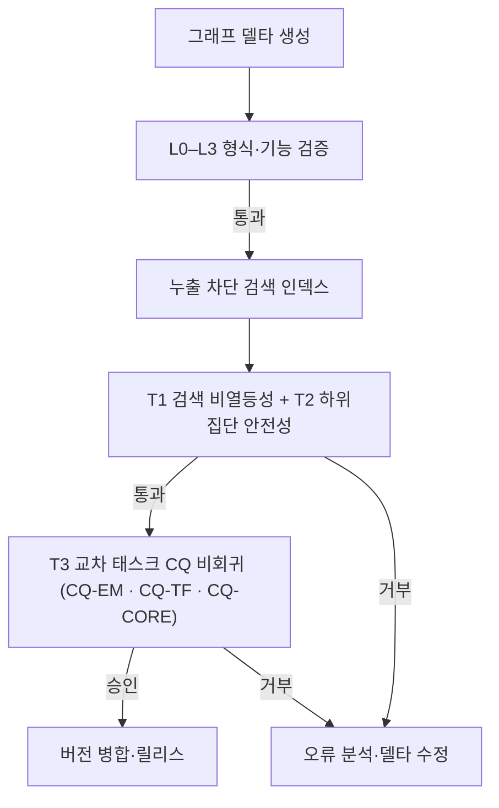

# SDKB: 태스크 확장형 반도체 도메인 온톨로지 데이터셋 — 자원 지표는 태스크 성능을 대표하지 않는다, 그러므로 진화는 한 층 아래에서 승인한다

**SDKB: A Task-Extensible Semiconductor Domain Ontology Dataset — Resource-Level Quality Does Not Represent Task Utility, and Why Ontology Evolution Must Be Approved One Layer Down**

> **원고 상태: v2.0 재구성 3단계 (2026-08-04) · 작업 언어 = 한글.**
> 3단계에서 더한 것은 **한 층 아래의 판독** 하나다 — §6.8에 전달 실험(RQ5 · 탐색적)을 신설하고,
> 그것이 바꾸는 다른 절의 진술을 맞췄다(초록 · §1.4 · §1.5 · §1.6 · §4.9.1 · §5.1 · §7.5 · §7.6 ·
> §8.5 · §9.2 · §10). **T4 발효 조건 ①(1회 완주)이 채워졌고 ②(마진 동결)는 남았으므로 T4는
> 여전히 승인식에 들어가지 않는다.** 확증 가설 2개 · 기여 2개 · H1–H5 판정 · §6.2–6.4 수치는
> **하나도 바뀌지 않았다** — 전달 실험은 기여가 아니라 **기여 ②의 경계를 검증하는 절**이다
> (규약 §0.5-3). 사전 점검은 `01.code_spec/plans/PLAN-038` §16.
>
> **원고 상태: v2.0 재구성 2단계 (2026-08-02) · 작업 언어 = 한글.**
> 2단계에서 바꾼 것은 **무엇을 앞에 놓고 말하는가** 하나다 — 제목·초록·§1·§2.6·§7.3·§10을
> **층 사이의 어긋남**을 1축으로 다시 썼고, 그 증거(자원만 교체한 두 팔)를 §8 한계에서 **§6.7
> 결과**로 옮겼으며, §4.9.1에 **T4**(하류 생성 층 비회귀)를 설계로만 신설했다.
> **H1–H5의 판정, §6.2–6.4의 수치, 확증 가설 2개, 기여 2개는 하나도 바뀌지 않았다** —
> 사전 점검과 이동 대장은 `01.code_spec/plans/PLAN-039`.

> **원고 상태: v2.0 재구성 1단계 (2026-08-01).**
> 확증 가설을 **H3(하이브리드 효과)·H5(계층 특이성)** 둘로 좁히고, H1(게이트 판별력)·H2(승인
> 안전성)·H4(계층 기여)는 **판정을 바꾸지 않은 채 지위만 강등**했다(각각 §4.9·§6.5 · §8.1 ·
> §6.4). 가설 라벨은 사전등록의 이름을 그대로 쓴다 — 개수만 줄이고 번호는 다시 매기지 않았다.
> 재구성 계획과 이동 대장은 `01.code_spec/plans/PLAN-033`, 잘라낸 절의 전문은 `paper/supplementary/`.
> **영문 Abstract는 없다** — 영문화는 실험 결과로 논리 기조가 확정된 뒤 원고 전체를 한 번에 한다.
> 저장소에서 재현된 사실은 "관측 결과", 미수행 실험은 `[실험 후 기입]`으로 구분한다.
> **§6.2–6.4는 B층 제2 확증분할 재실험 후 재작성 예정이다**(PLAN-033 §6 · 현재 시점유효 마스크
> 문제로 대기).

> **정정 대장 (2026-08-02).** 상류 결함 대장(`upstream/DEFECT-LEDGER.md`)과 CR 문서가 확인한
> **관측 사실**을 아래 여섯 곳에 반영했다. **§6의 수치·표·가설 판정은 한 글자도 바꾸지 않았다** —
> 그것은 교정 전 자원에서의 관측이자 판정 기록이므로 소급 수정 대상이 아니다(CLAUDE.md §1-2·§1-3).
> 반영한 것은 전부 **이미 실행된 코드의 출력**이며, 상류 수정의 **기대 효과는 반영하지 않았다.**
>
> | # | 위치 | 정정 내용 | 근거 |
> |---|---|---|---|
> | 1 | §3.2 · §6.6 | G1/G2는 온톨로지 "세대"가 아니라 **후보 모집단(방해문서 풀)** — 세 그래프의 T-Box가 동일 | D-12 |
> | 2 | §7.3 | H5(음성 대조군 붕괴)의 **경합 설명 둘** 추가 — 모듈 경계 어긋남 · 별칭 사전 인공물 | D-13 · D-15 |
> | 3 | §8.1 | H2는 v0.9에서 미검정이었으나 이후 **최초로 실검정되어 기각**됐다(새 사전등록) | D-19 해소 · D-23 |
> | 4 | §8.2 | 텍스트→개념 **매핑 단계의 부재** — 자유 텍스트 질의를 받을 수 없다 | D-14 |
> | 5 | §8.3 | 질의가 "이미 온톨로지에 등재된 특허"라는 **외적 타당도 제약** | D-14 |
> | 6 | §5.6 · §9.2 | 재현성의 두 구멍 — 스냅샷의 매핑 자산 누락 · 하이브리드 run 파일의 비결정성 | D-16 · D-22 |
>
> **작업 규약(`CLAUDE.md`)과의 정합 점검에서 추가로 고친 셋 (2026-08-02).** 규약과 원고가 어긋나
> 있던 곳이 아니라, 원고 자체의 오기·미표시다. **⑦ §1.6** 장 번호 오류(7·7·8·9 → 7·8·9·10) ·
> **⑧ §5.5** 전문가 판정이 **미수행**임을 절 제목과 첫 문단에 명시(설계만 실린 절이 수행한 것처럼
> 읽혔다) · **⑨ §8.2** 후보 코퍼스의 한국어 문서 수 38,246 → **39,246**(세 언어 합이 40,552와
> 맞지 않던 오기 · 실행 출력 기준).

---

## 국문 초록

반도체 현장의 지식은 공정·소자·재료·장비를 분류해 놓는 것만으로 쓸 수 있게 되지 않는다. 고장이 났을 때 그 문제를 풀 수 있는 사람을 찾아야 하고, 특허 청구항이 기존 문헌과 어디서 겹치는지 대조해야 하며, 기술이 어느 방향으로 움직이는지도 읽어야 한다. 세 가지는 같은 반도체 지식을 서로 다른 각도에서 쓰는 일이다. 본 논문은 이 셋을 **하나의 공용 어휘 체계** 위에 올린 반도체 도메인 온톨로지 데이터셋 **SDKB**(Semiconductor Domain Knowledge Base)를 제시한다. 공용 어휘의 뼈대(T-Box)는 `Process`·`SubProcess`·`Device`·`Material`·`Equipment`·`FailureMode`·`Skill`·`Organization` 이며, 그 위에서 **전문가 매칭 · 선행기술조사 · 기술예측** 세 갈래가 각자 필요한 개념을 끌어 쓴다. 세 갈래를 실제로 표현할 수 있는지는 구조 제약 언어(SHACL)와 **역량질문 31개**(competency question, CQ — 온톨로지가 답할 수 있어야 하는 질문 목록)로 확인한다. 다만 **세 갈래의 성능이 모두 같은 수준으로 검증되었다고는 주장하지 않는다.**

정량 검증은 **선행기술 검색** 한 갈래에 집중한다. 이 갈래에만 심사관이 실제로 인용한 문헌이라는 **바깥 기준**이 있기 때문이다. 확증 가설은 둘로 한정한다 — **H3**(온톨로지를 더한 검색이 강한 텍스트 검색보다 잘 찾는가)와 **H5**(그 이득이 정말 의도한 지식 계층에서 나오는가). 가설 이름은 사전등록에 쓴 것을 그대로 둔다. 거절된 특허 1,000건과 심사관 인용 2,534건은 **완전한 정답이 아니라 "심사관이 실제로 본 문헌"이라는 부분 정답**으로만 쓴다 — 인용되지 않은 문헌을 "관련 없음"으로 단정하지 않는다는 뜻이다. 평가에서는 질의 특허가 자기 인용 문헌으로 곧장 이어지는 연결을 끊고, 시점과 특허 패밀리도 갈라 놓아 **정답이 새어 들어오지 못하게** 한 뒤, BM25·특허 임베딩·텍스트 하이브리드·분류코드·도메인 온톨로지·청구항 한정요소 재순위화를 비교한다.

하나의 어휘 체계를 세 갈래가 나눠 쓰기 때문에, **한 갈래의 성적만 보고 온톨로지 변경을 승인하면 다른 갈래의 질의 경로가 조용히 망가질 수 있다.** 그래서 형식 검증 4층(L0–L3: 최신성·구조·논리·기능) 위에 세 조건을 더한 **과제 게이트**를 둔다 — **T1** 검색 성능이 떨어지지 않을 것(비열등성, non-inferiority), **T2** 특정 하위 집단만 나빠지지 않을 것, **T3** 다른 갈래의 역량질문 통과율이 뒷걸음치지 않을 것.

봉인해 두었던 평가셋을 한 번만 열어 수행한 확증 평가(198질의)에서, 온톨로지·한정요소 재순위화는 가장 강한 텍스트 검색보다 **패밀리 단위 Recall@100을 +0.0534 높였다**(95% CI [+0.0145, +0.0926], *p* = .008). 그러나 이 개선에는 경계가 셋 있다. 첫째, **미리 지정해 둔 주 시스템은 유의 수준에 이르지 못했고**(*p* = .181) 위 수치는 부차 구성에서 나온 것이다 — 결과를 본 뒤 주 시스템을 바꿔치기하지 않고 지정한 대로 보고한다. 둘째, **상위 순위의 품질(nDCG@20)은 나아지지 않았다** — 이득은 "검토 깊이 안에서 빠뜨리지 않는 것"에 있지 "가장 위에 잘 세우는 것"에는 없다. 셋째, 이득은 예상과 반대로 **질의와 정답의 단어가 많이 겹치는 쪽에 몰렸다.** 재순위화는 텍스트 검색이 이미 뽑아 온 후보만 다시 줄 세우므로, 단어가 겹치지 않아 애초에 후보에 못 올라온 문헌은 온톨로지로도 되살릴 수 없다.

경계와 별개로, 이 평가는 예상하지 못한 결과를 하나 남겼다. **검색과 무관하도록 일부러 설계해 대조군으로 삼은 전문가 매칭 전용 계층을 빼자, 검색이 오히려 뚜렷하게 나빠졌다**(+0.0316, *p* = .002; 계층 8개를 하나씩 빼 본 실험 중 다중비교 보정 후 유일하게 유의). 하나의 어휘 체계를 공유하는 세 갈래는 **통계적으로 깔끔히 분리되지 않으며**, 한 갈래를 겨냥한 변경이 다른 갈래의 질의 경로를 건드릴 수 있다는 뜻이다. 이는 대조군 설계의 실패가 아니라, **다른 갈래를 감시하는 조건(T3)이 형식 검증이나 한 갈래의 성적과 별개로 필요한 이유**다. 다만 이 하락이 공유 어휘의 성질 때문인지, 아니면 이번 릴리스의 모듈 배치와 별칭 사전 재사용이 만든 인공물인지는 **가르지 못했다**(§7.3). 게이트가 실제로 결함을 잡는지는 판정 규칙을 그대로 둔 채 **아직 판정한 적 없는 결함 45개**에 다시 물어 확인했다(T3만 잡아낸 것 12/45 · 단측 *p* = .0001 · 잘못된 경보 0/27). 다만 판정 임계값을 τ = 0.10으로 올리면 성립하지 않으며, "T3가 잡는 것이 정말 교차 갈래 결함뿐인가"는 아직 검정하지 않았다.

**그리고 이 게이트가 왜 필요한지를, 이 연구는 가장 불편한 방식으로 확인했다.** 상류에서 온톨로지를 고쳐 문서 한 건에 붙는 개념 수를 1.545개에서 **3.779개로 2.4배** 늘리고 개념 어휘도 141개에서 199개로 넓혔다. 자원 쪽 지표는 전부 좋아졌고 형식 검증 네 층(L0–L3)도 모두 통과했다. 그런데 문서 더미는 그대로 두고 **온톨로지만 갈아 끼워** 같은 파이프라인으로 다시 재자, 주 시스템의 회수는 **떨어졌다**(family Recall@100 −0.0293, 95% CI [−0.0542, −0.0053]). **성능 조건 T1이 그 변경을 거부했다**(승인 거부). 같은 자원으로 온톨로지 단독 검색은 오히려 27% 좋아졌으므로 이것은 "온톨로지 보강이 무익하다"는 뜻이 아니다. 관측된 것은 **자원 층의 지표가 검색 층의 성능을 대표하지 않는다**는 사실이며, 원인이 자원 쪽인지 점수 계산식 쪽인지는 이 실험이 가르지 못했다. 같은 어긋남은 한 층 더 아래에서도 나타난다 — 주 지표에서 유의했던 이득을 "몇 건을 검토해야 하는가"라는 실무 단위로 바꿔 읽으면 질의별로 짝지은 검토 건수 감소율의 중앙값은 **0.0%**다. 이 재측정은 별도의 사전등록 아래 수행됐고 본문의 확증 판정을 바꾸지 않는다(§6.7).

자원 자체를 감사하면 **표현할 수 있는 범위와 검색에 쓸 수 있는 준비도는 같지 않다**는 것이 드러난다 — 인용된 선행기술 문헌 중 그래프에 노드로 존재하는 비율은 95.3%지만, 도메인 의미 관계로 이어지는 비율은 54.6–70.5%에 그친다. 또 역량질문이 후보를 더 많이 찾아낸다는 것은 **후보를 만들어 내는 능력**이지 **관련도 순으로 잘 세운다는 증거**가 아니다. 본 연구는 데이터셋의 **넓은 표현 범위**와 한 갈래에 대한 **집중된 정량 검증**, 나머지 갈래에 대한 **회귀 감시**를 나눠서 결합한다. 이 셋을 관통하는 결론은 하나다 — **어느 층의 지표도 그 아래 층의 성능을 보장하지 않으므로, 온톨로지 변경의 승인 조건은 한 층 아래의 실제 태스크에서 확인되어야 한다.** 그래서 온톨로지 품질의 질문은 "그래프가 유효한가"에서 **"성능을 지키면서, 다른 갈래를 망가뜨리지 않고 자라는가"** 로 넓어진다. 같은 논리는 한 번 더 적용된다 — 검색 층의 지표가 그 아래 생성 층(찾은 문헌을 근거로 붙여 답을 만드는 단계)의 가치를 대표하는지를 **한 번 재 보았다**(§6.8 · 탐색적). 답을 만드는 쪽은 전부 고정하고 어느 검색 팔의 문서를 넣는지만 바꾼 1,188회의 판독에서, 온톨로지를 포함한 팔의 문서를 넣었을 때 모델이 댄 근거 식별자가 봉인 정답과 더 자주 일치했다(0.1454 대 0.1278). 그러나 그 팔은 인용을 더 적게 하고 환각률은 오히려 높아, **우월성으로 읽지 않는다** — 이 판독의 확증은 새 확증 분할의 몫이다. 그 자리를 메울 조건 **T4**는 여전히 설계로만 싣는다(§4.9.1).

**주제어:** 반도체 도메인 온톨로지 데이터셋, 태스크 확장형 온톨로지, 온톨로지 진화, 검증 게이트, 대리지표의 어긋남, 교차 태스크 비회귀, 선행기술 검색, 심사관 인용, 청구항 한정요소, SHACL, 누출 통제 평가

---

> **영문 Abstract는 이 원고에 없다.** 영문화는 실험 결과로 신규성·진보성의 논리 기조가
> 확정된 뒤 **원고 전체를 한 번에** 수행한다(PLAN-033 §2). 그때 이 초록을 영문으로 새로 쓴다.

---

## 약어표 (Nomenclature)

본 논문에서 사용하는 약어는 아래와 같다. 본문에서는 각 약어를 처음 사용할 때 전체 명칭과 병기하고 이후에는 약어만 사용한다.

| 약어 | 전체 명칭 |
|---|---|
| BM25 | Okapi Best Matching 25 (어휘 기반 순위 함수) |
| bpref | binary preference (불완전 qrel 강건 지표) |
| CI | confidence interval (신뢰구간; 통계 문맥) / continuous integration (지속적 통합; 공학 문맥) |
| CLEF-IP | Conference and Labs of the Evaluation Forum – Intellectual Property track |
| CPC | Cooperative Patent Classification (협력적 특허분류) |
| CQ | competency question (역량질문) |
| DOCDB | EPO Master Documentation Database (특허 패밀리 식별 기준) |
| EPO | European Patent Office (유럽특허청) |
| GT | ground truth (정답) |
| IPC | International Patent Classification (국제특허분류) |
| KG | knowledge graph (지식그래프) |
| KIPRIS | Korea Intellectual Property Rights Information Service (특허정보넷) |
| MRR | mean reciprocal rank (평균 역순위) |
| nDCG | normalized discounted cumulative gain (정규화 할인 누적 이득) |
| qrel | relevance judgment (적합성 판단; 정보검색 관행 표기) |
| RAG | retrieval-augmented generation (검색 증강 생성) |
| RBV | resource-based view (자원기반관점) |
| SDKB | Semiconductor Domain Knowledge Base (반도체 도메인 지식 베이스) |
| SHACL | Shapes Constraint Language (W3C 구조 제약 언어) |
| TDD | test-driven development (테스트 주도 개발) |
| TRL | technology readiness level (기술성숙도) |
| TTL | Turtle (RDF 텍스트 직렬화 형식) |
| USPTO | United States Patent and Trademark Office (미국 특허상표청) |
| W3C | World Wide Web Consortium |

내부 기호는 다음과 같으며, 정의 위치를 함께 표시한다.

| 기호 | 의미 (정의 위치) |
|---|---|
| T-Box / ABox | 스키마 어휘 / 인스턴스 단언 (§3.1) |
| G0 / G1 / G2 | SDKB 그래프 계보 — 코어 / 확장 / 외부 코퍼스 적용 (§3.2) |
| L0–L3 | 형식 검증 4층 — 신선도·무결성, SHACL, 논리 일관성, CQ 기능 (§4.1) |
| T-gate, T1–T3 | 3조건 과제 게이트 — 비열등성, 하위집단 안전성, 교차 태스크 CQ 비회귀 (§4.1, §4.9) |
| RQ2·RQ3, H3·H5 | 연구 질문과 확증 가설 — 사전등록 라벨 유지 (§1.4) |
| B0–B5, P0–P2 | 비교 시스템 — 기준선과 제안 시스템 (§4.6) |
| A1–A8 | 절제(ablation) 실험 조건; A8은 음성 대조군 (§5.4) |
| CQ-PA / CQ-EM / CQ-TF / CQ-CORE | 태스크별 CQ 스위트 — 선행기술조사 / 전문가 매칭 / 기술예측 / 공유 코어 (§3.1) |
| \(\epsilon\), \(\delta\) | 비열등성 허용한계(0.02), 하위집단 하락 한계(0.05) (§4.9) |

## 이 논문을 읽는 법 — 자주 나오는 말

전문용어는 처음 나올 때 뜻을 먼저 쓰고 괄호에 원어를 넣었다. 아래는 그중 자주 되풀이되는 것들을
한 번에 모아 둔 것이다.

| 논문에서 쓰는 말 | 쉽게 말하면 |
|---|---|
| 비열등성(T1) | 바꾼 뒤에도 **성능이 떨어지지 않았다**. "더 좋아졌다"가 아니다 |
| 하위집단 안전성(T2) | 전체 평균은 괜찮은데 **특정 집단만 나빠지는 일**이 없다 |
| 비회귀(T3) | 다른 갈래가 답하던 질문을 **여전히 답한다**(뒷걸음치지 않았다) |
| 역량질문(CQ) | 온톨로지가 **답할 수 있어야 하는 질문 목록**. 일종의 기능 시험 문항 |
| 절제(ablation) | 지식 계층을 **하나씩 빼 보고** 성능이 얼마나 떨어지는지 재는 실험 |
| 음성 대조군 | 빼도 **아무 영향이 없어야 하는** 계층. 영향이 나오면 설계 가정이 틀린 것이다 |
| 도달성 | 찾아야 할 문헌에 그래프를 타고 **닿을 수 있는 비율** |
| 위양성 | **잘못된 경보**. 멀쩡한 변경을 게이트가 거부한 경우 |
| 결함 주입 | 일부러 **망가뜨린 그래프**를 넣어 검사가 잡아내는지 보는 실험 |
| 델타 | 온톨로지에 가하는 **한 번의 변경분** |
| 질의 / 후보 | 찾는 쪽 특허 / 그 안에서 골라내야 하는 문헌 더미 |
| 봉인 · 사전등록 | 결과를 보기 **전에** 평가셋을 잠그고 판정 기준을 등록해 두는 것 |
| 확증 / 탐색적 | 미리 정한 기준으로 **판정한** 결과 / 판정이 아니라 **관찰만** 한 결과 |
| 생성 층 | 찾아 온 문헌을 **근거로 붙여 답을 만드는 단계**. 검색 층의 한 층 아래 |
| 전달 | 한 층에서 얻은 이득이 **그 아래 층으로 옮겨가는가**를 재는 것 |
| 인용 정확도 / 환각률 | 답변이 근거로 댄 문헌이 **정답에 있는 비율** / **넣어 준 적 없는 문헌**을 댄 비율 |

수치·지표 이름(Recall@100 · nDCG@20 · 95% CI)과 가설 라벨(H3·H5), 게이트 이름(L0–L3 · T1–T4)은
쉬운 말로 바꾸지 않았다 — 바꾸면 다른 것을 가리키게 되기 때문이다.

---

# 1. 서론

## 1.1 문제 제기

반도체 지식을 공정·소자·재료·장비로 분류해 놓는 것만으로는 현장에서 쓰기 어렵다. 쓰는 일이
세 가지인데, 각각 다른 연결을 요구하기 때문이다. 첫째, 설비에서 불량이 나면 **고장 모드–근본
원인–대응책**의 인과를 따라가 그 문제를 풀 수 있는 **역량과 사람**에 닿아야 한다. 둘째, 특허를
분석하려면 **특허–청구항–한정요소–선행기술 판단**이 이어져야 한다. 셋째, 기술기획에서는 기술
노드가 시간에 따라 어떻게 움직이는지를 **시나리오·외부요인·투자 선택지·기술성숙도**와 이어야
한다. 이 셋은 서로 다른 데이터 창고가 아니라, `Process`·`SubProcess`·`Device`·`Material`·
`Equipment`·`Organization` 을 함께 쓰는 **같은 지식의 다른 사용 관점**이다.

**SDKB**(Semiconductor Domain Knowledge Base)는 이 세 요구를 차례로 거치며 자란 반도체 도메인
온톨로지 데이터셋이다. 여기서 **태스크 확장형(task-extensible)** 이란 하나의 온톨로지가 모든 일에서
같은 성능을 낸다는 뜻이 **아니다.** 공용 어휘의 뼈대(T-Box — 개념과 관계의 정의)와 식별자를 그대로
둔 채, 일마다 필요한 클래스·관계·제약·역량질문(CQ)과 실제 인스턴스(A-Box)를 **덧붙일 수 있고, 그
덧붙임이 이미 있던 것을 망가뜨리지 않는다**는 뜻이다. 그래서 **표현할 수 있는 범위**와 **성능이
검증된 정도**는 반드시 나눠서 말해야 한다.

세 갈래 중 **선행기술 검색**은 성능을 숫자로 재기에 가장 좋다. 다만 이 일은 단순한 유사 문서 찾기가
아니다. 특허 청구항은 긴 한 문장 안에 구성요소·공정 조건·기능 관계·결과를 한꺼번에 담고, 관련
선행기술은 같은 발명을 **다른 용어·다른 분류·다른 추상화 수준**으로 적어 놓을 수 있다. 반도체에서는
같은 물리 현상이 식각·증착·세정·계측·소자 구조·패키징 중 어느 맥락이냐에 따라 다르게 불린다.
따라서 **겉으로 쓰인 단어가 겹치지 않아도 기술적으로 관련된 문헌은 찾아내야 하고**, 반대로 같은
용어를 쓰더라도 청구항의 핵심 한정요소를 채우지 못하면 강한 선행기술이 아닐 수 있다.

지금까지의 특허 검색 연구는 단어 기반 검색(BM25), 문서·청구항 임베딩, 인용 네트워크, 또는 이들을
섞은 방식에 집중해 왔다(Lupu & Hanbury, 2013; Krestel et al., 2021; Mahdabi & Crestani, 2014;
Risch et al., 2020). 성능을 직접 잰다는 장점이 있지만, **왜 두 문헌이 기술적으로 이어지는지는
설명하지 못하고** 공정·소자·재료·고장·청구항 구성요소 사이의 명시적 관계도 잘 쓰지 못한다. 반대로
온톨로지 공학은 일관성·제약 준수·CQ 같은 내부 품질을 꼼꼼히 검사하지만(Grüninger & Fox, 1995;
Kontokostas et al., 2014; W3C, 2017), **그 검사를 통과했다고 검색이 잘 된다는 보장은 없다.**

이 틈은 온톨로지를 계속 고쳐 나갈 때 더 커진다. 새 특허와 개념 링크를 넣고 SHACL·추론기·CQ가 모두
통과해도, **개념을 잘못 이어 붙였거나 계층을 지나치게 납작하게 만들면** 후보 순위가 나빠질 수 있다.
거꾸로 검색 성능이 그대로여도 구조 위반이나 **미래 정보가 새어 들어온 것**이 숨어 있을 수 있다.
즉 구조 검사와 과제 성능은 서로를 대신하는 것이 아니라 **함께 있어야 하는 두 층**이다.

SDKB는 세 단계를 거쳐 자랐다. **① 전문가 매칭 단계** — 문제·고장 모드·근본 원인·역량·전문가를
공정·장비·재료와 이어 개념의 뼈대를 잡았다. **② 선행기술조사 단계** — 거절된 특허, 심사관·출원인
인용, 특허분류(IPC/CPC/FTerm), 청구항과 한정요소, 선행기술 판단을 더해 **제도가 실제로 검토한
근거**를 붙였다. **③ 기술예측 단계** — 기술 노드·시나리오·외부요인·투자 선택지·기술성숙도와 출원일
시간축을 확장했다. 이전 버전(v0.7)이 검증한 것은 주로 세 번째 확장이다.

현재 기준 그래프에는 거절 특허와 심사관 인용 선행기술이 들어 있고, 청구항 한정요소와 거절 판단을
표현하는 어휘도 반영돼 있다. 그래서 다음 질문을 던질 수 있다. **세 갈래를 표현하는 온톨로지
데이터셋이 자라날 때, 주로 쓰는 일(선행기술 검색)의 성능을 지키거나 높이면서 나머지 갈래의 기능도
망가뜨리지 않는가?** 본 연구는 이 질문을 주 검정으로 삼는다.

**그리고 이 질문에는 앞선 질문이 하나 더 붙어 있다 — 애초에 "온톨로지가 좋아졌다"를 무엇으로
재는가.** 온톨로지를 고치는 사람은 대개 자원 쪽 숫자를 본다. 어휘가 몇 개 늘었는가, 문서 한 건에
개념이 몇 개나 붙는가, 빠진 링크를 얼마나 메웠는가. 이 숫자들이 좋아지면 검색도 좋아지리라고
기대하는 것이 자연스럽다. **이 연구가 실제로 관측한 것은 그 기대가 어긋나는 장면이다**(§6.7·§7.5).
그래서 이 논문에는 층이 셋 있다 — **자원 층**(어휘·링크·해상도) · **검색 층**(Recall@100·nDCG) ·
그 아래 **생성 층**(찾은 문헌을 근거로 붙여 답을 만드는 단계). 각 층의 지표가 다음 층의 성능을
대표하는지는 **재 보기 전에는 알 수 없고**, 이 논문이 실제로 잰 것은 앞의 두 층 사이다.

## 1.2 핵심 개념 1: 검사를 다 통과했는데 성능이 나빠지는 일

온톨로지를 고친 뒤 하는 검사는 보통 넷이다 — 최신 자료인가(L0), 구조 규칙을 지켰는가(L1),
논리적으로 모순이 없는가(L2), 꼭 답해야 할 질문에 답하는가(L3). 문제는 **이 넷을 전부 통과하고도
정작 쓰는 일에서는 성능이 떨어질 수 있다**는 것이다. 이 현상을 본 논문은
**과제 의미 회귀(task-semantic regression)** 라 부른다.

> 온톨로지나 인스턴스를 바꾼 것이 L0–L3 검사는 통과하지만, 미리 봉인해 둔 평가셋에서 검색 성능
> 또는 중요한 하위 집단의 성능을 허용치보다 떨어뜨리는 현상.

여기서 세 가지가 따라 나온다. 첫째, 온톨로지의 품질은 **그 자체의 속성만으로 잴 수 없고** 쓰는
일과의 관계로 재야 한다. 둘째, 그렇다고 검색 성능 하나가 온톨로지 품질 전부를 대신하지도 않는다.
셋째, 실무에서 중요한 성공 조건은 "더 좋아졌는가"만이 아니라 **"기존 성능을 해치지 않고 자랐는가"**
이기도 하다.

**이 현상은 이 연구에서 사고실험이 아니라 실제로 일어났다.** 상류에서 온톨로지를 고쳐 문서 한 건에
붙는 개념 수를 2.4배로 늘렸더니 — 자원 쪽 숫자는 전부 좋아지고 L0–L3도 전부 통과했는데 — 주
시스템의 검색 회수가 떨어졌고, 성능 조건이 그 변경을 거부했다(§6.7). 이 논문이 성능 게이트를
필요로 하는 이유는 여기서 나온다. 게이트는 **좋은 변경을 골라내는 장치가 아니라, 좋아 보이는
변경이 실제로도 좋은지를 한 층 아래에서 되묻는 장치**다.

## 1.3 핵심 개념 2: 한 갈래만 보는 검사로는 부족하다

여기서 두 번째 함정이 생긴다. **온톨로지가 한 가지 일에만 쓰인다면, 그 일의 성적으로 온톨로지
변경을 심사하는 것은 자기 채점에 가깝다.** 평가하는 바로 그 지표에 온톨로지를 맞추는 셈이므로,
"그럴 거면 온톨로지를 심사할 게 아니라 검색 모델을 손보면 되지 않느냐"는 반론에 약하다.

SDKB는 이 함정을 벗어난다. 하나의 어휘 체계가 전문가 매칭·선행기술조사·기술예측 **세 갈래를 동시에
떠받치고**(§3.1), 세 갈래는 `Process`·`SubProcess`·`Material`·`Equipment`·`Organization` 같은
**공용 어휘로 이어져 있기** 때문이다. 이런 구조에서는 한 갈래에 좋은 변경이 다른 갈래의 질의 경로를
조용히 망가뜨릴 수 있다. 예를 들어 검색에서 더 많이 찾으려고 비슷한 개념 둘을 하나로 합치면
(개념 병합, concept merging), 전문가 매칭에서 `Skill` 을 구별하는 힘이 떨어진다. 특허 인스턴스를
대량으로 밀어 넣으면 기술예측의 `TechnologyNode` 시계열 분포가 뒤틀린다. 이것을 **교차 태스크
회귀(cross-task regression)** 라 부르며, 소프트웨어에서 새 기능이 옛 기능을 깨뜨리는 회귀와 구조가
같다. **이런 일이 실제로 일어날 수 있기 때문에, 과제 게이트에는 "검색이 나빠지지 않았는가"(T1)
만이 아니라 "다른 갈래가 뒷걸음치지 않았는가"(T3)가 필요하다** — 이것이 본 연구의 두 번째 출발점이다.

그래서 본 연구는 **일부러 깊이를 다르게** 간다. 세 갈래를 모두 기술하되, 정량 평가는 바깥 기준이
가장 튼튼한 선행기술 검색 하나에 집중하고, 나머지 둘은 **질문 통과율로 뒷걸음을 감시**한다.

| 갈래 | 논문에서의 역할 | 증거 수준 |
|---|---|---|
| 선행기술조사 | **평가 대상** (주 정량 검증) | Recall@K·nDCG, 신뢰구간, T1·T2 |
| 전문가 매칭 | 뒷걸음 감시(T3) + 계층을 빼 보는 실험의 **대조군** | CQ 통과율 + 제거 시 영향 |
| 기술예측 | 뒷걸음 감시(T3) + 같은 자원의 재사용 사례 | CQ 통과율 + 시간 백테스트 사례 |

## 1.4 연구 질문과 가설

**확증 가설을 배정하는 연구 질문은 두 개**이고, 각 질문에 **확증 가설을 하나씩만** 둔다. 나머지
분석은 탐색적으로 강등해 방법론과 판정의 복잡도를 낮춘다. 세 번째 질문(RQ5 · 전달)은 아래에
적지만 **확증 가설을 두지 않는다** — 판독일 뿐 판정이 아니다.

> **가설 라벨은 사전등록의 이름을 그대로 쓴다.** 확증 가설은 **H3·H5** 두 개이며, 개수를 줄이면서
> 번호를 다시 매기지 않았다 — 이 이름은 사전등록 문서가 쓴 이름이고, 재번호는 사전등록 기록과의
> 추적성을 끊는다. 강등된 H1(게이트 판별력)·H2(승인 안전성)·H4(계층 기여)의 **판정은 바뀌지
> 않았고**, 싣는 자리만 바뀌었다 — 각각 §4.9·§6.5, §8, §6.4의 절제 표다.

**RQ2. 검색 유용성.** 누출을 차단한 시간·패밀리 분리 평가에서, 온톨로지 보강 하이브리드 검색은
강한 텍스트 기준선을 개선하는가?

- **H3(하이브리드 효과).** 하이브리드는 가장 강한 텍스트 전용 기준선보다 Recall@100과 nDCG@20이
  높고, 그 개선폭은 질의–정답 문헌의 어휘 중첩이 낮은 집단에서 더 크다.

**RQ3. 계층 특이성.** 검색 이득은 그것을 만든다고 상정한 계층에 특이적인가?

- **H5(특이성 — 음성 대조군).** 게이트 태스크와 무관한 전문가 매칭 전용 계층
  (`Skill`·`ExpertCase`·`Mitigation`)의 제거는 검색 성능을 유의하게 바꾸지 않는다. 이 예측이
  깨지면 **교차 태스크 의존성의 발견**으로 보고하며, 이는 교차 태스크 비회귀 조건(T3)의 필요성을
  오히려 강화한다(§7.3). 어느 쪽 결과든 해석 가능하다.

**RQ5. 전달(transfer) — 확증 가설을 배정하지 않는다.** 검색 층에서 관측된 이득은 한 층 아래
생성 층(찾은 문헌을 근거로 붙여 답을 만드는 단계)으로 옮겨가는가? 이 질문에는 **확증 가설을
두지 않았다** — 유의성 검정을 사전등록하지 않았고 이미 개봉한 분할 위에서 수행했기 때문이다.
그래서 §6.8은 확증이 아니라 **탐색적 판독**이며, 하는 일은 둘이다. 계측기를 결과 보기 전에
동결하는 것, 그리고 T4(§4.9.1)의 발효 조건 하나를 채우는 것. 확증은 새 확증 분할에서 **같은
계측기 그대로** 한다. 이 절이 새 벤치마크가 아니라 **같은 벤치마크의 두 번째 판독**인 이유는
질의·정답·분할·누출 차단이 전부 같기 때문이다.

RQ 번호도 사전등록의 것을 유지한다(RQ1은 검증 게이트였고, 그 축은 §4·§8로 강등됐다. RQ4는
계층 독립성이며 H5의 음성 대조군이 답한다). 운용 효율,
신규성·진보성 거절 유형별 신호 차이, 노드–의미 도달성과 성능의 관계, 교차언어 회수는 확증 가설에서
제외하고 **탐색적 분석**으로만 보고한다(§4.8·§5.3·§6.2f·§6.4).

## 1.5 연구 기여

본 연구의 기여는 두 가지이며, 결론의 주장 순서와 일치한다.

1. **세 태스크를 표현하는 반도체 도메인 온톨로지 데이터셋과 그 진화 장치.** 공정·소자·재료·장비·
   역량·특허를 하나의 공유 T-Box로 통합하고, T-Box와 A-Box를 SHACL 제약·CQ 응답·도달성 사다리로
   계량 보고하는 재현 가능한 SDKB 릴리스를 제공한다. 여기에 L0–L3 형식 검증 위에 3조건 과제
   게이트(T1 비열등성 · T2 하위집단 안전성 · T3 교차 태스크 비회귀)를 얹어, 온톨로지 품질을
   "그래프가 유효한가"에서 **"과제 성능을 보존하며 다른 태스크를 망가뜨리지 않고 진화하는가"** 로
   확장한다. 게이트의 판별력은 홀드아웃 결함으로 확증했고(§6.5), 확증하지 못한 것 — 특이성과
   τ 민감성 — 도 같은 절에 적는다.
   **이 기여의 무게는 설계가 아니라 그 설계가 필요하다는 실측에 있다.** 자원 지표를 2.4배 개선하고
   형식 검증 네 층을 전부 통과한 델타를 **성능 조건이 거부한 사례**(§6.7)와, 주 지표의 이득이 검토
   건수라는 실무 단위로는 거의 옮겨지지 않은 관측(§6.3a)이 그것이다. 두 관측은 같은 말을 한다 —
   **어느 층의 지표도 다음 층의 성능을 보장하지 않는다**(§7.5). 게이트가 없으면 이런 변경은
   "모든 검사를 통과한 개선"으로 릴리스된다.
2. **선행기술조사 태스크의 검색 유용성 실증 — 경계를 명시한 형태로.** 거절 특허와 심사관 인용을
   기준점으로 삼은 누출 차단 벤치마크에서 온톨로지 보강 검색이 최강 텍스트 기준선 대비 주 지표
   (family-level Recall@100)를 개선함을 계층별 기여 분해와 함께 보이고, 동시에 그 개선이
   **어디까지인지**를 같은 정밀도로 보고한다 — 사전 지정 주 순위 함수의 유의 미달, 최상위 정렬
   품질(nDCG@20)의 미개선, 저중첩 예측의 반증, 이득의 본체가 계층 심화가 아니라 개념 겹침
   하나라는 절제 결과(§7.2). 그리고 검색과 무관하도록 설계한 음성 대조군 계층을 제거하자 검색이
   유의하게 악화된 관측(H5)은 **하나의 T-Box를 공유하는 태스크가 통계적으로 분리되지 않는다**는
   직접 증거이며, 교차 태스크 조건이 형식 검증·단일 태스크 성능과 독립적으로 필요한 이유다(§7.3).
   **이 기여의 경계는 한 층 아래에서 한 번 더 확인했다** — 검색 팔만 바꾸고 답을 만드는 쪽을
   전부 고정한 전달 실험(§6.8)이 그것이다. 이것을 **세 번째 기여로 올리지 않는다.** 본 연구는
   RAG 방법을 제안하지 않으며, 그 절이 하는 일은 ②의 이득이 어디까지 옮겨가는지를 재는 것뿐이다.

전문가 매칭의 방법론과 성능 평가는 본 논문의 범위 밖이며(§7.4), 기술예측과 소부장 코퍼스는 동일
T-Box의 재사용 가능성을 보이는 2차 증거로만 배치한다.

## 1.6 논문의 구성

2장은 특허 검색, 온톨로지 품질과 진화 검증, 지식그래프 하이브리드를 검토한다. 3장은 SDKB의 공유
코어와 세 태스크 뷰, 그래프 계보와 검색 근거 구조를 기술한다. 4장은 누출 방지 벤치마크와 3조건
게이트를 제시하고, 네 번째 조건 T4는 승인식에 넣지 않은 **설계로만** 싣는다(§4.9.1). 5장은 실험
설계와 통계 분석 계획을 제시한다. 6장은 자원 감사에서 확인된 표현
범위를 먼저 보고한 뒤, 확증 분할을 1회 개봉해 수행한 검색 성능·가설 판정·하위집단·절제 결과와
게이트 판별력의 홀드아웃 확증을 제시하고, 마지막으로 **자원만 갈아 끼운 재측정에서 게이트가 실제로
승인을 거부한 기록**을 별도 사전등록 아래의 결과로 구분해 싣는다(§6.7). 6장 마지막 절은 한 층 더
내려가, 검색 층의 이득이 생성 층으로 옮겨가는지를 잰 **탐색적 전달 판독**이다(§6.8). 7장은 결과의 해석과 **층마다 지표가 어긋난 세 관측**,
그리고 사전 동결한 결론 규칙을, 8장은
한계와 타당성 위협을, 9장과 10장은 데이터·코드 가용성과 결론을 제시한다.

---
# 2. 이론적 배경과 관련연구

## 2.1 선행기술 검색의 평가 단위

특허 검색은 일반 웹 검색과 다르다. 문서가 길고, 법률 문구가 반복되고, 여러 언어가 섞이고, 기술 용어가 시간에 따라 바뀐다. 목적도 다르다 — 선행기술 검색은 평균적으로 비슷한 문서를 찾는 일이 아니라, 특정 청구항의 신규성·진보성 판단에 걸릴 수 있는 소수 문헌을 **놓치지 않고 건지는** 일이다. 그래서 1차 지표는 상위 몇 건의 정확도가 아니라 충분한 깊이까지의 회수율(Recall@K)이 된다(Lupu & Hanbury, 2013; Shalaby & Zadrozny, 2019).

벤치마크의 계보는 심사관 인용을 정답으로 쓰는 쪽으로 굳어졌다. CLEF-IP(2009–2013)는 EPO(European Patent Office, 유럽특허청) 컬렉션으로 선행기술 검색을 평가했고, 2012–2013 구절 검색 태스크는 심사관 보고서의 X(신규성 파괴)·Y(진보성 파괴) 인용을 강한 관련으로 다뤘다. PatentMatch(Risch et al., 2020)는 X/Y/A 등급이 붙은 청구항–선행문헌 구절 쌍으로 청구항 수준 평가의 비교 대상을 제공한다.

검색 방법은 세 갈래로 발전했다 — 어휘 증거를 필드별로 결합하는 BM25 계열, 특허에 맞춰 학습한 의미 표현(PatentSBERTa·PaECTER 등; Bekamiri et al., 2024; Ghosh et al., 2024), 인용망과 문서 구조로 후보를 넓히거나 다시 세우는 방법(Mahdabi & Crestani, 2014)이다. 최근 조사는 강한 시스템일수록 하나의 표현에 기대지 않고 어휘·의미·분류·인용·서지를 함께 쓴다고 보고한다(Krestel et al., 2021; Shomee et al., 2025).

**언어 축은 이 세 갈래와 겹치지 않는다.** 선행기술은 어느 언어로 공개됐든 유효하므로, 완전한 선행기술 검색은 본래 교차언어적이다(Piroi & Hanbury, 2019). 지금까지 쓰인 통로는 사실상 둘 — 기계번역(Magdy & Jones, 2014; Lee & Choi, 2023)과 다국어 밀집 표현(Zhang et al., 2023)이다. **명시적 온톨로지의 언어중립 식별자**를 제3의 통로로 놓고 그 기여를 정답 언어별로 나눠 잰 평가는 확인되지 않는다. 본 연구의 벤치마크는 질의가 전량 한국어, 후보가 다국어이고 번역 계층이 없어 이 공백을 관측할 조건에 해당한다. 다만 이 축은 사전등록한 확증 가설이 아니므로 **탐색적 진단으로만** 보고한다(§6.2f).

"검색 단위"는 여전히 쟁점이다. 문서 단위 검색은 규모를 키우기 쉽지만, 심사 판단이 걸리는 곳은 청구항과 그 한정요소다. 본 연구는 거절 특허 전량에 대해서는 문헌 단위 평가를 주 분석으로 두고, `PriorArtJudgment–aboutClaim–overPriorArt` 연결이 명시된 부분집합에서만 청구항 단위 분석을 보조로 한다. 풍부한 부분집합의 성질을 전체의 성질로 넘겨 짚지 않기 위해서다.

## 2.2 심사관 인용은 정답이 아니라 관측된 양성이다

특허 검색 벤치마크는 질의 특허가 인용한 문헌을 관련 문헌으로 쓰는 경우가 많다. CLEF-IP 계열은 질의에서 인용 정보를 지운 뒤 그 인용을 적합성 판단으로 되쓴다(Mahdabi & Crestani, 2014). 이 방식은 대규모 평가를 가능하게 하지만, **인용되지 않은 문헌을 관련 없음으로 확정하지는 못한다.** 심사관 인용과 출원인 인용은 생성 과정도 의미도 다르다. 미국 특허 실증 연구는 심사관 인용이 전체 인용의 상당 부분을 차지함을 보였고(Alcácer & Gittelman, 2006), 심사관의 검색 역시 시간·분류·관할에 제약되므로 USPTO(United States Patent and Trademark Office, 미국 특허상표청) 지침은 텍스트 검색만으로 부족할 수 있다고 안내한다(USPTO, 2023).

정보검색 평가에서 판정이 불완전하면(불완전 적합성 판정, incomplete relevance judgments; 판정 집합은 관행에 따라 qrel로 표기) 판정 풀에 기여하지 않은 시스템이 체계적으로 불리해진다. 그래서 미판정에 덜 흔들리는 bpref(binary preference) 같은 지표가 권고된다(Buckley & Voorhees, 2004; Büttcher et al., 2007). 본 연구는 심사관 인용을 이렇게 쓴다.

- 인용된 문헌은 제도적 검토에서 **관측된 양성 신호**다.
- 인용되지 않은 문헌은 음성이 아니라 **미관측(unknown)**이다.
- Recall@K는 "알려진 양성을 얼마나 건졌는가"이지 법적 관련성 전량의 측정이 아니다.
- 거절근거가 섞여 있을 때는 선행기술 적합성과 직접 관련된 유형을 주 분석과 보조 분석으로 나눈다.

이 관점은 SDKB의 2,534개 인용을 "ground truth"라 단정하는 것보다 엄밀하다. 이하에서는 이를 **심사관 검증 약한 정답(examiner-validated weak ground truth)** 또는 **양성 전용 qrel**이라 부른다.

## 2.3 온톨로지 품질, 진화 검증과 테스트 주도 접근

온톨로지 품질 논의는 명료성·일관성·확장성 같은 설계 원칙에서 출발했다(Gruber, 1993). CQ(competency question, 온톨로지가 답해야 할 질문)는 요구사항과 검증 항목을 잇는 장치이고(Grüninger & Fox, 1995), 테스트 주도 온톨로지 개발은 그 전제를 자동 검증 가능한 요구사항으로 형식화했다(Potoniec et al., 2020). 구조 제약 쪽에서는 RDF 품질 점검이 발전했고(Kontokostas et al., 2014) SHACL이 이를 표준 shape로 표현한다(W3C, 2017). 링크드데이터 품질의 기준점인 Zaveri et al.(2016)은 품질을 18개 차원·69개 지표로 나눴으나 대체로 **사후 기술(descriptive) 평가 틀**이다. 온톨로지 변화 관리 연구는 변경의 분류와 일관성 보존을 다뤄왔고(Flouris et al., 2008), 다운스트림 쪽에서 KGrEaT(Heist et al., 2023)는 KG 보강이 다운스트림 성능 향상을 전제로 정당화되면서도 그것을 거의 재지 않는다는 문제를 제기했다. 그러나 이들 역시 **사후 비교**에 머문다.

SDKB의 L0–L3는 이 전통을 병합 게이트로 구현한 것이고, 본 연구는 그 위에 T-gate를 얹는다. L0는 신선도·무결성, L1은 SHACL 구조 제약, L2는 논리 일관성, L3는 주 태스크(pa) CQ의 기능을 본다. 그 위에 T1(검색 성능이 떨어지지 않았는가) · T2(특정 집단만 나빠지지 않았는가) · T3(다른 갈래의 CQ가 뒷걸음치지 않았는가)를 더한다. 각 층이 묻는 것과 어긋났을 때의 처리는 §4.9의 표에 있다.

**L3와 T3가 보는 곳은 서로 겹치지 않는다** — L3는 주 태스크(pa 5개), T3는 다른 갈래와 공유 코어(em·tf·core 23개)를 보며, 합집합이 CQ 28개 전량이다. 승인식이 곱이라 어느 층에 속하든 하나만 떨어져도 거부이므로, 이 분리는 게이트의 강도가 아니라 **귀속**을 정한다. 이 정의는 2026-07-28에 개정됐다 — 구 정의에서는 L3가 전 스위트를 세어 `L3 ⊇ T3`가 되는 바람에 "T3만이 검출한다"는 형태의 가설을 원리적으로 검정할 수 없었다(경위는 supplementary [S2](supplementary/S2-fault-injection-v09.md)).

**연구 공백:** 기존 온톨로지·KG 품질 연구는 사후 비교에 머물며, 도메인 온톨로지의 지속적 보강을 **릴리스 전 사전 승인 게이트**에 연결한 설계는 제한적이다. 특히 여러 태스크를 함께 지탱하는 온톨로지에서, 한 태스크만 보는 게이트가 부르는 과적합을 교차 태스크 비회귀 조건으로 통제한 사례는 확인되지 않는다.

## 2.3.1 자원 쪽 숫자가 좋아지면 태스크도 좋아지는가 — 대리지표 문제

앞 절의 검사들은 모두 **자원 그 자체**를 본다. 구조가 맞는가, 논리가 모순되지 않는가, 어휘가 얼마나 넓은가, 링크가 얼마나 채워졌는가. 이런 숫자를 개선하는 일은 그 자체가 목적이 아니라 **쓰는 일이 잘되게 하려는 수단**이다. 그러므로 자원 쪽 숫자는 태스크 성능의 **대리지표(proxy)** 이고, 대리지표에는 늘 같은 질문이 붙는다 — **정말로 대신할 수 있는가.**

이 질문을 정면으로 다룬 전통이 온톨로지 평가 안에 이미 있다. 온톨로지를 응용에 꽂아 넣고 그 응용의 출력으로 평가하는 **과제 기반 평가(task-based · application-based evaluation)** 가 그것이며(Porzel & Malaka, 2004), 평가 방법 분류에서도 금표준 기반·코퍼스 기반·기준 기반과 나란히 하나의 갈래로 자리 잡았다(Brank et al., 2005). 다만 이 전통에서 과제 성능은 **여러 온톨로지를 견주어 고르는 잣대**로 쓰였지, **하나의 온톨로지가 자라날 때 그 변경을 받아들일지 말지 정하는 조건**으로 쓰이지는 않았다.

대리지표가 실제로 어긋난다는 증거는 인접 분야에서 반복해 보고됐다. 단어 표현 연구에서는 자원 자체의 품질을 재는 내재적 평가(intrinsic)가 **다운스트림 성능을 잘 예측하지 못한다**는 것이 여러 벤치마크와 과제에 걸쳐 관측됐고(Chiu et al., 2016; Faruqui et al., 2016), 지표를 최적화 대상으로 삼는 순간 그 지표가 재려던 것을 대표하지 못하게 되는 일반적 기제도 정리돼 있다(Thomas & Uminsky, 2020). 지식그래프 쪽에서는 KGrEaT가 같은 지적을 명시적으로 했다 — **KG를 보강하는 연구는 다운스트림 성능이 좋아진다는 전제로 정당화되면서 정작 그것을 거의 재지 않는다**(Heist et al., 2023). 한 층 더 아래에서도 같은 질문이 열려 있다. 검색 지표가 생성 답변의 품질을 예측하는지에 대해서는 **검색과 생성의 목표가 정렬될 때는 예측하지만 파이프라인이 복잡해지면 그 연결이 끊어진다**는 보고가 있다(Samuel et al., 2026). 본 연구는 이 층을 한 번 읽어 보되(§6.8) **검색 증강 생성(RAG, retrieval-augmented generation) 방법을 제안하지도 비교하지도 않는다** — 답을 만드는 쪽을 전부 고정하고 검색 팔만 바꾸므로, 이 설계로 말할 수 있는 것은 방법 간 우열이 아니라 **한 층 위의 이득이 아래로 옮겨가는가** 하나다(§8.5).

공학 정보학 분야의 온톨로지 연구에서 이 축은 특히 얇다. 이 분야의 검증은 대체로 **구조와 규칙의 준수**를 본다 — 모델이 스키마를 지키는가, 요구사항 규칙을 만족하는가(Solihin et al., 2015; Pauwels et al., 2024) — 이고, 온톨로지 자체는 응용에 적용해 **동작을 시연**하는 방식으로 정당화되는 경우가 많다. 시연은 "쓸 수 있다"를 보이지만 **"바꿔도 되는가"에는 답하지 않는다.**

**본 연구가 이 흐름에 보태는 것은 상관관계가 아니라 통제된 한 사례와 그에 대한 결정이다.** 문서집합·검색 설정·가중치·분할·평가셋을 전부 고정하고 **온톨로지만 갈아 끼운** 조건에서, 자원 쪽 지표를 2.4배 개선한 변경이 주 시스템의 검색 회수를 유의하게 떨어뜨렸고, 그 변경은 형식 검증 네 층을 모두 통과했으나 **성능 조건에 의해 거부됐다**(§6.7). 즉 이 논문은 "대리지표가 어긋날 수 있다"는 명제를 한 번 더 확인하는 데서 멈추지 않고, 어긋났을 때 **릴리스를 어떻게 막을 것인가**까지를 함께 제시한다.

## 2.4 태스크 확장형 도메인 온톨로지 데이터셋

도메인 온톨로지 데이터셋은 용어 목록이나 하나의 응용모델과 다르다. 여러 원천을 안정된 식별자와 명시적 의미관계로 묶는 공유 T-Box가 있어야 하고, T-Box의 표현 가능성과 A-Box의 실제 완전도를 나눠 보고해야 하며, 스키마·인스턴스·출처·라이선스·검증 산출물과 재구축 절차를 함께 제공해야 한다(Wilkinson et al., 2016; Hogan et al., 2021).

여기서 태스크 확장성은 "다목적 성능"의 동의어가 아니다. 하나의 공유 반도체 T-Box \(T_{\mathrm{core}}\) 위에 태스크 뷰 \(V_t=(C_t,R_t,Q_t)\) — 그 태스크가 요구하는 클래스·관계·CQ — 를 얹을 수 있고, 서로 다른 뷰는 `Process`·`Material` 처럼 어휘 일부를 공유한다. 그래서 두 수준을 구분한다.

- **표현 범위(breadth):** T-Box·SHACL·CQ가 세 태스크의 질문을 표현하고 실행할 수 있는가.
- **과제 검증 깊이(depth):** 실제 정답과 후보 모집단에서 특정 태스크의 성능이 유지되거나 나아지는가.

SDKB는 세 태스크의 표현 범위를 제시하고, 이 논문은 그중 선행기술 검색의 검증 깊이만 넓히며, 나머지 둘은 T3의 회귀 감시로 잇는다. 전문가 매칭과 기술예측을 검색 성능 가설에 섞지 않음으로써 "T-Box가 표현한다"와 "태스크 성능이 검증됐다"를 갈라 둔다. 공유 어휘가 실재하는 만큼 감시 없는 확장은 교차 태스크 회귀를 방치하는 일이므로, T3는 표현 범위 주장을 지키는 최소 안전조건이다.

## 2.5 특허 지식그래프와 하이브리드 검색

특허 검색에서 그래프는 인용·발명자·분류코드·기술 개념을 통해 어휘 검색의 사각지대를 메울 수 있다. 질의 중심 인용망 마이닝은 인용 경로를 넓혀 회수를 올렸고(Mahdabi & Crestani, 2014), 텍스트와 인용·발명자를 결합한 지식그래프 임베딩은 구조 신호의 유용성을 보였다(Siddharth et al., 2022). IPRally의 Graph Transformer는 발명을 특징–관계 그래프로 표현한 밀집 검색이 텍스트 임베딩을 앞선다고 보고한다(Daniell et al., 2025).

그러나 이 연구들에서 그래프는 대개 **성능을 위한 입력 표현**이다. 그래프 자체가 계속 바뀔 때 어떤 변경을 허용할지, 구조적으로는 멀쩡한데 검색을 해치는 변경을 어떻게 막을지는 충분히 다뤄지지 않았다. 반대로 온톨로지 진화 연구는 변경 전후의 일관성을 다루지만, 특허 검색 성능을 병합 게이트로 쓰지는 않는다. 본 연구는 "KG를 쓰면 검색이 좋아진다"를 다시 주장하지 않는다. 기여를 두는 곳은 **"검색 성능으로 KG의 진화를 통제하되, 그 통제가 다른 태스크를 훼손하지 않도록 감시한다"**는 방향이며, 공백은 요소의 신규성이 아니라 다음 결합에 있다.

> **다층 형식 검증 + 심사관 정박 검색 평가 + 누출 방지 시간·패밀리 분할 + 교차 태스크 표적 결함 주입 + 음성 대조군 절제 + 병합 전 3조건 과제 회귀 의사결정**

## 2.6 관련연구 대비 연구 위치

| 연구 흐름 | 남는 공백 | 본 연구의 확장 |
|---|---|---|
| 특허 텍스트 검색 | 명시적 도메인 의미와 그래프 진화 검증이 없다 | 반도체 온톨로지 계층을 후보·재순위화에 결합 |
| 인용·KG 검색 | 질의 인용 누출과 변경 통제 문제 | 질의 간선 마스킹, 시간·패밀리 분리 |
| 교차언어 특허검색 | 통로가 번역·다국어 임베딩에 한정 | 언어중립 개념 IRI를 제3 통로로 두고 정답 언어별 회수를 분해(탐색적 · §6.2f) |
| 온톨로지 검증 | 순위 품질·교차 태스크 회귀를 보장하지 않는다 | 3조건 T-gate와 비열등 병합 규칙 |
| KG 다운스트림 평가 | 사후 비교에 머물고 승인 게이트가 아니다 | 릴리스 전 사전 승인 게이트로 전환 |
| 과제 기반 온톨로지 평가 (Porzel & Malaka, 2004; Brank et al., 2005) | 여러 온톨로지를 **고르는 잣대**로 쓰였고, 한 온톨로지의 **변경을 승인하는 조건**으로는 쓰이지 않았다 | 같은 과제 성능을 병합 전 승인식의 항으로 사용 |
| 자원 품질 지표를 유용성의 **대리지표**로 쓰는 관행 (커버리지·링크 완전성·개념 밀도) | 어긋남이 상관 분석 수준에서 보고될 뿐(Chiu et al., 2016; Heist et al., 2023), **통제된 조건의 사례와 그에 대한 결정**은 드물다 | 문서집합·설정 고정·자원만 교체한 두 팔에서 자원 지표 2.4배 개선이 검색 하락을 낳은 실측과 그 거부 판정(§6.7·§7.5) |
| 도메인 온톨로지 데이터셋 | 다중 태스크 표현과 단일 태스크 성능을 혼동 | 세 태스크 뷰·비대칭 검증·T3 감시를 명시 |

"최초"를 주장하기보다 이 결합과 실험설계의 차별성에 기여를 둔다.

---
# 3. SDKB 반도체 도메인 온톨로지 데이터셋과 근거 구조

## 3.1 공유 T-Box와 세 태스크 뷰

SDKB의 T-Box는 선행기술 검색을 위해 만든 단일목적 스키마가 아니다. 실제 TTL(Turtle)에는 반도체
공정·소자·재료·장비·고장·역량·특허·기업·기술전략 어휘가 함께 존재하며, 세 태스크가 이를 서로
다른 경로로 사용한다.

\[
T_{\mathrm{SDKB}}
=T_{\mathrm{core}}\cup V_{\mathrm{match}}\cup V_{\mathrm{priorart}}\cup V_{\mathrm{foresight}}
\]

각 \(V_t=(C_t,R_t,Q_t)\)는 태스크별 클래스·관계·CQ의 논리적 뷰이며, 배타적 모듈이 아니라
`Process`·`SubProcess`·`Material`·`Equipment`·`Organization` 같은 공유 개념을 중첩 사용한다.

| 뷰 | 주요 클래스 | 대표 CQ | ABox 근거 | 본 논문의 지위 |
|---|---|---|---|---|
| 전문가 매칭 | `Problem`·`RootCause`·`FailureMode`·`Mitigation`·`Skill`·`Expert`·`ExpertCase` | 11·12·15–18·20·28 | 비식별·생성 인스턴스 | 표현 타당성 + **음성 대조군**(§5.4) · 성능 미평가 |
| 선행기술조사 | `Patent`·`Claim`·`ClaimFeature`·`PriorArtJudgment`·`Rejection`·`ClassificationSymbol` | 09·10·22·27 (+29–31 측정) | 거절특허 1,000 · 심사관 인용 2,534 · claim sidecar | **주 정량 검증** (Recall@K·nDCG·게이트) |
| 기술예측 | `TechnologyNode`·`Scenario`·`STEEPVEFactor`·`RealOption`·`TRL` | 01–08·23–26 | G1·G2 시계열 | 2차 재사용 증거 (§7.4) |

나머지 CQ13·14·19·21은 공급망·규제처럼 둘 이상의 뷰를 잇는 성격이어서 **공유 코어(CQ-CORE)** 로
귀속한다. 세 뷰 가운데 선행기술조사만 제도적으로 기준점으로 삼은 약한 qrel을 가지므로 정량 검증이
가능하며, 이 비대칭은 결함이 아니라 **주장 범위를 통제하는 설계**다 — 세 태스크를 덮는 것은
T-Box와 CQ의 관측 사실이고, **세 태스크의 성능이 모두 검증되었다는 주장은 하지 않는다.**
`NoveltyScore`는 정답 유래 파생 지표이므로 검색 피처에서 배제한다(정답 신호 차단).

**공유 어휘가 교차 태스크 의존의 통로다.** `Process`/`SubProcess`는 전문가 매칭과 기술예측이,
`Material`·`Equipment`·`Organization`은 전문가 매칭과 선행기술조사가 공유하고,
`ClassificationSymbol`(IPC/CPC)은 선행기술조사와 기술예측의 공정 매핑을 잇는다. 즉 세 태스크는
독립적 서브그래프가 아니라 **공유 코어 위의 세 관점**이며, 이 결합이 §1.3의 교차 태스크 회귀를
실재하게 만든다 — 그리고 §7.3의 음성 대조군 결과가 그 결합을 실측으로 확인한다.

T-Box에 클래스와 관계가 있다는 것이 모든 뷰의 인스턴스가 같은 완전도로 채워졌다는 뜻은 아니다.
클래스·object property·datatype property의 고유 개수는 **고정(pin)한 릴리스 커밋**에서 자동
산출하고, ABox는
G0·G1·G2와 claim-feature sidecar별로 분리해 provenance와 함께 보고한다.

**선행기술 CQ의 해상도는 남은 제약이다.** 정량 평가 대상인 선행기술 CQ가 가장 적어(4개) 청구항
수준으로 분해할 필요가 있었고, CQ29–31(청구항 수준 거절 판단·독립항 한정요소·종속항 계층)을
신설해 8개로 늘렸다. 다만 이 셋은 G0가 아니라 **사이드카**를 조회하므로 게이트 판정 분모가 아니라
**측정**으로 운용한다(§8.4).

## 3.2 그래프 계보

SDKB는 단일 파일이 아니라 목적과 코퍼스가 다른 버전 계보다.

| 자원 | 트리플 수 | 주요 내용 | 본 연구의 역할 |
|---|---:|---|---|
| G0 | 105,588 | 기준 온톨로지, 거절 특허 1,000건, CitedPatent 3,034개, 심사관 인용, 청구항·거절판단 TBox | 벤치마크 앵커와 기준 그래프 <!-- sig-history --> |
| G1 | 924,814 | 종합 반도체 기업 특허 24,179건, claimText 371,267건 | **후보 모집단(방해문서 풀)** — 온톨로지 세대가 아니다 |
| G2 | 490,529 | KSIA 188개사 특허 12,339건, claimText 161,184건 | **후보 모집단(방해문서 풀)** + 외부 코퍼스 재사용 사례 |
| Claim-feature sidecar | 11,605,931 | Claim 586,567개, ClaimFeature 1,289,512개, dependsOnClaim 483,394개, PriorArtJudgment 635개 | 한정요소·판단 부분집합 분석 |

이 표의 수치는 **본 논문의 모든 측정이 이뤄진 자원 세대**(상류 스냅샷 `d578bf3`)의 값이다. 이후 상류 교정으로 G0는 105,713 트리플(상류 `2839afb`)을 거쳐 115,095 트리플(상류 `39855bb`)로 다시 조립됐으나, 그 세대 위의 재측정은 별도 사전등록 아래 수행하며 본 논문의 판정에는 반영하지 않는다(§8.1). <!-- sig-history -->

> **정정 — G1·G2는 "세대"가 아니다(2026-08-02 · 관측 사실).** 앞선 판은 이 표에서 G1을 "변화
> 후보", G2를 "전이 분석"이라 불러 세 자원을 온톨로지의 **버전 계보**처럼 읽히게 했다. 그러나 세
> 그래프의 T-Box를 직접 비교한 결과는 **완전히 동일**하다 — `owl:Class` 103 · `owl:ObjectProperty`
> 97 · `owl:DatatypeProperty` 81이 셋 다 같고, **G1−G0 · G2−G0의 술어 델타는 추가 0 · 제거 0**이다.
> 병합 코드도 같은 사실을 전제한다(`ontology/merge.py:29`). 즉 G1·G2가 G0에 더하는 것은 **특허
> A-Box 문서뿐**이며, 셋은 스키마가 진화한 세 세대가 아니라 **같은 T-Box 위에 문서를 얹은 세 크기의
> 코퍼스**다. 본 연구에서 이들이 하는 일은 검색 후보를 늘려 건초더미를 만드는 것 — 즉 **후보
> 모집단(방해문서 풀)** 이다. 실제로 심사관 인용 정답 2,211건은 **전부 G0 안에 있고 G1·G2에만
> 존재하는 정답은 0건**이므로, 이 둘을 빼면 후보 코퍼스가 40,552건에서 4,034건으로 줄어 정답
> 비율이 55%가 되고 벤치마크가 성립하지 않는다. 데이터는 그대로 두고 **역할 이름만** 고친다.
>
> 이 정정은 두 곳을 함께 구속한다. **①** 게이트의 대상 그래프는 G0(+교정 스냅샷)로 좁히는 것이
> 정합적이다 — 문서만 늘어난 자원을 "세대"로 게이트에 거는 절차는 선행기술조사 단일 태스크에서
> 불필요하다. **②** §6.6에서 보는 교차 태스크 CQ 통과율의 변동은 **온톨로지가 나아진 결과가 아니라
> A-Box가 채워진 결과**로 읽어야 한다. 그리고 이 사실이 §8.1이 기술하는 H2 미검정의 진짜 이유다 —
> 자격 있는 변경이 우연히 없었던 것이 아니라, **T-Box가 한 번도 바뀐 적이 없어 존재할 수 없었다.**

이 표에서 가장 중요한 구분은 이것이다. **G0에는 청구항–한정요소–거절판단을 표현하는 T-Box가 들어 있지만, 대규모 ClaimFeature A-Box 전체가 G0 안에 있다는 뜻은 아니다.** 한정요소와 판단 연결을 쓰는 실험은 사이드카와 어디까지 조인했는지, 어느 버전인지, 어떤 규칙으로 만들었는지를 밝혀야 한다. 그래서 본 연구는 거절 특허 전량을 쓰는 **특허 단위 실험**과, 판단 연결이 명시된 부분집합만 쓰는 **청구항 단위 실험**을 나눠 둔다.

모든 트리플에는 **어디서 왔는지를 적은 서명**이 붙어 있고(105,588 세대 검증), 서명이 어긋나지 않는지 보는 검사(`check_signatures.py`)가 CI(continuous integration, 매 변경마다 자동으로 도는 검사) 파이프라인에 배선돼 있다(supplementary [S1](supplementary/S1-appendices-v09.md)). 큐레이션 원천과 라이선스는 §9와 출처 매니페스트에 적는다. 특허 데이터는 KIPRIS(Korea Intellectual Property Rights Information Service, 특허정보넷) 학술정보 활용 자격으로 모으며, 공개 배포는 메타데이터만 내보내는 경로를 따른다(§3.7). <!-- sig-history -->

## 3.3 거절 특허와 선행기술 관계

G0의 거절 특허 축은 다음 관계를 중심으로 구성된다.

- `hasPriorArtExaminer`: 심사관이 인용한 선행기술 문헌 — **누출 통제 시 검색 그래프에서 제거되는 관계**
- `rejectedFor`: 신규성, 진보성 등 거절근거
- `hasClaim` / `dependsOnClaim`: 특허–청구항, 종속항–선행 청구항
- `hasFeature` / `featureConcept`: 청구항–한정요소, 한정요소–도메인 개념
- `hasJudgment` / `aboutClaim` / `overPriorArt` / `onGround` / `overlappingFeature`: 심사관 판단과 그 대상·근거·중첩 한정요소
- `hasPriorArtApplicant`: 출원인 인용 — 심사관 인용과 분리 보존해 출처 혼합 편향(§2.2)을 회피

이 모델은 "특허 A가 특허 B를 인용한다"를 넘어 **"어느 청구항의 어떤 한정요소가 어떤 거절근거 아래 어느 선행기술과 얽히는가"**까지 표현한다. 다만 **표현할 수 있다는 것과 실제로 채워져 있다는 것은 다르다.** 본 연구는 분석마다 쓸 수 있는 관계의 수와 빠진 비율을 함께 적는다.

## 3.4 약한 정답의 다중 해상도 도달성

정답 자원이 그래프에 **얼마나 닿아 있는지**는 보는 해상도에 따라 크게 달라진다.

| 해상도 | 정의 | 도달성 |
|---|---|---:|
| 노드 도달성 | `hasPriorArtExaminer`의 고유 대상이 그래프 노드로 존재 | 2,211/2,321 = 95.3% |
| Process∪Device 의미 도달성 | 인용문헌이 공정 또는 소자 개념으로 연결 | 54.6% |
| +Material 의미 도달성 | 위 관계에 재료 개념 추가 | 63.4% |
| +전체 의미 링크 | 역량·고장·장비 등 도메인 의미 관계 추가 | 70.5% |
| +CPC/IPC 분류 도달성 | 의미 링크에 분류코드 연결 추가 | 95.3% |
| ClaimFeature 도달성 | 판단 연결이 있는 표본에서 선행기술이 한정요소 수준으로 연결 | 402/584 = 68.8% |

심사관 인용은 전부 2,534건이고 그중 30건이 비특허문헌이다. 2,321은 `hasPriorArtExaminer`가 가리키는 **고유 특허**의 수다. **2,534 · 2,321 · 2,211 · 584는 서로 다른 분모이므로 하나의 "정답 수"로 섞어 쓰지 않는다.**

이 차이 자체가 측정 문제다. 노드와 분류코드 수준의 높은 값만 보고하면 **의미 검색 준비도를 부풀리게** 된다. 반대로 ClaimFeature 68.8%를 질의 1,000건 전체의 성질처럼 다루면 **풍부한 부분집합을 전체로 넘겨 짚는** 것이 된다. 그래서 본 연구는 하나의 숫자 대신 **도달성 사다리(reachability ladder, 해상도별로 닿는 정도를 층층이 적은 표)**를 자원 보고의 기본 단위로 쓴다.

## 3.5 qrel 등급

관측된 증거가 얼마나 세밀한지에 따라 적합성 등급을 나눈다.

| 등급 | 관측 증거 | 사용 |
|---:|---|---|
| 2 | `PriorArtJudgment`가 특정 청구항과 특정 선행문헌을 연결하고 신규성/진보성 근거가 식별됨 | graded nDCG, 청구항 수준 분석 |
| 1 | 특허 수준 `hasPriorArtExaminer` 관계만 확인됨 | Recall, Success, MRR |
| 미관측 | 심사관 인용 관계가 없음 | 음성으로 확정하지 않음 |

**등급 2가 등급 1보다 법적으로 더 관련이 깊다는 뜻은 아니다.** 등급은 이 데이터에서 관측된 근거가 얼마나 세밀한가를 나타낼 뿐이다. 등급별 가중치는 개발셋에서만 정하고 테스트 결과에 맞춰 바꾸지 않는다.

## 3.6 비특허문헌과 패밀리

비특허문헌 30건은 특허만 후보로 삼는 주 평가의 분모에서 빼고 따로 보고한다. 같은 발명이 여러 나라에 출원되면 문헌이 여러 건으로 늘어나므로, 후보와 qrel은 DOCDB(EPO Master Documentation Database) family_id로 **한 덩어리로 묶어** 센다. 한 패밀리에서 여러 공개번호가 걸리면 문헌 단위와 패밀리 단위 Recall을 모두 적되 **주 결론은 패밀리 단위**에 둔다. family_id가 없는 문헌에는 출원번호·우선권으로 만든 대체 규칙을 쓰고 그 비율을 보고한다.

## 3.7 릴리스 분리

정답이 새어 들어가지 않게 배포 단위를 이렇게 나눈다.

- `g:core`: 공개 가능한 온톨로지, 비민감 메타데이터와 개념 링크
- `g:qrels-dev`: 개발·검증에 사용할 심사관 인용과 판단
- `g:qrels-test`: 평가 시점까지 봉인된 테스트 판단 (해시 고정, 접근 로그 기록)
- `g:derived-features`: qrel과 독립적으로 생성한 ClaimFeature 및 개념 링크
- `g:provenance`: 생성 버전, 규칙, 날짜, 출처, 라이선스

**용어를 구분한다.** 데이터셋 릴리스는 커밋 SHA·sha256 으로 **고정(pin)** 되고, 평가 프로토콜과
임계는 개봉 전에 **동결(freeze)** 된다. 고정은 "이 논문이 어느 스냅샷을 썼는가"의 좌표이고,
동결은 "개봉 전에 무엇을 못 바꾸게 묶었는가"의 규율이다 — **고정은 데이터셋이 이후 버전을
올려 개선되는 것을 막지 않는다**(§9.1).

공개 릴리스에서 원문 청구항·초록은 KIPRIS 재배포 조건을 따른다. 재배포가 안 되는 원문은 **원문 대신 식별자·해시·생성 코드·재구축 절차**를 준다(메타데이터 전용 경로).

---

# 4. 과제 기반 검증 게이트 방법론

## 4.1 전체 절차

평가·승인 절차는 앞 단계가 실패하면 뒤를 실행하지 않는다(fail-fast).

L0–L3 중 하나라도 실패하면 T-gate를 돌리지 않고 델타를 거부한다. T3를 마지막에 두는 이유는 계산 비용이 아니라 **해석 순서**다 — T1·T2가 "게이트 태스크가 유지되거나 좋아졌는가"를 묻고, T3가 "그 대가로 다른 갈래를 희생하지 않았는가"를 묻는다. 테스트 qrel은 최종 비교 시점까지 모델·가중치·규칙 선택에 쓰지 않는다.

T3의 조건은 통계 검정이 아니라 **결정론적 통과율 비교**다. CQ는 표본이 아니라 명세이므로 통과율이 떨어지면 게이트는 즉시 실패한다. 예외는 명시적 waiver 커밋 토큰으로만 허용하고 발생 횟수와 사유를 보고한다(§6.6).

## 4.2 평가 질의 단위

주 분석의 질의 단위는 거절 특허 1건이고, 질의 본문은 **독립항 전문**이다(중앙값 527자). 청구항 판단 연결이 있는 부분집합에서는 `(거절 특허, 독립 청구항)` 쌍을 쓴다. 질의 표현 4종(청구항 전용 · 초록 · 초록+청구항 · 제목+초록+청구항)을 코퍼스에 함께 준비했으나 **표현 사이의 비교는 실행하지 않았다** — 주 분석은 청구항 전용 한 종뿐이다(설계 전문은 supplementary [S3](supplementary/S3-unexecuted-design-v09.md)).

## 4.3 시간·패밀리 분할

무작위 분할은 같은 패밀리와 나중 정보를 학습·테스트에 섞을 수 있다. 그래서 질의 특허를 출원일로 정렬해 오래된 60%를 학습, 다음 20%를 개발, 최신 20%를 테스트로 나누고, **같은 DOCDB 패밀리의 문헌은 하나의 분할에만** 넣는다.

실행 결과는 **학습 600 / 개발 200 / 테스트 200**이고 경계는 **2016-11-21**(학습–개발)과 **2021-07-21**(개발–테스트)이다. 고유 패밀리 959개가 분할 사이에서 겹치지 않는다. 알려진 양성이 하나 이상인 질의는 개발 197 · 테스트 198이다. 경계와 시드는 테스트 qrel을 열기 전에 코드에 고정했고(커밋 해시가 증거다), 테스트 qrel은 별도 파일로 봉인했다(479 엣지 / 198 질의). **테스트 성능을 보고 경계를 바꾸지 않는다.**

## 4.4 후보 모집단과 시점 유효성

각 질의 \(q\)의 후보 모집단 \(D_q\)는 다음을 만족하는 특허 문헌이다.

\[
D_q=\{d \mid t_{\mathrm{pub}}(d)<t_{\mathrm{cutoff}}(q),\; family(d)\neq family(q)\}
\]

\(t_{\mathrm{cutoff}}(q)\)는 질의 특허의 출원일이다. 후보는 qrel 문헌으로 한정하지 않는다 — 시점 조건을 만족하는 문헌 전량이 들어가고 qrel은 채점표로만 쓴다. 같은 분류·공정에 속하지만 인용되지 않은 유효 특허도 **hard negative**로 넣어 후보군이 정답 주변으로 오그라들지 않게 한다.

질의 이후에 공개된 문헌이나 나중에 생성된 분류·개념 링크가 섞이면 성능은 실제 검색 당시보다 부풀려진다. 그래서 각 특징에 `validFrom`이나 생성일을 남기고, 시점을 복원할 수 없는 파생 특징은 주 분석에서 뺀다.

## 4.5 누출 차단 규칙

시스템을 세 수준으로 나눈다.

**(a) Oracle-free 주 시스템.** 질의 특허의 `hasPriorArtExaminer`·`hasPriorArt`·`overPriorArt` 간선을 색인과 특징에서 지운다. 질의의 qrel에서 파생된 개념 링크와 한정요소 정렬도 지우거나 독립적으로 다시 만들고, `NoveltyScore`처럼 정답에서 파생된 지표는 검색 피처에서 뺀다.

**(b) Citation-assisted 보조 시스템**은 질의 자체의 인용 간선만 지우고 질의보다 먼저 공개된 다른 특허들의 인용망은 쓴다. **(c) GT-assisted 상한**은 심사관 판단에서 뽑은 한정요소 중첩·거절근거를 질의 특징으로 허용한 것으로, 배포 가능한 시스템이 아니라 "의미 정렬이 완전할 때의 상한"이다. 둘 다 주 결론과 분리해 저장하며 성능 주장에 쓰지 않는다.

이 3모드 설계는 질의 인용을 제거한 뒤 적합성 판단으로 되쓰는 CLEF-IP와 Mahdabi & Crestani(2014)의 선례와 정합한다.

## 4.6 비교 시스템

| ID | 시스템 | 사용 증거 | 목적 |
|---|---|---|---|
| B0 | BM25-Claim | 청구항 어휘 | 최소 기준선 |
| B1 | BM25-Fielded | 제목·초록·청구항 | 필드 효과 |
| B2 | Dense | 문서 임베딩 | 의미 유사도 기준선 |
| B3 | Text Hybrid | BM25 + Dense (RRF) | **가장 강한 텍스트 기준선** |
| B4 | CPC/IPC | 분류 겹침·거리 | 분류 신호 단독 효과 |
| B5 | Ontology-only | 공정·소자·재료·장비·고장 개념 경로 | 명시 의미 단독 효과 |
| P0 | Text+Ontology | B3 + 개념 겹침·경로 | 핵심 제안 시스템 |
| P1 | +ClaimFeature | P0 + 한정요소 포괄 | 세밀한 청구항 의미 |
| P2 | +Ground-aware | P1 + 거절근거 호환, oracle-free 범위 | 법적 맥락 |

**as-built 기록.** 밀집 기준선 B2는 **Titan Embed v2**다. 설계 당시 후보였던 특허 특화 인코더(PatentSBERTa·PaECTER)는 영어 전용·짧은 입력이라 한국어 장문 질의와 문서(2,255자)를 자르지 않고 넣을 수 없었다. 모델은 개발셋을 열기 전에 고정했고 테스트 결과를 보고 바꾸지 않았다.

## 4.7 제안 순위 함수

후보 특허 \(d\)의 점수는 다음과 같다.

\[
\begin{aligned}
S(q,d) =\;& w_b\widetilde{BM25}(q,d)
+w_e\widetilde{\cos(e_q,e_d)} \\
&+w_c\,ConceptOverlap(q,d)
+w_h\,PathSim(q,d)\\
&+w_f\,FeatureCoverage(q,d)
+w_r\,GroundCompatibility(q,d)
\end{aligned}
\]

각 항은 질의별로 [0,1]로 정규화한다.

- \(ConceptOverlap\): 공정·소자·재료·장비·고장 개념의 가중 Jaccard
- \(PathSim\): 온톨로지 최단경로 또는 정보량 기반 의미 유사도
- \(FeatureCoverage\): 질의 독립항의 한정요소 중 후보가 포괄하는 비율
- \(GroundCompatibility\): 거절근거 맥락과 특징 구성의 호환성

가중치 \(w\)는 **개발셋에서만** 사전 격자로 고른다. 테스트 qrel을 쓴 최적화는 금지한다. 설명을 위해 각 결과에 최종 점수뿐 아니라 항별 기여와 일치한 개념·한정요소를 함께 기록한다.

## 4.8 신규성과 진보성의 분리

신규성 판단은 원칙적으로 **한 문헌**이 청구항의 모든 필수 한정요소를 개시하는지에 걸리고, 진보성 판단은 **여러 문헌의 결합**과 통상의 기술자 관점을 포함할 수 있다. 문헌 단위 Recall 하나로는 두 유형을 다 설명하지 못한다. 이를 위해 한정요소 포괄률 기반의 보조지표 네 종을 설계했으나 **본 연구에서는 산출하지 않았다** — 정의와 근거는 supplementary [S3](supplementary/S3-unexecuted-design-v09.md)에 남기고, 거절근거 축은 §6.4의 하위집단 분석으로만 다룬다.

## 4.9 T-gate 승인 규칙

그래프 델타 \(\Delta G\)의 승인 여부는 다음과 같다.

\[
Accept(\Delta G)=
\mathbb{1}[L0{=}L1{=}L2{=}L3{=}pass]
\cdot
\underbrace{\mathbb{1}[LB_{95\%}(\Delta R_{100})>-\epsilon]}_{T1}
\cdot
\underbrace{\mathbb{1}[\max_s Drop_s<\delta]}_{T2}
\cdot
\underbrace{\mathbb{1}[\forall f\in\{EM,TF,CORE\}:\; PassRate_f(O')\ge PassRate_f(O)]}_{T3}
\]

식이 **곱**이라는 것이 요점이다 — 하나라도 0이면 승인은 0이다.

| 항 | 말로 풀면 | 어긋나면 |
|---|---|---|
| L0–L3 | 최신인가 · 구조가 맞는가 · 논리가 모순되지 않는가 · 필수 질문에 답하는가 | 즉시 거부 |
| **T1** | 바꾼 뒤에도 **검색 성능이 떨어지지 않았는가** | 허용 폭 \(\epsilon\) 을 넘겨 떨어지면 거부 |
| **T2** | 전체 평균은 괜찮아도 **특정 집단만 나빠지지 않았는가** | 한 집단이라도 \(\delta\) 이상 떨어지면 거부 |
| **T3** | **다른 갈래**가 답하던 질문을 여전히 답하는가 | 통과율이 하나라도 뒷걸음치면 거부 |

\(\Delta R_{100}\)은 기준 버전 대비 Recall@100 차이, \(LB_{95\%}\)는 질의 단위 paired bootstrap 신뢰구간의 하한이다. \(s\)는 미리 정해 둔 거절근거·공정 하위집단, \(f\)는 다른 갈래와 공유 코어의 CQ 묶음(CQ-EM·CQ-TF·CQ-CORE)이다.

**T1이 묻는 것은 "더 좋아졌는가"가 아니라 "나빠지지 않았는가"다.** 임상시험의 **비열등성 검정(non-inferiority testing)** 논리를 그대로 가져온 것으로, 귀무가설은 "신버전이 기준보다 \(\epsilon\) 이상 나쁘다"이다. 임상 방법론의 원칙대로 **허용 폭 \(\epsilon\) 은 검정력과 무관하게 미리 정해 등록**한다 — 결과를 본 뒤 폭을 넓히면 게이트는 장식이 된다. 값은 \(\epsilon=0.02\), \(\delta=0.05\)다.

함께 지키는 조건은 둘이다. ① 평가셋을 열기 **전에** 임계를 고정한다. ② 질의 수가 너무 적은 집단은 차단 규칙에 쓰지 않는다 — 우연이 판정을 흔들기 때문이다. 거부는 "그 변경이 쓸모없다"가 아니라 **"원인을 찾고 조건을 붙여 다시 올려라"**는 뜻이다. T3가 없으면 게이트는 여러 세대를 거치며 온톨로지를 **검색에만 유리한 쪽으로 서서히 기울일 수 있다**(§8.4) — T3는 그 쏠림을 1차로 막는 장치다.

### 4.9.1 T4 — 한 층 아래에서 다시 묻는 조건 (설계만 · 승인식에 넣지 않는다)

승인식의 논리는 하나다 — **자원 층의 검사(L0–L3)만으로는 릴리스를 승인할 수 없고, 승인 조건은 한 층 아래의 태스크(검색)에서 확인되어야 한다.** 그런데 같은 논리를 한 번 더 적용하면 질문이 하나 남는다. **검색 층의 지표(Recall@100)가 그 아래 생성 층 — 찾은 문헌을 근거로 붙여 답을 만드는 단계 — 의 가치를 대표한다는 보장은 있는가?**

이 논문은 그 보장을 갖고 있지 않다. 그래서 네 번째 조건을 **설계로만** 적는다.

> **T4(하류 생성 층 비회귀).** 검색팔만 바꾸고 생성기(모델·프롬프트·온도·시드·컨텍스트 K)를 고정한 조건에서, 근거로 제시한 문헌의 **인용 정확도가 떨어지지 않고 환각률이 오르지 않을 것.**

**T4는 위 승인식에 들어가 있지 않다.** 한 번도 돌려 본 적이 없는 조건을 승인식에 넣으면 이 논문은 **돌지 않는 게이트를 가졌다고 주장**하게 된다. 발효 조건은 둘이다 — ① 전달 실험(검색 층의 이득이 생성 층으로 옮겨 가는지를 재는 실험)을 1회 완주할 것 ② 비열등 마진을 **결과를 보기 전에** 동결할 것.

**①은 채워졌고 ②는 남았다(2026-08-04).** 전달 실험은 §6.8에서 1,188회 완주했고 실패는 0건이었다 — 계측기(모델·프롬프트·컨텍스트 개수·온도·채점 규칙)가 결과를 보기 전에 동결된 채 실제로 돌았다는 뜻이다. 그러나 **비열등 마진은 아직 정하지 않았다.** 지금 마진을 정하면 §6.8의 판독값을 이미 본 뒤에 정하는 것이 되어, 이 논문이 스스로 금지한 사후 조정이 된다. 그래서 마진은 **다음 확증 분할의 결과를 보기 전에** 동결하며, 그때까지 T4는 승인식의 항이 아니라 **설계의 빈칸**으로 남는다. 조건 하나가 채워졌다고 게이트가 발효되지는 않는다.

이 빈칸이 왜 필요한지는 사변이 아니라 관측이다 — 자원 층의 지표가 검색 층의 성능을 대표하지 못한 사례가 이 연구 안에서 두 번 나왔다(§7.5). 같은 어긋남이 검색 층과 생성 층 사이에도 있는지는 **재 보기 전에는 알 수 없다.**

## 4.10 결함 주입

게이트가 실제로 결함을 잡는지 보려면 **일부러 망가뜨린 그래프**를 넣어 봐야 한다. 망가뜨리는 방식은 세 갈래다 — (i) 구조 검사가 잡아야 할 것, (ii) 검색 성능 검사(T1·T2)가 잡아야 할 것, (iii) **다른 갈래를 보는 검사(T3)만 잡을 수 있는 것.** 마지막 갈래가 핵심이다. 결함은 **12종**을 설계했다. 신선도·무결성(L0) · 구조(L1) · 논리(L2) · CQ 기능(L3) · 의미 정렬과 계층 평탄화·판단 문맥 치환·메타데이터 삭제(T1·T2) · 시간 누출과 qrel 누출(누출 감사)이 열 종이고, 나머지 **두 종이 교차 결함**이다 — 유사 `Skill`/`Material` 개념을 강제로 합치는 **동의어 오병합**과 `Process`/`SubProcess`의 부모–자식을 뒤집는 **공유 계층 역전**이다. 둘은 검색에는 무해하거나 오히려 유리할 수 있으면서 다른 갈래의 CQ를 무너뜨린다. 12종 전량의 주입 명세와 예상 탐지층 대응표는 supplementary [S3](supplementary/S3-unexecuted-design-v09.md) §S3.6에 있다.

각 유형은 강도 1%·5%·10%로 최소 3회 반복한다(사전 동결 · 12종 × 강도 3 × 반복 3 = **108 인스턴스**). 강도는 적격 단위 수 대비 비율이고 적용 수는 \(n=\max(1,\ \mathrm{round}(rate\cdot N))\)다 — 하한 1은 `Skill` 12개처럼 모수가 작은 축에서 1%가 0이 되어 결함이 실제로 주입되지 않는 것을 막는다. **잡아낸 비율만 보고하지 않는다** — 멀쩡한 변경을 잘못 거부한 비율(위양성률)도 함께 보고한다. 아무거나 거부하는 검사도 검출률은 높기 때문이다. 두 교차 결함이 겨냥하는 것은 이것이다 — 이들이 구조 검사와 성능 검사를 모두 통과하고 **T3에서만** 걸린다면, 다른 갈래를 보는 조건은 다른 층으로 대신할 수 없다는 뜻이 된다.

**홀드아웃 확증.** 위 108 인스턴스는 판정 규칙이 세 번 개정되는 동안 세 번 판정됐으므로 마지막 판정은 확증이 아니다. 그래서 규칙을 고정한 채 **아직 판정한 적 없는 72 인스턴스**를 따로 사전등록해 주입했다(복제 축 18 · **신규 교차 결함군 3종** 27 · 정상 델타 27 · 결과 커밋과 분리). 신규 3종은 주 태스크(pa) CQ가 참조하는 술어와 **교집합이 공집합인 술어만** 건드리며, 그 성질은 결과와 무관하게 사전 검증되도록 회귀 테스트가 강제한다 — 교차성을 결과 해석이 아니라 **구성**으로 확보하기 위해서다. 판정식(T3 단독 검출 ≥1 ∧ 단측 McNemar p<.05 ∧ 위양성률 ≤5%)과 정지 규칙도 실행 전에 고정했다. 결과는 §6.5, 4회차 재판정의 전문은 supplementary [S2](supplementary/S2-fault-injection-v09.md)다.

---
# 5. 평가 설계

## 5.1 주·보조 평가 지표

**주 지표는 family-level Recall@100** 이다 — **상위 100건 안에 알려진 관련 문헌이 얼마나 들어왔는가**를 재는 값이다. 실무에서 심사관·조사자는 상위 몇 건만 보지 않고 일정 깊이까지 훑으므로, "가장 위에 잘 세웠는가"보다 "그 깊이 안에서 빠뜨리지 않았는가"가 먼저다. 같은 발명의 다른 나라 출원(특허 패밀리)은 한 건으로 세어 중복을 없앤다.

\[
Recall@K(q)=\frac{|Rel(q)\cap TopK(q)|}{|Rel(q)|}
\]

보조 지표는 다음과 같다.

- Recall@50, Recall@500
- Success@K: 관련 문헌을 **적어도 한 건은 찾은** 질의의 비율
- MRR@K: **첫 번째 관련 문헌이 몇 등에 나왔는가**(평균 역순위)
- nDCG(normalized discounted cumulative gain)@20: 등급형 qrel이 있는 부분집합
- bpref: **정답이 불완전할 때도 잘 흔들리지 않는** 지표 (Buckley & Voorhees, 2004)
- Candidate Reduction: 같은 회수 수준을 유지하면서 **검토할 후보를 얼마나 줄였는가**
- 질의당 중앙 지연시간과 p95 지연시간, 그래프 특징 생성 시간, 인덱스 크기, 메모리 사용량

정밀도(precision)는 주 지표로 쓰지 않는다. 정밀도를 재려면 **인용되지 않은 문헌을 전부 "관련 없음"으로 단정**해야 하는데, 우리 정답은 심사관이 실제로 본 것만 담은 부분 정답이라 그 단정이 성립하지 않기 때문이다. 정밀도는 전문가가 직접 판정한 표본에서만 보조로 보고한다.

**as-built 관례 (실행 후 확정).** 구축된 qrel은 전량 등급 1이므로 "등급형 qrel이 있는 부분집합"이 존재하지 않는다. 등급을 사후에 생성하지 않고 두 지표를 다음 관례로 계산하며, 표에 관례를 함께 표기한다. (i) **nDCG@20은 이진 이득**으로 계산한다. (ii) **bpref는 회수된 비양성 문헌을 비적합으로 간주**한다 — 고전 bpref는 판정된 비적합 집합을 요구하는데 양성 전용 qrel에서는 그 집합이 공집합이어서 값이 항상 1이 되는 공허한 지표가 되기 때문이다. 두 관례는 모든 비교 시스템에 동일하게 적용되므로 시스템 간 비교의 타당성은 유지된다. 등급형 평가는 §5.5의 전문가 판정이 확보된 뒤의 후속 과제다.

**한 층 아래의 판독 지표 (탐색적 · §6.8).** 위 지표는 전부 검색 층의 것이다. 검색 층의 이득이
생성 층으로 옮겨가는지를 보기 위해 네 지표를 따로 둔다 — **인용 정확도**(답변이 근거로 댄 문헌
식별자 중 봉인 정답에 있는 비율) · **환각률**(컨텍스트에 없는 식별자를 댄 비율) · **근거 문장
일치**(인용한 문장이 원문에 그대로 있는가) · **근거 불충분 선언 비율**. 채점에는 사람도 다른
모델도 개입하지 않는다 — 전부 **식별자·문자열 대조**이므로 결정적이다. 이 넷은 확증 지표가
아니며 §6.2–6.4의 표와 **같은 표에 넣지 않는다.** 함께 읽어야 할 맥락 하나를 표에 같이 싣는다:
**질의당 평균 인용 건수**. 인용을 덜 하면 정확도는 저절로 오르므로, 분모를 보이지 않으면 이 넷은
읽을 수 없다(§6.8).

## 5.2 통계 분석

- 시스템끼리 비교할 때는 **같은 질의에 대해 짝지어** 10,000번 재표집(paired bootstrap)해 95% 신뢰구간을 낸다 — 질의마다 난이도가 달라서, 짝짓지 않으면 난이도 차이가 성능 차이로 둔갑한다.
- Recall@K 차이에 대해 paired randomization test를 보조로 사용한다.
- 결함을 잡아낸 비율을 층끼리 비교할 때는 **같은 결함 인스턴스를 짝지어** McNemar 검정을 쓴다.
- 계층을 하나씩 빼 보는 실험은 여러 번 비교하므로, 우연히 유의해 보이는 것을 걸러내는 **Holm 보정**을 적용한다.
- 효과크기는 평균 차이와 함께 Cliff's delta 또는 질의별 승·패·동률 비율을 보고한다.
- H3의 조건부 효과는 어휘 중첩 사분위 또는 사전 임계로 나눈 집단에서 시스템×중첩 집단 상호작용을 추정한다.
- 하위 집단별 결과에는 **질의 수와 정답 수를 함께 적고**, 표본이 적으면 결론을 내리지 않는다.

## 5.3 어휘 중첩 집단

H3의 "낮은 어휘 중첩"은 결과를 본 뒤 정하지 않는다. 질의 청구항과 qrel 문헌의 청구항·초록 사이에서 불용어 제거 후 character n-gram 또는 형태소 기반 Jaccard를 계산하고, 개발셋 분포의 하위 사분위를 low-overlap으로 동결한다. 다른 토큰화 방식에 대한 민감도 분석을 제공한다.

**동결 실행 기록.** 문자 3-gram Jaccard를 질의의 알려진 양성 문헌들에 대해 평균한 값을 질의 점수로 하고, 개발셋 197질의 분포의 Q1 = **0.0079**를 low-overlap 경계로 동결했다(중앙값 0.0211, Q3 0.0347). 이 임계는 파일로 고정되어 재실행 시 재계산되지 않으며(`data/processed/ir/overlap_threshold.json`), 확증 분할에는 동일 값을 그대로 적용해 low 27 / high 171로 나뉘었다. 이 점수는 순위 함수에 투입되지 않는 **분석용 층화 라벨**이다.

## 5.4 Ablation — 음성 대조군 포함

P2에서 한 계층씩 제거해 기여를 측정한다.

| 실험 | 제거 대상 | 검정 주장 |
|---|---|---|
| A1 | CPC/IPC | 분류 의존성 |
| A2 | 공정·소자 | 핵심 도메인 개념 |
| A3 | 재료·장비·고장 | 인접 의미 축 |
| A4 | ClaimFeature | 청구항 한정요소 |
| A5 | 거절근거·판단 | 법적 문맥 |
| A6 | 계층 경로, 개념 겹침만 유지 | 관계 구조 기여 |
| A7 | 모든 온톨로지 특징 | 텍스트 전용 기준선 회귀 |
| **A8** | **전문가 매칭 전용 계층(`Skill`·`ExpertCase`·`Mitigation`)** | **음성 대조군 — 절제 효과의 특이성(H5)** |

**읽는 법.** 계층을 빼고 성능이 많이 떨어질수록 그 계층이 많이 기여했다는 뜻이다. A4·A5(청구항
한정요소와 거절근거)를 뺐을 때의 손실이 A1(분류코드)이나 서지 정보를 뺐을 때보다 커야 한다는 것이
H4의 예측이다. **A8은 성격이 다르다** — 검색과 이론적으로 아무 상관 없도록 고른 계층이므로 빼도
성능이 달라지지 않아야 한다(H5). 모든 계층이 기여할 것이라고 가정하지 않는다. A4·A5의 손실이
작으면 한정요소를 잘못 뽑았는지, 표본이 치우쳤는지, 다른 특징과 겹치는지를 따진다. 그리고 **A8을
뺐는데 성능이 뚜렷하게 나빠지면** 대조군이라는 틀 자체를 버리고 "갈래끼리 얽혀 있다"는 발견으로
바꿔 보고한다(§7.3).

## 5.5 전문가 판정 — **본 연구에서는 수행하지 않았다**

**먼저 밝힌다: 아래 설계는 실행되지 않았고, 본 논문의 어떤 수치도 이 판정에 기대지 않는다.**
그 결과 두 가지가 따라온다 — nDCG는 등급형이 아니라 **이진 이득**으로 계산했고(§6.2 지표 관례
고지), 상위 미인용 후보의 실제 관련성은 **미관측으로 남는다**(§2.2의 양성 전용 해석). 설계를
싣는 이유는 후속 사전등록이 그대로 집행할 수 있게 하기 위해서이며, 수행한 것처럼 읽히지
않도록 절 제목에 명시한다.

양성 전용 qrel의 불완전성을 보완하기 위해, 시스템이 높은 순위에 올렸으나 기존 심사관 인용에 없는 후보를 표본 판정한다.

- 50개 질의를 거절근거와 공정군으로 층화 추출한다.
- 각 질의에서 상위 미인용 후보 5개를 모아 최대 250쌍을 구성한다.
- 시스템명과 순위를 가린 상태에서 2인의 특허·반도체 전문가가 독립 판정한다.
- 판정 등급은 무관, 배경 관련, 청구항 일부 관련, 강한 선행기술 후보의 4단계다.
- Cohen's \(\kappa\)와 합의율을 보고하고, 불일치는 토론 후 합의본과 원판정을 모두 보존한다.
- \(\kappa<0.4\)이면 해당 재분류는 본문에서 제외하고 민감도 분석 부록으로만 제시한다.

이 판정은 법적 무효 판단을 대체하지 않는다. 목적은 qrel에 없는 상위 후보가 모두 오탐이라는 잘못된 해석을 줄이는 것이다.

## 5.6 재현성 통제

- 데이터·온톨로지·shape·CQ·인덱스·모델 버전을 해시로 고정한다.
- 난수 시드와 패키지 lockfile을 공개한다(분할·부트스트랩·hard negative 샘플링 포함).
- 학습·개발·테스트 식별자 목록을 저장한다.
- qrel 마스킹 후 남은 금지 간선 수가 0인지 자동 검사한다(`validate/leakage_check.py` · `make leakage`). 검사는 네 층이다: 코퍼스 피처 · 런타임 피처 자원(개념축·claim-feature sidecar) · 산출된 run 상위 100의 후보 마스크(F10) 잔여 · qrel 해시와 봉인 상태. 개발 분할 실측은 7개 시스템 run 전량에서 위반 0이다.
- 테스트 개봉 전 연구질문, 주 지표, 임계값, 제외 기준을 타임스탬프 문서로 동결한다.
- 트리플 서명 105,588 세대의 정합을 자동 검증한다(`check_signatures.py`). <!-- sig-history -->
- 원문 재배포가 제한되면 원천 API 질의, 전처리 코드, 문서 식별자와 체크섬을 제공한다.
- 3모드(Oracle-free / Citation-assisted / GT-assisted) 결과를 분리 저장한다.

**이 통제가 완전하지 않은 두 곳을 밝힌다(2026-08-02 추가 · 실측).** 재현성은 주장이 아니라
검사 결과여야 하므로, 검사에서 드러난 구멍을 그대로 적는다.

- **동결 스냅샷만으로는 개념 링크를 재현할 수 없다.** 스냅샷에는 개념 사전(Tier-1 어휘 482키)과
  TTL 14종이 들어 있으나, 실제 링크의 상당량이 경유하는 **별칭 사전(Tier-2 235키)이 포함돼 있지
  않다.** 따라서 스냅샷 단독으로 A-Box의 개념 링크를 다시 만들면 링크 수·집합이 그래프와
  일치하지 않는다. 출처 무결성 관점에서 현재 스냅샷은 **불완전**하며, 매핑 자산을 릴리스 산출물에
  포함하고 `PROVENANCE.json`에 해시를 등재하는 것이 수정 방향이다. 본 논문의 수치는 그래프에
  실재하는 링크로 산출됐으므로 판정에는 영향이 없다.
- **하이브리드 run 파일의 바이트 수준 재현성이 깨져 있다.** 입력 run이 바이트 동일한데도 재실행마다
  RRF 결합 결과 파일의 sha256이 달라진다. 원인은 결합 함수가 질의 식별자를 집합으로 순회해
  **질의 블록의 기록 순서가 프로세스마다 달라지는 것**이며, **순위 자체는 동일하다**(정렬 후 내용
  비교 일치). 즉 판정은 오염되지 않았고 깨진 것은 해시 기반 재현성 검사다. 수정은 기록 순서를
  정렬로 고정하는 것이며, 그때까지 이 산출물에 한해 **해시 대신 내용 동등성으로 검증**한다.

---

# 6. 결과

## 6.1 저장소 감사에서 확인된 결과

이 절의 수치는 검색 실험의 예상치가 아니라 현재 자원에서 확인된 결과다.

### 6.1.1 세 태스크 T-Box와 CQ의 실재

저장소의 TTL에는 전문가 매칭의 `Problem`, `RootCause`, `FailureMode`, `Mitigation`, `Skill`, `Expert`, `ExpertCase`, 장비·재료·기업 클래스와 관계가 존재한다. 선행기술조사에는 특허 상태 클래스, `Claim`, `ClaimFeature`, `PriorArtJudgment`, `Rejection`, `ClassificationSymbol`, `NoveltyScore` 및 심사관·출원인 인용과 청구항 판단 관계가 존재한다. 기술예측에는 `TechnologyNode`, `Scenario`, `STEEPVEFactor`, `RealOption`, TRL·RBV 및 `filingDate` 시간축이 존재한다. 따라서 세 태스크 범위는 장래 설계안이 아니라 **현재 T-Box에서 관측되는 데이터셋 속성**이다.

기능 검증에서 G0는 CQ 27/28, G1과 G2는 28/28을 통과한다. 그러나 이 결과는 질의 경로와 비공집합 응답의 존재를 뜻하며 전문가 매칭 정확도, 선행기술 적합성 순위 또는 기술예측의 예측정확도가 모두 검증되었다는 뜻은 아니다. 본 논문은 이 한계를 명시한 상태에서 선행기술조사 뷰에만 T1·T2 기반 정량 평가를 추가하고, 나머지 두 뷰는 T3의 회귀 감시로 연결한다.

### 6.1.2 G0의 검색 정박 자원

G0는 105,588 트리플이며 거절 특허 1,000건, CitedPatent 3,034개와 심사관 인용 2,534건을 포함한다. `hasPriorArtExaminer`의 고유 대상은 2,321개이며 그중 2,211개가 그래프 노드로 직접 도달 가능해 노드 도달성은 95.3%다. 전체 인용에는 비특허문헌 30건이 포함되어 문헌 유형별 평가가 필요하다. <!-- sig-history -->

### 6.1.3 도달성의 해상도 차이

공정·소자 의미 관계만을 통한 도달성은 54.6%, 재료를 더하면 63.4%, 전체 도메인 의미 링크를 더하면 70.5%다. CPC/IPC까지 포함해야 95.3%에 도달한다. 따라서 "선행기술 노드가 그래프에 있다"와 "선행기술이 도메인 의미로 설명 가능하게 연결되어 있다"는 동일한 준비도가 아니다.

**도달성 사다리는 언어에 따라 다르게 서 있다.** 같은 사다리를 문서 언어별로 다시 세우면 준비도의 격차가 드러난다(생성물 `paper/tables/ir_crosslingual_test.md` §2). 후보 문서의 개념링크 보유율은 한국어 99.2%인 반면 영어는 69.6%, **일본어는 0%**다. 문서당 개념 수도 심사관 정답 노드 기준 한국어 2.32개 대 영어 1.51개다. 분류(IPC) 보유율만 세 언어 모두 100%로 같다. 텍스트 자원 자체도 균질하지 않아 영어 정답의 본문 중앙 길이는 1,103자, 일본어는 117자로 사실상 서지 정보에 가깝다. 즉 "언어중립적 개념 IRI"는 T-Box 수준의 속성이며, **A-Box 수준에서는 비한국어 문서에 개념이 덜 붙어 있다.** 이 비대칭은 §6.2f의 교차언어 회수 결과를 해석하는 전제이자, 개념 보강의 다음 표적을 특정한다.

### 6.1.4 CQ와 검색 적합성의 차이

v0.7의 CQ10은 `plasma_etch`와 2015년 이전 조건에서 후보가 8건에서 90건으로 증가했다고 보고한다. 이는 후보 생성과 공정 링크 확장의 관측 결과다. 그러나 후보 90건 가운데 알려진 심사관 인용이 몇 건인지, 어떤 순위에 있는지, 미인용 후보가 실제 관련성이 있는지는 측정하지 않았다. 그러므로 CQ10은 T-gate의 필요성을 보여주는 진단 자료이지 H2의 검색 성능 증거가 아니다.

### 6.1.5 한정요소 자원의 범위

별도 claim-feature 자원에는 Claim 586,567개, ClaimFeature 1,289,512개, `dependsOnClaim` 483,394개, PriorArtJudgment 635개가 존재한다. 판단 연결 표본의 feature-level reachability는 402/584, 즉 68.8%다. 이는 청구항 수준 평가의 실행 가능성을 보이지만 전체 1,000개 거절 특허에 동일한 완전도가 있다고 말할 수는 없다.

## 6.2 검색 성능 결과표

표의 모든 수치는 `python -m sdkb_paper.analysis.results_table --split {dev,test}` 의 출력이며 수기 기입이 없다(생성물: `paper/tables/ir_performance_{dev,test}.md`). 조건은 전 시스템 동일하다 — F10 후보 마스크(시점 유효·자기 및 동일 패밀리 배제) 적용 후 상위 1,000 절단, family 수준 fold-then-cut, 알려진 양성 ≥1인 질의만 매크로 평균. **주 지표는 family-level Recall@100**이며 test 분할은 최종 비교 시점에 1회 개봉해 재선택 없이 평가했다.

**표 6.2. 확증(test) 분할 검색 성능 — 198질의 · qrel 479건.**

| 시스템 | R@50 | R@100 | R@500 | Success@100 | MRR@500 | nDCG@20 | bpref |
|---|---:|---:|---:|---:|---:|---:|---:|
| BM25-Claim (B0) | 0.3535 | 0.4126 | 0.5590 | 0.6414 | 0.2426 | 0.2028 | 0.1033 |
| Dense (B2 · Titan v2) | 0.2532 | 0.3031 | 0.4566 | 0.4949 | 0.1483 | 0.1188 | 0.0536 |
| **Text Hybrid (B3 = B0⊕B2 RRF)** | 0.3901 | 0.4315 | 0.6100 | 0.6515 | **0.2531** | **0.2059** | **0.1093** |
| CPC/IPC only (B4) | 0.1455 | 0.1860 | 0.3229 | 0.3232 | 0.0620 | 0.0506 | 0.0167 |
| Ontology-only (B5) | 0.1327 | 0.1800 | 0.3684 | 0.3283 | 0.0485 | 0.0420 | 0.0104 |
| Text+Ontology (P0★ · 사전지정 주) | 0.3892 | 0.4635 | 0.6264 | 0.6717 | 0.1909 | 0.1664 | 0.0650 |
| **+ClaimFeature (P1)** | **0.3979** | **0.4849** | **0.6252** | **0.7020** | 0.2276 | 0.1883 | 0.0884 |

**표 6.2b. 주 지표(family Recall@100)의 B3 대비 차이 — 질의 단위 paired bootstrap 10,000회.**

| 시스템 | Δ R@100 | 95% CI | p (양측) | 질의 승/패/동 |
|---|---:|---|---:|---|
| BM25-Claim (B0) | −0.0189 | [−0.0535, +0.0152] | 0.279 | 15/22/161 |
| Dense (B2) | −0.1285 | [−0.1691, −0.0895] | 0.000 | 6/57/135 |
| CPC/IPC only (B4) | −0.2455 | [−0.3018, −0.1895] | 0.000 | 14/89/95 |
| Ontology-only (B5) | −0.2515 | [−0.3163, −0.1863] | 0.000 | 25/96/77 |
| Text+Ontology (P0★) | +0.0319 | [−0.0139, +0.0785] | 0.181 | 41/22/135 |
| **+ClaimFeature (P1)** | **+0.0534** | **[+0.0145, +0.0926]** | **0.008** | 37/11/150 |

**표 6.2c. 보조 지표의 B3 대비 차이 — H3의 사전등록 기준은 R@100 *및* nDCG@20의 개선을 요구한다.**

| 시스템 | Δ nDCG@20 | 95% CI | p | Δ MRR@500 | p | Δ bpref | p |
|---|---:|---|---:|---:|---:|---:|---:|
| Text+Ontology (P0★) | **−0.0395** | [−0.0769, −0.0041] | **0.029** | −0.0623 | 0.016 | −0.0443 | 0.005 |
| +ClaimFeature (P1) | −0.0176 | [−0.0476, +0.0107] | 0.227 | −0.0254 | 0.243 | −0.0209 | 0.130 |

**지표 관례 고지.** as-built qrel은 전량 등급 1(심사관 인용 = 약한 양성)이므로 §5.1이 예고한 등급형 nDCG의 자원이 존재하지 않는다. 등급을 사후에 만들지 않고 nDCG@20은 **이진 이득**으로, bpref는 양성 전용 qrel에서 공허해지지 않도록 **회수된 비양성을 비적합으로 간주하는 관례**로 계산했다. 두 관례 모두 모든 시스템에 동일하게 적용되므로 시스템 간 비교는 유효하다. 등급형 판정은 §5.5 전문가 판정 확보 시의 후속 과제다.

**해석 — 이득은 깊은 회수에 있고 상위 정밀도에는 없다.** P1은 주 지표에서 최강 텍스트 기준선을 유의하게 개선하지만(+0.0534, p=0.008), 같은 시스템의 nDCG@20·MRR·bpref는 B3보다 **낮다**. 사전지정 주 시스템 P0★에서는 nDCG@20의 하락이 유의하다(−0.0395, p=0.029). 즉 온톨로지 재랭크는 **검토 깊이 100 안으로 더 많은 알려진 양성을 끌어오지만 최상위 20위의 정렬 품질은 개선하지 않는다**. 이는 선행기술 조사의 실무 목표(누락 최소화)와는 정합하지만, H3의 사전등록 기준 중 nDCG 조항은 충족되지 않는다(§6.3).

**독립 검색팔은 약하다.** B4(분류 단독)와 B5(개념 단독)는 B3 대비 R@100이 약 0.25 낮다. 온톨로지의 가치는 독립 검색이 아니라 **텍스트 순위와의 융합(재랭크)**에 있다.

**그림 2. 시스템 × 지표 — 깊은 회수는 오르고 상위 정밀도는 오르지 않는다.** (a) 주 지표 family Recall@100, (b) 보조 지표의 B3 대비 차이와 95% 신뢰구간. 파일 `paper/figures/ir_metrics.svg`.

**표 6.2d. 3단 증분 — 같은 조건에서 한 단계씩 얹을 때 (family Recall@100).**

| 단계 | dev (197질의) | test (198질의) |
|---|---|---|
| B0 · BM25 | 0.3457 | 0.4126 |
| B3 · +의미검색(Dense RRF) | 0.3770 | 0.4315 |
| P1 · +온톨로지 | 0.4195 | 0.4849 |
| ① 의미검색 추가 (B0→B3) | +0.0313 (p=0.042) | +0.0189 (p=0.279, n.s.) |
| ② 온톨로지 추가 (B3→P1) | +0.0425 (p=0.004) | **+0.0534 (p=0.008)** |
| 누적 (B0→P1) | +0.0738 (p=0.000) | +0.0723 (p=0.000) |

확증 분할에서 **의미검색을 더한 이득은 유의하지 않았고(+0.0189, p=0.279) 그 위에 온톨로지를 더한 이득은 유의했다(+0.0534, p=0.008)**. 두 분할 모두 ②가 ①보다 커 부호와 순서가 일치한다. 다만 ①은 사전등록된 확증 비교가 아니라 **동결 산출물의 기술통계 증분**이며(시스템·설정·분할 모두 동결본, 재선택 없음), 확증 비교는 표 6.2b의 P0★·P1 대 B3뿐이다.

**그림 1. 검색 유용성의 증분.** dev·test 두 분할에서 BM25에 의미검색을 더할 때와 그 위에 온톨로지를 더할 때의 family Recall@100 변화. 파일 `paper/figures/ir_increment.svg`.

**표 6.2e. 질의당 지연 — 단계 비용이며 엔드투엔드 서비스 지연이 아니다.**

| 단계 | n | p50 (ms) | p95 (ms) |
|---|---:|---:|---:|
| BM25 검색 (nori 토큰화 포함) | 29 | 18.4 | 36.8 |
| 온톨로지 재랭크 (상위 1,000) | 30 | 22.9 | 29.6 |

제안법이 추가하는 비용은 질의당 p95 약 30 ms이며, 후보 집합을 넓히지 않고 상위 1,000을 재정렬하는 설계에서 비롯한다. Dense 단계는 임베딩 캐시에 의존해 별도로 측정하지 않았다(미측정). 지연 측정은 다른 산출물과 달리 **결정적이지 않다** — 장비·부하에 따라 재실행 시 값이 달라지므로 유효 자릿수를 넘겨 해석하지 않는다.

### 6.2f 교차언어 진단 — 정답 언어별 회수 분해

§6.4의 하위집단 표는 "정답에 외국어가 포함된 질의"에서 제안법의 이득이 유의하지 않다고 보고한다(Δ +0.0140, *p* = .518). 그 원인이 온톨로지의 언어 중립성 부족인지, 질의·문서 번역의 부재인지, 자원 자체의 결손인지는 질의 단위 평균으로는 구분되지 않는다. 질의 평균은 한국어 정답에 희석되기 때문이다(확증 분할 정답 479건 중 한국어 340건·영어 128건·일본어 11건). 이에 **정답 문서 단위 마이크로 집계**로 회수를 분해한다. 표의 모든 수치는 `python -m sdkb_paper.analysis.lang_recall --split test` 의 출력이며(생성물 `paper/tables/ir_crosslingual_test.md`), **동결 run·동결 설정의 기술통계 진단**이다 — 새 검색도, 사전등록된 확증 검정도 아니다.

**표 6.2f. 정답 언어별 회수 (검토 깊이 K=100) — `자기 문서 회수 / 패밀리 회수`.**

| 시스템 | 한국어 (n=340) | **영어 (n=128)** | 일본어 (n=11) ⚠ |
|---|---:|---:|---:|
| BM25-Claim (B0) | 0.526 / 0.529 | **0.000 / 0.023** | 0.000 / 0.000 |
| Dense (B2 · Titan v2) | 0.347 / 0.353 | 0.062 / 0.078 | 0.182 / 0.182 |
| Text Hybrid (B3) | 0.526 / 0.529 | 0.047 / 0.070 | 0.182 / 0.182 |
| CPC/IPC only (B4) | 0.250 / 0.253 | 0.016 / 0.031 | 0.000 / 0.000 |
| **Ontology-only (B5)** | 0.203 / 0.203 | **0.109 / 0.117** | 0.000 / 0.000 |
| Text+Ontology (P0★) | 0.594 / 0.597 | 0.047 / 0.070 | 0.000 / 0.000 |
| +ClaimFeature (P1) | **0.603 / 0.615** | 0.055 / 0.078 | 0.000 / 0.000 |

`자기 문서 회수`는 그 정답 문서 자체가 상위 100위 안에 있는 비율, `패밀리 회수`는 그 정답의 패밀리가 상위 100 family 안에 있는 비율이다(같은 발명의 한국어 형제 공개로 회수된 몫을 포함하며 주 지표 F1과 같은 해상도다). 일본어는 n=11로 §6.4의 최소 집단 규칙에 따라 확정 결론을 내지 않는다.

**관측 1 — 어휘 검색은 외국어 선행기술에 구조적으로 실명(失明)이다.** 한국어 질의의 BM25는 영어 정답을 **한 건도 회수하지 못한다**(확증 분할 0/128, 개발 분할 0/206 — 두 분할 합쳐 334건 중 0건). 이는 성능 저하가 아니라 설계의 당연한 결과다. 문서는 언어별 분석기로 색인되지만(§4.6) 질의는 한국어 형태소 토큰이므로, 영어 문서 토큰과의 교집합이 원리적으로 비어 있다. 패밀리 해상도로 올려도 0.023에 그쳐, 같은 발명의 한국어 형제 공개를 통한 우회 회수도 거의 일어나지 않는다. 다국어 임베딩(B2)만이 실질적 통로이지만 그 회수율도 0.062다.

**관측 2 — 온톨로지 단독 검색팔의 비교우위는 정확히 교차언어에 있다.** B5(개념 단독)는 한국어에서 가장 약한 팔 중 하나이면서(0.203, B3의 0.526 대비 낮음) 영어 정답에서는 **모든 시스템 중 가장 높다**(0.109 = 14/128, B3의 0.047 = 6/128의 2.3배). 같은 순서가 개발 분할에서도 재현된다(B5 0.092 = 19/206 > B3 0.053 = 11/206). 언어중립 개념 IRI가 어휘 장벽을 넘는다는 주장은 **이 팔에서는 데이터로 확인된다.** 그러나 이 우위는 최종 시스템에 전달되지 않는다 — P0★·P1의 영어 회수는 B3와 사실상 같다(0.047·0.055). 제안 시스템은 B3의 상위 1,000을 재정렬할 뿐이므로, **B5가 찾아낸 외국어 문서는 애초에 재정렬 대상 풀에 들어오지 않는다.** §7.2에서 재순위화의 한계으로 진단한 구조가 교차언어 축에서 가장 극명하게 드러난 셈이다.

**관측 3 — 자원 결손이 두 번째 병목이다.** §6.1.3에서 보고한 대로 개념링크 보유율은 영어 69.6%·일본어 0%이며, 일본어 정답의 본문 중앙 길이는 117자다. 따라서 온톨로지팔조차 일본어에서는 회수 0인데, 이는 방법의 한계가 아니라 **입력이 비어 있기 때문**이다.

**관측 4 — 외국어 후보 풀은 편향되어 있다(정직 보고).** 후보 코퍼스의 영어 문서 1,189건 가운데 862건(72.5%)이 심사관 인용 정답이고, 일본어는 117건 중 83건(70.9%)이다. 한국어는 3.3%다. 외국어 하위풀에는 방해 문서가 희소하므로, 향후 번역·교차언어 팔이 얻는 이득은 **구조적으로 과대평가**된다. 본 진단표의 관측 1–3은 회수가 0에 가깝다는 방향의 결과이므로 이 편향에 영향받지 않지만, 개선 실험에서는 이 편향을 사전 보고하고 감도분석으로 통제해야 한다(§8.1).

**종합.** 확증 분할 정답의 29%(139/479)가 비한국어인데 최종 시스템은 그중 7건(5%)만 회수한다. §6.4의 "교차언어 이득 유의 미달"은 이제 미설명 약점이 아니라 **번역 부재(어휘)·개념링크 결손(의미)·재순위화의 한계(구조)의 합성으로 분해된 진단**이며, 세 원인은 각각 다른 처방을 가리킨다(§7.6·§8.1).

## 6.3 가설 판정표

확증 가설은 **H3·H5** 둘이다. 강등된 H1·H2·H4의 판정은 **바뀌지 않았고** 아래에 함께 싣되,
근거의 상세는 각각 §6.5·§8.1·§6.4에 있다. 잘라내기 전 전문은 supplementary
[S2](supplementary/S2-fault-injection-v09.md) §S2.1에 보존한다.

| 가설 | 사전 지지 기준 | 관측 | 판정 |
|---|---|---|---|
| **H3** (하이브리드 효과) | P0 또는 P1이 B3보다 R@100·nDCG@20 개선(보정 후 유의)이고, low-overlap 집단의 개선폭이 high-overlap보다 큼 | test(198q·family R@100): P1 Δ+0.0534, 95%CI[+0.0145,+0.0926], p=0.008 (유의); 개념단독 Δ+0.0584, p=0.002. 주 사전지정 P0★(concept+ipc)는 Δ+0.0319, p=0.181 (유의 미달 — IPC 가중 dev 과적합). **nDCG@20은 개선되지 않음**: P1 Δ−0.0176(p=0.227), P0★ Δ−0.0395(p=0.029, 유의 악화). **low-overlap 조건 반증**: F11 동결 임계(dev Q1=0.0079) 적용 시 low Δ−0.0586(n=27, p=0.448) < high Δ+0.0711(n=171, p=0.000) | **부분 지지 — 주 지표에 한정** (R@100은 P1에서 유의 개선 · **nDCG 조항 미충족** · 주 P0★ 유의 미달 · low-overlap 조건 반증) |
| **H5** (특이성 — 음성 대조군) | A8(전문가 매칭 계층 제거)의 \(\Delta R@100\)이 유의하지 않음 | test: A8 제거손실 ΔR@100 +0.0316, 95%CI[+0.0105,+0.0560], p=0.002 (유일 Holm 유의) — **유의하게 검색 악화** | **기각 → 교차 태스크 의존성 관측** (음성대조군 폐기 · 교차 태스크 조건의 필요성 강화 · §7.3) |
| **H1** (게이트 판별력) *강등 — 설계 근거* | 교차 결함이 L0–L3·T1·T2를 통과하고 T3에서만 검출 · McNemar \(p<.05\) · 위양성 ≤5% | 개발 분할 **기각**(T3 단독 0/18 · McNemar 방향이 가설의 반대) → 원인은 층 정의의 포개짐(L3 ⊇ T3) → 층 분리 후 **홀드아웃 45개에서 확증**(T3 단독 **12/45** · 단측 p=**.0001** · 위양성 **0/27**) | **기각 후 재정의·확증** — 사전등록된 형태는 기각으로 남는다. τ=0.10에서는 기각 · 특이성 미검정(§6.5) |
| **H2** (승인 안전성) *강등 — 미검정* | 동일 파이프라인에 O와 O′를 넣어 \(\Delta R@100\)의 LB95 > \(-\epsilon\) 이고 하위집단 최대 하락 < \(\delta\) | **자격 있는 델타가 존재하지 않는다** — G0·G1·G2의 T-Box가 완전히 동일해(클래스 103 · 술어 97/81 · 델타 0) 버전 델타를 만들 수 없었다 | **미검정**(§8.1). 아래 보고한 게이트 실행은 **서로 다른 두 시스템**의 비교이므로 H2의 증거가 아니다 |
| **H4** (계층 기여) *강등 — 절제 표로 흡수* | A4/A5의 제거 손실이 A1/서지 제거 손실보다 큼 | test: A4(−ClaimFeature) +0.0070 · A5(−거절근거) 0.0 이 A1(−CPC/IPC) +0.0025 를 유의하게 넘지 못함(전부 Holm m=8 n.s.) | **기각**(§6.4 표의 A4·A5 행) |

**게이트 실행 사례에 관한 두 가지 정직 보고.** 위 표의 H2 행이 밝힌 대로 이 실행은 승인 안전성의
검정이 아니라 **게이트가 실제로 돌아간 사례**다. 그럼에도 두 가지는 그대로 보고한다. 첫째, 게이트에
건 델타는 동결한 ΔG(P1 vs B3) 하나가 아니다 — **주 사전지정 시스템 P0★도 같은 게이트에 걸었고**
(`tgate_report_test_p0star.json`) 결과는 역시 승인이나 **여유가 얇다**. T1 LB95 **−0.0139**로 마진
−0.02를 근소하게 웃돌 뿐이고, T2에서는 외국어 정답 포함 집단에 **실제 하락(+0.0118)** 이 나타난다
(δ=0.05 미만이라 통과). 비열등성은 우월성이 아니므로 P0★의 우월성 미달(§6.2 · p=0.181)과 이 통과는
모순되지 않는다. 유리한 델타만 걸지 않기 위해 두 판정을 결과를 보기 전에 함께 보고하기로 동결했다.
둘째, **T2의 신뢰집단은 얇다** — 확증 분할 198질의에서 `n≥20`을 넘는 집단은 언어축 2개·거절근거축
2개·공정군축 **1개**뿐이다. 공정군의 안전성은 사실상 한 집단의 관측이며, 이를 근거로 공정군 전반의
안전을 주장하지 않는다.

확증 가설과 별개로 다음 항목들은 탐색적 분석으로 보고하며, 결론의 주장에는 포함하지 않는다.

| 탐색적 분석 | 관측 내용 | 값 |
|---|---|---|
| 운용 효율 | 동일 R@100에서 검토 후보 수 또는 검토 비용 감소 | **산출됨 — 중앙 질의에는 이익이 없다.** 첫 관련 문헌까지의 중앙 검토 건수는 B3 21건 → P1 19건, 정답 절반까지는 65건 → 59.5건이나, 질의별로 짝지은 **Candidate Reduction 중앙값은 0.0%**(승/무/패 62/16/64)다. 이익은 소수 질의에 몰려 있다(K=100에서 늘어난 질의 37 · 줄어든 질의 11 · 질의당 중앙 추가 발견 0건). §6.3a |
| 거절 유형별 신호 | 신규성은 single-reference, 진보성은 set coverage 포괄의 설명력 | **검정 불가** — 자원에 신규성 단독 거절 0건(1,000건 중 신규성 14건 전부 진보성과 병존, 확증 분할 n=3). §6.4·§8.1 |
| 의미 도달성 | 의미 도달성 집단과 하이브리드 효과 크기의 관계 | **미수행** — 도달성 해상도별 층화를 하지 않았다. 대리 지표인 어휘 중첩 축에서는 **고중첩 집단에 이득이 집중**된다(§6.4) |
| 교차언어 회수 | 정답 언어별 회수 분해 | **탐색적 진단** — 개념 단독 팔이 영어 정답에서 최고, 최종 시스템에는 전달되지 않음(§6.2f·§7.2) |
| 한 층 아래로의 전달 (RQ5) | 검색 팔만 바꾸고 답을 만드는 쪽을 고정했을 때의 인용 정확도·환각률 | **탐색적 판독** — 온톨로지 포함 팔의 인용 정확도가 높으나(0.1454 대 0.1278) 인용 건수가 적고 환각률은 반대 방향이다. 유의성 검정 미등록 · 개봉된 분할. §6.8 |

### 6.3a 운용 효율 — 주 지표의 이득이 검토 건수로는 거의 옮겨지지 않는다

주 지표 R@100의 이득(+0.0534)이 실무에서 무엇을 뜻하는지를 **검토 건수**라는 단위로 옮겨 보았다. 지표는 넷이다. **Effort@Recall**은 질의마다 목표 회수에 처음 닿는 최소 검토 깊이이고, **Candidate Reduction**은 그 깊이가 기준선 대비 몇 % 줄었는가, 나머지 둘은 깊이별 회수 곡선과 질의당 추가로 찾아낸 문헌 건수다. 단위는 주 지표와 같은 패밀리(서로 다른 발명)이며, 검토 깊이 상한은 500건으로 고정했다. 전체 표는 `paper/tables/ir_effort_test.md`, 곡선은 `paper/figures/ir_effort_curve.svg`다.

| 시스템 | 첫 관련 문헌까지 (중앙) | 정답 절반까지 (중앙) | 완전 회수 도달률 |
|---|---:|---:|---:|
| Text Hybrid (B3) | 21.0건 | 65.0건 | 38.4% |
| Text+Ontology (P0★) | 23.5건 | 70.5건 | 41.9% |
| **+ClaimFeature (P1)** | **19.0건** | **59.5건** | 40.9% |

**중앙값끼리는 줄었지만, 질의별로 짝지으면 이익이 사라진다.** 같은 질의에서 두 시스템의 검토 깊이를 직접 견준 Candidate Reduction의 중앙값은 **0.0%**이고, 승·무·패는 62/16/64로 사실상 반반이다(정답 절반 기준, 둘 다 도달한 142질의). 질의당 추가로 찾아낸 문헌 수도 중앙값 0건이며, K=100에서 문헌이 늘어난 질의 37건 대 줄어든 질의 11건, 합계 +28건이다. 즉 §6.2의 이득은 **모든 질의를 조금씩 좋게 만든 결과가 아니라 일부 질의에서만 나온 평균의 이동**이다. 이 관측은 §6.4에서 이득이 고중첩 집단에 몰려 있다는 결과와 같은 방향이다.

**구조적으로 미리 말해 둘 것이 하나 있다.** 검토 깊이에 상한을 두지 않으면 세 시스템의 목표 회수 미도달 질의 비율이 **완전히 같다**(정답 절반 26.8% · 완전 회수 55.1%). 제안 시스템은 B3의 후보 풀을 재정렬할 뿐 풀을 넓히지 않기 때문이다. 그러므로 여기서 나올 수 있는 이익은 원리적으로 **"같은 것을 더 얕은 곳에서 찾는다"**뿐이며 **"더 많이 찾는다"가 아니다** — §7.2에서 진단한 재순위화의 한계가 운용 지표에서도 같은 모양으로 나타난다.

**그림 5. 같은 회수를 몇 건 검토해서 얻는가.** 검토 깊이 K에 따른 family Recall@K 곡선(로그 축). 파일 `paper/figures/ir_effort_curve.svg`.

**읽는 법의 경계 셋.** ① 목표 회수에 닿지 못한 질의를 **버리지 않았다**. 버리면 어려운 질의가 사라져 이익이 부풀려지므로, 미도달 질의는 상한+1건으로 보수적으로 대입하고 중앙값만 보고했으며 절단 비율을 표에 함께 실었다. ② **완전 회수(R=1.0)의 중앙값은 보고하지 않는다** — 미도달이 절반을 넘어(55% 이상) 중앙값이 대입값에 의해 결정되기 때문이다. 그 자리에는 도달률만 싣는다. ③ 이 절의 값은 **탐색적 기술통계**다. 확증 분할은 이미 개봉됐으므로 여기서 우월성을 다시 주장하지 않으며, 결론·기여에 올리지 않는다. 또한 이 값들은 검토 **건수**에 대한 진술일 뿐 **조사 시간이나 비용의 절감률로 번역되지 않는다** — 건당 검토 시간을 측정하지 않았기 때문이다.

## 6.4 하위집단 및 ablation 결과표

| 집단/제거 계층 | 질의 수 | qrel 수 | Text Hybrid R@100 | 제안법 R@100 | 차이 | 95% CI |
|---|---:|---:|---:|---:|---:|---|
| 진보성만 (제29조 제2항) | 70 | 182 | 0.3802 | 0.4112 | +0.0310 | [−0.0479,+0.1107] (p=0.440) |
| 신규성+진보성 (제1·2항) ⚠ | 3 | 5 | 0.3333 | 0.3333 | +0.0000 | (n<20 · 확정 결론 금지) |
| 거절근거 구조화 라벨 없음 | 125 | 292 | 0.4627 | 0.5299 | +0.0672 | [+0.0256,+0.1104] (p=0.002) |
| **low lexical overlap** | 27 | 59 | 0.1975 | 0.1389 | **−0.0586** | [−0.2099,+0.0741] (p=0.448) |
| **high lexical overlap** | 171 | 420 | 0.4685 | 0.5396 | **+0.0711** | [+0.0330,+0.1104] (p=0.000) |
| 정답 전량 한국어 | 98 | 207 | 0.6023 | 0.6959 | +0.0936 | [+0.0295,+0.1579] (p=0.004) |
| 정답에 외국어 포함 | 100 | 272 | 0.2642 | 0.2782 | +0.0140 | [−0.0313,+0.0578] (p=0.518) |
| 공정군 process | 181 | 432 | 0.4426 | 0.5010 | +0.0584 | [+0.0161,+0.1006] (p=0.006) |
| 공정군 device ⚠ | 13 | 36 | 0.3590 | 0.3846 | +0.0256 | (n<20 · 확정 결론 금지) |
| -CPC/IPC (A1) | 198 | 479 | — | 0.4824 | +0.0025 | [−0.0259,+0.0300] (p=0.844) |
| -공정·소자 (A2) | 198 | 479 | — | 0.4997 | −0.0147 | [−0.0396,+0.0101] (p=0.253) |
| -재료·장비·고장 (A3) | 198 | 479 | — | 0.4930 | −0.0081 | [−0.0271,+0.0076] (p=0.392) |
| -ClaimFeature (A4) | 198 | 479 | — | 0.4779 | +0.0070 | [−0.0038,+0.0215] (p=0.271) |
| -Rejection ground (A5) | 198 | 479 | — | 0.4849 | +0.0000 | (oracle-free 구조적 0) |
| -계층 경로 (A6) | 198 | 479 | — | 0.4849 | +0.0000 | (선택 가중 w_h=0 → 구조적 0) |
| -전체 온톨로지 (A7 = 텍스트 전용) | 198 | 479 | — | 0.4315 | +0.0534 | [+0.0145,+0.0926] (p=0.008 · Holm 후 n.s.) |
| **-Expert layer (A8, 음성 대조군)** | 198 | 479 | — | 0.4534 | **+0.0316** | **[+0.0105,+0.0560]** (p=0.002·Holm 유의) |

> **행 읽는 법.** 하위집단 행: `Text Hybrid`=B3, `제안법`=P1, `차이`=P1−B3(양수 = 제안법 우세). ablation
> 행: `제안법 R@100`=P1(full 0.4849)에서 해당 계층 제거 후 값, `차이`=**제거 손실(full − ablated ·
> 양수 = 계층 기여)**. 모든 CI는 질의단위 paired bootstrap(10k·seed 20260726) · test 198질의 · family
> R@100 · 생성물 `paper/tables/ir_subgroup_test.md`. A8(음성 대조군)만 Holm(m=8) 유의 → §6.3 H5 기각·
> 태스크 결합 발견. ⚠ 표시 집단은 n<20으로 확정 결론을 내지 않는다.
>
> **거절근거 축의 자원 한계(중요).** 상류 원본 1,000건 중 진보성(제29조 제2항) 400건·신규성(제1항)
> 14건이며 **신규성 단독 거절은 0건**(14건 전부 진보성과 병존)·600건은 구조화 라벨이 없다. 따라서
> 사전 예상이었던 "신규성 대 진보성" 대비는 **본 자원에서 검정 불가**이며, 표의 신규성 병존 행은 n=3의
> 기술통계다. 또한 벤더 TTL 스냅샷은 `§1×n|§2×m` 문자열을 단일 `Rejection_Inventiveness`로 접어
> 신규성 축을 잃으므로, 라벨은 상류 원본에서 파생한 스냅샷(`data/external/sdkb/rejection_basis.csv`)에서
> 가져왔다. 이 라벨은 **하위집단 분해에만** 쓰이며 순위 함수 입력이 아니다.
>
> **교차언어 두 행의 해석은 §6.2f에 있다.** "정답에 외국어 포함" 집단의 Δ +0.0140(p=0.518)은 온톨로지가
> 언어 장벽에서 무력하다는 뜻이 아니다. 정답 문서 단위로 분해하면 이 집단의 정답 다수가 **어떤 시스템의
> 후보 집합에도 들어오지 않는다** — 한국어 질의 BM25의 영어 정답 회수는 0/128이다. 질의 단위 Δ는 회수
> 가능한 소수의 한국어 정답 위에서 계산된 값이므로, 이 행을 "교차언어 성능"으로 읽으면 안 된다.
>
**ablation 표를 읽을 때의 두 주의점.** 첫째, A2·A3의 제거 손실이 **음수**다 — 공정·소자 축이나 재료·장비·고장 축을 빼면 주 지표가 오히려 조금 오른다(둘 다 n.s.). 개별 개념 축이 독립적으로 기여한다는 그림은 자료가 지지하지 않으며, 이득은 축의 합이 아니라 개념 겹침이라는 **하나의 결합 신호**에서 나온다. 둘째, A7(전체 온톨로지 제거)의 +0.0534는 표 6.2b의 P1 대 B3 차이와 **같은 수치**다 — 같은 두 순위의 비교이기 때문이다. 표 6.2b에서는 사전등록된 주 비교이므로 보정 없이 p=0.008로 보고하고, 여기서는 8개 절제 가족의 일원이므로 Holm 보정(m=8) 후 n.s.로 보고한다. 같은 수치의 두 판정은 모순이 아니라 **비교 가족이 다르기 때문**이며, 어느 쪽도 결과를 본 뒤 선택하지 않았다.

**그림 3. 계층별 기여(A1–A8)와 Holm 보정.** 양수는 그 계층을 제거했을 때 성능이 떨어짐, 즉 기여를 뜻한다. 보정 후 유의한 것은 음성 대조군 A8뿐이다. 파일 `paper/figures/ir_ablation.svg`.

**그림 4. 하위집단별 P1 − B3.** 점은 차이, 막대는 95% 신뢰구간이며 n<20 집단은 회색으로 낮춰 그렸다. 파일 `paper/figures/ir_subgroup.svg`.

> **어휘 중첩(F11)의 동결 절차.** 질의 독립항과 그 질의의 알려진 양성 문헌(초록+청구항) 사이의 문자
> 3-gram Jaccard 평균을 질의 점수로 하고, **dev 분포의 Q1(=0.0079)을 low-overlap 경계로 동결한 뒤
> test에 그대로 적용**했다(`data/processed/ir/overlap_threshold.json`). 임계는 test 분포를 보고 정하지
> 않았다.

## 6.5 게이트 판별력 — 홀드아웃 확증 (H1 · 요약)

게이트의 판별력은 이 논문의 확증 가설이 아니라 **설계의 근거**다(§4.9). 판정에 이른 경위는
supplementary [S2](supplementary/S2-fault-injection-v09.md)에 전문을 두고, 여기서는 최종 판정과
그 경계만 싣는다.

사전등록한 형태의 H1 — "다른 갈래를 건드린 결함은 T3에서만 걸린다" — 는 개발용 108개 사례에서
**기각됐다**(T3 단독 검출 0/18 · McNemar b=19, c=0, 방향이 가설의 반대 · 위양성 0/18). 원인은
게이트 설계가 아니라 **두 검사가 보는 범위가 서로 포개져 있었다는 것**이었다. L3가 전 스위트의 CQ 통과 수를 세고 T3가 그
부분집합을 세므로 L3 ⊇ T3 가 구조적으로 성립해, T3 단독 검출은 정의상 불가능했다(135 인스턴스
전량에서 T3 발화 ∧ L3 미발화 = 0건). 처방은 두 검사가 **서로 겹치지 않게** 범위를 가르는 것이다 — L3는 주 태스크
스위트(pa), T3는 {em, tf, core}. 둘을 합치면 여전히 CQ 28개 전량이므로 **잡는 힘은 그대로이고 누가 잡느냐만** 바뀌며, `L3_all ⟺ L3_pa ∨ T3`의 위반이 144 인스턴스 전량에서 0건임을 확인했다.

층 분리 후의 판별력은 **아직 판정한 적 없는 결함으로 확증했다.** 규칙을 하나도 바꾸지 않고 교차
결함 45개(기존 2군의 신규 반복 18 + **신규 교차 결함군 3종** 27)와 정상 델타 27개를 주입한 결과,
**T3 단독 검출 12/45 · 단측 McNemar p=.0001 · 위양성 0/27**로 사전 지정한 세 조건이 모두 충족됐다.
신규 3종은 조작 술어가 주 태스크 CQ가 참조하는 술어 20개와 **교집합 공집합**이라는 검증 가능한
성질로 교차성을 보증하며, 회귀한 CQ는 결함군마다 다른 태스크를 지목한다(F13→CQ11 · F11→CQ18 ·
F14→CQ28 · F15→CQ13). 즉 T3는 "무언가 깨졌다"가 아니라 **어느 태스크의 어느 명세가 깨졌는지**를
알려준다.

**이 결과가 보이지 못한 것도 함께 적는다.** ① 결론은 판정 임계값을 τ=0.05로 미리 정해 둔 데 기대고 있다 —
τ=0.10으로 올리면 T3만 잡은 것이 4/45로 줄어 성립하지 않는다. ② 공유 계층 역전은 이번에도 0/9이며, 게이트의
완전성은 확증되지 않았다. ③ **T3가 잡는 것이 정말 "다른 갈래를 건드린 결함"뿐인지는 아직 확인하지 않았다** — 이번 실험에
그 밖의 결함을 넣지 않았기 때문이다.
④ 형식층 L2에는 검출 표면이 사실상 없다 — SDKB T-Box에 `owl:disjointWith`·카디널리티 제약이
하나도 없어 타입 모순을 주입해도 논리적 모순이 되지 않는다.

## 6.6 교차 태스크 CQ 통과율

게이트가 승인한 델타에서 타 태스크 CQ 통과율은 하락하지 않았고 **누적 waiver는 0회**다. 다만
실제 그래프 세대가 기준 세대와 병합 세대 **둘뿐**이므로 **추이라 부를 만한 이력이 아직 없으며**,
세대를 만들어 표를 채우지 않는다. 표와 세대별 아티팩트는 supplementary
[S2](supplementary/S2-fault-injection-v09.md)에 둔다.

> **읽는 법의 정정(§3.2와 짝).** G0·G1·G2 사이에서 관측되는 CQ 통과율의 변동은 **온톨로지가
> 개선된 결과가 아니다.** 세 그래프의 T-Box가 동일하므로(클래스 103 · 술어 97/81 · 델타 0),
> 변동의 원인은 전부 **A-Box가 채워진 것**이다 — 예컨대 G0에서 무응답이던 CQ가 G1의 claimText
> 371,267건으로 응답하게 되는 식이다. 따라서 이 절의 수치를 **세대 안전성의 증거로 읽어서는
> 안 된다.** 이 절이 보이는 것은 게이트가 승인한 델타에서 타 태스크 CQ가 뒷걸음치지 않았다는
> 사실 하나이며, "온톨로지가 진화해도 안전하다"는 명제는 §8.1이 밝히는 대로 이 논문에서
> 검정되지 않았다.

두 가지를 함께 읽어야 한다. 첫째, 주 태스크 CQ가 5개뿐이라 한 질의의 응답 여부가 곧 0.2의
진폭이 된다 — 그 둔감함이 청구항 수준 분해를 선결 과제로 남기는 이유다(§8.4). 둘째, 판정 규칙이
세대 비교의 전제다. 존재 검사와 분포 검사는 같은 그래프에 대해서도 다른 통과율을 내므로 세대
비교는 같은 규칙끼리만 유효하며, 그래서 규칙 버전을 supplementary 표의 열로 둔다. 청구항층 CQ 3개는 시험 대상
그래프에 무반응인 상수항이므로 **게이트가 아니라 측정으로 운용한다**(§8.4).

## 6.7 자원만 갈아 끼웠을 때 — 게이트가 실제로 거부한 사례

> **이 절은 앞의 §6.2–6.6과 다른 실험이다.** 자원 스냅샷이 다르고(교정 후), **별도의 사전등록**
> 아래 서며, 본 논문의 어떤 확증 판정도 바꾸지 않는다. §6.2–6.4의 확증 표와 **섞어 읽지 않는다.**
> 여기 싣는 이유는 하나다 — 이 논문이 §4.9에서 정의한 승인식이 **실제로 델타를 거부한 유일한
> 기록**이고, §7.5가 이 연구의 중심 관측으로 삼는 어긋남의 본체이기 때문이다. H2(승인 안전성)에
> 대한 **판정**은 이 절이 아니라 §8.1에 있다.

상류 교정이 **연구 최초의 T-Box 술어 델타**를 만들었다. 트리플 105,588 → **105,713**(+125) · <!-- sig-history -->
`owl:ObjectProperty` 97 → **98**(`skos:broader` 선언) · `skos:broader` 11 → **18** · 클래스 103과
DatatypeProperty 81은 불변이다. 이어 하류에 텍스트→개념 적용기를 구현해 개념 링크를 재생성하자
자원이 실제로 자랐다 — **문서당 개념 1.545 → 3.779(2.4배) · 개념 어휘 141 → 199 · 신규 링크
128,875건.** 코퍼스 서명도 바뀌었다(`ec5ea51b…` → `9fec15c6…`). 즉 **문서집합은 그대로 두고
온톨로지만 갈아 끼운** 두 팔이 처음으로 성립했다. 코드·검색 설정·가중치·분할·봉인 qrel은 전부
동결됐다.

**자원 측 지표는 전부 좋아졌다.** 개선을 요구했던 자원 기준을 모두 충족했고, 형식 검증 L0–L3도
전부 통과했다. 그 상태에서 같은 파이프라인에 새 자원을 넣고 다시 쟀다.

| 시스템 (test 198질의 · family R@100) | O (교정 전) | O′ (교정 후) | Δ |
|---|---:|---:|---:|
| B0·B2·B3 텍스트 · B4 분류 | 불변 | 불변 | 0 (텍스트를 손대지 않았으므로) |
| **B5 온톨로지 단독** | 0.1800 | **0.2282** | **+0.0482 (+27%)** |
| P0★ | 0.4635 | 0.4543 | −0.0092 |
| **P1 (주 시스템)** | 0.4849 | 0.4556 | **−0.0293** · 95% CI [−0.0542, −0.0053] |

**판정: T1 실패 → 승인 거부(Accept = 0).** ΔR@100의 신뢰구간 하한이 비열등 마진 −ε = −0.02를
넘어섰다. T2(하위집단 최대 하락 +0.0401 < δ = 0.05)와 T3(em·tf·core 통과율 1.000 유지)는 통과했고,
깨진 것은 T1 하나다. **형식 검증을 전부 통과한 변경을 성능 조건 하나가 막아 세운 것**이며,
§1.2가 정의한 **과제 의미 회귀의 실제 관측**이다.

이 결과가 뜻하는 바를 넘겨 읽지 않기 위해 셋을 구분해 적는다.

1. **자원 자체는 좋아졌는데 융합에서 손해가 났다.** 온톨로지 단독 팔은 27% 개선됐다. 즉 이것은
   "온톨로지 보강이 무익하다"의 증거가 아니라, **자원 품질 지표와 태스크 성능이 어긋날 수 있다**는
   증거다 — 그리고 그것이 T-gate가 존재하는 이유 그 자체다.
2. **원인은 미구분이다.** 문서당 개념이 2.4배가 되면 비가중 Jaccard의 분모가 커지고, 고빈도 일반
   개념(`식각` 6,974문서 · `챔버` 6,462 · `절연막` 6,429)이 다수 문서에 동시에 붙어 변별력 없는
   동점 덩어리를 만든다 — 특이도 가중이 하나도 없는 상태(문서빈도 가중 없음 · `w_h` = 0)에서는
   예측 가능한 귀결이다. 그러나 이것이 **자원의 결함인지 하류 점수식의 결함인지 이 실험은 가르지
   못한다.** 가르려면 문서빈도 가중을 넣고 다시 재야 하고, 그것은 재측정이 아니라 새 방법이다.
3. **이 실행은 우월성의 재확증이 아니다.** 이미 개봉한 확증 분할 위에서 수행했으므로, 허용되는
   것은 **사전등록된 승인 규칙(T1·T2·T3)의 적용**과 탐색적 재측정까지다. H3·H5의 재확증은 신규
   확증 분할에서만 한다.

## 6.8 검색 층의 이득은 생성 층으로 옮겨가는가 — 전달 실험 (RQ5 · 탐색적)

> **이 절은 확증이 아니다.** 목적은 계측기를 동결하는 것이고, 확증은 새 확증 분할(B층)에서 한다.
> 여기 수치를 §6.2–6.4의 확증 표와 **섞어 읽지 않는다.** 또한 **이 논문은 RAG 방법을 제안하지
> 않는다** — 답변을 만드는 쪽(모델·프롬프트·컨텍스트 개수·온도)은 전부 고정했고, 바꾼 것은
> **어느 검색 팔의 상위 문서를 넣는가** 하나뿐이다. 그래서 이것은 새 벤치마크가 아니라 **같은
> 벤치마크의 두 번째 판독**이다.

§6.7은 자원 층의 지표와 검색 층의 성능이 어긋난 기록이다. 그렇다면 한 층 더 내려가면 어떤가 —
**검색 층의 지표는 생성 층의 가치를 대표하는가?** 이 질문이 필요한 이유는 승인식 때문이다.
§4.9의 T1은 검색 지표(Recall@100) 하나로 릴리스를 막거나 통과시킨다. 그 지표가 실무에서 쓰이는
모습, 즉 **근거를 붙여 답하는 단계**의 품질을 대표하지 못한다면 승인 조건 자체를 다시 봐야 한다.

**설계는 변인을 하나로 묶는 데 전부를 쓴다.** 같은 test 198질의 · 같은 봉인 정답 · 같은 누출
차단을 쓰고, 이미 동결된 검색 결과 파일에서 **상위 10건**을 꺼내 컨텍스트로 넣는다. 모델과
프롬프트는 글자 단위로 동일하며, 답변에는 **근거 문헌의 식별자와 원문 문장을 그대로 붙이라**고
요구한다. 채점은 사람도 다른 모델도 개입하지 않는 **식별자 대조**다 — 답변이 인용한 문헌이 봉인
정답에 있는가를 기계가 문자로 맞춰 본다. 온도는 0이지만 그래도 **3회 반복**해 회차 간 흔들림을
함께 싣는다. 호출은 1,188건이고 실패는 0건이었다.

**기대 방향을 미리 적어 두었다.** 검색 층에서 P1의 이득은 깊은 회수에 한정되고 얕은 깊이에는
없다(§6.2·§6.3a). 상위 10건만 쓰는 이 실험에서 **P1이 이길 것으로 기대하지 않았다.** 세 갈래를
모두 사전에 등록했다 — ⓐ 이기면 검색 지표가 못 본 가치가 생성 층에 있다 · ⓑ 비슷하면 검색
지표의 개선이 생성 층으로 옮겨가지 않는다 · ⓒ 지면 층 사이의 어긋남이 세 번째로 관측된다.

| 지표 (test 198질의 · 문서 단위 · 3회 평균, 괄호는 회차 간 표준편차) | B3(텍스트 융합) | P1(온톨로지 포함) |
|---|---:|---:|
| 인용 정확도 (전체) | 0.1278 (0.0000) | **0.1454** (0.0000) |
| 인용 정확도 (근거가 실제로 있는 질의만) | 0.2930 (0.0000) | **0.3667** (0.0000) |
| 환각률 (컨텍스트에 없는 식별자를 댄 비율) | **0.0020** (0.0000) | 0.0088 (0.0000) |
| 근거 문장 일치 (인용한 문장이 원문에 그대로 있는가) | 0.7565 (0.0043) | **0.7999** (0.0004) |
| 근거 불충분 선언 비율 | 0.2912 (0.0077) | 0.3434 (0.0051) |
| 질의당 평균 인용 건수 (정확도의 분모 맥락) | 2.4899 (0.0000) | 2.2929 (0.0000) |

**관측된 것은 ⓐ다 — 기대하지 않은 방향이다.** P1 팔이 인용 정확도에서 앞섰고(전체 +0.0176 ·
근거 존재 질의에서 +0.0737), 인용한 문장이 원문에 실제로 있는 비율도 높았다(+0.0434). 검색 층의
얕은 깊이에서는 B3가 근소하게 앞섰는데(이 실험의 설계 단계에서 실측한 상위 10건 정밀도 0.0465 대
0.0439), 생성 층에서는 순서가 뒤집혔다.

**그러나 이 관측을 우월성으로 읽으면 안 되는 이유가 넷이다.** 먼저 적는다.

1. **인용을 덜 하면 정확도는 저절로 오른다.** P1은 질의당 2.2929건을 인용해 B3(2.4899건)보다 적고,
   "근거가 부족하다"고 선언한 비율도 높다(0.343 대 0.291). 정확도의 분모가 작아진 만큼이 얼마인지
   이 실험은 가르지 못한다 — **더 신중해진 것과 더 정확해진 것을 구분할 설계가 아니다.**
2. **조건부 지표의 분모가 서로 다르다.** "근거가 실제로 있는 질의"는 B3에서 83개, P1에서 73개다.
   같은 질의 집합을 비교한 값이 아니다.
3. **환각률은 P1이 더 높다.** 0.0020 대 0.0088로 네 배가 넘는다. 절대값은 작지만 **방향이 반대**이며,
   유리한 지표만 골라 읽지 않기 위해 함께 싣는다.
4. **확증이 아니다.** 유의성 검정을 사전에 등록하지 않았고, 이미 개봉한 분할 위에서 수행했다.
   회차 간 표준편차가 0에 가깝다는 것은 **모델이 결정적이라는 뜻이지 차이가 유의하다는 뜻이 아니다.**

**그래서 이 절이 지금 확보하는 것은 둘뿐이다.** 첫째, **계측기가 선다.** 프롬프트·모델·컨텍스트
개수·채점 규칙이 결과를 보기 전에 동결됐고 실제로 1,188회 완주했으므로, B층 확증 분할이 열리면
**같은 계측기를 그대로** 적용할 수 있다 — 확증 시점에 프롬프트를 고르는 일이 없어진다. 둘째,
§4.9의 **T4(하류 생성 층 비회귀)가 발효 조건 하나를 채웠다.** 남은 조건은 비열등 마진을 결과
보기 전에 동결하는 것이며, 그때까지 T4는 승인식에 들어가지 않는다.

**결론 규칙(§7.6)을 여기에 그대로 적용한다.** 이 결과로 *"RAG 답변이 좋아졌다"* 나 *"생성 성능이
개선됐다"* 고 쓰지 않는다. 쓸 수 있는 것은 한 문장이다 — **온톨로지를 포함한 검색 팔의 상위
문서를 넣었을 때, 모델이 댄 근거 식별자가 봉인 정답과 더 자주 일치했다.** 그 이상은 B층에서
확증한 뒤에 쓴다.

---

# 7. 논의

## 7.1 표현 범위와 검증 깊이는 다른 주장이다

첫째, 본 연구는 도메인 온톨로지 데이터셋의 **표현 범위와 검증 깊이**를 구분한다. SDKB가 전문가 매칭·선행기술조사·기술예측의 클래스와 관계를 T-Box에 포함한다는 것은 세 태스크를 의미적으로 표현할 수 있다는 자원 수준의 주장이고, 선행기술 검색에서 Recall@K와 nDCG를 검정하는 것은 그중 한 태스크의 운용 타당성을 깊게 평가하는 주장이다. 이 구분은 여러 응용을 표방하는 데이터셋이 일부 CQ 통과만으로 모든 과제의 효용을 주장하는 과잉 일반화를 막는다.

둘째, CQ와 검색평가는 서로를 대체하지 않는다. CQ는 그래프가 필요한 관계를 표현하고 질의할 수 있는지를 검사하고, 검색평가는 그 관계가 미관측 후보를 포함한 큰 모집단에서 알려진 양성을 얼마나 높은 순위로 회수하는지를 검사한다. CQ10 후보 수의 증가는 후보 생성 능력이지 적합성 순위의 증거가 아니다. 동시에 CQ는 진화 감시에서 새 역할을 얻는다 — 정량 평가가 불가능한 태스크의 기능 보존을 검사하는 회귀 스위트다(§4.9의 T3).

셋째, 지식그래프 준비도는 다중 해상도로 보고해야 한다. 노드 존재, 분류 연결, 도메인 의미 연결, 청구항 한정요소 연결은 서로 다른 과제를 지원하며, "노드 도달성 95.3%"라는 하나의 수치는 의미 검색 준비도를 보장하지 않는다(의미 관계 도달성 54.6–70.5% · §6.1.3). 넷째, 약한 정답의 불완전성은 결함이 아니라 설계 전제다 — 인용되지 않은 문헌을 음성으로 취급하지 않으면 법적 정답을 과장하지 않으면서도 재현 가능한 비교가 가능하다.

## 7.2 이득의 본체와 그 천장 (H3)

주 지표의 개선은 실재하지만 그 형태가 사전 예상과 다르다. 이득의 본체는 계층 심화가 아니라 **개념 겹침 하나**이며, 그 신호는 텍스트가 이미 후보로 올린 문서를 검토 깊이 안으로 밀어 올릴 뿐 최상위 순서를 정교하게 만들지는 못한다(nDCG@20 미개선). 계층 경로(PathSim)는 선택 가중이 0으로 수렴해 사실상 죽었고 — T-Box가 평면적이기 때문이다 — 1,289,512개가 실체화된 청구항 한정요소의 정밀도는 문헌 단위 회수라는 목표에 흡수됐다.

사전에 세운 조건부 예상도 **반증됐다.** 이득은 어휘 중첩이 낮은 질의가 아니라 높은 질의에 몰렸다(low-overlap Δ −0.0586, n=27, p=0.448 대 high-overlap Δ +0.0711, n=171, p<0.001). 원인은 설계에 있다 — 제안 순위 함수는 텍스트 기준선의 상위 1,000 안에서만 재정렬하므로(§4.7), 텍스트가 애초에 후보로 올리지 못한 문서는 어떤 온톨로지 특징으로도 복구할 수 없다. 어휘가 겹치지 않는 질의가 바로 그 후보 집합이 빈약한 질의다(low-overlap 집단의 기준선 R@100 = 0.1975 대 high 집단 0.4685). 따라서 관측된 패턴은 온톨로지가 의미적으로 무력하다는 뜻이 아니라 **재순위화 아키텍처의 천장**을 드러낸 것이다.

여기서 두 개의 수정된 주장이 나온다. **(C)** 재순위화 형태로 결합된 온톨로지의 검색 가치는 **단어가 어긋나는 문제를 뛰어넘는 데** 있지 않고, 텍스트가 이미 올린 후보 가운데 같은 기술 개념을 공유하는 것을 검토 깊이 안으로 끌어올리는 데 있다. 단어가 어긋나는 문제 자체를 겨냥하려면 재순위화가 아니라 온톨로지 기반 **질의 확장 또는 후보 생성**이 필요하다. **(E)** 지식 계층의 정밀도는 자동으로 검색 이득이 되지 않는다 — 청구항 수준 의미가 순위에 기여하려면 **평가 목표와 같은 해상도의 매칭 함수**가 필요하며, 문헌 단위 회수를 목표로 하는 한 한정요소의 세밀함은 상위 개념 겹침 신호에 흡수된다.

이 천장은 교차언어 축에서 가장 크게 드러난다. 확증 분할 정답의 29%가 비한국어인데 최종 시스템의 비한국어 회수는 5%이고, 한국어 질의의 어휘 검색은 두 분할 334건의 영어 정답을 **한 건도** 회수하지 못한다. 같은 표가 처방의 단서도 준다 — 개념 IRI만 사용하는 온톨로지 단독 팔(B5 0.109)이 영어 정답에서 텍스트 하이브리드(B3 0.047)의 2.3배를 회수해 전 시스템 중 가장 높은데, 그 우위가 최종 시스템에 전달되지 않는 이유는 재순위화가 텍스트 후보 풀 밖을 보지 못하기 때문이다. 즉 단어가 어긋나는 문제과 언어 간극은 별개의 과제가 아니라 **같은 구조적 제약의 두 얼굴**이다. 이 관측은 사전등록 가설이 아니라 개봉 이후의 **탐색적 진단**이며(§6.2f), 확증 주장으로 쓰지 않고 후속 사전등록 실험의 표적으로 남긴다. 반증 조건도 함께 남긴다 — 온톨로지 팔을 후보 생성기로 승격했을 때 교차언어 회수가 개선되지 않으면 이 진단은 회수 가능한 소수 문서에 국한된 것이다.

## 7.3 태스크 결합 — 음성 대조군이 무너진 자리 (H5)

> **이 절의 관측은 §7.5가 모으는 세 어긋남 가운데 하나이며, 경계가 셋 붙어 있다.** 판정(H5 기각)은
> 확정적이지만 **인과는 미구분**이고(아래 (가)·(나)), 확증 분할 1회 개봉의 결과이며, 이 릴리스의
> 모듈 배치에 조건부다. 그러므로 이 관측을 논문의 가장 일반적인 결론으로 쓰지 않는다.

검색과 이론적으로 무관하도록 설계해 음성 대조군으로 삼은 전문가 매칭 전용 계층(`Skill` 축)을 제거하자 검색이 **유의하게 악화됐다**(제거 손실 +0.0316, 95% CI [+0.0105, +0.0560], p=0.002; 8개 절제 중 Holm 보정 후 유일한 유의 결과). 사전에 명시한 대로 이 결과는 두 갈래 중 하나로 해석된다 — 특이성 확립이거나 결합 발견이며, 관측된 것은 후자다.

이것은 실험 설계가 잘못돼서 나온 결과가 아니라, **하나의 어휘 체계를 나눠 쓰는 갈래들은 통계적으로 깔끔히 갈라지지 않는다**는 직접 증거다. 전문가 매칭 뷰를 겨냥한 델타가 선행기술 검색의 질의 경로를 조용히 망가뜨릴할 수 있고, 그 훼손은 형식 검증(L0–L3)에서도 게이트 태스크의 성능 검사(T1·T2)에서도 보이지 않는다. 따라서 다태스크 온톨로지의 절제 실험에는 게이트 태스크와 무관한 계층의 음성 대조군이 포함되어야 하며, 교차 태스크 비회귀 조건이 형식 검증·단일 태스크 성능과 **독립적으로** 필요하다는 본 논문의 근거는 여기서 나온다.

다만 말을 넘기지 않는다. 관측된 것은 **"갈래끼리 실제로 영향을 주고받더라"** 는 사실이고, **어떤 경로로** 그렇게 되는지는 이 실험이 답하지 않는다. 원인을 짚으려면 계층마다 경로를 되짚는 별도 실험이 필요하다.

**경로 후보는 셋이고, 그중 둘은 자원 쪽에서 측정됐다(2026-08-02 추가).** 개봉 이후의 자원 감사에서
같은 관측을 설명하는 더 평범한 기제 둘이 실측됐으므로, 그대로 적는다.

- **(가) 모듈 경계가 태스크 경계와 어긋나 있다.** `sdkb-core.ttl`은 클래스 56개·ObjectProperty
  44개를 담는데 그 안에 **전문가 매칭 어휘 전량**(`Expert`·`ExpertCase`·`Skill`·`Problem`·
  `RootCause`·`Mitigation`·`FailureMode`)이 들어 있고, `patent`·`foresight` 모듈이 core를
  `owl:imports` 하므로 **모든 태스크가 그것을 무조건 상속한다.** 세 태스크 중 깔끔히 분리된 것은
  `sdkb-patent.ttl` 하나뿐이다. 즉 **음성 대조군으로 설계한 계층이 실은 공유 코어의 일부였다.**
- **(나) 전문가용 별칭 사전이 특허 산문에 그대로 적용됐다.** 개념 링크를 만드는 별칭 사전은
  본래 전문가 프로필·SME 문제 태그를 노드에 붙이는 브리지인데, 같은 사전이 특허 본문에도
  쓰인다. 그 결과 `챔버`가 `skill:chamber_conditioning`으로, `가스`가 `skill:gas_chemistry`로,
  `플라즈마`가 `skill:plasma_diagnostics`로 링크된다 — "챔버를 언급한 특허"가 "챔버 컨디셔닝
  **역량**을 가진 문서"가 되는 **범주 오류**다. 태스크 축 링크의 98.9%가 이 경유이고, Skill 축
  링크의 80.3%를 표면형 다섯 개가 만든다. 그렇다면 A8이 제거한 것은 "전문가 매칭 계층"이 아니라
  **특허 본문의 고빈도 명사에 잘못 붙은 라벨 뭉치**일 수 있다.

(가)와 (나)가 사실이면 A8의 −0.0316은 **온톨로지가 태스크를 결합한다는 성질이 아니라, 이 릴리스의
모듈 배치와 사전 재사용이 만든 인공물**이다. 어느 쪽인지는 이 논문이 가른 적이 없으므로 **미구분**
으로 남긴다. 다만 **본 절의 결론은 세 후보 어느 쪽에서도 바뀌지 않는다** — 형식 검증(L0–L3)도
게이트 태스크의 성능 검사(T1·T2)도 이 하락을 보지 못했다는 사실은 동일하고, 따라서 교차 태스크
조건이 독립적으로 필요하다는 근거는 그대로다. 바뀌는 것은 **주장의 크기**다. 이 관측을 "공유
T-Box는 태스크를 분리하지 못한다"는 온톨로지 일반의 성질로 확장해 읽지 않는다. 두 후보는 각각
검증 가능한 예측을 남긴다 — (가)는 core에서 태스크 전용 어휘를 분리한 뒤 A8의 부호가 유지되는가,
(나)는 특허용 별칭 프로파일을 분리해 Skill 축 링크 점유율을 낮춘 뒤 A8이 유의성을 잃는가이며,
둘 다 새 사전등록 아래 잴 일이다.

## 7.4 공학적 시사점과 범위 분리

게이트는 온톨로지 유지관리와 검색 서비스 운영을 연결한다. 개념 별칭 추가, 분류 매핑 변경, 계층 수정, 한정요소 추출기 교체가 발생할 때마다 전체 수작업 검토를 하는 대신 L0–L3와 동결 검색 회귀 세트, 세 CQ 스위트를 CI에서 실행할 수 있다. 전체 평균뿐 아니라 거절근거·공정군·언어별 하락을 따로 확인하고(T2) 타 태스크 CQ 통과율을 버전별로 추적하면(T3), 평균값 아래 숨는 실패와 태스크 간 침식을 함께 줄일 수 있다. 설명 가능한 항별 점수 — 일치한 공정·재료·장비, 연결 경로, 포괄된 한정요소 — 는 검토 우선순위를 지원하는 정보이며, 법적 판단을 자동화하거나 대체하지 않는다.

세 태스크는 동일한 검증 사다리에 있지 않다. 전문가 매칭 어휘(`Problem`·`RootCause`·`FailureMode`·`Expert`·`ExpertCase` 등)는 동일 T-Box에 실재하지만 인력·문제 ABox의 비식별·생성 성격 때문에 실인물 매칭 정확도를 검정하지 않으며, 본 논문에서 이 뷰는 두 용도로만 쓰인다 — T3 회귀 감시의 CQ-EM 스위트 입력과 절제의 음성 대조군이다. 기술예측 뷰는 시간 속성과 전략 어휘를 갖지만 검색 성능의 직접 증거가 아니므로 **동일 T-Box의 재사용 증거**로만 배치한다. 이 비대칭은 숨길 것이 아니라 명시할 것이다 — 데이터셋의 표현 범위와 하나의 운영 태스크에 대한 집중 검증, 나머지 태스크에 대한 회귀 감시를 분리해야 과잉 일반화가 차단된다.

## 7.5 층마다 지표가 어긋난다 — 이 연구의 중심 관측

"온톨로지를 좋게 만들면 검색이 좋아진다"는 자명해 보인다. **이 연구에서 관측된 것은 그 반대다.** 같은 어긋남이 서로 다른 세 층위에서 세 번 나타났고, 셋을 나란히 놓으면 이 논문이 왜 성능 게이트를 필요로 했는지가 드러난다. 각 관측의 전문은 지정한 절에 있고, 여기서는 겹쳐 읽는다.

**① 자원 층 → 검색 층.** 상류 교정으로 문서당 개념이 1.545개에서 3.779개로 **2.4배**가 됐고 개념 어휘도 141개에서 199개로 늘었다. 자원 품질 지표는 모두 좋아졌다. 그런데 같은 파이프라인에 이 자원을 갈아 끼우자 주 시스템의 회수는 **떨어졌다**(family R@100 −0.0293, 95% 신뢰구간 [−0.0542, −0.0053]). 형식 검증 L0–L3를 전부 통과한 변경을 **성능 조건 T1이 거부했다**(승인 거부). 전문과 판정은 §8.1.2에 있다.

**② 검색 층 → 운용 단위.** 주 지표에서 제안 시스템은 최강 텍스트 기준선을 유의하게 개선한다(+0.0534, p=0.008). 그런데 같은 결과를 "몇 건을 검토해야 하는가"로 바꿔 읽으면 **질의별로 짝지은 검토 건수 감소율의 중앙값이 0.0%**이고 승·무·패가 62/16/64로 반반이다. 즉 주 지표의 이득은 모든 질의를 조금씩 좋게 만든 것이 아니라 **일부 질의에서만 나온 평균의 이동**이다(§6.3a · 탐색적).

**③ 사례 하나.** 개발 분할의 한 질의에서, 상류 교정 후 정답 문헌과 질의가 공유하는 개념은 5개에서 9개로 늘었다. 같은 정답의 순위는 **4위에서 67위로 밀려났다.** 공유 개념이 많아질수록 좋아진다는 직관이 한 화면에서 뒤집힌 사례다. 단일 사례이므로 **일화**이며 통계적 주장이 아니다 — 그러나 ①의 집계 결과가 개별 질의에서 어떤 모습인지를 보여준다.

**셋을 관통하는 것은 하나다 — 어떤 층의 지표도 다음 층의 성능을 보장하지 않는다.** 자원이 풍부해지면 문서당 개념이 늘고, 특이도 가중이 없는 겹침 점수에서는 고빈도 일반 개념이 변별력 없는 동점 덩어리를 만든다(§8.1.2). 이것은 자원의 실패도 방법의 실패도 아니라 **두 층이 서로 다른 것을 재고 있다**는 사실의 귀결이다.

여기서 이 논문의 방법론적 주장이 나온다. **자원 층의 검증(L0–L3)만으로는 릴리스를 승인할 수 없고, 승인 조건은 한 층 아래의 태스크에서 확인되어야 한다.** T-gate가 하는 일이 정확히 그것이다. 그리고 같은 논리는 한 번 더 적용된다 — **검색 층의 지표가 그 아래 생성 층(근거를 붙여 답을 만드는 단계)의 가치를 대표한다는 보장도 없다.** ②는 R@100이라는 승인 지표가 검토 건수라는 실무 단위조차 대표하지 못한 사례이므로, 생성 층에 대해서도 같은 의심이 필요하다. §4.9.1에 설계만 싣고 승인식에 넣지 않은 **T4(하류 생성 층 비회귀)**의 근거가 이것이다. T4를 아직 발효하지 않은 이유도 같은 규율이다 — 돌려 보지 않은 조건을 "가지고 있다"고 쓰지 않는다.

**그 세 번째 층은 한 번 재 봤고, 결과는 위 셋과 방향이 달랐다(§6.8 · 탐색적).** 답을 만드는 쪽을 전부 고정하고 검색 팔만 바꾼 판독에서, 온톨로지를 포함한 팔이 인용 정확도에서 앞섰다. 즉 **이번에는 어긋남이 관측되지 않았다.** 이 관측을 위 세 관측 옆에 네 번째로 세우지 않는 이유는 둘이다. 하나, 그 팔은 인용을 더 적게 하고 환각률은 오히려 높아 **더 신중해진 것과 더 정확해진 것이 구분되지 않는다.** 둘, 유의성 검정을 사전등록하지 않았으므로 **판정이 아니라 판독**이다. 그러나 방향이 달랐다는 사실 자체가 이 절의 주장을 약화시키지는 않는다 — 이 절이 주장하는 것은 "다음 층은 항상 나빠진다"가 아니라 **"다음 층의 결과는 예측할 수 없으므로 재야 한다"** 이기 때문이다. 층 사이 관계가 한 번은 어긋나고 한 번은 어긋나지 않았다는 것이, 재지 않고는 알 수 없다는 말의 가장 직접적인 형태다.

이 절의 세 관측 중 확증 지위를 갖는 것은 **하나도 없다.** ①은 개봉된 확증 분할 위에서 사전등록된 승인 규칙을 적용한 것이고, ②는 탐색적 기술통계이며, ③은 일화다. 그러므로 이 절이 주장하는 것은 "온톨로지 보강은 무익하다"가 아니다 — 실제로 온톨로지 단독 검색팔은 같은 교정으로 27% 개선됐다(§8.1.2). 주장하는 것은 **결과가 예측 불가능하므로 층마다 재야 한다**는 것이다.

## 7.6 결론 규칙 — 이 결과로 말할 수 있는 것과 없는 것

부정적 결과는 실패가 아니라 다음 개선 방향을 특정하는 산출이다. 본 연구의 부정적 결과는 실측이며 셋이다 — 조건부 예상의 반증(이득이 고중첩에 몰림), 계층 기여의 부재, 상위 정밀도 미개선. 이 셋은 서로 무관한 실패가 아니라 §7.2가 기술한 하나의 구조를 가리키고, 그 구조가 다음 우선순위를 지정한다: **(a)** 재순위화 천장을 여는 온톨로지 기반 후보 생성·질의 확장, **(b)** 상위 정밀도를 겨냥한 별도 순위 목표, **(c)** 교차언어 회수. (a)와 (c)는 같은 제약의 두 얼굴이다.

결과를 넘겨 읽지 않기 위해, 개봉 전에 동결한 결론 규칙을 그대로 싣는다.

| 관측 | 허용되는 결론 | 금지되는 결론 |
|---|---|---|
| 제안 시스템이 최강 텍스트 기준선보다 유의하게 우수 | 본 벤치마크에서 **알려진 양성**의 깊은 회수를 개선 | 법적으로 모든 관련 선행기술을 더 잘 찾음 |
| 이득이 특정 하위집단에 국한 | 조건부 보완 가치 | 전체 검색을 일반적으로 개선 |
| 한정요소 효과가 부분집합에만 존재 | 정밀 의미의 국소 가치와 커버리지 제약 | 전체 질의에 동일 효과 |
| 음성 대조군 제거가 검색을 악화 | 교차 태스크 의존성의 관측, 교차 태스크 조건의 필요성 | 절제 설계의 실패 · 인과 기제의 규명 |
| 하이브리드가 열위 | 현 매핑·범위에서 검색 이득 없음 | 온톨로지는 특허 검색에 본질적으로 무용 |
| 검토 건수(Effort@Recall) 감소 | 같은 회수를 **더 적은 검토 건수**로 달성 | 조사 시간·비용을 X% 절감 · 변리사 검토를 대체 |
| 자원 지표 개선 후 성능 하락 | 층 사이의 어긋남 · 성능 조건의 필요성 | 온톨로지 보강 자체가 무익 · 원인의 규명(자원 대 점수식 미구분) |
| 검색 지표(Recall@100) 개선 | 알려진 양성의 **깊은 회수** 개선 | **RAG 답변이 좋아짐 · 생성 성능이 개선됨** — 검색 지표로 생성 성능을 대신하지 않는다 |
| 인용 정확도가 한쪽 팔에서 높음 | 제시된 **근거 식별자가 봉인 정답과 더 자주 일치** · 그 팔이 더 신중했을 가능성을 함께 적음 | 답변 품질의 우월 · 생성 층에서의 유의한 개선(검정 미등록) |
| 환각률·근거 문장 일치 | 제시된 근거의 **신뢰 가능 범위** | 변리사 검토를 대체·자동화 · 사람 검증 없이 근거 지역화를 확정 |

**한 층 아래에 대한 결론 규칙은 위 두 행이 전부다.** §6.8은 확증이 아니므로 그 표의 어떤 수치도
"개선했다"의 근거로 쓰지 않는다.

---

# 8. 한계와 타당성 위협

## 8.1 승인 안전성(H2) — 본 논문에서는 미검정, 이후 최초 실검정에서 기각

### 8.1.1 본 논문의 자원에서 잴 수 없었던 이유 (판정 기록)

**게이트가 통과시킨 변경이 정말 안전한지는 이 논문에서 검정하지 못했고, 그 이유는 우연이 아니라 구조에 있다.** H2를 재려면 **파이프라인은 하나도 바꾸지 않은 채 옛 온톨로지와 새 온톨로지만 갈아 끼운** 비교가 필요하다. 그런데 우리가 가진 그래프
계보에는 그런 변경이 **한 번도 없었다** — G0·G1·G2의 T-Box가 완전히 동일하고
(클래스 103 · ObjectProperty 97 · DatatypeProperty 81 · 술어 추가 0 · 제거 0), 세 그래프가
서로 더하는 것은 전부 특허 A-Box다(§3.2 정정). §6.3에 보고한 게이트 실행은 **서로 다른 두 검색 시스템**(P1 대 B3)을 견준 것이므로
H2의 증거가 아니다 — 그것을 "승인해도 안전하다"는 근거로 읽지 않는다.

처방은 **변경의 종류를 뭉뚱그리지 않는 것**이다. **T-Box 델타**(공리·클래스·술어)와
**개념층 델타**(어휘·계층·라벨·링크)는 H2의 자격이 있고, **A-Box 코퍼스 델타**(문서 추가)는 없다.
후속 연구는 자격 있는 델타를 실제로 만든 뒤 새 사전등록 아래 검정해야 한다.

### 8.1.2 그 후속이 실제로 수행됐다 — 그리고 게이트는 거부했다 (2026-08-02 추가)

**위 §8.1.1은 본 논문 자원(스냅샷 `d578bf3`)에 대한 판정으로 그대로 유지된다.** 아래는 그 처방을
따라 수행한 **별도의 실험**이며, 새 사전등록 아래 서고 본 논문의 어떤 판정도 바꾸지 않는다. 여기
적는 이유는 하나다 — 이 논문이 "구조적으로 잴 수 없다"고 남긴 공백이 **무엇으로 메워졌고 결과가
무엇이었는지**를 독자가 추적할 수 있어야 하기 때문이다.

상류 교정이 **연구 최초의 T-Box 술어 델타**(`skos:broader` 선언 추가)를 만들어 위 분류의 **유형 ①
T-Box 델타이므로 H2 자격이 생겼다.** 이어 하류에 텍스트→개념 적용기를 구현하자 문서집합은 그대로
두고 온톨로지만 갈아 끼운 두 팔이 처음으로 성립했다. **실측과 표, 판정의 전문은 §6.7에 있다** —
자원은 좋아졌고(문서당 개념 2.4배 · 온톨로지 단독 팔 +27%) 주 시스템의 회수는 떨어졌으며
(family R@100 −0.0293 · 95% CI [−0.0542, −0.0053]), **T1 실패로 승인이 거부됐다(Accept = 0).**

따라서 이 논문의 최종 진술은 다음과 같다. **승인 안전성은 본 논문의 자원에서는 검정할 수 없었고,
자격 있는 델타가 처음 생겼을 때의 1회 검정에서는 지지되지 않았다.** 게이트는 그 변경을 거부했다.
다만 그 거부가 **자원의 결함 때문인지 하류 점수식의 결함 때문인지는 가르지 못했다**(§6.7).

## 8.2 구성 타당도

심사관이 인용했다는 것이 "법적으로 관련 있는 문헌 전부"라는 뜻은 아니다. 인용되지 않은 강한 선행기술이 존재할 수 있고
인용 목적도 다를 수 있으므로, 양성 전용 해석과 거절근거 분리로 완화하되 제거하지는 못한다.
`PriorArtJudgment`의 세밀한 연결은 전체 거절 특허가 아닌 부분집합에 존재하므로 부분집합 결과를
전체로 일반화하지 않는다. 또한 SDKB의 T-Box와 CQ가 세 태스크를 포괄하더라도 정량 성능평가는
선행기술 검색에 집중하므로, **"태스크 확장형"은 "표현할 수 있고 안전하게 자란다"는 뜻이지 "세 갈래 모두
성능이 검증됐다"는 뜻이 아니다.**

**재순위화 방식이 만드는 한계(핵심 제약).** 제안 순위 함수는 텍스트 기준선의 상위 1,000을 재정렬할 뿐
후보 집합을 넓히지 않는다. 따라서 측정된 것은 "온톨로지가 선행기술 검색을 얼마나 개선하는가"의
상한이 아니라 **재랭크라는 결합 방식에서의 개선분**이며, §7.2의 저중첩 예상이 반증된 직접적 원인이
여기에 있다. 온톨로지 기반 질의 확장·후보 생성은 동결 설계를 바꾸므로 별도 실험으로만 가능하다.

**텍스트에서 개념을 뽑는 단계가 파이프라인에 없다(2026-08-02 추가 · 더 깊은 뿌리).** 위 제약이
아키텍처 선택이라면, 그 아래에 자원 쪽 제약이 하나 더 있다. 코퍼스 조립기는 **SPARQL로 그래프에
이미 있는 개념 링크를 읽어올 뿐이며**(`corpus/assemble.py:114`), 문서 본문에서 개념을 추출하는
단계가 존재하지 않는다. 여기서 셋이 따라 나온다.

- **링크가 없는 문서는 온톨로지 팔에서 영구히 0점이다.** §6.2f 관측 3이 "방법의 한계가 아니라
  입력이 비어 있기 때문"이라고 쓴 것의 실체가 이것이다 — 일본어 문서 개념링크 보유율 0.00% ·
  영어 69.64%는 링킹기의 실패가 아니라 **링킹 단계의 부재**다.
- **자유 텍스트 질의를 받을 수 없다.** 본 벤치마크가 성립하는 것은 질의가 전량 **이미 온톨로지에
  등재된 특허**이기 때문이다. 실무 질의(기술문제 서술·연구과제 초록·타 기관 청구항)에는 개념을
  붙일 진입로가 없다. 이는 성능의 한계가 아니라 **적용 범위의 한계**이며, §8.3에 외적 타당도
  항목으로 따로 적는다.
- **개념 어휘를 늘려도 신규 문서에는 적용되지 않는다.** 자원 측 보강의 효과는 링킹 단계가 생긴
  뒤에야 새 문서로 전파된다.

부기로, **질의 길이는 이 문제의 원인이 아니다.** 주분석 질의는 독립항 전문(중앙값 527자)이고
문서는 초록+청구항 전문(2,255자)이어서 이미 장문 대 장문 매칭이다. 준비된 질의 표현 4종의 비교는
수행하지 않았다(미수행).

**단일 언어 검색 파이프라인 — 측정된 제약.** 질의는 전량 한국어이고 후보 코퍼스는 다국어이며
(한국어 39,246 · 영어 1,189 · 일본어 117 · 합계 40,552), 알려진 양성의 41%가 비한국어다(**전체 qrel 2,321건 기준**;
확증 분할 479건으로 좁히면 29.0% — 두 수는 분모가 다르며 혼용하지 않는다). 파이프라인에는 번역
계층이 없고 교차언어 통로는 다국어 임베딩과 언어중립 개념 IRI 둘뿐이다. 결과는 추정이 아니라
측정됐다(§6.2f) — 어휘 검색은 영어 정답을 두 분할 334건 중 **0건** 회수하고, 최종 시스템은 비한국어
정답의 5%만 회수한다. 따라서 **본 논문이 보고하는 Recall은 다국어 선행기술 전체가 아니라 사실상
한국어 하위풀에 대한 회수에 가깝다.** 세 원인 — 번역 부재(어휘) · 비한국어 개념링크 결손(의미,
영어 69.6% · 일본어 0%) · 재순위화의 한계(구조) — 은 각각 다른 처방을 가리키지만 동결 설계 안에서는
어느 것도 검정할 수 없다. 후속 설계는 두 위협을 사전 통제해야 한다: **후보 풀 편향**(영어 문서의
72.5%, 일본어 문서의 70.9%가 정답이어서 외국어 하위풀에 방해 문서가 희소하다)과 **일본어 자원
결손**(일본어 정답 본문 중앙 길이 117자). 실무에서 누락된 외국어 문헌 하나가 무효 사유가 될 수
있으므로, 본 결과를 일반화할 때는 **개선이 관측된 범위가 한국어 정답임을 함께 진술해야 한다.**

## 8.3 내부·외적·통계적 타당도

질의 인용 간선, qrel 파생 개념, 미래 CPC 정보가 남으면 누출이 생기므로 자동 누출 검사와 시점 유효
특징만 쓰는 주 분석으로 통제한다. 주 데이터가 한국 반도체 특허와 특정 거절 표본에 집중되므로 다른
관할·언어·기술 분야로의 일반화는 검증되지 않았고, G2는 파이프라인 이식성을 보일 뿐 qrel이 없어
검색 성능의 외적 타당도를 증명하지 않는다. 하위집단은 작을 수 있으므로 신뢰구간·효과크기·Holm
보정·최소 집단 크기를 사용하고, 표본 부족은 "효과 없음"이 아니라 **판단 유보**로 보고한다.
KIPRIS 원문은 이용조건 때문에 그대로 재배포하지 못하므로 식별자·검색 조건·전처리 코드·체크섬·
파생 통계로 재현 경로를 제공한다(§9).

**질의 모집단의 제약 — 외적 타당도(2026-08-02 추가).** 본 평가의 질의는 전량 **이미 온톨로지에
등재된 특허**이며, 그래서 질의 측 개념 링크를 그래프에서 조회할 수 있다(§8.2). 실무의 선행기술
조사는 대개 그렇지 않다 — 출원 전 명세서 초안, 연구과제 초록, 타 기관의 청구항처럼 **그래프에
없는 문서**가 질의로 들어온다. 본 논문의 결과는 그 상황으로 자동 확장되지 않는다. 확장하려면
텍스트→개념 매핑 단계가 필요하고, 그 단계는 본 연구의 동결 설계에 포함되지 않았다. 따라서
보고된 이득은 **"질의가 이미 온톨로지에 표현돼 있을 때"의 조건부 이득**으로 읽어야 한다.

## 8.4 게이트 유발 표류와 CQ 스위트의 해상도

검색 비열등 조건이 다세대 누적되면 온톨로지가 점진적으로 검색 편향으로 표류할 수 있다. 교차 태스크
비회귀가 1차 제동 장치이나 CQ는 명세 기반 검사이므로 CQ가 포착하지 못하는 미세 표류는 남는다.
세대별 CQ 통과율과 waiver 이력을 공개해 표류를 검증 가능하게 만들되, 전문가 매칭·기술예측의
**정량 성능** 회귀 측정은 후속 연구로 남긴다.

CQ 스위트의 해상도도 미확정이다. 결함 주입에서 T3의 검출력 한계는 교차 태스크 조건이 아니라
**CQ가 존재만 묻고 분포를 묻지 않는다**는 데서 왔고, 판정을 분포 검사로 세분화한 뒤에야 회복됐다
(§6.5). 청구항 수준 분해는 수행했으나 **게이트가 아니라 측정으로 편입**했다 — 청구항 층
(Claim 586,567 · ClaimFeature 1,289,300 · dependsOnClaim 483,390)은 G0가 아니라 사이드카에만 있고,
사이드카 CQ는 시험 대상 그래프에 **무반응인 상수항**이어서 판정 분모에 넣으면 실패를 희석해
게이트를 약화시키기 때문이다(pa 1개 실패가 5개 중 0.800 → 8개 중 0.875). 이 결정은 결과를 보기
전에 동결했고 회귀 테스트로 강제한다. 남는 한계는 둘 다 구조적이다 — 결함 주입기는 격리본 TTL에만
주입하므로 **청구항 CQ는 결함 주입에 무반응**이며, 이 층의 회귀는 델타 단위 게이트가 아니라 출처를
핀한 **세대 단위 감시**로만 다룬다.

## 8.5 전달 판독의 한계 — 이 논문은 RAG 방법을 제안하지 않는다 (2026-08-04 추가)

§6.8은 답을 만드는 층까지 한 번 내려가 본 판독이며, 한계가 다섯이다. 넷은 그 절이 이미 본문에
적었고(인용 건수 차이 · 조건부 지표의 분모 불일치 · 환각률의 역방향 · 확증 아님), 여기서는 그
절 밖의 것 셋을 적는다.

**첫째, 방법 비교가 아니다.** 답을 만드는 쪽 — 모델·프롬프트·컨텍스트 개수·온도·시드 — 은 글자
단위로 고정했고 바꾼 것은 **어느 검색 팔의 문서를 넣는가** 하나뿐이다. 그래서 이 설계로는 검색
증강 생성(RAG) 방법들 사이의 우열을 **원리적으로 말할 수 없다.** 그래프 기반 RAG나 가설 문서
확장 같은 방법과 비교하지 않은 것은 누락이 아니라 설계다 — 그 비교는 다른 연구 질문이고, 답을
만드는 쪽을 변인으로 풀어야만 가능하다. 이 논문이 이 절에서 재는 것은 **전달(transfer)**, 즉
한 층 위의 이득이 아래로 옮겨가는지 하나다.

**둘째, 모델 하나에 묶여 있다.** 판독값은 고정한 모델 버전의 성질을 포함하며, 모델이 바뀌면
이것은 재측정이 아니라 **새 실험**이다. 회차 간 표준편차가 0에 가깝다는 것은 결정성의 증거이지
일반화의 증거가 아니다.

**셋째, 근거 지역화는 결정적 하한이다.** "인용한 문장이 원문에 그대로 있는가"는 문자열 대조로
재므로 **바꿔 쓴 정확한 근거를 놓치고, 문자만 맞는 무의미한 인용을 통과시킨다.** 이 값은 사람
표본 검증을 대체하지 않으며, 검증 전까지는 등급 2(구조는 갖췄으나 미측정)로 읽어야 한다.

---

# 9. 데이터 및 코드 가용성

가용성은 세 층으로 나뉘며, 층마다 공개 범위와 사유가 다르다. 용어를 구분해 쓴다 — **자원은
릴리스 버전을 고정(pin)** 하고, **평가는 사전등록을 동결(freeze)** 한다. 앞의 것은 "이 논문이 어느
스냅샷을 썼는가"이고, 뒤의 것은 "개봉 전에 무엇을 못 바꾸게 묶었는가"다.

## 9.1 데이터셋 — 공개 · 지속 개선

SDKB 데이터셋은 [https://github.com/arkwith7/semiconductor-knowledge-base](https://github.com/arkwith7/semiconductor-knowledge-base)
에서 **CDLA-Permissive-2.0** 으로 공개되며, `CITATION.cff` 와 버전·CHANGELOG 를 함께 관리한다.
공개 대상은 공유 T-Box(전문가 매칭·선행기술조사·기술예측 뷰), SHACL shapes, CQ 스위트와 실행 결과,
그래프별 자동 계수 보고서, 태스크–클래스–관계–CQ 요구사항 매트릭스, 공개 가능한 A-Box 메타데이터와
provenance 다.

**본 논문이 사용한 것은 릴리스 vX 의 커밋 SHA 와 sha256 으로 고정(pin)된 스냅샷이며, 데이터셋
자체는 이후에도 버전을 올려 개선된다.** 논문의 수치는 그 고정된 스냅샷에 대한 관측이므로, 최신
릴리스에서 같은 수치가 재현되지 않는 것은 결함이 아니라 데이터셋이 나아간 결과다. 재현하려면
논문이 명시한 릴리스 태그를 체크아웃해야 한다.

## 9.2 논문 부속 supplementary — 공개 · 재배포 가능

평가를 재구성하는 데 필요한 것 가운데 라이선스상 재배포할 수 있는 전량을 공개한다.

- 질의 식별자(제1 분할 1,000 · 제2 확증분할 200)와 qrel 인용 식별자 · 시점/패밀리 **분할 경계**
- **동결 임계 전량** — 비열등 마진 \(\epsilon=0.02\) · 하위집단 한계 \(\delta=0.05\) · 분포 검사
  임계 \(\tau=0.05\)(격자 {0, 0.05, 0.10}) · low-overlap 임계(dev Q1 = 0.0079)
- 게이트 규칙 명세(L0–L3 · T1 · T2 · T3와 승인식) · 누출 검사 규칙 · 결함 주입 유형과 강도
- 결과 표의 원본 산출물과 그림 생성 코드 · 세대별 CQ 아티팩트와 waiver 로그
- 잘라낸 절의 전문 — 부록 A·C–H([S1](supplementary/S1-appendices-v09.md))와 결함 주입 4회차
  재판정 기록([S2](supplementary/S2-fault-injection-v09.md))
- 원문을 재배포할 수 없는 자료의 **재구축 절차**
- **전달 판독의 계측기 전량(§6.8)** — 답을 만드는 쪽에서 고정한 값 전부(모델 ID
  `claude-haiku-4-5-20251001` · 컨텍스트 개수 \(K=10\) · 온도 0 · `max_tokens` 1024 · 반복 3회 ·
  프롬프트 원문)와 **결정적 채점 규칙**, 그리고 실행이 무효가 되는 고장 기준(응답 파싱 실패율
  ≥ 0.05 · 출력 절단율 ≥ 0.05). 판독값이 아니라 **계측기를 먼저 공개**하는 이유는 확증 시점에
  프롬프트를 고르는 일을 막기 위해서다 — 새 확증 분할에서도 이 값들을 그대로 쓴다.

**공개 자료의 알려진 결손 둘(§5.6과 짝).** 첫째, 본 논문이 사용한 동결 스냅샷에는 개념 링크
재현에 필요한 **별칭 사전이 빠져 있어**, 공개본만으로는 개념 링크를 처음부터 다시 만들 수 없다
(그래프에 실재하는 링크는 그대로 공개되므로 결과 재현은 가능하다). 둘째, 하이브리드 결합
산출물은 **내용은 결정적이지만 파일 해시가 결정적이지 않다.** 두 항목 모두 수정 대상으로
등재돼 있으며, 최종본에서는 수정 여부를 이 절에 갱신한다.

## 9.3 비공개 — 사유를 밝힌다

세 가지는 공개하지 않는다. **KIPRIS 원문**(특허 전문·서지)은 학술이용 조건상 재배포할 수 없고,
**회사 기밀 계층**(전문가 매칭 뷰의 실 인력·문제 인스턴스)은 비식별 변조본만 존재하며,
**평가 하네스 저장소**는 봉인 qrel 접근 경로를 포함해 공개 시 봉인 규율이 무의미해진다.
다만 이 셋의 부재가 재현을 막지 않는다 — §9.2 의 식별자와 재구축 절차로 동일한 코퍼스를 다시
만들 수 있으며, 저장소 버전과 논문 수치의 일치는 CI 에서 검사한다. 최종 논문에는 사용한 커밋
해시와 데이터 릴리스 DOI 를 `[최종 릴리스 후 기입]` 한다.

---

# 10. 결론

본 연구는 SDKB를 공정·소자·재료·장비·고장·역량·특허·기업·기술전략 지식을 통합하고 전문가 매칭·선행기술조사·기술예측의 세 태스크 뷰를 지원하는 **태스크 확장형 반도체 도메인 온톨로지 데이터셋**으로 제시한다. 이 정체성을 선행기술 검색용 그래프로 축소하지 않는다 — 세 태스크의 표현 범위는 T-Box·SHACL·CQ로 제시하고, 약한 정답이 존재하는 선행기술 검색을 주 정량 검증으로 선택하며, 나머지 두 태스크는 교차 태스크 CQ 비회귀로 감시한다.

자원 감사에서 넷이 확인된다. 세 태스크의 핵심 어휘와 관계는 실제 T-Box에 존재한다. 선행기술의 노드 도달성(95.3%)과 도메인 의미 관계 도달성(54.6–70.5%)은 같지 않다. CQ의 후보 수 증가는 후보 생성 능력이지 적합성 순위의 증거가 아니다. 청구항 한정요소 스키마의 존재와 인스턴스 완전성은 분리해 보고해야 한다.

봉인 분할을 1회 개봉해 수행한 확증 평가는 두 가지를 남긴다. **첫째, 검색 유용성은 주 지표에 한정해 지지된다(H3).** 온톨로지·한정요소 재순위화는 최강 텍스트 하이브리드 대비 family-level Recall@100을 +0.0534(*p* = .008) 개선했으나, 사전 지정한 주 순위 함수는 유의 수준에 미달했고(*p* = .181) nDCG@20은 개선되지 않았으며, 이득은 예상과 반대로 고어휘중첩 질의에 몰렸다. 절제는 이득의 본체가 계층 심화가 아니라 개념 겹침 하나임을 가리킨다. **둘째, 음성 대조군이 무너졌다(H5).** 검색과 무관하도록 설계한 전문가 매칭 전용 계층을 제거하자 검색이 유의하게 악화되어(+0.0316, *p* = .002), 특이성 대신 **경험적 교차 태스크 의존성**이 관측되었다.

**셋째, 그리고 본 연구가 가장 일반화 가능한 결과로 내세우는 것은 층 사이의 어긋남이다.** 자원 지표를 2.4배 개선하고 형식 검증 네 층을 전부 통과한 델타에서 주 시스템의 검색 회수가 떨어져 성능 조건 T1이 승인을 거부했고(§6.7), 반대로 주 지표에서 유의했던 이득은 검토 건수라는 실무 단위로 옮기면 중앙값 0.0%로 사라졌다(§6.3a). 두 관측의 방향은 반대지만 말하는 바는 같다 — **어느 층의 지표도 그 아래 층의 성능을 보장하지 않는다**(§7.5). 위의 H5도 이 어긋남의 한 사례로 읽힌다. 공유 T-Box 위의 태스크들은 통계적으로 분리되지 않았고, 그 하락은 형식 검증(L0–L3)에서도 게이트 태스크의 성능 검사(T1·T2)에서도 보이지 않았다 — 다만 그 인과가 공유 어휘의 성질인지 이 릴리스의 모듈 배치와 별칭 사전이 만든 인공물인지는 **가르지 못했다**(§7.3).

따라서 핵심 신규성은 특정 검색모델이 아니라 두 가지다. 하나는 **넓은 도메인 표현 범위를 유지하면서 주 과제의 성능을 보존하고 나머지 태스크를 망가뜨리지 않는 온톨로지 데이터셋 진화**라는 검증 패러다임이고, 다른 하나는 **그 패러다임이 필요하다는 것을 자명하지 않은 방향의 실측으로 보였다**는 점이다 — "온톨로지를 좋게 만들면 검색이 좋아진다"는 예측이 실제 데이터에서 뒤집혔고, 그것을 잡아낸 것이 형식 검증이 아니라 성능 조건이었다. 같은 논리를 한 층 더 밀면 검색 층의 지표가 생성 층의 가치를 대표하는지가 남는데, 이 논문은 그 질문을 **한 번 재 보고 판정은 하지 않았다**(§6.8 · 탐색적) — 계측기를 결과 보기 전에 동결해 1회 완주시켰고, 승인 조건 T4는 마진을 동결하기 전까지 **설계의 빈칸**으로 남겨 둔다(§4.9.1).

남은 것을 축소해 말하지 않는다. **승인 안전성은 본 논문의 자원에서 검정되지 않았고 그 이유는 구조적이다** — 그래프 계보의 T-Box가 한 번도 바뀐 적이 없어 자격 있는 델타가 존재할 수 없었다(§8.1.1). 자격 있는 델타가 처음 생겼을 때의 1회 검정에서는 지지되지 않았다(§6.7·§8.1.2). 그 거부가 자원의 결함 때문인지 하류 점수식의 결함 때문인지도 아직 가르지 못했다. 게이트 판별력은 홀드아웃에서 확증됐으나 분포 검사 임계에 민감하고 특이성은 미검정이다. 세대별 CQ 통과율은 세대가 둘뿐이라 추이가 성립하지 않으며, 전문가 표본 판정은 수행하지 않았다(등급형 nDCG의 유일한 경로이므로 그 부재는 보조 지표 해석을 제약한다). 교차언어 처방과 온톨로지 기반 후보 생성은 동결 설계 밖이라 별도 사전등록 실험으로 남는다. "최초"를 주장하기보다, 검증 게이트·누출 통제·교차 태스크 비회귀·음성 대조군 절제를 결합한 설계와, 그 설계가 가설에 불리한 결과까지 판정 가능하게 만들었다는 점을 본 연구의 기여로 제시한다.

---

# AI 사용 고지

본 원고의 구조 재설계와 문장 초안 작성에 생성형 AI를 보조적으로 사용하였다. 연구질문, 가설, 데이터 범위, 수치, 인용, 실험 코드와 결과의 정확성은 저자가 원자료와 실행 로그를 통해 검증한다. 생성형 AI는 데이터 분석을 실행하거나 법적 선행기술 판단을 대신하지 않았다. 최종 투고 시 대상 학술지의 AI 사용 고지 정책에 맞추어 문구를 조정한다.

---

# 참고문헌

Alcácer, J., & Gittelman, M. (2006). Patent citations as a measure of knowledge flows: The influence of examiner citations. *The Review of Economics and Statistics, 88*(4), 774–779. https://doi.org/10.1162/rest.88.4.774

Bekamiri, H., Hain, D. S., & Jurowetzki, R. (2024). PatentSBERTa: A deep NLP based hybrid model for patent distance and classification using augmented SBERT. *Technological Forecasting and Social Change, 206*, 123536. https://doi.org/10.1016/j.techfore.2024.123536

Brank, J., Grobelnik, M., & Mladenić, D. (2005). A survey of ontology evaluation techniques. In *Proceedings of the Conference on Data Mining and Data Warehouses (SiKDD 2005)*. `[서지 재확인 필요]`

Buckley, C., & Voorhees, E. M. (2004). Retrieval evaluation with incomplete information. In *Proceedings of the 27th Annual International ACM SIGIR Conference on Research and Development in Information Retrieval* (pp. 25–32). https://doi.org/10.1145/1008992.1009000

Büttcher, S., Clarke, C. L. A., Yeung, P. C. K., & Soboroff, I. (2007). Reliable information retrieval evaluation with incomplete and biased judgements. In *Proceedings of the 30th Annual International ACM SIGIR Conference* (pp. 63–70). https://doi.org/10.1145/1277741.1277755

Chiu, B., Korhonen, A., & Pyysalo, S. (2016). Intrinsic evaluation of word vectors fails to predict extrinsic performance. In *Proceedings of the 1st Workshop on Evaluating Vector-Space Representations for NLP (RepEval)* (pp. 1–6). https://aclanthology.org/W16-2501/

Daniell, S., Buzhinsky, I., & Björkqvist, S. (2025). Graph Transformer-based dense retrieval for prior-art search. In *Proceedings of the PatentSemTech Workshop at SIGIR 2025*. arXiv:2508.10496 `[서지 재확인 필요]`

Faruqui, M., Tsvetkov, Y., Rastogi, P., & Dyer, C. (2016). Problems with evaluation of word embeddings using word similarity tasks. In *Proceedings of the 1st Workshop on Evaluating Vector-Space Representations for NLP (RepEval)*. https://doi.org/10.48550/arXiv.1605.02276 `[서지 재확인 필요]`

Flouris, G., Manakanatas, D., Kondylakis, H., Plexousakis, D., & Antoniou, G. (2008). Ontology change: Classification and survey. *The Knowledge Engineering Review, 23*(2), 117–152. https://doi.org/10.1017/S0269888908001367

Ghosh, M., Rose, M. E., Erhardt, S., Buunk, E., & Harhoff, D. (2024). PaECTER: Patent-level representation learning using citation-informed transformers. *arXiv*. https://doi.org/10.48550/arXiv.2402.19411

Gruber, T. R. (1993). A translation approach to portable ontology specifications. *Knowledge Acquisition, 5*(2), 199–220. https://doi.org/10.1006/knac.1993.1008

Grüninger, M., & Fox, M. S. (1995). Methodology for the design and evaluation of ontologies. In *Proceedings of the IJCAI-95 Workshop on Basic Ontological Issues in Knowledge Sharing*.

Heist, N., Hertling, S., & Paulheim, H. (2023). KGrEaT: A framework to evaluate knowledge graphs via downstream tasks. In *Proceedings of the 32nd ACM International Conference on Information and Knowledge Management* (pp. 3938–3942). https://doi.org/10.1145/3583780.3615241

Hogan, A., Blomqvist, E., Cochez, M., d'Amato, C., Melo, G. de, Gutierrez, C., Kirrane, S., Gayo, J. E. L., Navigli, R., Neumaier, S., Ngomo, A.-C. N., Polleres, A., Rashid, S. M., Rula, A., Schmelzeisen, L., Sequeda, J., Staab, S., & Zimmermann, A. (2021). Knowledge graphs. *ACM Computing Surveys, 54*(4), Article 71. https://doi.org/10.1145/3447772

Kontokostas, D., Westphal, P., Auer, S., Hellmann, S., Lehmann, J., Cornelissen, R., & Zaveri, A. (2014). Test-driven evaluation of linked data quality. In *Proceedings of the 23rd International Conference on World Wide Web* (pp. 747–758). https://doi.org/10.1145/2566486.2568002

Krestel, R., Chikkamath, R., Hewel, C., & Risch, J. (2021). A survey on deep learning for patent analysis. *World Patent Information, 65*, 102035. https://doi.org/10.1016/j.wpi.2021.102035

Lee, J., & Choi, H. (2023). A quality assessment of Korean–English patent machine translation: Automatic and human evaluations of K2E-PAT, Patent Translate and WIPO Translate translations. *FORUM: International Journal of Interpretation and Translation, 21*(2), 236–257. https://doi.org/10.1075/forum.00030.lee

Lupu, M., & Hanbury, A. (2013). Patent retrieval. *Foundations and Trends in Information Retrieval, 7*(1), 1–97. https://doi.org/10.1561/1500000027

Magdy, W., & Jones, G. J. F. (2014). Studying machine translation technologies for large-data CLIR tasks: A patent prior-art search case study. *Information Retrieval, 17*(5–6), 492–519. https://doi.org/10.1007/s10791-013-9231-6

Mahdabi, P., & Crestani, F. (2014). Query-driven mining of citation networks for patent citation retrieval and recommendation. In *Proceedings of the 23rd ACM International Conference on Information and Knowledge Management* (pp. 1659–1668). https://doi.org/10.1145/2661829.2661899

Piroi, F., & Hanbury, A. (2019). Multilingual patent text retrieval evaluation: CLEF–IP. In *Information Retrieval Evaluation in a Changing World* (The Information Retrieval Series, pp. 365–387). Springer. https://doi.org/10.1007/978-3-030-22948-1_15

Pauwels, P., van den Bersselaar, R., & Verhelst, J. (2024). Validation of technical requirements for a BIM model using semantic web technologies. *Advanced Engineering Informatics*. `[권·페이지·DOI 재확인 필요]`

Porzel, R., & Malaka, R. (2004). A task-based approach for ontology evaluation. In *Proceedings of the ECAI 2004 Workshop on Ontology Learning and Population*. `[서지 재확인 필요]`

Potoniec, J., Wiśniewski, D., Ławrynowicz, A., & Keet, C. M. (2020). Dataset of ontology competency questions to SPARQL-OWL queries translations. *Data in Brief, 29*, 105098. https://doi.org/10.1016/j.dib.2019.105098 `[TDD 계열 대표 서지로 재확인 필요]`

Risch, J., Alder, N., Hewel, C., & Krestel, R. (2020). PatentMatch: A dataset for matching patent claims and prior art. *arXiv*. https://doi.org/10.48550/arXiv.2012.13919

Samuel, S., Martin, A., Yang, E., Yates, A., Lawrie, D., Soboroff, I., Dietz, L., & Van Durme, B. (2026). Beyond relevance: On the relationship between retrieval and RAG information coverage. *arXiv*. https://doi.org/10.48550/arXiv.2603.08819

Shalaby, W., & Zadrozny, W. (2019). Patent retrieval: A literature review. *Knowledge and Information Systems, 61*, 631–660. https://doi.org/10.1007/s10115-018-1322-7

Shomee, H. H., Wang, Z., Ravi, S. N., & Medya, S. (2025). A survey on patent analysis: From NLP to multimodal AI. In *Proceedings of the 63rd Annual Meeting of the Association for Computational Linguistics (Volume 1: Long Papers)* (pp. 8545–8561). https://doi.org/10.18653/v1/2025.acl-long.419

Siddharth, L., Li, Y., & Luo, J. (2022). Retrieving technologically distant patents using a knowledge graph approach. *Journal of Engineering Design, 33*(8–9), 670–683. https://doi.org/10.1080/09544828.2022.2144714

Solihin, W., Eastman, C., & Lee, Y.-C. (2015). Toward robust and quantifiable automated IFC quality validation. *Advanced Engineering Informatics*. `[권·페이지·DOI 재확인 필요]`

Thomas, R., & Uminsky, D. (2020). The problem with metrics is a fundamental problem for AI. *arXiv*. https://doi.org/10.48550/arXiv.2002.08512

United States Patent and Trademark Office. (2023). *Manual of Patent Examining Procedure § 904: How to search*. https://www.uspto.gov/web/offices/pac/mpep/s904.html

W3C. (2017). *Shapes Constraint Language (SHACL)*. W3C Recommendation. https://www.w3.org/TR/shacl/

Wilkinson, M. D., Dumontier, M., Aalbersberg, I. J., et al. (2016). The FAIR Guiding Principles for scientific data management and stewardship. *Scientific Data, 3*, 160018. https://doi.org/10.1038/sdata.2016.18

Zaveri, A., Rula, A., Maurino, A., Pietrobon, R., Lehmann, J., & Auer, S. (2016). Quality assessment for linked data: A survey. *Semantic Web, 7*(1), 63–93. https://doi.org/10.3233/SW-150175

Zhang, X., Thakur, N., Ogundepo, O., Kamalloo, E., Alfonso-Hermelo, D., Li, X., Liu, Q., Rezagholizadeh, M., & Lin, J. (2023). MIRACL: A multilingual retrieval dataset covering 18 diverse languages. *Transactions of the Association for Computational Linguistics, 11*, 1114–1131. https://doi.org/10.1162/tacl_a_00595

`[미확정 서지: PatenTEB(2025, arXiv:2510.22264)·CLEF-IP 공식 overview 논문·IPRally Graph Transformer의 정확한 저자·서지 사항은 투고 전 원문 대조 필요. 본문 인용 표기와 함께 일괄 검증할 것.]`

---
# 부록 B. 주장–증거 매트릭스 (축약)

> 전문(부록 A·C–H 포함)은 supplementary [S1](supplementary/S1-appendices-v09.md)에 있다.
> 아래는 **확증 가설 두 개(H3·H5)와 자원 주장(C1)** 에 직접 걸리는 행만 남긴 것이다.
> 강등된 H1·H2·H4 는 판정을 **그대로** 적되 싣는 자리만 옮겼다(§4·§6.4·§8).

| 주장 | 증거 유형 | 판정 | 위치 |
|---|---|---|---|
| 공유 T-Box가 세 태스크 어휘를 포함 (C1) | TTL 클래스·속성 · CQ 매트릭스 | 확인 | §3.1·§6.1 |
| 노드 도달성 95.3% · 의미 도달성 54.6–70.5% (C1) | 대상/존재 노드 계수 · 관계별 경로 계수 | 확인 | §6.1.3 |
| 세 태스크의 **성능**이 모두 검증됨 | 태스크별 외부 정답 평가 | **주장하지 않음** | §7.4 |
| **하이브리드가 텍스트 기준선 개선** (H3) | 시스템 비교 | **부분 지지 — 주 지표 한정** (주 구성 비유의 · nDCG 미개선) | §6.2·§6.3 |
| **저중첩 질의에서 효과가 큼** (H3 조건부) | 사전 하위집단 분석 | **반증** — 이득이 고중첩에 집중 | §6.4 |
| **음성 대조군 무영향** (H5) | A8 절제 | **기각 → 교차 태스크 의존성 관측** | §6.4·§7 |
| ClaimFeature/거절근거 기여가 큼 (H4) | 절제 | **기각** — 독립 기여 없음 | §6.4 표(A4·A5) |
| T-gate 판별력 (H1) | 결함 주입 | dev 기각 → 층 분리 후 **홀드아웃 확증**(T3 단독 12/45 · *p* = .0001) | §4.9·§6.5 |
| 승인 델타의 비열등·하위집단 안전 (H2) | 동일 파이프라인 O 대 O′ | **미검정** — 자격 있는 T-Box 델타가 존재한 적 없다 | §8 |
| 미인용 상위 후보 일부가 관련 | 전문가 표본 판정 | 미실험 | §8 |
