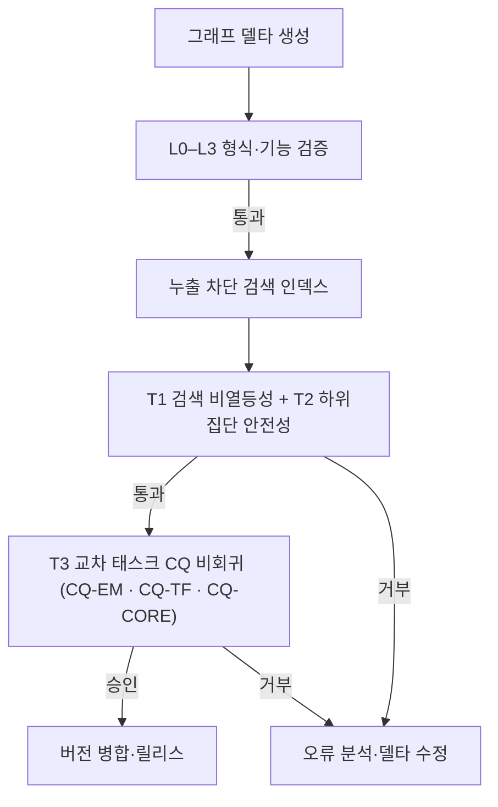

# SDKB: 태스크 확장형 반도체 도메인 온톨로지 데이터셋의 검증 게이트 기반 진화 — 선행기술 검색 주 검증과 교차 태스크 비회귀

**SDKB: Validation-Gated Evolution of a Task-Extensible Semiconductor Domain Ontology Dataset with Prior-Art Retrieval as the Primary Validation Task and Cross-Task Non-Regression as a Safety Condition**

> **원고 상태: v2.0 재구성 1단계 (2026-08-01) · 작업 언어 = 한글.**
> 확증 가설을 **H3(하이브리드 효과)·H5(계층 특이성)** 둘로 좁히고, H1(게이트 판별력)·H2(승인
> 안전성)·H4(계층 기여)는 **판정을 바꾸지 않은 채 지위만 강등**했다(각각 §4.9·§6.5 · §8.1 ·
> §6.4). 가설 라벨은 사전등록의 이름을 그대로 쓴다 — 개수만 줄이고 번호는 다시 매기지 않았다.
> 재구성 계획과 이동 대장은 `01.code_spec/plans/PLAN-033`, 잘라낸 절의 전문은 `paper/supplementary/`.
> **영문 Abstract는 없다** — 영문화는 실험 결과로 논리 기조가 확정된 뒤 원고 전체를 한 번에 한다.
> 저장소에서 재현된 사실은 "관측 결과", 미수행 실험은 `[실험 후 기입]`으로 구분한다.
> **§6.2–6.4는 B층 제2 확증분할 재실험 후 재작성 예정이다**(PLAN-033 §6 · 현재 시점유효 마스크
> 문제로 대기).

---

## 국문 초록

반도체 도메인의 지식집약 공학 태스크는 공정·소자·재료·장비 분류만으로 완결되지 않는다. 기술문제와 전문가 역량의 연결, 청구항과 선행기술의 대응, 시간에 따른 기술신호와 사업화 선택을 서로 다른 관점에서 표현해야 한다. 본 논문은 이 요구를 하나의 공유 의미 백본으로 통합한 **태스크 확장형 반도체 도메인 온톨로지 데이터셋 SDKB(Semiconductor Domain Knowledge Base)**를 제시한다. 실재 T-Box는 `Process`·`SubProcess`·`Device`·`Material`·`Equipment`·`FailureMode`·`Skill`·`Organization`을 공유 코어로 삼아 전문가 매칭·선행기술조사·기술예측의 세 뷰를 지탱하며, 표현 가능성은 SHACL과 31개 역량질문(competency question, CQ)으로 검증한다(28개가 게이트 판정 분모, 청구항 층 3개는 측정으로 운용). **세 태스크의 성능이 같은 수준으로 검증되었다고 주장하지 않는다.**

본 연구는 심사관 인용 약한 정답을 확보한 **선행기술 검색을 주 경험적 검증 태스크**로 선택하고, 확증 가설을 두 개로 한정한다 — **H3(하이브리드 효과)**와 **H5(계층 특이성 · 음성 대조군)**. 가설 라벨은 사전등록의 이름을 그대로 유지한다. 거절 특허 1,000건과 심사관 인용 2,534건은 완전한 정답이 아니라 **심사관 검토에 정박된 양성 전용 약한 판단**으로 쓰며, 질의 인용 간선을 제거하고 시간·특허 패밀리를 분리한 조건에서 BM25·특허 임베딩·텍스트 하이브리드·분류코드·도메인 온톨로지·청구항 한정요소 재순위화를 비교한다. 아울러 온톨로지가 세 태스크를 공유 어휘로 지탱하는 구조에서는 단일 태스크 성능만으로 보강을 승인하면 다른 태스크의 질의 경로가 조용히 훼손될 수 있으므로, 형식 검증 4층(L0–L3) 위에 검색 비열등성(T1)·하위집단 안전성(T2)·**타 태스크 CQ 비회귀(T3)**의 3조건 과제 게이트를 둔다.

봉인 해제 후 1회 수행한 확증 평가(198질의)에서 온톨로지·한정요소 재순위화는 최강 텍스트 하이브리드 대비 family-level Recall@100을 **+0.0534**(95% CI [+0.0145, +0.0926], *p* = .008) 개선했다. 그러나 개선에는 세 방향의 경계가 있다. 첫째, 사전 지정한 주 순위 함수는 유의 수준에 이르지 못했고(*p* = .181), 위 수치는 부차 구성의 관측이다 — 결과를 본 뒤 주 시스템을 교체하지 않고 사전 지정 판정을 그대로 보고한다. 둘째, **nDCG@20은 개선되지 않았다** — 이득은 검토 깊이 안의 회수에 있고 최상위 정렬 품질에는 없다. 셋째, 이득은 예상한 저어휘중첩 질의가 아니라 **고중첩 질의에 집중**되어 재순위화라는 결합 방식의 구조적 천장을 드러낸다.

경계와 별개로, 검색과 이론적으로 무관하도록 설계해 음성 대조군으로 삼은 전문가 매칭 전용 계층을 제거하자 검색이 **유의하게 악화되었다**(+0.0316, *p* = .002; 8개 절제 중 Holm 보정 후 유일한 유의 결과). 하나의 T-Box를 공유하는 태스크는 통계적으로 분리되지 않으며, 한 태스크를 겨냥한 델타가 다른 태스크의 질의 경로를 훼손할 수 있다는 **경험적 교차 태스크 의존성**이다. 이는 절제 설계의 실패가 아니라 교차 태스크 비회귀 조건이 형식 검증·단일 태스크 성능과 **독립적으로** 필요한 이유이며, 게이트의 판별력은 규칙을 동결한 채 아직 판정한 적 없는 결함 45개에서 확증했다(T3 단독 검출 12/45 · 단측 *p* = .0001 · 위양성 0/27). 다만 분포 검사 임계 τ = 0.10에서는 성립하지 않고, T3의 특이성은 미검정으로 남는다.

저장소 감사는 표현 범위와 검색 준비도의 차이를 드러낸다 — 인용 선행기술의 노드 도달성은 95.3%인 반면 도메인 의미 관계 도달성은 54.6–70.5%이며, CQ 후보 수의 증가는 후보 생성 능력이지 적합성 순위의 증거가 아니다. 본 연구는 데이터셋의 **넓은 태스크 표현 범위**와 하나의 운영 태스크에 대한 **집중된 정량 검증**, 나머지 태스크에 대한 **회귀 감시**를 분리·결합함으로써, 온톨로지 품질을 "그래프가 유효한가"에서 "과제 성능을 보존하며 다른 태스크를 훼손하지 않고 진화하는가"로 확장한다.

**주제어:** 반도체 도메인 온톨로지 데이터셋, 태스크 확장형 온톨로지, 온톨로지 진화, 검증 게이트, 교차 태스크 비회귀, 선행기술 검색, 심사관 인용, 청구항 한정요소, SHACL, 누출 통제 평가

---

> **영문 Abstract는 이 원고에 없다.** 영문화는 실험 결과로 신규성·진보성의 논리 기조가
> 확정된 뒤 **원고 전체를 한 번에** 수행한다(PLAN-033 §2). 그때 이 초록을 영문으로 새로 쓴다.

---

## 약어표 (Nomenclature)

본 논문에서 사용하는 약어는 아래와 같다. 본문에서는 각 약어를 처음 사용할 때 전체 명칭과 병기하고 이후에는 약어만 사용한다.

| 약어 | 전체 명칭 |
|---|---|
| BM25 | Okapi Best Matching 25 (어휘 기반 순위 함수) |
| bpref | binary preference (불완전 qrel 강건 지표) |
| CI | confidence interval (신뢰구간; 통계 문맥) / continuous integration (지속적 통합; 공학 문맥) |
| CLEF-IP | Conference and Labs of the Evaluation Forum – Intellectual Property track |
| CPC | Cooperative Patent Classification (협력적 특허분류) |
| CQ | competency question (역량질문) |
| DOCDB | EPO Master Documentation Database (특허 패밀리 식별 기준) |
| EPO | European Patent Office (유럽특허청) |
| GT | ground truth (정답) |
| IPC | International Patent Classification (국제특허분류) |
| KG | knowledge graph (지식그래프) |
| KIPRIS | Korea Intellectual Property Rights Information Service (특허정보넷) |
| MRR | mean reciprocal rank (평균 역순위) |
| nDCG | normalized discounted cumulative gain (정규화 할인 누적 이득) |
| qrel | relevance judgment (적합성 판단; 정보검색 관행 표기) |
| RBV | resource-based view (자원기반관점) |
| SDKB | Semiconductor Domain Knowledge Base (반도체 도메인 지식 베이스) |
| SHACL | Shapes Constraint Language (W3C 구조 제약 언어) |
| TDD | test-driven development (테스트 주도 개발) |
| TRL | technology readiness level (기술성숙도) |
| TTL | Turtle (RDF 텍스트 직렬화 형식) |
| USPTO | United States Patent and Trademark Office (미국 특허상표청) |
| W3C | World Wide Web Consortium |

내부 기호는 다음과 같으며, 정의 위치를 함께 표시한다.

| 기호 | 의미 (정의 위치) |
|---|---|
| T-Box / ABox | 스키마 어휘 / 인스턴스 단언 (§3.1) |
| G0 / G1 / G2 | SDKB 그래프 계보 — 코어 / 확장 / 외부 코퍼스 적용 (§3.2) |
| L0–L3 | 형식 검증 4층 — 신선도·무결성, SHACL, 논리 일관성, CQ 기능 (§4.1) |
| T-gate, T1–T3 | 3조건 과제 게이트 — 비열등성, 하위집단 안전성, 교차 태스크 CQ 비회귀 (§4.1, §4.9) |
| RQ2·RQ3, H3·H5 | 연구 질문과 확증 가설 — 사전등록 라벨 유지 (§1.4) |
| B0–B5, P0–P2 | 비교 시스템 — 기준선과 제안 시스템 (§4.6) |
| A1–A8 | 절제(ablation) 실험 조건; A8은 음성 대조군 (§5.4) |
| CQ-PA / CQ-EM / CQ-TF / CQ-CORE | 태스크별 CQ 스위트 — 선행기술조사 / 전문가 매칭 / 기술예측 / 공유 코어 (§3.1) |
| \(\epsilon\), \(\delta\) | 비열등성 허용한계(0.02), 하위집단 하락 한계(0.05) (§4.9) |

---

# 1. 서론

## 1.1 문제 제기

반도체 산업의 지식은 공정·소자·재료·장비의 분류만으로 충분히 표현되지 않는다. 현장의 기술문제는 FailureMode–RootCause–Mitigation의 인과구조와 이를 해결할 Skill–Expert–ExpertCase의 역량구조에 연결되어야 한다. 특허 분석에서는 Patent–Claim–ClaimFeature–PriorArtJudgment가 필요하며, 기술기획에서는 TechnologyNode의 시간 변화가 Scenario–STEEPVEFactor–RealOption–TRL과 연결되어야 한다. 이 개념들은 독립된 데이터 사일로가 아니라 `Process`, `SubProcess`, `Device`, `Material`, `Equipment`, `Organization`을 공유하는 반도체 도메인 지식의 서로 다른 사용 관점이다.

SDKB(Semiconductor Domain Knowledge Base)는 이 문제를 해결하기 위해 전문가 매칭, 선행기술조사, 기술예측이라는 세 요구를 거치며 진화한 반도체 도메인 온톨로지 데이터셋이다. 본 연구에서 **태스크 확장형(task-extensible)**이란 하나의 온톨로지가 모든 과제에서 같은 성능을 낸다는 뜻이 아니다. 공유 T-Box(terminological box; 스키마 어휘)의 안정된 개념과 IRI를 보존하면서 태스크별 클래스·관계·제약·역량질문(competency question, CQ)과 ABox(assertional box; 인스턴스 단언)를 추가할 수 있고, 각 확장이 기존 구조와 기능을 훼손하지 않는다는 뜻이다. 따라서 데이터셋의 표현 범위와 개별 태스크의 성능 검증 수준은 구분해야 한다.

세 태스크 가운데 선행기술 검색은 정량적 과제 타당성을 가장 직접적으로 평가할 수 있다. 선행기술 검색은 단순한 유사 문서 검색이 아니다. 특허 청구항은 하나의 긴 문장 안에 구성요소, 공정 조건, 기능적 관계와 결과를 결합하며, 관련 선행기술은 같은 발명을 다른 용어·분류·추상화 수준으로 기술할 수 있다. 반도체 분야에서는 같은 물리 현상이 식각, 증착, 세정, 계측, 소자 구조 또는 패키징의 문맥에 따라 다르게 표현된다. 따라서 표면 어휘가 겹치지 않아도 기술적으로 관련된 문헌을 회수해야 하며, 반대로 같은 용어를 공유하더라도 청구항의 핵심 한정요소를 충족하지 못하면 강한 선행기술이 아닐 수 있다.

현재의 특허 검색 연구는 BM25(Okapi Best Matching 25)와 같은 어휘 검색, 문서·청구항 임베딩, 인용 네트워크, 또는 이들의 하이브리드에 집중한다(Lupu & Hanbury, 2013; Krestel et al., 2021; Mahdabi & Crestani, 2014; Risch et al., 2020). 이 흐름은 검색 성능을 직접 측정한다는 장점이 있지만, 왜 두 문헌이 기술적으로 연결되는지 설명하거나 공정·소자·재료·고장·청구항 구성요소 사이의 명시적 관계를 활용하는 데 한계가 있다. 반면 온톨로지 공학은 형식적 일관성, 제약 준수, CQ와 같은 내부 품질을 정교하게 검증하지만(Grüninger & Fox, 1995; Kontokostas et al., 2014; W3C, 2017), 그러한 통과가 실제 검색 품질을 보장하는지는 별도의 경험적 문제다.

이 간극은 온톨로지 진화 과정에서 더 중요해진다. 새 특허와 개념 링크를 추가한 뒤 SHACL(Shapes Constraint Language)과 추론기와 CQ가 모두 통과하더라도, 잘못된 개념 정렬이나 과도하게 평탄화된 계층이 후보 순위를 훼손할 수 있다. 반대로 검색 재현율이 유지되어도 구조 위반이나 미래정보 누출이 숨어 있을 수 있다. 즉 구조적 유효성과 과제 적합성은 대체 관계가 아니라 상보적 검증 층이다.

SDKB의 발전 경로는 세 단계로 정리된다. **첫째, 전문가 매칭 단계**에서 Problem, FailureMode, RootCause, Skill, Expert와 반도체 공정·장비·재료의 연결을 구축해 개념 타당성을 형성했다. **둘째, 선행기술조사 단계**에서 거절 특허, 심사관·출원인 인용, IPC(International Patent Classification)/CPC(Cooperative Patent Classification)/FTerm(일본 특허청 F-term 분류), Claim, ClaimFeature와 PriorArtJudgment를 보강해 제도적으로 검토된 근거 축을 추가했다. **셋째, 기술예측 단계**에서 TechnologyNode, Scenario, STEEPVEFactor, RealOption, TRL(technology readiness level), RBV(resource-based view, 자원기반관점)와 `filingDate`를 이용하는 시간 축을 확장했다. v0.7은 G0·G1·G2, 28개 CQ, SHACL shapes, 매핑 규칙과 L0–L3 게이트를 통해 주로 세 번째 확장을 검증했다.

현재 G0에는 거절 특허와 심사관 인용 선행기술이 포함되고, 청구항 한정요소와 거절판단을 표현하는 T-Box가 반영되어 있다. 이 자원은 다음 질문을 가능하게 한다. **세 태스크를 표현하는 반도체 도메인 온톨로지 데이터셋의 진화가 주 운영 태스크인 선행기술 검색 성능을 보존하거나 개선하면서, 나머지 태스크의 기능을 훼손하지 않는가?** 본 연구는 이 질문을 주 검정으로 삼는다.

## 1.2 핵심 개념 1: 과제 의미 회귀

본 연구는 **과제 의미 회귀(task-semantic regression)**를 다음과 같이 정의한다.

> 온톨로지 또는 ABox의 변경이 L0–L3의 신선도·구조·논리·CQ 검증을 통과하지만, 동결된 누출 방지 평가집합에서 검색 성능 또는 중요 하위집단의 성능을 사전 허용치보다 저하시키는 현상.

이 정의에는 세 가지 함의가 있다. 첫째, 온톨로지 품질은 산출물의 내부 속성만이 아니라 사용 과제와의 관계로 측정된다. 둘째, 검색 성능 하나가 온톨로지 품질 전체를 대체하지 않는다. 셋째, "개선"뿐 아니라 "기존 성능을 해치지 않는 진화"도 실무적으로 중요한 성공 조건이다.

## 1.3 핵심 개념 2: 왜 단일 태스크 게이트로는 부족한가 — 교차 태스크 회귀

여기서 두 번째 방법론적 함정이 발생한다. **온톨로지가 하나의 태스크만 서비스한다면, 그 태스크 성능으로 보강을 게이트하는 것은 순환에 가깝다.** 평가하는 바로 그 지표에 온톨로지를 맞추는 것이므로, "그렇다면 온톨로지를 게이트할 것이 아니라 검색 모델을 튜닝하면 되지 않는가"라는 반론에 취약하다.

SDKB는 이 함정을 벗어난다. SDKB의 T-Box는 전문가 매칭·선행기술조사·기술예측의 세 태스크를 동시에 지탱하며(§3.1), 세 태스크는 상당 부분 공유 어휘(`Process`, `SubProcess`, `Material`, `Equipment`, `Organization`)를 통해 결합되어 있다. 이 구조에서는 한 태스크에 유익한 보강이 다른 태스크의 질의 경로를 조용히 훼손할 수 있다. 예컨대 검색 재현율을 높이기 위한 개념 병합(concept merging)은 전문가 매칭의 `Skill` 변별력을 떨어뜨리고, 특허 인스턴스 대량 주입은 기술예측의 `TechnologyNode` 시계열 분포를 왜곡할 수 있다. 이를 **교차 태스크 회귀(cross-task regression)**라 부르며, 소프트웨어 공학의 회귀 문제와 구조적으로 동일하다. **교차 태스크 회귀가 실재할 수 있기 때문에, 과제 게이트에는 검색 비열등성(T1)만이 아니라 타 태스크 비회귀(T3)가 필요하다**는 것이 본 연구의 두 번째 출발점이다.

따라서 본 연구는 **깊이의 비대칭** 전략을 취한다. 세 태스크를 모두 기술하되, 정량 평가는 근거 자산이 가장 강한 선행기술 검색 하나에 집중하고, 나머지 두 태스크는 CQ 통과율 기반 회귀 감시 대상으로 둔다.

| 태스크 | 논문에서의 역할 | 증거 수준 |
|---|---|---|
| 선행기술조사 | **게이트 태스크** (주 정량 검증) | Recall@K·nDCG, 신뢰구간, T1·T2 |
| 전문가 매칭 | 회귀 감시 대상 (T3) + 절제 음성 대조군 | CQ 통과율 + 절제 시 영향 |
| 기술예측 | 회귀 감시 대상 (T3) + 2차 재사용 사례 | CQ 통과율 + 시간 백테스트 사례 |

## 1.4 연구 질문과 가설

연구 질문은 두 개이고, 각 질문에 **확증 가설을 하나씩만** 배정한다. 나머지 분석은 탐색적으로
강등해 방법론과 판정의 복잡도를 낮춘다.

> **가설 라벨은 사전등록의 이름을 그대로 쓴다.** 확증 가설은 **H3·H5** 두 개이며, 개수를 줄이면서
> 번호를 다시 매기지 않았다 — 이 이름은 사전등록 문서가 쓴 이름이고, 재번호는 사전등록 기록과의
> 추적성을 끊는다. 강등된 H1(게이트 판별력)·H2(승인 안전성)·H4(계층 기여)의 **판정은 바뀌지
> 않았고**, 싣는 자리만 바뀌었다 — 각각 §4.9·§6.5, §8, §6.4의 절제 표다.

**RQ2. 검색 유용성.** 누출을 차단한 시간·패밀리 분리 평가에서, 온톨로지 보강 하이브리드 검색은
강한 텍스트 기준선을 개선하는가?

- **H3(하이브리드 효과).** 하이브리드는 가장 강한 텍스트 전용 기준선보다 Recall@100과 nDCG@20이
  높고, 그 개선폭은 질의–정답 문헌의 어휘 중첩이 낮은 집단에서 더 크다.

**RQ3. 계층 특이성.** 검색 이득은 그것을 만든다고 상정한 계층에 특이적인가?

- **H5(특이성 — 음성 대조군).** 게이트 태스크와 무관한 전문가 매칭 전용 계층
  (`Skill`·`ExpertCase`·`Mitigation`)의 제거는 검색 성능을 유의하게 바꾸지 않는다. 이 예측이
  깨지면 **교차 태스크 의존성의 발견**으로 보고하며, 이는 교차 태스크 비회귀 조건(T3)의 필요성을
  오히려 강화한다(§7.3). 어느 쪽 결과든 해석 가능하다.

RQ 번호도 사전등록의 것을 유지한다(RQ1은 검증 게이트였고, 그 축은 §4·§8로 강등됐다). 운용 효율,
신규성·진보성 거절 유형별 신호 차이, 노드–의미 도달성과 성능의 관계, 교차언어 회수는 확증 가설에서
제외하고 **탐색적 분석**으로만 보고한다(§4.8·§5.3·§6.2f·§6.4).

## 1.5 연구 기여

본 연구의 기여는 두 가지이며, 결론의 주장 순서와 일치한다.

1. **세 태스크를 표현하는 반도체 도메인 온톨로지 데이터셋과 그 진화 장치.** 공정·소자·재료·장비·
   역량·특허를 하나의 공유 T-Box로 통합하고, T-Box와 A-Box를 SHACL 제약·CQ 응답·도달성 사다리로
   계량 보고하는 재현 가능한 SDKB 릴리스를 제공한다. 여기에 L0–L3 형식 검증 위에 3조건 과제
   게이트(T1 비열등성 · T2 하위집단 안전성 · T3 교차 태스크 비회귀)를 얹어, 온톨로지 품질을
   "그래프가 유효한가"에서 **"과제 성능을 보존하며 다른 태스크를 훼손하지 않고 진화하는가"** 로
   확장한다. 게이트의 판별력은 홀드아웃 결함으로 확증했고(§6.5), 확증하지 못한 것 — 특이성과
   τ 민감성 — 도 같은 절에 적는다.
2. **선행기술조사 태스크의 검색 유용성 실증 — 경계를 명시한 형태로.** 거절 특허와 심사관 인용을
   정박점으로 삼은 누출 차단 벤치마크에서 온톨로지 보강 검색이 최강 텍스트 기준선 대비 주 지표
   (family-level Recall@100)를 개선함을 계층별 기여 분해와 함께 보이고, 동시에 그 개선이
   **어디까지인지**를 같은 정밀도로 보고한다 — 사전 지정 주 순위 함수의 유의 미달, 최상위 정렬
   품질(nDCG@20)의 미개선, 저중첩 예측의 반증, 이득의 본체가 계층 심화가 아니라 개념 겹침
   하나라는 절제 결과(§7.2). 그리고 검색과 무관하도록 설계한 음성 대조군 계층을 제거하자 검색이
   유의하게 악화된 관측(H5)은 **하나의 T-Box를 공유하는 태스크가 통계적으로 분리되지 않는다**는
   직접 증거이며, 교차 태스크 조건이 형식 검증·단일 태스크 성능과 독립적으로 필요한 이유다(§7.3).

전문가 매칭의 방법론과 성능 평가는 본 논문의 범위 밖이며(§7.4), 기술예측과 소부장 코퍼스는 동일
T-Box의 재사용 가능성을 보이는 2차 증거로만 배치한다.

## 1.6 논문의 구성

2장은 특허 검색, 온톨로지 품질과 진화 검증, 지식그래프 하이브리드를 검토한다. 3장은 SDKB의 공유
코어와 세 태스크 뷰, 그래프 계보와 검색 근거 구조를 기술한다. 4장은 누출 방지 벤치마크와 3조건
게이트를 제시하고, 5장은 실험 설계와 통계 분석 계획을 제시한다. 6장은 자원 감사에서 확인된 표현
범위를 먼저 보고한 뒤, 확증 분할을 1회 개봉해 수행한 검색 성능·가설 판정·하위집단·절제 결과와
게이트 판별력의 홀드아웃 확증을 제시한다. 7장은 결과의 해석과 사전 동결한 결론 규칙을, 7장은
한계를, 8장과 9장은 가용성과 결론을 제시한다.

---
# 2. 이론적 배경과 관련연구

## 2.1 선행기술 검색의 평가 단위

특허 검색은 긴 문서, 반복적 법률 문구, 다언어 표현, 기술 용어의 시간 변화 때문에 일반 웹 검색과 다르다. 특히 선행기술 검색의 목적은 평균적으로 비슷한 문서를 찾는 것이 아니라, 특정 청구항의 신규성 또는 진보성 판단에 관련될 수 있는 소수 문헌을 높은 재현율로 회수하는 데 있다. 따라서 실무적 1차 지표는 상위 몇 건의 정확도만이 아니라 충분한 깊이에서 알려진 관련 문헌을 놓치지 않는 Recall@K가 된다(Lupu & Hanbury, 2013; Shalaby & Zadrozny, 2019).

벤치마크 측면에서 CLEF-IP(Conference and Labs of the Evaluation Forum – Intellectual Property track, 2009–2013)는 EPO(European Patent Office, 유럽특허청) 기반 대규모 특허 컬렉션으로 선행기술 검색·분류를 평가한 대표 캠페인이며, 관련도 판정을 심사관 인용으로 생성했다. 특히 2012–2013 passage retrieval 태스크는 심사관 보고서의 X(신규성 파괴)·Y(진보성 파괴) 인용을 highly-relevant로 처리해, 인용 등급을 평가에 반영하는 선례를 제공한다. PatentMatch(Risch et al., 2020)는 EPO 심사관이 X/Y/A로 등급화한 청구항–선행문헌 구절 대응을 제공해 청구항 수준 평가의 직접 비교 대상이 되고, BigPatent(Sharma et al., 2019)는 130만 미국 특허 요약 데이터셋으로 도메인 코퍼스 규모의 기준점을 제공한다. 최근 PatenTEB(Kherwa et al., 2025)는 비대칭 검색을 포함한 15개 태스크의 특허 텍스트 임베딩 벤치마크를 제시해 신규성 비교선을 최신화한다.

기존 검색 연구는 세 방향으로 발전했다. 첫째, BM25와 필드 가중 검색은 제목·초록·청구항의 어휘 증거를 결합한다. 둘째, PatentBERT, PatentSBERTa, PaECTER와 같은 특허 특화 표현은 문장 또는 문서 수준의 의미 유사도를 학습한다(Bekamiri et al., 2024; Ghosh et al., 2024). 셋째, 인용 네트워크와 질의 문서의 구조를 이용해 후보를 확장하거나 재순위화한다(Mahdabi & Crestani, 2014). 최근 조사 연구는 강한 검색 시스템이 하나의 표현에 의존하기보다 어휘, 의미, 분류, 인용, 메타데이터를 결합하는 방향으로 이동했음을 보여준다(Krestel et al., 2021; Shomee et al., 2025).

**교차언어 축은 이 세 방향과 직교한다.** 선행기술의 공개는 언어와 무관하게 유효하므로, 완전한 선행기술 검색은 본질적으로 교차언어적이다. CLEF–IP가 처음부터 영어·독일어·프랑스어 세 언어 컬렉션으로 설계되고 교차언어 검색을 명시적 목표로 삼은 것도 이 요구를 반영하며(Piroi & Hanbury, 2019), 일본어 축에서는 NTCIR 특허 검색 태스크가 무효자료 조사 형태의 비영어 시험 컬렉션을 구축했다(Fujii et al., 2004). 이 흐름의 주된 통로는 번역이었다. 특허 질의는 청구항이나 명세서 전체처럼 길어 기계번역 비용이 일반 CLIR보다 크므로, 검색 전처리를 번역 학습 코퍼스에 미리 적용해 비용을 줄이는 기법(Magdy & Jones, 2011)과 번역 기술 선택이 대규모 선행기술 검색의 회수에 미치는 영향을 다룬 사례연구(Magdy & Jones, 2014)가 보고됐다. 언어별 형태론도 회수에 직접 작용해, 복합어 분해(decompounding)는 교차언어 특허 검색의 전처리 쟁점으로 별도로 다뤄졌고(Leveling et al., 2011), 다국어 컬렉션에서의 질의 생성 기법 비교도 수행됐다(Zhou et al., 2013). 한국어–영어 축에서는 KIPRIS가 K2E-PAT 자동번역을 기반으로 교차언어 검색을 제공해 왔으며(Choi, 2009), 특허 도메인의 한–영 번역 품질은 엔진에 따라 여전히 균질하지 않다(Lee & Choi, 2023). 최근에는 번역 대신 다국어 밀집 표현으로 언어 장벽을 넘는 접근이 확산되었고, 18개 언어 규모의 다국어 검색 벤치마크가 그 비교 기반을 제공한다(Zhang et al., 2023).

**이 흐름이 남기는 공백.** 위 문헌에서 교차언어 통로는 사실상 둘 — 번역과 다국어 임베딩 — 이다. **명시적 온톨로지의 언어중립 식별자**를 세 번째 통로로 놓고 그 회수 기여를 정답 언어별로 분해해 측정한 평가는 확인되지 않는다. 나아가 온톨로지·KG 기반 특허 검색 연구(§2.5)는 대체로 단일 언어 컬렉션에서 평가되므로, 개념 링크가 T-Box 수준에서는 언어중립이면서 A-Box 수준에서는 언어에 따라 비대칭적으로 부착돼 있을 가능성 자체가 측정 대상이 되지 않는다. 본 연구의 벤치마크는 질의가 전량 한국어이고 후보 코퍼스가 다국어인 조건에서 번역 계층 없이 동결되어 있어, 이 공백을 정면으로 관측할 수 있는 조건에 해당한다. 실제로 회수를 정답 언어별 마이크로 단위로 분해하면 세 통로의 기여가 갈리며(§6.2f), 개념 단독 검색팔이 영어 정답에서 텍스트 하이브리드를 앞서면서도 그 우위가 재순위화 단계에서 소거되는 관측(§7.2)은 어느 통로를 보강해야 하는지를 특정한다. 다만 이 관측은 사후적이며 본 논문의 사전등록 가설이 아니고, 번역 계층을 요인으로 하는 비교는 동결 설계 밖의 별도 실험으로 남는다(§8.1).

그러나 "검색 단위"는 여전히 쟁점이다. 문서 수준 검색은 확장성과 벤치마크 구성이 쉽지만, 심사 판단은 청구항과 그 한정요소에 관여한다. 본 연구는 전체 거절 특허에 대해서는 문헌 수준 평가를 1차 분석으로 유지하고, 명시적 `PriorArtJudgment–aboutClaim–overPriorArt` 연결이 있는 부분집합에서 청구항 수준 분석을 2차로 수행한다. 이렇게 해야 풍부한 부분집합을 전체 데이터의 속성으로 일반화하는 오류를 피할 수 있다.

## 2.2 심사관 인용은 정답이 아니라 관측된 양성이다

특허 검색 벤치마크는 질의 특허가 인용한 문헌을 관련 문헌으로 사용하는 경우가 많다. CLEF-IP 계열에서는 질의에서 인용 정보를 제거한 뒤 그 인용을 적합성 판단으로 사용한다(Mahdabi & Crestani, 2014). 이는 대규모 평가를 가능하게 하지만, 인용되지 않은 문헌을 비관련으로 확정할 수 없다는 한계가 있다. 심사관 인용과 출원인 인용은 생성 과정과 의미가 다르다. 미국 특허의 실증 연구는 심사관 인용이 전체 인용의 상당 부분을 차지하고, 상당수 특허에서 인용 전량이 심사관 추가임을 보였다(Alcácer & Gittelman, 2006; Alcácer et al., 2009). 심사관의 검색 역시 이용 가능한 시간과 분류, 관할, 검색전략에 제약되며, USPTO(United States Patent and Trademark Office, 미국 특허상표청) 심사 지침은 텍스트 검색만으로 충분하지 않을 수 있어 분류 검색을 함께 사용하도록 설명한다(USPTO, 2023).

정보검색 평가의 불완전 적합성 판정(incomplete relevance judgments; 이하 관행에 따라 qrel로 표기)·pooling bias 문헌은 판정 풀에 기여하지 않은 시스템이 체계적으로 불리해짐을 보이고, bpref(binary preference)와 같은 미판정-강건 지표를 권고한다(Buckley & Voorhees, 2004; Büttcher et al., 2007). 따라서 본 연구는 심사관 인용을 다음과 같이 사용한다.

- 인용된 문헌은 제도적 검토 과정에서 관측된 **양성 적합성 신호**다.
- 인용되지 않은 문헌은 음성이 아니라 **미관측(unknown)**이다.
- Recall@K는 "알려진 양성을 얼마나 회수했는가"를 측정하며, 전체 법적 관련성을 완전히 측정한다고 해석하지 않는다.
- 미관측 상위 후보의 잠재적 관련성을 확인하기 위해 표본 전문가 판정을 별도로 수행하고 Cohen's \(\kappa\)를 보고한다.
- 신규성·진보성·기재요건 등 거절근거가 섞여 있을 때는 선행기술 적합성과 직접 관련된 거절 유형을 주 분석과 보조 분석으로 구분한다.

이 관점은 SDKB의 2,534개 인용을 "ground truth"라고 단정하는 표현보다 엄밀하다. 이하에서는 이를 **심사관 검증 약한 정답(examiner-validated weak ground truth)** 또는 **양성 전용 qrel**이라 부른다.

## 2.3 온톨로지 품질, 진화 검증과 테스트 주도 접근

온톨로지 품질은 개념화의 명료성, 일관성, 확장성, 최소한의 존재론적 약속과 같은 설계 원칙에서 출발했다(Gruber, 1993). CQ는 온톨로지가 답해야 할 질문을 요구사항과 검증 항목으로 연결하며(Grüninger & Fox, 1995), 최근에는 CQ의 유형학과 자동 검증 가능성이 체계화되고 있다(Keet & Khan, 2024). 테스트 주도 온톨로지 개발(test-driven development, TDD) 계열은 CQ의 전제를 자동 검증 가능한 요구사항으로 형식화했다(Potoniec et al., 2020). RDF(Resource Description Framework) 데이터 품질 연구는 제약 위반과 데이터 오류를 자동 점검하는 방법을 발전시켰고(Kontokostas et al., 2014), SHACL은 이를 표준화된 shape로 표현한다(W3C, 2017). 링크드데이터 품질의 기준점인 Zaveri et al.(2016)은 품질을 18개 차원·69개 지표로 분류했으나 이는 대체로 사후적·기술적(descriptive) 평가 틀이다. 지식그래프(knowledge graph, KG) 연구는 스키마와 인스턴스의 규모가 커질수록 출처, 일관성, 최신성, 완전성의 통합 관리가 중요함을 강조한다(Hogan et al., 2021). 온톨로지 변화 관리 연구는 변경의 분류와 일관성 보존을 다뤄왔다(Flouris et al., 2008).

다운스트림 관점에서 KGrEaT(Heist et al., 2023)는 KG 보강 연구가 다운스트림 성능 향상을 전제로 정당화되면서도 이를 거의 평가하지 않는다는 문제의식 하에, 분류·클러스터링·추천 과제로 KG 품질을 추정하는 프레임워크를 제시했다. 그러나 이는 사후적·비교적 평가에 머문다.

SDKB의 L0–L3는 이 전통을 실용적인 병합 게이트로 구현하고, 본 연구는 그 위에 T-gate를 추가한다.

| 층 | 검증 대상 | 대표 실패 | 본 연구에서의 역할 |
|---|---|---|---|
| L0 | 신선도·무결성 | 낡은 산출물, 해시·입력 불일치 | 재현 가능한 입력 보장 |
| L1 | SHACL 구조 제약 | 필수 속성 누락, 잘못된 범위·카디널리티 | 구조적 유효성 보장 |
| L2 | 논리 일관성 | 모순 타입, 비정상 추론 | 형식 의미 보장 |
| L3 | CQ 기능 (**주 태스크 스위트 pa**) | 필수 경로 단절, 선행기술 질의 무응답 | 주 태스크의 기능적 응답 가능성 보장 |
| T1 | 검색 과제 적합성 | 관련 문헌 순위 하락, 누출 의존 | 주 태스크 성능 보존 |
| T2 | 하위집단 안전성 | 거절근거·공정군별 국소 회귀 | 평균 아래 숨는 실패 차단 |
| T3 | 교차 태스크 CQ 비회귀 (**em·tf·core**) | 타 태스크 질의 경로 훼손 | 태스크 과적합 억제 |

**L3와 T3의 검출 표면은 서로소다** — L3는 주 태스크(pa 5개), T3는 타 태스크·공유 스위트(em·tf·core 23개)를 보며, 합집합은 CQ 28개 전량이다. 승인식이 곱이므로 어느 층에 귀속되든 하나라도 떨어지면 거부이고, 따라서 이 분리는 게이트의 강도가 아니라 **귀속**을 정한다. 이 정의는 2026-07-28에 개정됐다 — 구 정의에서 L3가 전 스위트를 세는 바람에 `L3 ⊇ T3`가 성립해 "T3만이 검출한다"는 형태의 가설이 원리적으로 검정 불가능했기 때문이다(경위와 검출력 불변 검사는 §6.5.2–6.5.3).

T-gate는 L3의 대체가 아니다. CQ가 특정 관계의 존재와 질의 가능성을 확인한다면, T1은 그 관계가 후보 순위에 미치는 결과를 확인하고, T3는 그 확인이 다른 태스크의 희생 위에서 이루어지지 않았음을 확인한다. 예를 들어 CQ10이 90개의 후보를 반환해도 그 안에 심사관 인용 문헌이 얼마나 높은 순위로 포함되는지는 별도의 평가다.

**연구 공백:** 기존 온톨로지·KG 품질 연구는 사후적·비교적 평가에 머물며, 도메인 온톨로지의 지속적 보강을 **릴리스 전 사전 승인 게이트**에 연결한 설계는 제한적이다. 특히 다태스크 온톨로지에서 단일 태스크 게이트가 유발하는 과적합을 교차 태스크 비회귀 조건으로 통제한 사례는 확인되지 않는다.

## 2.4 태스크 확장형 도메인 온톨로지 데이터셋

도메인 온톨로지 데이터셋은 용어 목록이나 하나의 응용모델과 구별된다. 첫째, 여러 데이터 원천을 안정된 식별자와 명시적 의미관계로 통합하는 공유 T-Box가 있어야 한다. 둘째, T-Box의 표현 가능성과 ABox의 실제 완전도를 분리해 보고해야 한다. 셋째, 재사용 가능한 데이터셋이라면 schema, instance graph, provenance, license, validation artifact와 재구축 절차를 함께 제공해야 한다(Wilkinson et al., 2016; Hogan et al., 2021). 넷째, 온톨로지가 진화할 때 기존 태스크의 요구를 훼손하지 않는지 검증해야 한다(Flouris et al., 2008).

본 연구에서 태스크 확장성은 "다목적 성능"의 동의어가 아니다. 하나의 공유 반도체 T-Box \(T_{\mathrm{core}}\) 위에 태스크 뷰 \(V_t=(C_t,R_t,Q_t)\)를 추가할 수 있고, 여기서 \(C_t\), \(R_t\), \(Q_t\)는 각각 해당 태스크가 요구하는 클래스, 관계와 CQ다. 서로 다른 뷰는 `Process`, `Material`, `Equipment`, `Organization`처럼 일부 어휘를 공유할 수 있다. 따라서 다음 두 수준을 구분한다.

- **표현 범위(breadth):** T-Box·SHACL·CQ가 세 태스크의 질문을 표현하고 실행할 수 있는가.
- **과제 검증 깊이(depth):** 실제 정답과 후보 모집단을 사용했을 때 특정 태스크의 성능이 유지되거나 개선되는가.

SDKB는 세 태스크의 표현 범위를 데이터셋 수준에서 제시하고, 이 논문은 그중 선행기술 검색의 검증 깊이를 확장하며, 나머지 두 태스크는 T3의 회귀 감시로 연결한다. 전문가 매칭과 기술예측을 검색 성능 가설에 섞지 않음으로써 "T-Box가 표현한다"와 "태스크 성능이 검증되었다"를 구분한다. 동시에 공유 어휘가 실재하는 만큼, 감시 없는 확장은 교차 태스크 회귀를 방치하는 것이므로 T3가 표현 범위 주장을 지키는 최소한의 안전 조건이 된다.

## 2.5 특허 지식그래프와 하이브리드 검색

특허 검색에서 그래프는 인용, 발명자, 출원인, 분류코드 또는 기술 개념을 통해 어휘 검색의 사각지대를 보완할 수 있다. 질의 중심 인용망 마이닝은 초기 검색 결과에서 인용 경로를 확장해 재현율을 높이는 접근을 보였다(Mahdabi & Crestani, 2014). 텍스트와 인용·발명자 정보를 결합한 지식그래프 임베딩 역시 기술적으로 관련된 특허를 찾는 데 구조 신호가 유용함을 제시한다(Siddharth et al., 2022). PaECTER는 인용 관계를 학습 신호로 활용한 특허 표현이 특허 검색과 분류에 기여할 수 있음을 보이고(Ghosh et al., 2024), IPRally의 Graph Transformer는 발명을 특징–관계 그래프로 표현하고 심사관 인용을 관련성 신호로 하는 밀집 검색으로 텍스트 임베딩 대비 향상을 보고한다(Daniell et al., 2025).

그러나 이 연구들에서 그래프는 대개 성능을 위한 입력 표현이다. 그래프 자체가 계속 진화할 때 어떤 변경을 허용할지, 구조적으로 유효하지만 검색을 해치는 변경을 어떻게 차단할지는 충분히 다뤄지지 않았다. 반대로 온톨로지 진화 연구는 변경 전후의 일관성과 요구사항을 다루지만, 특허 검색의 누출 방지 성능을 병합 게이트로 사용하지 않는다. 본 연구는 "KG를 쓰면 검색이 좋아진다"를 재주장하지 않으며, **"검색 성능으로 KG의 진화를 통제하되, 그 통제가 다른 태스크를 훼손하지 않도록 감시한다"**는 방향에 기여를 둔다. 본 연구의 공백은 요소적 신규성이 아니라 다음 결합에 있다.

> **다층 형식 검증 + 심사관 정박 검색 평가 + 누출 방지 시간·패밀리 분할 + 교차 태스크 표적 결함 주입 + 음성 대조군 절제 + 병합 전 3조건 과제 회귀 의사결정**

## 2.6 관련연구 대비 연구 위치

| 연구 흐름 | 대표 평가 | 장점 | 남는 공백 | 본 연구의 확장 |
|---|---|---|---|---|
| 특허 텍스트 검색 | Recall, MAP, MRR, nDCG | 과제 성능 직접 측정 | 명시적 도메인 의미와 그래프 진화 검증 부족 | 반도체 온톨로지 계층을 후보·재순위화에 결합 |
| 인용·KG 검색 | 인용 qrel 기반 순위 성능 | 관계 신호 활용 | 질의 인용 누출 및 변화 게이트 문제 | 질의 간선 마스킹, 시간·패밀리 분리 |
| 교차언어 특허검색(CLIR) | 번역 기반 회수·다국어 컬렉션 평가 | 언어 장벽을 직접 통제 | 통로가 번역·다국어 임베딩에 한정되고, 개념 자원의 언어 비대칭은 측정되지 않음 | 언어중립 개념 IRI를 제3 통로로 두고 정답 언어별 회수를 분해 측정(§6.2f·§7.2) |
| 온톨로지 검증 | SHACL, 추론, CQ | 형식 오류와 기능 단절 탐지 | 순위 품질·교차 태스크 회귀를 보장하지 않음 | 3조건 T-gate와 비열등 병합 규칙 |
| KG 다운스트림 평가 | 분류·클러스터링·추천 과제 성능 | 과제 관점 품질 추정 | 사후 비교에 머물고 승인 게이트가 아님 | 릴리스 전 사전 승인 게이트로 전환 |
| 도메인 온톨로지 데이터셋 | FAIR, 스키마·인스턴스·CQ·provenance | 재사용 가능한 의미 백본 | 다중 태스크 표현과 단일 태스크 성능의 혼동 | 세 태스크 뷰·비대칭 검증·T3 감시 명시 |
| 특허 분석·기술예측 | 추세, 클러스터, 조기신호 | 전략적 재사용 가치 | 검색 적합성의 직접 증거가 아님 | 2차 재사용 사례로 분리 |

"최초"를 주장하기보다 이 결합과 실험설계의 차별성을 강조한다.

---
# 3. SDKB 반도체 도메인 온톨로지 데이터셋과 근거 구조

## 3.1 공유 T-Box와 세 태스크 뷰

SDKB의 T-Box는 선행기술 검색을 위해 만든 단일목적 스키마가 아니다. 실제 TTL(Turtle)에는 반도체
공정·소자·재료·장비·고장·역량·특허·기업·기술전략 어휘가 함께 존재하며, 세 태스크가 이를 서로
다른 경로로 사용한다.

\[
T_{\mathrm{SDKB}}
=T_{\mathrm{core}}\cup V_{\mathrm{match}}\cup V_{\mathrm{priorart}}\cup V_{\mathrm{foresight}}
\]

각 \(V_t=(C_t,R_t,Q_t)\)는 태스크별 클래스·관계·CQ의 논리적 뷰이며, 배타적 모듈이 아니라
`Process`·`SubProcess`·`Material`·`Equipment`·`Organization` 같은 공유 개념을 중첩 사용한다.

| 뷰 | 주요 클래스 | 대표 CQ | ABox 근거 | 본 논문의 지위 |
|---|---|---|---|---|
| 전문가 매칭 | `Problem`·`RootCause`·`FailureMode`·`Mitigation`·`Skill`·`Expert`·`ExpertCase` | 11·12·15–18·20·28 | 비식별·생성 인스턴스 | 표현 타당성 + **음성 대조군**(§5.4) · 성능 미평가 |
| 선행기술조사 | `Patent`·`Claim`·`ClaimFeature`·`PriorArtJudgment`·`Rejection`·`ClassificationSymbol` | 09·10·22·27 (+29–31 측정) | 거절특허 1,000 · 심사관 인용 2,534 · claim sidecar | **주 정량 검증** (Recall@K·nDCG·게이트) |
| 기술예측 | `TechnologyNode`·`Scenario`·`STEEPVEFactor`·`RealOption`·`TRL` | 01–08·23–26 | G1·G2 시계열 | 2차 재사용 증거 (§7.4) |

나머지 CQ13·14·19·21은 공급망·규제처럼 둘 이상의 뷰를 잇는 성격이어서 **공유 코어(CQ-CORE)** 로
귀속한다. 세 뷰 가운데 선행기술조사만 제도적으로 정박된 약한 qrel을 가지므로 정량 검증이
가능하며, 이 비대칭은 결함이 아니라 **주장 범위를 통제하는 설계**다 — 세 태스크를 덮는 것은
T-Box와 CQ의 관측 사실이고, **세 태스크의 성능이 모두 검증되었다는 주장은 하지 않는다.**
`NoveltyScore`는 정답 유래 파생 지표이므로 검색 피처에서 배제한다(정답 신호 차단).

**공유 어휘가 교차 태스크 의존의 통로다.** `Process`/`SubProcess`는 전문가 매칭과 기술예측이,
`Material`·`Equipment`·`Organization`은 전문가 매칭과 선행기술조사가 공유하고,
`ClassificationSymbol`(IPC/CPC)은 선행기술조사와 기술예측의 공정 매핑을 잇는다. 즉 세 태스크는
독립적 서브그래프가 아니라 **공유 코어 위의 세 관점**이며, 이 결합이 §1.3의 교차 태스크 회귀를
실재하게 만든다 — 그리고 §7.3의 음성 대조군 결과가 그 결합을 실측으로 확인한다.

T-Box에 클래스와 관계가 있다는 것이 모든 뷰의 인스턴스가 같은 완전도로 채워졌다는 뜻은 아니다.
클래스·object property·datatype property의 고유 개수는 **고정(pin)한 릴리스 커밋**에서 자동
산출하고, ABox는
G0·G1·G2와 claim-feature sidecar별로 분리해 provenance와 함께 보고한다.

**선행기술 CQ의 해상도는 남은 제약이다.** 정량 평가 대상인 선행기술 CQ가 가장 적어(4개) 청구항
수준으로 분해할 필요가 있었고, CQ29–31(청구항 수준 거절 판단·독립항 한정요소·종속항 계층)을
신설해 8개로 늘렸다. 다만 이 셋은 G0가 아니라 **사이드카**를 조회하므로 게이트 판정 분모가 아니라
**측정**으로 운용한다(§8.4).

## 3.2 그래프 계보

SDKB는 단일 파일이 아니라 목적과 코퍼스가 다른 버전 계보다.

| 자원 | 트리플 수 | 주요 내용 | 본 연구의 역할 |
|---|---:|---|---|
| G0 | 105,588 | 기준 온톨로지, 거절 특허 1,000건, CitedPatent 3,034개, 심사관 인용, 청구항·거절판단 TBox | 벤치마크 앵커와 기준 그래프 |
| G1 | 924,814 | 종합 반도체 기업 특허 24,179건, claimText 371,267건 | 개발용 도메인 보강 및 변화 후보 |
| G2 | 490,529 | KSIA 188개사 특허 12,339건, claimText 161,184건 | 외부 코퍼스 재사용·전이 분석 |
| Claim-feature sidecar | 11,605,931 | Claim 586,567개, ClaimFeature 1,289,512개, dependsOnClaim 483,394개, PriorArtJudgment 635개 | 한정요소·판단 부분집합 분석 |

이 표에서 가장 중요한 범위 구분은 다음과 같다. **G0에는 청구항–한정요소–거절판단을 표현하는 TBox가 반영되어 있으나, 대규모 ClaimFeature ABox 전체가 G0 내부에 있다는 뜻은 아니다.** 청구항 한정요소와 판단 연결을 이용한 실험은 sidecar와의 조인 범위, 버전, 생성 규칙을 명시해야 한다. 따라서 본 연구는 모든 거절 특허를 포함하는 특허 수준 실험과, 명시적 판단 연결이 있는 부분집합의 청구항 수준 실험을 분리한다.

모든 트리플에는 출처 서명이 부여되어 있으며(105,588 세대 검증), 서명 정합 검사(`check_signatures.py`)는 CI(continuous integration) 게이트 파이프라인에 배선되어 있다(supplementary [S1](supplementary/S1-appendices-v09.md)). SDKB의 큐레이션 소스와 라이선스(SemiKong, SemicONTO, MatKG, USPTO/EPO/KIPO, BIS CCL/EAR, NIST, ECHA SCIP, 산업기술보호법, Wikidata, SEMI Link-Only)는 데이터 가용성 절(§9)과 provenance 매니페스트에 명시한다. 특허 데이터는 KIPRIS(Korea Intellectual Property Rights Information Service, 특허정보넷) 학술정보 활용 자격으로 수집하며, 공개 배포는 메타데이터 전용 경로를 따른다(§3.7).

## 3.3 거절 특허와 선행기술 관계

G0의 거절 특허 축은 다음 관계를 중심으로 구성된다.

- `hasPriorArtExaminer`: 심사관이 인용한 선행기술 문헌 — **누출 통제 시 검색 그래프에서 제거되는 관계**
- `rejectedFor`: 신규성, 진보성 등 거절근거
- `hasClaim` / `dependsOnClaim`: 특허–청구항, 종속항–선행 청구항
- `hasFeature` / `featureConcept`: 청구항–한정요소, 한정요소–도메인 개념
- `hasJudgment` / `aboutClaim` / `overPriorArt` / `onGround` / `overlappingFeature`: 심사관 판단과 그 대상·근거·중첩 한정요소
- `hasPriorArtApplicant`: 출원인 인용 — 심사관 인용과 분리 보존해 출처 혼합 편향(§2.2)을 회피

이 모델은 단순한 "특허 A가 특허 B를 인용한다"를 넘어 "어느 청구항의 어떤 한정요소가 어떤 거절근거 아래 어느 선행기술과 관련되는가"를 표현할 수 있다. 다만 표현 가능성과 실제 인스턴스 완전성은 다르다. 본 연구는 각 분석에서 이용 가능한 관계 수와 결측률을 함께 보고한다.

## 3.4 약한 정답의 다중 해상도 도달성

저장소의 현재 수치는 선행기술 정답 자원이 그래프에 얼마나 연결되어 있는지를 여러 해상도로 보여준다.

| 해상도 | 정의 | 도달성 |
|---|---|---:|
| 노드 도달성 | `hasPriorArtExaminer`의 고유 대상이 그래프 노드로 존재 | 2,211/2,321 = 95.3% |
| Process∪Device 의미 도달성 | 인용문헌이 공정 또는 소자 개념으로 연결 | 54.6% |
| +Material 의미 도달성 | 위 관계에 재료 개념 추가 | 63.4% |
| +전체 의미 링크 | 역량·고장·장비 등 도메인 의미 관계 추가 | 70.5% |
| +CPC/IPC 분류 도달성 | 의미 링크에 분류코드 연결 추가 | 95.3% |
| ClaimFeature 도달성 | 판단 연결이 있는 표본에서 선행기술이 한정요소 수준으로 연결 | 402/584 = 68.8% |

전체 심사관 인용은 2,534건이며 비특허문헌 30건을 포함한다. 반면 2,321은 `hasPriorArtExaminer`의 고유 특허 대상 수다. 2,534, 2,321, 2,211 및 584는 서로 다른 분모이므로 하나의 "정답 수"로 혼용하지 않는다.

이 다중 해상도는 새로운 측정 문제를 제기한다. 노드와 분류코드 수준의 높은 도달성만 보고하면 의미 검색 준비도를 과대평가할 수 있다. 반대로 ClaimFeature 68.8%를 전체 1,000개 질의의 속성으로 간주하면 풍부한 판단 부분집합을 과잉 일반화한다. 따라서 본 연구는 **도달성 사다리(reachability ladder)**를 자원 보고의 기본 단위로 제안한다.

## 3.5 qrel 등급

평가 가능한 증거의 세밀도에 따라 적합성 등급을 정의한다.

| 등급 | 관측 증거 | 사용 |
|---:|---|---|
| 2 | `PriorArtJudgment`가 특정 청구항과 특정 선행문헌을 연결하고 신규성/진보성 근거가 식별됨 | graded nDCG, 청구항 수준 분석 |
| 1 | 특허 수준 `hasPriorArtExaminer` 관계만 확인됨 | Recall, Success, MRR |
| 미관측 | 심사관 인용 관계가 없음 | 음성으로 확정하지 않음 |

등급 2가 등급 1보다 법적 관련성이 반드시 강하다는 뜻은 아니다. 등급은 본 데이터에서 관측된 근거의 해상도를 나타낸다. 등급별 가중치는 개발셋에서만 정하고, 테스트 결과에 맞추어 변경하지 않는다.

## 3.6 비특허문헌과 패밀리

비특허문헌 30건은 특허 후보군만을 대상으로 하는 주 순위평가의 분모에서 제외하고 별도로 보고한다. 특허 패밀리 구성원이 동일 발명을 중복 표현할 수 있으므로, 후보와 qrel은 DOCDB(EPO Master Documentation Database) family_id를 우선 사용해 군집화한다. 하나의 관련 패밀리에서 여러 공개번호가 검색되면 문헌 수준과 패밀리 수준 Recall을 모두 보고하되, 주 결론은 패밀리 수준 결과에 둔다. family_id가 없는 문헌은 출원번호·우선권 정보에 기반한 대체 규칙을 적용하고 그 비율을 보고한다.

## 3.7 릴리스 분리

평가 누출을 방지하기 위해 배포 논리를 다음과 같이 분리한다.

- `g:core`: 공개 가능한 온톨로지, 비민감 메타데이터와 개념 링크
- `g:qrels-dev`: 개발·검증에 사용할 심사관 인용과 판단
- `g:qrels-test`: 평가 시점까지 봉인된 테스트 판단 (해시 고정, 접근 로그 기록)
- `g:derived-features`: qrel과 독립적으로 생성한 ClaimFeature 및 개념 링크
- `g:provenance`: 생성 버전, 규칙, 날짜, 출처, 라이선스

**용어를 구분한다.** 데이터셋 릴리스는 커밋 SHA·sha256 으로 **고정(pin)** 되고, 평가 프로토콜과
임계는 개봉 전에 **동결(freeze)** 된다. 고정은 "이 논문이 어느 스냅샷을 썼는가"의 좌표이고,
동결은 "개봉 전에 무엇을 못 바꾸게 묶었는가"의 규율이다 — **고정은 데이터셋이 이후 버전을
올려 개선되는 것을 막지 않는다**(§9.1).

공개 릴리스에서 원문 청구항·초록은 KIPRIS 재배포 조건을 따른다. 재배포가 허용되지 않는 원문은 식별자, 해시, 생성 코드와 재구축 절차를 제공하고 원문 자체는 포함하지 않는다(메타데이터 전용 경로).

---

# 4. 과제 기반 검증 게이트 방법론

## 4.1 전체 절차

평가·승인 절차는 다음과 같이 구성된다. 앞 단계 실패 시 뒤 단계는 실행하지 않는다(fail-fast).

L0–L3 가운데 하나라도 실패하면 T-gate를 실행하지 않고 델타를 거부한다. L0–L3를 통과한 델타만 검색 인덱스를 재생성하고, 동결 개발·테스트 프로토콜로 성능 회귀(T1·T2)를 검사한 뒤, 마지막으로 타 태스크 CQ 스위트의 통과율 비회귀(T3)를 검사한다. T3를 마지막에 두는 이유는 계산 비용이 아니라 해석 순서다: T1·T2가 "게이트 태스크가 좋아졌는가/유지되는가"를 판정하고, T3가 "그 대가로 다른 태스크를 희생하지 않았는가"를 판정한다. 테스트 qrel은 최종 비교 시점까지 모델·가중치·규칙 선택에 사용하지 않는다.

T3의 비회귀 조건은 통계 검정이 아니라 **결정론적 통과율 비교**로 둔다. CQ는 표본이 아니라 명세이므로, 통과율 하락 시 게이트는 즉시 실패한다. 예외는 명시적 waiver 커밋 토큰으로만 허용하고, 그 발생 횟수와 사유를 보고한다(§6.6).

## 4.2 평가 질의 단위

주 분석의 질의 단위는 거절 특허 1건이다. 각 질의는 독립항을 우선 사용하며, 독립항 식별이 불완전하면 청구항 1과 제목·초록을 함께 사용하는 보조 질의를 생성한다. 청구항 판단 연결이 있는 부분집합에서는 `(거절 특허, 독립 청구항)` 쌍을 질의 단위로 사용한다.

질의 표현은 다음 세 종류로 나눠 강건성을 확인한다.

1. **Claim-only:** 독립 청구항 또는 청구항 1
2. **Claim+Abstract:** 청구항과 초록
3. **Fielded:** 제목, 초록, 청구항을 별도 필드로 색인하고 가중 결합

주 분석은 Claim-only로 수행한다. 제목과 초록은 출원의 요약 표현이므로 검색을 쉽게 만들 수 있지만, 청구항 적합성이라는 법적 단위와 멀어질 수 있어 별도 결과로 보고한다.

## 4.3 시간·패밀리 분할

무작위 문헌 분할은 같은 패밀리와 후행 정보를 훈련·테스트에 섞을 수 있다. 본 연구는 다음 원칙을 사용한다.

- 질의 특허를 우선일 또는 출원일 기준으로 정렬한다.
- 오래된 60%를 학습, 다음 20%를 개발, 최신 20%를 테스트로 배정한다.
- 동일 DOCDB 패밀리의 모든 문헌은 하나의 분할에만 속한다.
- 거절 특허의 패밀리와 해당 qrel 패밀리가 다른 분할의 학습 양성으로 직접 재사용되지 않도록 그룹 제약을 둔다.
- 실행 결과 분할은 **학습 600 / 개발 200 / 테스트 200**이며 경계는 **2016-11-21**(학습–개발)과 **2021-07-21**(개발–테스트)이다. 고유 패밀리 959개가 분할 간에 겹치지 않는다. 알려진 양성이 하나 이상인 질의는 개발 197 · 테스트 198이다. 경계와 시드는 테스트 qrel 개봉 전에 코드에 동결했으며(커밋 해시로 증거를 남긴다), 테스트 qrel은 최종 비교 시점까지 별도 파일로 봉인했다(479 엣지 / 198 질의).

60/20/20은 초기 규칙이다. 최신 20%의 질의 수와 거절근거 분포가 통계 분석에 부족하면, 시간 순서를 보존한 5-fold rolling-origin 평가를 보조 분석으로 사용한다. 어느 경우에도 테스트 성능을 보고 분할 경계를 바꾸지 않는다.

## 4.4 후보 모집단과 시점 유효성

각 질의 \(q\)의 후보 모집단 \(D_q\)는 다음을 만족하는 특허 문헌이다.

\[
D_q=\{d \mid t_{\mathrm{pub}}(d)<t_{\mathrm{cutoff}}(q),\; family(d)\neq family(q)\}
\]

여기서 \(t_{\mathrm{cutoff}}(q)\)는 원칙적으로 질의 특허의 출원일이며, 우선일을 사용할 수 있는 경우 더 이른 값을 적용한 강건성 결과를 함께 보고한다. 후보는 qrel 문헌에 한정하지 않는다. G0·G1·G2와 재구축 가능한 원천 코퍼스 중 시점 조건을 만족하는 모든 문헌을 포함하며, qrel은 평가 표지로만 사용한다. 아울러 동일 CPC·공정·소자에 속하지만 인용되지 않은 시점상 유효한 특허를 **hard negative**로 포함해 후보군이 정답 주변으로 축소되지 않도록 한다.

후행 공개 문헌, 후행 CPC 재분류, 테스트 시점 이후 생성된 개념 링크가 포함되면 성능이 실제 검색 당시보다 부풀 수 있다. 따라서 각 특징에 `validFrom`, 생성일 또는 사용 가능한 최초 시점을 기록한다. 시점 정보를 복원할 수 없는 파생 특징은 주 분석에서 제외하고 전체 시점 정보를 사용한 결과를 "회고적 상한"으로만 보고한다.

## 4.5 누출 차단 규칙

본 연구는 세 수준의 시스템을 구분한다.

### 4.5.1 Oracle-free 주 시스템

- 질의 특허의 `hasPriorArtExaminer`, `hasPriorArt`, `overPriorArt` 간선을 색인과 특징에서 제거한다.
- 질의의 qrel에서 직접 파생된 개념 링크와 ClaimFeature 정렬을 제거하거나 독립적으로 재생성한다.
- 테스트 qrel은 가중치, 임계값, 프롬프트, 룰 수정에 사용하지 않는다.
- 질의 특허의 거절 결과가 검색 당시 알려지지 않았다고 가정하는 설정에서는 `rejectedFor`도 특징에서 제외한다.
- `NoveltyScore` 등 정답 유래 파생 지표는 검색 피처에서 배제한다.

### 4.5.2 Citation-assisted 보조 시스템

질의 자체의 인용 간선은 제거하되, 질의 이전 시점에 공개된 다른 특허들의 인용망은 사용할 수 있다. 이는 실제 검색 서비스가 이용 가능한 역사적 인용 구조를 활용하는 설정이며, 별도 결과로 보고한다.

### 4.5.3 GT-assisted 상한

심사관 판단을 정답(ground truth, GT)으로 삼아 추출한 한정요소 중첩 또는 거절근거를 질의 특징으로 허용한다. 이 설정은 배포 가능한 주 시스템이 아니라 "완전한 의미 정렬이 가능할 때 얻을 수 있는 상한"이다. 주 결론과 분리해 보고하며, 성능 주장에 사용하지 않는다.

이 3모드 설계는 질의 특허의 인용을 제거한 뒤 relevance judgment로 사용하는 CLEF-IP 및 Mahdabi & Crestani(2014)의 평가 선례와 정합한다.

## 4.6 비교 시스템

| ID | 시스템 | 사용 증거 | 목적 |
|---|---|---|---|
| B0 | BM25-Claim | 청구항 어휘 | 최소 강한 기준선 |
| B1 | BM25-Fielded | 제목·초록·청구항 | 필드 효과 |
| B2 | Dense | 특허 특화 임베딩 | 의미 유사도 기준선 |
| B3 | Text Hybrid | BM25 + Dense, RRF 또는 정규화 합 | 가장 강한 텍스트 기준선 |
| B4 | CPC/IPC | 분류 겹침·거리 | 분류 신호 단독 효과 |
| B5 | Ontology-only | 공정·소자·재료·장비·고장 개념 경로 | 명시 의미 단독 효과 |
| P0 | Text+Ontology | B3 + 개념 겹침·경로 | 핵심 제안 시스템 |
| P1 | +ClaimFeature | P0 + 한정요소 포괄 | 세밀한 청구항 의미 |
| P2 | +Ground-aware | P1 + 거절근거 호환, oracle-free 범위 | 법적 맥락 |

Dense 기준선은 공개 재현이 가능한 특허 특화 인코더를 사용한다. 최소 후보는 PatentSBERTa 또는 PaECTER이며, 한국어 특허 성능과 라이선스를 검토해 개발셋 개봉 전에 하나의 주 모델을 고정한다. 다언어 표현이 취약한 경우 다언어 임베딩을 보조 기준선으로 추가하되, 테스트 결과에 따라 모델을 선택하지 않는다.

## 4.7 제안 순위 함수

후보 특허 \(d\)에 대한 점수는 다음과 같이 정의한다.

\[
\begin{aligned}
S(q,d) =\;& w_b\widetilde{BM25}(q,d)
+w_e\widetilde{\cos(e_q,e_d)} \\
&+w_c\,ConceptOverlap(q,d)
+w_h\,PathSim(q,d)\\
&+w_f\,FeatureCoverage(q,d)
+w_r\,GroundCompatibility(q,d)
\end{aligned}
\]

각 항은 질의별 [0,1]로 정규화한다.

- \(ConceptOverlap\): 공정·소자·재료·장비·고장 개념의 가중 Jaccard
- \(PathSim\): 온톨로지 최단경로 또는 정보량 기반 의미 유사도
- \(FeatureCoverage\): 질의 독립항의 ClaimFeature 중 후보가 포괄하는 비율
- \(GroundCompatibility\): 신규성·진보성 등 평가 맥락과 특징 구성의 호환성

가중치 \(w\)는 개발셋에서만 학습하거나 사전 격자로 선택한다. 테스트 qrel을 사용한 최적화는 금지한다. 설명 가능성을 위해 각 결과에 최종 점수뿐 아니라 항별 기여와 일치 개념·한정요소를 함께 기록한다.

## 4.8 신규성과 진보성의 분리

신규성 판단은 원칙적으로 하나의 선행문헌이 청구항의 모든 필수 한정요소를 개시하는지와 관련된다. 반면 진보성 판단은 복수 문헌의 결합과 통상의 기술자 관점을 포함할 수 있다. 동일한 문헌 단위 Recall만으로 두 유형을 완전히 설명할 수 없다.

따라서 다음 보조지표를 사용한다.

- **Single-reference Feature Coverage:** 한 문헌이 포괄하는 질의 한정요소 비율의 최댓값
- **Set Recall@K:** 상위 K 문헌 집합이 심사관 인용 패밀리를 얼마나 포함하는지
- **Set Feature Coverage@K:** 상위 K 문헌의 합집합이 포괄하는 질의 한정요소 비율
- **Minimum Evidence Set:** 목표 한정요소 포괄률에 도달하는 최소 문헌 수

신규성·진보성 외 거절근거(기재불비·명확성 등)는 선행기술 검색과 직접 관련된 정도를 명시하고, 표본 수가 부족하면 탐색 분석으로만 보고한다.

## 4.9 T-gate 승인 규칙

그래프 델타 \(\Delta G\)의 승인 여부는 다음과 같이 정의한다.

\[
Accept(\Delta G)=
\mathbb{1}[L0{=}L1{=}L2{=}L3{=}pass]
\cdot
\underbrace{\mathbb{1}[LB_{95\%}(\Delta R_{100})>-\epsilon]}_{T1}
\cdot
\underbrace{\mathbb{1}[\max_s Drop_s<\delta]}_{T2}
\cdot
\underbrace{\mathbb{1}[\forall f\in\{EM,TF,CORE\}:\; PassRate_f(O')\ge PassRate_f(O)]}_{T3}
\]

\(\Delta R_{100}\)은 기준 버전 대비 Recall@100 차이이며, \(LB_{95\%}\)는 질의 단위 paired bootstrap 신뢰구간의 하한이다. \(s\)는 사전 정의된 거절근거·공정 하위집단이고, \(f\)는 타 태스크·공유 CQ 스위트(CQ-EM, CQ-TF, CQ-CORE)다. T1은 비열등성 검정(non-inferiority testing)의 논리를 차용한다: H₀는 (신버전 − 기준) ≤ −ε, H₁은 차이 > −ε이며, 임상 방법론의 원칙에 따라 **ε은 검정력과 독립적으로 사전 설정·프로토콜 등록**한다. 초기값은 \(\epsilon=0.02\), \(\delta=0.05\)이며 다음 조건을 함께 적용한다.

- 테스트셋 개봉 전에 임계값을 고정한다.
- 작은 하위집단은 최소 질의 수를 충족할 때만 차단 규칙에 사용한다.
- 전체 성능이 개선되어도 주요 하위집단이 \(\delta\) 이상 악화되면 자동 승인하지 않는다.
- 전체·하위집단 성능이 모두 유지되어도 타 태스크 CQ 통과율이 하락하면 자동 승인하지 않는다(T3).
- 성능이 비열등하더라도 L0–L3 실패는 승인할 수 없다.
- T-gate 거부는 변경 전체가 무가치하다는 뜻이 아니라 원인 분석과 조건부 병합이 필요하다는 뜻이다.

T3가 없는 게이트는 다세대 누적 과정에서 온톨로지를 검색 편향으로 표류시킬 수 있다(§8.4). T3는 이 표류의 1차 제동 장치다.

## 4.10 결함 주입

게이트의 판별력을 직접 검증하기 위해 정상 그래프에 통제된 결함을 주입한다. 결함군은 (i) 형식 검증이 잡아야 할 결함, (ii) 게이트 태스크 성능 검증(T1·T2)이 잡아야 할 의미 결함, (iii) **교차 태스크 검증(T3)만이 잡을 수 있는 결함**의 세 층으로 설계한다.

| 결함군 | 주입 예 | 예상 탐지층 |
|---|---|---|
| 신선도·무결성 | 이전 버전 산출물, 입력 해시 불일치 | L0 |
| 구조 | 필수 날짜 제거, 잘못된 datatype, 카디널리티 위반 | L1 |
| 논리 | 상호배타 타입 동시 부여, 순환 계층 | L2 |
| 기능 | CQ 필수 경로 삭제 | L3 |
| 의미 정렬 | `plasma_etch`를 관련 없는 공정에 치환, `overlappingFeature` 무작위 재배선 | T1 |
| 계층 의미 | 공정 하위계층을 하나의 상위 노드로 평탄화 | T1, 일부 L3 |
| 판단 문맥 | 신규성↔진보성 근거 치환, `RejectionType` 라벨 셔플 | T1·T2 (거절유형별 분석에서 뚜렷) |
| 메타데이터 삭제 | CPC/출원인 제거 | T1 (약한 신호) |
| 시간 누출 | 질의 이후 생성된 CPC·개념 링크 삽입 | L0 또는 누출 감사 |
| qrel 누출 | 질의의 정답 인용 간선을 검색 특징에 복원 | 누출 감사 |
| **동의어 오병합 (교차)** | 유사 `Skill`/`Material` 개념 강제 병합 — 검색에는 무해하거나 유리할 수 있음 | **T3** (CQ-EM 붕괴) |
| **공유 계층 역전 (교차)** | `Process`/`SubProcess` 부모–자식 역전 | **T3** (CQ-TF·CQ-EM), 일부 L3 |

각 결함 유형은 최소 **3회**(사전 동결 · 결함 12종 × 강도 3 × 반복 3 = 108 인스턴스) 반복하며 주입 강도를 1%, 5%, 10%로 변화시킨다. 강도는 적격 단위 수 대비 비율이며 적용 수는 \(n=\max(1,\ \mathrm{round}(rate\cdot N))\)다 — 하한 1은 `Skill` 12개처럼 모수가 작은 축에서 1%가 0이 되어 결함이 실제로 주입되지 않는 것을 막는다. 탐지율뿐 아니라 정상 델타를 잘못 거부하는 위양성률을 함께 보고한다. 마지막 두 결함군은 H1의 직접 검정 대상이다: 이들이 L0–L3와 T1·T2를 통과하고 T3에서만 검출된다면, cross-task 조건이 다른 층으로 대체 불가능함이 실증된다. 반대로 T3가 이들을 검출하지 못하면 교차 태스크 CQ 스위트가 너무 느슨하다는 뜻이므로 CQ 세분화 후 재실행한다(부록 F). **이 조항은 2026-07-28 발동됐다** — 세분화(판정 v2)와 재판정 결과는 §6.5.2이며, 위양성 분모에는 정당한 중복 제거를 재는 정상 델타 한 종을 추가했다(완전 중복 개체 병합 · 9건).

**홀드아웃 확증 설계(2026-07-28 추가).** 위 108 인스턴스는 판정 규칙이 세 번 개정되는 동안 세 번 판정됐으므로, 마지막 판정은 확증이 아니다. 그래서 규칙을 동결한 채 **아직 판정한 적 없는 72 인스턴스**를 별도로 사전등록해 주입한다(PLAN-025 v2 · 커밋 `a474126` · 결과 커밋과 분리). 구성은 ① 기존 교차 결함군을 새 반복 rep∈{3,4,5}로 재주입한 복제 축 18개(시드가 `sha256(결함,강도,반복)`이라 1차와 다른 그래프다), ② **신규 교차 결함군 3종**(전문가 역량 허브 집중 · 전문가 사례–결함모드 재배치 · 밸류체인 공급관계 방향 역전) 27개, ③ 정상 델타 27개다. 신규 3종은 **주 태스크(pa) 스위트 CQ가 참조하는 술어와 교집합이 공집합인 술어만** 건드리며, 그 성질은 결과와 무관하게 사전 검증 가능하므로 질의 원문의 정적 추출로 회귀 테스트가 강제한다 — 교차성을 결과 해석이 아니라 구성으로 확보하기 위해서다. 판정식(T3 단독 검출 ≥1 ∧ 단측 McNemar p<.05 ∧ 위양성률 ≤5%)과 정지 규칙(검출력 불변량 위반 시 판정 중단)도 실행 전에 고정했다. 결과는 §6.5.4다.

---
# 5. 평가 설계

## 5.1 주·보조 평가 지표

**주 지표는 family-level Recall@100**이다. 이는 선행기술조사에서 알려진 관련 문헌을 충분한 검토 깊이 안에 포함하는지를 측정한다.

\[
Recall@K(q)=\frac{|Rel(q)\cap TopK(q)|}{|Rel(q)|}
\]

보조 지표는 다음과 같다.

- Recall@50, Recall@500
- Success@K: 하나 이상의 알려진 양성을 회수한 질의 비율
- MRR(mean reciprocal rank)@K: 첫 양성의 순위
- nDCG(normalized discounted cumulative gain)@20: 등급형 qrel이 있는 부분집합
- bpref: 불완전 qrel 강건성 지표 (Buckley & Voorhees, 2004)
- Candidate Reduction: 동일 Recall 목표에서 제거된 후보 비율
- 질의당 중앙 지연시간과 p95 지연시간, 그래프 특징 생성 시간, 인덱스 크기, 메모리 사용량

Precision은 미관측 문헌을 음성으로 간주해야 하므로 주 지표로 사용하지 않는다. 전문가 판정 부분집합에서만 보조 precision을 보고한다.

**as-built 관례 (실행 후 확정).** 구축된 qrel은 전량 등급 1이므로 "등급형 qrel이 있는 부분집합"이 존재하지 않는다. 등급을 사후에 생성하지 않고 두 지표를 다음 관례로 계산하며, 표에 관례를 함께 표기한다. (i) **nDCG@20은 이진 이득**으로 계산한다. (ii) **bpref는 회수된 비양성 문헌을 비적합으로 간주**한다 — 고전 bpref는 판정된 비적합 집합을 요구하는데 양성 전용 qrel에서는 그 집합이 공집합이어서 값이 항상 1이 되는 공허한 지표가 되기 때문이다. 두 관례는 모든 비교 시스템에 동일하게 적용되므로 시스템 간 비교의 타당성은 유지된다. 등급형 평가는 §5.5의 전문가 판정이 확보된 뒤의 후속 과제다.

## 5.2 통계 분석

- 시스템 비교는 동일 질의에 대한 paired bootstrap 10,000회로 95% 신뢰구간을 산출한다.
- Recall@K 차이에 대해 paired randomization test를 보조로 사용한다.
- 결함 주입의 탐지율 비교(H1)는 결함 단위 대응 McNemar 검정을 사용한다.
- 다중 ablation 비교는 Holm 보정을 적용한다.
- 효과크기는 평균 차이와 함께 Cliff's delta 또는 질의별 승·패·동률 비율을 보고한다.
- H3의 조건부 효과는 어휘 중첩 사분위 또는 사전 임계로 나눈 집단에서 시스템×중첩 집단 상호작용을 추정한다.
- 거절근거·공정군 하위집단은 질의 수와 qrel 수를 함께 표시하며, 소표본은 확정 결론을 내리지 않는다.

## 5.3 어휘 중첩 집단

H3의 "낮은 어휘 중첩"은 결과를 본 뒤 정하지 않는다. 질의 청구항과 qrel 문헌의 청구항·초록 사이에서 불용어 제거 후 character n-gram 또는 형태소 기반 Jaccard를 계산하고, 개발셋 분포의 하위 사분위를 low-overlap으로 동결한다. 다른 토큰화 방식에 대한 민감도 분석을 제공한다.

**동결 실행 기록.** 문자 3-gram Jaccard를 질의의 알려진 양성 문헌들에 대해 평균한 값을 질의 점수로 하고, 개발셋 197질의 분포의 Q1 = **0.0079**를 low-overlap 경계로 동결했다(중앙값 0.0211, Q3 0.0347). 이 임계는 파일로 고정되어 재실행 시 재계산되지 않으며(`data/processed/ir/overlap_threshold.json`), 확증 분할에는 동일 값을 그대로 적용해 low 27 / high 171로 나뉘었다. 이 점수는 순위 함수에 투입되지 않는 **분석용 층화 라벨**이다.

## 5.4 Ablation — 음성 대조군 포함

P2에서 한 계층씩 제거해 기여를 측정한다.

| 실험 | 제거 대상 | 검정 주장 |
|---|---|---|
| A1 | CPC/IPC | 분류 의존성 |
| A2 | 공정·소자 | 핵심 도메인 개념 |
| A3 | 재료·장비·고장 | 인접 의미 축 |
| A4 | ClaimFeature | 청구항 한정요소 |
| A5 | 거절근거·판단 | 법적 문맥 |
| A6 | 계층 경로, 개념 겹침만 유지 | 관계 구조 기여 |
| A7 | 모든 온톨로지 특징 | 텍스트 전용 기준선 회귀 |
| **A8** | **전문가 매칭 전용 계층(`Skill`·`ExpertCase`·`Mitigation`)** | **음성 대조군 — 절제 효과의 특이성(H5)** |

H4는 A4와 A5의 성능 저하가 A1 및 서지 특징 제거보다 큰지를 검정한다. A8은 게이트 태스크와 이론적으로 무관한 계층을 제거하며, 검색 성능에 유의한 변화가 없어야 한다(H5). 모든 계층이 개선을 보일 것이라고 가정하지 않는다. A4 또는 A5가 개선하지 못하면 한정요소 생성 오류, 부분집합 선택편향, 또는 특징의 중복 가능성을 분석한다. A8이 유의한 악화를 보이면 음성 대조군 프레임을 버리고 "태스크 간 결합(task entanglement) 발견"으로 전환한다(§7.3).

## 5.5 전문가 판정

양성 전용 qrel의 불완전성을 보완하기 위해, 시스템이 높은 순위에 올렸으나 기존 심사관 인용에 없는 후보를 표본 판정한다.

- 50개 질의를 거절근거와 공정군으로 층화 추출한다.
- 각 질의에서 상위 미인용 후보 5개를 모아 최대 250쌍을 구성한다.
- 시스템명과 순위를 가린 상태에서 2인의 특허·반도체 전문가가 독립 판정한다.
- 판정 등급은 무관, 배경 관련, 청구항 일부 관련, 강한 선행기술 후보의 4단계다.
- Cohen's \(\kappa\)와 합의율을 보고하고, 불일치는 토론 후 합의본과 원판정을 모두 보존한다.
- \(\kappa<0.4\)이면 해당 재분류는 본문에서 제외하고 민감도 분석 부록으로만 제시한다.

이 판정은 법적 무효 판단을 대체하지 않는다. 목적은 qrel에 없는 상위 후보가 모두 오탐이라는 잘못된 해석을 줄이는 것이다.

## 5.6 재현성 통제

- 데이터·온톨로지·shape·CQ·인덱스·모델 버전을 해시로 고정한다.
- 난수 시드와 패키지 lockfile을 공개한다(분할·부트스트랩·hard negative 샘플링 포함).
- 학습·개발·테스트 식별자 목록을 저장한다.
- qrel 마스킹 후 남은 금지 간선 수가 0인지 자동 검사한다(`validate/leakage_check.py` · `make leakage`). 검사는 네 층이다: 코퍼스 피처 · 런타임 피처 자원(개념축·claim-feature sidecar) · 산출된 run 상위 100의 후보 마스크(F10) 잔여 · qrel 해시와 봉인 상태. 개발 분할 실측은 7개 시스템 run 전량에서 위반 0이다.
- 테스트 개봉 전 연구질문, 주 지표, 임계값, 제외 기준을 타임스탬프 문서로 동결한다.
- 트리플 서명 105,588 세대의 정합을 자동 검증한다(`check_signatures.py`).
- 원문 재배포가 제한되면 원천 API 질의, 전처리 코드, 문서 식별자와 체크섬을 제공한다.
- 3모드(Oracle-free / Citation-assisted / GT-assisted) 결과를 분리 저장한다.

---

# 6. 결과

## 6.1 저장소 감사에서 확인된 결과

이 절의 수치는 검색 실험의 예상치가 아니라 현재 자원에서 확인된 결과다.

### 6.1.1 세 태스크 T-Box와 CQ의 실재

저장소의 TTL에는 전문가 매칭의 `Problem`, `RootCause`, `FailureMode`, `Mitigation`, `Skill`, `Expert`, `ExpertCase`, 장비·재료·기업 클래스와 관계가 존재한다. 선행기술조사에는 특허 상태 클래스, `Claim`, `ClaimFeature`, `PriorArtJudgment`, `Rejection`, `ClassificationSymbol`, `NoveltyScore` 및 심사관·출원인 인용과 청구항 판단 관계가 존재한다. 기술예측에는 `TechnologyNode`, `Scenario`, `STEEPVEFactor`, `RealOption`, TRL·RBV 및 `filingDate` 시간축이 존재한다. 따라서 세 태스크 범위는 장래 설계안이 아니라 **현재 T-Box에서 관측되는 데이터셋 속성**이다.

기능 검증에서 G0는 CQ 27/28, G1과 G2는 28/28을 통과한다. 그러나 이 결과는 질의 경로와 비공집합 응답의 존재를 뜻하며 전문가 매칭 정확도, 선행기술 적합성 순위 또는 기술예측의 예측정확도가 모두 검증되었다는 뜻은 아니다. 본 논문은 이 한계를 명시한 상태에서 선행기술조사 뷰에만 T1·T2 기반 정량 평가를 추가하고, 나머지 두 뷰는 T3의 회귀 감시로 연결한다.

### 6.1.2 G0의 검색 정박 자원

G0는 105,588 트리플이며 거절 특허 1,000건, CitedPatent 3,034개와 심사관 인용 2,534건을 포함한다. `hasPriorArtExaminer`의 고유 대상은 2,321개이며 그중 2,211개가 그래프 노드로 직접 도달 가능해 노드 도달성은 95.3%다. 전체 인용에는 비특허문헌 30건이 포함되어 문헌 유형별 평가가 필요하다.

### 6.1.3 도달성의 해상도 차이

공정·소자 의미 관계만을 통한 도달성은 54.6%, 재료를 더하면 63.4%, 전체 도메인 의미 링크를 더하면 70.5%다. CPC/IPC까지 포함해야 95.3%에 도달한다. 따라서 "선행기술 노드가 그래프에 있다"와 "선행기술이 도메인 의미로 설명 가능하게 연결되어 있다"는 동일한 준비도가 아니다.

**도달성 사다리는 언어에 따라 다르게 서 있다.** 같은 사다리를 문서 언어별로 다시 세우면 준비도의 격차가 드러난다(생성물 `paper/tables/ir_crosslingual_test.md` §2). 후보 문서의 개념링크 보유율은 한국어 99.2%인 반면 영어는 69.6%, **일본어는 0%**다. 문서당 개념 수도 심사관 정답 노드 기준 한국어 2.32개 대 영어 1.51개다. 분류(IPC) 보유율만 세 언어 모두 100%로 같다. 텍스트 자원 자체도 균질하지 않아 영어 정답의 본문 중앙 길이는 1,103자, 일본어는 117자로 사실상 서지 정보에 가깝다. 즉 "언어중립적 개념 IRI"는 T-Box 수준의 속성이며, **A-Box 수준에서는 비한국어 문서에 개념이 덜 붙어 있다.** 이 비대칭은 §6.2f의 교차언어 회수 결과를 해석하는 전제이자, 개념 보강의 다음 표적을 특정한다.

### 6.1.4 CQ와 검색 적합성의 차이

v0.7의 CQ10은 `plasma_etch`와 2015년 이전 조건에서 후보가 8건에서 90건으로 증가했다고 보고한다. 이는 후보 생성과 공정 링크 확장의 관측 결과다. 그러나 후보 90건 가운데 알려진 심사관 인용이 몇 건인지, 어떤 순위에 있는지, 미인용 후보가 실제 관련성이 있는지는 측정하지 않았다. 그러므로 CQ10은 T-gate의 필요성을 보여주는 진단 자료이지 H2의 검색 성능 증거가 아니다.

### 6.1.5 한정요소 자원의 범위

별도 claim-feature 자원에는 Claim 586,567개, ClaimFeature 1,289,512개, `dependsOnClaim` 483,394개, PriorArtJudgment 635개가 존재한다. 판단 연결 표본의 feature-level reachability는 402/584, 즉 68.8%다. 이는 청구항 수준 평가의 실행 가능성을 보이지만 전체 1,000개 거절 특허에 동일한 완전도가 있다고 말할 수는 없다.

## 6.2 검색 성능 결과표

표의 모든 수치는 `python -m sdkb_paper.analysis.results_table --split {dev,test}` 의 출력이며 수기 기입이 없다(생성물: `paper/tables/ir_performance_{dev,test}.md`). 조건은 전 시스템 동일하다 — F10 후보 마스크(시점 유효·자기 및 동일 패밀리 배제) 적용 후 상위 1,000 절단, family 수준 fold-then-cut, 알려진 양성 ≥1인 질의만 매크로 평균. **주 지표는 family-level Recall@100**이며 test 분할은 최종 비교 시점에 1회 개봉해 재선택 없이 평가했다.

**표 6.2. 확증(test) 분할 검색 성능 — 198질의 · qrel 479건.**

| 시스템 | R@50 | R@100 | R@500 | Success@100 | MRR@500 | nDCG@20 | bpref |
|---|---:|---:|---:|---:|---:|---:|---:|
| BM25-Claim (B0) | 0.3535 | 0.4126 | 0.5590 | 0.6414 | 0.2426 | 0.2028 | 0.1033 |
| Dense (B2 · Titan v2) | 0.2532 | 0.3031 | 0.4566 | 0.4949 | 0.1483 | 0.1188 | 0.0536 |
| **Text Hybrid (B3 = B0⊕B2 RRF)** | 0.3901 | 0.4315 | 0.6100 | 0.6515 | **0.2531** | **0.2059** | **0.1093** |
| CPC/IPC only (B4) | 0.1455 | 0.1860 | 0.3229 | 0.3232 | 0.0620 | 0.0506 | 0.0167 |
| Ontology-only (B5) | 0.1327 | 0.1800 | 0.3684 | 0.3283 | 0.0485 | 0.0420 | 0.0104 |
| Text+Ontology (P0★ · 사전지정 주) | 0.3892 | 0.4635 | 0.6264 | 0.6717 | 0.1909 | 0.1664 | 0.0650 |
| **+ClaimFeature (P1)** | **0.3979** | **0.4849** | **0.6252** | **0.7020** | 0.2276 | 0.1883 | 0.0884 |

**표 6.2b. 주 지표(family Recall@100)의 B3 대비 차이 — 질의 단위 paired bootstrap 10,000회.**

| 시스템 | Δ R@100 | 95% CI | p (양측) | 질의 승/패/동 |
|---|---:|---|---:|---|
| BM25-Claim (B0) | −0.0189 | [−0.0535, +0.0152] | 0.279 | 15/22/161 |
| Dense (B2) | −0.1285 | [−0.1691, −0.0895] | 0.000 | 6/57/135 |
| CPC/IPC only (B4) | −0.2455 | [−0.3018, −0.1895] | 0.000 | 14/89/95 |
| Ontology-only (B5) | −0.2515 | [−0.3163, −0.1863] | 0.000 | 25/96/77 |
| Text+Ontology (P0★) | +0.0319 | [−0.0139, +0.0785] | 0.181 | 41/22/135 |
| **+ClaimFeature (P1)** | **+0.0534** | **[+0.0145, +0.0926]** | **0.008** | 37/11/150 |

**표 6.2c. 보조 지표의 B3 대비 차이 — H3의 사전등록 기준은 R@100 *및* nDCG@20의 개선을 요구한다.**

| 시스템 | Δ nDCG@20 | 95% CI | p | Δ MRR@500 | p | Δ bpref | p |
|---|---:|---|---:|---:|---:|---:|---:|
| Text+Ontology (P0★) | **−0.0395** | [−0.0769, −0.0041] | **0.029** | −0.0623 | 0.016 | −0.0443 | 0.005 |
| +ClaimFeature (P1) | −0.0176 | [−0.0476, +0.0107] | 0.227 | −0.0254 | 0.243 | −0.0209 | 0.130 |

**지표 관례 고지.** as-built qrel은 전량 등급 1(심사관 인용 = 약한 양성)이므로 §5.1이 예고한 등급형 nDCG의 자원이 존재하지 않는다. 등급을 사후에 만들지 않고 nDCG@20은 **이진 이득**으로, bpref는 양성 전용 qrel에서 공허해지지 않도록 **회수된 비양성을 비적합으로 간주하는 관례**로 계산했다. 두 관례 모두 모든 시스템에 동일하게 적용되므로 시스템 간 비교는 유효하다. 등급형 판정은 §5.5 전문가 판정 확보 시의 후속 과제다.

**해석 — 이득은 깊은 회수에 있고 상위 정밀도에는 없다.** P1은 주 지표에서 최강 텍스트 기준선을 유의하게 개선하지만(+0.0534, p=0.008), 같은 시스템의 nDCG@20·MRR·bpref는 B3보다 **낮다**. 사전지정 주 시스템 P0★에서는 nDCG@20의 하락이 유의하다(−0.0395, p=0.029). 즉 온톨로지 재랭크는 **검토 깊이 100 안으로 더 많은 알려진 양성을 끌어오지만 최상위 20위의 정렬 품질은 개선하지 않는다**. 이는 선행기술 조사의 실무 목표(누락 최소화)와는 정합하지만, H3의 사전등록 기준 중 nDCG 조항은 충족되지 않는다(§6.3).

**독립 검색팔은 약하다.** B4(분류 단독)와 B5(개념 단독)는 B3 대비 R@100이 약 0.25 낮다. 온톨로지의 가치는 독립 검색이 아니라 **텍스트 순위와의 융합(재랭크)**에 있다.

**그림 2. 시스템 × 지표 — 깊은 회수는 오르고 상위 정밀도는 오르지 않는다.** (a) 주 지표 family Recall@100, (b) 보조 지표의 B3 대비 차이와 95% 신뢰구간. 파일 `paper/figures/ir_metrics.svg`.

**표 6.2d. 3단 증분 — 같은 조건에서 한 단계씩 얹을 때 (family Recall@100).**

| 단계 | dev (197질의) | test (198질의) |
|---|---|---|
| B0 · BM25 | 0.3457 | 0.4126 |
| B3 · +의미검색(Dense RRF) | 0.3770 | 0.4315 |
| P1 · +온톨로지 | 0.4195 | 0.4849 |
| ① 의미검색 추가 (B0→B3) | +0.0313 (p=0.042) | +0.0189 (p=0.279, n.s.) |
| ② 온톨로지 추가 (B3→P1) | +0.0425 (p=0.004) | **+0.0534 (p=0.008)** |
| 누적 (B0→P1) | +0.0738 (p=0.000) | +0.0723 (p=0.000) |

확증 분할에서 **의미검색을 더한 이득은 유의하지 않았고(+0.0189, p=0.279) 그 위에 온톨로지를 더한 이득은 유의했다(+0.0534, p=0.008)**. 두 분할 모두 ②가 ①보다 커 부호와 순서가 일치한다. 다만 ①은 사전등록된 확증 비교가 아니라 **동결 산출물의 기술통계 증분**이며(시스템·설정·분할 모두 동결본, 재선택 없음), 확증 비교는 표 6.2b의 P0★·P1 대 B3뿐이다.

**그림 1. 검색 유용성의 증분.** dev·test 두 분할에서 BM25에 의미검색을 더할 때와 그 위에 온톨로지를 더할 때의 family Recall@100 변화. 파일 `paper/figures/ir_increment.svg`.

**표 6.2e. 질의당 지연 — 단계 비용이며 엔드투엔드 서비스 지연이 아니다.**

| 단계 | n | p50 (ms) | p95 (ms) |
|---|---:|---:|---:|
| BM25 검색 (nori 토큰화 포함) | 29 | 18.4 | 36.8 |
| 온톨로지 재랭크 (상위 1,000) | 30 | 22.9 | 29.6 |

제안법이 추가하는 비용은 질의당 p95 약 30 ms이며, 후보 집합을 넓히지 않고 상위 1,000을 재정렬하는 설계에서 비롯한다. Dense 단계는 임베딩 캐시에 의존해 별도로 측정하지 않았다(미측정). 지연 측정은 다른 산출물과 달리 **결정적이지 않다** — 장비·부하에 따라 재실행 시 값이 달라지므로 유효 자릿수를 넘겨 해석하지 않는다.

### 6.2f 교차언어 진단 — 정답 언어별 회수 분해

§6.4의 하위집단 표는 "정답에 외국어가 포함된 질의"에서 제안법의 이득이 유의하지 않다고 보고한다(Δ +0.0140, *p* = .518). 그 원인이 온톨로지의 언어 중립성 부족인지, 질의·문서 번역의 부재인지, 자원 자체의 결손인지는 질의 단위 평균으로는 구분되지 않는다. 질의 평균은 한국어 정답에 희석되기 때문이다(확증 분할 정답 479건 중 한국어 340건·영어 128건·일본어 11건). 이에 **정답 문서 단위 마이크로 집계**로 회수를 분해한다. 표의 모든 수치는 `python -m sdkb_paper.analysis.lang_recall --split test` 의 출력이며(생성물 `paper/tables/ir_crosslingual_test.md`), **동결 run·동결 설정의 기술통계 진단**이다 — 새 검색도, 사전등록된 확증 검정도 아니다.

**표 6.2f. 정답 언어별 회수 (검토 깊이 K=100) — `자기 문서 회수 / 패밀리 회수`.**

| 시스템 | 한국어 (n=340) | **영어 (n=128)** | 일본어 (n=11) ⚠ |
|---|---:|---:|---:|
| BM25-Claim (B0) | 0.526 / 0.529 | **0.000 / 0.023** | 0.000 / 0.000 |
| Dense (B2 · Titan v2) | 0.347 / 0.353 | 0.062 / 0.078 | 0.182 / 0.182 |
| Text Hybrid (B3) | 0.526 / 0.529 | 0.047 / 0.070 | 0.182 / 0.182 |
| CPC/IPC only (B4) | 0.250 / 0.253 | 0.016 / 0.031 | 0.000 / 0.000 |
| **Ontology-only (B5)** | 0.203 / 0.203 | **0.109 / 0.117** | 0.000 / 0.000 |
| Text+Ontology (P0★) | 0.594 / 0.597 | 0.047 / 0.070 | 0.000 / 0.000 |
| +ClaimFeature (P1) | **0.603 / 0.615** | 0.055 / 0.078 | 0.000 / 0.000 |

`자기 문서 회수`는 그 정답 문서 자체가 상위 100위 안에 있는 비율, `패밀리 회수`는 그 정답의 패밀리가 상위 100 family 안에 있는 비율이다(같은 발명의 한국어 형제 공개로 회수된 몫을 포함하며 주 지표 F1과 같은 해상도다). 일본어는 n=11로 §6.4의 최소 집단 규칙에 따라 확정 결론을 내지 않는다.

**관측 1 — 어휘 검색은 외국어 선행기술에 구조적으로 실명(失明)이다.** 한국어 질의의 BM25는 영어 정답을 **한 건도 회수하지 못한다**(확증 분할 0/128, 개발 분할 0/206 — 두 분할 합쳐 334건 중 0건). 이는 성능 저하가 아니라 설계의 귀결이다. 문서는 언어별 분석기로 색인되지만(§4.6) 질의는 한국어 형태소 토큰이므로, 영어 문서 토큰과의 교집합이 원리적으로 비어 있다. 패밀리 해상도로 올려도 0.023에 그쳐, 같은 발명의 한국어 형제 공개를 통한 우회 회수도 거의 일어나지 않는다. 다국어 임베딩(B2)만이 실질적 통로이지만 그 회수율도 0.062다.

**관측 2 — 온톨로지 단독 검색팔의 비교우위는 정확히 교차언어에 있다.** B5(개념 단독)는 한국어에서 가장 약한 팔 중 하나이면서(0.203, B3의 0.526 대비 낮음) 영어 정답에서는 **모든 시스템 중 가장 높다**(0.109 = 14/128, B3의 0.047 = 6/128의 2.3배). 같은 순서가 개발 분할에서도 재현된다(B5 0.092 = 19/206 > B3 0.053 = 11/206). 언어중립 개념 IRI가 어휘 장벽을 넘는다는 주장은 **이 팔에서는 데이터로 확인된다.** 그러나 이 우위는 최종 시스템에 전달되지 않는다 — P0★·P1의 영어 회수는 B3와 사실상 같다(0.047·0.055). 제안 시스템은 B3의 상위 1,000을 재정렬할 뿐이므로, **B5가 찾아낸 외국어 문서는 애초에 재정렬 대상 풀에 들어오지 않는다.** §7.2에서 재랭크 천장으로 진단한 구조가 교차언어 축에서 가장 극명하게 드러난 셈이다.

**관측 3 — 자원 결손이 두 번째 병목이다.** §6.1.3에서 보고한 대로 개념링크 보유율은 영어 69.6%·일본어 0%이며, 일본어 정답의 본문 중앙 길이는 117자다. 따라서 온톨로지팔조차 일본어에서는 회수 0인데, 이는 방법의 한계가 아니라 **입력이 비어 있기 때문**이다.

**관측 4 — 외국어 후보 풀은 편향되어 있다(정직 보고).** 후보 코퍼스의 영어 문서 1,189건 가운데 862건(72.5%)이 심사관 인용 정답이고, 일본어는 117건 중 83건(70.9%)이다. 한국어는 3.3%다. 외국어 하위풀에는 방해 문서가 희소하므로, 향후 번역·교차언어 팔이 얻는 이득은 **구조적으로 과대평가**된다. 본 진단표의 관측 1–3은 회수가 0에 가깝다는 방향의 결과이므로 이 편향에 영향받지 않지만, 개선 실험에서는 이 편향을 사전 보고하고 감도분석으로 통제해야 한다(§8.1).

**종합.** 확증 분할 정답의 29%(139/479)가 비한국어인데 최종 시스템은 그중 7건(5%)만 회수한다. §6.4의 "교차언어 이득 유의 미달"은 이제 미설명 약점이 아니라 **번역 부재(어휘)·개념링크 결손(의미)·재랭크 천장(구조)의 합성으로 분해된 진단**이며, 세 원인은 각각 다른 처방을 가리킨다(§7.5·§8.1).

## 6.3 가설 판정표

확증 가설은 **H3·H5** 둘이다. 강등된 H1·H2·H4의 판정은 **바뀌지 않았고** 아래에 함께 싣되,
근거의 상세는 각각 §6.5·§8.1·§6.4에 있다. 잘라내기 전 전문은 supplementary
[S2](supplementary/S2-fault-injection-v09.md) §S2.1에 보존한다.

| 가설 | 사전 지지 기준 | 관측 | 판정 |
|---|---|---|---|
| **H3** (하이브리드 효과) | P0 또는 P1이 B3보다 R@100·nDCG@20 개선(보정 후 유의)이고, low-overlap 집단의 개선폭이 high-overlap보다 큼 | test(198q·family R@100): P1 Δ+0.0534, 95%CI[+0.0145,+0.0926], p=0.008 (유의); 개념단독 Δ+0.0584, p=0.002. 주 사전지정 P0★(concept+ipc)는 Δ+0.0319, p=0.181 (유의 미달 — IPC 가중 dev 과적합). **nDCG@20은 개선되지 않음**: P1 Δ−0.0176(p=0.227), P0★ Δ−0.0395(p=0.029, 유의 악화). **low-overlap 조건 반증**: F11 동결 임계(dev Q1=0.0079) 적용 시 low Δ−0.0586(n=27, p=0.448) < high Δ+0.0711(n=171, p=0.000) | **부분 지지 — 주 지표에 한정** (R@100은 P1에서 유의 개선 · **nDCG 조항 미충족** · 주 P0★ 유의 미달 · low-overlap 조건 반증) |
| **H5** (특이성 — 음성 대조군) | A8(전문가 매칭 계층 제거)의 \(\Delta R@100\)이 유의하지 않음 | test: A8 제거손실 ΔR@100 +0.0316, 95%CI[+0.0105,+0.0560], p=0.002 (유일 Holm 유의) — **유의하게 검색 악화** | **기각 → 교차 태스크 의존성 관측** (음성대조군 폐기 · 교차 태스크 조건의 필요성 강화 · §7.3) |
| **H1** (게이트 판별력) *강등 — 설계 근거* | 교차 결함이 L0–L3·T1·T2를 통과하고 T3에서만 검출 · McNemar \(p<.05\) · 위양성 ≤5% | 개발 분할 **기각**(T3 단독 0/18 · McNemar 방향이 가설의 반대) → 원인은 층 정의의 포개짐(L3 ⊇ T3) → 층 분리 후 **홀드아웃 45개에서 확증**(T3 단독 **12/45** · 단측 p=**.0001** · 위양성 **0/27**) | **기각 후 재정의·확증** — 사전등록된 형태는 기각으로 남는다. τ=0.10에서는 기각 · 특이성 미검정(§6.5) |
| **H2** (승인 안전성) *강등 — 미검정* | 동일 파이프라인에 O와 O′를 넣어 \(\Delta R@100\)의 LB95 > \(-\epsilon\) 이고 하위집단 최대 하락 < \(\delta\) | **자격 있는 델타가 존재하지 않는다** — G0·G1·G2의 T-Box가 완전히 동일해(클래스 103 · 술어 97/81 · 델타 0) 버전 델타를 만들 수 없었다 | **미검정**(§8.1). 아래 보고한 게이트 실행은 **서로 다른 두 시스템**의 비교이므로 H2의 증거가 아니다 |
| **H4** (계층 기여) *강등 — 절제 표로 흡수* | A4/A5의 제거 손실이 A1/서지 제거 손실보다 큼 | test: A4(−ClaimFeature) +0.0070 · A5(−거절근거) 0.0 이 A1(−CPC/IPC) +0.0025 를 유의하게 넘지 못함(전부 Holm m=8 n.s.) | **기각**(§6.4 표의 A4·A5 행) |

**게이트 실행 사례에 관한 두 가지 정직 보고.** 위 표의 H2 행이 밝힌 대로 이 실행은 승인 안전성의
검정이 아니라 **게이트가 실제로 돌아간 사례**다. 그럼에도 두 가지는 그대로 보고한다. 첫째, 게이트에
건 델타는 동결한 ΔG(P1 vs B3) 하나가 아니다 — **주 사전지정 시스템 P0★도 같은 게이트에 걸었고**
(`tgate_report_test_p0star.json`) 결과는 역시 승인이나 **여유가 얇다**. T1 LB95 **−0.0139**로 마진
−0.02를 근소하게 웃돌 뿐이고, T2에서는 외국어 정답 포함 집단에 **실제 하락(+0.0118)** 이 나타난다
(δ=0.05 미만이라 통과). 비열등성은 우월성이 아니므로 P0★의 우월성 미달(§6.2 · p=0.181)과 이 통과는
모순되지 않는다. 유리한 델타만 걸지 않기 위해 두 판정을 결과를 보기 전에 함께 보고하기로 동결했다.
둘째, **T2의 신뢰집단은 얇다** — 확증 분할 198질의에서 `n≥20`을 넘는 집단은 언어축 2개·거절근거축
2개·공정군축 **1개**뿐이다. 공정군의 안전성은 사실상 한 집단의 관측이며, 이를 근거로 공정군 전반의
안전을 주장하지 않는다.

확증 가설과 별개로 다음 세 항목은 탐색적 분석으로 보고하며, 결론의 주장에는 포함하지 않는다.

| 탐색적 분석 | 관측 내용 | 값 |
|---|---|---|
| 운용 효율 | 동일 R@100에서 검토 후보 수 또는 검토 비용 감소 | **미수행** — Candidate Reduction 을 산출하지 않았다. 단계 비용은 측정됐다(재랭크 p95 ≈ 30 ms · 표 6.2e) |
| 거절 유형별 신호 | 신규성은 single-reference, 진보성은 set coverage 포괄의 설명력 | **검정 불가** — 자원에 신규성 단독 거절 0건(1,000건 중 신규성 14건 전부 진보성과 병존, 확증 분할 n=3). §6.4·§8.1 |
| 의미 도달성 | 의미 도달성 집단과 하이브리드 효과 크기의 관계 | **미수행** — 도달성 해상도별 층화를 하지 않았다. 대리 지표인 어휘 중첩 축에서는 **고중첩 집단에 이득이 집중**된다(§6.4) |
| 교차언어 회수 | 정답 언어별 회수 분해 | **탐색적 진단** — 개념 단독 팔이 영어 정답에서 최고, 최종 시스템에는 전달되지 않음(§6.2f·§7.2) |

## 6.4 하위집단 및 ablation 결과표

| 집단/제거 계층 | 질의 수 | qrel 수 | Text Hybrid R@100 | 제안법 R@100 | 차이 | 95% CI |
|---|---:|---:|---:|---:|---:|---|
| 진보성만 (제29조 제2항) | 70 | 182 | 0.3802 | 0.4112 | +0.0310 | [−0.0479,+0.1107] (p=0.440) |
| 신규성+진보성 (제1·2항) ⚠ | 3 | 5 | 0.3333 | 0.3333 | +0.0000 | (n<20 · 확정 결론 금지) |
| 거절근거 구조화 라벨 없음 | 125 | 292 | 0.4627 | 0.5299 | +0.0672 | [+0.0256,+0.1104] (p=0.002) |
| **low lexical overlap** | 27 | 59 | 0.1975 | 0.1389 | **−0.0586** | [−0.2099,+0.0741] (p=0.448) |
| **high lexical overlap** | 171 | 420 | 0.4685 | 0.5396 | **+0.0711** | [+0.0330,+0.1104] (p=0.000) |
| 정답 전량 한국어 | 98 | 207 | 0.6023 | 0.6959 | +0.0936 | [+0.0295,+0.1579] (p=0.004) |
| 정답에 외국어 포함 | 100 | 272 | 0.2642 | 0.2782 | +0.0140 | [−0.0313,+0.0578] (p=0.518) |
| 공정군 process | 181 | 432 | 0.4426 | 0.5010 | +0.0584 | [+0.0161,+0.1006] (p=0.006) |
| 공정군 device ⚠ | 13 | 36 | 0.3590 | 0.3846 | +0.0256 | (n<20 · 확정 결론 금지) |
| -CPC/IPC (A1) | 198 | 479 | — | 0.4824 | +0.0025 | [−0.0259,+0.0300] (p=0.844) |
| -공정·소자 (A2) | 198 | 479 | — | 0.4997 | −0.0147 | [−0.0396,+0.0101] (p=0.253) |
| -재료·장비·고장 (A3) | 198 | 479 | — | 0.4930 | −0.0081 | [−0.0271,+0.0076] (p=0.392) |
| -ClaimFeature (A4) | 198 | 479 | — | 0.4779 | +0.0070 | [−0.0038,+0.0215] (p=0.271) |
| -Rejection ground (A5) | 198 | 479 | — | 0.4849 | +0.0000 | (oracle-free 구조적 0) |
| -계층 경로 (A6) | 198 | 479 | — | 0.4849 | +0.0000 | (선택 가중 w_h=0 → 구조적 0) |
| -전체 온톨로지 (A7 = 텍스트 전용) | 198 | 479 | — | 0.4315 | +0.0534 | [+0.0145,+0.0926] (p=0.008 · Holm 후 n.s.) |
| **-Expert layer (A8, 음성 대조군)** | 198 | 479 | — | 0.4534 | **+0.0316** | **[+0.0105,+0.0560]** (p=0.002·Holm 유의) |

> **행 읽는 법.** 하위집단 행: `Text Hybrid`=B3, `제안법`=P1, `차이`=P1−B3(양수 = 제안법 우세). ablation
> 행: `제안법 R@100`=P1(full 0.4849)에서 해당 계층 제거 후 값, `차이`=**제거 손실(full − ablated ·
> 양수 = 계층 기여)**. 모든 CI는 질의단위 paired bootstrap(10k·seed 20260726) · test 198질의 · family
> R@100 · 생성물 `paper/tables/ir_subgroup_test.md`. A8(음성 대조군)만 Holm(m=8) 유의 → §6.3 H5 기각·
> 태스크 결합 발견. ⚠ 표시 집단은 n<20으로 확정 결론을 내지 않는다.
>
> **거절근거 축의 자원 한계(중요).** 상류 원본 1,000건 중 진보성(제29조 제2항) 400건·신규성(제1항)
> 14건이며 **신규성 단독 거절은 0건**(14건 전부 진보성과 병존)·600건은 구조화 라벨이 없다. 따라서
> 사전 예상이었던 "신규성 대 진보성" 대비는 **본 자원에서 검정 불가**이며, 표의 신규성 병존 행은 n=3의
> 기술통계다. 또한 벤더 TTL 스냅샷은 `§1×n|§2×m` 문자열을 단일 `Rejection_Inventiveness`로 접어
> 신규성 축을 잃으므로, 라벨은 상류 원본에서 파생한 스냅샷(`data/external/sdkb/rejection_basis.csv`)에서
> 가져왔다. 이 라벨은 **하위집단 분해에만** 쓰이며 순위 함수 입력이 아니다.
>
> **교차언어 두 행의 해석은 §6.2f에 있다.** "정답에 외국어 포함" 집단의 Δ +0.0140(p=0.518)은 온톨로지가
> 언어 장벽에서 무력하다는 뜻이 아니다. 정답 문서 단위로 분해하면 이 집단의 정답 다수가 **어떤 시스템의
> 후보 집합에도 들어오지 않는다** — 한국어 질의 BM25의 영어 정답 회수는 0/128이다. 질의 단위 Δ는 회수
> 가능한 소수의 한국어 정답 위에서 계산된 값이므로, 이 행을 "교차언어 성능"으로 읽으면 안 된다.
>
**ablation 표를 읽을 때의 두 주의점.** 첫째, A2·A3의 제거 손실이 **음수**다 — 공정·소자 축이나 재료·장비·고장 축을 빼면 주 지표가 오히려 조금 오른다(둘 다 n.s.). 개별 개념 축이 독립적으로 기여한다는 그림은 자료가 지지하지 않으며, 이득은 축의 합이 아니라 개념 겹침이라는 **하나의 결합 신호**에서 나온다. 둘째, A7(전체 온톨로지 제거)의 +0.0534는 표 6.2b의 P1 대 B3 차이와 **같은 수치**다 — 같은 두 순위의 비교이기 때문이다. 표 6.2b에서는 사전등록된 주 비교이므로 보정 없이 p=0.008로 보고하고, 여기서는 8개 절제 가족의 일원이므로 Holm 보정(m=8) 후 n.s.로 보고한다. 같은 수치의 두 판정은 모순이 아니라 **비교 가족이 다르기 때문**이며, 어느 쪽도 결과를 본 뒤 선택하지 않았다.

**그림 3. 계층별 기여(A1–A8)와 Holm 보정.** 양수는 그 계층을 제거했을 때 성능이 떨어짐, 즉 기여를 뜻한다. 보정 후 유의한 것은 음성 대조군 A8뿐이다. 파일 `paper/figures/ir_ablation.svg`.

**그림 4. 하위집단별 P1 − B3.** 점은 차이, 막대는 95% 신뢰구간이며 n<20 집단은 회색으로 낮춰 그렸다. 파일 `paper/figures/ir_subgroup.svg`.

> **어휘 중첩(F11)의 동결 절차.** 질의 독립항과 그 질의의 알려진 양성 문헌(초록+청구항) 사이의 문자
> 3-gram Jaccard 평균을 질의 점수로 하고, **dev 분포의 Q1(=0.0079)을 low-overlap 경계로 동결한 뒤
> test에 그대로 적용**했다(`data/processed/ir/overlap_threshold.json`). 임계는 test 분포를 보고 정하지
> 않았다.

## 6.5 게이트 판별력 — 홀드아웃 확증 (H1 · 요약)

게이트의 판별력은 이 논문의 확증 가설이 아니라 **설계의 근거**다(§4.9). 판정에 이른 경위는
supplementary [S2](supplementary/S2-fault-injection-v09.md)에 전문을 두고, 여기서는 최종 판정과
그 경계만 싣는다.

사전등록된 형태의 H1 — "교차 태스크 결함은 T3에서만 검출된다" — 는 개발 분할 108 인스턴스에서
**기각됐다**(T3 단독 검출 0/18 · McNemar b=19, c=0, 방향이 가설의 반대 · 위양성 0/18). 원인은
게이트 설계가 아니라 **층 정의의 포개짐**이었다. L3가 전 스위트의 CQ 통과 수를 세고 T3가 그
부분집합을 세므로 L3 ⊇ T3 가 구조적으로 성립해, T3 단독 검출은 정의상 불가능했다(135 인스턴스
전량에서 T3 발화 ∧ L3 미발화 = 0건). 처방은 두 층을 **서로소**로 가르는 것이다 — L3는 주 태스크
스위트(pa), T3는 {em, tf, core}. 합집합은 CQ 28개 전량으로 불변이므로 검출력이 아니라 귀속만
바뀌며, `L3_all ⟺ L3_pa ∨ T3`의 위반이 144 인스턴스 전량에서 0건임을 확인했다.

층 분리 후의 판별력은 **아직 판정한 적 없는 결함으로 확증했다.** 규칙을 하나도 바꾸지 않고 교차
결함 45개(기존 2군의 신규 반복 18 + **신규 교차 결함군 3종** 27)와 정상 델타 27개를 주입한 결과,
**T3 단독 검출 12/45 · 단측 McNemar p=.0001 · 위양성 0/27**로 사전 지정한 세 조건이 모두 충족됐다.
신규 3종은 조작 술어가 주 태스크 CQ가 참조하는 술어 20개와 **교집합 공집합**이라는 검증 가능한
성질로 교차성을 보증하며, 회귀한 CQ는 결함군마다 다른 태스크를 지목한다(F13→CQ11 · F11→CQ18 ·
F14→CQ28 · F15→CQ13). 즉 T3는 "무언가 깨졌다"가 아니라 **어느 태스크의 어느 명세가 깨졌는지**를
알려준다.

**확증하지 못하는 것을 함께 적는다.** ① 결론은 분포 검사 임계 τ=0.05라는 사전 선택에 의존한다 —
τ=0.10에서는 단독 검출이 4/45로 떨어져 기각된다. ② 공유 계층 역전은 이번에도 0/9이며, 게이트의
완전성은 확증되지 않았다. ③ **T3의 특이성은 미검정이다** — 홀드아웃 분모에 비교차 결함을 넣지
않았으므로, T3의 추가 판별력이 교차 태스크 조건에서만 오는지는 아직 분리 검정되지 않았다.
④ 형식층 L2에는 검출 표면이 사실상 없다 — SDKB T-Box에 `owl:disjointWith`·카디널리티 제약이
하나도 없어 타입 모순을 주입해도 논리적 모순이 되지 않는다.

## 6.6 교차 태스크 CQ 통과율

게이트가 승인한 델타에서 타 태스크 CQ 통과율은 하락하지 않았고 **누적 waiver는 0회**다. 다만
실제 그래프 세대가 기준 세대와 병합 세대 **둘뿐**이므로 **추이라 부를 만한 이력이 아직 없으며**,
세대를 만들어 표를 채우지 않는다. 표와 세대별 아티팩트는 supplementary
[S2](supplementary/S2-fault-injection-v09.md)에 둔다.

두 가지를 함께 읽어야 한다. 첫째, 주 태스크 CQ가 5개뿐이라 한 질의의 응답 여부가 곧 0.2의
진폭이 된다 — 그 둔감함이 청구항 수준 분해를 선결 과제로 남기는 이유다(§8.4). 둘째, 판정 규칙이
세대 비교의 전제다. 존재 검사와 분포 검사는 같은 그래프에 대해서도 다른 통과율을 내므로 세대
비교는 같은 규칙끼리만 유효하며, 그래서 규칙 버전을 supplementary 표의 열로 둔다. 청구항층 CQ 3개는 시험 대상
그래프에 무반응인 상수항이므로 **게이트가 아니라 측정으로 운용한다**(§8.4).

---

# 7. 논의

## 7.1 표현 범위와 검증 깊이는 다른 주장이다

첫째, 본 연구는 도메인 온톨로지 데이터셋의 **표현 범위와 검증 깊이**를 구분한다. SDKB가 전문가 매칭·선행기술조사·기술예측의 클래스와 관계를 T-Box에 포함한다는 것은 세 태스크를 의미적으로 표현할 수 있다는 자원 수준의 주장이고, 선행기술 검색에서 Recall@K와 nDCG를 검정하는 것은 그중 한 태스크의 운용 타당성을 깊게 평가하는 주장이다. 이 구분은 여러 응용을 표방하는 데이터셋이 일부 CQ 통과만으로 모든 과제의 효용을 주장하는 과잉 일반화를 막는다.

둘째, CQ와 검색평가는 서로를 대체하지 않는다. CQ는 그래프가 필요한 관계를 표현하고 질의할 수 있는지를 검사하고, 검색평가는 그 관계가 미관측 후보를 포함한 큰 모집단에서 알려진 양성을 얼마나 높은 순위로 회수하는지를 검사한다. CQ10 후보 수의 증가는 후보 생성 능력이지 적합성 순위의 증거가 아니다. 동시에 CQ는 진화 감시에서 새 역할을 얻는다 — 정량 평가가 불가능한 태스크의 기능 보존을 검사하는 회귀 스위트다(§4.9의 T3).

셋째, 지식그래프 준비도는 다중 해상도로 보고해야 한다. 노드 존재, 분류 연결, 도메인 의미 연결, 청구항 한정요소 연결은 서로 다른 과제를 지원하며, "노드 도달성 95.3%"라는 하나의 수치는 의미 검색 준비도를 보장하지 않는다(의미 관계 도달성 54.6–70.5% · §6.1.3). 넷째, 약한 정답의 불완전성은 결함이 아니라 설계 전제다 — 인용되지 않은 문헌을 음성으로 취급하지 않으면 법적 정답을 과장하지 않으면서도 재현 가능한 비교가 가능하다.

## 7.2 이득의 본체와 그 천장 (H3)

주 지표의 개선은 실재하지만 그 형태가 사전 예상과 다르다. 이득의 본체는 계층 심화가 아니라 **개념 겹침 하나**이며, 그 신호는 텍스트가 이미 후보로 올린 문서를 검토 깊이 안으로 밀어 올릴 뿐 최상위 순서를 정교하게 만들지는 못한다(nDCG@20 미개선). 계층 경로(PathSim)는 선택 가중이 0으로 수렴해 사실상 죽었고 — T-Box가 평면적이기 때문이다 — 1,289,512개가 실체화된 청구항 한정요소의 정밀도는 문헌 단위 회수라는 목표에 흡수됐다.

사전에 세운 조건부 예상도 **반증됐다.** 이득은 어휘 중첩이 낮은 질의가 아니라 높은 질의에 몰렸다(low-overlap Δ −0.0586, n=27, p=0.448 대 high-overlap Δ +0.0711, n=171, p<0.001). 원인은 설계에 있다 — 제안 순위 함수는 텍스트 기준선의 상위 1,000 안에서만 재정렬하므로(§4.7), 텍스트가 애초에 후보로 올리지 못한 문서는 어떤 온톨로지 특징으로도 복구할 수 없다. 어휘가 겹치지 않는 질의가 바로 그 후보 집합이 빈약한 질의다(low-overlap 집단의 기준선 R@100 = 0.1975 대 high 집단 0.4685). 따라서 관측된 패턴은 온톨로지가 의미적으로 무력하다는 뜻이 아니라 **재순위화 아키텍처의 천장**을 드러낸 것이다.

여기서 두 개의 수정된 주장이 나온다. **(C)** 재순위화 형태로 결합된 온톨로지의 검색 가치는 어휘 간극을 건너뛰는 데 있지 않고, 텍스트가 이미 올린 후보 가운데 같은 기술 개념을 공유하는 것을 검토 깊이 안으로 끌어올리는 데 있다. 어휘 간극 자체를 겨냥하려면 재순위화가 아니라 온톨로지 기반 **질의 확장 또는 후보 생성**이 필요하다. **(E)** 지식 계층의 정밀도는 자동으로 검색 이득이 되지 않는다 — 청구항 수준 의미가 순위에 기여하려면 **평가 목표와 같은 해상도의 매칭 함수**가 필요하며, 문헌 단위 회수를 목표로 하는 한 한정요소의 세밀함은 상위 개념 겹침 신호에 흡수된다.

이 천장은 교차언어 축에서 가장 크게 드러난다. 확증 분할 정답의 29%가 비한국어인데 최종 시스템의 비한국어 회수는 5%이고, 한국어 질의의 어휘 검색은 두 분할 334건의 영어 정답을 **한 건도** 회수하지 못한다. 같은 표가 처방의 단서도 준다 — 개념 IRI만 사용하는 온톨로지 단독 팔(B5 0.109)이 영어 정답에서 텍스트 하이브리드(B3 0.047)의 2.3배를 회수해 전 시스템 중 가장 높은데, 그 우위가 최종 시스템에 전달되지 않는 이유는 재순위화가 텍스트 후보 풀 밖을 보지 못하기 때문이다. 즉 어휘 간극과 언어 간극은 별개의 과제가 아니라 **같은 구조적 제약의 두 얼굴**이다. 이 관측은 사전등록 가설이 아니라 개봉 이후의 **탐색적 진단**이며(§6.2f), 확증 주장으로 쓰지 않고 후속 사전등록 실험의 표적으로 남긴다. 반증 조건도 함께 남긴다 — 온톨로지 팔을 후보 생성기로 승격했을 때 교차언어 회수가 개선되지 않으면 이 진단은 회수 가능한 소수 문서에 국한된 것이다.

## 7.3 태스크 결합 — 음성 대조군이 무너진 자리 (H5)

검색과 이론적으로 무관하도록 설계해 음성 대조군으로 삼은 전문가 매칭 전용 계층(`Skill` 축)을 제거하자 검색이 **유의하게 악화됐다**(제거 손실 +0.0316, 95% CI [+0.0105, +0.0560], p=0.002; 8개 절제 중 Holm 보정 후 유일한 유의 결과). 사전에 명시한 대로 이 결과는 두 갈래 중 하나로 해석된다 — 특이성 확립이거나 결합 발견이며, 관측된 것은 후자다.

이것은 절제 설계의 실패가 아니라 **하나의 T-Box를 공유하는 태스크가 통계적으로 분리되지 않는다는 직접 증거**다. 전문가 매칭 뷰를 겨냥한 델타가 선행기술 검색의 질의 경로를 조용히 훼손할 수 있고, 그 훼손은 형식 검증(L0–L3)에서도 게이트 태스크의 성능 검사(T1·T2)에서도 보이지 않는다. 따라서 다태스크 온톨로지의 절제 실험에는 게이트 태스크와 무관한 계층의 음성 대조군이 포함되어야 하며, 교차 태스크 비회귀 조건이 형식 검증·단일 태스크 성능과 **독립적으로** 필요하다는 본 논문의 근거는 여기서 나온다.

다만 주장의 형태를 넘기지 않는다. 관측된 것은 **경험적 교차 태스크 의존성**이고, 어느 경로를 통해 결합이 생기는지는 이 실험이 답하지 않는다. 인과 기제의 규명은 계층별 경로 추적을 요구하는 별도 실험이다.

## 7.4 공학적 시사점과 범위 분리

게이트는 온톨로지 유지관리와 검색 서비스 운영을 연결한다. 개념 별칭 추가, 분류 매핑 변경, 계층 수정, 한정요소 추출기 교체가 발생할 때마다 전체 수작업 검토를 하는 대신 L0–L3와 동결 검색 회귀 세트, 세 CQ 스위트를 CI에서 실행할 수 있다. 전체 평균뿐 아니라 거절근거·공정군·언어별 하락을 따로 확인하고(T2) 타 태스크 CQ 통과율을 버전별로 추적하면(T3), 평균값 아래 숨는 실패와 태스크 간 침식을 함께 줄일 수 있다. 설명 가능한 항별 점수 — 일치한 공정·재료·장비, 연결 경로, 포괄된 한정요소 — 는 검토 우선순위를 지원하는 정보이며, 법적 판단을 자동화하거나 대체하지 않는다.

세 태스크는 동일한 검증 사다리에 있지 않다. 전문가 매칭 어휘(`Problem`·`RootCause`·`FailureMode`·`Expert`·`ExpertCase` 등)는 동일 T-Box에 실재하지만 인력·문제 ABox의 비식별·생성 성격 때문에 실인물 매칭 정확도를 검정하지 않으며, 본 논문에서 이 뷰는 두 용도로만 쓰인다 — T3 회귀 감시의 CQ-EM 스위트 입력과 절제의 음성 대조군이다. 기술예측 뷰는 시간 속성과 전략 어휘를 갖지만 검색 성능의 직접 증거가 아니므로 **동일 T-Box의 재사용 증거**로만 배치한다. 이 비대칭은 숨길 것이 아니라 명시할 것이다 — 데이터셋의 표현 범위와 하나의 운영 태스크에 대한 집중 검증, 나머지 태스크에 대한 회귀 감시를 분리해야 과잉 일반화가 차단된다.

## 7.5 결론 규칙 — 이 결과로 말할 수 있는 것과 없는 것

부정적 결과는 실패가 아니라 다음 개선 방향을 특정하는 산출이다. 본 연구의 부정적 결과는 실측이며 셋이다 — 조건부 예상의 반증(이득이 고중첩에 몰림), 계층 기여의 부재, 상위 정밀도 미개선. 이 셋은 서로 무관한 실패가 아니라 §7.2가 기술한 하나의 구조를 가리키고, 그 구조가 다음 우선순위를 지정한다: **(a)** 재순위화 천장을 여는 온톨로지 기반 후보 생성·질의 확장, **(b)** 상위 정밀도를 겨냥한 별도 순위 목표, **(c)** 교차언어 회수. (a)와 (c)는 같은 제약의 두 얼굴이다.

결과를 넘겨 읽지 않기 위해, 개봉 전에 동결한 결론 규칙을 그대로 싣는다.

| 관측 | 허용되는 결론 | 금지되는 결론 |
|---|---|---|
| 제안 시스템이 최강 텍스트 기준선보다 유의하게 우수 | 본 벤치마크에서 **알려진 양성**의 깊은 회수를 개선 | 법적으로 모든 관련 선행기술을 더 잘 찾음 |
| 이득이 특정 하위집단에 국한 | 조건부 보완 가치 | 전체 검색을 일반적으로 개선 |
| 한정요소 효과가 부분집합에만 존재 | 정밀 의미의 국소 가치와 커버리지 제약 | 전체 질의에 동일 효과 |
| 음성 대조군 제거가 검색을 악화 | 교차 태스크 의존성의 관측, 교차 태스크 조건의 필요성 | 절제 설계의 실패 · 인과 기제의 규명 |
| 하이브리드가 열위 | 현 매핑·범위에서 검색 이득 없음 | 온톨로지는 특허 검색에 본질적으로 무용 |

---

# 8. 한계와 타당성 위협

## 8.1 검정되지 않은 것 — 승인 안전성(H2)

**게이트가 승인한 델타의 안전성은 이 논문에서 검정되지 않았고, 그 이유는 구조적이다.** H2는
**변경 없는 동일 파이프라인에 온톨로지 O와 O′를 넣은** 비교로만 잴 수 있다. 그런데 본 연구가
가진 그래프 계보에는 그런 델타가 **존재한 적이 없다** — G0·G1·G2의 T-Box가 완전히 동일하고
(클래스 103 · ObjectProperty 97 · DatatypeProperty 81 · 술어 추가 0 · 제거 0), 세 그래프가
서로 더하는 것은 전부 특허 A-Box다. §6.3에 보고한 게이트 실행은 **서로 다른 두 시스템**(P1 대 B3)의
비교이므로 H2의 증거가 아니며, 그것을 승인 안전성의 지지로 읽지 않는다.

델타 유형을 뭉뚱그리지 않는 것이 이 한계의 처방이다. **T-Box 델타**(공리·클래스·술어)와
**개념층 델타**(어휘·계층·라벨·링크)는 H2의 자격이 있고, **A-Box 코퍼스 델타**(문서 추가)는 없다.
후속 연구는 자격 있는 델타를 실제로 만든 뒤 새 사전등록 아래 검정해야 한다.

## 8.2 구성 타당도

심사관 인용은 법적 관련성의 완전한 정답이 아니다. 인용되지 않은 강한 선행기술이 존재할 수 있고
인용 목적도 다를 수 있으므로, 양성 전용 해석과 거절근거 분리로 완화하되 제거하지는 못한다.
`PriorArtJudgment`의 세밀한 연결은 전체 거절 특허가 아닌 부분집합에 존재하므로 부분집합 결과를
전체로 일반화하지 않는다. 또한 SDKB의 T-Box와 CQ가 세 태스크를 포괄하더라도 정량 성능평가는
선행기술 검색에 집중하므로, **"태스크 확장형"은 표현·진화 구조에 관한 결론이지 세 태스크의
성능 주장이 아니다.**

**재랭크 아키텍처의 천장(핵심 제약).** 제안 순위 함수는 텍스트 기준선의 상위 1,000을 재정렬할 뿐
후보 집합을 넓히지 않는다. 따라서 측정된 것은 "온톨로지가 선행기술 검색을 얼마나 개선하는가"의
상한이 아니라 **재랭크라는 결합 방식에서의 개선분**이며, §7.2의 저중첩 예상이 반증된 직접적 원인이
여기에 있다. 온톨로지 기반 질의 확장·후보 생성은 동결 설계를 바꾸므로 별도 실험으로만 가능하다.

**단일 언어 검색 파이프라인 — 측정된 제약.** 질의는 전량 한국어이고 후보 코퍼스는 다국어이며
(한국어 38,246 · 영어 1,189 · 일본어 117), 알려진 양성의 41%가 비한국어다(**전체 qrel 2,321건 기준**;
확증 분할 479건으로 좁히면 29.0% — 두 수는 분모가 다르며 혼용하지 않는다). 파이프라인에는 번역
계층이 없고 교차언어 통로는 다국어 임베딩과 언어중립 개념 IRI 둘뿐이다. 결과는 추정이 아니라
측정됐다(§6.2f) — 어휘 검색은 영어 정답을 두 분할 334건 중 **0건** 회수하고, 최종 시스템은 비한국어
정답의 5%만 회수한다. 따라서 **본 논문이 보고하는 Recall은 다국어 선행기술 전체가 아니라 사실상
한국어 하위풀에 대한 회수에 가깝다.** 세 원인 — 번역 부재(어휘) · 비한국어 개념링크 결손(의미,
영어 69.6% · 일본어 0%) · 재랭크 천장(구조) — 은 각각 다른 처방을 가리키지만 동결 설계 안에서는
어느 것도 검정할 수 없다. 후속 설계는 두 위협을 사전 통제해야 한다: **후보 풀 편향**(영어 문서의
72.5%, 일본어 문서의 70.9%가 정답이어서 외국어 하위풀에 방해 문서가 희소하다)과 **일본어 자원
결손**(일본어 정답 본문 중앙 길이 117자). 실무에서 누락된 외국어 문헌 하나가 무효 사유가 될 수
있으므로, 본 결과를 일반화할 때는 **개선이 관측된 범위가 한국어 정답임을 함께 진술해야 한다.**

## 8.3 내부·외적·통계적 타당도

질의 인용 간선, qrel 파생 개념, 미래 CPC 정보가 남으면 누출이 생기므로 자동 누출 검사와 시점 유효
특징만 쓰는 주 분석으로 통제한다. 주 데이터가 한국 반도체 특허와 특정 거절 표본에 집중되므로 다른
관할·언어·기술 분야로의 일반화는 검증되지 않았고, G2는 파이프라인 이식성을 보일 뿐 qrel이 없어
검색 성능의 외적 타당도를 증명하지 않는다. 하위집단은 작을 수 있으므로 신뢰구간·효과크기·Holm
보정·최소 집단 크기를 사용하고, 표본 부족은 "효과 없음"이 아니라 **판단 유보**로 보고한다.
KIPRIS 원문은 이용조건 때문에 그대로 재배포하지 못하므로 식별자·검색 조건·전처리 코드·체크섬·
파생 통계로 재현 경로를 제공한다(§9).

## 8.4 게이트 유발 표류와 CQ 스위트의 해상도

검색 비열등 조건이 다세대 누적되면 온톨로지가 점진적으로 검색 편향으로 표류할 수 있다. 교차 태스크
비회귀가 1차 제동 장치이나 CQ는 명세 기반 검사이므로 CQ가 포착하지 못하는 미세 표류는 남는다.
세대별 CQ 통과율과 waiver 이력을 공개해 표류를 검증 가능하게 만들되, 전문가 매칭·기술예측의
**정량 성능** 회귀 측정은 후속 연구로 남긴다.

CQ 스위트의 해상도도 미확정이다. 결함 주입에서 T3의 검출력 한계는 교차 태스크 조건이 아니라
**CQ가 존재만 묻고 분포를 묻지 않는다**는 데서 왔고, 판정을 분포 검사로 세분화한 뒤에야 회복됐다
(§6.5). 청구항 수준 분해는 수행했으나 **게이트가 아니라 측정으로 편입**했다 — 청구항 층
(Claim 586,567 · ClaimFeature 1,289,300 · dependsOnClaim 483,390)은 G0가 아니라 사이드카에만 있고,
사이드카 CQ는 시험 대상 그래프에 **무반응인 상수항**이어서 판정 분모에 넣으면 실패를 희석해
게이트를 약화시키기 때문이다(pa 1개 실패가 5개 중 0.800 → 8개 중 0.875). 이 결정은 결과를 보기
전에 동결했고 회귀 테스트로 강제한다. 남는 한계는 둘 다 구조적이다 — 결함 주입기는 격리본 TTL에만
주입하므로 **청구항 CQ는 결함 주입에 무반응**이며, 이 층의 회귀는 델타 단위 게이트가 아니라 출처를
핀한 **세대 단위 감시**로만 다룬다.

---

# 9. 데이터 및 코드 가용성

가용성은 세 층으로 나뉘며, 층마다 공개 범위와 사유가 다르다. 용어를 구분해 쓴다 — **자원은
릴리스 버전을 고정(pin)** 하고, **평가는 사전등록을 동결(freeze)** 한다. 앞의 것은 "이 논문이 어느
스냅샷을 썼는가"이고, 뒤의 것은 "개봉 전에 무엇을 못 바꾸게 묶었는가"다.

## 9.1 데이터셋 — 공개 · 지속 개선

SDKB 데이터셋은 [https://github.com/arkwith7/semiconductor-knowledge-base](https://github.com/arkwith7/semiconductor-knowledge-base)
에서 **CDLA-Permissive-2.0** 으로 공개되며, `CITATION.cff` 와 버전·CHANGELOG 를 함께 관리한다.
공개 대상은 공유 T-Box(전문가 매칭·선행기술조사·기술예측 뷰), SHACL shapes, CQ 스위트와 실행 결과,
그래프별 자동 계수 보고서, 태스크–클래스–관계–CQ 요구사항 매트릭스, 공개 가능한 A-Box 메타데이터와
provenance 다.

**본 논문이 사용한 것은 릴리스 vX 의 커밋 SHA 와 sha256 으로 고정(pin)된 스냅샷이며, 데이터셋
자체는 이후에도 버전을 올려 개선된다.** 논문의 수치는 그 고정된 스냅샷에 대한 관측이므로, 최신
릴리스에서 같은 수치가 재현되지 않는 것은 결함이 아니라 데이터셋이 나아간 결과다. 재현하려면
논문이 명시한 릴리스 태그를 체크아웃해야 한다.

## 9.2 논문 부속 supplementary — 공개 · 재배포 가능

평가를 재구성하는 데 필요한 것 가운데 라이선스상 재배포할 수 있는 전량을 공개한다.

- 질의 식별자(제1 분할 1,000 · 제2 확증분할 200)와 qrel 인용 식별자 · 시점/패밀리 **분할 경계**
- **동결 임계 전량** — 비열등 마진 \(\epsilon=0.02\) · 하위집단 한계 \(\delta=0.05\) · 분포 검사
  임계 \(\tau=0.05\)(격자 {0, 0.05, 0.10}) · low-overlap 임계(dev Q1 = 0.0079)
- 게이트 규칙 명세(L0–L3 · T1 · T2 · T3와 승인식) · 누출 검사 규칙 · 결함 주입 유형과 강도
- 결과 표의 원본 산출물과 그림 생성 코드 · 세대별 CQ 아티팩트와 waiver 로그
- 잘라낸 절의 전문 — 부록 A·C–H([S1](supplementary/S1-appendices-v09.md))와 결함 주입 4회차
  재판정 기록([S2](supplementary/S2-fault-injection-v09.md))
- 원문을 재배포할 수 없는 자료의 **재구축 절차**

## 9.3 비공개 — 사유를 밝힌다

세 가지는 공개하지 않는다. **KIPRIS 원문**(특허 전문·서지)은 학술이용 조건상 재배포할 수 없고,
**회사 기밀 계층**(전문가 매칭 뷰의 실 인력·문제 인스턴스)은 비식별 변조본만 존재하며,
**평가 하네스 저장소**는 봉인 qrel 접근 경로를 포함해 공개 시 봉인 규율이 무의미해진다.
다만 이 셋의 부재가 재현을 막지 않는다 — §9.2 의 식별자와 재구축 절차로 동일한 코퍼스를 다시
만들 수 있으며, 저장소 버전과 논문 수치의 일치는 CI 에서 검사한다. 최종 논문에는 사용한 커밋
해시와 데이터 릴리스 DOI 를 `[최종 릴리스 후 기입]` 한다.

---

# 10. 결론

본 연구는 SDKB를 공정·소자·재료·장비·고장·역량·특허·기업·기술전략 지식을 통합하고 전문가 매칭·선행기술조사·기술예측의 세 태스크 뷰를 지원하는 **태스크 확장형 반도체 도메인 온톨로지 데이터셋**으로 제시한다. 이 정체성을 선행기술 검색용 그래프로 축소하지 않는다 — 세 태스크의 표현 범위는 T-Box·SHACL·CQ로 제시하고, 약한 정답이 존재하는 선행기술 검색을 주 정량 검증으로 선택하며, 나머지 두 태스크는 교차 태스크 CQ 비회귀로 감시한다.

자원 감사에서 넷이 확인된다. 세 태스크의 핵심 어휘와 관계는 실제 T-Box에 존재한다. 선행기술의 노드 도달성(95.3%)과 도메인 의미 관계 도달성(54.6–70.5%)은 같지 않다. CQ의 후보 수 증가는 후보 생성 능력이지 적합성 순위의 증거가 아니다. 청구항 한정요소 스키마의 존재와 인스턴스 완전성은 분리해 보고해야 한다.

봉인 분할을 1회 개봉해 수행한 확증 평가는 두 가지를 남긴다. **첫째, 검색 유용성은 주 지표에 한정해 지지된다(H3).** 온톨로지·한정요소 재순위화는 최강 텍스트 하이브리드 대비 family-level Recall@100을 +0.0534(*p* = .008) 개선했으나, 사전 지정한 주 순위 함수는 유의 수준에 미달했고(*p* = .181) nDCG@20은 개선되지 않았으며, 이득은 예상과 반대로 고어휘중첩 질의에 몰렸다. 절제는 이득의 본체가 계층 심화가 아니라 개념 겹침 하나임을 가리킨다. **둘째, 음성 대조군이 무너졌다(H5).** 검색과 무관하도록 설계한 전문가 매칭 전용 계층을 제거하자 검색이 유의하게 악화되어(+0.0316, *p* = .002), 특이성 대신 **경험적 교차 태스크 의존성**이 관측되었다.

이 둘 가운데 본 연구가 가장 일반화 가능한 결과로 내세우는 것은 후자다. 공유 T-Box 위의 태스크들은 통계적으로 분리되지 않으며, 한 태스크의 성능만으로 온톨로지 델타를 승인하는 관행은 다른 태스크의 질의 경로를 조용히 훼손할 수 있다. 이 의존성은 형식 검증(L0–L3)에서도 게이트 태스크의 성능 검사(T1·T2)에서도 보이지 않고 교차 태스크 조건(T3)에서만 감시된다. 따라서 핵심 신규성은 특정 검색모델이 아니라, **넓은 도메인 표현 범위를 유지하면서 주 과제의 성능을 보존하고 나머지 태스크를 훼손하지 않는 온톨로지 데이터셋 진화**라는 검증 패러다임과, 그 필요성을 부정적 결과로 실증했다는 데 있다.

남은 것을 축소해 말하지 않는다. **승인 안전성은 검정되지 않았고 그 이유는 구조적이다** — 그래프 계보의 T-Box가 한 번도 바뀐 적이 없어 자격 있는 델타가 존재할 수 없었다(§8.1). 게이트 판별력은 홀드아웃에서 확증됐으나 분포 검사 임계에 민감하고 특이성은 미검정이다. 세대별 CQ 통과율은 세대가 둘뿐이라 추이가 성립하지 않으며, 전문가 표본 판정은 수행하지 않았다(등급형 nDCG의 유일한 경로이므로 그 부재는 보조 지표 해석을 제약한다). 교차언어 처방과 온톨로지 기반 후보 생성은 동결 설계 밖이라 별도 사전등록 실험으로 남는다. "최초"를 주장하기보다, 검증 게이트·누출 통제·교차 태스크 비회귀·음성 대조군 절제를 결합한 설계와, 그 설계가 가설에 불리한 결과까지 판정 가능하게 만들었다는 점을 본 연구의 기여로 제시한다.

---

# AI 사용 고지

본 원고의 구조 재설계와 문장 초안 작성에 생성형 AI를 보조적으로 사용하였다. 연구질문, 가설, 데이터 범위, 수치, 인용, 실험 코드와 결과의 정확성은 저자가 원자료와 실행 로그를 통해 검증한다. 생성형 AI는 데이터 분석을 실행하거나 법적 선행기술 판단을 대신하지 않았다. 최종 투고 시 대상 학술지의 AI 사용 고지 정책에 맞추어 문구를 조정한다.

---

# 참고문헌

Alcácer, J., & Gittelman, M. (2006). Patent citations as a measure of knowledge flows: The influence of examiner citations. *The Review of Economics and Statistics, 88*(4), 774–779. https://doi.org/10.1162/rest.88.4.774

Alcácer, J., Gittelman, M., & Sampat, B. (2009). Applicant and examiner citations in U.S. patents: An overview and analysis. *Research Policy, 38*(2), 415–427. https://doi.org/10.1016/j.respol.2008.12.001

Bekamiri, H., Hain, D. S., & Jurowetzki, R. (2024). PatentSBERTa: A deep NLP based hybrid model for patent distance and classification using augmented SBERT. *Technological Forecasting and Social Change, 206*, 123536. https://doi.org/10.1016/j.techfore.2024.123536

Buckley, C., & Voorhees, E. M. (2004). Retrieval evaluation with incomplete information. In *Proceedings of the 27th Annual International ACM SIGIR Conference on Research and Development in Information Retrieval* (pp. 25–32). https://doi.org/10.1145/1008992.1009000

Büttcher, S., Clarke, C. L. A., Yeung, P. C. K., & Soboroff, I. (2007). Reliable information retrieval evaluation with incomplete and biased judgements. In *Proceedings of the 30th Annual International ACM SIGIR Conference* (pp. 63–70). https://doi.org/10.1145/1277741.1277755

Choi, Y. (2009). Korean to English Patent Automatic Translation (K2E-PAT) and cross lingual retrieval on KIPRIS. *World Patent Information, 31*(2), 135–136. https://doi.org/10.1016/j.wpi.2008.09.005

Daniell, S., Buzhinsky, I., & Björkqvist, S. (2025). Graph Transformer-based dense retrieval for prior-art search. In *Proceedings of the PatentSemTech Workshop at SIGIR 2025*. arXiv:2508.10496 `[서지 재확인 필요]`

Flouris, G., Manakanatas, D., Kondylakis, H., Plexousakis, D., & Antoniou, G. (2008). Ontology change: Classification and survey. *The Knowledge Engineering Review, 23*(2), 117–152. https://doi.org/10.1017/S0269888908001367

Fujii, A., Iwayama, M., & Kando, N. (2004). The patent retrieval task in the fourth NTCIR workshop. In *Proceedings of the 27th Annual International ACM SIGIR Conference on Research and Development in Information Retrieval* (pp. 560–561). https://doi.org/10.1145/1008992.1009120

Ghosh, M., Rose, M. E., Erhardt, S., Buunk, E., & Harhoff, D. (2024). PaECTER: Patent-level representation learning using citation-informed transformers. *arXiv*. https://doi.org/10.48550/arXiv.2402.19411

Gruber, T. R. (1993). A translation approach to portable ontology specifications. *Knowledge Acquisition, 5*(2), 199–220. https://doi.org/10.1006/knac.1993.1008

Grüninger, M., & Fox, M. S. (1995). Methodology for the design and evaluation of ontologies. In *Proceedings of the IJCAI-95 Workshop on Basic Ontological Issues in Knowledge Sharing*.

Heist, N., Hertling, S., & Paulheim, H. (2023). KGrEaT: A framework to evaluate knowledge graphs via downstream tasks. In *Proceedings of the 32nd ACM International Conference on Information and Knowledge Management* (pp. 3938–3942). https://doi.org/10.1145/3583780.3615241

Hogan, A., Blomqvist, E., Cochez, M., d'Amato, C., Melo, G. de, Gutierrez, C., Kirrane, S., Gayo, J. E. L., Navigli, R., Neumaier, S., Ngomo, A.-C. N., Polleres, A., Rashid, S. M., Rula, A., Schmelzeisen, L., Sequeda, J., Staab, S., & Zimmermann, A. (2021). Knowledge graphs. *ACM Computing Surveys, 54*(4), Article 71. https://doi.org/10.1145/3447772

Keet, C. M., & Khan, Z. C. (2024). A characterisation of competency questions for ontologies. In *Knowledge Engineering and Knowledge Management (EKAW 2024)*, Springer LNAI 15370, 123–132. `[서지 재확인 필요; 기술보고서 arXiv:2412.13688]`

Kontokostas, D., Westphal, P., Auer, S., Hellmann, S., Lehmann, J., Cornelissen, R., & Zaveri, A. (2014). Test-driven evaluation of linked data quality. In *Proceedings of the 23rd International Conference on World Wide Web* (pp. 747–758). https://doi.org/10.1145/2566486.2568002

Krestel, R., Chikkamath, R., Hewel, C., & Risch, J. (2021). A survey on deep learning for patent analysis. *World Patent Information, 65*, 102035. https://doi.org/10.1016/j.wpi.2021.102035

Lee, J., & Choi, H. (2023). A quality assessment of Korean–English patent machine translation: Automatic and human evaluations of K2E-PAT, Patent Translate and WIPO Translate translations. *FORUM: International Journal of Interpretation and Translation, 21*(2), 236–257. https://doi.org/10.1075/forum.00030.lee

Leveling, J., Magdy, W., & Jones, G. J. F. (2011). An investigation of decompounding for cross-language patent search. In *Proceedings of the 34th International ACM SIGIR Conference on Research and Development in Information Retrieval* (pp. 1169–1170). https://doi.org/10.1145/2009916.2010103

Lupu, M., & Hanbury, A. (2013). Patent retrieval. *Foundations and Trends in Information Retrieval, 7*(1), 1–97. https://doi.org/10.1561/1500000027

Magdy, W., & Jones, G. J. F. (2011). An efficient method for using machine translation technologies in cross-language patent search. In *Proceedings of the 20th ACM International Conference on Information and Knowledge Management* (pp. 1925–1928). https://doi.org/10.1145/2063576.2063856

Magdy, W., & Jones, G. J. F. (2014). Studying machine translation technologies for large-data CLIR tasks: A patent prior-art search case study. *Information Retrieval, 17*(5–6), 492–519. https://doi.org/10.1007/s10791-013-9231-6

Mahdabi, P., & Crestani, F. (2014). Query-driven mining of citation networks for patent citation retrieval and recommendation. In *Proceedings of the 23rd ACM International Conference on Information and Knowledge Management* (pp. 1659–1668). https://doi.org/10.1145/2661829.2661899

Piroi, F., & Hanbury, A. (2019). Multilingual patent text retrieval evaluation: CLEF–IP. In *Information Retrieval Evaluation in a Changing World* (The Information Retrieval Series, pp. 365–387). Springer. https://doi.org/10.1007/978-3-030-22948-1_15

Potoniec, J., Wiśniewski, D., Ławrynowicz, A., & Keet, C. M. (2020). Dataset of ontology competency questions to SPARQL-OWL queries translations. *Data in Brief, 29*, 105098. https://doi.org/10.1016/j.dib.2019.105098 `[TDD 계열 대표 서지로 재확인 필요]`

Risch, J., Alder, N., Hewel, C., & Krestel, R. (2020). PatentMatch: A dataset for matching patent claims and prior art. *arXiv*. https://doi.org/10.48550/arXiv.2012.13919

Shalaby, W., & Zadrozny, W. (2019). Patent retrieval: A literature review. *Knowledge and Information Systems, 61*, 631–660. https://doi.org/10.1007/s10115-018-1322-7

Sharma, E., Li, C., & Wang, L. (2019). BIGPATENT: A large-scale dataset for abstractive and coherent summarization. In *Proceedings of the 57th Annual Meeting of the Association for Computational Linguistics* (pp. 2204–2213). https://doi.org/10.18653/v1/P19-1212

Shomee, H. H., Wang, Z., Ravi, S. N., & Medya, S. (2025). A survey on patent analysis: From NLP to multimodal AI. In *Proceedings of the 63rd Annual Meeting of the Association for Computational Linguistics (Volume 1: Long Papers)* (pp. 8545–8561). https://doi.org/10.18653/v1/2025.acl-long.419

Siddharth, L., Li, Y., & Luo, J. (2022). Retrieving technologically distant patents using a knowledge graph approach. *Journal of Engineering Design, 33*(8–9), 670–683. https://doi.org/10.1080/09544828.2022.2144714

United States Patent and Trademark Office. (2023). *Manual of Patent Examining Procedure § 904: How to search*. https://www.uspto.gov/web/offices/pac/mpep/s904.html

W3C. (2017). *Shapes Constraint Language (SHACL)*. W3C Recommendation. https://www.w3.org/TR/shacl/

Wilkinson, M. D., Dumontier, M., Aalbersberg, I. J., et al. (2016). The FAIR Guiding Principles for scientific data management and stewardship. *Scientific Data, 3*, 160018. https://doi.org/10.1038/sdata.2016.18

Zaveri, A., Rula, A., Maurino, A., Pietrobon, R., Lehmann, J., & Auer, S. (2016). Quality assessment for linked data: A survey. *Semantic Web, 7*(1), 63–93. https://doi.org/10.3233/SW-150175

Zhang, X., Thakur, N., Ogundepo, O., Kamalloo, E., Alfonso-Hermelo, D., Li, X., Liu, Q., Rezagholizadeh, M., & Lin, J. (2023). MIRACL: A multilingual retrieval dataset covering 18 diverse languages. *Transactions of the Association for Computational Linguistics, 11*, 1114–1131. https://doi.org/10.1162/tacl_a_00595

Zhou, D., Liu, J., & Zhang, S. (2013). Query generation techniques for patent prior-art search in multiple languages. In *Natural Language Processing and Chinese Computing (NLPCC 2013)* (Communications in Computer and Information Science, pp. 310–321). Springer. https://doi.org/10.1007/978-3-642-41644-6_29

`[미확정 서지: PatenTEB(2025, arXiv:2510.22264)·CLEF-IP 공식 overview 논문·IPRally Graph Transformer의 정확한 저자·서지 사항은 투고 전 원문 대조 필요. 본문 인용 표기와 함께 일괄 검증할 것.]`

---
# 부록 B. 주장–증거 매트릭스 (축약)

> 전문(부록 A·C–H 포함)은 supplementary [S1](supplementary/S1-appendices-v09.md)에 있다.
> 아래는 **확증 가설 두 개(H3·H5)와 자원 주장(C1)** 에 직접 걸리는 행만 남긴 것이다.
> 강등된 H1·H2·H4 는 판정을 **그대로** 적되 싣는 자리만 옮겼다(§4·§6.4·§8).

| 주장 | 증거 유형 | 판정 | 위치 |
|---|---|---|---|
| 공유 T-Box가 세 태스크 어휘를 포함 (C1) | TTL 클래스·속성 · CQ 매트릭스 | 확인 | §3.1·§6.1 |
| 노드 도달성 95.3% · 의미 도달성 54.6–70.5% (C1) | 대상/존재 노드 계수 · 관계별 경로 계수 | 확인 | §6.1.3 |
| 세 태스크의 **성능**이 모두 검증됨 | 태스크별 외부 정답 평가 | **주장하지 않음** | §7.4 |
| **하이브리드가 텍스트 기준선 개선** (H3) | 시스템 비교 | **부분 지지 — 주 지표 한정** (주 구성 비유의 · nDCG 미개선) | §6.2·§6.3 |
| **저중첩 질의에서 효과가 큼** (H3 조건부) | 사전 하위집단 분석 | **반증** — 이득이 고중첩에 집중 | §6.4 |
| **음성 대조군 무영향** (H5) | A8 절제 | **기각 → 교차 태스크 의존성 관측** | §6.4·§7 |
| ClaimFeature/거절근거 기여가 큼 (H4) | 절제 | **기각** — 독립 기여 없음 | §6.4 표(A4·A5) |
| T-gate 판별력 (H1) | 결함 주입 | dev 기각 → 층 분리 후 **홀드아웃 확증**(T3 단독 12/45 · *p* = .0001) | §4.9·§6.5 |
| 승인 델타의 비열등·하위집단 안전 (H2) | 동일 파이프라인 O 대 O′ | **미검정** — 자격 있는 T-Box 델타가 존재한 적 없다 | §8 |
| 미인용 상위 후보 일부가 관련 | 전문가 표본 판정 | 미실험 | §8 |
