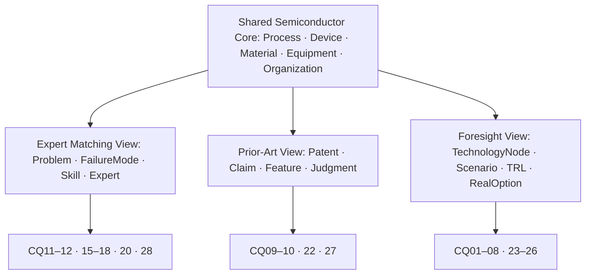
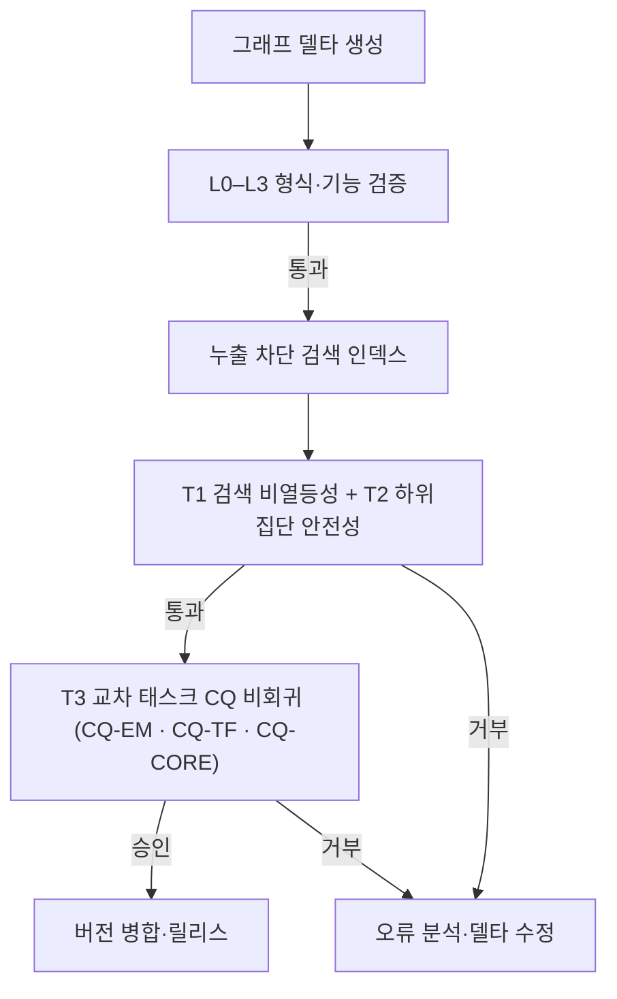

# SDKB: 태스크 확장형 반도체 도메인 온톨로지 데이터셋의 검증 게이트 기반 진화 — 선행기술 검색 주 검증과 교차 태스크 비회귀

**SDKB: Validation-Gated Evolution of a Task-Extensible Semiconductor Domain Ontology Dataset with Prior-Art Retrieval as the Primary Validation Task and Cross-Task Non-Regression as a Safety Condition**

> **원고 상태: v0.9 통합 초안 (2026-07-25).**
> 본 원고는 두 v0.8 계열 초안을 병합한 것이다. 「신규기조 초안 v0.8.1」의 원고 골격(태스크 확장형 프레이밍, 과제 의미 회귀 정의, L0–L3+T-gate 구조, 도달성 사다리, 다중 분모 규율, 완전한 참고문헌·사전등록 장치)을 기반으로 하고, 「검증게이트 개정2판」의 핵심 방법론 자산(단일 태스크 게이트의 과적합 위험 논증, cross-task CQ 비회귀 조건, 음성 대조군 절제, 과적합 표적 결함군, 게이트 유발 표류 위협, AEI 심사 리스크·CI 배선·의사결정 임계치 부록)을 이식했다.
> **병합 후 T-gate는 3조건(T1 비열등성 · T2 하위집단 안전성 · T3 교차 태스크 CQ 비회귀)으로 확장된다.** 저장소에서 재현된 사실은 "관측 결과", 미수행 실험은 "예상 발견" 또는 `[실험 후 기입]`으로 구분한다.

---

## 국문 초록

반도체 도메인의 지식집약 공학 태스크는 공정·소자·재료·장비 지식만으로 완결되지 않는다. 기술문제와 전문가 역량의 연결, 청구항과 선행기술의 대응, 시간에 따른 기술신호와 사업화 선택을 서로 다른 관점에서 표현해야 한다. 본 논문은 이러한 요구를 하나의 공유 의미 백본으로 통합한 **태스크 확장형 반도체 도메인 온톨로지 데이터셋 SDKB(Semiconductor Domain Knowledge Base)**를 제시한다. SDKB의 실재 T-Box는 `Process`, `SubProcess`, `Device`, `Material`, `Equipment`, `FailureMode`, `Skill`, `Organization`을 공유 코어로 삼아 (1) Problem–RootCause–Skill–Expert 중심의 전문가 매칭, (2) Patent–Claim–ClaimFeature–PriorArtJudgment 중심의 선행기술조사, (3) TechnologyNode–Scenario–STEEPVEFactor–RealOption–TRL 중심의 기술예측이라는 세 태스크 뷰를 지원한다. 세 뷰의 표현 가능성은 SHACL(Shapes Constraint Language)과 28개 역량질문(competency question, CQ)으로 검증하되, 세 태스크의 성능이 동일한 수준으로 검증되었다고 주장하지 않는다.

본 연구는 심사관 인용 약한 정답을 확보한 **선행기술 검색을 주 경험적 검증 태스크**로 선택한다. 그러나 온톨로지가 세 태스크를 공유 어휘로 지탱하는 구조에서는, 단일 태스크 성능만으로 보강을 게이트하면 온톨로지가 그 태스크에 과적합되어 다른 태스크의 질의 경로를 조용히 훼손할 수 있다 — 예컨대 검색 재현율을 높이기 위한 개념 병합은 전문가 매칭의 `Skill` 변별력을 떨어뜨릴 수 있다. 이에 본 연구는 SDKB의 신선도·무결성(L0), SHACL 구조 제약(L1), 논리 일관성(L2), CQ 기능 검증(L3)을 보존하면서, 병합 전에 (T1) 검색 성능 비열등성, (T2) 거절근거·공정군 하위집단 안전성, (T3) **타 태스크 CQ 통과율 비회귀**를 함께 검사하는 3조건 과제 게이트(T-gate)를 제안한다.

거절 특허 1,000건과 심사관 인용 2,534건은 완전한 정답이 아닌 **심사관 검토에 정박된 양성 전용 약한 적합성 판단**으로 사용한다. 질의 인용 간선을 제거하고 시간·특허 패밀리를 분리한 평가에서 BM25, 특허 임베딩, 텍스트 하이브리드, 분류코드, 도메인 온톨로지 및 청구항 한정요소 재순위화를 Recall@100, Success@K, MRR@K와 nDCG@20으로 비교한다. 결함주입 실험은 형식 검증(L0–L3)만 통과하는 의미 결함과 함께 **게이트 태스크와 무관한 교차 태스크 결함**(동의어 오병합, 계층 역전)을 주입해 T3의 독립적 필요성을 검정하고, 절제 실험은 전문가 매칭 전용 계층을 **음성 대조군**으로 사용해 청구항 한정요소·거절근거 계층 효과의 특이성을 확립한다.

저장소 감사는 데이터셋의 표현 범위와 검색 준비도 사이의 차이를 드러낸다. 인용 선행기술의 노드 도달성은 95.3%인 반면 도메인 의미 관계 도달성은 54.6–70.5%이며, CQ10의 후보 수 증가는 후보 생성 능력이지 적합성 순위의 증거가 아니다. 본 연구는 데이터셋의 **넓은 태스크 표현 범위**와 하나의 운영 태스크에 대한 **집중된 정량 검증**, 그리고 나머지 태스크에 대한 **회귀 감시**를 분리·결합함으로써, 온톨로지 품질을 "그래프가 유효한가"에서 "과제 성능을 보존하며, 다른 태스크를 훼손하지 않고 진화하는가"로 확장한다.

**주제어:** 반도체 도메인 온톨로지 데이터셋, 태스크 확장형 온톨로지, 온톨로지 진화, 검증 게이트, 교차 태스크 비회귀, 선행기술 검색, 심사관 인용, 청구항 한정요소, SHACL, 누출 통제 평가

---

## Abstract

Knowledge-intensive engineering tasks in the semiconductor domain require more than process, device, material, and equipment taxonomies. They must connect technical problems to expert capabilities, patent claims to prior art, and time-indexed technology signals to strategic options. This paper presents the Semiconductor Domain Knowledge Base (SDKB), a **task-extensible semiconductor domain ontology dataset** whose shared T-Box supports three application views: expert matching through Problem–RootCause–Skill–Expert concepts; prior-art retrieval through Patent–Claim–ClaimFeature–PriorArtJudgment concepts; and technology foresight through TechnologyNode–Scenario–STEEPVEFactor–RealOption–TRL concepts. SHACL constraints and 28 competency questions (CQs) examine representational adequacy across these views; we do not claim that all three tasks have been performance-validated to the same degree.

Prior-art retrieval is selected as the primary empirical task because examiner-grounded weak relevance judgments are available. However, when a single T-Box sustains three tasks through shared vocabulary, gating enrichment on one task's performance risks overfitting the ontology to that task and silently degrading the query paths of the others — concept merging that raises retrieval recall, for example, can erode the discriminative power of expert-matching `Skill` concepts. We therefore retain SDKB's four validation layers — freshness and integrity (L0), SHACL constraints (L1), logical consistency (L2), and CQ functionality (L3) — and introduce a three-condition task gate (T-gate) that checks, before any ontology delta is merged: (T1) non-inferiority of retrieval performance, (T2) subgroup safety across rejection grounds and process groups, and (T3) **cross-task non-regression of CQ pass rates for the remaining tasks**.

The benchmark uses 1,000 rejected patent applications and 2,534 examiner-cited references as examiner-validated, positive-only weak relevance judgments rather than exhaustive ground truth. Evaluation is citation-edge-masked, temporally valid, and patent-family-disjoint. BM25, patent encoders, text-hybrid retrieval, classification-based retrieval, domain-ontology retrieval, and claim-feature reranking are compared using Recall@100 as the primary metric. Fault-injection experiments include not only semantically corrupted deltas that pass formal validation, but also **cross-task faults** (synonym over-merging, hierarchy inversion) that only T3 is expected to detect, establishing the independent necessity of the cross-task condition. Ablation employs the expert-matching-only layer as a **negative control** to establish the specificity of claim-feature and rejection-ground effects.

A repository audit distinguishes ontology scope from task readiness: node-level reachability of examiner-cited prior art is 95.3%, whereas domain-semantic reachability ranges from 54.6% to 70.5%, and CQ10 candidate growth demonstrates candidate-generation capacity, not ranked relevance. The paper thus combines broad multi-task representational scope, focused quantitative validation of one operational task, and regression surveillance of the remaining tasks, extending ontology quality from "is the graph valid" to "does the graph evolve while preserving task performance without harming its sibling tasks."

**Keywords:** semiconductor domain ontology dataset, task-extensible ontology, ontology evolution, validation gate, cross-task non-regression, prior-art retrieval, examiner citations, claim features, SHACL, leakage-controlled evaluation

---

## 약어표 (Nomenclature)

본 논문에서 사용하는 약어는 아래와 같다. 본문에서는 각 약어를 처음 사용할 때 전체 명칭과 병기하고 이후에는 약어만 사용한다.

| 약어 | 전체 명칭 |
|---|---|
| AEI | Advanced Engineering Informatics (대상 저널) |
| BM25 | Okapi Best Matching 25 (어휘 기반 순위 함수) |
| bpref | binary preference (불완전 qrel 강건 지표) |
| CI | confidence interval (신뢰구간; 통계 문맥) / continuous integration (지속적 통합; 공학 문맥) |
| CLEF-IP | Conference and Labs of the Evaluation Forum – Intellectual Property track |
| CPC | Cooperative Patent Classification (협력적 특허분류) |
| CQ | competency question (역량질문) |
| DOCDB | EPO Master Documentation Database (특허 패밀리 식별 기준) |
| EPO | European Patent Office (유럽특허청) |
| FTerm | 일본 특허청 F-term 기술분류 |
| GT | ground truth (정답) |
| IPC | International Patent Classification (국제특허분류) |
| KG | knowledge graph (지식그래프) |
| KIPRIS | Korea Intellectual Property Rights Information Service (특허정보넷) |
| KSIA | Korea Semiconductor Industry Association (한국반도체산업협회) |
| MAP | mean average precision (평균 정밀도의 평균) |
| MRR | mean reciprocal rank (평균 역순위) |
| nDCG | normalized discounted cumulative gain (정규화 할인 누적 이득) |
| qrel | relevance judgment (적합성 판단; 정보검색 관행 표기) |
| RBV | resource-based view (자원기반관점) |
| RDF | Resource Description Framework |
| SDKB | Semiconductor Domain Knowledge Base (반도체 도메인 지식 베이스) |
| SHACL | Shapes Constraint Language (W3C 구조 제약 언어) |
| SPARQL | SPARQL Protocol and RDF Query Language |
| TDD | test-driven development (테스트 주도 개발) |
| TRL | technology readiness level (기술성숙도) |
| TTL | Turtle (RDF 텍스트 직렬화 형식) |
| USPTO | United States Patent and Trademark Office (미국 특허상표청) |
| W3C | World Wide Web Consortium |

내부 기호는 다음과 같으며, 정의 위치를 함께 표시한다.

| 기호 | 의미 (정의 위치) |
|---|---|
| T-Box / ABox | 스키마 어휘 / 인스턴스 단언 (§3.1.5) |
| G0 / G1 / G2 | SDKB 그래프 계보 — 코어 / 확장 / 외부 코퍼스 적용 (§3.2) |
| L0–L3 | 형식 검증 4층 — 신선도·무결성, SHACL, 논리 일관성, CQ 기능 (§4.1) |
| T-gate, T1–T3 | 3조건 과제 게이트 — 비열등성, 하위집단 안전성, 교차 태스크 CQ 비회귀 (§4.1, §4.9) |
| RQ1–RQ3, H1–H5 | 연구 질문과 확증 가설 (§1.4) |
| B0–B5, P0–P2 | 비교 시스템 — 기준선과 제안 시스템 (§4.6) |
| A1–A8 | 절제(ablation) 실험 조건; A8은 음성 대조군 (§5.4) |
| CQ-PA / CQ-EM / CQ-TF / CQ-CORE | 태스크별 CQ 스위트 — 선행기술조사 / 전문가 매칭 / 기술예측 / 공유 코어 (§3.1.6) |
| \(\epsilon\), \(\delta\) | 비열등성 허용한계(0.02), 하위집단 하락 한계(0.05) (§4.9) |

---

# 1. 서론

## 1.1 문제 제기

반도체 산업의 지식은 공정·소자·재료·장비의 분류만으로 충분히 표현되지 않는다. 현장의 기술문제는 FailureMode–RootCause–Mitigation의 인과구조와 이를 해결할 Skill–Expert–ExpertCase의 역량구조에 연결되어야 한다. 특허 분석에서는 Patent–Claim–ClaimFeature–PriorArtJudgment가 필요하며, 기술기획에서는 TechnologyNode의 시간 변화가 Scenario–STEEPVEFactor–RealOption–TRL과 연결되어야 한다. 이 개념들은 독립된 데이터 사일로가 아니라 `Process`, `SubProcess`, `Device`, `Material`, `Equipment`, `Organization`을 공유하는 반도체 도메인 지식의 서로 다른 사용 관점이다.

SDKB(Semiconductor Domain Knowledge Base)는 이 문제를 해결하기 위해 전문가 매칭, 선행기술조사, 기술예측이라는 세 요구를 거치며 진화한 반도체 도메인 온톨로지 데이터셋이다. 본 연구에서 **태스크 확장형(task-extensible)**이란 하나의 온톨로지가 모든 과제에서 같은 성능을 낸다는 뜻이 아니다. 공유 T-Box(terminological box; 스키마 어휘)의 안정된 개념과 IRI를 보존하면서 태스크별 클래스·관계·제약·역량질문(competency question, CQ)과 ABox(assertional box; 인스턴스 단언)를 추가할 수 있고, 각 확장이 기존 구조와 기능을 훼손하지 않는다는 뜻이다. 따라서 데이터셋의 표현 범위와 개별 태스크의 성능 검증 수준은 구분해야 한다.

세 태스크 가운데 선행기술 검색은 정량적 과제 타당성을 가장 직접적으로 평가할 수 있다. 선행기술 검색은 단순한 유사 문서 검색이 아니다. 특허 청구항은 하나의 긴 문장 안에 구성요소, 공정 조건, 기능적 관계와 결과를 결합하며, 관련 선행기술은 같은 발명을 다른 용어·분류·추상화 수준으로 기술할 수 있다. 반도체 분야에서는 같은 물리 현상이 식각, 증착, 세정, 계측, 소자 구조 또는 패키징의 문맥에 따라 다르게 표현된다. 따라서 표면 어휘가 겹치지 않아도 기술적으로 관련된 문헌을 회수해야 하며, 반대로 같은 용어를 공유하더라도 청구항의 핵심 한정요소를 충족하지 못하면 강한 선행기술이 아닐 수 있다.

현재의 특허 검색 연구는 BM25(Okapi Best Matching 25)와 같은 어휘 검색, 문서·청구항 임베딩, 인용 네트워크, 또는 이들의 하이브리드에 집중한다(Lupu & Hanbury, 2013; Krestel et al., 2021; Mahdabi & Crestani, 2014; Risch et al., 2020). 이 흐름은 검색 성능을 직접 측정한다는 장점이 있지만, 왜 두 문헌이 기술적으로 연결되는지 설명하거나 공정·소자·재료·고장·청구항 구성요소 사이의 명시적 관계를 활용하는 데 한계가 있다. 반면 온톨로지 공학은 형식적 일관성, 제약 준수, CQ와 같은 내부 품질을 정교하게 검증하지만(Grüninger & Fox, 1995; Kontokostas et al., 2014; W3C, 2017), 그러한 통과가 실제 검색 품질을 보장하는지는 별도의 경험적 문제다.

이 간극은 온톨로지 진화 과정에서 더 중요해진다. 새 특허와 개념 링크를 추가한 뒤 SHACL(Shapes Constraint Language)과 추론기와 CQ가 모두 통과하더라도, 잘못된 개념 정렬이나 과도하게 평탄화된 계층이 후보 순위를 훼손할 수 있다. 반대로 검색 재현율이 유지되어도 구조 위반이나 미래정보 누출이 숨어 있을 수 있다. 즉 구조적 유효성과 과제 적합성은 대체 관계가 아니라 상보적 검증 층이다.

SDKB의 발전 경로는 세 단계로 정리된다. **첫째, 전문가 매칭 단계**에서 Problem, FailureMode, RootCause, Skill, Expert와 반도체 공정·장비·재료의 연결을 구축해 개념 타당성을 형성했다. **둘째, 선행기술조사 단계**에서 거절 특허, 심사관·출원인 인용, IPC(International Patent Classification)/CPC(Cooperative Patent Classification)/FTerm(일본 특허청 F-term 분류), Claim, ClaimFeature와 PriorArtJudgment를 보강해 제도적으로 검토된 근거 축을 추가했다. **셋째, 기술예측 단계**에서 TechnologyNode, Scenario, STEEPVEFactor, RealOption, TRL(technology readiness level), RBV(resource-based view, 자원기반관점)와 `filingDate`를 이용하는 시간 축을 확장했다. v0.7은 G0·G1·G2, 28개 CQ, SHACL shapes, 매핑 규칙과 L0–L3 게이트를 통해 주로 세 번째 확장을 검증했다.

현재 G0에는 거절 특허와 심사관 인용 선행기술이 포함되고, 청구항 한정요소와 거절판단을 표현하는 T-Box가 반영되어 있다. 이 자원은 다음 질문을 가능하게 한다. **세 태스크를 표현하는 반도체 도메인 온톨로지 데이터셋의 진화가 주 운영 태스크인 선행기술 검색 성능을 보존하거나 개선하면서, 나머지 태스크의 기능을 훼손하지 않는가?** 본 연구는 이 질문을 주 검정으로 삼는다.

## 1.2 핵심 개념 1: 과제 의미 회귀

본 연구는 **과제 의미 회귀(task-semantic regression)**를 다음과 같이 정의한다.

> 온톨로지 또는 ABox의 변경이 L0–L3의 신선도·구조·논리·CQ 검증을 통과하지만, 동결된 누출 방지 평가집합에서 검색 성능 또는 중요 하위집단의 성능을 사전 허용치보다 저하시키는 현상.

이 정의에는 세 가지 함의가 있다. 첫째, 온톨로지 품질은 산출물의 내부 속성만이 아니라 사용 과제와의 관계로 측정된다. 둘째, 검색 성능 하나가 온톨로지 품질 전체를 대체하지 않는다. 셋째, "개선"뿐 아니라 "기존 성능을 해치지 않는 진화"도 실무적으로 중요한 성공 조건이다.

## 1.3 핵심 개념 2: 왜 단일 태스크 게이트로는 부족한가 — 교차 태스크 회귀

여기서 두 번째 방법론적 함정이 발생한다. **온톨로지가 하나의 태스크만 서비스한다면, 그 태스크 성능으로 보강을 게이트하는 것은 순환에 가깝다.** 평가하는 바로 그 지표에 온톨로지를 맞추는 것이므로, "그렇다면 온톨로지를 게이트할 것이 아니라 검색 모델을 튜닝하면 되지 않는가"라는 반론에 취약하다.

SDKB는 이 함정을 벗어난다. SDKB의 T-Box는 전문가 매칭·선행기술조사·기술예측의 세 태스크를 동시에 지탱하며(§3.1), 세 태스크는 상당 부분 공유 어휘(`Process`, `SubProcess`, `Material`, `Equipment`, `Organization`)를 통해 결합되어 있다. 이 구조에서는 한 태스크에 유익한 보강이 다른 태스크의 질의 경로를 조용히 훼손할 수 있다. 예컨대 검색 재현율을 높이기 위한 개념 병합(concept merging)은 전문가 매칭의 `Skill` 변별력을 떨어뜨리고, 특허 인스턴스 대량 주입은 기술예측의 `TechnologyNode` 시계열 분포를 왜곡할 수 있다. 이를 **교차 태스크 회귀(cross-task regression)**라 부르며, 소프트웨어 공학의 회귀 문제와 구조적으로 동일하다. **교차 태스크 회귀가 실재할 수 있기 때문에, 과제 게이트에는 검색 비열등성(T1)만이 아니라 타 태스크 비회귀(T3)가 필요하다**는 것이 본 연구의 두 번째 출발점이다.

따라서 본 연구는 **깊이의 비대칭** 전략을 취한다. 세 태스크를 모두 기술하되, 정량 평가는 근거 자산이 가장 강한 선행기술 검색 하나에 집중하고, 나머지 두 태스크는 CQ 통과율 기반 회귀 감시 대상으로 둔다.

| 태스크 | 논문에서의 역할 | 증거 수준 |
|---|---|---|
| 선행기술조사 | **게이트 태스크** (주 정량 검증) | Recall@K·nDCG, 신뢰구간, T1·T2 |
| 전문가 매칭 | 회귀 감시 대상 (T3) + 절제 음성 대조군 | CQ 통과율 + 절제 시 영향 |
| 기술예측 | 회귀 감시 대상 (T3) + 2차 재사용 사례 | CQ 통과율 + 시간 백테스트 사례 |

## 1.4 연구 질문과 가설

연구 질문은 세 개이며, 각 질문에 확증 가설을 최소한으로 배정한다. 확증 가설은 다섯 개(H1–H5)로 한정하고, 나머지 분석은 탐색적 분석으로 강등하여 방법론과 실험 계획의 복잡도를 낮춘다.

**RQ1. 검증 게이트.** 3조건 T-gate(T1 비열등성 · T2 하위집단 안전성 · T3 교차 태스크 비회귀)는 L0–L3가 놓치는 의미 결함을 탐지하면서, 승인된 그래프 변경의 태스크 성능을 보존하는가?

- **H1(게이트 판별력).** T-gate는 L0–L3를 통과하는 의미 결함 주입을 추가로 탐지하며, 특히 게이트 태스크와 무관한 교차 태스크 결함군 — 동의어 오병합, 공유 계층 역전 — 은 **T3에서만 검출된다.** 판정 기준: 결함 단위 대응 McNemar \(p<.05\), 정상 델타 위양성률 5% 이하, 층별(L0–L3·T1·T2·T3) 검출 매트릭스.
- **H2(승인 안전성).** T-gate가 승인한 델타는 동결 테스트셋 Recall@100에서 비열등하고(허용한계 \(\epsilon=0.02\)), 거절근거·공정군 하위집단의 절대 하락이 \(\delta=0.05\)를 넘지 않는다.

**RQ2. 검색 유용성.** 누출을 차단한 시간·패밀리 분리 평가에서, 온톨로지 보강 하이브리드 검색은 강한 텍스트 기준선을 개선하는가?

- **H3(하이브리드 효과).** 하이브리드는 가장 강한 텍스트 전용 기준선보다 Recall@100과 nDCG@20이 높고, 그 개선폭은 질의–정답 문헌의 어휘 중첩이 낮은 집단에서 더 크다.

**RQ3. 계층 기여와 특이성.** 어떤 지식 계층이 검색 이득을 만들며, 그 효과는 해당 계층에 특이적인가?

- **H4(계층 기여).** ClaimFeature·거절판단 계층의 제거 손실이 CPC/IPC 또는 서지 계층의 제거 손실보다 크다.
- **H5(특이성 — 음성 대조군).** 게이트 태스크와 무관한 전문가 매칭 전용 계층(`Skill`·`ExpertCase`·`Mitigation`)의 제거는 검색 성능을 유의하게 바꾸지 않는다. 이 예측이 깨지면 태스크 결합(task entanglement)의 발견으로 보고하며, 이는 교차 태스크 게이트 T3의 필요성을 오히려 강화한다(§7.6). 어느 쪽 결과든 해석 가능하다.

운용 효율(동일 재현율에서의 검토 후보 절감), 신규성·진보성 거절 유형별 신호 차이, 노드–의미 도달성과 성능의 관계는 확증 가설에서 제외하고 **탐색적 분석**으로만 보고한다(§4.8, §5.3, §6.4).

## 1.5 연구 기여

본 연구의 기여는 세 가지이며, 결론의 주장 순서와 일치한다.

1. **정합성·완전성이 검증된 반도체 도메인 온톨로지 데이터셋.** 공정·소자·재료·장비·역량·특허를 하나의 공유 T-Box로 통합하고, 최종 정리된 T-Box와 A-Box(G0–G2)를 SHACL 제약, CQ 응답, 도달성 사다리로 계량 보고하는 재현 가능한 SDKB 릴리스를 제공한다.
2. **다중 태스크 작동성의 실험적 검증.** 전문가 매칭(소부장 문제 대응)·선행기술조사·기술예측의 세 태스크 뷰가 동일 T-Box 위에서 상호 간섭 없이 작동함을, L0–L3에 3조건 T-gate(T1·T2·T3)를 더한 검증 게이트와 교차 태스크 결함 주입 실험으로 확인한다.
3. **선행기술조사 태스크의 성능·유용성 실증.** 거절 특허와 심사관 인용을 정박점으로 삼은 누출 차단 벤치마크에서, 선행기술조사 뷰의 온톨로지 데이터셋을 이용한 검색이 성능을 보장하고 활용도가 높음을 계층별 기여 분해와 함께 증명한다.

전문가 매칭의 방법론과 성능 평가는 본 논문의 범위 밖이며(§8.3), 기술예측과 소부장 코퍼스는 동일 T-Box의 재사용 가능성을 보이는 2차 증거로만 배치한다.

## 1.6 논문의 구성

2장은 특허 검색, 온톨로지 품질과 진화 검증, 태스크 확장형 데이터셋과 지식그래프 하이브리드를 검토한다. 3장은 SDKB의 공유 코어, 세 태스크 뷰, 그래프 계보와 검색 근거 구조를 기술한다. 4장은 누출 방지 벤치마크와 3조건 T-gate를 제시한다. 5장은 실험 설계와 통계 분석 계획을 제시한다. 6장은 T-Box·CQ에서 확인된 표현 범위와 검색 자원 관측 결과를 먼저 보고하고, 이어 미실측 검색 결과 틀을 제시한다. 7장은 예상 발견과 신규 주장의 반증 조건을 명시한다. 8장은 비대칭 태스크 검증의 시사점을, 9장은 한계를, 10장과 11장은 가용성과 결론을 제시한다.

---
# 2. 이론적 배경과 관련연구

## 2.1 선행기술 검색의 평가 단위

특허 검색은 긴 문서, 반복적 법률 문구, 다언어 표현, 기술 용어의 시간 변화 때문에 일반 웹 검색과 다르다. 특히 선행기술 검색의 목적은 평균적으로 비슷한 문서를 찾는 것이 아니라, 특정 청구항의 신규성 또는 진보성 판단에 관련될 수 있는 소수 문헌을 높은 재현율로 회수하는 데 있다. 따라서 실무적 1차 지표는 상위 몇 건의 정확도만이 아니라 충분한 깊이에서 알려진 관련 문헌을 놓치지 않는 Recall@K가 된다(Lupu & Hanbury, 2013; Shalaby & Zadrozny, 2019).

벤치마크 측면에서 CLEF-IP(Conference and Labs of the Evaluation Forum – Intellectual Property track, 2009–2013)는 EPO(European Patent Office, 유럽특허청) 기반 대규모 특허 컬렉션으로 선행기술 검색·분류를 평가한 대표 캠페인이며, 관련도 판정을 심사관 인용으로 생성했다. 특히 2012–2013 passage retrieval 태스크는 심사관 보고서의 X(신규성 파괴)·Y(진보성 파괴) 인용을 highly-relevant로 처리해, 인용 등급을 평가에 반영하는 선례를 제공한다. PatentMatch(Risch et al., 2020)는 EPO 심사관이 X/Y/A로 등급화한 청구항–선행문헌 구절 대응을 제공해 청구항 수준 평가의 직접 비교 대상이 되고, BigPatent(Sharma et al., 2019)는 130만 미국 특허 요약 데이터셋으로 도메인 코퍼스 규모의 기준점을 제공한다. 최근 PatenTEB(Kherwa et al., 2025)는 비대칭 검색을 포함한 15개 태스크의 특허 텍스트 임베딩 벤치마크를 제시해 신규성 비교선을 최신화한다.

기존 검색 연구는 세 방향으로 발전했다. 첫째, BM25와 필드 가중 검색은 제목·초록·청구항의 어휘 증거를 결합한다. 둘째, PatentBERT, PatentSBERTa, PaECTER와 같은 특허 특화 표현은 문장 또는 문서 수준의 의미 유사도를 학습한다(Bekamiri et al., 2024; Ghosh et al., 2024). 셋째, 인용 네트워크와 질의 문서의 구조를 이용해 후보를 확장하거나 재순위화한다(Mahdabi & Crestani, 2014). 최근 조사 연구는 강한 검색 시스템이 하나의 표현에 의존하기보다 어휘, 의미, 분류, 인용, 메타데이터를 결합하는 방향으로 이동했음을 보여준다(Krestel et al., 2021; Shomee et al., 2025).

그러나 "검색 단위"는 여전히 쟁점이다. 문서 수준 검색은 확장성과 벤치마크 구성이 쉽지만, 심사 판단은 청구항과 그 한정요소에 관여한다. 본 연구는 전체 거절 특허에 대해서는 문헌 수준 평가를 1차 분석으로 유지하고, 명시적 `PriorArtJudgment–aboutClaim–overPriorArt` 연결이 있는 부분집합에서 청구항 수준 분석을 2차로 수행한다. 이렇게 해야 풍부한 부분집합을 전체 데이터의 속성으로 일반화하는 오류를 피할 수 있다.

## 2.2 심사관 인용은 정답이 아니라 관측된 양성이다

특허 검색 벤치마크는 질의 특허가 인용한 문헌을 관련 문헌으로 사용하는 경우가 많다. CLEF-IP 계열에서는 질의에서 인용 정보를 제거한 뒤 그 인용을 적합성 판단으로 사용한다(Mahdabi & Crestani, 2014). 이는 대규모 평가를 가능하게 하지만, 인용되지 않은 문헌을 비관련으로 확정할 수 없다는 한계가 있다. 심사관 인용과 출원인 인용은 생성 과정과 의미가 다르다. 미국 특허의 실증 연구는 심사관 인용이 전체 인용의 상당 부분을 차지하고, 상당수 특허에서 인용 전량이 심사관 추가임을 보였다(Alcácer & Gittelman, 2006; Alcácer et al., 2009). 심사관의 검색 역시 이용 가능한 시간과 분류, 관할, 검색전략에 제약되며, USPTO(United States Patent and Trademark Office, 미국 특허상표청) 심사 지침은 텍스트 검색만으로 충분하지 않을 수 있어 분류 검색을 함께 사용하도록 설명한다(USPTO, 2023).

정보검색 평가의 불완전 적합성 판정(incomplete relevance judgments; 이하 관행에 따라 qrel로 표기)·pooling bias 문헌은 판정 풀에 기여하지 않은 시스템이 체계적으로 불리해짐을 보이고, bpref(binary preference)와 같은 미판정-강건 지표를 권고한다(Buckley & Voorhees, 2004; Büttcher et al., 2007). 따라서 본 연구는 심사관 인용을 다음과 같이 사용한다.

- 인용된 문헌은 제도적 검토 과정에서 관측된 **양성 적합성 신호**다.
- 인용되지 않은 문헌은 음성이 아니라 **미관측(unknown)**이다.
- Recall@K는 "알려진 양성을 얼마나 회수했는가"를 측정하며, 전체 법적 관련성을 완전히 측정한다고 해석하지 않는다.
- 미관측 상위 후보의 잠재적 관련성을 확인하기 위해 표본 전문가 판정을 별도로 수행하고 Cohen's \(\kappa\)를 보고한다.
- 신규성·진보성·기재요건 등 거절근거가 섞여 있을 때는 선행기술 적합성과 직접 관련된 거절 유형을 주 분석과 보조 분석으로 구분한다.

이 관점은 SDKB의 2,534개 인용을 "ground truth"라고 단정하는 표현보다 엄밀하다. 이하에서는 이를 **심사관 검증 약한 정답(examiner-validated weak ground truth)** 또는 **양성 전용 qrel**이라 부른다.

## 2.3 온톨로지 품질, 진화 검증과 테스트 주도 접근

온톨로지 품질은 개념화의 명료성, 일관성, 확장성, 최소한의 존재론적 약속과 같은 설계 원칙에서 출발했다(Gruber, 1993). CQ는 온톨로지가 답해야 할 질문을 요구사항과 검증 항목으로 연결하며(Grüninger & Fox, 1995), 최근에는 CQ의 유형학과 자동 검증 가능성이 체계화되고 있다(Keet & Khan, 2024). 테스트 주도 온톨로지 개발(test-driven development, TDD) 계열은 CQ의 전제를 자동 검증 가능한 요구사항으로 형식화했다(Potoniec et al., 2020). RDF(Resource Description Framework) 데이터 품질 연구는 제약 위반과 데이터 오류를 자동 점검하는 방법을 발전시켰고(Kontokostas et al., 2014), SHACL은 이를 표준화된 shape로 표현한다(W3C, 2017). 링크드데이터 품질의 기준점인 Zaveri et al.(2016)은 품질을 18개 차원·69개 지표로 분류했으나 이는 대체로 사후적·기술적(descriptive) 평가 틀이다. 지식그래프(knowledge graph, KG) 연구는 스키마와 인스턴스의 규모가 커질수록 출처, 일관성, 최신성, 완전성의 통합 관리가 중요함을 강조한다(Hogan et al., 2021). 온톨로지 변화 관리 연구는 변경의 분류와 일관성 보존을 다뤄왔다(Flouris et al., 2008).

다운스트림 관점에서 KGrEaT(Heist et al., 2023)는 KG 보강 연구가 다운스트림 성능 향상을 전제로 정당화되면서도 이를 거의 평가하지 않는다는 문제의식 하에, 분류·클러스터링·추천 과제로 KG 품질을 추정하는 프레임워크를 제시했다. 그러나 이는 사후적·비교적 평가에 머문다.

SDKB의 L0–L3는 이 전통을 실용적인 병합 게이트로 구현하고, 본 연구는 그 위에 T-gate를 추가한다.

| 층 | 검증 대상 | 대표 실패 | 본 연구에서의 역할 |
|---|---|---|---|
| L0 | 신선도·무결성 | 낡은 산출물, 해시·입력 불일치 | 재현 가능한 입력 보장 |
| L1 | SHACL 구조 제약 | 필수 속성 누락, 잘못된 범위·카디널리티 | 구조적 유효성 보장 |
| L2 | 논리 일관성 | 모순 타입, 비정상 추론 | 형식 의미 보장 |
| L3 | CQ 기능 | 필수 경로 단절, 태스크 질문 무응답 | 기능적 응답 가능성 보장 |
| T1 | 검색 과제 적합성 | 관련 문헌 순위 하락, 누출 의존 | 주 태스크 성능 보존 |
| T2 | 하위집단 안전성 | 거절근거·공정군별 국소 회귀 | 평균 아래 숨는 실패 차단 |
| T3 | 교차 태스크 CQ 비회귀 | 타 태스크 질의 경로 훼손 | 태스크 과적합 억제 |

T-gate는 L3의 대체가 아니다. CQ가 특정 관계의 존재와 질의 가능성을 확인한다면, T1은 그 관계가 후보 순위에 미치는 결과를 확인하고, T3는 그 확인이 다른 태스크의 희생 위에서 이루어지지 않았음을 확인한다. 예를 들어 CQ10이 90개의 후보를 반환해도 그 안에 심사관 인용 문헌이 얼마나 높은 순위로 포함되는지는 별도의 평가다.

**연구 공백:** 기존 온톨로지·KG 품질 연구는 사후적·비교적 평가에 머물며, 도메인 온톨로지의 지속적 보강을 **릴리스 전 사전 승인 게이트**에 연결한 설계는 제한적이다. 특히 다태스크 온톨로지에서 단일 태스크 게이트가 유발하는 과적합을 교차 태스크 비회귀 조건으로 통제한 사례는 확인되지 않는다.

## 2.4 태스크 확장형 도메인 온톨로지 데이터셋

도메인 온톨로지 데이터셋은 용어 목록이나 하나의 응용모델과 구별된다. 첫째, 여러 데이터 원천을 안정된 식별자와 명시적 의미관계로 통합하는 공유 T-Box가 있어야 한다. 둘째, T-Box의 표현 가능성과 ABox의 실제 완전도를 분리해 보고해야 한다. 셋째, 재사용 가능한 데이터셋이라면 schema, instance graph, provenance, license, validation artifact와 재구축 절차를 함께 제공해야 한다(Wilkinson et al., 2016; Hogan et al., 2021). 넷째, 온톨로지가 진화할 때 기존 태스크의 요구를 훼손하지 않는지 검증해야 한다(Flouris et al., 2008).

본 연구에서 태스크 확장성은 "다목적 성능"의 동의어가 아니다. 하나의 공유 반도체 T-Box \(T_{\mathrm{core}}\) 위에 태스크 뷰 \(V_t=(C_t,R_t,Q_t)\)를 추가할 수 있고, 여기서 \(C_t\), \(R_t\), \(Q_t\)는 각각 해당 태스크가 요구하는 클래스, 관계와 CQ다. 서로 다른 뷰는 `Process`, `Material`, `Equipment`, `Organization`처럼 일부 어휘를 공유할 수 있다. 따라서 다음 두 수준을 구분한다.

- **표현 범위(breadth):** T-Box·SHACL·CQ가 세 태스크의 질문을 표현하고 실행할 수 있는가.
- **과제 검증 깊이(depth):** 실제 정답과 후보 모집단을 사용했을 때 특정 태스크의 성능이 유지되거나 개선되는가.

SDKB는 세 태스크의 표현 범위를 데이터셋 수준에서 제시하고, 이 논문은 그중 선행기술 검색의 검증 깊이를 확장하며, 나머지 두 태스크는 T3의 회귀 감시로 연결한다. 전문가 매칭과 기술예측을 검색 성능 가설에 섞지 않음으로써 "T-Box가 표현한다"와 "태스크 성능이 검증되었다"를 구분한다. 동시에 공유 어휘가 실재하는 만큼, 감시 없는 확장은 교차 태스크 회귀를 방치하는 것이므로 T3가 표현 범위 주장을 지키는 최소한의 안전 조건이 된다.

## 2.5 특허 지식그래프와 하이브리드 검색

특허 검색에서 그래프는 인용, 발명자, 출원인, 분류코드 또는 기술 개념을 통해 어휘 검색의 사각지대를 보완할 수 있다. 질의 중심 인용망 마이닝은 초기 검색 결과에서 인용 경로를 확장해 재현율을 높이는 접근을 보였다(Mahdabi & Crestani, 2014). 텍스트와 인용·발명자 정보를 결합한 지식그래프 임베딩 역시 기술적으로 관련된 특허를 찾는 데 구조 신호가 유용함을 제시한다(Siddharth et al., 2022). PaECTER는 인용 관계를 학습 신호로 활용한 특허 표현이 특허 검색과 분류에 기여할 수 있음을 보이고(Ghosh et al., 2024), IPRally의 Graph Transformer는 발명을 특징–관계 그래프로 표현하고 심사관 인용을 관련성 신호로 하는 밀집 검색으로 텍스트 임베딩 대비 향상을 보고한다(Daniell et al., 2025).

그러나 이 연구들에서 그래프는 대개 성능을 위한 입력 표현이다. 그래프 자체가 계속 진화할 때 어떤 변경을 허용할지, 구조적으로 유효하지만 검색을 해치는 변경을 어떻게 차단할지는 충분히 다뤄지지 않았다. 반대로 온톨로지 진화 연구는 변경 전후의 일관성과 요구사항을 다루지만, 특허 검색의 누출 방지 성능을 병합 게이트로 사용하지 않는다. 본 연구는 "KG를 쓰면 검색이 좋아진다"를 재주장하지 않으며, **"검색 성능으로 KG의 진화를 통제하되, 그 통제가 다른 태스크를 훼손하지 않도록 감시한다"**는 방향에 기여를 둔다. 본 연구의 공백은 요소적 신규성이 아니라 다음 결합에 있다.

> **다층 형식 검증 + 심사관 정박 검색 평가 + 누출 방지 시간·패밀리 분할 + 교차 태스크 표적 결함 주입 + 음성 대조군 절제 + 병합 전 3조건 과제 회귀 의사결정**

## 2.6 관련연구 대비 연구 위치

| 연구 흐름 | 대표 평가 | 장점 | 남는 공백 | 본 연구의 확장 |
|---|---|---|---|---|
| 특허 텍스트 검색 | Recall, MAP, MRR, nDCG | 과제 성능 직접 측정 | 명시적 도메인 의미와 그래프 진화 검증 부족 | 반도체 온톨로지 계층을 후보·재순위화에 결합 |
| 인용·KG 검색 | 인용 qrel 기반 순위 성능 | 관계 신호 활용 | 질의 인용 누출 및 변화 게이트 문제 | 질의 간선 마스킹, 시간·패밀리 분리 |
| 온톨로지 검증 | SHACL, 추론, CQ | 형식 오류와 기능 단절 탐지 | 순위 품질·교차 태스크 회귀를 보장하지 않음 | 3조건 T-gate와 비열등 병합 규칙 |
| KG 다운스트림 평가 | 분류·클러스터링·추천 과제 성능 | 과제 관점 품질 추정 | 사후 비교에 머물고 승인 게이트가 아님 | 릴리스 전 사전 승인 게이트로 전환 |
| 도메인 온톨로지 데이터셋 | FAIR, 스키마·인스턴스·CQ·provenance | 재사용 가능한 의미 백본 | 다중 태스크 표현과 단일 태스크 성능의 혼동 | 세 태스크 뷰·비대칭 검증·T3 감시 명시 |
| 특허 분석·기술예측 | 추세, 클러스터, 조기신호 | 전략적 재사용 가치 | 검색 적합성의 직접 증거가 아님 | 2차 재사용 사례로 분리 |

"최초"를 주장하기보다 이 결합과 실험설계의 차별성을 강조한다.

---
# 3. SDKB 반도체 도메인 온톨로지 데이터셋과 근거 구조

## 3.1 공유 T-Box와 세 태스크 뷰

SDKB의 T-Box는 선행기술 검색을 위해 새로 만든 단일목적 스키마가 아니다. 실제 TTL(Turtle) 파일에는 반도체 공정·소자·재료·장비·고장·역량·특허·기업·기술전략 어휘가 함께 존재하며, 전문가 매칭, 선행기술조사와 기술예측이라는 세 태스크가 이를 서로 다른 경로로 사용한다. 이를 다음과 같이 표현한다.

\[
T_{\mathrm{SDKB}}
=T_{\mathrm{core}}\cup V_{\mathrm{match}}\cup V_{\mathrm{priorart}}\cup V_{\mathrm{foresight}}
\]

각 \(V_t=(C_t,R_t,Q_t)\)는 태스크별 클래스, 관계와 CQ의 논리적 뷰다. 집합은 배타적 모듈이 아니며 `Process`, `SubProcess`, `Material`, `Equipment`, `Organization`과 같은 공유 개념을 중첩 사용한다. 물리적 TTL 파일 경계보다 실제 클래스·속성과 CQ의 의존관계를 우선해 기술한다.



**그림 1. SDKB 공유 반도체 코어와 세 태스크 뷰.** CQ 번호는 각 뷰의 대표 질문이며, 공급망·규제·조인 성격의 나머지 CQ(13·14·19·21)는 둘 이상의 뷰를 연결한다(§3.1.6).

**공유 어휘가 교차 태스크 회귀의 통로다.** `Process`/`SubProcess`는 전문가 매칭과 기술예측이 공유하고, `Material`·`Equipment`·`Organization`은 전문가 매칭과 선행기술조사가 공유하며, `ClassificationSymbol`(IPC/CPC)은 선행기술조사와 기술예측의 공정 매핑을 잇는다. 즉 세 태스크는 독립적 서브그래프가 아니라 **공유 코어 위의 세 관점**이며, 이 결합이 §1.3에서 기술한 교차 태스크 회귀를 실재하게 만들고 T3의 필요성을 정당화한다.

### 3.1.1 전문가 매칭 뷰

전문가 매칭 뷰는 현장 기술문제를 해결 역량과 연결한다. 주요 클래스는 `Problem`, `RootCause`, `FailureMode`, `Mitigation`, `Skill`, `Expert`, `ExpertCase`, `EquipmentClass`, `EquipmentModel`, `Material`, `Organization`/`Vendor`, `Process`, `SubProcess`다. `exhibitsFailureMode`, `concernsSkill`, `involvesMaterial` 등의 관계는 문제–고장–원인–완화–역량–전문가의 설명 경로를 구성한다. 대표 CQ11·12·15·16·17·18·20·28은 문제와 전문가, 고장 인과, 재료·장비·역량, 사례 경험을 질의한다.

이 뷰의 인력·문제 ABox에는 실 원천을 그대로 공개할 수 없어 비식별 변조한 파생 인스턴스와 결정적으로 생성한 인스턴스가 혼재한다. 따라서 이 논문은 실인물에 대한 사실성이나 전문가 랭킹 성능을 주장하지 않는다. 평가 범위는 T-Box 표현, SHACL 제약, CQ 실행과 provenance의 적절성이며, 본 논문에서 이 뷰는 두 가지 방법론적 역할만 수행한다: (1) T3 회귀 감시의 CQ-EM 스위트 입력, (2) 절제 실험의 음성 대조군(§5.4). 전문가 매칭 태스크 자체의 방법론과 평가는 본 논문의 범위 밖이다(§8.3).

### 3.1.2 선행기술조사 뷰

선행기술조사 뷰는 특허 문헌과 심사 판단을 반도체 도메인 개념에 정렬한다. 주요 클래스·속성 어휘는 `Patent`, `RejectedPatent`, `GrantedPatent`, `PendingPatent`, `CitedPatent`, `Claim`, `ClaimFeature`, `PriorArtJudgment`, `Rejection`, `ClassificationSymbol`(IPC/CPC/FTerm), `NoveltyScore`다. 주요 관계는 `hasPriorArt`, `hasPriorArtExaminer`, `hasPriorArtApplicant`, `cites`, `hasClaim`, `hasFeature`, `featureConcept`, `overlappingFeature`, `rejectedFor`, `aboutClaim`, `overPriorArt`, `onGround`다. 대표 CQ09·10·22·27은 거절·인용 근거, 개념 공유 후보, 분류·신규성 축과 청구항 준비도를 다룬다.

세 뷰 가운데 이 뷰만 거절 특허 1,000건과 심사관 인용 2,534건이라는 제도적으로 정박된 약한 qrel을 가진다. 따라서 본 연구의 T-gate, 하이브리드 검색 비교와 ablation은 이 뷰에 집중한다. `NoveltyScore`는 정답 유래 파생 지표이므로 게이트 평가의 검색 피처에서 배제한다(정답 신호 차단).

### 3.1.3 기술예측 뷰

기술예측 뷰는 `Process`, `SubProcess`, `Device`, `TechnologyNode`를 공유 코어와 연결하고, foresight 어휘인 `Scenario`, `STEEPVEFactor`, `RealOption`, 상용화 성숙도의 `TRL`, RBV 개념과 `filingDate` 시간축을 사용한다. 대표 CQ01–08·23–26은 공정·소자별 특허 분포, 시간 변화, 기술 공백, 규제·상용화 및 전략 시나리오를 질의한다.

기존 v0.7의 조합 개념 기반 조기탐지와 G1·G2 시계열 결과는 이 뷰의 재사용 가능성을 보여준다. 그러나 기술예측 결과는 선행기술 검색 정확도의 증거가 아니며, 새 논문의 확증 가설(H1–H5) 판정에는 사용하지 않는다. 본 논문에서 이 뷰는 T3 회귀 감시의 CQ-TF 스위트 입력이자 2차 재사용 사례(§8.4)다.

### 3.1.4 태스크별 검증 수준

| 태스크 뷰 | T-Box·SHACL | CQ 기능 | ABox/재사용 증거 | 정량 과제 성능 | 본 논문의 지위 |
|---|---|---|---|---|---|
| 전문가 매칭 | 평가 | 대표 CQ 실행 (T3 감시) | 비식별·생성 ABox 존재 | 미평가 (범위 밖) | 표현 타당성 + 음성 대조군 |
| 선행기술조사 | 평가 | 대표 CQ 실행 | 거절특허·심사관 인용·claim sidecar | **Recall@K·MRR·nDCG 및 T-gate 평가** | 주 검증 |
| 기술예측 | 평가 | 대표 CQ 실행 (T3 감시) | G1·G2 및 시간 백테스트 | 기존 조기탐지 결과 | 2차 재사용 |

이 비대칭은 결함이 아니라 주장 범위를 통제하는 설계다. **세 태스크를 덮는 것은 T-Box와 CQ의 관측 사실이고, 세 태스크의 성능이 모두 검증되었다는 주장은 하지 않는다.** 동시에 감시(T3)를 통해 표현 범위 주장 자체가 진화 과정에서 침식되지 않도록 보호한다.

### 3.1.5 T-Box와 ABox의 경계

T-Box에 클래스와 관계가 존재한다고 해서 모든 뷰의 인스턴스가 같은 완전도로 채워졌다는 뜻은 아니다. 최종 원고는 저장소의 동결 커밋에서 전체 및 뷰별 클래스, object property, datatype property의 고유 개수를 자동 산출해 `[TTL 자동계수 후 기입]`한다. ABox는 G0·G1·G2와 claim-feature sidecar별로 분리해 보고하며, 데이터 생성·변조·추출·매핑 경로와 라이선스를 provenance로 연결한다.

### 3.1.6 CQ 태스크 귀속과 세분화 (선결 과제)

세 뷰의 대표 CQ 합계는 8+4+12 = 24개이며, 나머지 CQ13·14·19·21은 공급망·규제 등 둘 이상의 뷰를 연결하는 성격이다. 최종 원고 확정 전에 이 4개를 "공유 코어(CQ-CORE)" 범주로 명시적으로 귀속시키고, T3의 스위트 구성(CQ-EM, CQ-TF, CQ-CORE)을 확정해야 한다. 또한 정량 평가 대상인 선행기술 CQ가 4개(14%)로 가장 적다는 비대칭은 "온톨로지의 가장 작은 조각만 평가한다"는 심사 지적을 부를 수 있으므로, 청구항 수준으로 분해해 8–10개로 세분화하는 것을 선결 과제로 둔다(부록 D의 A-0). 세분화가 어려울 경우 "CQ 개수는 태스크 중요도가 아니라 질의 입도의 함수"임을 본 절에 명시하는 대안이 있으나, 세분화가 더 낫다.

## 3.2 그래프 계보

SDKB는 단일 파일이 아니라 목적과 코퍼스가 다른 버전 계보다.

| 자원 | 트리플 수 | 주요 내용 | 본 연구의 역할 |
|---|---:|---|---|
| G0 | 105,588 | 기준 온톨로지, 거절 특허 1,000건, CitedPatent 3,034개, 심사관 인용, 청구항·거절판단 TBox | 벤치마크 앵커와 기준 그래프 |
| G1 | 924,814 | 종합 반도체 기업 특허 24,179건, claimText 371,267건 | 개발용 도메인 보강 및 변화 후보 |
| G2 | 490,529 | KSIA 188개사 특허 12,339건, claimText 161,184건 | 외부 코퍼스 재사용·전이 분석 |
| Claim-feature sidecar | 11,605,931 | Claim 586,567개, ClaimFeature 1,289,512개, dependsOnClaim 483,394개, PriorArtJudgment 635개 | 한정요소·판단 부분집합 분석 |

이 표에서 가장 중요한 범위 구분은 다음과 같다. **G0에는 청구항–한정요소–거절판단을 표현하는 TBox가 반영되어 있으나, 대규모 ClaimFeature ABox 전체가 G0 내부에 있다는 뜻은 아니다.** 청구항 한정요소와 판단 연결을 이용한 실험은 sidecar와의 조인 범위, 버전, 생성 규칙을 명시해야 한다. 따라서 본 연구는 모든 거절 특허를 포함하는 특허 수준 실험과, 명시적 판단 연결이 있는 부분집합의 청구항 수준 실험을 분리한다.

모든 트리플에는 출처 서명이 부여되어 있으며(105,588 세대 검증), 서명 정합 검사(`check_signatures.py`)는 CI(continuous integration) 게이트 파이프라인에 배선되어 있다(부록 E). SDKB의 큐레이션 소스와 라이선스(SemiKong, SemicONTO, MatKG, USPTO/EPO/KIPO, BIS CCL/EAR, NIST, ECHA SCIP, 산업기술보호법, Wikidata, SEMI Link-Only)는 데이터 가용성 절(§10)과 provenance 매니페스트에 명시한다. 특허 데이터는 KIPRIS(Korea Intellectual Property Rights Information Service, 특허정보넷) 학술정보 활용 자격으로 수집하며, 공개 배포는 메타데이터 전용 경로를 따른다(§3.7).

## 3.3 거절 특허와 선행기술 관계

G0의 거절 특허 축은 다음 관계를 중심으로 구성된다.

- `hasPriorArtExaminer`: 심사관이 인용한 선행기술 문헌 — **누출 통제 시 검색 그래프에서 제거되는 관계**
- `rejectedFor`: 신규성, 진보성 등 거절근거
- `hasClaim` / `dependsOnClaim`: 특허–청구항, 종속항–선행 청구항
- `hasFeature` / `featureConcept`: 청구항–한정요소, 한정요소–도메인 개념
- `hasJudgment` / `aboutClaim` / `overPriorArt` / `onGround` / `overlappingFeature`: 심사관 판단과 그 대상·근거·중첩 한정요소
- `hasPriorArtApplicant`: 출원인 인용 — 심사관 인용과 분리 보존해 출처 혼합 편향(§2.2)을 회피

이 모델은 단순한 "특허 A가 특허 B를 인용한다"를 넘어 "어느 청구항의 어떤 한정요소가 어떤 거절근거 아래 어느 선행기술과 관련되는가"를 표현할 수 있다. 다만 표현 가능성과 실제 인스턴스 완전성은 다르다. 본 연구는 각 분석에서 이용 가능한 관계 수와 결측률을 함께 보고한다.

## 3.4 약한 정답의 다중 해상도 도달성

저장소의 현재 수치는 선행기술 정답 자원이 그래프에 얼마나 연결되어 있는지를 여러 해상도로 보여준다.

| 해상도 | 정의 | 도달성 |
|---|---|---:|
| 노드 도달성 | `hasPriorArtExaminer`의 고유 대상이 그래프 노드로 존재 | 2,211/2,321 = 95.3% |
| Process∪Device 의미 도달성 | 인용문헌이 공정 또는 소자 개념으로 연결 | 54.6% |
| +Material 의미 도달성 | 위 관계에 재료 개념 추가 | 63.4% |
| +전체 의미 링크 | 역량·고장·장비 등 도메인 의미 관계 추가 | 70.5% |
| +CPC/IPC 분류 도달성 | 의미 링크에 분류코드 연결 추가 | 95.3% |
| ClaimFeature 도달성 | 판단 연결이 있는 표본에서 선행기술이 한정요소 수준으로 연결 | 402/584 = 68.8% |

전체 심사관 인용은 2,534건이며 비특허문헌 30건을 포함한다. 반면 2,321은 `hasPriorArtExaminer`의 고유 특허 대상 수다. 2,534, 2,321, 2,211 및 584는 서로 다른 분모이므로 하나의 "정답 수"로 혼용하지 않는다.

이 다중 해상도는 새로운 측정 문제를 제기한다. 노드와 분류코드 수준의 높은 도달성만 보고하면 의미 검색 준비도를 과대평가할 수 있다. 반대로 ClaimFeature 68.8%를 전체 1,000개 질의의 속성으로 간주하면 풍부한 판단 부분집합을 과잉 일반화한다. 따라서 본 연구는 **도달성 사다리(reachability ladder)**를 자원 보고의 기본 단위로 제안한다.

## 3.5 qrel 등급

평가 가능한 증거의 세밀도에 따라 적합성 등급을 정의한다.

| 등급 | 관측 증거 | 사용 |
|---:|---|---|
| 2 | `PriorArtJudgment`가 특정 청구항과 특정 선행문헌을 연결하고 신규성/진보성 근거가 식별됨 | graded nDCG, 청구항 수준 분석 |
| 1 | 특허 수준 `hasPriorArtExaminer` 관계만 확인됨 | Recall, Success, MRR |
| 미관측 | 심사관 인용 관계가 없음 | 음성으로 확정하지 않음 |

등급 2가 등급 1보다 법적 관련성이 반드시 강하다는 뜻은 아니다. 등급은 본 데이터에서 관측된 근거의 해상도를 나타낸다. 등급별 가중치는 개발셋에서만 정하고, 테스트 결과에 맞추어 변경하지 않는다.

## 3.6 비특허문헌과 패밀리

비특허문헌 30건은 특허 후보군만을 대상으로 하는 주 순위평가의 분모에서 제외하고 별도로 보고한다. 특허 패밀리 구성원이 동일 발명을 중복 표현할 수 있으므로, 후보와 qrel은 DOCDB(EPO Master Documentation Database) family_id를 우선 사용해 군집화한다. 하나의 관련 패밀리에서 여러 공개번호가 검색되면 문헌 수준과 패밀리 수준 Recall을 모두 보고하되, 주 결론은 패밀리 수준 결과에 둔다. family_id가 없는 문헌은 출원번호·우선권 정보에 기반한 대체 규칙을 적용하고 그 비율을 보고한다.

## 3.7 릴리스 분리

평가 누출을 방지하기 위해 배포 논리를 다음과 같이 분리한다.

- `g:core`: 공개 가능한 온톨로지, 비민감 메타데이터와 개념 링크
- `g:qrels-dev`: 개발·검증에 사용할 심사관 인용과 판단
- `g:qrels-test`: 평가 시점까지 봉인된 테스트 판단 (해시 고정, 접근 로그 기록)
- `g:derived-features`: qrel과 독립적으로 생성한 ClaimFeature 및 개념 링크
- `g:provenance`: 생성 버전, 규칙, 날짜, 출처, 라이선스

공개 릴리스에서 원문 청구항·초록은 KIPRIS 재배포 조건을 따른다. 재배포가 허용되지 않는 원문은 식별자, 해시, 생성 코드와 재구축 절차를 제공하고 원문 자체는 포함하지 않는다(메타데이터 전용 경로).

---

# 4. 과제 기반 검증 게이트 방법론

## 4.1 전체 절차

평가·승인 절차는 다음과 같이 구성된다. 앞 단계 실패 시 뒤 단계는 실행하지 않는다(fail-fast).



L0–L3 가운데 하나라도 실패하면 T-gate를 실행하지 않고 델타를 거부한다. L0–L3를 통과한 델타만 검색 인덱스를 재생성하고, 동결 개발·테스트 프로토콜로 성능 회귀(T1·T2)를 검사한 뒤, 마지막으로 타 태스크 CQ 스위트의 통과율 비회귀(T3)를 검사한다. T3를 마지막에 두는 이유는 계산 비용이 아니라 해석 순서다: T1·T2가 "게이트 태스크가 좋아졌는가/유지되는가"를 판정하고, T3가 "그 대가로 다른 태스크를 희생하지 않았는가"를 판정한다. 테스트 qrel은 최종 비교 시점까지 모델·가중치·규칙 선택에 사용하지 않는다.

T3의 비회귀 조건은 통계 검정이 아니라 **결정론적 통과율 비교**로 둔다. CQ는 표본이 아니라 명세이므로, 통과율 하락 시 게이트는 즉시 실패한다. 예외는 명시적 waiver 커밋 토큰으로만 허용하고, 그 발생 횟수와 사유를 논문에 보고한다(부록 E).

## 4.2 평가 질의 단위

주 분석의 질의 단위는 거절 특허 1건이다. 각 질의는 독립항을 우선 사용하며, 독립항 식별이 불완전하면 청구항 1과 제목·초록을 함께 사용하는 보조 질의를 생성한다. 청구항 판단 연결이 있는 부분집합에서는 `(거절 특허, 독립 청구항)` 쌍을 질의 단위로 사용한다.

질의 표현은 다음 세 종류로 나눠 강건성을 확인한다.

1. **Claim-only:** 독립 청구항 또는 청구항 1
2. **Claim+Abstract:** 청구항과 초록
3. **Fielded:** 제목, 초록, 청구항을 별도 필드로 색인하고 가중 결합

주 분석은 Claim-only로 수행한다. 제목과 초록은 출원의 요약 표현이므로 검색을 쉽게 만들 수 있지만, 청구항 적합성이라는 법적 단위와 멀어질 수 있어 별도 결과로 보고한다.

## 4.3 시간·패밀리 분할

무작위 문헌 분할은 같은 패밀리와 후행 정보를 훈련·테스트에 섞을 수 있다. 본 연구는 다음 원칙을 사용한다.

- 질의 특허를 우선일 또는 출원일 기준으로 정렬한다.
- 오래된 60%를 학습, 다음 20%를 개발, 최신 20%를 테스트로 배정한다.
- 동일 DOCDB 패밀리의 모든 문헌은 하나의 분할에만 속한다.
- 거절 특허의 패밀리와 해당 qrel 패밀리가 다른 분할의 학습 양성으로 직접 재사용되지 않도록 그룹 제약을 둔다.
- 정확한 분할 건수와 기간 경계는 데이터 감사 후 `[실험 후 기입]`하며, 테스트 qrel 개봉 전에 고정한다.

60/20/20은 초기 규칙이다. 최신 20%의 질의 수와 거절근거 분포가 통계 분석에 부족하면, 시간 순서를 보존한 5-fold rolling-origin 평가를 보조 분석으로 사용한다. 어느 경우에도 테스트 성능을 보고 분할 경계를 바꾸지 않는다.

## 4.4 후보 모집단과 시점 유효성

각 질의 \(q\)의 후보 모집단 \(D_q\)는 다음을 만족하는 특허 문헌이다.

\[
D_q=\{d \mid t_{\mathrm{pub}}(d)<t_{\mathrm{cutoff}}(q),\; family(d)\neq family(q)\}
\]

여기서 \(t_{\mathrm{cutoff}}(q)\)는 원칙적으로 질의 특허의 출원일이며, 우선일을 사용할 수 있는 경우 더 이른 값을 적용한 강건성 결과를 함께 보고한다. 후보는 qrel 문헌에 한정하지 않는다. G0·G1·G2와 재구축 가능한 원천 코퍼스 중 시점 조건을 만족하는 모든 문헌을 포함하며, qrel은 평가 표지로만 사용한다. 아울러 동일 CPC·공정·소자에 속하지만 인용되지 않은 시점상 유효한 특허를 **hard negative**로 포함해 후보군이 정답 주변으로 축소되지 않도록 한다.

후행 공개 문헌, 후행 CPC 재분류, 테스트 시점 이후 생성된 개념 링크가 포함되면 성능이 실제 검색 당시보다 부풀 수 있다. 따라서 각 특징에 `validFrom`, 생성일 또는 사용 가능한 최초 시점을 기록한다. 시점 정보를 복원할 수 없는 파생 특징은 주 분석에서 제외하고 전체 시점 정보를 사용한 결과를 "회고적 상한"으로만 보고한다.

## 4.5 누출 차단 규칙

본 연구는 세 수준의 시스템을 구분한다.

### 4.5.1 Oracle-free 주 시스템

- 질의 특허의 `hasPriorArtExaminer`, `hasPriorArt`, `overPriorArt` 간선을 색인과 특징에서 제거한다.
- 질의의 qrel에서 직접 파생된 개념 링크와 ClaimFeature 정렬을 제거하거나 독립적으로 재생성한다.
- 테스트 qrel은 가중치, 임계값, 프롬프트, 룰 수정에 사용하지 않는다.
- 질의 특허의 거절 결과가 검색 당시 알려지지 않았다고 가정하는 설정에서는 `rejectedFor`도 특징에서 제외한다.
- `NoveltyScore` 등 정답 유래 파생 지표는 검색 피처에서 배제한다.

### 4.5.2 Citation-assisted 보조 시스템

질의 자체의 인용 간선은 제거하되, 질의 이전 시점에 공개된 다른 특허들의 인용망은 사용할 수 있다. 이는 실제 검색 서비스가 이용 가능한 역사적 인용 구조를 활용하는 설정이며, 별도 결과로 보고한다.

### 4.5.3 GT-assisted 상한

심사관 판단을 정답(ground truth, GT)으로 삼아 추출한 한정요소 중첩 또는 거절근거를 질의 특징으로 허용한다. 이 설정은 배포 가능한 주 시스템이 아니라 "완전한 의미 정렬이 가능할 때 얻을 수 있는 상한"이다. 주 결론과 분리해 보고하며, 성능 주장에 사용하지 않는다.

이 3모드 설계는 질의 특허의 인용을 제거한 뒤 relevance judgment로 사용하는 CLEF-IP 및 Mahdabi & Crestani(2014)의 평가 선례와 정합한다.

## 4.6 비교 시스템

| ID | 시스템 | 사용 증거 | 목적 |
|---|---|---|---|
| B0 | BM25-Claim | 청구항 어휘 | 최소 강한 기준선 |
| B1 | BM25-Fielded | 제목·초록·청구항 | 필드 효과 |
| B2 | Dense | 특허 특화 임베딩 | 의미 유사도 기준선 |
| B3 | Text Hybrid | BM25 + Dense, RRF 또는 정규화 합 | 가장 강한 텍스트 기준선 |
| B4 | CPC/IPC | 분류 겹침·거리 | 분류 신호 단독 효과 |
| B5 | Ontology-only | 공정·소자·재료·장비·고장 개념 경로 | 명시 의미 단독 효과 |
| P0 | Text+Ontology | B3 + 개념 겹침·경로 | 핵심 제안 시스템 |
| P1 | +ClaimFeature | P0 + 한정요소 포괄 | 세밀한 청구항 의미 |
| P2 | +Ground-aware | P1 + 거절근거 호환, oracle-free 범위 | 법적 맥락 |

Dense 기준선은 공개 재현이 가능한 특허 특화 인코더를 사용한다. 최소 후보는 PatentSBERTa 또는 PaECTER이며, 한국어 특허 성능과 라이선스를 검토해 개발셋 개봉 전에 하나의 주 모델을 고정한다. 다언어 표현이 취약한 경우 다언어 임베딩을 보조 기준선으로 추가하되, 테스트 결과에 따라 모델을 선택하지 않는다.

## 4.7 제안 순위 함수

후보 특허 \(d\)에 대한 점수는 다음과 같이 정의한다.

\[
\begin{aligned}
S(q,d) =\;& w_b\widetilde{BM25}(q,d)
+w_e\widetilde{\cos(e_q,e_d)} \\
&+w_c\,ConceptOverlap(q,d)
+w_h\,PathSim(q,d)\\
&+w_f\,FeatureCoverage(q,d)
+w_r\,GroundCompatibility(q,d)
\end{aligned}
\]

각 항은 질의별 [0,1]로 정규화한다.

- \(ConceptOverlap\): 공정·소자·재료·장비·고장 개념의 가중 Jaccard
- \(PathSim\): 온톨로지 최단경로 또는 정보량 기반 의미 유사도
- \(FeatureCoverage\): 질의 독립항의 ClaimFeature 중 후보가 포괄하는 비율
- \(GroundCompatibility\): 신규성·진보성 등 평가 맥락과 특징 구성의 호환성

가중치 \(w\)는 개발셋에서만 학습하거나 사전 격자로 선택한다. 테스트 qrel을 사용한 최적화는 금지한다. 설명 가능성을 위해 각 결과에 최종 점수뿐 아니라 항별 기여와 일치 개념·한정요소를 함께 기록한다.

## 4.8 신규성과 진보성의 분리

신규성 판단은 원칙적으로 하나의 선행문헌이 청구항의 모든 필수 한정요소를 개시하는지와 관련된다. 반면 진보성 판단은 복수 문헌의 결합과 통상의 기술자 관점을 포함할 수 있다. 동일한 문헌 단위 Recall만으로 두 유형을 완전히 설명할 수 없다.

따라서 다음 보조지표를 사용한다.

- **Single-reference Feature Coverage:** 한 문헌이 포괄하는 질의 한정요소 비율의 최댓값
- **Set Recall@K:** 상위 K 문헌 집합이 심사관 인용 패밀리를 얼마나 포함하는지
- **Set Feature Coverage@K:** 상위 K 문헌의 합집합이 포괄하는 질의 한정요소 비율
- **Minimum Evidence Set:** 목표 한정요소 포괄률에 도달하는 최소 문헌 수

신규성·진보성 외 거절근거(기재불비·명확성 등)는 선행기술 검색과 직접 관련된 정도를 명시하고, 표본 수가 부족하면 탐색 분석으로만 보고한다.

## 4.9 T-gate 승인 규칙

그래프 델타 \(\Delta G\)의 승인 여부는 다음과 같이 정의한다.

\[
Accept(\Delta G)=
\mathbb{1}[L0{=}L1{=}L2{=}L3{=}pass]
\cdot
\underbrace{\mathbb{1}[LB_{95\%}(\Delta R_{100})>-\epsilon]}_{T1}
\cdot
\underbrace{\mathbb{1}[\max_s Drop_s<\delta]}_{T2}
\cdot
\underbrace{\mathbb{1}[\forall f\in\{EM,TF,CORE\}:\; PassRate_f(O')\ge PassRate_f(O)]}_{T3}
\]

\(\Delta R_{100}\)은 기준 버전 대비 Recall@100 차이이며, \(LB_{95\%}\)는 질의 단위 paired bootstrap 신뢰구간의 하한이다. \(s\)는 사전 정의된 거절근거·공정 하위집단이고, \(f\)는 타 태스크·공유 CQ 스위트(CQ-EM, CQ-TF, CQ-CORE)다. T1은 비열등성 검정(non-inferiority testing)의 논리를 차용한다: H₀는 (신버전 − 기준) ≤ −ε, H₁은 차이 > −ε이며, 임상 방법론의 원칙에 따라 **ε은 검정력과 독립적으로 사전 설정·프로토콜 등록**한다. 초기값은 \(\epsilon=0.02\), \(\delta=0.05\)이며 다음 조건을 함께 적용한다.

- 테스트셋 개봉 전에 임계값을 고정한다.
- 작은 하위집단은 최소 질의 수를 충족할 때만 차단 규칙에 사용한다.
- 전체 성능이 개선되어도 주요 하위집단이 \(\delta\) 이상 악화되면 자동 승인하지 않는다.
- 전체·하위집단 성능이 모두 유지되어도 타 태스크 CQ 통과율이 하락하면 자동 승인하지 않는다(T3).
- 성능이 비열등하더라도 L0–L3 실패는 승인할 수 없다.
- T-gate 거부는 변경 전체가 무가치하다는 뜻이 아니라 원인 분석과 조건부 병합이 필요하다는 뜻이다.

T3가 없는 게이트는 다세대 누적 과정에서 온톨로지를 검색 편향으로 표류시킬 수 있다(§9.6). T3는 이 표류의 1차 제동 장치다.

## 4.10 결함 주입

게이트의 판별력을 직접 검증하기 위해 정상 그래프에 통제된 결함을 주입한다. 결함군은 (i) 형식 검증이 잡아야 할 결함, (ii) 게이트 태스크 성능 검증(T1·T2)이 잡아야 할 의미 결함, (iii) **교차 태스크 검증(T3)만이 잡을 수 있는 결함**의 세 층으로 설계한다.

| 결함군 | 주입 예 | 예상 탐지층 |
|---|---|---|
| 신선도·무결성 | 이전 버전 산출물, 입력 해시 불일치 | L0 |
| 구조 | 필수 날짜 제거, 잘못된 datatype, 카디널리티 위반 | L1 |
| 논리 | 상호배타 타입 동시 부여, 순환 계층 | L2 |
| 기능 | CQ 필수 경로 삭제 | L3 |
| 의미 정렬 | `plasma_etch`를 관련 없는 공정에 치환, `overlappingFeature` 무작위 재배선 | T1 |
| 계층 의미 | 공정 하위계층을 하나의 상위 노드로 평탄화 | T1, 일부 L3 |
| 판단 문맥 | 신규성↔진보성 근거 치환, `RejectionType` 라벨 셔플 | T1·T2 (거절유형별 분석에서 뚜렷) |
| 메타데이터 삭제 | CPC/출원인 제거 | T1 (약한 신호) |
| 시간 누출 | 질의 이후 생성된 CPC·개념 링크 삽입 | L0 또는 누출 감사 |
| qrel 누출 | 질의의 정답 인용 간선을 검색 특징에 복원 | 누출 감사 |
| **동의어 오병합 (교차)** | 유사 `Skill`/`Material` 개념 강제 병합 — 검색에는 무해하거나 유리할 수 있음 | **T3** (CQ-EM 붕괴) |
| **공유 계층 역전 (교차)** | `Process`/`SubProcess` 부모–자식 역전 | **T3** (CQ-TF·CQ-EM), 일부 L3 |

각 결함 유형은 최소 `[실험 후 기입]`회 반복하며 주입 강도를 1%, 5%, 10%로 변화시킨다. 탐지율뿐 아니라 정상 델타를 잘못 거부하는 위양성률을 함께 보고한다. 마지막 두 결함군은 H1의 직접 검정 대상이다: 이들이 L0–L3와 T1·T2를 통과하고 T3에서만 검출된다면, cross-task 조건이 다른 층으로 대체 불가능함이 실증된다. 반대로 T3가 이들을 검출하지 못하면 교차 태스크 CQ 스위트가 너무 느슨하다는 뜻이므로 CQ 세분화 후 재실행한다(부록 F).

---
# 5. 평가 설계

## 5.1 주·보조 평가 지표

**주 지표는 family-level Recall@100**이다. 이는 선행기술조사에서 알려진 관련 문헌을 충분한 검토 깊이 안에 포함하는지를 측정한다.

\[
Recall@K(q)=\frac{|Rel(q)\cap TopK(q)|}{|Rel(q)|}
\]

보조 지표는 다음과 같다.

- Recall@50, Recall@500
- Success@K: 하나 이상의 알려진 양성을 회수한 질의 비율
- MRR(mean reciprocal rank)@K: 첫 양성의 순위
- nDCG(normalized discounted cumulative gain)@20: 등급형 qrel이 있는 부분집합
- bpref: 불완전 qrel 강건성 지표 (Buckley & Voorhees, 2004)
- Candidate Reduction: 동일 Recall 목표에서 제거된 후보 비율
- 질의당 중앙 지연시간과 p95 지연시간, 그래프 특징 생성 시간, 인덱스 크기, 메모리 사용량

Precision은 미관측 문헌을 음성으로 간주해야 하므로 주 지표로 사용하지 않는다. 전문가 판정 부분집합에서만 보조 precision을 보고한다.

## 5.2 통계 분석

- 시스템 비교는 동일 질의에 대한 paired bootstrap 10,000회로 95% 신뢰구간을 산출한다.
- Recall@K 차이에 대해 paired randomization test를 보조로 사용한다.
- 결함 주입의 탐지율 비교(H1)는 결함 단위 대응 McNemar 검정을 사용한다.
- 다중 ablation 비교는 Holm 보정을 적용한다.
- 효과크기는 평균 차이와 함께 Cliff's delta 또는 질의별 승·패·동률 비율을 보고한다.
- H3의 조건부 효과는 어휘 중첩 사분위 또는 사전 임계로 나눈 집단에서 시스템×중첩 집단 상호작용을 추정한다.
- 거절근거·공정군 하위집단은 질의 수와 qrel 수를 함께 표시하며, 소표본은 확정 결론을 내리지 않는다.

## 5.3 어휘 중첩 집단

H3의 "낮은 어휘 중첩"은 결과를 본 뒤 정하지 않는다. 질의 청구항과 qrel 문헌의 청구항·초록 사이에서 불용어 제거 후 character n-gram 또는 형태소 기반 Jaccard를 계산하고, 개발셋 분포의 하위 사분위를 low-overlap으로 동결한다. 다른 토큰화 방식에 대한 민감도 분석을 제공한다.

## 5.4 Ablation — 음성 대조군 포함

P2에서 한 계층씩 제거해 기여를 측정한다.

| 실험 | 제거 대상 | 검정 주장 |
|---|---|---|
| A1 | CPC/IPC | 분류 의존성 |
| A2 | 공정·소자 | 핵심 도메인 개념 |
| A3 | 재료·장비·고장 | 인접 의미 축 |
| A4 | ClaimFeature | 청구항 한정요소 |
| A5 | 거절근거·판단 | 법적 문맥 |
| A6 | 계층 경로, 개념 겹침만 유지 | 관계 구조 기여 |
| A7 | 모든 온톨로지 특징 | 텍스트 전용 기준선 회귀 |
| **A8** | **전문가 매칭 전용 계층(`Skill`·`ExpertCase`·`Mitigation`)** | **음성 대조군 — 절제 효과의 특이성(H5)** |

H4는 A4와 A5의 성능 저하가 A1 및 서지 특징 제거보다 큰지를 검정한다. A8은 게이트 태스크와 이론적으로 무관한 계층을 제거하며, 검색 성능에 유의한 변화가 없어야 한다(H5). 모든 계층이 개선을 보일 것이라고 가정하지 않는다. A4 또는 A5가 개선하지 못하면 한정요소 생성 오류, 부분집합 선택편향, 또는 특징의 중복 가능성을 분석한다. A8이 유의한 악화를 보이면 음성 대조군 프레임을 버리고 "태스크 간 결합(task entanglement) 발견"으로 전환한다(§7.6, 부록 F).

## 5.5 전문가 판정

양성 전용 qrel의 불완전성을 보완하기 위해, 시스템이 높은 순위에 올렸으나 기존 심사관 인용에 없는 후보를 표본 판정한다.

- 50개 질의를 거절근거와 공정군으로 층화 추출한다.
- 각 질의에서 상위 미인용 후보 5개를 모아 최대 250쌍을 구성한다.
- 시스템명과 순위를 가린 상태에서 2인의 특허·반도체 전문가가 독립 판정한다.
- 판정 등급은 무관, 배경 관련, 청구항 일부 관련, 강한 선행기술 후보의 4단계다.
- Cohen's \(\kappa\)와 합의율을 보고하고, 불일치는 토론 후 합의본과 원판정을 모두 보존한다.
- \(\kappa<0.4\)이면 해당 재분류는 본문에서 제외하고 민감도 분석 부록으로만 제시한다.

이 판정은 법적 무효 판단을 대체하지 않는다. 목적은 qrel에 없는 상위 후보가 모두 오탐이라는 잘못된 해석을 줄이는 것이다.

## 5.6 재현성 통제

- 데이터·온톨로지·shape·CQ·인덱스·모델 버전을 해시로 고정한다.
- 난수 시드와 패키지 lockfile을 공개한다(분할·부트스트랩·hard negative 샘플링 포함).
- 학습·개발·테스트 식별자 목록을 저장한다.
- qrel 마스킹 후 남은 금지 간선 수가 0인지 자동 검사한다(`leakage_check.py`).
- 테스트 개봉 전 연구질문, 주 지표, 임계값, 제외 기준을 타임스탬프 문서로 동결한다.
- 트리플 서명 105,588 세대의 정합을 자동 검증한다(`check_signatures.py`).
- 원문 재배포가 제한되면 원천 API 질의, 전처리 코드, 문서 식별자와 체크섬을 제공한다.
- 3모드(Oracle-free / Citation-assisted / GT-assisted) 결과를 분리 저장한다.

---

# 6. 결과

## 6.1 저장소 감사에서 확인된 결과

이 절의 수치는 검색 실험의 예상치가 아니라 현재 자원에서 확인된 결과다.

### 6.1.1 세 태스크 T-Box와 CQ의 실재

저장소의 TTL에는 전문가 매칭의 `Problem`, `RootCause`, `FailureMode`, `Mitigation`, `Skill`, `Expert`, `ExpertCase`, 장비·재료·기업 클래스와 관계가 존재한다. 선행기술조사에는 특허 상태 클래스, `Claim`, `ClaimFeature`, `PriorArtJudgment`, `Rejection`, `ClassificationSymbol`, `NoveltyScore` 및 심사관·출원인 인용과 청구항 판단 관계가 존재한다. 기술예측에는 `TechnologyNode`, `Scenario`, `STEEPVEFactor`, `RealOption`, TRL·RBV 및 `filingDate` 시간축이 존재한다. 따라서 세 태스크 범위는 장래 설계안이 아니라 **현재 T-Box에서 관측되는 데이터셋 속성**이다.

기능 검증에서 G0는 CQ 27/28, G1과 G2는 28/28을 통과한다. 그러나 이 결과는 질의 경로와 비공집합 응답의 존재를 뜻하며 전문가 매칭 정확도, 선행기술 적합성 순위 또는 기술예측의 예측정확도가 모두 검증되었다는 뜻은 아니다. 본 논문은 이 한계를 명시한 상태에서 선행기술조사 뷰에만 T1·T2 기반 정량 평가를 추가하고, 나머지 두 뷰는 T3의 회귀 감시로 연결한다.

### 6.1.2 G0의 검색 정박 자원

G0는 105,588 트리플이며 거절 특허 1,000건, CitedPatent 3,034개와 심사관 인용 2,534건을 포함한다. `hasPriorArtExaminer`의 고유 대상은 2,321개이며 그중 2,211개가 그래프 노드로 직접 도달 가능해 노드 도달성은 95.3%다. 전체 인용에는 비특허문헌 30건이 포함되어 문헌 유형별 평가가 필요하다.

### 6.1.3 도달성의 해상도 차이

공정·소자 의미 관계만을 통한 도달성은 54.6%, 재료를 더하면 63.4%, 전체 도메인 의미 링크를 더하면 70.5%다. CPC/IPC까지 포함해야 95.3%에 도달한다. 따라서 "선행기술 노드가 그래프에 있다"와 "선행기술이 도메인 의미로 설명 가능하게 연결되어 있다"는 동일한 준비도가 아니다.

### 6.1.4 CQ와 검색 적합성의 차이

v0.7의 CQ10은 `plasma_etch`와 2015년 이전 조건에서 후보가 8건에서 90건으로 증가했다고 보고한다. 이는 후보 생성과 공정 링크 확장의 관측 결과다. 그러나 후보 90건 가운데 알려진 심사관 인용이 몇 건인지, 어떤 순위에 있는지, 미인용 후보가 실제 관련성이 있는지는 측정하지 않았다. 그러므로 CQ10은 T-gate의 필요성을 보여주는 진단 자료이지 H2의 검색 성능 증거가 아니다.

### 6.1.5 한정요소 자원의 범위

별도 claim-feature 자원에는 Claim 586,567개, ClaimFeature 1,289,512개, `dependsOnClaim` 483,394개, PriorArtJudgment 635개가 존재한다. 판단 연결 표본의 feature-level reachability는 402/584, 즉 68.8%다. 이는 청구항 수준 평가의 실행 가능성을 보이지만 전체 1,000개 거절 특허에 동일한 완전도가 있다고 말할 수는 없다.

## 6.2 검색 성능 결과표

아래 표는 실험 완료 후 채운다. 수치가 없는 현재 단계에서 순위나 유의성을 서술하지 않는다.

| 시스템 | R@50 | R@100 | R@500 | Success@100 | MRR@100 | nDCG@20 | bpref | p95 지연 |
|---|---:|---:|---:|---:|---:|---:|---:|---:|
| BM25-Claim | [기입] | [기입] | [기입] | [기입] | [기입] | [기입] | [기입] | [기입] |
| BM25-Fielded | [기입] | [기입] | [기입] | [기입] | [기입] | [기입] | [기입] | [기입] |
| Dense | [기입] | [기입] | [기입] | [기입] | [기입] | [기입] | [기입] | [기입] |
| Text Hybrid | [기입] | [기입] | [기입] | [기입] | [기입] | [기입] | [기입] | [기입] |
| CPC/IPC | [기입] | [기입] | [기입] | [기입] | [기입] | [기입] | [기입] | [기입] |
| Ontology-only | [기입] | [기입] | [기입] | [기입] | [기입] | [기입] | [기입] | [기입] |
| Text+Ontology | [기입] | [기입] | [기입] | [기입] | [기입] | [기입] | [기입] | [기입] |
| +ClaimFeature | [기입] | [기입] | [기입] | [기입] | [기입] | [기입] | [기입] | [기입] |
| +Ground-aware | [기입] | [기입] | [기입] | [기입] | [기입] | [기입] | [기입] | [기입] |

## 6.3 가설 판정표

| 가설 | 사전 지지 기준 | 관측 | 판정 |
|---|---|---|---|
| **H1** (게이트 판별력) | 대응 결함 탐지율이 L0–L3보다 높고 McNemar \(p<.05\), 정상 델타 위양성률 ≤5%; 교차 태스크 결함군(동의어 오병합·계층 역전)은 L0–L3·T1·T2를 통과하고 T3에서만 검출 | [실험 후 기입] | [지지/기각/스위트 재설계] |
| **H2** (승인 안전성) | \(\Delta Recall@100\) 95% CI 하한 > \(-0.02\) **이고** 사전 지정 주요 하위집단의 최대 하락 < 0.05 | [실험 후 기입] | [지지/기각/표본부족] |
| **H3** (하이브리드 효과) | P0 또는 P1이 B3보다 R@100·nDCG@20 개선(보정 후 유의)이고, low-overlap 집단의 개선폭이 high-overlap보다 큼 | [실험 후 기입] | [지지/부분지지/기각] |
| **H4** (계층 기여) | A4/A5의 제거 손실이 A1/서지 제거 손실보다 큼 | [실험 후 기입] | [지지/기각] |
| **H5** (특이성 — 음성 대조군) | A8(전문가 매칭 계층 제거)의 \(\Delta R@100\)이 유의하지 않음 | [실험 후 기입] | [지지 → 특이성 확립 / 기각 → entanglement 발견] |

확증 가설과 별개로 다음 세 항목은 탐색적 분석으로 보고하며, 결론의 주장에는 포함하지 않는다.

| 탐색적 분석 | 관측 내용 | 값 |
|---|---|---|
| 운용 효율 | 동일 R@100에서 검토 후보 수 또는 검토 비용 감소 | [실험 후 기입] |
| 거절 유형별 신호 | 신규성은 single-reference, 진보성은 set coverage 포괄의 설명력 | [실험 후 기입] |
| 의미 도달성 | 의미 도달성 집단과 하이브리드 효과 크기의 관계 | [실험 후 기입] |

## 6.4 하위집단 및 ablation 결과표

| 집단/제거 계층 | 질의 수 | qrel 수 | Text Hybrid R@100 | 제안법 R@100 | 차이 | 95% CI |
|---|---:|---:|---:|---:|---:|---|
| 신규성 | [기입] | [기입] | [기입] | [기입] | [기입] | [기입] |
| 진보성 | [기입] | [기입] | [기입] | [기입] | [기입] | [기입] |
| low lexical overlap | [기입] | [기입] | [기입] | [기입] | [기입] | [기입] |
| high lexical overlap | [기입] | [기입] | [기입] | [기입] | [기입] | [기입] |
| -CPC/IPC (A1) | [기입] | [기입] | — | [기입] | [기입] | [기입] |
| -ClaimFeature (A4) | [기입] | [기입] | — | [기입] | [기입] | [기입] |
| -Rejection ground (A5) | [기입] | [기입] | — | [기입] | [기입] | [기입] |
| **-Expert layer (A8, 음성 대조군)** | [기입] | [기입] | — | [기입] | [기입] | [기입] |

## 6.5 결함 주입 결과표

| 결함 | L0 | L1 | L2 | L3 | T1 | T2 | T3 | 최초 검출층 | 미탐지 위험 |
|---|---:|---:|---:|---:|---:|---:|---:|---|---|
| 낡은 산출물 | [기입] | [기입] | [기입] | [기입] | [기입] | [기입] | [기입] | [기입] | [기입] |
| 필수 속성 누락 | [기입] | [기입] | [기입] | [기입] | [기입] | [기입] | [기입] | [기입] | [기입] |
| 잘못된 개념 정렬 | [기입] | [기입] | [기입] | [기입] | [기입] | [기입] | [기입] | [기입] | [기입] |
| 계층 평탄화 | [기입] | [기입] | [기입] | [기입] | [기입] | [기입] | [기입] | [기입] | [기입] |
| 거절근거 치환 | [기입] | [기입] | [기입] | [기입] | [기입] | [기입] | [기입] | [기입] | [기입] |
| 미래정보 누출 | [기입] | [기입] | [기입] | [기입] | [기입] | [기입] | [기입] | [기입] | [기입] |
| qrel 간선 누출 | [기입] | [기입] | [기입] | [기입] | [기입] | [기입] | [기입] | [기입] | [기입] |
| **동의어 오병합 (교차)** | [기입] | [기입] | [기입] | [기입] | [기입] | [기입] | [기입] | [기입] | [기입] |
| **공유 계층 역전 (교차)** | [기입] | [기입] | [기입] | [기입] | [기입] | [기입] | [기입] | [기입] | [기입] |

## 6.6 교차 태스크 CQ 통과율 추이

보강 세대별로 세 CQ 스위트의 통과율을 공개해 T3의 이력과 게이트 표류 여부를 검증 가능하게 한다.

| 보강 세대 | CQ-PA 통과율 | CQ-EM 통과율 | CQ-TF 통과율 | CQ-CORE 통과율 | T3 판정 | waiver |
|---|---:|---:|---:|---:|---|---|
| G0 (기준) | [기입] | [기입] | [기입] | [기입] | — | — |
| G0→G1 델타 1 | [기입] | [기입] | [기입] | [기입] | [승인/거부] | [기입] |
| … | | | | | | |

---

# 7. 예상 가능한 발견과 신규 주장

이 절은 결과를 미리 단정하기 위한 것이 아니다. 현재 자원 구조와 관련연구로부터 도출한 **반증 가능한 예상**과 결과별 해석 규칙을 제시한다.

## 7.1 예상 발견 1: 형식적으로 유효한 의미 회귀가 존재한다

잘못된 개념 정렬은 RDF 문법과 SHACL 카디널리티를 만족하고 추론 모순도 만들지 않을 수 있다. 관련 CQ가 단지 후보 존재 여부만 묻는다면 L3도 통과할 수 있다. 그러나 그 정렬이 빈번한 개념에 연결되면 무관 후보가 상위에 몰리고 Recall@100 또는 MRR이 낮아질 수 있다. 따라서 T-gate는 특히 개념 치환, 계층 평탄화, 거절근거 치환에서 추가 판별력을 보일 것으로 예상한다.

**신규 주장 A:** 온톨로지 진화의 "유효한 변경"은 형식·기능 통과만으로 정의할 수 없으며, 동결된 실제 과제에서 비열등성을 만족하는 변경으로 확장되어야 한다.

**기각 조건:** L0–L3가 모든 의미 결함을 이미 탐지하거나, T-gate가 정상 델타를 과도하게 거부해 실용적 추가가치가 없으면 이 주장은 약화된다.

## 7.2 예상 발견 2: 교차 태스크 회귀는 실재하며 T3만이 검출한다

동의어 오병합과 공유 계층 역전은 검색 관점에서는 무해하거나 심지어 유리할 수 있다 — 개념 병합은 후보 확장을 통해 재현율을 높일 수 있다. 그러나 병합된 `Skill` 개념은 전문가 매칭 CQ의 변별 응답을 붕괴시키고, 역전된 `Process` 계층은 기술예측 CQ의 집계 경로를 왜곡한다. 이 결함들은 L0–L3의 형식 검증과 T1·T2의 검색 검증을 모두 통과할 것으로 예상된다.

**신규 주장 B:** 다태스크 온톨로지의 진화 게이트는 게이트 태스크 성능 조건만으로 완결되지 않는다. 공유 어휘를 경유하는 교차 태스크 회귀가 실재하며, 이를 차단하는 비회귀 조건은 형식 검증으로도 게이트 태스크 검증으로도 대체되지 않는 독립 층이다.

**기각 조건:** 교차 태스크 결함이 T1·T2 또는 L3에서 이미 검출되면 T3의 독립성 주장은 약화된다(단, 다층 방어의 실용 가치는 남는다). T3가 교차 태스크 결함을 검출하지 못하면 CQ 스위트의 민감도 문제이므로 스위트를 세분화해 재실험하고 그 이력을 보고한다.

## 7.3 예상 발견 3: 하이브리드 이득은 평균보다 저중첩 질의에 집중된다

텍스트 기준선은 동일 기술을 비슷한 용어로 서술한 경우 강하다. 온톨로지의 기대효과는 "etching"과 구체 하위공정, 재료–장비–고장 경로처럼 표현이 다르지만 개념적으로 연결된 경우다. 따라서 전체 평균의 작은 개선보다 low-overlap 집단의 큰 개선이 더 가능성 높은 패턴이다.

**신규 주장 C:** 반도체 선행기술 검색에서 온톨로지의 주된 가치는 텍스트 검색을 전면 대체하는 것이 아니라, 낮은 어휘 중첩과 다른 추상화 수준에서 발생하는 조건부 재현율 손실을 복구하는 데 있다.

**기각 조건:** low-overlap 집단에서도 Text Hybrid가 우세하거나 온톨로지 보강의 이득이 CPC/IPC만으로 동일하게 재현되면, 명시 도메인 의미의 독립 기여를 주장할 수 없다.

## 7.4 예상 발견 4: 분류 도달성과 의미 도달성은 다른 성능을 설명한다

현재 자원에서 CPC/IPC 포함 도달성은 95.3%지만 전체 의미 링크 도달성은 70.5%다. 분류는 넓은 후보를 빠르게 확보하는 데 기여할 수 있으나 청구항의 특정 한정요소와 거절 이유를 설명하는 데 부족할 수 있다. 반대로 의미 관계는 더 정밀하지만 현재 커버리지가 낮아 일부 질의에서 작동하지 않을 수 있다.

**신규 주장 D:** 높은 분류 기반 도달성은 지식그래프의 검색 준비도를 과대평가할 수 있으며, 자원 평가는 노드–분류–도메인 의미–청구항 한정요소의 도달성 사다리로 보고해야 한다.

**기각 조건:** 각 도달성 해상도가 검색 성능 또는 오류 유형과 무관하고 단일 노드 도달성만으로 동일한 예측이 가능하면 다중 해상도 보고의 경험적 중요성은 줄어든다.

## 7.5 예상 발견 5: 청구항 한정요소와 거절근거가 가장 큰 이득을 만들지만 범위가 제한된다

선행기술 판단의 직접 단위는 청구항과 그 한정요소이므로 ClaimFeature와 PriorArtJudgment가 가장 구체적인 설명 신호가 될 가능성이 있다. 그러나 현재 판단 인스턴스와 feature-level reachability는 전체 데이터보다 작은 부분집합에 국한된다. 이에 따라 풍부한 부분집합에서는 큰 효과가 나타나지만 전체 특허 수준에서는 커버리지 부족으로 평균 효과가 줄 수 있다.

**신규 주장 E:** 지식 계층의 "정밀도–도달성 상충"이 검색 이득의 상한을 결정한다. 세밀한 청구항 의미는 강한 국소 효과를 내지만, 그 효과를 전체 코퍼스로 확장하려면 독립적인 한정요소 추출과 품질 게이트가 필요하다.

**기각 조건:** ClaimFeature 제거가 성능을 거의 바꾸지 않거나 텍스트 특징으로 효과가 완전히 설명되면 H4를 기각하고, 한정요소 모델링의 역할을 설명 인터페이스 또는 오류 분석 도구로 축소한다.

## 7.6 예상 발견 6: 음성 대조군은 특이성을 확립하거나 결합을 발견한다

A8(전문가 매칭 전용 계층 제거)이 검색 성능을 바꾸지 않으면(H5 지지), A4·A5의 절제 손실이 "온톨로지에서 무언가를 뺐다"는 일반 효과가 아니라 청구항·거절 계층의 특이적 기여임이 확립된다. 반대로 A8이 검색을 유의하게 악화시키면, 그것은 절제 설계의 실패가 아니라 T-Box가 태스크 간에 예상보다 강하게 얽혀 있다는 **실질적 발견**이다. 후자의 경우 결과를 "태스크 결합(entanglement)"으로 보고하고, 교차 태스크 게이트(T3)의 필요성을 뒷받침하는 직접 증거로 승격한다.

**신규 주장 F:** 다태스크 온톨로지의 절제 실험에는 게이트 태스크와 무관한 계층의 음성 대조군이 포함되어야 하며, 그 결과는 어느 방향이든 해석 가능하다 — 특이성 확립이거나 결합 발견이다.

## 7.7 예상 발견 7: 신규성과 진보성은 같은 랭킹 목표가 아니다

신규성은 강한 단일 문헌을 찾는 목표와 가까운 반면, 진보성은 여러 문헌의 결합을 포함할 수 있다. 문헌 단위 MRR만 사용하면 진보성 검색에서 관련 문헌 집합을 충분히 회수한 시스템을 과소평가할 수 있다.

**신규 주장 G:** 거절근거를 무시한 단일 검색지표는 선행기술 검색의 법적·기술적 이질성을 가리며, 신규성에는 단일-reference coverage, 진보성에는 set-level feature coverage가 보완적으로 필요하다.

**기각 조건:** 표본에서 신규성·진보성의 성능 패턴이 구분되지 않거나 판단 표지가 불완전하면 확정 주장이 아니라 후속 연구 질문으로 낮춘다.

## 7.8 결과 시나리오별 결론 규칙

| 관측 시나리오 | 허용되는 결론 | 금지되는 결론 |
|---|---|---|
| P1이 B3보다 유의하게 우수 | 온톨로지·한정요소 보강이 본 벤치마크에서 알려진 양성 회수를 개선 | 법적으로 모든 관련 선행기술을 더 잘 찾음 |
| 전체 평균 차이 없음, low-overlap만 개선 | 조건부 보완 가치가 있음 | 전체 검색을 일반적으로 개선 |
| CPC만으로 P1 효과 재현 | 분류 기반 후보 확장이 주요 원인 | 세밀한 온톨로지 의미가 필수 |
| ClaimFeature 효과가 부분집합에만 존재 | 정밀 의미의 국소 가치와 커버리지 제약 | 전체 1,000개 질의에 동일 효과 |
| 전문가가 미인용 상위 후보를 관련으로 판정 | qrel 불완전성의 정황 증거 | 심사관이 누락했거나 법적 무효가 확정 |
| T-gate가 의미 결함을 추가 탐지 | 과제 회귀 검증의 추가가치 | T-gate가 온톨로지 품질 전체를 대체 |
| 교차 결함이 T3에서만 검출 | cross-task 조건의 독립적 필요성 | 모든 다태스크 KG에 동일 구성이 필수 |
| A8이 검색을 악화 | 태스크 결합 발견, T3 필요성 강화 | 절제 실험 설계의 실패 |
| 하이브리드가 열위 | 현 매핑·범위에서 검색 이득 없음; 실패 원인 분석 | 온톨로지는 특허 검색에 본질적으로 무용 |

---
# 8. 논의

## 8.1 이론적 시사점

첫째, 본 연구는 도메인 온톨로지 데이터셋의 **표현 범위와 검증 깊이**를 구분한다. SDKB가 전문가 매칭·선행기술조사·기술예측의 클래스와 관계를 T-Box에 포함한다는 것은 세 태스크를 의미적으로 표현할 수 있다는 자원 수준의 주장이다. 선행기술 검색에서 Recall@K와 nDCG를 검정하는 것은 그중 한 태스크의 운용 타당성을 깊게 평가하는 주장이다. 이 구분은 여러 응용을 표방하는 데이터셋이 일부 CQ 통과만으로 모든 과제의 효용을 주장하는 과잉 일반화를 막는다.

둘째, 본 연구는 온톨로지 품질을 속성 목록에서 **변경 승인 문제**로 이동시키되, 그 승인을 **다태스크 안전 문제**로 확장한다. 정확성, 일관성, 완전성은 여전히 중요하지만, 실제 운영에서는 "이 델타를 다음 버전에 병합해도 되는가"가 의사결정 단위다. 데이터셋 전체의 L0–L3와 3조건 T-gate는 그 판단을 형식 타당성, 검색 비열등성, 하위집단 안전성, 교차 태스크 비회귀의 결합으로 정의한다. 단일 태스크 게이트는 "평가하는 지표에 온톨로지를 맞춘다"는 순환 비판에 취약하지만, T3는 게이트가 최적화 압력이 아니라 안전 장치로 기능하도록 만든다.

셋째, CQ와 검색평가의 관계를 명확히 한다. CQ는 그래프가 필요한 관계를 표현하고 질의할 수 있는지를 검사한다. 검색평가는 그 관계가 미관측 후보를 포함한 큰 모집단에서 알려진 양성을 얼마나 높은 순위로 회수하는지를 검사한다. CQ10 후보 수의 증가와 Recall@K는 서로 대체할 수 없는 증거다. 동시에 CQ는 T3에서 새로운 역할을 얻는다: 정량 평가가 불가능한 태스크의 기능 보존을 감시하는 회귀 테스트 스위트다. 이는 CQ의 용도를 "요구사항 검증"에서 "진화 감시"로 확장한다.

넷째, 지식그래프 준비도를 다중 해상도로 본다. 노드 존재, 분류 연결, 도메인 의미 연결, 청구항 한정요소 연결은 서로 다른 과제를 지원한다. "95.3% 도달 가능"이라는 하나의 수치가 의미 검색 준비도까지 보장하지 않는다는 관측은 다른 도메인 지식그래프 자원 논문에도 적용 가능한 보고 원칙이다.

다섯째, 약한 정답의 불완전성을 평가설계의 전제로 포함한다. 인용되지 않은 문헌을 음성으로 취급하지 않고, 알려진 양성 회수와 전문가 표본 판정을 결합하면 법적 정답을 과장하지 않으면서도 재현 가능한 비교가 가능하다.

## 8.2 공학적·실무적 시사점

T-gate는 온톨로지 유지관리와 검색 서비스 운영을 연결한다. 개념 별칭 추가, 분류 매핑 변경, hierarchy 수정, ClaimFeature 추출기 교체가 발생할 때마다 전체 수작업 검토를 수행하는 대신, L0–L3와 동결 검색 회귀 세트, 그리고 세 CQ 스위트를 CI에서 실행할 수 있다(부록 E). 전체 성능뿐 아니라 신규성·진보성, 공정군, 저중첩 질의의 하락을 따로 확인하고(T2), 타 태스크 CQ 통과율을 세대별로 추적하면(T3, 표 6.6) 평균값 아래 숨는 실패와 태스크 간 침식을 함께 줄일 수 있다.

설명 가능한 항별 점수는 특허 실무자에게도 의미가 있다. 시스템은 "유사하다"는 단일 점수 대신 일치한 공정·재료·장비, 연결 경로, 포괄된 청구항 한정요소를 제시할 수 있다. 다만 이는 검토 우선순위를 지원하는 정보이며 법적 판단을 자동화하거나 대체하지 않는다.

## 8.3 전문가 매칭의 범위 분리

전문가 매칭 어휘(`Problem`·`RootCause`·`FailureMode`·`Expert`·`ExpertCase` 등)는 동일 T-Box에 실재하나, 본 논문은 이를 **기여로 재주장하지 않는다.** 해당 태스크의 방법론과 평가는 본 논문의 범위 밖이며, 본 논문에서 이 뷰는 두 가지 방법론적 용도로만 사용된다: (1) T3 회귀 감시의 CQ-EM 스위트 입력, (2) 절제 실험의 음성 대조군(A8). 이 범위 분리는 논문의 주장을 선행기술조사 검증에 집중시키는 동시에, 동일 T-Box가 성격이 다른 태스크의 CQ를 지탱한다는 사실 자체를 태스크 확장성의 근거로 남긴다.

## 8.4 세 태스크의 비대칭 검증과 기술예측의 재배치

세 태스크는 동일한 검증 사다리에 있지 않다. 전문가 매칭 뷰는 실제 클래스·관계와 CQ를 갖지만, 인력·문제 ABox의 비식별·생성 성격 때문에 본 논문에서 실인물 매칭 정확도를 검정하지 않는다. 선행기술조사 뷰는 심사관 인용 qrel이 있어 주 정량 검증이 가능하다. 기술예측 뷰는 시간 속성, 전략·상용화 어휘와 기존 백테스트가 있어 재사용 증거를 제공하지만 검색 성능의 직접 증거는 아니다.

따라서 v0.7의 기술예측 결과는 삭제하지 않되 주 가설 판정에는 사용하지 않는다. G1의 공정 커버리지 확장과 조합 개념 기반 조기탐지는 공유 반도체 코어가 시간 분석에도 재사용될 수 있음을 보여주는 **2차 활용 사례**로 보고한다. 이는 게이트를 통과한 온톨로지가 특정 태스크 전용 자산으로 퇴화하지 않았음을 보이는 구성적 타당성 증거이기도 하다. G2의 KSIA(한국반도체산업협회) 188개사 적용 역시 검색 정확도의 외적 타당도가 아니라 파이프라인, 어휘와 공정 매핑의 코퍼스 이식성 증거다.

이 재배치로 논문의 인과 사슬은 짧고 명확해진다.

1. SDKB는 세 태스크를 표현하는 공유 반도체 T-Box를 가진다.
2. 공유 어휘의 실재는 교차 태스크 회귀 위험을 실재하게 만든다.
3. 세 뷰 가운데 선행기술조사는 실제 거절·인용 관계에 정박된 검색 자원을 가진다.
4. 기존 L0–L3는 데이터셋의 구조·논리·CQ 기능을 보장하지만 순위 품질도 교차 태스크 안전도 직접 측정하지 않는다.
5. 3조건 T-gate가 이 두 간극을 메우는지 누출 방지 검색 평가와 교차 표적 결함 주입으로 검정한다.
6. 전문가 매칭과 기술예측은 동일 자원의 표현 범위와 재사용 가능성을 보여주되 과제 성능 주장을 구분한다.

## 8.5 부정적 결과의 가치

하이브리드가 텍스트 기준선을 이기지 못하더라도 연구는 실패가 아니다. 가능한 원인은 의미 링크 도달성 부족, ClaimFeature 추출 오류, 온톨로지 경로의 과도한 일반화, 한국어 특허 표현과 개념 별칭의 불일치, 또는 심사관 qrel의 불완전성이다. ablation과 도달성 집단 분석은 어느 병목이 우선 개선 대상인지 보여준다. 이 경우 논문의 중심 기여는 "온톨로지가 검색을 개선한다"가 아니라 "어떤 온톨로지 변경을 검색 준비 상태로 — 다른 태스크를 훼손하지 않으면서 — 승인할 수 있는지 측정하는 게이트"로 유지된다(부록 F의 방향 전환 규칙).

---

# 9. 한계와 타당성 위협

## 9.1 구성 타당도

심사관 인용은 법적 관련성의 완전한 정답이 아니다. 인용되지 않은 강한 선행기술이 존재할 수 있고, 인용 목적도 다를 수 있다. 본 연구는 양성 전용 해석, 거절근거 분리, 전문가 표본 판정으로 이 위험을 완화하지만 제거하지 못한다.

`PriorArtJudgment`의 세밀한 연결은 전체 거절 특허가 아닌 부분집합에 존재한다. 부분집합 결과를 전체 자원으로 일반화하지 않으며, 선택된 표본과 미선택 표본의 연도·출원인·공정·거절근거 분포를 비교한다.

SDKB의 T-Box와 CQ가 세 태스크를 포괄하더라도 이 논문의 정량 성능평가는 선행기술 검색에 집중한다. 따라서 "태스크 확장형"은 표현·진화 구조에 관한 결론이며 전문가 매칭·기술예측까지 동일한 검색 지표로 검증한 "완전한 다목적 성능" 주장은 아니다. 후속 연구는 전문가 매칭의 합의 정답과 기술예측의 전향적 외부 준거를 구축해 검증 깊이를 확장해야 한다.

## 9.2 내부 타당도

질의 인용 간선, qrel에서 파생한 개념, 미래 CPC 정보가 남으면 성능 누출이 생길 수 있다. 자동 누출 검사와 시점 유효 특징만을 사용하는 주 분석으로 통제한다. 그래프 특징 생성기가 원문과 qrel을 동시에 사용했다면 재생성하거나 해당 특징을 GT-assisted 상한으로 격리한다.

## 9.3 외적 타당도

주 데이터는 한국 반도체 특허와 특정 거절 표본에 집중하므로 다른 관할·언어·기술 분야로의 일반화는 검증되지 않는다. G2는 소부장 코퍼스로의 데이터 파이프라인 이식성을 보여주지만 qrel이 없으므로 검색 성능의 외적 타당도를 증명하지 않는다. 후속 연구는 USPTO·EPO의 공개 심사 인용과 글로벌 패밀리를 이용한 독립 복제를 수행해야 한다.

## 9.4 통계적 결론 타당도

1,000개 거절 특허가 있어도 거절근거·공정·연도별 하위집단은 작을 수 있다. 다중 비교와 희소 qrel은 유의성 판단을 불안정하게 만든다. 신뢰구간, 효과크기, Holm 보정, 최소 집단 크기를 사용하고 표본 부족은 "효과 없음"이 아니라 "판단 유보"로 보고한다.

## 9.5 재현성과 라이선스

KIPRIS에서 수집한 원문은 이용조건 때문에 저장소에 그대로 재배포하지 못할 수 있다. 이 경우 완전한 원문 데이터 공개 대신 식별자, 검색 조건, 전처리 코드, 체크섬, 파생 통계와 공개 가능한 온톨로지 메타데이터를 제공한다. 모델 라이선스와 API 버전도 함께 기록한다.

## 9.6 게이트 유발 표류 (task-overfitting drift)

T1이 다세대 누적되면 온톨로지가 점진적으로 검색 편향으로 표류할 수 있다. T3(교차 태스크 CQ 비회귀)가 1차 제동 장치이나, CQ는 명세 기반 검사이므로 CQ가 포착하지 못하는 미세 표류는 남는다. 본 연구는 표 6.6으로 세대별 CQ 통과율 추이와 waiver 이력을 공개해 표류를 검증 가능하게 만들고, 전문가 매칭·기술예측의 **정량 성능** 회귀 측정은 후속 연구로 남긴다. 이 한계를 명시적으로 기술하는 것은 심사 대응상으로도 필수적이다.

## 9.7 CQ 스위트 구성의 미확정

§3.1.6에서 기술한 대로 CQ13·14·19·21의 귀속과 선행기술 CQ의 세분화는 원고 확정 전 선결 과제다. T3의 검출력(H1)은 CQ 스위트의 민감도에 의존하므로, 스위트 구성 변경 시 결함 주입 실험을 재실행하고 버전을 함께 보고한다.

---

# 10. 데이터 및 코드 가용성

SDKB 저장소는 [https://github.com/arkwith7/sdkb-foresight-paper](https://github.com/arkwith7/sdkb-foresight-paper)에서 관리된다. 재현 패키지는 가능한 범위에서 다음을 포함한다.

- G0·G1·G2의 공개 가능 메타데이터와 provenance (큐레이션 소스·라이선스 매니페스트 포함)
- SDKB 공유 코어와 전문가 매칭·선행기술조사·기술예측 뷰의 TBox
- 태스크–클래스–관계–CQ 요구사항 매트릭스
- SHACL shapes와 CQ 28개(태스크 스위트 분할본) 및 실행 결과
- TBox/ABox와 그래프별 자동 계수 보고서
- qrel 생성·중복 제거·시간 및 패밀리 분할 코드
- 질의 인용 간선 마스킹과 누출 검사 (`leakage_check.py`)
- BM25·Dense·Hybrid·Ontology reranking 설정
- 결함 주입 스크립트(교차 태스크 결함군 포함)와 T-gate 승인 보고서
- 교차 태스크 CQ 회귀 검사기 (`cq_regression_check.py`)와 세대별 통과율 아티팩트
- 트리플 서명 정합 검사 (`check_signatures.py`)
- 테스트 개봉 전 동결된 분석 프로토콜
- 라이선스상 재배포 가능한 qrel 식별자와 파생 통계

원문을 재배포할 수 없는 경우 재구축 절차를 제공하며, 저장소 버전과 논문 수치의 일치를 CI에서 검사한다. 최종 논문에는 사용한 커밋 해시와 데이터 릴리스 DOI를 `[최종 릴리스 후 기입]`한다.

---

# 11. 결론

본 연구는 SDKB를 공정·소자·재료·장비·고장·역량·특허·기업·기술전략 지식을 통합하고, 전문가 매칭·선행기술조사·기술예측의 세 태스크 뷰를 지원하는 **태스크 확장형 반도체 도메인 온톨로지 데이터셋**으로 제시한다. 새 논리기조는 이 넓은 자원 정체성을 선행기술 검색용 그래프로 축소하지 않는다. 대신 세 태스크의 표현 범위는 T-Box·SHACL·CQ로 제시하고, 심사관 인용 약한 정답이 존재하는 선행기술 검색을 주 정량 검증으로 선택하며, 나머지 두 태스크는 교차 태스크 CQ 비회귀(T3)로 감시한다.

현재 자원 감사만으로도 네 가지는 확인된다. 세 태스크의 핵심 어휘와 관계는 실제 T-Box에 존재한다. 선행기술 노드 도달성과 의미 도달성은 다르다. CQ 후보 수는 검색 적합성이 아니며, 청구항 한정요소 스키마의 존재와 인스턴스 완전성은 분리해 보고해야 한다. 아직 확인되지 않은 것은 온톨로지 하이브리드의 실제 검색 개선폭, 각 의미 계층의 인과적 기여, 그리고 교차 태스크 결함에 대한 T3의 실측 검출력이다. 따라서 본 초안은 그 결과를 꾸며 쓰지 않고 누출 방지 분할, 강한 기준선, 음성 대조군을 포함한 ablation, 교차 태스크 표적 결함 주입, 전문가 표본 판정과 명시적 기각 기준을 제시한다.

예상대로 T-gate가 L0–L3의 사각지대를 탐지하고 교차 결함이 T3에서만 검출된다면, 연구의 핵심 신규성은 특정 검색모델 하나가 아니라 **넓은 도메인 표현 범위를 유지하면서 주 과제의 성능을 보존하고 나머지 태스크를 훼손하지 않는 온톨로지 데이터셋 진화**라는 검증 패러다임에 있다. 하이브리드가 텍스트 기준선을 개선한다면 그 효과가 낮은 어휘 중첩, 청구항 한정요소와 거절근거에서 발생하는지를 설명할 수 있다. 개선하지 못하더라도 공유 T-Box, 비대칭 검증 설계, 도달성 사다리와 3조건 회귀 게이트는 자원이 실제 과제에 어느 수준까지 준비되었는지 판정하는 반증 가능하고 재현 가능한 기준을 제공한다. "최초"를 주장하기보다 검증 게이트·누출 통제·교차 태스크 비회귀·음성 대조군 절제의 결합과 실험설계의 차별성을 강조한다.

---

# AI 사용 고지

본 원고의 구조 재설계와 문장 초안 작성에 생성형 AI를 보조적으로 사용하였다. 연구질문, 가설, 데이터 범위, 수치, 인용, 실험 코드와 결과의 정확성은 저자가 원자료와 실행 로그를 통해 검증한다. 생성형 AI는 데이터 분석을 실행하거나 법적 선행기술 판단을 대신하지 않았다. 최종 투고 시 대상 학술지의 AI 사용 고지 정책에 맞추어 문구를 조정한다.

---

# 참고문헌

Alcácer, J., & Gittelman, M. (2006). Patent citations as a measure of knowledge flows: The influence of examiner citations. *The Review of Economics and Statistics, 88*(4), 774–779. https://doi.org/10.1162/rest.88.4.774

Alcácer, J., Gittelman, M., & Sampat, B. (2009). Applicant and examiner citations in U.S. patents: An overview and analysis. *Research Policy, 38*(2), 415–427. https://doi.org/10.1016/j.respol.2008.12.001

Bekamiri, H., Hain, D. S., & Jurowetzki, R. (2024). PatentSBERTa: A deep NLP based hybrid model for patent distance and classification using augmented SBERT. *Technological Forecasting and Social Change, 206*, 123536. https://doi.org/10.1016/j.techfore.2024.123536

Buckley, C., & Voorhees, E. M. (2004). Retrieval evaluation with incomplete information. In *Proceedings of the 27th Annual International ACM SIGIR Conference on Research and Development in Information Retrieval* (pp. 25–32). https://doi.org/10.1145/1008992.1009000

Büttcher, S., Clarke, C. L. A., Yeung, P. C. K., & Soboroff, I. (2007). Reliable information retrieval evaluation with incomplete and biased judgements. In *Proceedings of the 30th Annual International ACM SIGIR Conference* (pp. 63–70). https://doi.org/10.1145/1277741.1277755

Daniell, S., Buzhinsky, I., & Björkqvist, S. (2025). Graph Transformer-based dense retrieval for prior-art search. In *Proceedings of the PatentSemTech Workshop at SIGIR 2025*. arXiv:2508.10496 `[서지 재확인 필요]`

Flouris, G., Manakanatas, D., Kondylakis, H., Plexousakis, D., & Antoniou, G. (2008). Ontology change: Classification and survey. *The Knowledge Engineering Review, 23*(2), 117–152. https://doi.org/10.1017/S0269888908001367

Ghosh, M., Rose, M. E., Erhardt, S., Buunk, E., & Harhoff, D. (2024). PaECTER: Patent-level representation learning using citation-informed transformers. *arXiv*. https://doi.org/10.48550/arXiv.2402.19411

Gruber, T. R. (1993). A translation approach to portable ontology specifications. *Knowledge Acquisition, 5*(2), 199–220. https://doi.org/10.1006/knac.1993.1008

Grüninger, M., & Fox, M. S. (1995). Methodology for the design and evaluation of ontologies. In *Proceedings of the IJCAI-95 Workshop on Basic Ontological Issues in Knowledge Sharing*.

Heist, N., Hertling, S., & Paulheim, H. (2023). KGrEaT: A framework to evaluate knowledge graphs via downstream tasks. In *Proceedings of the 32nd ACM International Conference on Information and Knowledge Management* (pp. 3938–3942). https://doi.org/10.1145/3583780.3615241

Hogan, A., Blomqvist, E., Cochez, M., d'Amato, C., Melo, G. de, Gutierrez, C., Kirrane, S., Gayo, J. E. L., Navigli, R., Neumaier, S., Ngomo, A.-C. N., Polleres, A., Rashid, S. M., Rula, A., Schmelzeisen, L., Sequeda, J., Staab, S., & Zimmermann, A. (2021). Knowledge graphs. *ACM Computing Surveys, 54*(4), Article 71. https://doi.org/10.1145/3447772

Keet, C. M., & Khan, Z. C. (2024). A characterisation of competency questions for ontologies. In *Knowledge Engineering and Knowledge Management (EKAW 2024)*, Springer LNAI 15370, 123–132. `[서지 재확인 필요; 기술보고서 arXiv:2412.13688]`

Kontokostas, D., Westphal, P., Auer, S., Hellmann, S., Lehmann, J., Cornelissen, R., & Zaveri, A. (2014). Test-driven evaluation of linked data quality. In *Proceedings of the 23rd International Conference on World Wide Web* (pp. 747–758). https://doi.org/10.1145/2566486.2568002

Krestel, R., Chikkamath, R., Hewel, C., & Risch, J. (2021). A survey on deep learning for patent analysis. *World Patent Information, 65*, 102035. https://doi.org/10.1016/j.wpi.2021.102035

Lupu, M., & Hanbury, A. (2013). Patent retrieval. *Foundations and Trends in Information Retrieval, 7*(1), 1–97. https://doi.org/10.1561/1500000027

Mahdabi, P., & Crestani, F. (2014). Query-driven mining of citation networks for patent citation retrieval and recommendation. In *Proceedings of the 23rd ACM International Conference on Information and Knowledge Management* (pp. 1659–1668). https://doi.org/10.1145/2661829.2661899

Potoniec, J., Wiśniewski, D., Ławrynowicz, A., & Keet, C. M. (2020). Dataset of ontology competency questions to SPARQL-OWL queries translations. *Data in Brief, 29*, 105098. https://doi.org/10.1016/j.dib.2019.105098 `[TDD 계열 대표 서지로 재확인 필요]`

Risch, J., Alder, N., Hewel, C., & Krestel, R. (2020). PatentMatch: A dataset for matching patent claims and prior art. *arXiv*. https://doi.org/10.48550/arXiv.2012.13919

Shalaby, W., & Zadrozny, W. (2019). Patent retrieval: A literature review. *Knowledge and Information Systems, 61*, 631–660. https://doi.org/10.1007/s10115-018-1322-7

Sharma, E., Li, C., & Wang, L. (2019). BIGPATENT: A large-scale dataset for abstractive and coherent summarization. In *Proceedings of the 57th Annual Meeting of the Association for Computational Linguistics* (pp. 2204–2213). https://doi.org/10.18653/v1/P19-1212

Shomee, H. H., Wang, Z., Ravi, S. N., & Medya, S. (2025). A survey on patent analysis: From NLP to multimodal AI. In *Proceedings of the 63rd Annual Meeting of the Association for Computational Linguistics (Volume 1: Long Papers)* (pp. 8545–8561). https://doi.org/10.18653/v1/2025.acl-long.419

Siddharth, L., Li, Y., & Luo, J. (2022). Retrieving technologically distant patents using a knowledge graph approach. *Journal of Engineering Design, 33*(8–9), 670–683. https://doi.org/10.1080/09544828.2022.2144714

United States Patent and Trademark Office. (2023). *Manual of Patent Examining Procedure § 904: How to search*. https://www.uspto.gov/web/offices/pac/mpep/s904.html

W3C. (2017). *Shapes Constraint Language (SHACL)*. W3C Recommendation. https://www.w3.org/TR/shacl/

Wilkinson, M. D., Dumontier, M., Aalbersberg, I. J., et al. (2016). The FAIR Guiding Principles for scientific data management and stewardship. *Scientific Data, 3*, 160018. https://doi.org/10.1038/sdata.2016.18

Zaveri, A., Rula, A., Maurino, A., Pietrobon, R., Lehmann, J., & Auer, S. (2016). Quality assessment for linked data: A survey. *Semantic Web, 7*(1), 63–93. https://doi.org/10.3233/SW-150175

`[미확정 서지: PatenTEB(2025, arXiv:2510.22264)·CLEF-IP 공식 overview 논문·IPRally Graph Transformer의 정확한 저자·서지 사항은 투고 전 원문 대조 필요. 본문 인용 표기와 함께 일괄 검증할 것.]`

---
# 부록 A. 사전등록 체크리스트

- [ ] 데이터 버전과 커밋 해시 동결
- [ ] 특허·패밀리·NPL의 정확한 분모 검증 (2,534 / 2,321 / 2,211 / 584 구분)
- [ ] 학습/개발/테스트 기간과 식별자 동결
- [ ] 질의 인용·판단 간선 마스킹 테스트 통과
- [ ] 미래정보 특징 0건 확인
- [ ] 주 Dense 모델과 토큰화 규칙 동결
- [ ] 주 지표 Recall@100과 보조지표 동결
- [ ] \(\epsilon\), \(\delta\), 최소 하위집단 크기 동결
- [ ] low-overlap 정의 동결
- [ ] CQ 스위트 분할(CQ-PA / CQ-EM / CQ-TF / CQ-CORE) 및 버전 동결
- [ ] 결함 주입 유형·강도·반복수 동결 (교차 태스크 결함군 포함)
- [ ] 전문가 판정 표본설계와 평가척도 동결
- [ ] 테스트 qrel 접근권한과 개봉일 기록
- [ ] 트리플 서명 105,588 세대 정합 검증
- [ ] 난수 시드 고정 (분할·부트스트랩·hard negative 샘플링)

# 부록 B. 논문 주장–증거 매트릭스

| 주장 | 증거 유형 | 현재 상태 | 최종 원고에서 필요한 것 |
|---|---|---|---|
| 공유 T-Box가 전문가 매칭·선행기술조사·기술예측 어휘를 포함 | TTL 클래스·속성 및 CQ 매트릭스 | 확인 | 동결 커밋·자동 계수 |
| 세 태스크의 표현 가능성이 검증됨 | SHACL·CQ 실행 | 부분 확인 | 뷰별 CQ·shape 결과와 분모 |
| 세 태스크의 성능이 모두 검증됨 | 태스크별 외부 정답 평가 | 주장하지 않음 | 후속 독립 평가 |
| G0에 거절특허 기반 검색 자원이 있다 | 그래프 계수·스키마 | 확인 | 릴리스 해시 |
| 노드 도달성 95.3% | 고유 대상/존재 노드 계수 | 확인 | 재현 명령 |
| 의미 도달성 54.6–70.5% | 관계 집합별 경로 계수 | 확인 | 분모·SPARQL |
| CQ10 후보 8→90 | CQ 실행 결과 | v0.7에서 확인 | 쿼리·그래프 버전 |
| T-gate가 의미 결함을 추가 탐지 (H1) | 결함 주입 | 미실험 | 탐지율·위양성률·CI |
| **교차 결함은 T3에서만 검출 (H1)** | 교차 표적 결함 주입 | 미실험 | 층별 검출 매트릭스·McNemar |
| 승인 델타가 비열등·하위집단 안전 (H2) | paired 검색 평가 | 미실험 | \(\Delta R@100\), 95% CI |
| 하이브리드가 텍스트 기준선 개선 (H3) | 시스템 비교 | 미실험 | R@K·nDCG·보정 p |
| 저중첩 질의에서 효과가 큼 (H3 조건부) | 사전 하위집단 분석 | 미실험 | 상호작용·효과크기 |
| ClaimFeature/거절근거 기여가 큼 (H4) | ablation | 미실험 | 계층별 제거 손실 |
| **음성 대조군 무영향 (H5)** | A8 ablation | 미실험 | \(\Delta R@100\)·CI (또는 entanglement 보고) |
| 미인용 상위 후보 일부가 관련 | 전문가 표본 판정 | 미실험 | 판정분포·\(\kappa\) |
| **세대별 CQ 통과율 비회귀 이력** | 표 6.6 | 미축적 | 세대·waiver 로그 |

# 부록 C. v0.7 및 두 v0.8 초안에서 v0.9로의 구조 이동

| 원천 요소 | v0.9 위치 | 처리 원칙 |
|---|---|---|
| L0–L3 게이트 (v0.7) | §2.3, §4 | 그대로 보존하고 3조건 T-gate 추가 |
| 전문가 매칭 TBox (v0.7) | §3.1.1, §6.1.1, §8.3 | 표현 범위로 복원, 랭킹 성능 미주장, 범위 분리 |
| 선행기술조사 TBox (v0.7) | §3.1.2, §3.3–3.7 | 주 정량 검증 뷰로 승격 |
| 기술예측 TBox·구 H2 (v0.7) | §3.1.3, §8.4 | 표현 범위·2차 활용 사례로 유지, 주 가설에서 제외 |
| 공정 커버리지 구 H1 (v0.7) | §3.2 자원 계보 | 검색 주 가설에서 제외, 자원 형성 타당성으로 |
| CQ10 8→90 (v0.7) | §6.1.4 | 후보 생성 증거로 한정 |
| 심사관 인용 2,534 (v0.7) | §3.3–3.5 | 양성 전용 약한 qrel로 재정의 |
| 태스크 확장형 프레이밍·과제 의미 회귀 (v0.8.1) | §1.1–1.2, §2.4 | 골격으로 채택 |
| L0–L3+T-gate 구조·승인 규칙 (v0.8.1) | §4.1, §4.9 | 채택 후 T3 조건 추가로 확장 |
| 도달성 사다리·다중 분모 (v0.8.1) | §3.4, §6.1.3 | 채택 |
| Claim-feature sidecar 범위 분리 (v0.8.1) | §3.2, §6.1.5 | 채택 |
| 예상 발견·기각 조건 체계 (v0.8.1) | §7 | 채택 후 교차 태스크·음성 대조군 주장(B·F) 추가 |
| 단일 태스크 게이트 과적합 논증 (검증게이트판 §1.1) | §1.3 | 핵심 개념 2로 승격 |
| cross-task CQ 비회귀 S5 (검증게이트판) | T3 (§4.1, §4.9, §6.6) | L0–L3+T 구조에 정합하게 재배치 |
| 음성 대조군 H3c (검증게이트판) | H5, A8 (§5.4, §7.6) | 채택, 양방향 해석 규칙 포함 |
| 과적합 표적 결함군 d·e (검증게이트판) | §4.10 결함표 하단 2행, H1 | 채택 |
| 게이트 유발 표류 위협 (검증게이트판 §7.4) | §9.6 | 채택 |
| 전문가 매칭 범위 분리 (검증게이트판 §8.1) | §8.3 | 채택 (외부 논문 언급 없이 범위 밖으로만 명시) |
| CQ 산술 미해결·세분화 (검증게이트판 A-0) | §3.1.6, §9.7, 부록 D | 선결 과제로 명시 |
| AEI 심사 리스크 표 (검증게이트판 부록 D) | 부록 G | 채택·갱신 |
| SW 엔지니어링·CI 배선 (검증게이트판 부록 B) | 부록 E | 채택, T-gate 3조건 반영 |
| 의사결정 임계치 (검증게이트판 부록 C) | 부록 F | 채택·확장 |
| 'IP-R&D' 용어 (구판) | 전체 | '특허기반 R&D'로 치환 유지, "최초" 표현 배제 |

# 부록 D. 실행 우선순위 로드맵

## D-0. 선결 과제 (원고 확정 이전)

1. **CQ 스위트 확정.** CQ13·14·19·21을 CQ-CORE로 귀속시키고, 선행기술 CQ(현재 4개)를 청구항 수준으로 분해해 8–10개로 세분화한다. 이는 "가장 작은 조각만 평가한다"는 심사 지적에 대한 가장 직접적인 대응이자, T3 검출력(H1)의 전제 조건이다.
2. **Dense 주 모델·토큰화 확정.** 한국어 특허 성능과 라이선스 검토 후 개발셋 개봉 전에 고정한다.

## D-1. 데이터 인프라 (최우선)

- G0-Core와 봉인된 `g:qrels-test`를 시간순·특허 패밀리 단위로 분리 → `split_by_family_time.py`
- 누출 항목 자동 검사 → `leakage_check.py`
- **진입 임계치:** 누출 없는 BM25 기준선에서 Recall@100 산출. **이 수치가 나오기 전에는 초록·기여문을 확정하지 말 것.**

## D-2. 핵심 실험

- 비교 시스템 9종(B0–B5, P0–P2) × 지표 산출, 3모드 분리 → `run_eval.py`
- 결함주입 전체군 × 게이트 7층(L0–L3, T1–T3) 검출 매트릭스 (교차 결함군 포함)
- 절제 실험 A1–A8 (음성 대조군 포함), 신규성·진보성 분리
- 세대별 CQ 통과율 아티팩트 축적 (표 6.6)

## D-3. 원고 확정·투고

- 수치 확보 후 초록·RQ·기여문 확정
- **표현 규율:** "그라운드트루스" → "examiner-validated weak ground truth" / "IP-R&D" → "특허기반 R&D" / "최초" 표현 배제
- 미확정 서지(부록 참고문헌 말미) 원문 대조

# 부록 E. 소프트웨어 엔지니어링 산출물

*(대상 저널이 소프트웨어 공학 단독 주제를 범위 밖으로 두는 경우, 본 부록은 재현성 자료로 격리하고 본문은 지식표현·검증 방법론·평가설계에 집중한다.)*

## E-1. 디렉터리 구조

```
/ontology
  tbox.ttl                  # 공유 코어 + 3태스크 뷰
  sdkb-patent.ttl           # 선행기술조사 모듈
  shapes/                   # SHACL shapes
/cq
  pa.rq                     # 선행기술 CQ 스위트  (CQ09·10·22·27 + 세분화분)
  em.rq                     # 전문가 매칭 CQ 스위트 (CQ11·12·15-18·20·28)
  tf.rq                     # 기술예측 CQ 스위트   (CQ01-08·23-26)
  core.rq                   # 공유 코어 CQ 스위트  (CQ13·14·19·21)
/data      G0-Core, G1, G2, claim-feature sidecar
/qrels     dev/, test-sealed/        # test는 해시 고정 + 접근 로그
/splits    family_time/
/baselines bm25/, dense/, hybrid/, cpc_overlap/, ontology/
/eval_harness  run_eval.py, leakage_check.py, bootstrap.py
/gates     structural_check.py, shacl_check.py, cq_run.py, cq_regression_check.py
/faults    inject_faults.py           # 교차 태스크 결함군 포함
/ci        quality-gate.yml
/scripts   split_by_family_time.py, check_signatures.py
```

## E-2. CI quality-gate 배선

기존 `sig-check` 타깃 위에 게이트를 얹는다. CI에서 L0→T3를 fail-fast로 실행하고, 어느 단계든 실패하면 머지를 차단한다.

```yaml
# ci/quality-gate.yml (개요)
jobs:
  gate:
    steps:
      - run: python gates/structural_check.py                 # L0·L1 구조
      - run: python gates/shacl_check.py                      # L1 SHACL
      - run: python gates/reasoner_check.py                   # L2 논리
      - run: python gates/cq_run.py --suite all               # L3 CQ 기능
      - run: python eval_harness/leakage_check.py             # 누출 사전 검사
      - run: python eval_harness/run_eval.py \
               --split dev --metric recall@100 \
               --non-inferiority-margin 0.02 \
               --subgroup-drop-limit 0.05                     # T1 + T2
      - run: python gates/cq_regression_check.py \
               --suites em,tf,core --baseline last-release    # T3
      - run: python scripts/check_signatures.py               # 서명 정합
```

`cq_regression_check.py`는 이전 정본의 태스크별 통과율을 릴리스 아티팩트로 저장해 두고 현재 값과 비교하며, 하락 시 비영(non-zero) 종료한다. waiver는 커밋 메시지의 명시적 토큰으로만 허용하고 그 횟수를 로그로 남겨 논문(표 6.6)에 보고한다.

## E-3. 재현성 체크리스트

- [ ] 트리플 서명 105,588 세대 검증 (`check_signatures.py`)
- [ ] 라이선스 매니페스트 (§3.2 큐레이션 소스 표와 일치)
- [ ] 난수 시드 고정 (분할·부트스트랩·hard negative 샘플링)
- [ ] `g:qrels-test` 해시 고정 및 봉인 해제 시점 기록
- [ ] 메타데이터 전용 배포 범위 확인 (KIPRIS 조건)
- [ ] 3모드(Oracle-free / Citation-assisted / GT-assisted) 결과 분리 저장
- [ ] CQ 스위트 버전과 결함 주입 실험 버전의 대응 기록

# 부록 F. 의사결정 임계치 (방향 전환 트리거)

| 관측 | 대응 |
|---|---|
| 하이브리드가 최강 텍스트 기준선 대비 Recall@100 **비열등성조차 실패** | H3의 전체 효과를 주장하지 말고, 논문 무게중심을 검증 게이트 방법론(RQ1)에 두고 검색은 보조 근거로 재배치 |
| graded qrels 표본이 검정에 부족 | nDCG는 고품질 부분집합 한정으로 강등, 특허 수준 Recall을 주 지표로 |
| 전문가 재평가 Cohen's κ < 0.4 | 미인용 상위 결과 재분류를 본문에서 제외, 민감도 분석 부록으로만 |
| **H5 실패** (A8이 검색을 유의하게 악화) | 음성 대조군 프레임을 버리고 "태스크 간 결합(entanglement) 발견"으로 전환 — T3 필요성의 직접 증거로 승격 (§7.6) |
| **T3가 교차 결함군을 검출하지 못함** | 교차 태스크 CQ 스위트가 너무 느슨한 것 → CQ 세분화 후 재실행, 스위트 버전 이력 보고 |
| 최신 20% 테스트 구간의 질의·거절근거 분포 부족 | 시간 순서 보존 5-fold rolling-origin 보조 분석으로 전환 (§4.3) |
| 하위집단 표본이 최소 크기 미달 | 해당 집단을 T2 차단 규칙에서 제외하고 관측만 보고 |

# 부록 G. 대상 저널 심사 리스크와 대응 (AEI 기준)

AEI(Advanced Engineering Informatics, Elsevier)는 지식표현 형식·추론 기법을 스코프에 명시하고 방법의 일반성·확장성을 정성·정량 양면으로 검증할 것을 요구하는 한편, 소프트웨어 공학 이슈만 다루는 논문은 범위 밖임을 명시한다. `[저널 공식 스코프·지표는 투고 전 Elsevier 페이지에서 재확인]`

| 리스크 | 대응 |
|---|---|
| **신규성** — Siddharth·PaECTER·IPRally Graph Transformer가 KG+검색을 선점 | "KG로 검색 개선"이 아니라 "검색으로 KG 진화를 통제하되 교차 태스크를 감시"라는 방향 역전을 전면에. PatenTEB(2025) 등 최신 비교선 명시. "최초" 주장 회피 |
| **SW 이슈 배제 스코프** | 게이트 구현·CI 배선은 **부록 E로 격리**. 본문은 지식표현·검증 방법론·평가설계에 집중 |
| **단일 태스크 평가로 다태스크 온톨로지를 검증한다는 지적** | §1.3 깊이 비대칭 설계 명시 + T3 cross-task 조건 + 표 6.6 세대별 추이 + §9.6 한계 자인 |
| **게이트 태스크의 CQ 비중이 낮음(4/28)** | 부록 D-0의 CQ 세분화 선결 |
| **weak ground truth** | positive-only 용어, bpref, 2인 전문가 블라인드 κ 재평가 |
| **수치 미산출** | 로드맵대로 누출 없는 BM25 Recall@K 선산출 후 투고 |
| **salami-slicing** (전문가 매칭 연구와의 중복 우려) | §8.3 범위 분리 명시 — 전문가 매칭은 T3 입력·음성 대조군으로만 사용하고 성능·방법론을 주장하지 않음 |

# 부록 H. 미확인 사항 (Caveats)

- **CQ 귀속·세분화 미확정.** CQ13·14·19·21의 CQ-CORE 귀속과 선행기술 CQ 세분화는 결정 사항이나 미실행 상태다(부록 D-0).
- **모든 정량 결과는 placeholder.** 표 6.2–6.6의 수치는 미산출이며, 실제 성능 주장은 부록 D-1·D-2 완료 후에만 기술한다.
- **문헌 서지 재확인 필요.** 참고문헌 말미에 표시한 미확정 서지(PatenTEB, CLEF-IP overview, IPRally, Keet & Khan, Potoniec et al.)는 투고 전 원문 대조가 필요하다.
- **SemiKong은 arXiv 프리프린트(피어리뷰 미게재).** 공정 계층 라벨은 원문(Process Group/Module/Unit) 기준으로 최종 조정한다.
- **저널 지표 상충.** 대상 저널의 IF/CiteScore는 집계원·연도별로 상이하므로 투고 전 공식 페이지 재확인이 필요하다.
- **T-Box 어휘·자산 수치는 저장소 동결 커밋 대조 전 상태.** 최종 원고에서 자동 계수로 대체한다(§3.1.5).
